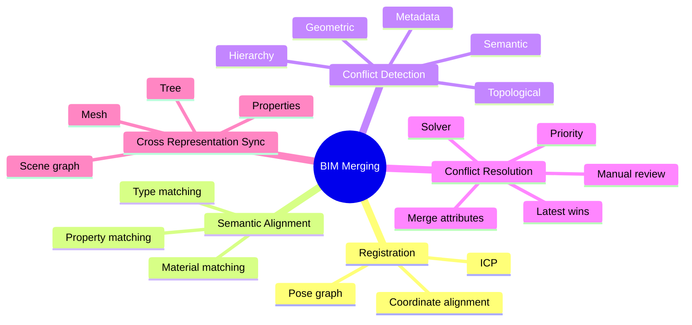

# BIM Merging

> **Definition.** Merging two BIM models into one. Not just mesh merging — semantic, topological, and hierarchy alignment are required.

See [[BIM Merging Overview]] and the [[26. Building Merging and Fusion]] subnotes for the full treatment.

## Quick Map

## Why Merging Is Hard

Two BIM models of the same building can disagree on:

- coordinate systems,
- element types,
- property values,
- connectivity,
- hierarchy.

A naive mesh-merge would produce duplicate elements and contradictions. BIM merging requires semantic alignment, conflict detection, and conflict resolution.

See [[Registration]], [[Semantic Alignment]], [[Conflict Detection]], [[Conflict Resolution]].

## Related Concepts

- [[Registration]]
- [[Semantic Alignment]]
- [[Conflict Detection]]
- [[Conflict Resolution]]
- [[Cross Representation Consistency]]
