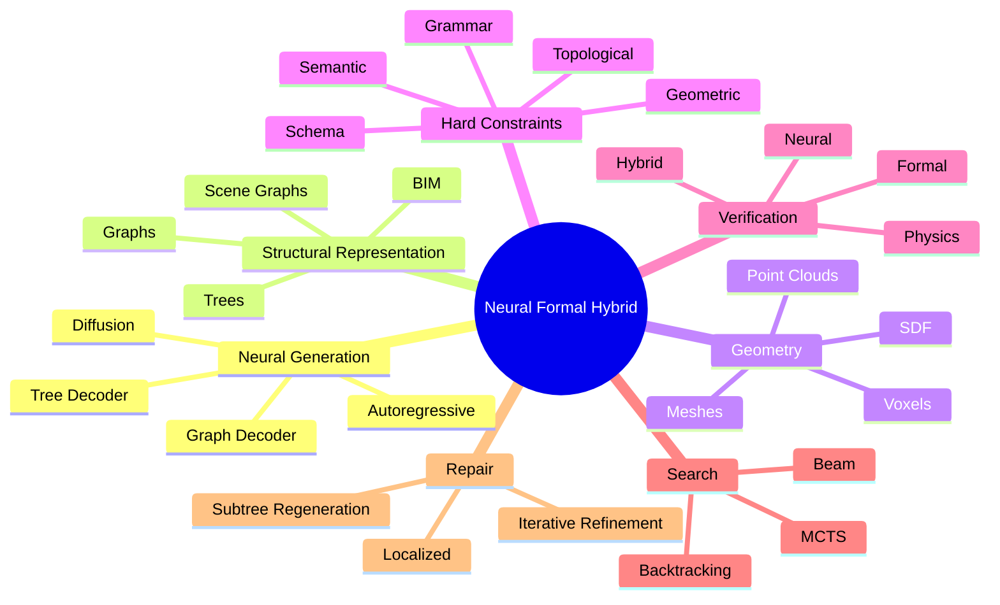

# Neural + Formal Hybrid Systems (Canonical)

> **Definition.** Systems that combine neural generation with formal representations, constraints, verification, search, and repair.

## Components

## Why Hybrid

- Neural alone: plausible but not verifiable.
- Formal alone: verifiable but not scalable / not flexible.
- Hybrid: plausible + verifiable + scalable.

## Open Question

> Can hybrid systems produce outputs that are **both** plausible **and** verifiably valid?

This is the central research question of [[Neural + Formal Hybrid Systems]]. See [[Verifiable Generation]], [[Open Problem — Neural Formal Hybrid Generation]].

## Related Concepts

- [[Verifiable Generation]]
- [[Guided Search]]
- [[Differentiable Solvers]]
- [[Formal Verification]]
- [[Neural Verification]]
- [[Generate Validate Repair]]
