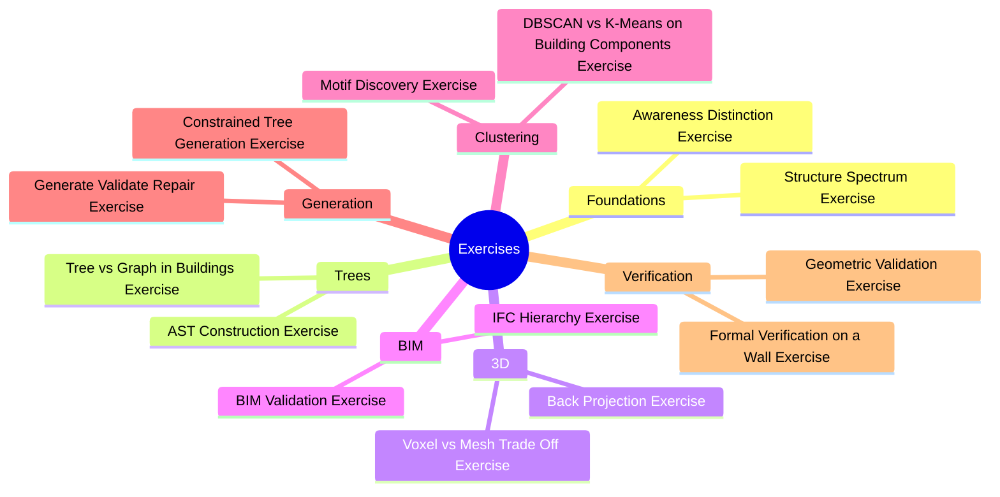

# Exercises MOC

Every exercise is self-contained: background, problem, full solution, reasoning, common wrong approaches, edge cases, and prerequisites. The reader should not need to look elsewhere.

## Concept Map

## Exercises

- [[Awareness Distinction Exercise]]
- [[Structure Spectrum Exercise]]
- [[Tree vs Graph in Buildings Exercise]]
- [[AST Construction Exercise]]
- [[Back Projection Exercise]]
- [[Voxel vs Mesh Trade Off Exercise]]
- [[IFC Hierarchy Exercise]]
- [[BIM Validation Exercise]]
- [[DBSCAN vs K-Means on Building Components Exercise]]
- [[Motif Discovery Exercise]]
- [[Constrained Tree Generation Exercise]]
- [[Generate Validate Repair Exercise]]
- [[Geometric Validation Exercise]]
- [[Formal Verification on a Wall Exercise]]
