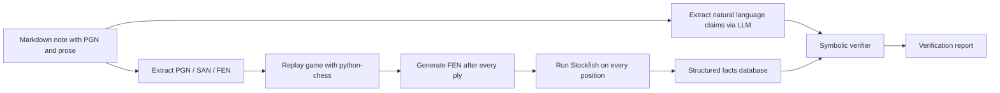

# 00. Map of Content

This is the **Map of Content (MOC)** for the Chess Knowledge Verification System vault. Use it as a launchpad. Each chapter is a folder, and each numbered file inside is a self-contained concept note.

---

## Chapter 1. Project Overview

- [[Chapter 1. Project Overview/1. What is the System|1. What is the System]]
- [[Chapter 1. Project Overview/2. The Core Problem|2. The Core Problem]]
- [[Chapter 1. Project Overview/3. The Goal|3. The Goal]]
- [[Chapter 1. Project Overview/4. Why This Project Matters|4. Why This Project Matters]]

## Chapter 2. System Architecture

- [[Chapter 2. System Architecture/1. High-Level Pipeline|1. High-Level Pipeline]]
- [[Chapter 2. System Architecture/2. The Core Idea Separation of Concerns|2. The Core Idea Separation of Concerns]]
- [[Chapter 2. System Architecture/3. Inputs and Outputs|3. Inputs and Outputs]]
- [[Chapter 2. System Architecture/4. The Facts Database|4. The Facts Database]]

## Chapter 3. Core Components

- [[Chapter 3. Core Components/1. python-chess|1. python-chess]]
- [[Chapter 3. Core Components/2. Stockfish|2. Stockfish]]
- [[Chapter 3. Core Components/3. LLM for Claim Extraction|3. LLM for Claim Extraction]]
- [[Chapter 3. Core Components/4. Symbolic Verifier|4. Symbolic Verifier]]

## Chapter 4. Claim Types and Verification

- [[Chapter 4. Claim Types and Verification/1. Move Descriptions|1. Move Descriptions]]
- [[Chapter 4. Claim Types and Verification/2. Captures|2. Captures]]
- [[Chapter 4. Claim Types and Verification/3. Tactical Claims|3. Tactical Claims]]
- [[Chapter 4. Claim Types and Verification/4. Strategic Claims|4. Strategic Claims]]
- [[Chapter 4. Claim Types and Verification/5. Material Claims|5. Material Claims]]
- [[Chapter 4. Claim Types and Verification/6. Positional Claims|6. Positional Claims]]

## Chapter 5. Research Landscape

- [[Chapter 5. Research Landscape/1. Chess Commentary Generation|1. Chess Commentary Generation]]
- [[Chapter 5. Research Landscape/2. Hybrid Symbolic and Language Models|2. Hybrid Symbolic and Language Models]]
- [[Chapter 5. Research Landscape/3. Neural Chess Commentary Systems|3. Neural Chess Commentary Systems]]
- [[Chapter 5. Research Landscape/4. Datasets|4. Datasets]]
- [[Chapter 5. Research Landscape/5. NLP Applied to Chess|5. NLP Applied to Chess]]
- [[Chapter 5. Research Landscape/6. What Does Not Exist Yet|6. What Does Not Exist Yet]]

## Chapter 6. Existing Tools and Software

- [[Chapter 6. Existing Tools and Software/1. Open Source Tools|1. Open Source Tools]]
- [[Chapter 6. Existing Tools and Software/2. Commercial Software|2. Commercial Software]]
- [[Chapter 6. Existing Tools and Software/3. Why Existing Tools Fall Short|3. Why Existing Tools Fall Short]]

## Chapter 7. Novelty and Research Value

- [[Chapter 7. Novelty and Research Value/1. What Is Novel|1. What Is Novel]]
- [[Chapter 7. Novelty and Research Value/2. What Is Not Novel|2. What Is Not Novel]]
- [[Chapter 7. Novelty and Research Value/3. Publishing as Research|3. Publishing as Research]]
- [[Chapter 7. Novelty and Research Value/4. Defining the Benchmark|4. Defining the Benchmark]]

## Chapter 8. Implementation Roadmap

- [[Chapter 8. Implementation Roadmap/1. Step by Step Build Plan|1. Step by Step Build Plan]]
- [[Chapter 8. Implementation Roadmap/2. Architecture Decisions|2. Architecture Decisions]]
- [[Chapter 8. Implementation Roadmap/3. Evaluation Strategy|3. Evaluation Strategy]]
- [[Chapter 8. Implementation Roadmap/4. Long Term Vision|4. Long Term Vision]]

## Chapter 9. Worked Examples and Exercises

- [[Chapter 9. Worked Examples and Exercises/1. Example Sicilian Middlegame|1. Example Sicilian Middlegame]]
- [[Chapter 9. Worked Examples and Exercises/2. Exercise Move Description Verification|2. Exercise Move Description Verification]]
- [[Chapter 9. Worked Examples and Exercises/3. Exercise Capture Claim Verification|3. Exercise Capture Claim Verification]]
- [[Chapter 9. Worked Examples and Exercises/4. Exercise Tactical Claim Verification|4. Exercise Tactical Claim Verification]]
- [[Chapter 9. Worked Examples and Exercises/5. Exercise Material Claim Verification|5. Exercise Material Claim Verification]]

## Chapter 10. Appendix

- [[Chapter 10. Appendix/1. Glossary|1. Glossary]]
- [[Chapter 10. Appendix/2. Key Papers and References|2. Key Papers and References]]
- [[Chapter 10. Appendix/3. Common Mistakes and Pitfalls|3. Common Mistakes and Pitfalls]]
- [[Chapter 10. Appendix/4. Tips and Tricks|4. Tips and Tricks]]

---

## The Big Picture

This single picture captures the entire pipeline. Every chapter in this vault is, in one way or another, an expansion of one of those boxes.
