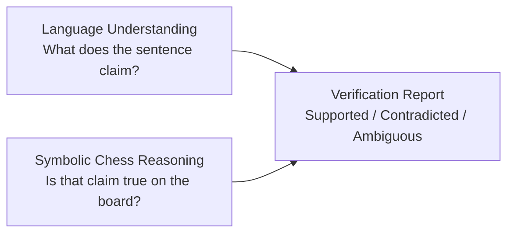
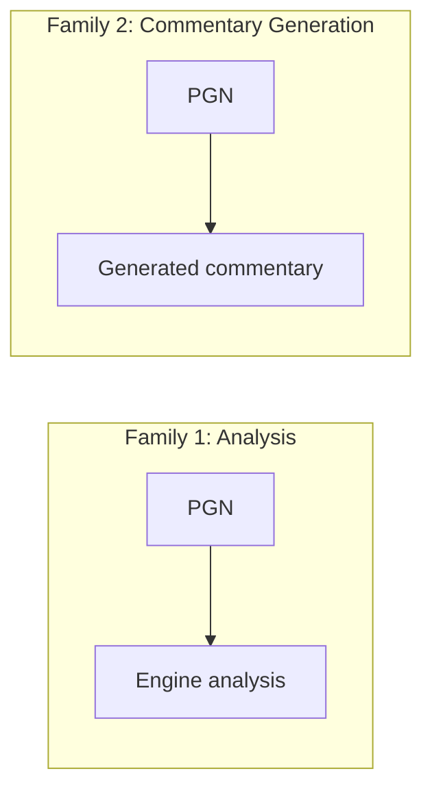
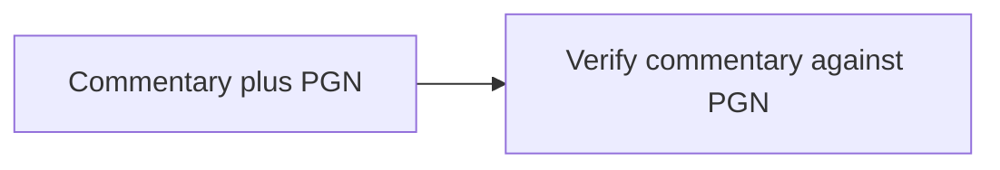
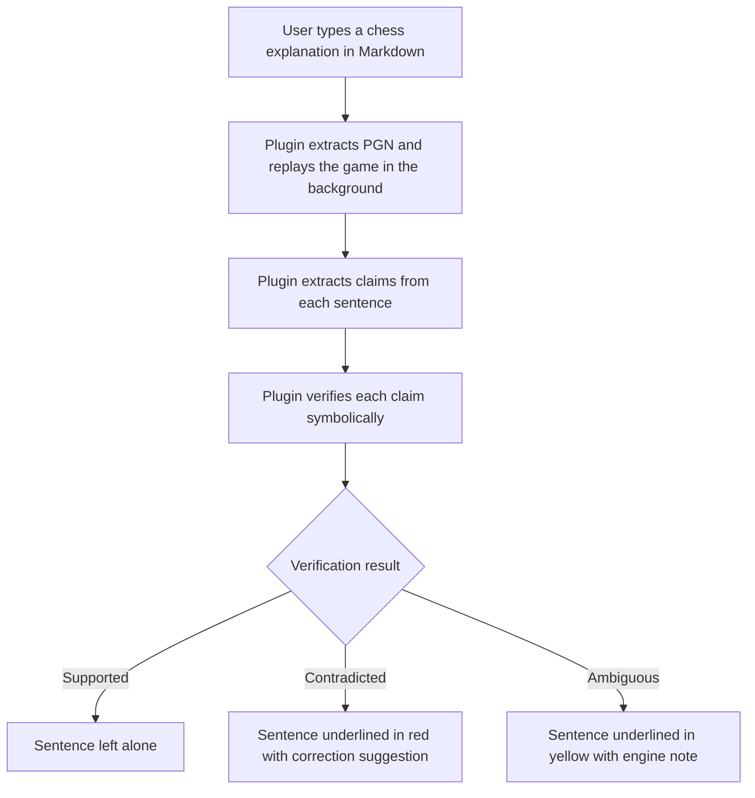

# 1. What is the System

> **One-sentence definition**: The project is an automated **chess knowledge verification system** that reads educational chess notes (Markdown + PGN + free-form English) and determines whether every written explanation is actually supported by the chess game or position it references.

This note expands that one sentence into a full mental model. Read it once carefully, then return to it whenever a later chapter starts to feel abstract.

---

## 1.1 The System in Plain English

Chess teachers, authors, and increasingly **LLMs** produce written explanations of chess positions and games. These explanations are usually embedded in Markdown notes, blog posts, or Obsidian vaults. A typical note looks like this:

```markdown
# Sicilian Middlegame

1. e4 c5
2. Nf3 d6
...

White sacrifices the bishop on h7 to expose the king.

Black accepts the sacrifice.

The queen joins the attack.

White wins a rook.
```

A reader trusts that every sentence is consistent with the moves listed above it. **The proposed system automates that trust.** It reads the note, replays the game, and verifies each sentence against the actual board state produced by those moves.

> [!note] Crucial distinction
> The system **does not teach chess**. It does not generate commentary. It does not analyze games in the conventional sense. It acts as a **fact-checker** for chess educational content — the equivalent of a spell-checker or grammar-checker, but for chess correctness.

---

## 1.2 The "Fact-Checker" Analogy

A spell-checker compares words in a document against a dictionary. A grammar-checker compares sentence structure against syntactic rules. The chess knowledge verification system compares chess explanations against **the ground truth of the board**.

| Type of checker | Source of truth | What it flags |
|---|---|---|
| Spell-checker | Dictionary | Words that do not exist |
| Grammar-checker | Syntactic rules | Sentences that are structurally wrong |
| **Chess knowledge verifier** | **Board state from PGN replay + engine analysis** | **Sentences that do not match the actual game** |

This analogy is more than decorative. It tells you what the system is **not** responsible for. A spell-checker does not rewrite your essay. It does not improve your argument. It only flags incorrect spelling. The chess verifier is similarly scoped: it flags inconsistencies between prose and board. It does not replace the human author, it does not choose better moves, and it does not generate alternative commentary (although, as a future feature, it could suggest corrections).

---

## 1.3 What Counts as "Chess Knowledge" Here

The system is concerned with **factual chess statements**, not aesthetic or pedagogical ones. Concretely, it cares about:

- **Move descriptions**: "The knight jumps to e5."
- **Captures**: "The bishop captures the rook."
- **Tactical patterns**: "White forks the king and queen."
- **Material claims**: "White wins a pawn."
- **Positional / strategic claims**: "Black's king is exposed."
- **Game-state claims**: "It is checkmate." / "White is in zugzwang."

It does **not** care about:

- Stylistic preferences: "This is an elegant way to handle the position."
- Pedagogical framings: "Beginners should memorize this pattern."
- Historical commentary: "This resembles Karpov's style."
- Emotional reactions: "A stunning sacrifice."

That said, the boundary is fuzzy. "A stunning sacrifice" implicitly asserts that a sacrifice occurred, so the verifier should at minimum confirm that a sacrifice did happen. Straddling that boundary is one of the design challenges covered in [[Chapter 4. Claim Types and Verification/4. Strategic Claims|4. Strategic Claims]].

---

## 1.4 The Three Pillars

The system is built on three pillars that must remain **strictly separated** in the implementation:



1. **Language understanding** — extract structured factual claims from English prose. This is the LLM's job, but it is **only** the LLM's job.
2. **Symbolic chess reasoning** — given a structured claim, check whether it is true against the actual board state. This is python-chess + Stockfish territory, and **no LLM is involved** in this step.
3. **Verification report** — combine the two streams into a human-readable verdict per claim.

> [!warning] The most common architecture mistake
> Novices try to use an LLM to do both steps 1 and 2 ("read this position and tell me if this sentence is true"). That route produces hallucinations. The whole point of this project is to keep step 2 symbolic. See [[Chapter 2. System Architecture/2. The Core Idea Separation of Concerns|2. The Core Idea Separation of Concerns]].

---

## 1.5 How It Differs From Existing Chess Software

Almost every chess tool you have ever used belongs to one of two families:



This project is a **third family**:



That third family is, as far as a literature search can tell, **largely unexplored**. This is what makes the project novel and what justifies treating it as a research contribution rather than a weekend hack. See [[Chapter 5. Research Landscape/6. What Does Not Exist Yet|6. What Does Not Exist Yet]] and [[Chapter 7. Novelty and Research Value/1. What Is Novel|1. What Is Novel]] for the full argument.

---

## 1.6 What the User Sees

For an end user — say, an Obsidian author writing chess notes — the final experience should feel like the inline squiggly lines in a word processor:



This "spell-checker for chess" experience is the long-term vision. The system can be useful long before reaching that stage — for example, as a CLI that scans a vault and emits a verification report — but it is useful to keep the final vision in mind because it shapes many design decisions (latency, accuracy thresholds, what counts as a tolerable false positive).

---

## 1.7 Required Background Knowledge

If any of the following feels unfamiliar, slow down and review it before moving on:

- **PGN (Portable Game Notation)** — the standard text format for recording chess games.
- **SAN (Standard Algebraic Notation)** — the move notation used inside PGN, e.g. `Nf3`, `Bxh7+`, `O-O`, `Qxe8#`.
- **FEN (Forsyth-Edwards Notation)** — a single-line description of a board position.
- **ply vs. move** — a ply is one half-move (one player's move); a move is two plies (White + Black).
- **python-chess** — the de facto Python library for parsing PGN, generating FENs, checking legality, and querying the board.
- **Stockfish** — the strongest open-source chess engine, used for evaluation and tactical verification.
- **Hallucination** — an LLM producing fluent text that is factually wrong; the central failure mode this project targets.

If you can confidently define each of those, you are ready for the rest of the vault. If not, [[Chapter 10. Appendix/1. Glossary|1. Glossary]] has definitions.

---

## 1.8 Key Reminders

- The system **verifies**, it does not **generate**. That single distinction is what makes it novel.
- The LLM is used **only** for claim extraction, never for judging truth.
- Symbolic chess reasoning (python-chess + Stockfish) is the **only** source of ground truth.
- The output is a **detailed report**, not a single correct/incorrect flag.
- The long-term goal is an Obsidian plugin that behaves like a spell-checker for chess.
- "Chess knowledge" in this project means **factual claims about moves and positions**, not stylistic commentary.
- The boundary between factual and stylistic claims is fuzzy and must be handled carefully (Chapter 4).
