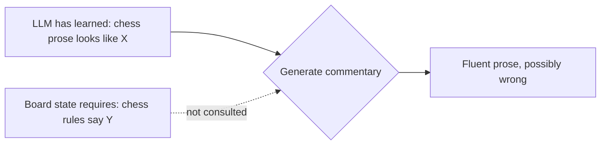
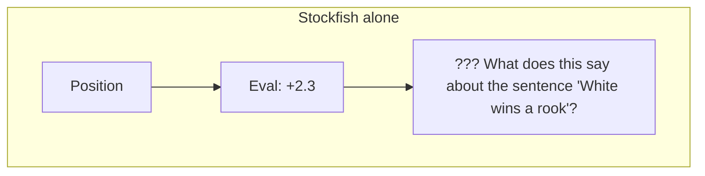

# 2. The Core Problem

> **The problem in one sentence**: Large Language Models are increasingly used to generate chess educational content, but they routinely produce fluent-sounding explanations that are factually wrong with respect to the chess position, and there is currently no automated system that catches these errors.

This note breaks the problem into three parts: **why LLMs make these mistakes**, **what kinds of mistakes they make**, and **why existing tools do not help**.

---

## 2.1 Why LLMs Hallucinate About Chess

LLMs are trained mostly on natural language. Even when their training data includes chess commentary, they learn the **statistical shape** of chess prose — not the rules of the game. This leads to a fundamental mismatch:

The LLM has no internal chess engine. It does not actually know whether a knight is on f3 or whether the bishop can reach h7. It generates text that **sounds like** chess commentary because that is what its training distribution rewards. When the prose is then attached to a real game, mismatches appear.

This problem gets worse as the game gets longer. Move 5? The LLM can probably keep the position in its head. Move 35? Almost certainly not. By move 35, even a strong LLM will start mixing up which pieces are still on the board, who is in check, and whose turn it is.

> [!info] The "long game" failure mode
> Empirically, LLM chess explanations degrade sharply after about 15-20 plies. By that point, the model has lost track of the board state and is generating commentary from prior text alone, not from any internal representation of the position. This is a major source of hallucinations and one of the strongest motivations for symbolic grounding.

---

## 2.2 The Six Canonical Mistakes

The project's source material identifies six recurring categories of LLM mistakes. Memorize them — every claim type in [[Chapter 4. Claim Types and Verification/1. Move Descriptions|Chapter 4]] is designed to catch one of these.

### 2.2.1 Describing a Move That Never Happened

The LLM says "White plays Nf3" but the actual move was `Nc3`. The position is fine, the move is legal, the piece type is right — it is just **not the move that was played**.

This is the most common failure. It is also the easiest to detect: compare the claimed move against the PGN. There is no ambiguity, no judgment call, no engine evaluation required. Pure string / SAN comparison.

### 2.2.2 Referring to the Wrong Piece

The LLM says "The knight captures on e5" but the actual move was `Bxe5`. The destination square is right, the capture is right, but the **piece type is wrong**. This often happens when the LLM has lost track of which pieces are on which squares.

Detection is still mechanical (compare piece type of the played move against the claimed piece type), but the verification report needs to explain the discrepancy clearly: "You said knight, but the move was a bishop."

### 2.2.3 Claiming a Capture That Is Impossible

The LLM says "The bishop captures the rook on a8" but the bishop is on c1 and has no diagonal to a8, or there is no rook on a8 to capture. The claim describes something that **could not legally happen** from this position.

Detection requires legality checking, which python-chess handles natively. This is also where you start to see the value of the symbolic layer: an LLM alone would happily agree with its own impossible claim.

### 2.2.4 Explaining Tactics That Do Not Exist in the Position

The LLM says "White forks the king and queen with the knight on e5" but there is no knight on e5, or there is a knight on e5 but it does not simultaneously attack the king and queen. The LLM has **invented a tactical pattern**.

This is harder to detect than the previous three. It requires the verifier to **reconstruct the tactic** from the board: identify the attacking piece, identify the targets, check that both targets are attacked simultaneously. See [[Chapter 4. Claim Types and Verification/3. Tactical Claims|3. Tactical Claims]].

### 2.2.5 Describing a Position That Does Not Match the PGN

The LLM says "Black has doubled pawns on the c-file" but the actual position has no doubled pawns. Or "White's king is safely castled" but the king is still on e1. The LLM is **describing a different position** than the one the PGN produces.

This often happens when the LLM is conditioned on a header or title that mentions a different opening. Detection requires deriving the actual board state from the PGN and then evaluating the positional claim against it.

### 2.2.6 Inventing Strategic Ideas Unsupported by the Board

The LLM says "White gains control of the center" but White has no central pawn presence. Or "Black's pieces are harmoniously coordinated" but Black's pieces are passive and stepping on each other's squares. The LLM is **importing strategic clichés** that sound right but do not apply.

This is the hardest to detect because strategic claims are inherently fuzzy. The verifier typically has to fall back on engine evaluation, piece activity heuristics, and **confidence scores** rather than binary verdicts. See [[Chapter 4. Claim Types and Verification/4. Strategic Claims|4. Strategic Claims]] and [[Chapter 4. Claim Types and Verification/6. Positional Claims|6. Positional Claims]].

---

## 2.3 Why Existing Tools Do Not Help

You might think: "Can't you just run Stockfish on the position and compare its evaluation to the commentary?" Almost, but not quite. Stockfish gives you an evaluation, not a verification. It tells you who is winning, not whether a specific English sentence is true.

Stockfish cannot answer "did the king actually move to g8?" — that is a question for python-chess. It cannot answer "is the bishop pinned?" with high reliability — that is a question for an attack-map query plus Stockfish's tactical analysis. And it definitely cannot read English; you need the LLM for that.

The mismatch between what existing tools provide and what the verification task needs is the **core gap** the project fills. See [[Chapter 6. Existing Tools and Software/3. Why Existing Tools Fall Short|3. Why Existing Tools Fall Short]] for the full comparison.

---

## 2.4 Why the Problem Is Getting Worse, Not Better

Three trends conspire to make this problem more acute every year:

1. **More LLM-generated chess content.** Chess blogs, study guides, Obsidian vaults, YouTube scripts — a growing fraction is LLM-written or LLM-assisted.
2. **LLMs are getting more fluent.** As prose quality improves, factual errors become **harder to spot by reading**. The text reads naturally even when the moves are wrong.
3. **Longer context windows tempt longer outputs.** Authors now ask LLMs to write 2,000-word annotations of a single game. The longer the output, the more drift accumulates and the harder manual fact-checking becomes.

The combination means the **demand** for automated verification is growing faster than the supply of manual fact-checkers. This is the social reason the project matters; see [[Chapter 1. Project Overview/4. Why This Project Matters|4. Why This Project Matters]].

---

## 2.5 Why Not Just Use a Stronger LLM?

A natural objection: "GPT-5 (or Claude 4, or whatever) is much better at chess than GPT-3 was. Won't this problem solve itself?"

Probably not, for three reasons:

- **No internal board state.** LLMs generate text token by token. They do not maintain a board representation. Even a model that has memorized thousands of games cannot reliably track a novel position across 40 plies.
- **Confident errors.** As models get stronger, their errors get **more confident**, not less. A weaker model says "I think the knight is on f3"; a stronger model says "The knight on f3 attacks the e5 pawn" with no hedging — even when the knight is on d2.
- **No mechanism for symbolic truth.** Without an external oracle, an LLM has no way to distinguish "this sentence is true" from "this sentence sounds true." Scaling parameters does not change that.

This is why the project's central design decision is to keep the **truth-checking step outside the LLM**. The LLM gets better at extracting claims, the engine stays exact, and the combination improves with each generation of LLM without ever depending on the LLM to be the source of truth.

---

## 2.6 The Cost of Being Wrong

It is worth being explicit about what is at stake when chess commentary is wrong.

- **Pedagogical damage.** A beginner who memorizes a wrong explanation learns a wrong pattern. They will misapply it later and not understand why.
- **Trust erosion.** When a reader catches one error, they start distrusting everything in the note. The educational value of the whole note collapses.
- **Scale.** A single wrong note is bad. A wrong note that gets scraped and reposted across a hundred LLM-generated blogs is much worse — the error propagates.
- **Hallucination laundering.** When an LLM writes a wrong note, that note becomes training data for the next LLM, which is then more likely to repeat the wrong claim. Automated verification is the only realistic way to interrupt this loop.

---

## 2.7 Key Reminders

- The LLM has no internal chess engine. It produces commentary from text statistics, not from board state.
- Six canonical mistakes: wrong move, wrong piece, impossible capture, fake tactic, wrong position description, fake strategic idea.
- Stockfish alone cannot solve this — it gives evaluations, not verdicts about English sentences.
- Stronger LLMs do not solve this — they produce more confident errors, not fewer.
- The problem grows with output length: 20-ply drift is real.
- Cost of being wrong: pedagogical damage, trust erosion, error propagation through training data.
- The verification step must be **outside the LLM**. That is the project's central architectural commitment.
