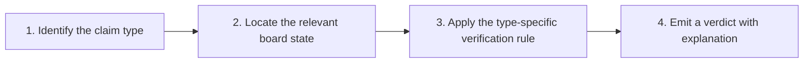

# 3. The Goal

> **The goal in one sentence**: Automatically inspect an entire collection of chess notes and verify that every explanation is consistent with the actual game or position it references — and produce a detailed, per-claim report rather than a single correct/incorrect flag.

This note explains what "verify" means operationally, what the system must produce, and what success looks like.

---

## 3.1 The Concrete Target

Given a Markdown note that contains a PGN block and one or more English sentences, the system should be able to output, for **every factual claim** in the prose, one of the following verdicts:

| Verdict | Meaning | Example |
|---|---|---|
| **Verified** | The claim is unambiguously supported by the board state. | "The bishop is sacrificed." when the PGN contains `Bxh7+`. |
| **Contradicted** | The claim is unambiguously false given the board state. | "Black captures the bishop." when Black actually declined the sacrifice. |
| **Supported (soft)** | The claim is supported by engine analysis but is not a binary fact. | "The king becomes exposed." when Stockfish confirms king safety dropped sharply. |
| **Ambiguous** | The claim cannot be confidently verified or refuted. | "White has the initiative." in a balanced position. |
| **Cannot verify automatically** | The claim type is not yet handled. | "This is a beautiful combination." |
| **Possible hallucination** | No evidence for the claim exists in the game or position. | "White wins a rook." when no material change occurs. |

Note the **six** verdicts, not two. The system is not a binary classifier. It is a structured reporter.

> [!warning] Common scope creep
> Beginners try to collapse this to "correct" vs "incorrect". That loses too much information. The whole point of the report format is to distinguish **"the LLM said something false"** (Contradicted) from **"the LLM said something we cannot check"** (Cannot verify) from **"the LLM invented something out of thin air"** (Possible hallucination). Those are very different failure modes and require different responses.

---

## 3.2 The Example End-to-End

The source material gives this concrete example. Study it carefully — it is the canonical "what good output looks like" reference.

**Input Markdown:**

```markdown
# Sicilian Middlegame

1. e4 c5
2. Nf3 d6
...

White sacrifices the bishop on h7 to expose the king.

Black accepts the sacrifice.

The queen joins the attack.

White wins a rook.
```

**Expected output:**

```
Line 24
"The bishop is sacrificed."
Verified.
--------------------------------
Line 28
"Black captures the bishop."
Incorrect.
Black actually declined the sacrifice.
--------------------------------
Line 31
"The king becomes exposed."
Supported.
--------------------------------
Line 42
"White wins a rook."
No material gain occurs.
Possible hallucination.
```

Notice several things:

- **Line numbers are reported.** The author needs to know exactly where the problem is in the source Markdown.
- **Verbatim quotes are reported.** The author does not need to cross-reference; the offending sentence is right there.
- **Verdicts vary.** Not every line gets the same label.
- **Explanations are concrete.** "Black actually declined the sacrifice" tells the author the specific board fact that contradicts the prose. It does not just say "wrong".
- **Hallucinations are flagged explicitly.** "Possible hallucination" is a stronger warning than "Incorrect" because it signals that **nothing in the game supports the claim at all**.

---

## 3.3 Scope: What the Goal Includes and Excludes

### In scope

- Markdown notes containing PGN, SAN, FEN, or any combination.
- Notes with multiple games or multiple positions.
- Free-form English explanations attached to those games.
- Per-claim verification with structured verdicts.
- A human-readable report (text, Markdown, or HTML).
- Optionally, a JSON / machine-readable version of the same report.

### Out of scope (at least initially)

- **Real-time editing feedback** (the Obsidian plugin vision — covered as a long-term goal, not a v1 deliverable).
- **Generating replacement commentary** for failed claims.
- **Verifying non-chess content** (e.g., historical anecdotes, player biographies).
- **Verifying tactical correctness of the game itself** (the system does not judge whether the moves were good; it judges whether the prose matches the moves).
- **Multi-language support** (initial English-only; later extensible).

> [!tip] Stay focused on v1
> It is tempting to design the system to handle every possible claim type from day one. Resist that. The minimum viable system handles **move descriptions, captures, and material claims** — these are the highest-volume, easiest-to-verify claims, and they catch the majority of LLM mistakes. Tactical and strategic claims can be layered in later. See [[Chapter 8. Implementation Roadmap/1. Step by Step Build Plan|1. Step by Step Build Plan]].

---

## 3.4 What "Verify" Means Precisely

The word "verify" is overloaded. In this project, it means **the following four-step procedure** for each claim:



1. **Identify the claim type.** Is this a move description, a capture claim, a tactical claim, etc.? The LLM is responsible for this classification during claim extraction.
2. **Locate the relevant board state.** Which ply does the claim refer to? Often this is implicit ("after the bishop sacrifice" → the ply right after `Bxh7+`). Sometimes the LLM has to infer it from context.
3. **Apply the type-specific verification rule.** For "the knight moved to e5", the rule is: the SAN of the move at that ply must match `N` piece type and `e5` destination. For "White wins a rook", the rule is: material delta between pre-move and post-move (or between start and end of the relevant sequence) shows White gaining a rook. Each claim type has its own rule, fully specified in [[Chapter 4. Claim Types and Verification/1. Move Descriptions|Chapter 4]].
4. **Emit a verdict with explanation.** Always include both the verdict label and a one-sentence explanation that points to the specific board fact that drove the verdict.

The fourth step is what makes the output usable. A bare "Incorrect" with no explanation is almost as bad as no output — the author cannot fix what they cannot understand.

---

## 3.5 Success Criteria

How do you know the system is actually working? Three metrics, in increasing order of ambition:

### 3.5.1 Mechanical correctness on binary claims

For claims that have an unambiguous yes/no answer (move descriptions, captures, material counts), the system should agree with a human checker on at least **95%** of cases. The remaining 5% should be borderline cases where the human checker themselves is unsure.

### 3.5.2 Reasonable behavior on soft claims

For strategic and positional claims where the verdict is fuzzy, the system should produce verdicts that a panel of chess players would rate as "defensible" at least 80% of the time. It does not need to match any single human's judgment, but it should not produce verdicts that look obviously wrong.

### 3.5.3 Useful on real-world LLM output

The ultimate test: run the system on 100 LLM-generated chess notes. The output should flag at least 80% of the errors that a human expert would flag, and the false-positive rate (claims flagged as wrong that are actually correct) should be below 10%. This is the bar that makes the system worth deploying.

> [!info] Why these specific numbers
> 95% / 80% / 10% are not magic — they are practical. Below 95% on binary claims, users stop trusting the system. Below 80% on soft claims, the system adds noise rather than signal. Above 10% false positives, authors start ignoring warnings (the "boy who cried wolf" problem). These thresholds should be revisited as the system matures, but they are a reasonable starting target.

---

## 3.6 The Definition of Done for v1

A concrete checklist for "v1 is done":

- [ ] Given a Markdown file with one PGN block and prose, the system extracts the PGN.
- [ ] The system replays the game using python-chess and produces a FEN for every ply.
- [ ] The system uses an LLM to extract structured claims from the prose, each claim tagged with a type and a target ply.
- [ ] For each claim, the system applies the appropriate verification rule and produces a verdict.
- [ ] The system writes a Markdown report with line numbers, verbatim quotes, verdicts, and one-sentence explanations.
- [ ] The system handles at least three claim types: move descriptions, captures, and material claims.
- [ ] The system runs end-to-end on a test vault of at least 10 notes without crashing.
- [ ] The system achieves ≥95% agreement with a human checker on a held-out test set of binary claims.

If all eight items are checked, you have a credible v1. Everything beyond that — tactical claims, strategic claims, the Obsidian plugin, the public benchmark — is v2 and beyond.

---

## 3.7 Key Reminders

- The goal is a **detailed report**, not a binary flag.
- Six verdicts: Verified, Contradicted, Supported (soft), Ambiguous, Cannot verify, Possible hallucination.
- Line numbers and verbatim quotes are mandatory in the report.
- "Verify" means: identify claim type → locate board state → apply rule → emit verdict with explanation.
- v1 should handle move descriptions, captures, and material claims only.
- Success bar: 95% agreement on binary claims, defensible on 80% of soft claims, ≤10% false-positive rate on real LLM output.
- The Definition of Done checklist above is the single most useful scoping tool in this chapter.
