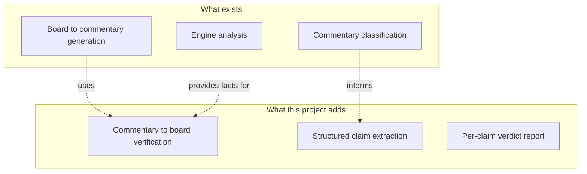
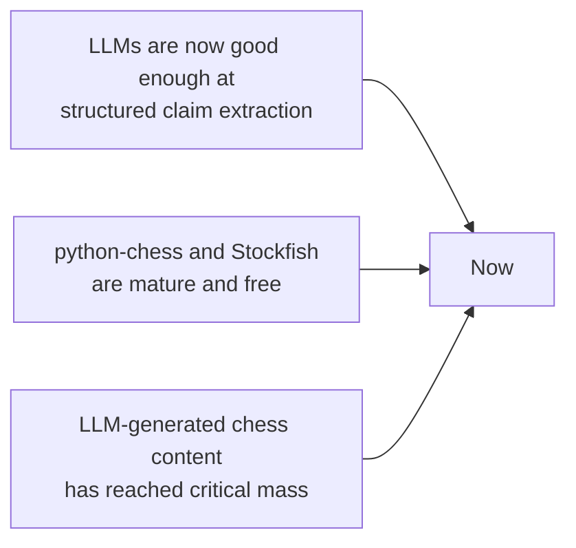

# 4. Why This Project Matters

> **Why this matters in one sentence**: As LLM-generated chess content floods the internet, the only realistic way to keep it factually honest is to build automated verifiers — and nobody has built one yet.

This note makes the case for the project across four dimensions: **pedagogical**, **research**, **commercial**, and **ethical**. Use it when you need to justify the project to yourself, to a collaborator, or to a funder.

---

## 4.1 The Pedagogical Case

Chess is unusual among intellectual disciplines because it has an **exact ground truth**: the rules of the game and the resulting board state. There is no room for opinion about whether a move was legal, whether a piece is on a particular square, or whether a capture occurred. Either it did or it did not.

This makes chess the **ideal testbed** for grounded AI. If we cannot build a verifier for chess — a domain with unambiguous truth — we have no hope of building verifiers for history, law, medicine, or any domain where ground truth is fuzzier. Conversely, if we can build one for chess, the architectural lessons transfer: **separate language understanding from symbolic reasoning, treat the LLM as a claim extractor, treat the symbolic engine as the source of truth**.

For students specifically, the impact is direct. A student reading an LLM-generated study guide currently has two options:

1. **Trust the guide** and risk learning wrong patterns.
2. **Manually replay every move on a board** and check every sentence against the resulting position.

Option 1 is dangerous. Option 2 is so tedious that almost nobody does it consistently. A verification system collapses both options into a third: **trust the guide because a verifier has already checked it**. That is a massive improvement in the cost-quality tradeoff of self-study.

---

## 4.2 The Research Case

The research case is detailed in [[Chapter 7. Novelty and Research Value/1. What Is Novel|1. What Is Novel]] and [[Chapter 5. Research Landscape/6. What Does Not Exist Yet|6. What Does Not Exist Yet]]. The short version:

- **Generation is well-studied.** Many papers generate chess commentary from board state.
- **Verification is not studied.** No paper or open-source project explicitly formulates "given commentary + PGN, verify the commentary" as a task.
- **The combination is novel.** The pipeline of "LLM for claim extraction + symbolic engine for verification + structured report" is, as far as the literature search can tell, new.

That makes this project a **genuine research contribution**, not just an engineering exercise. With rigorous evaluation (Chapter 8.3), it could plausibly become a workshop paper at NLP or AI venues, or a demo paper at an education-AI venue.

The diagram shows how the project sits on top of existing research without duplicating any of it. Every arrow is a place where this project reuses prior work; every box in group B is a place where this project does something new.

---

## 4.3 The Commercial Case

There is a real market for this. Potential paying users include:

- **Chess course creators** who want to ship error-free material and avoid the reputational damage of public corrections.
- **Publishers of chess books** who currently rely on human fact-checkers and could massively reduce cost with automation.
- **Platforms that host user-generated chess content** (Lichess studies, Chess.com forums, personal blogs) and want to flag suspect content automatically.
- **AI educational platforms** that need a credibility moat — "our explanations are verified by an engine" is a strong marketing claim.
- **Chess streamers and YouTubers** who script their content and want to avoid embarrassing on-air mistakes.

None of these users have a tool today that does what this project does. They either rely on manual checking (slow, expensive, error-prone) or skip checking entirely (risky). The willingness to pay is there; the product is not.

> [!tip] Product framing
> When pitching this commercially, lead with **"spell-checker for chess"**. Everyone has used a spell-checker. Nobody needs the architecture explained. The pitch is "your chess notes get the same inline warning treatment that your prose does, but for factual correctness instead of spelling." That framing is universally understood in under thirty seconds.

---

## 4.4 The Ethical Case

LLM-generated content is increasingly indistinguishable from human-written content. When an LLM hallucinates a chess explanation and that explanation gets reposted, the error enters the training data of the next LLM, which then becomes more likely to repeat the error. This is **hallucination laundering**, and it is a real long-term risk to the integrity of online chess education.

An automated verifier interrupts this loop in two ways:

1. **At authoring time.** If the verifier runs while the author writes, errors get caught before publication.
2. **At ingestion time.** If verifiers are used to filter training data, the next generation of LLMs is trained on cleaner data, raising the floor for everyone.

The second use case is speculative but important. It positions the project not just as a tool for individual authors but as **infrastructure for the chess-AI ecosystem**. That framing is what justifies treating the verifier as a public good (open-source, released datasets, public benchmarks) rather than a proprietary product.

---

## 4.5 Why Now

Three trends converge to make this project uniquely well-timed:

- **LLMs are now good enough at structured claim extraction.** Two years ago, asking an LLM to output a JSON claim list with consistent types was unreliable. Today, with structured output APIs, it is routine. The project depends on this capability.
- **python-chess and Stockfish are mature and free.** The symbolic layer is essentially solved. We do not need to build a chess engine; we need to glue one to an LLM.
- **LLM-generated chess content has reached critical mass.** There is now enough suspect content in the wild to justify building a verifier. Two years ago, the volume was too low to matter; in two more years, the volume will be so high that a verifier will be mandatory infrastructure.

The window is now. Building this in 2020 would have been premature (LLMs were not ready). Building it in 2027 will be redundant (someone else will have done it). The middle of the decade is the right time.

---

## 4.6 Who Benefits

| Group | How they benefit |
|---|---|
| Self-learners | Trustworthy study material; less time spent double-checking. |
| Chess authors | Faster workflow; fewer corrections after publication. |
| Publishers | Lower fact-checking cost; higher credibility. |
| Platform operators | Automated content quality signals. |
| LLM researchers | A new benchmark for grounded AI. |
| Educators | A teaching aid that catches LLM mistakes before they reach students. |
| The next generation of LLMs | Cleaner training data, if verifiers are used at ingestion time. |

The breadth of beneficiaries is itself an argument for the project. Tools that help a single niche tend to wither; tools that help an entire ecosystem tend to compound.

---

## 4.7 What Happens If We Do Not Build It

The counterfactual is worth stating plainly. If no one builds an automated chess commentary verifier in the next two years:

- LLM-generated chess content will continue to proliferate, with hallucinations baked in.
- Beginners will absorb wrong patterns and pass them on.
- Authors who care about correctness will spend increasing fractions of their time on manual fact-checking.
- The "grounded AI" research community will continue to focus on generation rather than verification, missing half the problem.

The cost of inaction is not catastrophic for chess specifically — chess is, after all, just a game — but it is symptomatic of a wider failure to take verification seriously in the LLM era. Chess is the canary in the coal mine for grounded AI. If we cannot verify chess commentary, we cannot verify anything.

---

## 4.8 Key Reminders

- Chess has exact ground truth, which makes it the ideal testbed for grounded AI.
- The project is a genuine research contribution, not just engineering.
- The commercial case is real: authors, publishers, and platforms all need this and have no current solution.
- The ethical case rests on interrupting the hallucination-laundering loop.
- Three trends make now the right time: LLMs are good at structured output, engines are free, content volume is critical.
- "Spell-checker for chess" is the right product framing — universally understood in 30 seconds.
- If we do not build it, the broader grounded-AI research community misses an obvious and important half of the problem.
