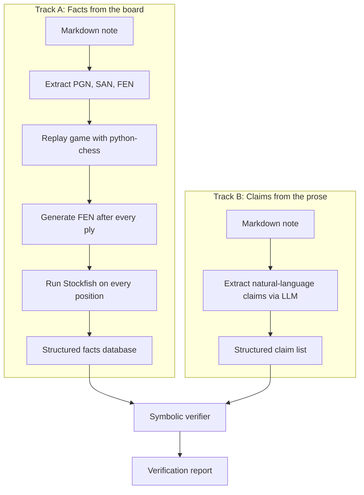
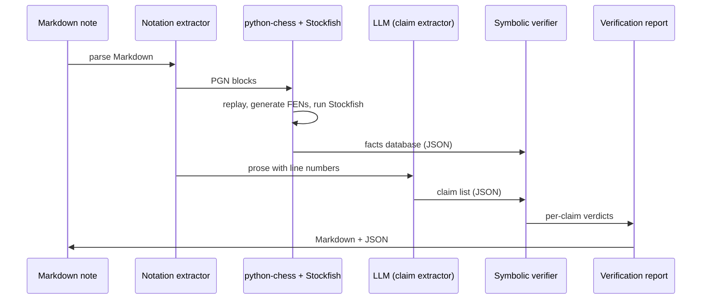

# 1. High-Level Pipeline

> **The pipeline in one sentence**: Markdown notes go in, the system extracts PGN/SAN/FEN, replays the game with python-chess, runs Stockfish on every relevant position, extracts structured claims from the prose with an LLM, and feeds both into a symbolic verifier that emits a per-claim verdict.

This note describes the pipeline in full. Every later chapter is, in effect, a deep dive on one box in the diagram below.

---

## 1.1 The Two Parallel Tracks

The pipeline has **two parallel tracks** that converge at the verifier:



- **Track A** is deterministic. Given the same input, it always produces the same output. There is no LLM in this track.
- **Track B** is probabilistic. The LLM extracts claims and may classify them slightly differently on each run. This is fine — claim extraction is fuzzy by nature — but you should cache results and use temperature 0 where possible.
- The **verifier** is deterministic given its two inputs (facts database and claim list). All nondeterminism lives in Track B.

> [!warning] Do not let the LLM touch Track A
> The most common architectural mistake is to ask the LLM to "read the position" or "describe what happened in the game". That puts the LLM in Track A and reintroduces hallucination. Track A is sacred: only python-chess and Stockfish live there.

---

## 1.2 Step-by-Step Description

### Step 1: Markdown intake

The system reads a Markdown file. It does not yet interpret chess content — it just identifies:

- The file path (for reporting).
- The full text (for line numbers and verbatim quotes).
- The byte offsets of each line (so we can map claims back to source positions).

### Step 2: Extract chess notation

A regex-based extractor finds:

- **PGN blocks** — multi-line code blocks that look like PGN (move text, headers, optional comments).
- **Inline SAN** — patterns like `1. e4 c5 2. Nf3` appearing outside code blocks.
- **FEN strings** — single-line strings matching the FEN format.
- **Chess diagrams** — Obsidian-specific syntax (e.g., `chessboard:` plugin calls) that reference a position directly.

Each extracted block is tagged with its source line range. This is critical for reporting: when the verifier flags a claim, it must be able to tell the author which game or position the claim refers to.

### Step 3: Replay the game

For each PGN block, the system uses `python-chess.pgn.read_game()` to parse it into a sequence of moves. Each move is replayed on a `chess.Board()`, producing:

- A board state **before** the move (the position the player saw).
- The move itself, in SAN and UCI form.
- A board state **after** the move (the resulting position).

If parsing fails (illegal move, malformed PGN), the system records an error and skips that block rather than crashing.

### Step 4: Generate FEN after every ply

For every ply (half-move) in the game, the system records:

```text
ply_index: int
san: str              # e.g. "Nf3"
uci: str              # e.g. "g1f3"
fen_before: str       # FEN before the move
fen_after: str        # FEN after the move
mover: "white" | "black"
move_number: int      # full-move number
```

This is the **atomic unit of the facts database**. Every claim refers to one or more of these records.

### Step 5: Run Stockfish on every position

For every FEN in the database, the system runs Stockfish to get:

- **Static evaluation** in centipawns (or mate-in-N).
- **Best move** (the engine's top recommendation).
- **Principal variation** (the engine's main line, typically 8-15 plies).
- **Depth** reached (for confidence assessment).

This is the most expensive step. For a 40-ply game, you need 40 engine evaluations. At ~100ms per evaluation (depth 15-20), that is 4 seconds per game — acceptable for offline verification, painful for real-time use. See [[Chapter 8. Implementation Roadmap/2. Architecture Decisions|2. Architecture Decisions]] for caching strategy.

### Step 6: Build the facts database

All of the above is stored in a structured format. A simple JSON schema:

```json
{
  "game_id": "sicilian-middlegame",
  "source_file": "notes/sicilian.md",
  "pgn_block_line_range": [3, 12],
  "plies": [
    {
      "ply_index": 0,
      "san": "e4",
      "uci": "e2e4",
      "fen_before": "rnbqkbnr/.../w",
      "fen_after": "rnbqkbnr/.../w",
      "mover": "white",
      "move_number": 1,
      "stockfish": {
        "depth": 18,
        "eval_cp": 30,
        "best_move": "c5",
        "pv": ["c5", "Nf3", "d6", "d4"]
      }
    }
  ]
}
```

This database is **the only thing the verifier reads**. It is the ground truth. The LLM never sees raw PGN; the LLM only sees the prose and produces claims.

### Step 7: Extract claims from prose (Track B)

In parallel, the system sends the **prose only** (the English sentences, with their source line numbers) to the LLM and asks for a structured claim list:

```json
[
  {
    "claim_id": 1,
    "source_line": 24,
    "source_text": "The bishop is sacrificed.",
    "claim_type": "capture",
    "actor": "white",
    "piece": "bishop",
    "target": "h7",
    "is_sacrifice": true,
    "target_ply_index": null
  }
]
```

Notice `target_ply_index: null`. The LLM is not always sure which ply a claim refers to. The verifier has to figure that out by searching the facts database for a ply that matches the claim's structure.

### Step 8: Verify each claim

For each claim, the verifier:

1. Looks up the relevant ply (or plies) in the facts database.
2. Applies the type-specific verification rule.
3. Emits a verdict with explanation.

This step is detailed in [[Chapter 3. Core Components/4. Symbolic Verifier|4. Symbolic Verifier]] and per-claim-type in Chapter 4.

### Step 9: Emit the report

The verifier writes a Markdown report with line numbers, verbatim quotes, verdicts, and explanations. Optionally, it also writes a JSON version for programmatic consumption.

---

## 1.3 Data Flow Summary



The sequence diagram shows that the LLM is **downstream** of notation extraction but **parallel** to engine analysis. The LLM never sees the PGN directly; it only sees prose. This is the architectural invariant that keeps the system honest.

---

## 1.4 Performance Characteristics

Rough budget for a 30-ply game with 10 prose claims:

| Step | Cost | Time |
|---|---|---|
| Notation extraction | Regex | <10 ms |
| PGN parsing + FEN generation | python-chess | <50 ms |
| Stockfish (30 positions @ depth 18) | Engine | ~3-5 s |
| LLM claim extraction (1 API call) | Network + inference | ~2-5 s |
| Symbolic verification | Pure Python | <100 ms |
| Report generation | String formatting | <50 ms |
| **Total per game** | | **~5-10 s** |

For a vault of 100 notes, that is roughly 10-15 minutes of processing. Acceptable for batch runs, painful for interactive editing. The Obsidian plugin vision (Chapter 8.4) requires aggressive caching and incremental re-verification to bring this down to sub-second latency.

---

## 1.5 Where Each Chapter Lives in the Pipeline

| Pipeline step | Detailed in |
|---|---|
| Notation extraction | [[Chapter 3. Core Components/1. python-chess\|1. python-chess]] (parsing) and the extractor sub-section |
| Game replay + FEN generation | [[Chapter 3. Core Components/1. python-chess\|1. python-chess]] |
| Stockfish analysis | [[Chapter 3. Core Components/2. Stockfish\|2. Stockfish]] |
| Facts database schema | [[Chapter 2. System Architecture/4. The Facts Database\|4. The Facts Database]] |
| LLM claim extraction | [[Chapter 3. Core Components/3. LLM for Claim Extraction\|3. LLM for Claim Extraction]] |
| Symbolic verification | [[Chapter 3. Core Components/4. Symbolic Verifier\|4. Symbolic Verifier]] |
| Per-claim-type rules | [[Chapter 4. Claim Types and Verification/1. Move Descriptions\|Chapter 4]] |
| End-to-end examples | [[Chapter 9. Worked Examples and Exercises/1. Example Sicilian Middlegame\|Chapter 9]] |

---

## 1.6 Key Reminders

- The pipeline has **two parallel tracks**: facts (deterministic) and claims (probabilistic), converging at the verifier.
- The LLM **never** sees raw PGN. The LLM only sees prose.
- The verifier is **deterministic** given its inputs; all nondeterminism lives in Track B.
- Engine analysis is the most expensive step. Budget ~100 ms per ply at depth 18.
- Per-game total: ~5-10 seconds. Per-vault: 10-15 minutes for 100 notes.
- Every step in Track A must be cacheable and reproducible; do not let the LLM touch Track A under any circumstances.
- The facts database is the **single source of truth** for the verifier. If the facts are wrong, every verdict is wrong — so test the facts database before testing the verifier.
