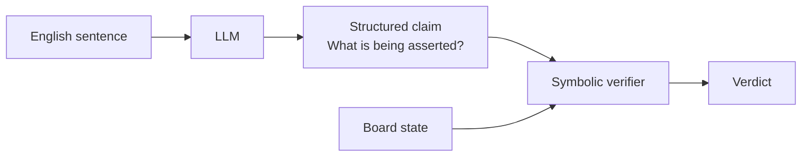
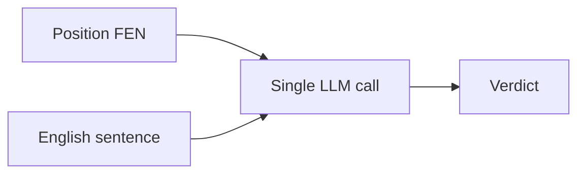
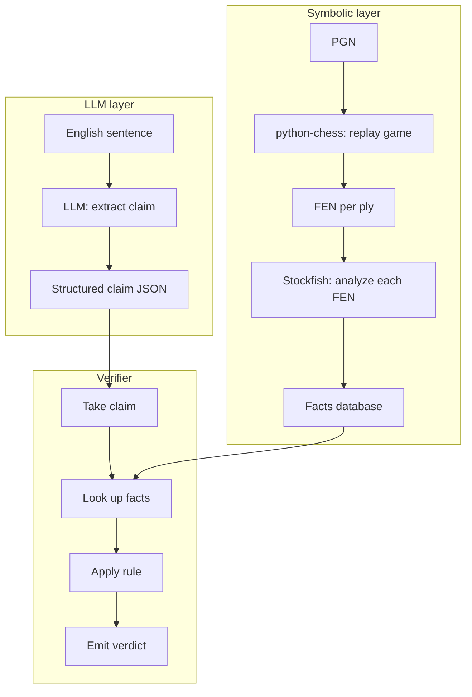

# 2. The Core Idea Separation of Concerns

> **The core idea in one sentence**: The system separates **language understanding** (what does the sentence claim?) from **chess reasoning** (is that claim true on the board?) — and refuses to let any single component do both.

This is the most important architectural idea in the entire project. If you understand only one note in this vault, understand this one. Every other design decision follows from it.

---

## 2.1 Why Separation Is Necessary

An LLM, asked "is the sentence 'the knight captures the rook' true in this position?", will do one of two things:

1. **Hallucinate an answer.** It will say "yes" or "no" based on text statistics, with no actual board state in its head.
2. **Try to reason verbally.** It will produce a chain of "the knight is on f3, the rook is on e8, the knight can jump to... actually I am not sure" — and the answer is still not reliable.

Neither is acceptable. The first is worse than no answer. The second is barely better, because the verbal reasoning will be wrong about 20% of the time and you cannot tell which 20%.

The fix is to never ask the LLM to evaluate truth. Instead:



The LLM's job shrinks from **"evaluate this sentence"** to **"describe what this sentence is asserting"**. That is a much easier, much more constrained task, and modern LLMs are reliable at it.

The verifier's job is to take a structured claim like `{actor: white, action: capture, piece: knight, target: rook, target_ply: 14}` and answer it with pure symbolic computation: look up ply 14 in the facts database, check whether the played SAN was an `N` move that captured an `R`, emit "Verified" or "Contradicted".

Neither component ever does the other's job. That is the separation.

---

## 2.2 The Bad Architecture (Anti-Pattern)

It is worth being explicit about what the bad architecture looks like, so you can recognize it when you see it.



This is "give the LLM the position and the sentence, ask it if the sentence is true". It will work on simple cases (it will catch "the king is on e4" when the king is on e1). It will fail catastrophically on:

- **Long games** where the LLM cannot maintain the board state.
- **Tactical claims** where the LLM has to count attackers and defenders.
- **Material claims** where the LLM has to compare piece lists before and after.
- **Anything involving pins, skewers, or discovered attacks** — these require explicit attack-graph reasoning.

The bad architecture also has a worse failure mode: **silent confidence**. When it is wrong, it does not hedge. It says "Yes, the sentence is correct" with the same fluency it uses when it is right. There is no uncertainty signal. The user has no way to know which verdicts to trust.

> [!warning] The "stronger LLM" trap
> A common temptation is to say "GPT-5 will be better at this, so let's just use the bad architecture with a stronger model." This does not work, as explained in [[Chapter 1. Project Overview/2. The Core Problem|2. The Core Problem]]. Stronger LLMs produce more confident errors, not fewer errors. The separation of concerns is necessary regardless of model strength.

---

## 2.3 The Good Architecture (The Pattern)



Three properties of this architecture:

1. **Strict layering.** The LLM never sees the PGN. The verifier never sees English. The two layers communicate only through the structured claim and the facts database.
2. **Determinism in the right place.** The verifier is a pure function of `(claim, facts)`. Given the same inputs, it always produces the same output. All nondeterminism is isolated in the LLM call, where it can be controlled (temperature 0, structured output, caching).
3. **Composability.** Each layer can be tested, benchmarked, and improved independently. You can swap the LLM without touching the verifier. You can swap the engine without touching the LLM. You can add a new claim type without touching Track A.

---

## 2.4 What the LLM Is and Is Not Responsible For

### LLM is responsible for

- **Reading English prose.** It sees the natural-language sentences and identifies which ones make factual claims.
- **Classifying claim types.** It tags each claim as `move_description`, `capture`, `tactical_fork`, `material_gain`, etc.
- **Extracting claim parameters.** For "the bishop captures the rook", it produces `{actor: white, piece: bishop, action: capture, target_piece: rook}`.
- **Inferring target ply when possible.** "After the bishop sacrifice" implies a specific ply, which the LLM may be able to identify from context.
- **Marking claims as ambiguous.** If a sentence is genuinely unclear, the LLM should say so rather than guess.

### LLM is NOT responsible for

- **Reading PGN.** It never sees the moves.
- **Judging whether a claim is true.** That is the verifier's job.
- **Counting material.** That is python-chess's job.
- **Identifying tactics.** That is the verifier's job, using attack maps.
- **Evaluating positions.** That is Stockfish's job.

> [!tip] Mental test
> Before sending a request to the LLM, ask yourself: "Is the LLM being asked to **describe** something, or to **judge** something?" If the answer is "describe", proceed. If the answer is "judge", stop and redesign. The LLM describes; the verifier judges.

---

## 2.5 What the Verifier Is and Is Not Responsible For

### Verifier is responsible for

- **Looking up facts.** Given a claim, find the relevant ply or plies in the facts database.
- **Applying rules.** For each claim type, apply the corresponding verification rule (Chapter 4).
- **Emitting verdicts.** Always include a verdict label and a one-sentence explanation pointing to a specific board fact.

### Verifier is NOT responsible for

- **Reading English.** It only sees structured claims.
- **Inferring missing claim parameters.** If the claim is ambiguous, mark it `Ambiguous` — do not guess.
- **Re-running the engine.** The facts database is pre-computed. If a verdict requires analysis not in the database, the verifier emits `Cannot verify automatically` rather than calling Stockfish on the fly.
- **Suggesting corrections.** That is a future feature (long-term vision). v1 emits verdicts only.

---

## 2.6 Why This Separation Is Hard to Maintain in Practice

The separation looks clean on paper. In practice, three forces conspire to blur it:

1. **Ambiguous claims need disambiguation.** When the LLM produces a claim with `target_ply: null`, you may be tempted to ask the LLM to guess the ply from context. That is fine — but it is still claim extraction, not truth evaluation. The verifier then verifies the claim at the guessed ply; the LLM is not asked "is this true?".
2. **Strategic claims blur the line.** "White has the initiative" is hard to verify symbolically. You may be tempted to ask the LLM "does this position look like White has the initiative?" — but that re-introduces the LLM-as-judge anti-pattern. The correct approach is to use engine evaluation as a proxy and emit a soft verdict. See [[Chapter 4. Claim Types and Verification/4. Strategic Claims|4. Strategic Claims]].
3. **Performance pressure.** When the verifier is slow, you may be tempted to ask the LLM to do a fast pre-check. Resist. The LLM's fast pre-check will be wrong 20% of the time, and those wrong pre-checks will become wrong verdicts.

The discipline of "LLM describes, verifier judges" must be maintained even when it is inconvenient. Otherwise the project collapses into the bad architecture.

---

## 2.7 Testing the Separation

A useful engineering check: **can you run the system with the LLM replaced by a static JSON file?** If yes, the separation is clean. If no — if the verifier has any code path that depends on LLM output beyond the structured claim — the separation is leaky.

This is also how you should unit-test the verifier:

```python
def test_capture_claim_verified():
    claim = {"type": "capture", "actor": "white", "piece": "bishop",
             "target_piece": "pawn", "target_square": "h7", "ply": 12}
    facts = load_test_facts_database("sicilian.json")
    verdict = verify(claim, facts)
    assert verdict.label == "Verified"
    assert "Bxh7" in verdict.explanation
```

If your verifier can be tested without an LLM in sight, the architecture is correct. If you find yourself mocking the LLM in verifier tests, the architecture is wrong.

---

## 2.8 Key Reminders

- The LLM **describes** what a sentence claims. It never **judges** whether the claim is true.
- The verifier **judges** claims against a pre-computed facts database. It never reads English.
- The facts database is the only bridge between the two layers.
- The bad architecture (single LLM call to judge truth) produces confident errors. The good architecture (separate describe and judge steps) produces reliable verdicts.
- Three forces blur the separation in practice: ambiguous claims, strategic claims, performance pressure. Resist all three.
- Test: can you replace the LLM with a static JSON file and still run the verifier? If yes, the architecture is clean.
- Never let the LLM see the PGN. Never let the verifier see English. The two layers communicate only through structured claims and facts.
