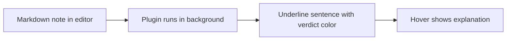

# 3. Inputs and Outputs

> **The system's contract**: it accepts Markdown notes containing PGN, SAN, FEN, and prose; it produces a structured verification report keyed to source line numbers.

This note specifies the **input format** and **output format** in enough detail that an external contributor could write a compatible producer or consumer.

---

## 3.1 Input Format

### 3.1.1 Accepted input types

The system accepts Markdown notes containing any of the following, in any combination:

| Input type | Example | How it is recognized |
|---|---|---|
| **PGN block** | A fenced code block with `pgn` language hint, or any code block containing move text. | ` ```pgn ... ``` ` or heuristic detection. |
| **Inline SAN** | `1. e4 c5 2. Nf3 d6 3. Bxh7+` in a paragraph. | Regex matching the standard SAN pattern. |
| **FEN string** | A single-line string with 6 space-separated fields. | Regex matching the FEN format. |
| **Chess diagram** | Obsidian `chessboard` plugin call or image with a FEN caption. | Plugin-specific syntax. |
| **Prose** | Any English sentences outside the above. | Everything else. |

### 3.1.2 Canonical input example

```markdown
# Sicilian Middlegame

Some introductory prose about the game.

```pgn
1. e4 c5
2. Nf3 d6
3. Bxh7+
```

White sacrifices the bishop.

Black captures it.

The king becomes exposed.
```

The system parses this into:

- A header line (line 1).
- An intro paragraph (line 3).
- A PGN block (lines 5-9).
- Three prose sentences (lines 11, 13, 15), each tagged with its source line number.

### 3.1.3 Input constraints

- **One game per PGN block.** Multi-game PGN files are not supported in v1.
- **No PGN variations in v1.** Moves in parentheses (`1. e4 (1. d4) c5`) are stripped during parsing. Verification of variation moves is a v2 feature.
- **No embedded NAGs or comments in v1.** `1. e4! c5 {good move}` is parsed as `1. e4 c5`; the `!` and comment are discarded.
- **Prose must be English.** Multi-language support is a v2 feature.
- **Markdown must be valid CommonMark.** Obsidian-specific extensions (wikilinks, callouts, frontmatter) are tolerated but ignored.

> [!info] Why strip variations and comments in v1
> Variations and comments complicate the facts database significantly: a variation introduces a parallel timeline of plies, each of which needs its own FEN and Stockfish analysis. For v1, the system only verifies claims about the main line. Variation support is a major v2 milestone.

---

## 3.2 Output Format

### 3.2.1 Markdown report (primary)

The primary output is a Markdown report that the author can read directly. Format:

```markdown
# Verification Report

Source: notes/sicilian.md
Game: Sicilian Middlegame (plies 1-30)
Verified at: 2026-06-27T14:32:11Z

## Summary

- Total claims: 4
- Verified: 1
- Contradicted: 1
- Supported (soft): 1
- Possible hallucination: 1

## Per-claim verdicts

### Claim 1 — Line 24

> "The bishop is sacrificed."

**Verdict: Verified**

The move at ply 12 is `Bxh7+`, which is a bishop move to h7 with check.

---

### Claim 2 — Line 28

> "Black captures the bishop."

**Verdict: Contradicted**

The move at ply 13 is `Kh8`, not `Kxh7`. Black declined the sacrifice.

---
...
```

The format is deliberately verbose. Each claim gets its own subsection with:

- The source line number.
- The verbatim quote.
- The verdict label, bolded.
- A one-sentence explanation pointing to a specific board fact.

### 3.2.2 JSON report (machine-readable)

For programmatic consumption (e.g., by an Obsidian plugin or CI pipeline), the system also emits a JSON report:

```json
{
  "source_file": "notes/sicilian.md",
  "game_id": "sicilian-middlegame",
  "verified_at": "2026-06-27T14:32:11Z",
  "summary": {
    "total_claims": 4,
    "verified": 1,
    "contradicted": 1,
    "supported_soft": 1,
    "possible_hallucination": 1
  },
  "claims": [
    {
      "claim_id": 1,
      "source_line": 24,
      "source_text": "The bishop is sacrificed.",
      "claim_type": "capture",
      "verdict": "Verified",
      "explanation": "The move at ply 12 is Bxh7+, which is a bishop move to h7 with check.",
      "evidence": {
        "ply_index": 12,
        "san": "Bxh7+",
        "uci": "b1h7"
      }
    },
    {
      "claim_id": 2,
      "source_line": 28,
      "source_text": "Black captures the bishop.",
      "claim_type": "capture",
      "verdict": "Contradicted",
      "explanation": "The move at ply 13 is Kh8, not Kxh7. Black declined the sacrifice.",
      "evidence": {
        "ply_index": 13,
        "san": "Kh8",
        "uci": "g8h8"
      }
    }
  ]
}
```

### 3.2.3 Inline report (Obsidian plugin vision)

For the long-term Obsidian plugin experience, the report is rendered inline in the editor as squiggly underlines and hover tooltips:



This is a v2+ feature. The v1 Markdown + JSON reports are sufficient for batch verification.

---

## 3.3 Verdict Labels — Canonical List

The system emits exactly six verdict labels. They are mutually exclusive and collectively exhaustive — every claim gets exactly one.

| Label | When to use |
|---|---|
| **Verified** | Binary claim that is unambiguously supported by the board. Example: "The knight moved to e5." when the SAN at the relevant ply is `Ne5`. |
| **Contradicted** | Binary claim that is unambiguously refuted by the board. Example: "Black captured the bishop." when the actual move was `Kh8`. |
| **Supported (soft)** | Soft claim that is supported by engine analysis but is not a binary fact. Example: "The king is exposed." when Stockfish confirms king safety dropped sharply. |
| **Ambiguous** | Claim where the parameters cannot be pinned down enough to verify. Example: "White has the initiative." in a balanced position. |
| **Cannot verify automatically** | Claim type the verifier does not yet handle. Example: "This is a beautiful combination." |
| **Possible hallucination** | Claim that has no support in the game or position. Example: "White wins a rook." when no material change occurs. |

> [!warning] Do not invent new labels
> If you find yourself wanting to add labels like "Partially verified" or "Mostly correct", stop. Either the claim can be split into multiple sub-claims (each of which gets its own label), or the claim is genuinely ambiguous and should be labeled `Ambiguous`. Six labels is enough.

---

## 3.4 Report Quality Bar

A report is acceptable only if it satisfies all of the following:

- **Every factual claim gets a verdict.** If the LLM extracted a claim, the verifier must emit a verdict for it, even if that verdict is `Cannot verify automatically`.
- **Every verdict has an explanation.** Bare labels are not acceptable. The explanation must reference a specific board fact (ply index, SAN, FEN, evaluation).
- **Every quote is verbatim.** The report must show the exact source text, not a paraphrase.
- **Every line number is correct.** Off-by-one errors in line numbers are a critical bug.
- **Summary counts add up.** The sum of per-verdict counts in the summary must equal the total claim count.

---

## 3.5 Input/Output File Layout

When the system runs over a vault, it produces a parallel directory tree of reports:

```text
notes/
  sicilian.md
  caro-kann.md
  queens-gambit.md

reports/
  sicilian.md.md        # Markdown report
  sicilian.md.json      # JSON report
  caro-kann.md.md
  caro-kann.md.json
  queens-gambit.md.md
  queens-gambit.md.json

facts/                  # Cached facts databases
  sicilian.json
  caro-kann.json
  queens-gambit.json

reports/
  index.md              # Summary across all notes
```

The `index.md` file lists every note with its claim count and verdict breakdown, so the author can see at a glance which notes have the most issues.

---

## 3.6 Edge Cases

- **Note with no PGN**: the system emits a single `Cannot verify automatically` verdict for any prose claim, because there is no ground truth to verify against.
- **Note with PGN but no prose**: the system emits an empty report with a note that no claims were extracted.
- **Note with multiple PGN blocks**: the system produces a separate report section per block.
- **Note with malformed PGN**: the system emits a single `Cannot verify automatically` verdict and a parse error explanation.
- **Prose that references a different game than the one in the PGN block**: this is an interesting case. The system should detect the mismatch (e.g., the prose says "after 1.e4 e5" but the PGN starts with `1. d4`) and flag every claim as `Contradicted` with an explanation that the prose does not match the PGN.

---

## 3.7 Key Reminders

- Inputs: Markdown with PGN, SAN, FEN, diagrams, prose. v1 supports single-game PGN blocks, no variations, no comments.
- Outputs: Markdown report (human-readable) + JSON report (machine-readable). Both keyed to source line numbers.
- Exactly six verdict labels: Verified, Contradicted, Supported (soft), Ambiguous, Cannot verify automatically, Possible hallucination.
- Every verdict must include a one-sentence explanation referencing a specific board fact.
- Line numbers must be exact. Off-by-one is a critical bug.
- File layout: `notes/`, `reports/`, `facts/` directories with parallel structure.
- Edge case to remember: prose that references a different game than the PGN block should be flagged at the section level, not per-claim.
