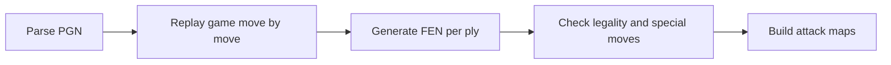
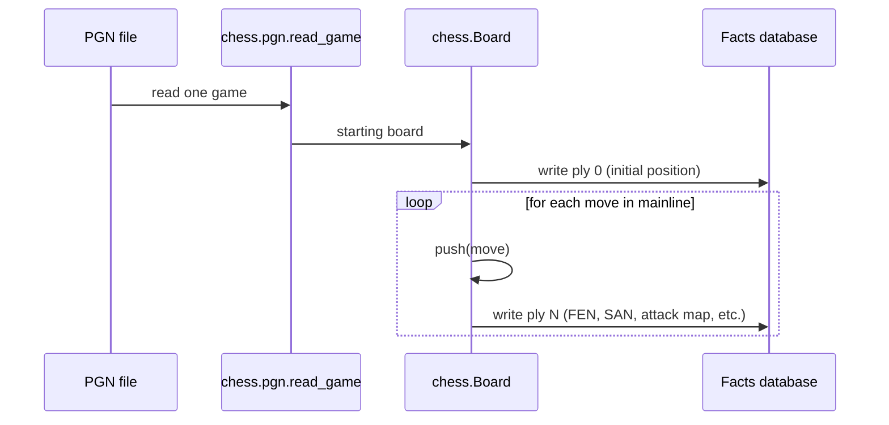

# 1. python-chess

> **python-chess in one sentence**: The de facto Python library for parsing PGN, generating FENs, checking legality, querying the board, and replaying games — the symbolic backbone of Track A.

This note explains what python-chess does, what we use it for in this project, and the specific API calls every contributor needs to know.

---

## 1.1 What python-chess Is

`python-chess` is a pure-Python chess library, originally by Niklas Fiekas, with no external dependencies beyond the standard library. It is the **most widely used** Python chess library and is essentially the default choice for any programmatic chess work.

Key properties:

- **Pure Python** — no compilation, no native dependencies. Installs with `pip install chess`.
- **Correct rules** — implements the full FIDE ruleset, including castling, en passant, promotion, threefold repetition, fifty-move rule, insufficient material.
- **PGN and FEN support** — bidirectional parsing and serialization.
- **SAN and UCI support** — both move notation formats are first-class.
- **Attack and pin detection** — built-in methods for queries the verifier needs.
- **Active maintenance** — frequent releases, responsive maintainer.

For this project, python-chess is **non-negotiable**. There is no realistic alternative.

---

## 1.2 What We Use python-chess For

In this project, python-chess has five jobs:



### 1.2.1 Parse PGN

The entry point for PGN parsing is `chess.pgn.read_game()`:

```python
import chess.pgn

with open("game.pgn") as f:
    game = chess.pgn.read_game(f)
```

`read_game` returns a `chess.pgn.Game` object representing one game. It handles headers, move text, comments, and NAGs. To parse a PGN string instead of a file, wrap it in `io.StringIO`.

### 1.2.2 Replay the game

The `Game` object exposes the moves as a linked list of `chess.pgn.ChildNode` objects:

```python
board = game.board()
for move_node in game.mainline():
    move = move_node.move          # chess.Move
    san = move_node.san()          # SAN string
    board.push(move)               # advance the board
    fen_after = board.fen()        # FEN after the move
```

This is the core replay loop. Every ply in the facts database is built from one iteration.

### 1.2.3 Generate FEN per ply

`board.fen()` returns the standard FEN string. python-chess also offers `board.epd()` for the shorter EPD format (no halfmove clock or fullmove number), useful for position lookup tables.

### 1.2.4 Check legality and special moves

The `chess.Move` object has flags that python-chess exposes via the board:

```python
board.is_capture(move)         # True if the move captures
board.is_en_passant(move)      # True if e.p.
board.is_castling(move)        # True if O-O or O-O-O
move.promotion                 # piece type if promotion, else None
board.gives_check(move)        # True if the move gives check
board.is_checkmate()           # True if current position is checkmate
```

These flags populate the per-ply record in the facts database.

### 1.2.5 Build attack maps

python-chess has built-in methods for attack queries:

```python
board.attackers(chess.WHITE, chess.H7)   # set of squares attacking h7 by White
board.attacks(chess.F3)                  # set of squares attacked from f3
board.pin(chess.WHITE, chess.F3)         # the pin ray on the f3 piece, if any
board.is_pinned(chess.WHITE, chess.F3)   # boolean: is the f3 piece pinned?
```

These methods are the foundation for tactical claim verification in [[Chapter 4. Claim Types and Verification/3. Tactical Claims|3. Tactical Claims]].

---

## 1.3 Critical API Reference

### 1.3.1 Board

- `chess.Board()` — the standard starting position.
- `chess.Board(fen)` — position from a FEN string.
- `board.push(move)` — apply a move (mutates board).
- `board.pop()` — undo the last move.
- `board.legal_moves` — iterator of legal moves.
- `board.is_legal(move)` — bool.
- `board.is_check()`, `board.is_checkmate()`, `board.is_stalemate()` — game state.
- `board.turn` — `chess.WHITE` or `chess.BLACK`.
- `board.piece_at(square)` — `chess.Piece` or `None`.
- `board.fen()` — FEN string.

### 1.3.2 Move

- `chess.Move(from_square, to_square, promotion=None)` — construct a move.
- `chess.Move.from_uci("g1f3")` — parse UCI.
- `board.parse_san("Nf3")` — parse SAN in the context of the current board.
- `move.from_square`, `move.to_square` — squares (as integers).
- `move.promotion` — `chess.KNIGHT`, etc., or `None`.

### 1.3.3 Piece and square

- `chess.Piece(piece_type, color)` — e.g. `chess.Piece(chess.KNIGHT, chess.WHITE)`.
- `chess.A1`, `chess.B1`, ..., `chess.H8` — square constants.
- `chess.square_name(0)` → `"a1"`, `chess.parse_square("a1")` → `0`.
- `chess.SQUARE_NAMES` — list of all 64 square names.

### 1.3.4 PGN

- `chess.pgn.read_game(io)` — read one game from a file-like object.
- `chess.pgn.Game.from_pgn(pgn_string)` — parse a PGN string.
- `game.headers` — dict-like, PGN headers.
- `game.mainline()` — iterator over moves in the main line.
- `game.board()` — the starting board (before any moves).

---

## 1.4 Common Pitfalls

### 1.4.1 SAN parsing requires a board context

`chess.Move.from_uci("g1f3")` works in isolation. `board.parse_san("Nf3")` does **not** — SAN is context-dependent. The same SAN can mean different moves in different positions. Always parse SAN against the board on which the move was made.

```python
# CORRECT
board = chess.Board()
move = board.parse_san("Nf3")

# WRONG (will throw or return wrong move)
move = chess.Move.from_san("Nf3")  # ← deprecated and unreliable
```

### 1.4.2 `board.push()` mutates

`board.push(move)` advances the board in place. If you need to keep the original board, copy first:

```python
import copy
new_board = copy.copy(board)  # or board.copy()
new_board.push(move)
```

For performance, prefer `board.copy()` (built-in, faster than `copy.copy`).

### 1.4.3 En passant target square

The FEN's en passant target square is set whenever a pawn moves two squares, **even if no enemy pawn can actually capture en passant**. This is the FEN standard. Some chess engines and libraries (including older python-chess versions) only set the target if a legal e.p. capture exists. Be aware of this when comparing FENs across libraries.

### 1.4.4 Halfmove clock and fullmove number

FEN's last two fields are the halfmove clock (moves since last pawn move or capture) and the fullmove number (increments after Black's move). These affect threefold-repetition and fifty-move-rule claims. If your verifier handles those claims (most don't in v1), you need them. Otherwise, you can ignore them — but keep them in the FEN string for completeness.

### 1.4.5 Reading multiple games from one PGN file

`chess.pgn.read_game(f)` reads **one** game. To read all games, call it in a loop:

```python
with open("many_games.pgn") as f:
    while True:
        game = chess.pgn.read_game(f)
        if game is None:
            break
        process(game)
```

Forgetting the loop is a common bug — only the first game gets processed.

---

## 1.5 Performance Notes

python-chess is pure Python and can be slow for bulk operations. Key numbers:

| Operation | Time | Notes |
|---|---|---|
| Parse a 40-ply PGN | ~5 ms | Fast. |
| Replay 40 plies with FEN generation | ~10 ms | Fast. |
| Build attack map for one position | ~1 ms | Acceptable. |
| Build attack maps for 40 positions | ~40 ms | Acceptable. |
| Parse a 10,000-game PGN file | ~50 s | Slow; consider multiprocessing. |

For our use case (one game at a time, with Stockfish dominating runtime), python-chess is never the bottleneck. If it ever is, the fix is usually multiprocessing, not rewriting in C.

---

## 1.6 Integration with the Facts Database

The facts database builder uses python-chess as follows:



The builder is a thin wrapper around the python-chess API. All chess logic lives in python-chess; the builder just formats the output for the facts database.

---

## 1.7 Why Not Just Use Stockfish for Everything?

Stockfish can parse PGNs, but Stockfish is an **engine**, not a library. Its PGN parser is opaque, its API is UCI-based (designed for engine-vs-engine play, not data extraction), and it does not expose attack maps or pin detection in a convenient form.

python-chess is the right tool for **data extraction and rule checking**. Stockfish is the right tool for **evaluation and best-move computation**. Use them together; do not try to use either for the other's job.

---

## 1.8 Key Reminders

- python-chess is the symbolic backbone of Track A. It is non-negotiable.
- Use `chess.pgn.read_game()` for PGN parsing.
- Use `board.push(move)` and `board.fen()` for replay.
- Use `board.attackers()`, `board.attacks()`, `board.is_pinned()` for tactical queries.
- Always parse SAN against the correct board context. Never use `Move.from_san`.
- `board.push()` mutates. Use `board.copy()` to preserve state.
- Read all games from a multi-game PGN with a `while` loop on `read_game`.
- python-chess is fast enough for our use case; Stockfish is the actual bottleneck.
- Use python-chess for data extraction and rule checking; use Stockfish for evaluation. Never mix.
