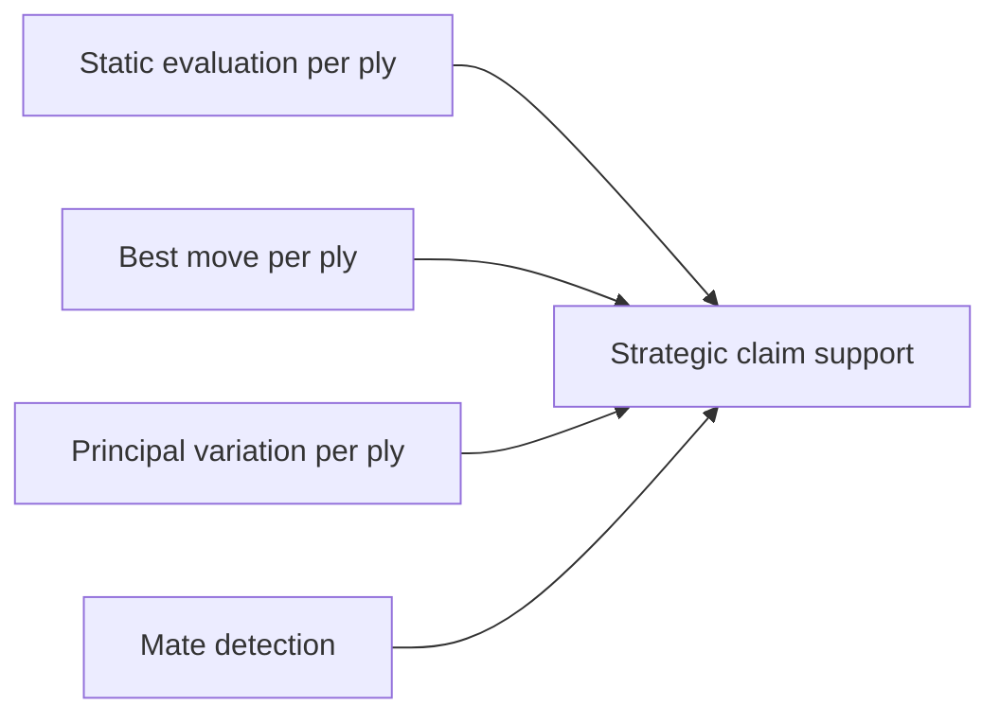

# 2. Stockfish

> **Stockfish in one sentence**: The strongest open-source chess engine, used in this project to provide the positional and tactical evaluations that the verifier cannot derive from python-chess alone.

This note explains what Stockfish is, how the project uses it, and the engineering details of integrating it with python-chess.

---

## 2.1 What Stockfish Is

Stockfish is a free, open-source UCI chess engine. It has been at or near the top of every computer chess rating list for over a decade. Properties relevant to this project:

- **UCI protocol** — communicates via standard input/output text commands. Trivial to drive from any language.
- **Massive strength** — Elo ~3600+, far above any human. Its evaluations are essentially ground truth for tactical and many positional questions.
- **Configurable depth** — you choose how deep it searches, trading speed for accuracy.
- **Multi-threaded** — can use multiple CPU cores.
- **Cross-platform** — runs on Linux, macOS, Windows, BSD.
- **Active development** — frequent releases, neural network updates.

For this project, Stockfish is the **second pillar** of Track A. Where python-chess answers "what is on the board?", Stockfish answers "what is the evaluation?" and "what is the best move?".

---

## 2.2 What We Use Stockfish For

Stockfish has five jobs in this project:



### 2.2.1 Static evaluation per ply

For every position in the facts database, Stockfish produces a static evaluation in centipawns (1 pawn = 100 cp). Positive = White is better; negative = Black is better. If the position is mate, Stockfish reports `Mate in N` instead.

This is stored in `plies[N].stockfish.eval_cp` (or `mate_in` for mate positions).

### 2.2.2 Best move per ply

Stockfish's top recommendation, in UCI format. Stored as `plies[N].stockfish.best_move_uci` and converted to SAN for `best_move_san`.

This is used for two purposes:
1. As a sanity check on the played move (if the played move is far from the engine's choice, the played move was probably a mistake — though the system does not flag this directly; it just records it).
2. To support strategic claims. If the prose says "White should play Qd1-d3", the verifier can check whether the engine agrees.

### 2.2.3 Principal variation per ply

The engine's main line, typically 8-15 plies deep. Stored as `pv_uci` (array of UCI moves) and `pv_san` (array of SAN moves).

The PV is the engine's "story" of what happens next. It is essential for verifying forward-looking claims like "if Black declines the sacrifice, White wins material".

### 2.2.4 Mate detection

If the position is mate, Stockfish reports `Mate in N` (positive = White mates in N; negative = Black mates in N). This is stored as `mate_in`.

The verifier uses this for checkmate claims: "White checkmates in three" can be verified by checking `mate_in == 3` at the relevant ply.

### 2.2.5 Strategic claim support

Strategic and positional claims (Chapter 4.4-4.6) cannot be verified by python-chess alone. They require engine evaluation. Examples:

- "White has the initiative" → check whether eval is significantly positive and the PV shows White making threats.
- "Black's king is exposed" → check whether eval drops sharply when the king is given a virtual extra tempo (a heuristic; see Chapter 4.6).
- "White has a crushing attack" → check whether eval > +5 and the PV shows attacking moves.

---

## 2.3 Driving Stockfish from Python

The standard pattern is to use the `stockfish` Python package or to drive the UCI engine directly via `subprocess`. We recommend the latter for full control.

```python
import subprocess

class StockfishEngine:
    def __init__(self, path="stockfish", depth=18, threads=2):
        self.process = subprocess.Popen(
            [path],
            stdin=subprocess.PIPE,
            stdout=subprocess.PIPE,
            stderr=subprocess.PIPE,
            text=True,
            bufsize=1,
        )
        self.depth = depth
        self._send(f"setoption name Threads value {threads}")
        self._send("ucinewgame")
        self._send("isready")
        self._wait_for("readyok")

    def _send(self, command):
        self.process.stdin.write(command + "\n")
        self.process.stdin.flush()

    def _wait_for(self, token):
        while True:
            line = self.process.stdout.readline().strip()
            if line.startswith(token):
                return line

    def evaluate(self, fen):
        self._send(f"position fen {fen}")
        self._send(f"go depth {self.depth}")
        while True:
            line = self.process.stdout.readline().strip()
            if line.startswith("bestmove"):
                break
            if line.startswith("info depth"):
                # parse eval, pv, mate from this line
                parsed = self._parse_info_line(line)
        return parsed
```

This is a simplified sketch. Production code should handle:

- **Engine crashes** — restart the subprocess if it dies.
- **Time limits** — always send `go movetime 1000` as a safety net in addition to `go depth N`.
- **Output buffering** — set `bufsize=1` and flush explicitly.
- **Concurrent evaluations** — Stockfish is single-game at a time; you cannot parallelize evaluations within one process.

---

## 2.4 Depth Selection

Depth is the most important tunable. Higher depth = more accurate = slower.

| Depth | Time per position | Accuracy | Use case |
|---|---|---|---|
| 8 | ~50 ms | Tactical only | Quick smoke tests. |
| 12 | ~200 ms | Good for short tactics | Development. |
| 15 | ~500 ms | Strong | Production default. |
| 18 | ~1 s | Very strong | Recommended for the verifier. |
| 22 | ~5 s | Near-perfect | Final-pass verification of important claims. |
| 30+ | 30+ s | Perfect for practical purposes | Overkill; do not use. |

For the verifier, **depth 18 is the sweet spot**. It is strong enough to resolve any tactical claim a human would consider obvious, and fast enough that a 40-ply game analyzes in under a minute.

> [!tip] Adaptive depth
> For mate-in-N claims, you can use a lower depth (depth 12 is usually enough to detect mate in 5 or less). For positional claims, you may want a higher depth (depth 22). An adaptive depth strategy — depth 18 by default, depth 22 for strategic claims, depth 12 for mate claims — saves significant time.

---

## 2.5 Caching Strategy

Engine evaluations are expensive. Cache aggressively.

### 2.5.1 Per-FEN cache

The cache key is the FEN string (with halfmove clock and fullmove number stripped, since those do not affect evaluation). The cache value is the parsed `info` line (eval, best_move, pv, mate_in, depth).

### 2.5.2 Cache invalidation

The cache is invalidated when:

- The Stockfish binary changes (record the version in the cache).
- The depth setting increases (a deeper search may produce a different result; shallower searches can reuse deeper results, but not vice versa).

### 2.5.3 Cache storage

For a single vault, an in-memory dict is sufficient. For cross-vault reuse, a SQLite database with FEN as the primary key is the right choice.

A typical Lichess game produces ~50 unique positions. A vault of 1000 games produces ~50,000 positions, but many are shared (opening positions appear in many games). The effective unique position count is closer to 30,000, fitting comfortably in a SQLite file.

---

## 2.6 Parsing the `info` Line

Stockfish's `info` lines are space-delimited and have many optional fields. The fields we care about:

```text
info depth 18 seldepth 24 multipv 1 score cp 220 nodes 1500000 nps 1200000 time 1250 pv h7g8 g8h8 ...
```

- `depth N` — search depth reached.
- `score cp N` — evaluation in centipawns (positive = White).
- `score mate N` — mate in N (positive = White mates; negative = Black mates).
- `pv <moves>` — principal variation, UCI moves.
- `nodes N` — nodes searched (confidence indicator).
- `nps N` — nodes per second.
- `time N` — milliseconds spent.

The parsing code:

```python
def _parse_info_line(self, line):
    parts = line.split()
    info = {"depth": None, "eval_cp": None, "mate_in": None,
            "pv_uci": [], "nodes": None, "time_ms": None}
    i = 0
    while i < len(parts):
        token = parts[i]
        if token == "depth" and i + 1 < len(parts):
            info["depth"] = int(parts[i + 1]); i += 2
        elif token == "score" and i + 2 < len(parts):
            if parts[i + 1] == "cp":
                info["eval_cp"] = int(parts[i + 2])
            elif parts[i + 1] == "mate":
                info["mate_in"] = int(parts[i + 2])
            i += 3
        elif token == "pv":
            info["pv_uci"] = parts[i + 1:]; break
        elif token == "nodes" and i + 1 < len(parts):
            info["nodes"] = int(parts[i + 1]); i += 2
        elif token == "time" and i + 1 < len(parts):
            info["time_ms"] = int(parts[i + 1]); i += 2
        else:
            i += 1
    return info
```

> [!warning] The `score` field comes in two flavors
> `score cp N` (centipawns) and `score mate N` (mate in N moves). Always check which one was emitted. Treating a mate score as a centipawn score produces wildly wrong evaluations.

---

## 2.7 Limitations and Failure Modes

### 2.7.1 Stockfish is not perfect

Stockfish is incredibly strong but not infallible. At depth 18, it can miss deep positional maneuvers and very long-range tactical sequences. For verification of human-written commentary, this is rarely a problem (human commentary is even less reliable), but be aware that "Stockfish said X" is not the same as "X is true".

### 2.7.2 Evaluation scaling

Stockfish's evaluation has been "scaled" since the introduction of neural network evaluations (SFNNv2 onward). A modern eval of +1.0 is roughly equivalent to an old eval of +1.5. If you are comparing across Stockfish versions, normalize accordingly.

### 2.7.3 Tablebase positions

For positions with 7 or fewer pieces, Stockfish uses the WDL/DTZ tablebase and reports exact results. This is fantastic for endgame verification but can produce confusing output (e.g., `info score cp 0` for a position that is actually a forced draw, because the eval is exactly zero).

### 2.7.4 Contempt

Stockfish has a `Contempt` setting that biases its evaluation away from draws. For verification, **set Contempt to 0**. Non-zero Contempt distorts evaluations and makes "the position is equal" claims harder to verify.

### 2.7.5 Multi-PV

By default, Stockfish reports only its top line (`multipv 1`). For some verifications (e.g., "is there a better move?"), you want multi-PV output. Use `setoption name MultiPV value 3` to get the top 3 lines.

---

## 2.8 Why Not Use a Cloud Engine?

Cloud engines (Lichess Cloud Eval, Chess.com analysis) are convenient but unsuitable for the verifier:

- **Rate limits** — most cloud eval APIs are heavily rate-limited.
- **Network latency** — adds 200-500 ms per position, dominating the analysis time.
- **Reproducibility** — cloud evals change as the underlying Stockfish version changes. Your cached results become invalid without warning.
- **Privacy** — sending user vaults to a third party is unacceptable for an Obsidian plugin.

Run Stockfish locally. The binary is small (~10 MB), free, and runs on any laptop.

---

## 2.9 Key Reminders

- Stockfish is the second pillar of Track A. It provides evaluation; python-chess provides rule checking.
- Five jobs: eval per ply, best move, PV, mate detection, strategic claim support.
- Drive Stockfish via UCI over subprocess. Avoid the `stockfish` Python package for production use; it adds a layer of abstraction that hides important details.
- Depth 18 is the sweet spot for the verifier. Use depth 22 for strategic claims, depth 12 for mate detection.
- Cache aggressively, keyed by FEN. A SQLite cache across vaults is worth the engineering.
- Parse `info` lines carefully — `score cp N` and `score mate N` are different fields.
- Set Contempt to 0. Use MultiPV when you need top-N lines.
- Do not use cloud engines. Local Stockfish is faster, more private, and more reproducible.
- Stockfish is strong but not perfect. For human commentary verification, this is fine; for engine-level claims, be cautious.
