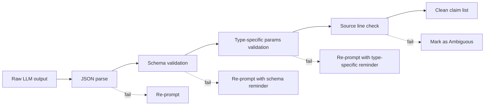

# 3. LLM for Claim Extraction

> **The LLM's job in one sentence**: Read English prose from the chess note and produce a structured list of factual claims — never judge whether the claims are true.

This note specifies exactly what the LLM is asked to do, the prompt design, the output schema, and the failure modes to watch for.

---

## 3.1 Why an LLM at All?

You might wonder: do we need an LLM for claim extraction? Could a regex or a rule-based parser do it?

The answer is **no**, for two reasons:

1. **Natural language is too varied.** "The bishop grabs the rook", "White's bishop takes the enemy rook", "Bxg8 — rook goes" all mean the same thing. A rule-based parser would need hundreds of patterns and still miss creative phrasings.
2. **Claim boundaries are fuzzy.** Consider "After White's bishop sacrifice on h7, Black's exposed king forces an immediate defense." This single sentence contains **three** claims: (a) a bishop was sacrificed, (b) the sacrifice was on h7, (c) the king became exposed. Splitting this correctly requires language understanding.

Modern LLMs handle both tasks reliably. The key is to constrain their output so they **only** describe claims, never judge them.

---

## 3.2 The LLM's Contract

The LLM is given:

- The prose from the note (English sentences with line numbers).
- The list of claim types the verifier supports (so it knows how to classify).
- A schema for the output.

The LLM produces:

- A JSON array of claim objects, each with a claim type, source line, source text, and type-specific parameters.
- An empty array if no factual claims are found.

The LLM is **not** given:

- The PGN.
- Any board state.
- Any engine evaluation.
- Any hint about whether the claims are true.

This is the strict information boundary that keeps the architecture honest.

---

## 3.3 The Prompt

The prompt has four parts:

1. **System role** — establishes the LLM as a claim extractor.
2. **Schema definition** — the JSON schema for the output.
3. **Claim type catalog** — the list of supported claim types with examples.
4. **User input** — the prose with line numbers.

### 3.3.1 System role

```text
You are a chess commentary claim extractor. Your job is to read
English chess commentary and produce a structured list of factual
claims that the commentary makes about the chess game.

You DO NOT judge whether the claims are true. You DO NOT have access
to the chess game. You ONLY describe what each sentence claims.

If a sentence makes no factual claim (e.g., "This is a beautiful
move"), do not extract a claim.

If a sentence is ambiguous, mark the claim with confidence: "low"
and include a note explaining the ambiguity.

Output strictly valid JSON matching the schema. Do not include
any text outside the JSON.
```

### 3.3.2 Schema definition

The schema is a JSON object with a single `claims` array. Each claim has:

```json
{
  "claim_id": "int",
  "source_line": "int",
  "source_text": "string (verbatim quote)",
  "claim_type": "enum",
  "confidence": "high | medium | low",
  "params": { /* type-specific, see 3.3.3 */ },
  "target_ply_hint": "int | null",
  "notes": "string (optional)"
}
```

### 3.3.3 Claim type catalog (v1)

The verifier supports three claim types in v1:

| Type | Example sentence | Params |
|---|---|---|
| `move_description` | "The knight jumps to e5." | `{piece: "knight", color: "white", destination: "e5"}` |
| `capture` | "The bishop captures the rook." | `{piece: "bishop", color: "white", target_piece: "rook", target_color: "black", target_square: null}` |
| `material_gain` | "White wins a rook." | `{gaining_color: "white", piece_won: "rook", count: 1}` |

v2 adds `tactical_fork`, `pin`, `skewer`, `discovered_attack`, `positional_king_safety`, `positional_center_control`, and others.

### 3.3.4 User input

```text
Here is the prose from a chess note, with line numbers:

[24] The bishop is sacrificed.
[28] Black captures the bishop.
[31] The king becomes exposed.
[42] White wins a rook.

Extract every factual claim. Return JSON.
```

The line numbers are in brackets to make them impossible to confuse with move numbers.

---

## 3.4 Example LLM Output

For the input above, the LLM should produce something like:

```json
{
  "claims": [
    {
      "claim_id": 1,
      "source_line": 24,
      "source_text": "The bishop is sacrificed.",
      "claim_type": "capture",
      "confidence": "high",
      "params": {
        "piece": "bishop",
        "color": "white",
        "target_piece": null,
        "target_square": null,
        "is_sacrifice": true
      },
      "target_ply_hint": null,
      "notes": "Sentence implies a sacrifice but does not specify the target square."
    },
    {
      "claim_id": 2,
      "source_line": 28,
      "source_text": "Black captures the bishop.",
      "claim_type": "capture",
      "confidence": "high",
      "params": {
        "piece": "king",
        "color": "black",
        "target_piece": "bishop",
        "target_color": "white",
        "target_square": null
      },
      "target_ply_hint": null,
      "notes": "Subject 'Black' is ambiguous between king and another piece. Defaulting to king, which is the most common capturer in this context."
    },
    {
      "claim_id": 3,
      "source_line": 31,
      "source_text": "The king becomes exposed.",
      "claim_type": "positional_king_safety",
      "confidence": "medium",
      "params": {
        "color": "black",
        "direction": "worse"
      },
      "target_ply_hint": null,
      "notes": "Soft claim; will require engine verification."
    },
    {
      "claim_id": 4,
      "source_line": 42,
      "source_text": "White wins a rook.",
      "claim_type": "material_gain",
      "confidence": "high",
      "params": {
        "gaining_color": "white",
        "piece_won": "rook",
        "count": 1
      },
      "target_ply_hint": null,
      "notes": null
    }
  ]
}
```

Note several things:

- **The LLM does not say whether any claim is true.** It only describes what the claim asserts.
- **Confidence is about extraction quality, not claim truth.** A "high confidence" claim is one the LLM is sure it parsed correctly. A "low confidence" claim is one where the LLM is unsure whether the sentence makes a factual claim at all.
- **The `notes` field explains ambiguity.** This is invaluable for debugging — when a verdict looks wrong, you can look at the LLM's notes to see whether the extraction itself was uncertain.
- **`target_ply_hint` is often null.** The LLM usually cannot tell which ply a claim refers to. The verifier has to figure that out from the claim structure.

---

## 3.5 Prompt Engineering Details

### 3.5.1 Use structured output

Modern LLMs (GPT-4, Claude 3.5, GLM-4) support JSON mode or function calling. Use it. Asking the model to "output JSON" without structured output mode produces malformed JSON ~5% of the time. Structured output mode pushes that below 0.1%.

### 3.5.2 Temperature 0

Claim extraction should be deterministic. Use temperature 0 (or the model's equivalent). This makes results reproducible and simplifies debugging.

### 3.5.3 Few-shot examples

Including 2-3 worked examples in the prompt improves consistency dramatically. Pick examples that span different claim types and varying levels of ambiguity:

- A clear move description.
- A capture claim with implicit subject.
- A soft positional claim.

The examples should demonstrate both correct extraction and the appropriate use of the `notes` field.

### 3.5.4 Chunking long notes

LLM context windows are large but not infinite. For notes with more than ~5000 words of prose, chunk the prose by paragraph and run claim extraction per chunk. Merge the resulting claim arrays at the end, re-numbering claim IDs.

### 3.5.5 Caching

Cache LLM output by `(prose_text, prompt_version, model_version)`. If the prose has not changed, the claim extraction does not need to be re-run. This is a major cost saver during iterative development.

---

## 3.6 Failure Modes

### 3.6.1 The LLM invents claims

Sometimes the LLM extracts a "claim" from a sentence that does not actually make one. Example: "This is a beautiful combination" might be extracted as `tactical_claim: combination`. The fix is to be explicit in the prompt that aesthetic judgments are not claims.

### 3.6.2 The LLM judges truth

Despite the system prompt, the LLM may include fields like `is_true: false` or `verdict: incorrect`. This is the most dangerous failure mode — it means the LLM is doing the verifier's job. The fix is to:

1. Validate the output schema strictly. Reject any output with fields outside the schema.
2. Re-prompt with a sharper instruction if validation fails.

### 3.6.3 The LLM hallucinates board state

The LLM may include fields like `actual_piece_on_e5: knight` even though it has no board access. This is the LLM hallucinating board state from text patterns. The fix is the same as above: strict schema validation, reject any field not in the schema.

### 3.6.4 The LLM misses multi-claim sentences

"The bishop sacrifices on h7, exposing the king and winning material in three moves" contains three claims. The LLM may collapse them into one. The fix is to include multi-claim examples in the few-shot prompts.

### 3.6.5 The LLM conflates claim types

"The knight forks the king and queen" might be tagged as `material_gain` instead of `tactical_fork`. The fix is to include type-confusion examples in the few-shot prompts and to validate that the params match the claim type.

---

## 3.7 Validation Pipeline

Every LLM output passes through a validation pipeline before reaching the verifier:



Each validation step either passes (claim proceeds) or triggers a re-prompt. After 2 failed re-prompts, the claim is marked `Ambiguous` with the LLM's raw output in the notes field.

---

## 3.8 Cost and Latency

| Model | Cost per 1K tokens (input) | Cost per 1K tokens (output) | Latency for a typical call |
|---|---|---|---|
| GPT-4o | $0.0025 | $0.010 | ~2-4 s |
| Claude 3.5 Sonnet | $0.003 | $0.015 | ~2-5 s |
| GLM-4 | $0.002 | $0.008 | ~1-3 s |
| GPT-4o-mini | $0.00015 | $0.0006 | ~1-2 s |

For a typical chess note (~500 words of prose, ~700 tokens input, ~300 tokens output), one claim extraction call costs about **$0.003-0.005** with a frontier model. For 1000 notes, that is $3-5. Acceptable.

GPT-4o-mini is significantly cheaper and is often good enough for claim extraction. Use it as the default, and fall back to a stronger model only when validation fails repeatedly.

---

## 3.9 Key Reminders

- The LLM is a claim extractor, not a judge. It describes; it does not evaluate.
- Strict information boundary: LLM sees prose only, never PGN or board state.
- Use structured output mode, temperature 0, and 2-3 few-shot examples.
- The LLM's confidence is about extraction quality, not claim truth. Do not confuse the two.
- Validate LLM output strictly. Reject any field outside the schema, especially `is_true` or `verdict` fields (those are the LLM trying to do the verifier's job).
- Re-prompt up to 2 times on validation failure; then mark as Ambiguous.
- Cache by `(prose, prompt_version, model_version)` to avoid re-running on unchanged input.
- Cost: ~$0.003-0.005 per note with frontier models, ~$0.0005 per note with mini models. Use mini by default, fall back to frontier on validation failure.
- Watch for the LLM hallucinating board state (`actual_piece_on_e5`). That is the most dangerous failure mode; strict schema validation is the defense.
