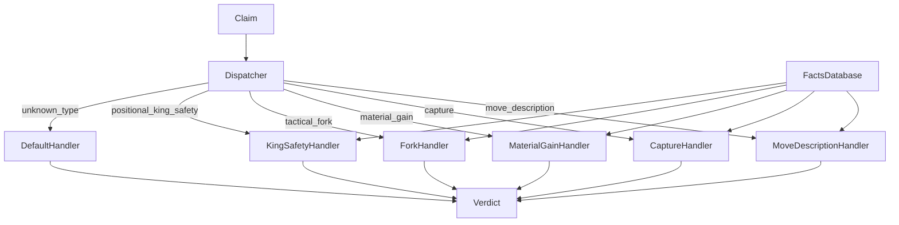

# 4. Symbolic Verifier

> **The verifier in one sentence**: A deterministic function that takes a structured claim and a facts database and emits a verdict with explanation — no LLM, no engine calls on the fly, no judgment calls outside the rule book.

This note specifies the verifier's contract, its internal structure, and the engineering discipline required to keep it trustworthy.

---

## 4.1 The Verifier's Contract

```text
verify(claim: Claim, facts: FactsDatabase) -> Verdict
```

Where:

- `Claim` is the structured output from the LLM (Chapter 3.3).
- `FactsDatabase` is the precomputed per-ply record (Chapter 2.4).
- `Verdict` is one of the six labels (Chapter 2.3) plus an explanation string.

The function is **pure**: same inputs always produce the same output. No I/O, no global state, no randomness. This is the verifier's defining property.

---

## 4.2 Internal Structure

The verifier is organized as a dispatcher plus per-type handlers:



Each handler is a self-contained module with:

- A `verify(claim, facts) -> Verdict` function.
- A documentation string specifying exactly what the handler checks.
- A unit test suite with at least 10 test cases (verified, contradicted, ambiguous each).

Adding a new claim type is **just** writing a new handler. The dispatcher and the rest of the system do not change. This modularity is what makes the verifier maintainable as the claim catalog grows.

---

## 4.3 The Dispatch Logic

The dispatcher is intentionally simple:

```python
HANDLERS = {
    "move_description": handle_move_description,
    "capture": handle_capture,
    "material_gain": handle_material_gain,
    "tactical_fork": handle_tactical_fork,
    "positional_king_safety": handle_king_safety,
    # ... one entry per supported claim type
}

def verify(claim, facts):
    handler = HANDLERS.get(claim.claim_type)
    if handler is None:
        return Verdict(
            label="Cannot verify automatically",
            explanation=f"Unsupported claim type: {claim.claim_type}"
        )
    try:
        return handler(claim, facts)
    except AmbiguousClaimError as e:
        return Verdict(label="Ambiguous", explanation=str(e))
    except FactLookupError as e:
        return Verdict(label="Cannot verify automatically", explanation=str(e))
```

Three things to notice:

1. **Unknown types are handled gracefully.** The verifier never crashes on an unknown claim type; it emits `Cannot verify automatically`.
2. **Ambiguity is a first-class outcome.** Handlers can raise `AmbiguousClaimError` to indicate that the claim parameters are too vague to verify.
3. **Fact lookup failures are non-fatal.** If a handler needs a fact that is missing from the database (e.g., no Stockfish evaluation available), it emits `Cannot verify automatically` rather than crashing.

---

## 4.4 A Worked Handler: `handle_capture`

Let's walk through the capture handler in full. This is the most common claim type and a good template for other handlers.

### 4.4.1 The handler's job

Given a claim like:

```json
{
  "claim_type": "capture",
  "params": {
    "piece": "bishop",
    "color": "white",
    "target_piece": "pawn",
    "target_color": "black",
    "target_square": "h7"
  },
  "target_ply_hint": null
}
```

The handler must:

1. Find the ply (or plies) where this capture could have occurred.
2. For each candidate ply, check whether the actual move matches the claim.
3. Emit a verdict.

### 4.4.2 Step 1: Find candidate plies

If `target_ply_hint` is provided, use it directly. Otherwise, search the facts database for plies where:

- The mover matches `claim.params.color`.
- The moved piece type matches `claim.params.piece`.
- The move was a capture.
- (Optional) The captured piece type matches `claim.params.target_piece`.
- (Optional) The destination square matches `claim.params.target_square`.

```python
def find_candidate_plies(claim, facts):
    candidates = []
    for ply in facts.plies:
        if ply.mover != claim.params.color:
            continue
        if ply.piece_type != piece_code(claim.params.piece):
            continue
        if not ply.is_capture:
            continue
        if claim.params.target_piece and ply.captured_piece != piece_code(claim.params.target_piece):
            continue
        if claim.params.target_square and ply.to_square != square_index(claim.params.target_square):
            continue
        candidates.append(ply)
    return candidates
```

### 4.4.3 Step 2: Verify the claim against candidates

```python
def handle_capture(claim, facts):
    candidates = find_candidate_plies(claim, facts)

    if len(candidates) == 0:
        return Verdict(
            label="Possible hallucination",
            explanation="No capture by a {color} {piece} found in the game.".format(
                color=claim.params.color, piece=claim.params.piece)
        )

    if len(candidates) == 1:
        ply = candidates[0]
        return Verdict(
            label="Verified",
            explanation="The move at ply {n} is {san}, a {color} {piece} capturing {target}.".format(
                n=ply.ply_index, san=ply.san, color=claim.params.color,
                piece=claim.params.piece,
                target=ply.captured_piece)
        )

    # Multiple candidates: ambiguous unless hint is provided
    if claim.target_ply_hint is not None:
        for ply in candidates:
            if ply.ply_index == claim.target_ply_hint:
                return Verdict(
                    label="Verified",
                    explanation="The move at ply {n} is {san}.".format(
                        n=ply.ply_index, san=ply.san)
                )

    return Verdict(
        label="Ambiguous",
        explanation="Multiple matching captures found at plies {plies}. Provide a target_ply_hint to disambiguate.".format(
            plies=[p.ply_index for p in candidates])
    )
```

### 4.4.4 Edge cases handled

- **No matching capture** → `Possible hallucination`.
- **Multiple matching captures** → `Ambiguous` (unless hint is provided).
- **Hint points to a non-capture ply** → `Contradicted` (the hint is wrong).
- **Claim has `target_piece` but the candidate ply captured a different piece** → candidate is filtered out.

---

## 4.5 Verdict Explanation Quality

The explanation string is the human-facing part of the verdict. It must:

1. **State the verdict reason in one sentence.** "The move at ply 12 is Bxh7+, a white bishop capturing a pawn."
2. **Reference a specific board fact.** Always include the ply index and the SAN. Never say "the position does not match" without saying which position.
3. **Be unambiguous about what the author should do.** "Black actually declined the sacrifice (Kh8)" tells the author exactly what to fix.

> [!warning] Avoid hedge words
> Phrases like "may not be correct", "seems to contradict", "appears unsupported" make the verdict feel weak. Use direct language: "is contradicted", "is not supported", "is a possible hallucination". The author needs to know what the system believes, not what it half-believes.

---

## 4.6 Testing the Verifier

The verifier is the most-tested component in the system. Three test categories:

### 4.6.1 Per-handler unit tests

Every handler has its own test file. Each test case provides:

- A claim object.
- A facts database (loaded from a test fixture).
- An expected verdict (label and a substring of the explanation).

```python
def test_capture_verified():
    claim = Claim(
        claim_type="capture",
        params=CaptureParams(color="white", piece="bishop",
                             target_piece="pawn", target_square="h7"),
        target_ply_hint=12
    )
    facts = load_facts("fixtures/sicilian.json")
    verdict = verify(claim, facts)
    assert verdict.label == "Verified"
    assert "Bxh7" in verdict.explanation
```

### 4.6.2 Property-based tests

For each claim type, generate random claims and random facts databases, and check invariants:

- The verifier never crashes.
- The verdict is always one of the six labels.
- The explanation is always non-empty.
- The same `(claim, facts)` always produces the same verdict.

### 4.6.3 End-to-end tests

Take a real chess note, run the full pipeline, and check that the verdicts match a human-authored expected report. These tests catch integration bugs that unit tests miss.

---

## 4.7 Common Pitfalls

### 4.7.1 Calling the engine on the fly

The verifier should never call Stockfish. All engine analysis is pre-computed and stored in the facts database. If a handler needs an evaluation, it looks it up; if the lookup fails, the verdict is `Cannot verify automatically`.

### 4.7.2 Using LLM to disambiguate

When a claim is ambiguous, you may be tempted to ask the LLM "which ply does this refer to?". That is fine **only** if the LLM's answer becomes part of the claim (re-extraction), not part of the verdict. The verifier must remain LLM-free.

### 4.7.3 Handler returns "Verified" for partial matches

A claim "the bishop captures the rook on a8" should be `Contradicted` if the bishop captured a pawn on h7, not `Verified` because "the bishop captured something". The handler must check **every** parameter in the claim, not just some.

### 4.7.4 Explanation strings too terse

"Ply 12 matches." is not a useful explanation. "The move at ply 12 is Bxh7+, a white bishop capturing a black pawn on h7." is.

### 4.7.5 Verifier depends on file I/O

The verifier should be a pure function. It should not read files, write files, or make network calls. All inputs are passed as arguments. File I/O lives in the orchestration layer.

---

## 4.8 Performance

The verifier is fast. For a typical claim with a 40-ply facts database:

- Candidate ply search: ~1 ms (linear scan, 40 plies).
- Per-candidate verification: ~0.1 ms (a few field comparisons).
- Verdict construction: ~0.1 ms.
- Total: **~1-2 ms per claim**.

For a note with 10 claims, total verifier time is ~20 ms. The LLM call (2-5 s) and Stockfish analysis (3-5 s) dominate. The verifier is essentially free.

This is intentional. The verifier runs many times during development and testing; keeping it fast keeps the development loop tight.

---

## 4.9 The Verifier as a Benchmark Surface

Because the verifier is deterministic and fast, it is the natural surface for benchmarking. To benchmark:

1. Build a test set of 200 claims with human-authored expected verdicts.
2. Run the verifier on the test set.
3. Measure agreement with the human verdicts.

Metrics:

- **Precision**: of the claims the verifier labeled `Verified` or `Contradicted`, how many match the human verdict?
- **Recall**: of the claims the human labeled `Verified` or `Contradicted`, how many did the verifier also label correctly?
- **F1**: harmonic mean of precision and recall.
- **Confusion matrix**: cross-tab of verifier vs. human verdicts, showing where they disagree.

This benchmarking surface is what makes the project publishable (Chapter 7.3). Without a deterministic verifier, you cannot benchmark; without benchmarking, you cannot publish.

---

## 4.10 Key Reminders

- The verifier is a **pure function**: `(claim, facts) -> verdict`. No I/O, no LLM, no engine calls.
- Organized as a dispatcher plus per-type handlers. Adding a claim type = adding a handler.
- Unknown claim types return `Cannot verify automatically` — never crash.
- Handlers can raise `AmbiguousClaimError` or `FactLookupError` for graceful degradation.
- Verdict explanations must reference specific board facts (ply index, SAN).
- Test every handler with unit tests, property-based tests, and end-to-end tests.
- Verifier time per claim: ~1-2 ms. Effectively free; the LLM and Stockfish dominate.
- Never call the engine on the fly. Never call the LLM for disambiguation. The verifier stays pure.
- The verifier's determinism is what enables benchmarking, which is what enables publishing.
