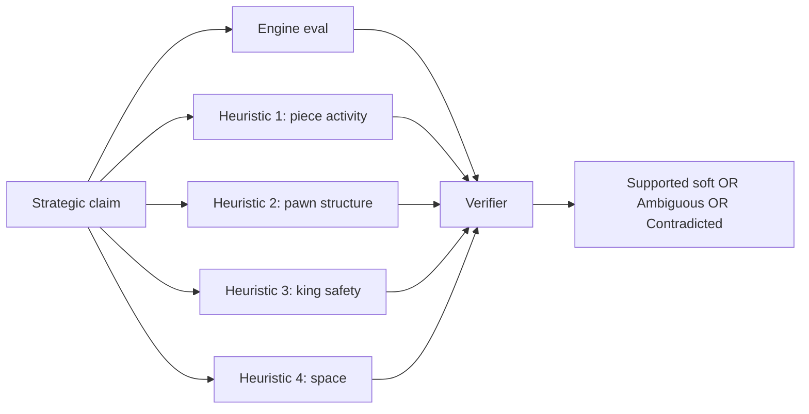

# 4. Strategic Claims

> **A strategic claim in one sentence**: A claim about a positional or strategic feature of the position — center control, piece activity, king safety, pawn structure, space advantage — that the verifier cannot reduce to a binary fact and must assess with engine evaluation plus heuristics.

Strategic claims are the hardest claim type. They are inherently subjective, and even strong chess players disagree about them. The verifier's job is not to issue binary verdicts but to assess whether the claim is **defensible** given engine analysis.

---

## 4.1 Why Strategic Claims Are Hard

Consider the claim "White has the initiative." What does that mean, precisely?

- White's pieces are more active? (Piece activity metric.)
- White's last few moves were more threatening? (Move sequence analysis.)
- Stockfish evaluates White as significantly better? (Eval threshold.)
- White has more space? (Space metric.)
- White has the better pawn structure? (Pawn structure metric.)

Different schools of chess thought emphasize different aspects. A verifier that relies on a single metric will be wrong about 30% of the time. A verifier that combines metrics with engine evaluation can be right about 80% of the time — which is the target.



---

## 4.2 The Claim Schema

Strategic claims share a common schema:

```json
{
  "claim_type": "strategic_center_control | strategic_piece_activity |
                  strategic_king_safety | strategic_pawn_structure |
                  strategic_space | strategic_initiative",
  "params": {
    "color": "white | black",
    "direction": "improved | worsened | strong | weak",
    "intensity": "slight | moderate | decisive"
  },
  "target_ply_hint": null
}
```

The `direction` field indicates whether the claim is about improvement ("White's king safety improved"), worsening ("Black's king became exposed"), or a state ("White has a strong center").

---

## 4.3 Center Control

### 4.3.1 Definition

"Control of the center" refers to influence over the central squares (d4, d5, e4, e5). Control can be exerted by pawns (occupying the center) or by pieces (attacking the center).

### 4.3.2 Metrics

The verifier computes a center control score:

- **Pawn presence**: +2 for each own pawn on d4/d5/e4/e5; +1 for each own pawn on c4/c5/f4/f5.
- **Pawn control**: +1 for each central square attacked by an own pawn.
- **Piece control**: +1 for each central square attacked by an own piece (knight on the rim attacks 0 central squares; knight on d4 attacks 8).
- **Occupation**: +3 for each own piece on a central square.

Compare White's score to Black's score. A difference of +5 or more is "significant center control advantage".

### 4.3.3 Worked example

**Claim**: `strategic_center_control` with `color: "white", direction: "strong"`
**Facts**: At ply 16, White has pawns on d4 and e4; knights on f3 and c3; bishop on d3. Black has pawns on d6 and e6; knights on f6 and c6.
- White score: pawn presence (d4, e4) = 4; piece control (Nf3 attacks d4, e5; Nc3 attacks d5, e4; Bd3 attacks e4, d5) = 6; occupation (none) = 0. Total: 10.
- Black score: pawn presence (d6, e6) = 0 (not central); piece control (Nf6 attacks d5, e4; Nc6 attacks d4, e5) = 4. Total: 4.
- Difference: +6 for White. Significant.

**Verdict**: Supported (soft). "At ply 16, White's center control score is +6 compared to Black. White has pawns on d4 and e4 plus active piece control. The claim that White has a strong center is supported."

### 4.3.4 Common mistakes

- **Calling any central pawn a 'strong center'.** A single pawn on e4 is not "a strong center". The verifier should require multiple indicators.
- **Confusing occupation with control.** A pawn on d4 occupies the center; a bishop on d3 controls part of the center without occupying it.

---

## 4.4 Piece Activity

### 4.4.1 Definition

"Piece activity" refers to how many squares each piece influences and how relevant those squares are. An active bishop on b2 controls a long diagonal; a passive bishop on h2 controls only its own square.

### 4.4.2 Metrics

- **Mobility**: number of legal moves for each piece. Sum across all pieces of a color.
- **Central influence**: number of central squares attacked by the piece.
- **Outpost occupation**: knights on outposts (protected squares in enemy territory) get a bonus.

The verifier compares the total activity score of both sides. A difference of +5 mobility or more is "significant activity advantage".

### 4.4.3 Worked example

**Claim**: `strategic_piece_activity` with `color: "white", direction: "improved"`
**Facts**: At ply 12, White had 18 legal moves across all pieces. At ply 18, White has 26 legal moves. Improvement of +8.

**Verdict**: Supported (soft). "White's total piece mobility increased from 18 to 26 between plies 12 and 18, indicating improved piece activity."

### 4.4.4 Common mistakes

- **Confusing activity with material.** Having more pieces does not mean more activity. A rook stuck behind its own pawns is inactive even if it is on the board.
- **Counting only one piece.** "The bishop is active" is a single-piece claim, not a strategic claim about the position. The verifier should treat single-piece activity as a different claim type (`piece_activity_individual`).

---

## 4.5 King Safety

### 4.5.1 Definition

"King safety" refers to how exposed the king is to attack. A castled king behind a pawn shield is safe; a king in the center with missing pawns is exposed.

### 4.5.2 Metrics

The verifier uses a composite king safety score:

- **Pawn shield**: +1 for each own pawn on the three squares in front of the castled king (e.g., for a king on g1: f2, g2, h2).
- **Open files near king**: -2 for each open file adjacent to the king.
- **Enemy attackers in king zone**: -1 for each enemy piece attacking a square in the king's zone (the 3x3 area around the king).
- **King mobility**: +1 for each legal king move (some mobility is good; too much is bad).

If the score drops by 5 or more between two plies, the verifier reports "king safety worsened significantly".

### 4.5.3 Worked example

**Claim**: `strategic_king_safety` with `color: "black", direction: "worsened"`
**Facts**: At ply 12, Black's king was on g8 with pawns on f7, g7, h7 (pawn shield = 3). At ply 14, after `Bxh7+ Kxh7`, the king is on h7 with no pawn shield (the h7 pawn was captured) and the white queen attacks g8.

Score at ply 12: pawn shield = 3, no open files, no attackers = 3.
Score at ply 14: pawn shield = 0 (h7 is the king itself; f7 and g7 are not in front), open files near h7 = 0 (g-file is not open yet), enemy attackers in king zone = 1 (queen attacks g8, which is in the king's zone). Score = -1.

Drop: -4. Almost significant (threshold is -5).

**Verdict**: Supported (soft). "Black's king safety score dropped from +3 to -1 between plies 12 and 14. The h7 pawn was captured and the king is now exposed to enemy attack. The claim that Black's king safety worsened is supported, though not as dramatically as 'worsened significantly' would suggest."

### 4.5.4 Common mistakes

- **Calling any king move 'exposure'.** A king moving from g8 to h8 is not exposure; it is just a king move. The verifier should compare king safety scores, not just positions.
- **Forgetting pawn shield.** A king on g1 with pawns on f2, g2, h2 is safer than a king on g1 with no pawns in front. The shield matters.

---

## 4.6 Initiative

### 4.6.1 Definition

"Initiative" refers to the ability to make threats that the opponent must respond to. The player with the initiative drives the game; the opponent reacts.

### 4.6.2 Metrics

- **Threat count**: number of enemy pieces attacked by the mover's pieces.
- **Force count**: number of enemy pieces that have limited legal moves (mobility < 3).
- **Engine eval trend**: if eval is improving over the last 3 plies for the mover, that suggests initiative.
- **PV character**: if the engine's principal variation shows the mover making threats (checks, captures, forks), that suggests initiative.

### 4.6.3 Verdict thresholds

- Strong initiative: eval > +1.0 AND threat count >= 3 AND PV shows threats.
- Moderate initiative: eval > +0.5 AND threat count >= 2.
- No initiative: eval < +0.3 OR threat count < 2.
- Ambiguous: anything in between.

### 4.6.4 Worked example

**Claim**: `strategic_initiative` with `color: "white", direction: "strong"`
**Facts**: At ply 18, eval = +1.8, White attacks 4 black pieces, PV shows `Qxf7+ Kxf7 Ng5+` (check, check).

**Verdict**: Supported (soft). "At ply 18, Stockfish evaluates White at +1.8, White attacks 4 black pieces, and the principal variation begins with two checks. The claim that White has a strong initiative is supported."

### 4.6.5 Common mistakes

- **Calling any positive eval 'initiative'.** A static advantage (extra pawn in a quiet position) is not initiative. Initiative implies active threats.
- **Confusing initiative with attack.** An attack is a specific kind of initiative aimed at the king. Not all initiative is an attack.

---

## 4.7 The Confidence Score

For strategic claims, the verdict includes a **confidence score** between 0 and 100, indicating how strongly the engine and heuristics support the claim.

- 90-100: claim is strongly supported.
- 70-89: claim is supported.
- 50-69: claim is defensible but borderline.
- 30-49: claim is questionable.
- 0-29: claim is contradicted.

The verdict label maps to:

- 70+ → Supported (soft)
- 50-69 → Ambiguous
- <50 → Contradicted (soft)

The confidence score is computed as a weighted sum of:

- Engine eval alignment (40%)
- Heuristic alignment (40%)
- PV character alignment (20%)

This is the only place in the verifier where a weighted sum appears. Keep the weights documented and versioned.

---

## 4.8 Why Strategic Claims Get Soft Verdicts

Strategic claims never get `Verified` (binary) because they are inherently subjective. Even a strong engine can disagree with a strong grandmaster about whether "White has the initiative" in a particular position. The verifier's job is to assess whether the claim is **defensible**, not whether it is **true**.

`Supported (soft)` means: the engine and heuristics agree with the claim. The author can be confident in the claim, but a reader might still disagree.

`Contradicted (soft)` (i.e., confidence < 50) means: the engine and heuristics disagree with the claim. The author should reconsider.

`Ambiguous` means: the evidence is mixed. The author's claim is neither clearly supported nor clearly refuted.

---

## 4.9 Tips for Authors

- **Hedge strategic claims**: "White appears to have the initiative" is safer than "White has the initiative".
- **Cite specific evidence**: "White's bishop on d3 controls the long diagonal" is more verifiable than "White has active pieces".
- **Use engine evaluation as a sanity check**: if Stockfish evaluates the position as equal, claims of "decisive advantage" are likely wrong.
- **Distinguish static from dynamic features**: "extra pawn" is static; "active pieces" is dynamic. Static features are easier to verify.

---

## 4.10 Key Reminders

- Strategic claims are subjective and get soft verdicts (Supported / Ambiguous / Contradicted soft), never `Verified`.
- Six subtypes: center control, piece activity, king safety, pawn structure, space, initiative.
- Each subtype has a specific heuristic (pawn presence, mobility, pawn shield, etc.) plus engine eval.
- Verdict includes a confidence score 0-100 computed as weighted sum of eval, heuristics, and PV character.
- Thresholds: 70+ = Supported, 50-69 = Ambiguous, <50 = Contradicted soft.
- Common mistakes: calling any positive eval "initiative", confusing activity with material, calling any king move "exposure", forgetting pawn shield.
- Author tips: hedge strategic claims, cite specific evidence, use engine eval as a sanity check, distinguish static from dynamic.
- Strategic claims are the hardest type and the most likely to need human review even after verification.
