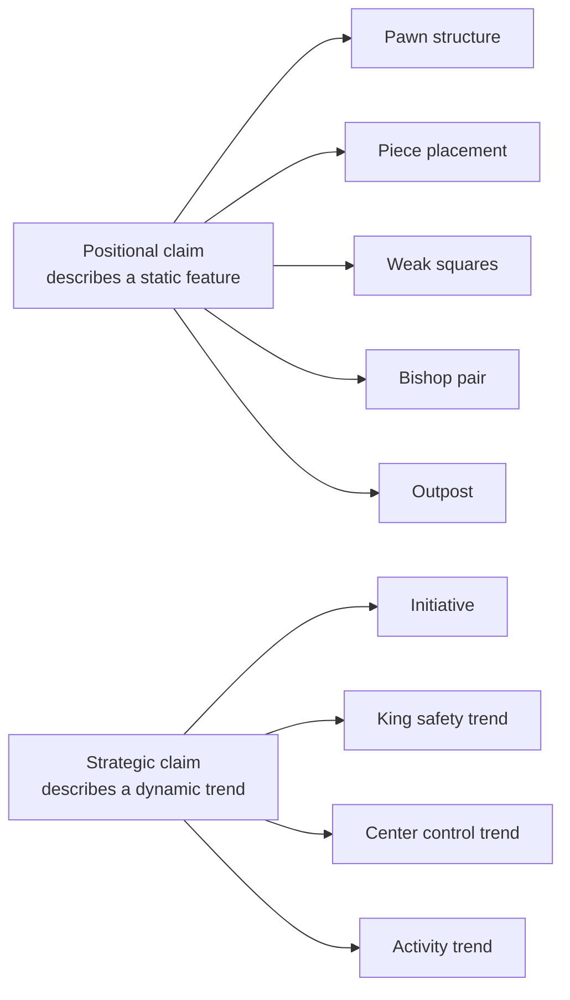

# 6. Positional Claims

> **A positional claim in one sentence**: A claim about a static feature of the position — pawn structure, piece placement, bishop pair, outpost, weak square — that the verifier assesses by combining board inspection with engine evaluation.

Positional claims overlap with strategic claims (Chapter 4.4) but are distinguished by being **static**: they describe the position at a moment in time, not a trend. "Black has doubled pawns" is positional; "Black's king safety worsened" is strategic.

---

## 6.1 Positional vs. Strategic — The Boundary



Both positional and strategic claims use the `Supported (soft)` / `Ambiguous` / `Contradicted (soft)` verdict family. The difference is in the verification method:

- **Positional**: check the board state directly (pawn structure, piece placement).
- **Strategic**: check trends over multiple plies plus engine eval.

---

## 6.2 The Claim Schema

```json
{
  "claim_type": "positional_doubled_pawns | positional_isolated_pawn |
                  positional_backward_pawn | positional_bishop_pair |
                  positional_outpost | positional_weak_square |
                  positional_open_file | positional_half_open_file",
  "params": {
    "color": "white | black",
    "file": "c | d | e | null",
    "square": "d5 | null",
    "piece_type": "knight | null"
  },
  "target_ply_hint": null
}
```

Each positional subtype has its own parameter requirements, documented below.

---

## 6.3 Doubled Pawns

### 6.3.1 Definition

Two pawns of the same color on the same file. Tripled pawns are three on the same file.

### 6.3.2 Algorithm

For each file, count the number of own pawns. If >= 2, the color has doubled pawns on that file.

```python
def find_doubled_pawns(board, color):
    files = defaultdict(int)
    for square in chess.SQUARES:
        piece = board.piece_at(square)
        if piece and piece.color == color and piece.piece_type == chess.PAWN:
            files[chess.square_file(square)] += 1
    return {file: count for file, count in files.items() if count >= 2}
```

### 6.3.3 Worked example

**Claim**: `positional_doubled_pawns` with `color: "black", file: "c"`
**Facts**: At ply 18, Black has pawns on c6 and c7 (after `cxb6 cxb6` or similar).

**Verdict**: Verified. "At ply 18, Black has doubled pawns on the c-file (c6 and c7)."

### 6.3.4 Common mistakes

- **Confusing doubled with isolated.** Doubled means two on the same file; isolated means no friendly pawns on adjacent files.
- **Tripled pawns.** Some authors say "doubled" for any stacking. The verifier should mention "tripled" if there are three.

---

## 6.4 Isolated Pawn

### 6.4.1 Definition

A pawn with no friendly pawns on either adjacent file. An isolated d-pawn has no friendly c- or e-pawns.

### 6.4.2 Algorithm

For each own pawn, check the two adjacent files. If neither has an own pawn, the pawn is isolated.

### 6.4.3 Worked example

**Claim**: `positional_isolated_pawn` with `color: "white", file: "d"`
**Facts**: At ply 20, White has a pawn on d4. White has no pawns on the c-file or e-file.

**Verdict**: Verified. "At ply 20, White has an isolated d-pawn (no friendly pawns on the c or e files)."

### 6.4.4 Common mistakes

- **Forgetting that "isolated" means no pawns on adjacent files**, not "no pieces on adjacent files". A knight on c3 does not un-isolate a d-pawn; only a c-pawn or e-pawn does.
- **Counting doubled isolated pawns as one.** Two doubled pawns on an isolated file are both isolated.

---

## 6.5 Backward Pawn

### 6.5.1 Definition

A pawn that is on an open or half-open file, behind its neighbors, and cannot advance safely because the advance square is controlled by the opponent.

### 6.5.2 Algorithm

For each own pawn on a half-open file (no enemy pawns on this file, no friendly pawns ahead of it on this file):

1. Identify the advance square (one rank ahead for white, one rank behind for black).
2. Check if the advance square is attacked by an enemy pawn.
3. Check if the advance square is defended by a friendly pawn (if so, the pawn is not backward).
4. If the advance square is attacked by enemy pawns and not defended by friendly pawns, the pawn is backward.

### 6.5.3 Worked example

**Claim**: `positional_backward_pawn` with `color: "white", file: "d"`
**Facts**: At ply 22, White has a pawn on d4. The d-file is half-open (no black pawns). The advance square d5 is attacked by a black pawn on c6 and a black pawn on e6. White has no pawns on c or e to defend d5.

**Verdict**: Verified. "At ply 22, White has a backward d-pawn. The d5 advance square is controlled by black pawns on c6 and e6, and White has no pawns to defend it."

### 6.5.4 Common mistakes

- **Forgetting the "half-open file" requirement.** A pawn on a closed file (with enemy pawns still on it) is not backward; it is just stuck.
- **Forgetting the "cannot advance safely" requirement.** A pawn that can advance without being captured is not backward, even if the file is half-open.

---

## 6.6 Bishop Pair

### 6.6.1 Definition

A color has "the bishop pair" if it has both its bishops (i.e., it has not lost either bishop). The bishop pair is generally considered worth about +0.5 pawns.

### 6.6.2 Algorithm

Count the number of bishops of the given color. If == 2, the color has the bishop pair.

### 6.6.3 Worked example

**Claim**: `positional_bishop_pair` with `color: "white"`
**Facts**: At ply 14, White has bishops on c1 and f1.

**Verdict**: Verified. "At ply 14, White has both bishops (the bishop pair)."

### 6.6.4 Common mistakes

- **Confusing bishop pair with two bishops.** The bishop pair specifically means both bishops of opposite colors (light-squared and dark-squared). Two bishops of the same color are impossible in standard chess.
- **Forgetting that one bishop being captured breaks the pair.** The verifier should re-check at the target ply.

---

## 6.7 Outpost

### 6.7.1 Definition

An outpost is a square on the opponent's side of the board (ranks 5-7 for White; ranks 2-4 for Black) that:

- Cannot be attacked by an enemy pawn.
- Is occupied (or could be occupied) by a friendly piece, typically a knight.

### 6.7.2 Algorithm

For each square on the opponent's side:

1. Check that no enemy pawn can attack this square (look at the diagonal squares one rank closer to the friendly side).
2. Check that a friendly piece (especially a knight) occupies or could occupy the square.
3. (Optional) Check that the square is defended by a friendly pawn.

### 6.7.3 Worked example

**Claim**: `positional_outpost` with `color: "white", square: "d5"`
**Facts**: At ply 18, White has a knight on d5. No black pawn can attack d5 (no black pawns on c6 or e6). The knight is defended by a white pawn on c4.

**Verdict**: Verified. "At ply 18, White has a knight on an outpost on d5. No black pawn can attack d5, and the knight is defended by the c4 pawn."

### 6.7.4 Common mistakes

- **Calling any advanced knight an outpost.** An advanced knight that can be driven away by an enemy pawn is not on an outpost.
- **Forgetting the defender.** A knight on an outpost that is undefended and could be captured is not a strong outpost.

---

## 6.8 Weak Square

### 6.8.1 Definition

A weak square is a square that:

- Cannot be defended by a friendly pawn.
- Is controlled by an enemy piece.
- Is strategically important (often in the player's own territory).

### 6.8.2 Algorithm

For each square in the player's territory:

1. Check that no friendly pawn can defend it.
2. Check that an enemy piece attacks it.
3. (Optional) Check strategic relevance (e.g., it is in front of the king).

### 6.8.3 Worked example

**Claim**: `positional_weak_square` with `color: "black", square: "d5"`
**Facts**: At ply 20, no black pawn can defend d5 (black has pawns on c6 and e6, but neither can defend d5). A white knight on f4 attacks d5.

**Verdict**: Verified. "At ply 20, d5 is a weak square for Black. No black pawn can defend it, and a white knight on f4 controls it."

### 6.8.4 Common mistakes

- **Calling any attacked square weak.** A square defended by a friendly pawn is not weak, even if attacked.
- **Forgetting strategic relevance.** A weak square on a1 is rarely relevant; a weak square in front of the king is critical.

---

## 6.9 Open and Half-Open Files

### 6.9.1 Definition

- **Open file**: no pawns of either color on the file.
- **Half-open file**: pawns of one color but not the other.

### 6.9.2 Algorithm

For each file, count own pawns and enemy pawns:

- 0 own, 0 enemy → open.
- N own (N>=1), 0 enemy → half-open for enemy.
- 0 own, N enemy → half-open for own.

### 6.9.3 Worked example

**Claim**: `positional_open_file` with `color: "white", file: "e"`
**Facts**: At ply 24, no pawns of either color on the e-file.

**Verdict**: Verified. "At ply 24, the e-file is open."

**Claim**: `positional_half_open_file` with `color: "white", file: "c"`
**Facts**: At ply 24, White has a pawn on c2; Black has no pawns on the c-file.

**Verdict**: Verified. "At ply 24, the c-file is half-open for Black (Black has no pawns on it; White has one)."

### 6.9.4 Common mistakes

- **Confusing open and half-open.** A half-open file has pawns of one color; an open file has none.
- **Forgetting the color perspective.** "Half-open for White" means White has no pawns on it (and Black might); "half-open for Black" means Black has no pawns (and White might). The perspective matters for who can use the file.

---

## 6.10 The Confidence Score for Positional Claims

Positional claims use a simpler confidence score than strategic claims:

- **Structural facts** (doubled pawns, isolated pawn, bishop pair, open file): these are either true or false. The verdict is `Verified` or `Contradicted`, not soft.
- **Strategic-relevance claims** (weak square is critical, outpost is strong): these get soft verdicts with a confidence score based on engine eval alignment.

The hybrid approach reflects reality: structural facts are objective, but their strategic importance is subjective.

---

## 6.11 Worked Multi-Claim Example

Consider this prose: "Black has doubled pawns on the c-file, an isolated d-pawn, and a weak square on d5. White has the bishop pair and a strong outpost on e6."

This produces four positional claims:

1. `positional_doubled_pawns` with `color: "black", file: "c"` → Verified if doubled.
2. `positional_isolated_pawn` with `color: "black", file: "d"` → Verified if isolated.
3. `positional_weak_square` with `color: "black", square: "d5"` → Verified if weak.
4. `positional_bishop_pair` with `color: "white"` → Verified if both bishops.
5. `positional_outpost` with `color: "white", square: "e6"` → Verified if outpost.

Each claim is verified independently. The verifier does not require all five to be true for the overall prose to be acceptable; each claim stands or falls on its own.

---

## 6.12 Tips for Authors

- **Name the file or square** when claiming a structural feature: "doubled pawns on the c-file" is clearer than "doubled pawns".
- **Specify the color**: "Black's doubled pawns" rather than "the doubled pawns".
- **Distinguish open from half-open**: "half-open file for White" is precise; "open file" is wrong if pawns remain.
- **Mention the defender** for outposts: "knight on a defended outpost on d5".
- **Avoid overclaiming**: "weak square" is structural; "critical weak square" is strategic and harder to verify.

---

## 6.13 Key Reminders

- Positional claims describe static features; strategic claims describe trends. Both use soft verdicts for subjective aspects.
- Structural subtypes: doubled pawns, isolated pawn, backward pawn, bishop pair, outpost, weak square, open file, half-open file.
- Structural facts (doubled, isolated, bishop pair, open file) get binary verdicts (Verified/Contradicted).
- Strategic-relevance claims (weak square is critical, outpost is strong) get soft verdicts with confidence scores.
- Common mistakes: confusing doubled with isolated, forgetting the half-open requirement for backward pawns, calling any advanced knight an outpost, forgetting the defender.
- Author tips: name the file/square, specify color, distinguish open from half-open, mention the defender, avoid overclaiming.
- Positional claims are less common than move/capture/material claims but appear frequently in annotated games. Worth supporting in v2.
