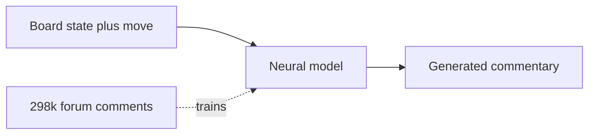

# 1. Chess Commentary Generation

> **The field in one sentence**: A body of NLP research that takes a chess game (PGN) as input and produces natural-language commentary as output — the inverse of what this project does.

This is the largest and most mature area of chess-related NLP. Understanding it is essential because (a) it provides the datasets we will reuse, (b) it sets the methodological baseline, and (c) it is the most common source of confusion for newcomers who assume "chess NLP must already do verification".

---

## 1.1 The Seminal Paper

**Title**: *Learning to Generate Move-by-Move Commentary for Chess Games from Large-Scale Social Forum Data*
**Venue**: ACL 2018
**Authors**: Harsh Jhamtani, Varun Gangal, Eduard Hovy, Graham Neubig, Taylor Berg-Kirkpatrick
**Link**: [ACL Anthology](https://aclanthology.org/P18-1154/)

### What they did

- Collected ~298,000 (move, commentary) pairs from online chess forums (primarily Reddit's r/chess and similar sources).
- Aligned each comment to a specific move in a specific game.
- Trained neural models (LSTM-based seq2seq) to generate commentary from (board state, move) pairs.
- Released the dataset publicly.

### Why it matters

This paper established that:

1. **Large-scale chess-language data exists** and can be aligned automatically.
2. **Neural models can learn the mapping** from (board, move) to commentary, at least at the level of "this move is a developing move" or "this captures a piece".
3. **The dataset is reusable** for other tasks — including ours.

### What it does NOT do

- It does not verify commentary. It generates commentary.
- It does not handle multi-sentence commentary well — most of the dataset is single sentences aligned to single moves.
- It does not use engine analysis. The model is purely data-driven, which means it inherits whatever errors are in the training data.

The diagram shows the direction: **board → commentary**, not **commentary → verification**.

---

## 1.2 The Inverse-Task Insight

The most important conceptual point in this chapter:

> Our project is the **inverse** of chess commentary generation. They go from board to text; we go from text back to board.

This matters for three reasons:

1. **Datasets are reusable.** The ACL 2018 dataset of 298k (move, comment) pairs can be repurposed for verification: take the comment, extract claims, check the claims against the move. This is essentially free training data.

2. **Methods are NOT directly reusable.** A model trained to generate commentary cannot be inverted to verify commentary. The two tasks require different architectures.

3. **The research gap is clear.** If generation is well-studied and verification is not, that is a research opportunity, not a flaw in the existing literature.

---

## 1.3 Subsequent Work

After the 2018 paper, several follow-up works extended the generation task:

- **Jhamtani and Berg-Kirkpatrick (2020)** — used transformers for commentary generation, improving fluency.
- **Ghostwalker / ChessCommentator (2022)** — open-source commentary generators using GPT-2 / GPT-Neo.
- **Various Lichess-bot integrations** — automated post-game commentary on Lichess.

All of these go in the same direction: board → commentary. None of them verify commentary.

---

## 1.4 What We Can Reuse from This Literature

### 1.4.1 The ACL Chess Commentary dataset

The 298k (move, comment) pairs are a goldmine for our project. We can use them to:

- **Train claim extractors.** Each comment can be fed to an LLM to extract claims, which can then be verified against the move. The resulting (comment, claims, move, verdict) tuples are training data for improving claim extraction.
- **Build a test set.** Sample 1000 comments, manually label the claims as correct or incorrect, and use this as a held-out test set for the verifier.
- **Calibrate confidence scores.** The distribution of "claim types" in the dataset tells us which claim types are most common and therefore which the verifier must support first.

### 1.4.2 Methodological standards

The 2018 paper established methodological standards we should adopt:

- **Per-move alignment**: every claim must be aligned to a specific ply. This is exactly what our `target_ply_hint` is for.
- **Human evaluation**: human ratings on a sample of model outputs. We should do the same for our verifier's verdicts.
- **Automatic metrics**: BLEU, ROUGE, etc. for generation; precision, recall, F1 for verification.

### 1.4.3 The vocabulary of claim types

The 2018 paper informally categorizes commentary into types: move description, planning, comparison, evaluation. Our Chapter 4 claim type catalog is essentially a refinement of this categorization, made strict enough to support verification.

---

## 1.5 What We Cannot Reuse

### 1.5.1 Generation models

A model trained to generate commentary from board state is useless for verification. The two tasks are different:

- **Generation**: given board, produce text. The model learns `P(text | board)`.
- **Verification**: given text and board, produce verdict. The model learns `P(verdict | text, board)`.

These are different distributions. A generation model has no notion of "this commentary is wrong"; it only knows "this commentary is typical" or "this commentary is atypical".

### 1.5.2 Automatic metrics for generation

BLEU and ROUGE measure text similarity. They are useless for verification, where the question is "is this claim true", not "is this text similar to a reference".

### 1.5.3 The "typical commentary" baseline

One naive approach is: "compare the commentary to a generation model's output; if they differ, the commentary is wrong." This fails because there are many valid ways to describe the same move. A model that says "the knight develops to f3" and a model that says "White brings out the knight" are both correct, but BLEU would say they are different.

---

## 1.6 Why This Literature Matters for Our Pitch

When you pitch this project to a research audience, you should:

1. **Acknowledge the generation literature.** It establishes that the broader area is active and respected.
2. **Position verification as the missing half.** "Generation is well-studied; verification is not. We address the missing half."
3. **Cite the ACL 2018 paper as the dataset source.** This shows you know the literature and are not reinventing the dataset.
4. **Highlight the methodological symmetry.** Per-move alignment, claim type taxonomies, human evaluation — these are the same standards, applied to a different task.

This framing turns the existing literature from "competition" into "foundation". Researchers respond much better to "we build on your work" than to "we replace your work".

---

## 1.7 Risk: Mistaking Generation for Verification

The single most common mistake newcomers make is to assume that "if we can generate commentary, we can verify it". This is wrong, and the wrongness matters.

A generation model can tell you: "given this board, the most likely commentary is X". It cannot tell you: "given this commentary, is it true?". The first is a likelihood question; the second is a truth question. They are different.

If you build a "verifier" by running a generation model and comparing outputs, you get a system that flags unusual commentary as wrong. But unusual commentary is often correct (creative phrasings, deep strategic insights) and typical commentary is often wrong (LLM hallucinations sound typical). The system would have it backwards.

> [!warning] The "compare to reference" trap
> Do not build a verifier by generating commentary and comparing to the human commentary. This approach cannot detect factual errors in well-phrased sentences. Use the symbolic verifier, not a generation model.

---

## 1.8 Key Reminders

- Chess commentary generation goes from board to text. Our project goes from text to verification. They are inverse tasks.
- The seminal paper is ACL 2018 (Jhamtani et al.), with a 298k (move, comment) dataset.
- We reuse the dataset and the methodology (per-move alignment, claim taxonomies, human evaluation).
- We do NOT reuse the generation models — they cannot verify.
- We do NOT use generation-reference comparison as a verification method.
- The literature establishes the foundation; verification is the missing half.
- When pitching: position verification as a complement to generation, not a replacement.
- The most common newcomer mistake is assuming generation can verify. It cannot.
