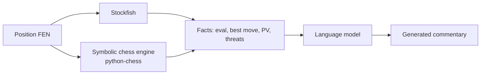
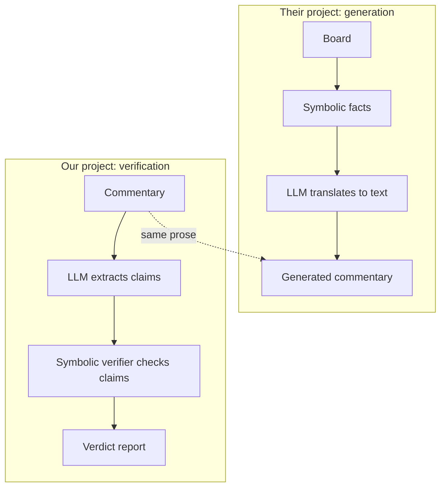

# 2. Hybrid Symbolic and Language Models

> **The closest existing research**: A 2022 paper that combines Stockfish, a symbolic chess engine, and a language model to **generate** grounded commentary — the architectural pattern our project **inverts** to do verification.

This is the single most relevant paper for our project. Understanding it deeply is essential.

---

## 2.1 The Paper

**Title**: *Improving Chess Commentaries by Combining Language Models with Symbolic Reasoning Engines*
**Year**: 2022
**Link**: [arXiv 2212.08195](https://arxiv.org/abs/2212.08195)

### Core motivation

LLMs hallucinate. When asked to comment on a chess position, they invent facts: wrong pieces, wrong squares, wrong tactics. The authors want to reduce hallucinations by **grounding** the language model in symbolic facts from a chess engine.

### Core method



The pipeline:

1. Take a chess position.
2. Run Stockfish to get evaluations, best moves, principal variations.
3. Run a symbolic chess engine to get tactical facts: pins, forks, skewers, material balance.
4. Feed both into a language model, which converts the structured facts into natural language.

The LLM never has to "understand" the position. It only has to convert structured facts into English. This dramatically reduces hallucinations, because the LLM cannot invent facts that are not in its input.

### Key insight

> The LLM should be a **translator** from structured facts to natural language, not a **reasoner** about chess positions.

This is the same insight our project uses, except we apply it in the opposite direction.

---

## 2.2 The Symmetry with Our Project



Both projects:

- Use a symbolic engine (Stockfish + python-chess) as the source of truth.
- Use an LLM only for natural-language processing (translation in their case, extraction in ours).
- Keep the LLM away from chess reasoning.

The difference is the direction:

- **Their project**: board → facts → text.
- **Our project**: text → claims → facts → verdict.

Both projects share the same architectural commitment: **separate language understanding from chess reasoning**.

---

## 2.3 What We Can Reuse

### 2.3.1 The fact vocabulary

Their paper defines a vocabulary of "facts" that the symbolic engine provides to the LLM:

- Material balance
- Best move (from Stockfish)
- Principal variation
- Tactical patterns (pins, forks, skewers)
- Threats (what the opponent is attacking)
- King safety
- Pawn structure features

This is **almost exactly** the fact vocabulary our verifier needs. We can adopt their taxonomy directly, with minor extensions for claim types they did not need (e.g., they did not need a "is_check" flag because the LLM generates the description; we need it because the LLM extracts the claim).

### 2.3.2 The prompt template

Their prompt template for the LLM looks roughly like:

```text
Position: [FEN]
Material: White +1 (White has an extra pawn)
Best move: Nf3 (develops the knight, controls e5)
Tactics: None
Threats: Black is threatening ...Bxc3, winning the bishop pair.
King safety: Black's king is exposed on e8.

Generate a one-sentence commentary.
```

We can adapt this template for **claim extraction**:

```text
Sentence: "White develops the knight and controls e5."

Extract structured claims. The available fact types are:
- material_balance
- best_move
- tactical_pattern
- threat
- king_safety
- pawn_structure

For each claim, identify the type and parameters.
```

The fact vocabulary transfers directly; only the prompt's task description changes.

### 2.3.3 The evaluation methodology

They evaluate generated commentary with:

- **BLEU** against reference commentary.
- **Human ratings** on fluency, correctness, and usefulness.
- **Hallucination rate**: fraction of generated sentences that contained a factually wrong statement.

The hallucination rate metric is directly transferable to our project. We can use the same metric to evaluate our verifier: of the claims the verifier labels `Verified`, what fraction are actually true (by human judgment)?

---

## 2.4 What We Cannot Reuse

### 2.4.1 The generation model

Their LLM is trained to generate text from facts. Our LLM is prompted to extract claims from text. The two tasks use the same vocabulary but require different prompts and different evaluation.

### 2.4.2 The "grounding" framing

Their framing is "ground the LLM's generation in symbolic facts". Our framing is "verify the LLM's output against symbolic facts". The mechanism is similar (both use symbolic facts as ground truth), but the application is different.

### 2.4.3 The output format

Their output is natural-language commentary. Our output is a structured verdict report. We cannot reuse their output format.

---

## 2.5 Why This Paper Is the Closest Existing Work

Three reasons:

1. **Architectural similarity.** Both projects separate language from chess reasoning. Their architecture is essentially our Track A (facts from board) feeding into an LLM, except in their case the LLM generates and in our case the LLM extracts.

2. **Shared vocabulary.** Their fact types are nearly identical to our claim types. Their work validates our taxonomy.

3. **Shared motivation.** Both projects exist because LLMs hallucinate about chess. Their solution is to ground generation; our solution is to verify claims. Both are responses to the same underlying problem.

When you cite this paper, the natural framing is: "We extend [Their paper]'s insight that LLMs should be grounded in symbolic facts. Where they apply this insight to generation, we apply it to verification."

---

## 2.6 What This Paper Does NOT Address

### 2.6.1 Verification

The paper does not verify commentary. It generates commentary from facts. If you handed their system a piece of human-written commentary, it could not tell you whether the commentary was correct.

### 2.6.2 Multi-sentence reasoning

Their system generates one sentence at a time, aligned to one move. It does not handle multi-sentence commentary that makes claims spanning several moves (e.g., "White sacrifices the bishop on move 17, exposing Black's king, and wins material by move 22"). Our project must handle this.

### 2.6.3 Document-level checking

Their system operates at the move level. Our project operates at the document level (a Markdown note with potentially multiple games and many prose sentences). The orchestration is more complex.

### 2.6.4 Ambiguity handling

Their system does not need to handle ambiguous claims (it generates, not verifies). Our project must handle ambiguity as a first-class concern (Chapter 4).

---

## 2.7 Implications for Our Project

This paper has three concrete implications for our design:

### 2.7.1 Adopt their fact vocabulary

Their fact types are well-validated and cover most of what chess commentary talks about. Adopt them as the basis for our claim type taxonomy. The mapping is:

| Their fact type | Our claim type |
|---|---|
| material_balance | material_gain, material_loss, material_equal |
| best_move | (not a claim type; metadata) |
| tactical_pattern | tactical_fork, tactical_pin, tactical_skewer, etc. |
| threat | (not a claim type; metadata) |
| king_safety | strategic_king_safety |
| pawn_structure | positional_doubled_pawns, positional_isolated_pawn, etc. |

### 2.7.2 Reuse their evaluation methodology

Use the same hallucination rate metric. Use the same human evaluation categories (fluency, correctness, usefulness) for the verifier's verdicts (verdict clarity, verdict correctness, verdict usefulness).

### 2.7.3 Cite them as the architectural precedent

When justifying the separation of language from chess reasoning, cite this paper. The argument is: "This architecture has been validated for generation; we extend it to verification."

---

## 2.8 Risk: Over-Citing, Under-Differentiating

A common mistake is to cite this paper so heavily that your project looks like a minor extension. Avoid this by being explicit about what is new:

- **Their direction**: board → text.
- **Our direction**: text → verdict.
- **Their problem**: reduce hallucinations in generation.
- **Our problem**: detect hallucinations in existing text.

These are different problems with different evaluation criteria. The shared architecture is a foundation, not the contribution.

---

## 2.9 Key Reminders

- The 2022 paper (arXiv 2212.08195) is the closest existing work.
- Their architecture: board → symbolic facts → LLM → generated commentary.
- Our architecture: commentary → LLM → claims → symbolic verifier → verdict.
- Both share the core insight: separate language from chess reasoning.
- We reuse their fact vocabulary (material, tactics, king safety, pawn structure) as our claim type taxonomy.
- We reuse their evaluation methodology (hallucination rate, human evaluation categories).
- We do NOT reuse their generation model.
- When citing: position our work as extending their insight from generation to verification, not as a minor extension of their paper.
- Their paper validates our architectural commitment. Use it as evidence that the separation of concerns is the right design.
