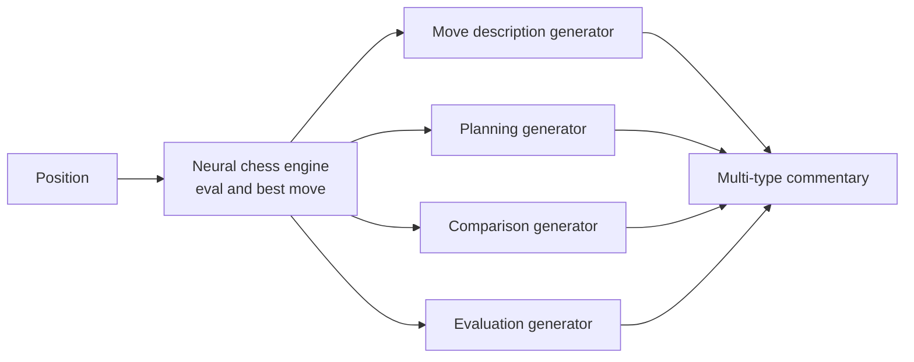

# 3. Neural Chess Commentary Systems

> **The field in one sentence**: A family of systems that use neural networks (often including neural chess engines like AlphaZero / Leela Chess Zero) to generate categorized commentary — move descriptions, planning, evaluation, comparison — rather than the free-form commentary of the ACL 2018 lineage.

This is a smaller but distinct line of work. It matters for our project because it introduces the **commentary categorization** that our claim type taxonomy refines.

---

## 3.1 The Representative Paper

**Title**: *Automated Chess Commentator Powered by Neural Chess Engine*
**Year**: 2019
**Link**: [arXiv 1909.10413](https://arxiv.org/abs/1909.10413)

### Core idea

Rather than generating free-form commentary, this system categorizes commentary into types and generates type-specific commentary:

- **Move description**: "The knight moves to f3."
- **Planning**: "White intends to build a pawn storm on the kingside."
- **Comparison**: "Instead of Bxc6, Nf3 was stronger because..."
- **Evaluation**: "White stands slightly better due to the bishop pair."

For each type, the system has a specialized generator. The neural chess engine (Leela Chess Zero in this case) provides evaluations and best-move lines.

### Direction

Same as the rest of the generation literature: **board → commentary**. Not verification.

---

## 3.2 Why This Matters for Our Project

### 3.2.1 Commentary categorization is validated

This paper validates the idea that chess commentary can be usefully categorized. Our Chapter 4 claim type taxonomy (move descriptions, captures, tactical, strategic, material, positional) is a refinement of their categorization, made stricter for verification purposes.

The mapping:

| Their category | Our claim types |
|---|---|
| Move description | move_description, capture |
| Planning | strategic_initiative, positional_outpost |
| Comparison | (not directly supported in v1; would be a v2 claim type) |
| Evaluation | material_equal, strategic_king_safety, strategic_center_control |

### 3.2.2 Type-specific generators suggest type-specific verifiers

Their system uses a different generator for each commentary type. Our system uses a different verifier for each claim type. The architectural symmetry is reassuring: if type-specific generation is the right design, type-specific verification is probably also the right design.

### 3.2.3 The neural engine provides different facts than Stockfish

This paper uses Leela Chess Zero, which provides:

- Evaluations (similar to Stockfish).
- Best moves (similar to Stockfish).
- **Move probabilities** (a distribution over moves, not just the top one).
- **Style preferences** (Leela tends to prefer active play; Stockfish tends to prefer materialist play).

For our project, we use Stockfish because it is more standard and easier to integrate. But Leela's move probabilities are interesting for a v2+ feature: "the engine preferred Nf3 over Bxc6" is a comparison claim that Leela can support natively.

---

## 3.3 What This Paper Does NOT Do

### 3.3.1 Verification

Like the rest of the generation literature, this paper does not verify commentary. It generates commentary by category.

### 3.3.2 Cross-category claims

A sentence like "The knight move to f3 not only develops a piece but also sets up a kingside attack" spans two categories (move description and planning). Their system generates these as separate sentences; it does not handle multi-category claims within one sentence. Our project must handle this.

### 3.3.3 Document-level claims

Their system operates at the move level. Our project operates at the document level.

---

## 3.4 Other Neural Commentary Systems

### 3.4.1 Ghostwriter

An open-source commentary generator using GPT-2 / GPT-Neo. Generates free-form commentary; does not categorize.

### 3.4.2 Lichess automatic commentary

Lichess has experimented with auto-generated post-game commentary. The system is closed-source but appears to use a combination of templates and ML.

### 3.4.3 Chess.com game review

Chess.com's "Game Review" feature provides move-by-move commentary. It uses Stockfish for evaluation and templates for natural language. Notably, it does NOT use an LLM for the commentary itself — the commentary is template-based. This is interesting because it suggests that even large commercial platforms do not trust LLMs alone for commentary generation.

---

## 3.5 The "Commentary Quality" Question

A common question: "How good is the commentary these systems generate?"

The honest answer: **mediocre**. State-of-the-art commentary generators produce text that is:

- Grammatically fluent.
- Often factually correct (when grounded in engine facts).
- Generally shallow (the systems do not produce deep strategic insights).
- Repetitive (the same template phrases appear across many moves).

This is actually good news for our project. It means:

1. **There is a market for verification.** If generated commentary were perfect, no one would need verification. The fact that it is mediocre creates the demand.
2. **Our verifier does not need to be perfect.** Even a verifier that catches 80% of errors is valuable because the underlying commentary is bad enough that 80% is a big improvement.
3. **The bar for "useful verifier" is achievable.** We do not need to match a grandmaster's verification ability. We need to be better than the alternative (no verification at all), which is a low bar.

---

## 3.6 Why This Literature Does Not Solve Our Problem

The reason is structural: **all of these systems go in the wrong direction**. They take a board as input and produce commentary. None of them take commentary as input and produce a verdict.

You might think: "Could we use one of these systems to generate 'reference commentary' and compare?" This is the "compare to reference" approach, and it fails for the reasons discussed in [[Chapter 5. Research Landscape/1. Chess Commentary Generation|1. Chess Commentary Generation]]: there are many valid ways to describe the same move, and BLEU/similarity metrics cannot distinguish "different but correct" from "different and wrong".

The only way to verify commentary is to **extract claims and check them against the board**, which is what our project does. None of the existing systems do this.

---

## 3.7 Implications for Our Design

### 3.7.1 Adopt the categorization, refine for verification

Use their four categories (move description, planning, comparison, evaluation) as a starting point. Refine each into specific claim types:

- Move description → `move_description`, `capture`, `material_gain` (split by what is being claimed).
- Planning → `strategic_initiative`, `strategic_center_control`, `positional_outpost` (split by what kind of plan).
- Comparison → (defer to v2; needs multi-line claim support).
- Evaluation → `material_equal`, `strategic_king_safety`, `positional_weak_square` (split by what is being evaluated).

### 3.7.2 Use Stockfish, not Leela, for v1

Stockfish is more standard, easier to integrate, and produces the same evaluations Leela does for our purposes. Leela's move probabilities are interesting but not essential for v1.

### 3.7.3 Type-specific verifiers

Following their type-specific generators, use type-specific verifiers (one handler per claim type, as in Chapter 3.4). This is the architectural symmetry.

---

## 3.8 Key Reminders

- Neural chess commentary systems generate categorized commentary from board state.
- The representative paper (arXiv 1909.10413) uses Leela Chess Zero and four commentary categories.
- Direction: board → commentary. NOT verification.
- Their commentary categories (move description, planning, comparison, evaluation) are the basis for our claim type taxonomy.
- Their type-specific generators validate our type-specific verifiers (one handler per claim type).
- Use Stockfish, not Leela, for v1. Leela's move probabilities are a v2+ feature.
- Generated commentary is mediocre — this is good news for our project because it creates demand for verification.
- None of these systems verify commentary. The "compare to reference" approach fails because many valid commentaries describe the same move.
- The architectural symmetry (type-specific generation  type-specific verification) is reassuring but does not make verification trivial. We still need to build the verifier.
