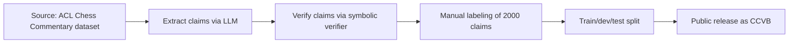
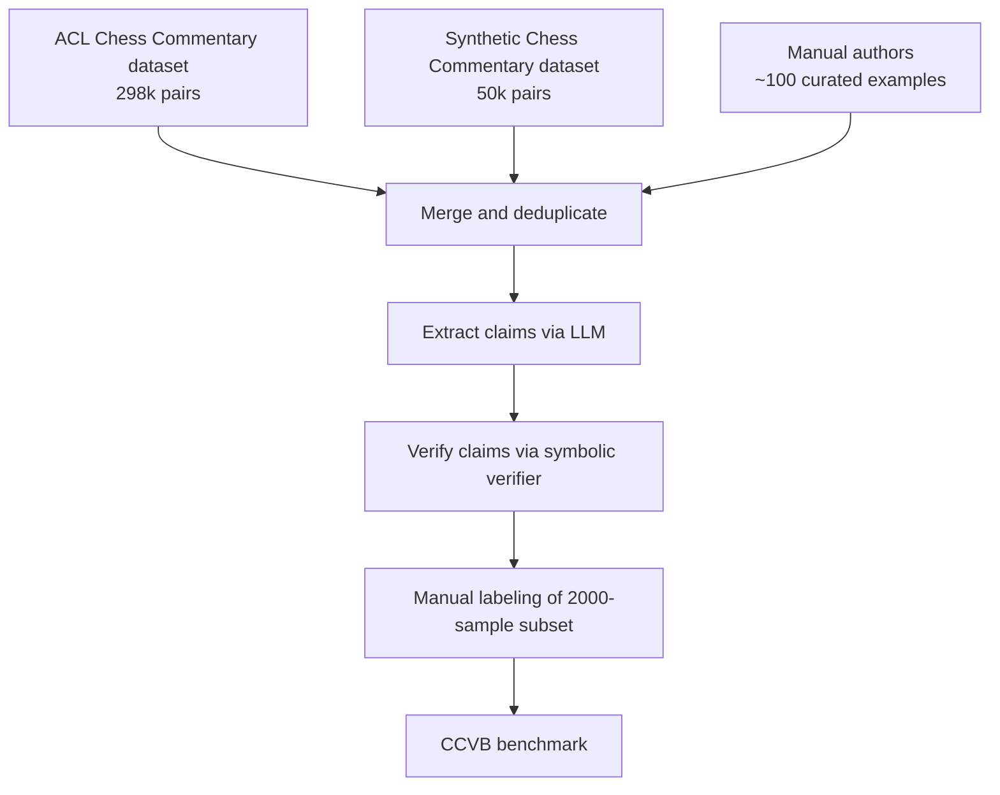

# 4. Datasets

> **Datasets in one sentence**: Several chess-language datasets exist that can be reused for training claim extractors, building test sets, and calibrating confidence scores — but none of them are verification datasets, so we must build our own labeled set.

This note catalogs the available datasets, evaluates each for our purposes, and describes the labeled verification set we need to build.

---

## 4.1 Dataset Catalog

### 4.1.1 ACL Chess Commentary dataset

- **Size**: ~298,000 (move, commentary) pairs.
- **Source**: Reddit r/chess and other forums.
- **Format**: PGN move + aligned comment.
- **Quality**: Mixed. Forum commentary ranges from grandmaster analysis to beginner questions.
- **Link**: [ACL Anthology P18-1154](https://aclanthology.org/P18-1154/)

**Use for our project**: High. We can repurpose this as a verification dataset by:

1. For each (move, comment) pair, extract claims from the comment using our LLM.
2. Verify each claim against the move.
3. Manually label a sample (say 1000) for ground truth.
4. Use the labeled sample as a test set; use the rest for unsupervised analysis.

### 4.1.2 Synthetic Chess Commentary Dataset (Kaggle)

- **Size**: ~50,000 positions with commentary.
- **Source**: Lichess games + Stockfish + Gemini (LLM-generated commentary).
- **Format**: Board state + evaluation + commentary + move alignment.
- **Quality**: LLM-generated, so it inherits LLM hallucinations.
- **Link**: [Kaggle](https://www.kaggle.com/datasets/jayanthrajg/chess-commentary-dataset)

**Use for our project**: Medium. The LLM-generated commentary contains hallucinations, which is actually useful — it gives us a dataset of likely-incorrect commentary to test our verifier on. But we cannot use it as ground truth without manual labeling.

### 4.1.3 Massive PGN datasets (Hugging Face)

- **Size**: Millions of games, billions of positions.
- **Source**: Lichess, Chess.com, professional databases.
- **Format**: PGN only (no commentary).
- **Quality**: High for game data; no commentary.
- **Link**: [Hugging Face](https://huggingface.co/datasets/InterwebAlchemy/pgn-dataset)

**Use for our project**: Low for direct verification testing, but useful for:

- Building a large facts database cache.
- Sampling positions for synthetic claim generation.
- Stress-testing the python-chess layer on edge cases.

### 4.1.4 Lichess Elite database

- **Size**: ~100 million games.
- **Source**: Lichess, filtered to high-rated games.
- **Format**: PGN.
- **Quality**: Very high (2200+ Elo games).

**Use for our project**: Same as 4.1.3.

### 4.1.5 ChessQA benchmark

- **Size**: ~1 million chess puzzles.
- **Source**: Lichess puzzles.
- **Format**: FEN + best move + theme tags.
- **Quality**: High (curated).
- **Link**: [ResearchGate](https://www.researchgate.net/publication/397006403_ChessQA_Evaluating_Large_Language_Models_for_Chess_Understanding)

**Use for our project**: Useful for evaluating whether LLMs can solve tactical puzzles. Not directly a commentary dataset, but the puzzle themes (pin, fork, skewer, etc.) align with our tactical claim types.

---

## 4.2 What We Need to Build

None of the above datasets are verification datasets. We need to build our own:

### 4.2.1 The Chess Commentary Verification Benchmark (proposed)



### 4.2.2 Schema

Each entry in the benchmark:

```json
{
  "example_id": "ccvb-0001",
  "source_dataset": "acl_chess_commentary",
  "game_id": "lichess-12345678",
  "ply_index": 14,
  "fen_before": "rnbqkbnr/...",
  "san": "Ne5",
  "commentary": "The knight forks the king and queen.",
  "claims": [
    {
      "claim_id": 1,
      "claim_type": "tactical_fork",
      "params": {
        "attacking_piece": "knight",
        "attacking_square": "e5",
        "target_pieces": ["king", "queen"]
      },
      "ground_truth_verdict": "Verified",
      "verifier_verdict": "Verified",
      "human_labeler": "annotator_03",
      "labeling_notes": "Knight on e5 attacks king on g8 and queen on d7. Confirmed fork."
    }
  ]
}
```

### 4.2.3 Labeling protocol

1. Sample 2000 (comment, claims) pairs from the ACL Chess Commentary dataset.
2. Have 3 trained annotators label each claim as one of: Verified, Contradicted, Supported (soft), Ambiguous, Cannot verify, Possible hallucination.
3. Use majority vote for the final label.
4. Track inter-annotator agreement (Cohen's kappa). Target: kappa >= 0.7.
5. Release the labeled set as CCVB.

### 4.2.4 Splits

- Train (60%): 1200 examples, used for prompt engineering and verifier tuning.
- Dev (20%): 400 examples, used for hyperparameter tuning.
- Test (20%): 400 examples, held out, used only for final evaluation.

### 4.2.5 Intended use

- **Verifier evaluation**: run the verifier on the test set, compute precision/recall/F1.
- **LLM evaluation**: run various LLMs as claim extractors, measure extraction accuracy.
- **Baseline comparison**: compare the verifier against (a) LLM-only baseline (ask the LLM "is this claim true?"), (b) engine-only baseline (use Stockfish eval as a proxy), (c) hybrid verifier (our system).

---

## 4.3 The Data Pipeline



The pipeline:

1. **Merge** the ACL dataset, the Synthetic dataset, and ~100 manually authored examples (to ensure coverage of edge cases).
2. **Deduplicate** by (game_id, ply_index) to avoid the same position appearing multiple times.
3. **Extract claims** from each comment using the LLM claim extractor.
4. **Verify claims** using the symbolic verifier, producing preliminary verdicts.
5. **Manually label** a 2000-sample subset to establish ground truth.
6. **Release** as the CCVB benchmark.

---

## 4.4 Dataset Licensing Considerations

- The ACL Chess Commentary dataset is derived from Reddit, which has complex licensing. The dataset itself is released for research use, but redistribution may be restricted.
- The Synthetic Chess Commentary dataset (Kaggle) has its own license; check before redistributing.
- Manually authored examples can be released under CC-BY or MIT.
- The CCVB benchmark (the labeled subset) should be released under a permissive license (CC-BY 4.0 recommended) to maximize research use.

Always check the upstream licenses before redistributing derived datasets. When in doubt, distribute only the labels and ask users to obtain the source datasets themselves.

---

## 4.5 Why a Verification Benchmark Matters

A verification benchmark is what elevates this project from an engineering exercise to a research contribution. Three reasons:

1. **Reproducibility.** Other researchers can compare their verifiers against ours on the same data.
2. **Baselines.** A benchmark lets us (and others) build baselines (LLM-only, engine-only, rule-based) and compare. Without baselines, "our verifier works" is a marketing claim, not a scientific result.
3. **Progress tracking.** As LLMs improve, the benchmark can be re-run to measure progress. This is what makes the project a long-term contribution.

> [!tip] The benchmark IS the research contribution
> If you have to choose between (a) building a better verifier or (b) building a public benchmark, choose (b). A benchmark enables everyone (including future you) to build better verifiers. A verifier without a benchmark is just an opinion.

---

## 4.6 Risks and Mitigations

### 4.6.1 Annotation disagreement

Tactical and material claims have high agreement (kappa > 0.8 expected). Strategic and positional claims have lower agreement (kappa ~0.5-0.7). Mitigation:

- For low-agreement claim types, use 5 annotators and majority vote.
- Document disagreement patterns in the dataset release.
- Consider releasing multiple gold labels per example for borderline cases.

### 4.6.2 Dataset bias

The ACL dataset over-represents Reddit commentary, which has its own style and bias. Mitigation:

- Include the Synthetic dataset (different style) to diversify.
- Include ~100 manually authored examples covering styles not in either source.
- Document the bias in the dataset release.

### 4.6.3 LLM contamination

If the test set was used to train an LLM, evaluating that LLM on the test set is contaminated. Mitigation:

- Use only LLMs released before the benchmark publication for the first round of evaluation.
- Document the LLM versions used.
- Re-run evaluation with newer LLMs over time, but treat early results as the canonical baseline.

### 4.6.4 Annotator chess skill

Annotators must be at least 1500 Elo to label tactical claims reliably, and 2000+ for strategic claims. Mitigation:

- Recruit annotators from chess clubs or use rated players on Lichess.
- Have a grandmaster review a 50-example sample for quality control.
- Document annotator skill levels in the dataset release.

---

## 4.7 Key Reminders

- Five datasets exist: ACL Chess Commentary (298k), Synthetic Chess Commentary (50k), Massive PGN (millions), Lichess Elite (100M), ChessQA (1M puzzles).
- None are verification datasets. We must build our own.
- The proposed CCVB benchmark: 2000 manually labeled examples, 60/20/20 train/dev/test split.
- Labeling protocol: 3 annotators per claim, majority vote, target kappa >= 0.7.
- The benchmark IS the research contribution. Prioritize it over a marginally better verifier.
- Risks: annotation disagreement (mitigate with 5 annotators for soft claims), dataset bias (mitigate with multiple sources), LLM contamination (mitigate with version documentation), annotator skill (mitigate with rated players).
- Release the benchmark under CC-BY 4.0 to maximize research use.
- Always check upstream licenses before redistributing derived datasets.
