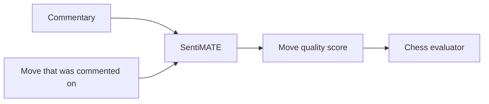
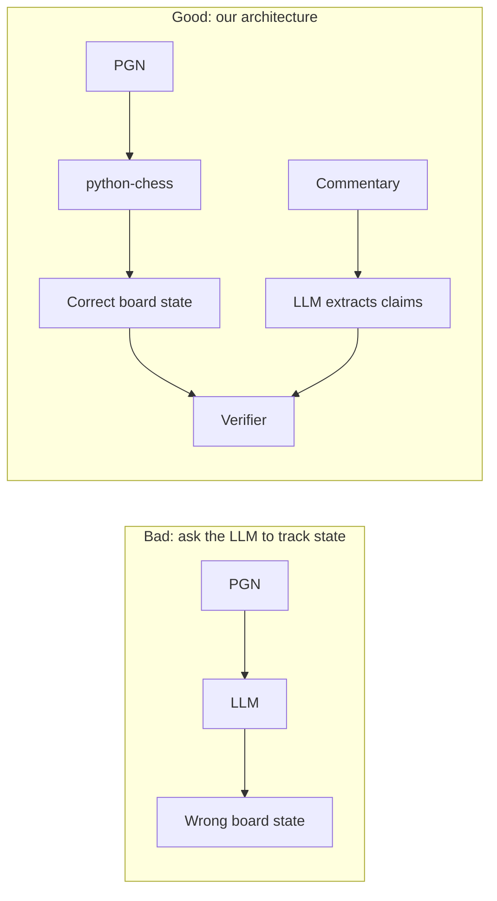

# 5. NLP Applied to Chess

> **The field in one sentence**: A small but growing body of work that uses chess as a testbed for NLP and language-model reasoning, treating chess commentary as supervision for learning chess concepts.

This literature is not directly about commentary generation or verification. It is about using chess as a domain for studying LLM capabilities. It matters for our project because it tells us what LLMs can and cannot do with chess — which informs our claim extractor design.

---

## 5.1 SentiMATE

**Title**: *SentiMATE: Learning to play Chess through Natural Language Processing*
**Year**: 2019
**Link**: [arXiv 1907.08321](https://arxiv.org/abs/1907.08321)

### Core idea

SentiMATE uses chess commentary as supervision for learning move quality. The system reads commentary, infers whether a move was good or bad, and uses that signal to train a chess evaluator.

### Direction

This is the closest existing work to "using commentary to learn about chess", which is spiritually related to our project (using commentary to verify chess claims). The difference is that SentiMATE learns an evaluator; we use an evaluator (Stockfish) to verify commentary.

### What we take from SentiMATE

- **Commentary contains enough structured information to learn from.** SentiMATE demonstrates that commentary is a useful signal. Our project assumes the same: commentary makes factual claims that can be extracted and verified.
- **Commentary quality varies.** SentiMATE notes that forum commentary is noisy. We must expect the same and design our verifier to handle noisy claims (mark `Ambiguous` rather than guessing).

### What SentiMATE does NOT do

- Verification. SentiMATE learns move quality; it does not verify commentary correctness.
- Per-claim checking. SentiMATE treats a comment as a single quality signal; we treat it as a list of discrete claims.

---

## 5.2 Chess as a Testbed for Language Model State Tracking

**Title**: *Chess as a Testbed for Language Model State Tracking*
**Venue**: AAAI 2023
**Link**: [AAAI OJS](https://ojs.aaai.org/index.php/AAAI/article/view/21390)

### Core question

Can LLMs track the board state across a sequence of moves, given only the move notation as input? In other words, if you feed an LLM `1. e4 e5 2. Nf3 Nc6 3. Bb5 a6 ...`, can it answer questions like "is the bishop on b5?" or "what pieces has White lost?"

### Findings

- **Small models cannot track state.** GPT-2 and similar models lose track of the board after ~10 plies.
- **Large models can track state for short sequences.** GPT-4 can answer board state questions correctly up to ~15-20 plies, with rapid degradation after that.
- **Even large models cannot reliably count material.** Asked "how many pawns does White have?" after 25 plies, GPT-4 is wrong about 30% of the time.
- **Tactical questions are very hard.** Asked "is the knight on f3 pinned?", GPT-4 is wrong about 50% of the time even on short sequences.

### Implications for our project

This paper directly validates our architectural decision: **the LLM cannot reliably track board state, so it must not be asked to**. Our claim extractor asks the LLM only to describe what a sentence claims, never to evaluate board state. The board state lives in the facts database, which is built by python-chess and is always correct.

This paper is the empirical evidence for the architectural commitment in [[Chapter 2. System Architecture/2. The Core Idea Separation of Concerns|2. The Core Idea Separation of Concerns]]. Cite it when justifying the design.

---

## 5.3 ChessQA: Evaluating Large Language Models for Chess Understanding

**Title**: *ChessQA: Evaluating Large Language Models for Chess Understanding*
**Link**: [ResearchGate](https://www.researchgate.net/publication/397006403_ChessQA_Evaluating_Large_Language_Models_for_Chess_Understanding)

### Core idea

ChessQA is a benchmark of chess puzzles (FEN + best move) used to evaluate whether LLMs can solve tactical problems. The benchmark finds that:

- GPT-4 solves ~30% of easy puzzles, ~10% of medium puzzles, ~3% of hard puzzles.
- Specialized chess engines (Stockfish) solve ~100%.
- LLMs trained on chess data (ChessGPT) perform slightly better but still far below engines.

### Implications for our project

- **LLMs are bad at tactical reasoning.** This is direct evidence that we cannot rely on an LLM to verify tactical claims. The symbolic verifier (using python-chess's attack maps) is essential.
- **Engine + LLM is the right combination.** Where the LLM is weak (tactics, board state), the engine is strong. Where the engine is weak (natural language, claim extraction), the LLM is strong. The combination is much stronger than either alone.
- **Our benchmark should include tactical claims.** ChessQA's findings suggest that tactical claims will be the hardest for our verifier to handle (because they require the most reasoning). Our test set should over-sample tactical claims to ensure the verifier is rigorously evaluated.

---

## 5.4 ChessGPT and Domain-Specialized LLMs

Several groups have trained chess-specialized LLMs:

- **ChessGPT**: trained on chess commentary and PGN data.
- **GPT-3.5-chess**: a fine-tuned variant.
- **Various open-source efforts** on Hugging Face.

These models are interesting but not directly useful for our project. They are still LLMs and therefore still hallucinate. Fine-tuning on chess data improves fluency and pattern recognition but does not give the model a chess engine. Our architectural commitment (separate language from chess reasoning) holds regardless of how chess-specialized the LLM is.

That said, a chess-specialized LLM might be a better claim extractor than a general LLM, because it would more reliably identify chess entities (pieces, squares, moves) in prose. This is worth exploring in v2+.

---

## 5.5 The "LLMs Do Not Understand Chess" Literature

A growing body of work argues that LLMs do not really "understand" chess, even when they generate fluent commentary:

- They memorize patterns from training data but cannot reason about novel positions.
- They confuse similar positions (e.g., saying "the knight is on f3" when it is on f6).
- They cannot reliably count pieces, identify checks, or detect pins.

This literature reinforces our project's motivation: **LLMs need external grounding for chess tasks**, and verification is no exception. The symbolic verifier provides that grounding.

---

## 5.6 What This Literature Tells Us About the LLM in Our System

Based on the literature, our LLM claim extractor should be:

1. **A frontier general model** (GPT-4, Claude 3.5, GLM-4), not a chess-specialized LLM. Chess-specialized LLMs are not significantly better at structured extraction, and general models have better instruction-following.

2. **Constrained to structured output.** Free-form LLM output is unreliable. Structured output mode with a strict schema is essential.

3. **Used only for claim extraction, not for judgment.** Every paper in this literature confirms that LLMs cannot reliably judge chess truth. Our architecture respects this.

4. **Evaluated on extraction accuracy, not chess accuracy.** The LLM's job is to parse English into structured claims. We measure "did the LLM extract the right claim type and parameters?", not "did the LLM correctly judge whether the claim is true?".

---

## 5.7 Why This Literature Is Dangerous if Misread

A common misreading: "LLMs are bad at chess, so we should not use them in our system at all."

This is wrong. The lesson is narrower: **LLMs are bad at chess reasoning, but they are fine at language tasks**. Our system uses the LLM only for language tasks (claim extraction), and uses the symbolic engine for chess reasoning. The literature's findings support this division of labor.

The danger of the misreading is that it leads people to throw out the LLM entirely and try to do claim extraction with regexes. Regexes cannot handle the variety of natural language. The LLM is necessary; it just needs to be used in the right role.

---

## 5.8 Key Reminders

- NLP applied to chess treats commentary as supervision for learning, not as a verification target.
- SentiMATE (2019) learns move quality from commentary. Validates that commentary contains structured information.
- Chess as a Testbed (AAAI 2023) shows LLMs cannot reliably track board state past ~15-20 plies. Validates our architectural separation.
- ChessQA shows LLMs are bad at tactical reasoning (~30% accuracy on easy puzzles). Validates that tactical verification must be symbolic.
- Chess-specialized LLMs (ChessGPT, etc.) are interesting but not directly useful. They still hallucinate.
- The literature on "LLMs do not understand chess" reinforces our motivation: LLMs need external grounding.
- Do not misread this literature as "do not use LLMs". The lesson is "use LLMs only for language tasks, not chess reasoning".
- Our LLM should be a frontier general model with structured output, used only for extraction, evaluated on extraction accuracy.
