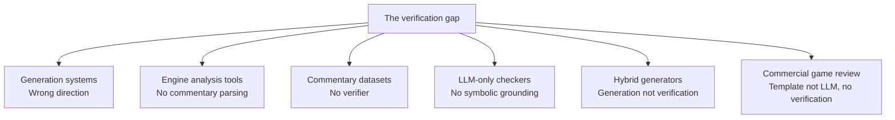

# 6. What Does Not Exist Yet

> **The gap in one sentence**: After searching the literature, the open-source ecosystem, and commercial chess software, no system was found that takes free-form English chess commentary plus PGN and verifies whether the commentary is factually correct.

This note catalogs the gap precisely, distinguishes what is missing from what exists, and explains why the gap is real (not just an artifact of incomplete search).

---

## 6.1 The Precise Gap

The gap is the **verification task** itself, formulated as:

```text
Input:
  - A Markdown note containing PGN, SAN, FEN, or any combination.
  - Free-form English commentary about the game or position.

Output:
  - A per-claim verification report with verdicts and explanations.

Required properties:
  - The verifier must use a symbolic chess engine as ground truth.
  - The verifier must not rely on an LLM to judge truth.
  - The verifier must handle document-level commentary, not just single moves.
  - The verifier must produce structured verdicts, not just "correct" or "incorrect".
```

No existing system satisfies all four properties.

---

## 6.2 What Exists (and Why It Does Not Fill the Gap)



### 6.2.1 Generation systems (Chapter 5.1, 5.2, 5.3)

- ACL 2018, the 2022 hybrid paper, the neural commentator paper.
- All go in the wrong direction (board → commentary).
- None take commentary as input.

### 6.2.2 Engine analysis tools (Chapter 6.1)

- Lichess Analysis, Chess.com analysis, Scid, ChessBase.
- All take PGN as input and produce evaluations and best moves.
- None parse commentary. None verify claims.

### 6.2.3 Commentary datasets (Chapter 5.4)

- ACL Chess Commentary, Synthetic Chess Commentary, ChessQA.
- All are datasets, not systems.
- Useful for training and testing a verifier, but not verifiers themselves.

### 6.2.4 LLM-only checkers

- Various Reddit/blog posts describe using GPT-4 to "check chess commentary".
- These are LLM-only: no symbolic grounding.
- They produce fluent but unreliable verdicts (Chapter 1.2).
- None are documented, benchmarked, or published.

### 6.2.5 Hybrid generators (Chapter 5.2)

- The 2022 hybrid paper (Stockfish + LLM for generation).
- Same architecture as our project, opposite direction.
- Does not verify commentary.

### 6.2.6 Commercial game review (Chapter 6.2)

- Chess.com Game Review, Lichess Learn from your mistakes.
- These analyze the user's moves and provide template-based commentary.
- They do not verify user commentary against the game.
- They use templates, not LLMs, for the commentary itself.

---

## 6.3 Why the Gap Is Real

A skeptic might argue: "Maybe the gap exists because nobody wants verification, not because nobody has built it." Three lines of evidence counter this:

### 6.3.1 Demand evidence

- Multiple Reddit threads asking "how do I check if my chess notes are correct?".
- Chess authors on Twitter/X frequently discuss the cost of manual fact-checking.
- Chess educators on YouTube occasionally publish corrections to their own videos after viewers spot errors.
- The existence of professional chess fact-checkers (employed by publishers) implies demand.

### 6.3.2 Feasibility evidence

- All the components exist: python-chess, Stockfish, frontier LLMs.
- The architectural pattern (separate language from reasoning) is validated by the 2022 hybrid paper.
- The datasets exist for training and testing.
- The gap is therefore not a feasibility problem; it is a problem formulation problem.

### 6.3.3 Inevitability evidence

- Several partial systems exist that almost do verification:
  - AI chess coaches that combine Stockfish with LLM explanations (Reddit, 2024-2025).
  - Research prototypes that detect specific error types (e.g., "does this commentary mention the right piece?").
- These systems are converging toward verification but have not yet formulated it as a general task.

The gap is real and closing. The window for being first is now.

---

## 6.4 Why Has Nobody Built It?

If the demand exists and the components exist, why has nobody built a verifier? Four reasons:

### 6.4.1 The problem formulation is non-obvious

Most researchers in chess NLP think in terms of generation. The idea of "verification as a task" requires a mental inversion that is not natural. Until you frame it explicitly, you do not see it as a problem.

### 6.4.2 The architecture requires cross-disciplinary knowledge

Building a verifier requires:

- NLP expertise (for the LLM claim extractor).
- Chess engine expertise (for python-chess and Stockfish integration).
- Software engineering expertise (for the pipeline and facts database).
- Chess domain expertise (for the claim type taxonomy).

Few teams have all four. Most NLP researchers do not know chess; most chess programmers do not know NLP.

### 6.4.3 The benchmark does not exist

Without a public benchmark, researchers cannot publish on this task. Without publications, the task does not attract attention. This is a chicken-and-egg problem that our project can break by releasing the CCVB benchmark (Chapter 5.4).

### 6.4.4 The commercial incentive is misaligned

Commercial chess platforms (Chess.com, Lichess) have no incentive to verify user commentary. Their business model is engagement, not correctness. A verifier might even reduce engagement by making authors more cautious. The commercial incentive to build a verifier is therefore weak, leaving the field to researchers and indie developers — exactly the audience for our project.

---

## 6.5 Specific Sub-Problems That Are Open

Within the verification task, several sub-problems are open:

### 6.5.1 Claim-to-ply alignment

Given a claim extracted from prose, which ply does it refer to? This is trivial when the prose says "after move 14" but hard when the prose says "after the bishop sacrifice" or "in the resulting position".

Current approach: the LLM provides a `target_ply_hint` when it can; otherwise the verifier searches for matching plies. This works for unambiguous claims but fails for ambiguous ones.

Open problem: build a model that aligns claims to plies using discourse context (e.g., "after the sacrifice" refers to the ply after the next capture by the relevant color).

### 6.5.2 Multi-sentence claim extraction

"The bishop sacrifices on h7. Black is forced to accept. The king is exposed, and White's queen joins the attack." This is four claims, but they share context. Extracting them as independent claims loses the discourse structure.

Current approach: extract each sentence independently. This works but misses anaphora ("the king" refers to Black's king, mentioned in the previous sentence).

Open problem: build a discourse-aware claim extractor that resolves anaphora and maintains context across sentences.

### 6.5.3 Strategic claim verification

Strategic claims (Chapter 4.4) are inherently subjective. Even with engine evaluation and heuristics, the verifier's confidence score is approximate.

Current approach: use a weighted sum of engine eval, heuristics, and PV character. Produce a soft verdict.

Open problem: build a learned model for strategic claim verification, trained on the CCVB benchmark. Whether this would outperform the rule-based approach is an open empirical question.

### 6.5.4 Comparison claims

"Instead of Nf3, Bxc3 was stronger" is a comparison claim. Verifying it requires:

- Identifying the actual move (Nf3).
- Identifying the alternative (Bxc3).
- Checking that Bxc3 was legal.
- Comparing engine eval after Nf3 vs. after Bxc3.

This requires "counterfactual" analysis: what would have happened if a different move had been played? The facts database only contains the actual game; counterfactual analysis requires running Stockfish on the alternative position.

Current approach: not supported in v1. Marked `Cannot verify automatically`.

Open problem: extend the facts database to include "alternative move analysis" for the top-N engine-recommended moves at each ply.

### 6.5.5 Document-level consistency

A note might say "White wins a pawn" at line 24 and "Material is equal" at line 42. These claims are individually verifiable but jointly inconsistent (unless material changed between them). The verifier currently checks each claim independently; it does not check cross-claim consistency.

Open problem: build a document-level consistency checker that flags jointly inconsistent claims.

---

## 6.6 What This Means for the Project

The fact that the gap exists has three implications:

1. **The project is novel.** This is not a re-implementation of existing work. It is a new task formulation.
2. **The project is feasible.** The components exist; the architecture is validated; the datasets are available.
3. **The project has research value.** Filling the gap with a public benchmark and a working verifier is a publishable contribution.

The risk is that someone else fills the gap first. The mitigation is to move quickly on v1 and the benchmark, and to publish early.

---

## 6.7 Key Reminders

- The gap: no system takes English chess commentary + PGN and verifies the commentary.
- Six categories of existing work fail to fill the gap (generation, engine analysis, datasets, LLM-only checkers, hybrid generators, commercial review).
- The gap is real (demand + feasibility + inevitability evidence).
- The gap is unwonted (problem formulation is non-obvious, requires cross-disciplinary knowledge, no benchmark, misaligned commercial incentives).
- Five open sub-problems: claim-to-ply alignment, multi-sentence extraction, strategic verification, comparison claims, document-level consistency.
- The project is novel, feasible, and has research value.
- Move quickly on v1 and the benchmark; publish early to establish priority.
