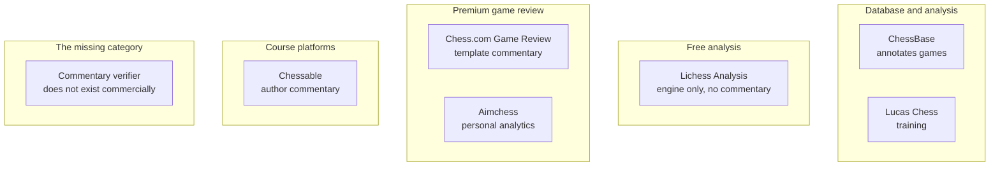

# 2. Commercial Software

> **Commercial software in one sentence**: Products like ChessBase, Lucas Chess, Lichess Analysis, and Chess.com Game Review can validate legality, analyze mistakes, explain moves, and provide evaluations — but none can inspect an arbitrary paragraph and determine whether the author's explanation matches the position.

This note surveys the commercial landscape and identifies the specific gap each product leaves.

---

## 2.1 ChessBase

- **Vendor**: ChessBase GmbH
- **What it does**: Chess database software with engine analysis, opening training, and game annotation. The flagship product for serious chess players and authors.
- **Annotation feature**: ChessBase can auto-annotate games using engine analysis. It inserts text comments like "White stands better" or "This move loses material" into the game notation.
- **What it does NOT do**: Verify user commentary. ChessBase's auto-annotation is generation, not verification. If you write your own commentary and ask ChessBase to check it, the software has no such feature.

ChessBase is the closest commercial product to a verifier, because it has both engine analysis and text annotation capabilities. But the two are not connected in the verification direction. The annotation generator does not compare against existing text.

---

## 2.2 Lucas Chess

- **Vendor**: Lucas Monge (independent)
- **What it does**: Free chess training software with engine analysis, puzzle generation, and tournament play.
- **Annotation feature**: Limited. Lucas Chess can show engine evaluations and best moves, but its commentary generation is minimal.
- **What it does NOT do**: Verify user commentary. No commentary parsing.

Lucas Chess is a training tool, not a verification tool. Its target user is a player improving their game, not an author checking their notes.

---

## 2.3 Lichess Analysis

- **Vendor**: Lichess.org (free, open source, donation-funded)
- **What it does**: Free chess analysis board with Stockfish integration. Unlimited analysis for any game.
- **Annotation feature**: None natively. Lichess shows engine evaluations and best moves; it does not generate or verify commentary.
- **What it does NOT do**: Verify user commentary.

Lichess is the most popular free analysis tool. It is the right tool for replaying a game and seeing evaluations, but it has no commentary features whatsoever.

---

## 2.4 Chess.com Game Review

- **Vendor**: Chess.com
- **What it does**: After a game, Chess.com's Game Review analyzes each move, classifies it (Brilliant, Great, Good, Excellent, Book, Inaccuracy, Mistake, Blunder), and provides brief natural-language explanations.
- **Annotation feature**: Template-based commentary. Each move classification has a set of template explanations. For example, a blunder might be explained as "This move loses material. Stockfish recommends Nf3 instead."
- **What it does NOT do**: Verify user commentary. Game Review generates its own explanations; it does not check user commentary. It also uses templates, not LLMs, for the commentary itself.

Chess.com Game Review is the most polished commercial chess commentary product. But it is firmly in the generation camp, not verification.

---

## 2.5 Chessable

- **Vendor**: Chessable (acquired by Chess.com)
- **What it does**: Platform for chess courses and books. Authors publish courses with PGNs and text explanations. Users study the courses with spaced repetition.
- **Annotation feature**: Authors write their own commentary; Chessable provides the platform. No automatic commentary generation or verification.
- **What it does NOT do**: Verify author commentary.

Chessable is interesting because it is exactly the kind of platform that would benefit from a verification tool. Authors publishing courses on Chessable currently rely on manual fact-checking (or skip it entirely). A verification tool integrated into Chessable's authoring workflow would be valuable.

---

## 2.6 Aimchess

- **Vendor**: Aimchess (acquired by Chess.com)
- **What it does**: Analyzes a user's game history and identifies patterns, mistakes, and improvement areas.
- **Annotation feature**: Generates reports with natural-language summaries ("You often play d4 in the opening, with a 55% win rate").
- **What it does NOT do**: Verify user commentary.

Aimchess is a personal analytics tool, not a commentary tool. It does not parse or verify prose.

---

## 2.7 The Commercial Landscape Map

Every commercial product falls into one of four categories: database/analysis, free analysis, premium game review, or course platforms. None fall into the "commentary verifier" category. The gap is wide and clear.

---

## 2.8 Why Commercial Software Has Not Filled the Gap

Three reasons:

### 2.8.1 Wrong audience targeting

Commercial chess products target **players**, not **authors**. Players want to improve their own games; they do not write commentary. Authors are a smaller, more niche audience.

### 2.8.2 No clear monetization

A commentary verifier is a tool for authors. Authors are willing to pay, but the market is small (maybe 10,000 serious chess authors worldwide). Commercial platforms cannot justify the engineering investment for such a small audience.

### 2.8.3 Verification is hard to market

"Analyze your games" is an easy pitch. "Verify your commentary" is harder — most authors do not realize their commentary might be wrong. The marketing challenge is significant.

---

## 2.9 Implications for Our Project

The commercial gap has three implications:

1. **The project will not compete with commercial products.** None of them do what we do. Our project is complementary, not competitive.
2. **A successful open-source verifier could be integrated into commercial platforms.** Chessable, in particular, would benefit from a verification tool in their authoring workflow. An open-source verifier with a clean API could be adopted by platforms that cannot build their own.
3. **The project's value proposition is unique.** "Spell-checker for chess" is a category that does not exist commercially. We define the category.

---

## 2.10 Key Reminders

- ChessBase: database + auto-annotation (generation, not verification).
- Lucas Chess: training tool, no commentary features.
- Lichess Analysis: engine only, no commentary.
- Chess.com Game Review: template-based commentary generation.
- Chessable: platform for author commentary, no verification.
- Aimchess: personal analytics, no commentary.
- No commercial product verifies user commentary against the board.
- Reasons: wrong audience targeting, no clear monetization, hard to market.
- Implications: project is complementary to commercial products, not competitive. A successful open-source verifier could be integrated into platforms like Chessable. The "spell-checker for chess" category does not exist commercially.
