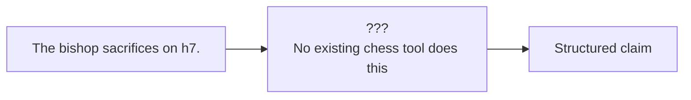

# 3. Why Existing Tools Fall Short

> **The shortfall in one sentence**: Existing chess tools either analyze games (engine-only) or generate commentary (LLM-only or template-only), but none parse free-form English commentary and verify it against the board — the missing capability is **commentary-aware verification**.

This note synthesizes the gap analysis from Chapters 6.1 and 6.2 and explains why combining existing tools does not solve the problem.

---

## 3.1 The Three Missing Capabilities

Existing tools lack three capabilities that the verifier requires:

### 3.1.1 Natural-language claim extraction

No existing chess tool can read a sentence like "The bishop sacrifices on h7" and extract a structured claim like `{piece: bishop, action: capture, target_square: h7, is_sacrifice: true}`. This is an NLP capability that chess tools do not have.

### 3.1.2 Claim-to-ply alignment

No existing chess tool can take a claim and determine which ply it refers to. Engine analysis tools work move-by-move but do not align natural-language claims to moves.

### 3.1.3 Per-claim verification with structured verdicts

Existing tools produce evaluations ("+2.3") or template comments ("Good move"). They do not produce per-claim verdicts with the six-label taxonomy (Verified, Contradicted, etc.) and specific explanations referencing board facts.

---

## 3.2 Why Combining Existing Tools Does Not Work

A natural objection: "Just combine an LLM with Stockfish and you have a verifier." This does not work for several reasons:

### 3.2.1 The naive combination produces an LLM-only checker

If you give an LLM the position and the commentary and ask "is this true?", you have an LLM-only checker. This is the bad architecture (Chapter 2.2.2) and it produces confident errors.

### 3.2.2 The proper combination requires the separation of concerns

The proper combination requires:

- An LLM that ONLY extracts claims.
- A symbolic engine that ONLY verifies claims.
- A facts database that bridges the two.

This separation is the project's core architectural contribution. It is not present in any existing tool.

### 3.2.3 The pipeline orchestration is non-trivial

Even with the right components, building the pipeline (Markdown → PGN extraction → game replay → facts database → LLM claim extraction → verifier → report) requires significant engineering. No off-the-shelf tool provides this orchestration.

---

## 3.3 What You Would Need to Build Even With Existing Tools

Even if you reused every available library, you would still need to build:

1. **Markdown parser** that identifies PGN blocks, SAN, FEN, and prose, with line numbers.
2. **Facts database builder** that uses python-chess to replay games and Stockfish to analyze positions, producing the JSON schema in Chapter 2.4.
3. **Claim extractor** that prompts the LLM with the prose and parses the structured output.
4. **Verifier dispatcher** that routes claims to type-specific handlers.
5. **Per-type handlers** (one per claim type) that implement the verification rules.
6. **Report generator** that produces Markdown and JSON outputs.
7. **Caching layer** for facts databases and LLM outputs.
8. **Test suite** with unit tests, property tests, and end-to-end tests.
9. **Benchmark** for evaluation.

This is approximately 5,000-10,000 lines of Python, plus the LLM prompt engineering and the benchmark labeling effort. Not trivial.

---

## 3.4 The "AI Coach" Misconception

The most common misconception is that AI chess coaches (chessreview, Aimchess, etc.) already do verification. They do not. Here is the precise difference:

| Capability | AI Coach | Verifier |
|---|---|---|
| Input | PGN | PGN + commentary |
| Output | Generated commentary | Verdict report |
| Direction | Board → text | Text → verdict |
| Verifies user commentary | No | Yes |
| Uses LLM for | Generating explanations | Extracting claims |
| Uses engine for | Identifying mistakes | Ground truth for verification |

The AI coach and the verifier are **complementary**, not overlapping. An AI coach helps a player understand their game; a verifier helps an author check their commentary. A user might use both: the coach to improve their play, the verifier to ensure their notes about the game are correct.

---

## 3.5 The "Engine Analysis" Misconception

Another common misconception: "Engine analysis already tells you whether a move was good, so it verifies commentary."

This conflates two different questions:

- **Was the move good?** (Engine analysis answers this.)
- **Does the commentary match what actually happened?** (Verifier answers this.)

These are different. Consider the commentary: "White plays the brilliant queen sacrifice Qxh7+." The engine might say Qxh7+ is a brilliant move. But what if the actual move played was Qxh7+ without a sacrifice (the queen was immediately recaptured by the king, no material loss)? Or what if the actual move was Qh5 (not Qxh7+)? The engine does not check whether the commentary's description matches the actual move; it only evaluates the move itself.

Verification requires comparing the commentary's claims against the actual moves, which is what the verifier does and the engine alone cannot.

---

## 3.6 The "LLM Judge" Misconception

A third misconception: "Just ask GPT-4 to check the commentary."

This is the LLM-only checker, and it fails for the reasons in Chapter 2.2.2: LLMs produce confident errors, especially on tactical and material claims. Even GPT-4 cannot reliably count material or identify pins (Chapter 5.5).

The LLM has a role in the verifier (claim extraction), but it cannot be the judge. The judging must be symbolic.

---

## 3.7 Summary: The Specific Gap

The specific gap that no existing tool fills is:

> **Given a Markdown note containing PGN and English commentary, parse the commentary into structured claims, align each claim to a specific ply, verify each claim against the board state using symbolic chess reasoning and engine evaluation, and produce a per-claim verdict report with explanations referencing specific board facts.**

Every word in this formulation matters:

- "Markdown note" — no tool handles Markdown.
- "English commentary" — no tool parses English.
- "Structured claims" — no tool extracts claims.
- "Align each claim to a specific ply" — no tool does alignment.
- "Symbolic chess reasoning" — engines do this, but not in the context of commentary.
- "Engine evaluation" — engines do this, but not for verifying claims.
- "Per-claim verdict report" — no tool produces this output format.

Removing any element breaks the system. The gap is irreducible.

---

## 3.8 Key Reminders

- Three missing capabilities: NL claim extraction, claim-to-ply alignment, per-claim verification with structured verdicts.
- Combining an LLM with Stockfish naively produces an LLM-only checker (bad architecture).
- The proper combination requires the separation of concerns (LLM extracts, engine verifies), which no existing tool implements.
- Even with all libraries reused, the pipeline orchestration is 5-10k lines of Python.
- AI coaches and the verifier are complementary, not overlapping.
- Engine analysis answers "was the move good"; verification answers "does the commentary match the move".
- The LLM judge approach fails because LLMs produce confident errors on tactical and material claims.
- The specific gap is irreducible: every word in the formulation matters. No existing tool fills it.
