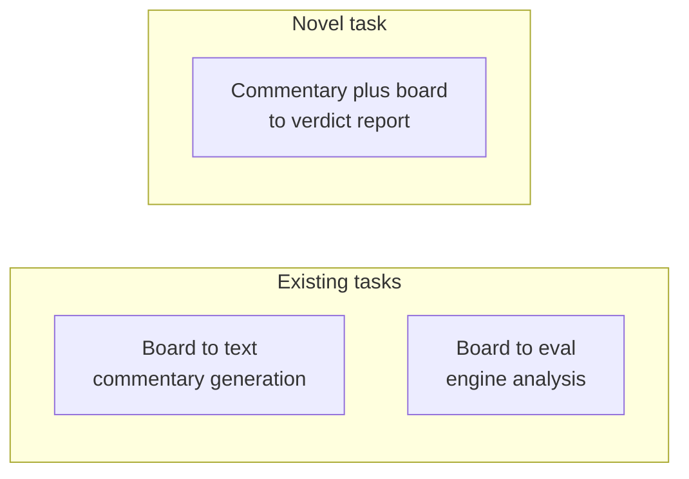

# 1. What Is Novel

> **The novelty in one sentence**: The project's contribution is not any single component (Stockfish, LLM, python-chess) but the **task formulation** — commentary verification as a first-class problem — and the **architecture** that solves it via strict separation of language understanding from chess reasoning.

This note carefully separates the novel from the non-novel, so the contribution can be defended.

---

## 1.1 The Three Novel Contributions

### 1.1.1 The task formulation

The single most important novelty is **framing commentary verification as a task**. No prior work does this. Every existing system either generates commentary (board → text) or analyzes games (board → evaluation). The formulation "given commentary and board, produce per-claim verdicts" is new.

This formulation has three properties that make it novel:

- **The input is a document**, not a position. Existing tasks take positions; we take Markdown notes.
- **The output is a verdict report**, not text or evaluations. Existing tasks produce text or numbers; we produce structured verdicts with explanations.
- **The metric is correctness**, not fluency or accuracy. Generation is measured by BLEU; analysis is measured by eval accuracy; verification is measured by precision/recall/F1 on verdict labels.

### 1.1.2 The architecture

The architecture — strict separation of language understanding (LLM) from chess reasoning (python-chess + Stockfish), with a facts database as the bridge — is itself a contribution. While the 2022 hybrid paper (Chapter 5.2) uses a similar separation for generation, applying it to verification is new.

Specifically, the architecture includes:

- The **facts database schema** (Chapter 2.4), with per-ply records, attack maps, and material timeline.
- The **claim type taxonomy** (Chapter 4), refined for verification from earlier categorization work.
- The **verifier dispatch pattern** (Chapter 3.4), with per-type handlers and graceful degradation.
- The **six-verdict label set** (Chapter 2.3), which distinguishes binary facts from soft claims and hallucinations.

### 1.1.3 The benchmark

The proposed CCVB benchmark (Chapter 5.4) is the third contribution. It is the first publicly available dataset for commentary verification, with 2000 manually labeled examples. Releasing this benchmark enables other researchers to work on the task, which is what transforms it from "one project" into "a research area".

---

## 1.2 What Is Novel vs. What Is Engineering

It is important to distinguish **research novelty** from **engineering novelty**. Both matter, but they are different.

### Research-novel

- The task formulation.
- The application of the separation-of-concerns architecture to verification.
- The benchmark.
- The empirical comparison of baselines (LLM-only, engine-only, hybrid) on the benchmark.

These are the contributions that would appear in a paper's abstract.

### Engineering-novel

- The specific facts database schema.
- The Markdown parser that handles PGN, SAN, FEN, and prose with line numbers.
- The LLM prompt for claim extraction.
- The per-type handler implementations.
- The caching strategy.

These are necessary for the system to work but are not research contributions per se. They might appear in a paper's appendix or in the open-source release.

---

## 1.3 The "Novel Combination" Argument

A skeptic might argue: "Your project is just a combination of existing components. Where is the novelty?"

The response is: **the combination itself is the novelty**. To see why, consider an analogy:

- The automobile was a combination of the bicycle, the carriage, and the internal combustion engine. None of those components were new. The combination was novel and transformative.
- The web browser was a combination of HTTP, HTML, and a rendering engine. None were new. The combination was novel and transformative.
- The chess commentary verifier is a combination of python-chess, Stockfish, and an LLM. None are new. The combination is novel because no one has done it before, and the specific way the components are combined (the separation of concerns, the facts database, the per-claim verification) is the contribution.

The "just a combination" argument proves too much: it would reject almost every applied research contribution. The right question is not "are the components new?" but "is the combination new, and does it solve a problem that was previously unsolved?"

For our project: yes, the combination is new (no prior system combines these components in this way), and yes, it solves a problem that was previously unsolved (commentary verification).

---

## 1.4 Why the Novelty Matters

The novelty matters for three reasons:

1. **Publishability.** A novel task formulation with a benchmark and a working system is a publishable contribution at NLP and AI venues.
2. **Research community.** A novel task attracts other researchers, who improve on the baselines and extend the task. This is how a research area grows.
3. **Practical impact.** A novel tool that fills a real gap (Chapter 5.6) has practical value beyond the research community.

The novelty is not the goal; it is a means to the goal of filling the gap. But the novelty is what makes the project worth doing as research, rather than just as engineering.

---

## 1.5 Defending the Novelty

When defending the novelty (in a paper review, a pitch, or a conversation), use this structure:

1. **State the task formulation clearly.** "We formulate commentary verification as: given PGN + English commentary, produce per-claim verdicts."
2. **Show that no prior work does this.** Cite the literature search (Chapter 5) and the tool survey (Chapter 6).
3. **Explain why the gap exists.** Problem formulation is non-obvious; cross-disciplinary knowledge required; no benchmark; commercial incentive weak (Chapter 5.6.4).
4. **Describe the architecture.** Strict separation of language from reasoning, facts database as bridge.
5. **Show that the architecture works.** Benchmark results, ablation studies, qualitative examples.
6. **Release the benchmark.** This is what makes the contribution durable.

This structure works because it addresses the three questions reviewers always ask: what is new, why wasn't it done before, and does it work.

---

## 1.6 Risks to the Novelty Claim

Three risks could undermine the novelty claim:

### 1.6.1 A parallel work appears

Someone else could publish a similar system before we do. Mitigation: move quickly on v1 and the benchmark; publish a workshop paper or arXiv preprint early to establish priority.

### 1.6.2 Reviewers do not see the gap

Reviewers familiar with chess NLP might assume "this must have been done". Mitigation: in the paper, explicitly survey the literature and show the gap. The survey in Chapter 5 is the template.

### 1.6.3 The contribution is dismissed as "just engineering"

Some reviewers might say "this is a system paper, not a research paper". Mitigation: lead with the task formulation and the benchmark, not with the system. The system is evidence that the task is solvable; the task formulation and the benchmark are the research contributions.

---

## 1.7 Key Reminders

- Three novel contributions: task formulation, architecture, benchmark.
- Task formulation: commentary verification as a first-class problem. This is the most important novelty.
- Architecture: strict separation of language (LLM) from reasoning (engine), with facts database as bridge.
- Benchmark: CCVB, 2000 manually labeled examples. The benchmark transforms the project from "one system" into "a research area".
- The "just a combination" argument is weak. The combination is the contribution.
- Defend the novelty with: state task, show gap, explain why gap exists, describe architecture, show it works, release benchmark.
- Risks: parallel work (mitigate by publishing early), unseen gap (mitigate by literature survey in paper), dismissed as engineering (mitigate by leading with task and benchmark, not system).
