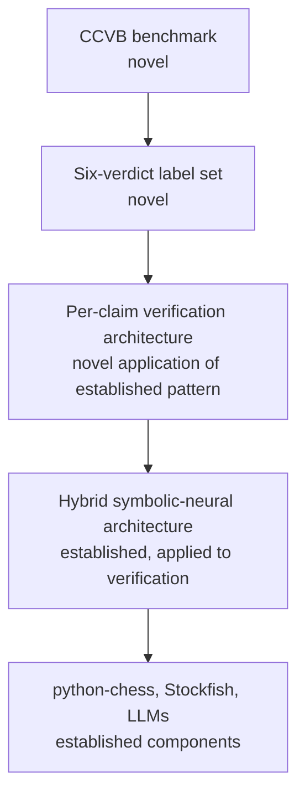

# 2. What Is Not Novel

> **The non-novel parts in one sentence**: The individual components — python-chess, Stockfish, LLMs, PGN parsing, claim extraction as a concept, hybrid symbolic-neural architectures — are all established; the novelty is in the combination and the task formulation, not in any single component.

This note honestly catalogs what is NOT novel, so the novelty claim can be calibrated and defended.

---

## 2.1 The Components Are Not Novel

### 2.1.1 python-chess

python-chess has been the standard Python chess library for nearly a decade. It is mature, widely used, and not a research contribution. We use it as-is.

### 2.1.2 Stockfish

Stockfish has been the strongest open-source chess engine for over a decade. It is also not a research contribution. We use it as-is.

### 2.1.3 LLMs

LLMs (GPT-4, Claude, GLM, etc.) are commercial products. We use them via API; we do not train or fine-tune them in v1. Using an LLM for structured output is a well-established practice.

### 2.1.4 PGN parsing

PGN is a 30-year-old standard. Parsing it is a solved problem.

### 2.1.5 Claim extraction

The general idea of "extract structured claims from text" is well-established in NLP. Fact-checking systems (for news, for medical text, for legal text) all do claim extraction. Our application to chess commentary is novel, but the technique itself is not.

### 2.1.6 Hybrid symbolic-neural architectures

Combining a symbolic engine with a neural model is an established pattern. The 2022 hybrid paper (Chapter 5.2) does this for chess commentary generation. Our application to verification is novel, but the architectural pattern is not.

### 2.1.7 Per-ply game replay

Replaying a chess game ply-by-ply and generating FENs is standard. python-chess does this natively.

### 2.1.8 Attack maps

Computing which pieces attack which squares is standard. python-chess does this natively.

### 2.1.9 Engine evaluation caching

Caching engine evaluations keyed by FEN is standard practice in any chess software that does bulk analysis.

---

## 2.2 The Datasets Are Not Novel

The datasets we reuse (ACL Chess Commentary, Synthetic Chess Commentary, Lichess Elite) are all existing public datasets. We do not create the underlying data; we create a labeled subset (the CCVB benchmark), which is novel as a benchmark but not as raw data.

---

## 2.3 The Evaluation Metrics Are Not Novel

Precision, recall, F1, Cohen's kappa, BLEU, ROUGE — all standard NLP / ML metrics. We use them; we do not invent them.

The specific application of these metrics to commentary verification is novel (because the task is novel), but the metrics themselves are not.

---

## 2.4 The Output Format Is Not Novel

Markdown reports and JSON sidecars are standard. The six-verdict label set is novel (Chapter 2.3), but the format of the report is not.

---

## 2.5 Why This Honesty Matters

Being explicit about what is not novel serves three purposes:

1. **Calibrated claims.** When you say "this is novel", reviewers trust you more if you are also explicit about what is not. Overclaiming is a quick way to lose credibility.

2. **Clear contribution boundaries.** If you know what is not novel, you know what you do not need to defend. You can focus the paper on the novel parts (task, architecture, benchmark) and treat the non-novel parts as established infrastructure.

3. **Future-proofing.** If a reviewer points out a paper you missed, you can say "yes, that paper established X, which we use; our contribution is Y, which they do not do". This is much easier if you have already separated X from Y in your own mind.

---

## 2.6 The "Contribution Stack"

A useful way to think about novelty is as a stack of contributions, where each layer builds on the one below:

- **Layer 1**: established components. Not novel.
- **Layer 2**: established architecture pattern. Not novel as a pattern, but novel as an application to verification.
- **Layer 3**: per-claim verification. Novel as a complete system.
- **Layer 4**: the six-verdict label set. Novel.
- **Layer 5**: the CCVB benchmark. Novel.

The novelty grows as you move up the stack. The bottom is not novel; the top is most novel. A paper should focus on layers 3-5 and treat layers 1-2 as infrastructure.

---

## 2.7 What This Means for the Paper

If you write a paper about this project, the contributions section should be roughly:

> **Contributions.**
> 1. We formulate **chess commentary verification** as a new task: given a Markdown note containing PGN and English commentary, produce per-claim verdicts.
> 2. We present an architecture that **separates language understanding (LLM) from chess reasoning (python-chess + Stockfish)**, with a precomputed facts database as the bridge.
> 3. We define a **six-verdict label set** (Verified, Contradicted, Supported-soft, Ambiguous, Cannot-verify, Possible-hallucination) that distinguishes binary facts from soft claims and hallucinations.
> 4. We release the **Chess Commentary Verification Benchmark (CCVB)**, a 2000-example labeled dataset for the task.
> 5. We present a **working verifier** and benchmark it against LLM-only, engine-only, and rule-based baselines.

Each of these is a contribution. The first four are research contributions; the fifth is engineering evidence that the task is solvable.

What is NOT in the contributions section:

- "We use python-chess" (not a contribution; it is infrastructure).
- "We use Stockfish" (not a contribution).
- "We use an LLM" (not a contribution).
- "We parse PGN" (not a contribution).

This separation is what makes the paper credible. Overclaiming the engineering as research is a common rejection reason.

---

## 2.8 Key Reminders

- The components (python-chess, Stockfish, LLMs) are not novel. We use them as-is.
- The architectural pattern (hybrid symbolic-neural) is not novel; the 2022 paper established it for generation.
- The datasets are not novel; we reuse existing public datasets.
- The evaluation metrics are not novel.
- What IS novel: the task formulation, the application of the architecture to verification, the six-verdict label set, the CCVB benchmark.
- Think of contributions as a stack: layers 1-2 are infrastructure (established), layers 3-5 are the contributions (novel).
- In the paper, focus on layers 3-5. Treat layers 1-2 as infrastructure.
- Honesty about what is not novel increases credibility and focuses the contribution claim.
