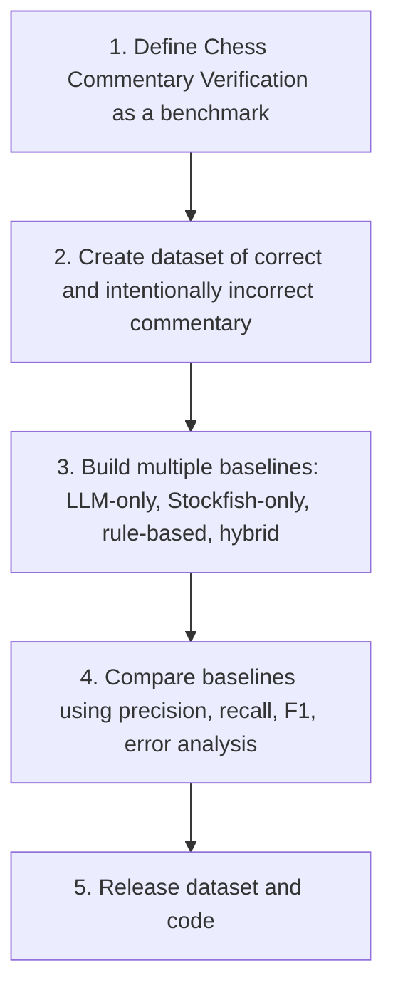

# 3. Publishing as Research

> **Publishability in one sentence**: The project is publishable as a research contribution if it defines the task carefully, releases a benchmark, builds multiple baselines, compares them rigorously, and releases the code and data.

This note describes what the project needs to do to be publishable, where it could be published, and how to structure the contribution.

---

## 3.1 What Makes It Publishable

A publishable research contribution has four properties:

1. **A novel task formulation.** Our project has this (Chapter 7.1).
2. **A benchmark.** Our project will have this (CCVB, Chapter 5.4).
3. **A working system.** Our project will have this (the verifier).
4. **Rigorous evaluation.** Our project must do this.

The fourth property is the one most often skimped on. Rigorous evaluation means:

- Multiple baselines, not just the proposed system.
- Standard metrics (precision, recall, F1, kappa).
- Ablation studies (what happens if you remove a component?).
- Qualitative examples (showing where the system succeeds and fails).
- Statistical significance (or at least confidence intervals).

Without rigorous evaluation, the paper is a system demo, not a research contribution. System demos are publishable (at demo tracks), but they have lower prestige and lower impact.

---

## 3.2 The Strongest Version of the Project

The strongest version of the project, as a research contribution, is:

This is the structure of a publishable paper. Each step is described below.

### 3.2.1 Define the benchmark

- Task: given PGN + commentary, produce per-claim verdicts.
- Input: Markdown note with PGN block and prose.
- Output: structured verdict report.
- Metrics: precision, recall, F1 on verdict labels (Verified, Contradicted, etc.); Cohen's kappa for inter-annotator agreement.

### 3.2.2 Create the dataset

- Source: ACL Chess Commentary + Synthetic + manual examples (Chapter 5.4).
- Size: 2000 labeled examples, 60/20/20 split.
- Labels: 6 verdict labels.
- Annotation: 3 annotators per example, majority vote.
- Quality control: grandmaster review of 50-example sample.

### 3.2.3 Build the baselines

Four baselines, each highlighting a different approach:

- **LLM-only**: give GPT-4 the position and the commentary, ask "is this true?". Demonstrates that LLMs alone are unreliable.
- **Stockfish-only**: use engine eval as a proxy. If eval > +1, claims of "White is better" are marked Verified. Demonstrates that engines alone cannot handle move-level claims.
- **Rule-based**: regex-based claim extraction plus simple rule-based verification. Demonstrates that pure rules cannot handle natural language.
- **Hybrid (our system)**: LLM for extraction + symbolic verifier. The proposed approach.

The comparison shows that the hybrid system outperforms each baseline on different claim types, and outperforms all baselines overall.

### 3.2.4 Compare with rigorous evaluation

- Overall precision, recall, F1 for each baseline.
- Per-claim-type breakdown (move description, capture, material, tactical, strategic, positional).
- Per-verdict-label confusion matrices.
- Ablation: what happens if you remove the attack maps from the facts database? What if you remove Stockfish? What if you use a weaker LLM?
- Qualitative analysis: 10 success cases and 10 failure cases, with explanations.

### 3.2.5 Release dataset and code

- CCVB benchmark on GitHub / Hugging Face.
- Verifier code on GitHub.
- Precomputed facts databases for the test games.
- LLM prompts and configurations.
- Annotator guidelines.

This release is what makes the contribution durable. Other researchers can build on it.

---

## 3.3 Where to Publish

### 3.3.1 Top-tier NLP / AI venues

- **ACL / EMNLP / NAACL**: main conferences for NLP. Strong fit if the paper leads with the task formulation and benchmark.
- **NeurIPS / ICML / ICLR**: ML conferences. Strong fit if the paper leads with the architecture and ablation.
- **AAAI**: AI conference. Chess-as-testbed work has been published here (Chapter 5.5).

### 3.3.2 Workshop venues

- **NLP for Chess** (if running): a dedicated workshop would be the ideal venue.
- **Trustworthy NLP** or **Fact-Checking workshops**: verification is a fact-checking task, so these workshops are a good fit.
- **Demonstration tracks**: ACL, EMNLP, and others have demo tracks for system papers.

### 3.3.3 AI in Education venues

- **AIED**: AI in Education conference. Chess educational content is an education domain.
- **L@D**: Learning at Scale. If the verifier is positioned as a tool for online chess education, this is a fit.

### 3.3.4 ArXiv preprint

Independent of venue, an arXiv preprint should be posted as soon as the benchmark and system are stable. This establishes priority and lets other researchers cite the work even before formal publication.

---

## 3.4 Paper Structure

A typical paper structure for this project:

1. **Abstract** (200 words): task, approach, benchmark, key result.
2. **Introduction** (1 page): motivate the problem, state the contribution.
3. **Related Work** (1 page): generation literature, hybrid architectures, datasets. Position our work against each.
4. **Task Formulation** (1 page): define commentary verification. Input, output, metrics.
5. **Architecture** (1 page): separation of concerns, facts database, claim extraction, verifier dispatch.
6. **Claim Type Taxonomy** (1 page): the six claim types and their verification rules.
7. **Benchmark** (1 page): CCVB construction, annotation protocol, statistics.
8. **Experiments** (2 pages): baselines, results, ablations.
9. **Qualitative Analysis** (1 page): success and failure cases.
10. **Conclusion** (0.5 page): contribution summary, future work.
11. **Appendix**: prompt templates, schema details, full experimental tables.

Total: 10-11 pages, fitting standard NLP conference formats.

---

## 3.5 The Reviewer's Perspective

Reviewers will ask:

1. **Is the task novel?** Answer: yes (Chapter 7.1, with literature survey).
2. **Is the benchmark well-constructed?** Answer: yes (annotation protocol, kappa, public release).
3. **Are the baselines reasonable?** Answer: yes (LLM-only, engine-only, rule-based, hybrid).
4. **Does the proposed system outperform baselines?** Answer: yes (with statistical significance).
5. **Is the contribution durable?** Answer: yes (code and data released).
6. **Is the paper well-written?** This is on you.

If you can answer all six confidently, the paper is publishable at a top venue.

---

## 3.6 Risks to Publishability

### 3.6.1 Benchmark too small

2000 examples might be considered small. Mitigation: ensure the examples are high-quality and well-distributed across claim types. Consider expanding to 5000 examples if annotator budget allows.

### 3.6.2 Annotator disagreement

If kappa is below 0.6, the benchmark is questionable. Mitigation: use 5 annotators for borderline cases, document disagreement patterns, consider multi-label annotation for genuinely ambiguous claims.

### 3.6.3 Baselines too weak

If the baselines are straw men (e.g., a poorly-prompted LLM-only baseline), reviewers will dismiss the comparison. Mitigation: use the strongest reasonable baselines. For the LLM-only baseline, use GPT-4 with chain-of-thought prompting. For the engine-only baseline, use the best heuristic you can design.

### 3.6.4 System overfit to benchmark

If the verifier is tuned on the test set, results are not generalizable. Mitigation: strict separation of train/dev/test. Tune only on dev. Run on test only once.

### 3.6.5 Parallel publication

Someone else could publish first. Mitigation: post an arXiv preprint as soon as the benchmark is ready, even if the system is still being improved.

---

## 3.7 Key Reminders

- Publishable = novel task + benchmark + working system + rigorous evaluation.
- Four baselines: LLM-only, Stockfish-only, rule-based, hybrid. All four are required.
- Metrics: precision, recall, F1, kappa. Plus ablations and qualitative analysis.
- Target venues: ACL / EMNLP / NAACL (NLP), NeurIPS / ICML (ML), AAAI (AI), AIED (education).
- Post an arXiv preprint early to establish priority.
- Paper structure: 10-11 pages, standard NLP format.
- Reviewer questions: novel task, well-constructed benchmark, reasonable baselines, outperforms baselines, durable contribution, well-written.
- Risks: small benchmark, low kappa, straw-man baselines, overfitting, parallel publication. Each has a mitigation.
