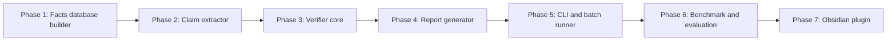

# 1. Step by Step Build Plan

> **The build plan in one sentence**: Build the system in seven phases, starting with the facts database (Track A), then the claim extractor (Track B), then the verifier, then the report generator, then the benchmark, then the Obsidian plugin — each phase producing a usable artifact on its own.

This note describes the build order, the deliverables for each phase, and the time estimates.

---

## 1.1 The Seven Phases

Each phase is independently useful. You can stop after any phase and have a working artifact.

---

## 1.2 Phase 1: Facts Database Builder

**Goal**: Given a PGN, produce a JSON facts database with all the per-ply records described in Chapter 2.4.

**Deliverables**:
- Python module that takes a PGN file path and outputs a facts database JSON file.
- Unit tests verifying FEN correctness against known games.
- Performance test: a 40-ply game processes in under 5 seconds.

**Key components**:
- PGN parser (using python-chess).
- Game replay loop (using `board.push(move)` and `board.fen()`).
- Stockfish integration (UCI over subprocess).
- Attack map builder (using `board.attackers()`).
- Material timeline builder.

**Time estimate**: 1-2 weeks for a single developer.

**Definition of Done**:
- The facts database for the Kasparov-Topalov 1999 game matches published FENs at every ply.
- Stockfish evaluations are cached and reusable.
- The module handles malformed PGN gracefully (skip with error, not crash).

---

## 1.3 Phase 2: Claim Extractor

**Goal**: Given a Markdown note's prose (with line numbers), produce a structured claim list using an LLM.

**Deliverables**:
- Python module that takes prose text and outputs a claim list JSON.
- LLM prompt template (with few-shot examples).
- Validation pipeline (JSON parse, schema validation, type-specific param validation).
- Caching layer (cache by `hash(prose + prompt_version + model_version)`).

**Key components**:
- LLM client (using OpenAI / Anthropic / ZhipuAI API).
- Prompt template with claim type catalog.
- JSON schema validator (using `jsonschema` library).
- Re-prompt logic for validation failures.

**Time estimate**: 1-2 weeks.

**Definition of Done**:
- The extractor handles the example prose from Chapter 3.3.4 correctly.
- Validation rejects outputs with fields outside the schema.
- Caching reduces redundant API calls by >90% on iterative development.
- The extractor supports at least three claim types: move_description, capture, material_gain.

---

## 1.4 Phase 3: Verifier Core

**Goal**: Given a claim list and a facts database, produce a verdict for each claim.

**Deliverables**:
- Python module with a `verify(claim, facts) -> Verdict` function.
- One handler per supported claim type.
- Unit tests for each handler (at least 10 test cases each).
- End-to-end test running the verifier on a sample claim list and facts database.

**Key components**:
- Dispatcher (`HANDLERS` dict mapping claim type to handler function).
- Per-handler verification logic (Chapter 4).
- Verdict object with label and explanation.
- Error handling for ambiguous claims and missing facts.

**Time estimate**: 2-3 weeks (1 week for v1 claim types, 1 week for v2 tactical claims, 1 week for v2 strategic/positional claims).

**Definition of Done**:
- All v1 claim type handlers pass their unit tests.
- The verifier never crashes on any input (graceful degradation).
- Verifier time per claim is under 5 ms.

---

## 1.5 Phase 4: Report Generator

**Goal**: Given a list of verdicts, produce a Markdown report and a JSON report.

**Deliverables**:
- Python module that takes verdicts and produces a Markdown file.
- Same module produces a JSON sidecar.
- Report includes summary counts, per-claim sections with line numbers and verbatim quotes, and verdict explanations.

**Key components**:
- Markdown formatter (using `tabulate` or `rich` for tables).
- JSON serializer.
- Summary statistics calculator.

**Time estimate**: 3-5 days.

**Definition of Done**:
- The report for the example prose from Chapter 1.3 matches the expected output format.
- Line numbers are exact.
- Summary counts add up.
- JSON report validates against the schema.

---

## 1.6 Phase 5: CLI and Batch Runner

**Goal**: Given a vault directory, run the full pipeline on every Markdown note and produce reports.

**Deliverables**:
- CLI: `chess-verify <vault-dir>` runs the full pipeline.
- Batch runner: processes every `.md` file in the vault.
- Progress bar (using `tqdm`).
- Index report summarizing all notes.

**Key components**:
- File walker (`pathlib` or `os.walk`).
- Markdown parser (identifies PGN blocks, SAN, FEN, prose).
- Orchestrator (runs Phase 1 → 2 → 3 → 4 per note).
- Cache manager (reuses facts databases and LLM outputs across runs).

**Time estimate**: 1 week.

**Definition of Done**:
- The CLI processes a 10-note vault in under 2 minutes.
- The cache reduces re-processing time by >80% on unchanged notes.
- The index report lists every note with claim counts and verdict breakdowns.

---

## 1.7 Phase 6: Benchmark and Evaluation

**Goal**: Build the CCVB benchmark and evaluate the verifier against it.

**Deliverables**:
- CCVB benchmark with 2000 labeled examples.
- Annotator guidelines and raw annotation data.
- Evaluation script computing precision, recall, F1, kappa.
- Baseline implementations: LLM-only, Stockfish-only, rule-based.
- Results table comparing all four approaches.

**Key components**:
- Sampling script (draws from ACL, Synthetic, manual sources).
- Labeling interface (simple web UI or spreadsheet).
- Evaluation metrics calculator.
- Baseline implementations (each ~100-300 lines).

**Time estimate**: 4-6 weeks (annotator recruitment and labeling is the bottleneck).

**Definition of Done**:
- 2000 examples labeled by 3 annotators each.
- Inter-annotator kappa >= 0.7 overall.
- All four baselines evaluated on the test set.
- Verifier outperforms all baselines on overall F1.
- Public release on Hugging Face and GitHub.

---

## 1.8 Phase 7: Obsidian Plugin

**Goal**: An Obsidian plugin that runs the verifier inline as the author writes.

**Deliverables**:
- Obsidian plugin (TypeScript / JavaScript).
- Inline squiggly underlines for flagged sentences.
- Hover tooltips with verdict explanations.
- Background processing (does not block the editor).
- Settings panel (LLM model, Stockfish depth, cache location).

**Key components**:
- TypeScript port of the verifier (or HTTP API to a Python backend).
- Obsidian editor integration (using the Obsidian API).
- chessboard.js for rendering positions in tooltips.
- Local Storage or IndexedDB for caching.

**Time estimate**: 4-6 weeks (Obsidian plugin development is its own skill).

**Definition of Done**:
- The plugin runs in Obsidian without crashing.
- Inline feedback appears within 2 seconds of typing.
- The plugin handles vaults of up to 1000 notes.
- Settings are persisted.

---

## 1.9 Total Time Estimate

| Phase | Time | Cumulative |
|---|---|---|
| 1. Facts database | 1-2 weeks | 2 weeks |
| 2. Claim extractor | 1-2 weeks | 4 weeks |
| 3. Verifier core | 2-3 weeks | 7 weeks |
| 4. Report generator | 3-5 days | 8 weeks |
| 5. CLI | 1 week | 9 weeks |
| 6. Benchmark | 4-6 weeks | 14 weeks |
| 7. Obsidian plugin | 4-6 weeks | 19 weeks |

Total: roughly 4-5 months for a single developer working part-time. With a team of 2-3, this can be compressed to 2-3 months by parallelizing Phases 1 and 2, and Phases 6 and 7.

---

## 1.10 What to Build First If You Only Have One Weekend

If you have only one weekend, build:

1. **Phase 1 (facts database) for a single game**. Skip caching, skip the timeline, just get FENs and Stockfish evals for one game.
2. **Phase 2 (claim extractor) with a hardcoded prompt**. Skip the validation pipeline, just send the prose and parse the JSON.
3. **Phase 3 (verifier) for move_description only**. One handler, ~50 lines.
4. **Phase 4 (report generator) as a print statement**. Just dump the verdicts to stdout.

This gives you a working end-to-end demo on a single game. It is not production-ready, but it proves the concept. From there, expand phase by phase.

---

## 1.11 Key Reminders

- Seven phases, each independently useful.
- Phase 1 (facts database) is the foundation. Get it right first.
- Phase 2 (claim extractor) is parallelizable with Phase 1.
- Phase 3 (verifier) is the longest phase. Budget 2-3 weeks.
- Phase 4 (report generator) is quick. 3-5 days.
- Phase 5 (CLI) makes the system usable. 1 week.
- Phase 6 (benchmark) is what makes it publishable. 4-6 weeks.
- Phase 7 (Obsidian plugin) is the long-term vision. 4-6 weeks.
- Total: 4-5 months solo, 2-3 months with a team.
- One-weekend demo: skip caching, validation, and most claim types. Just prove the end-to-end concept.
- Each phase has a Definition of Done. Use it to track progress.
