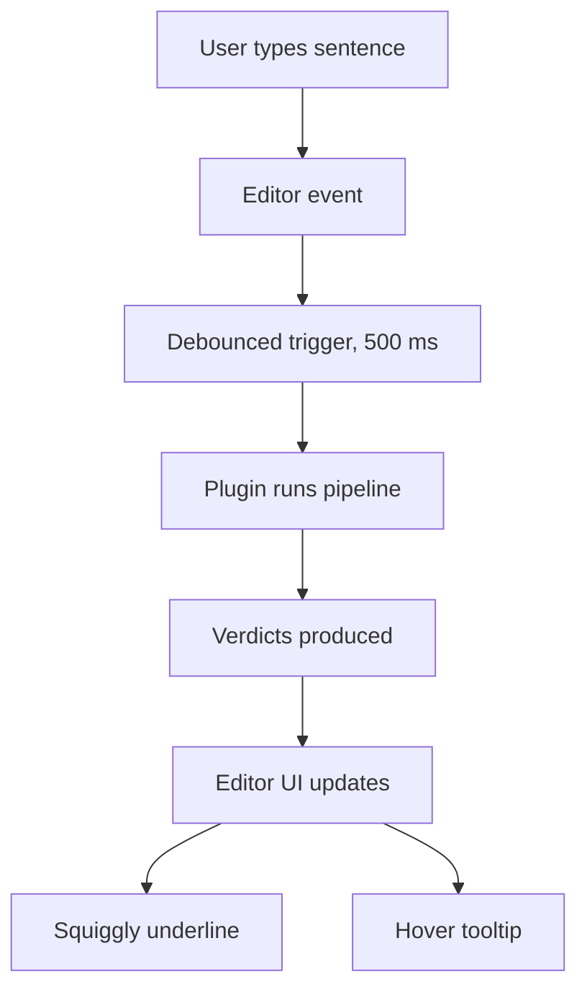
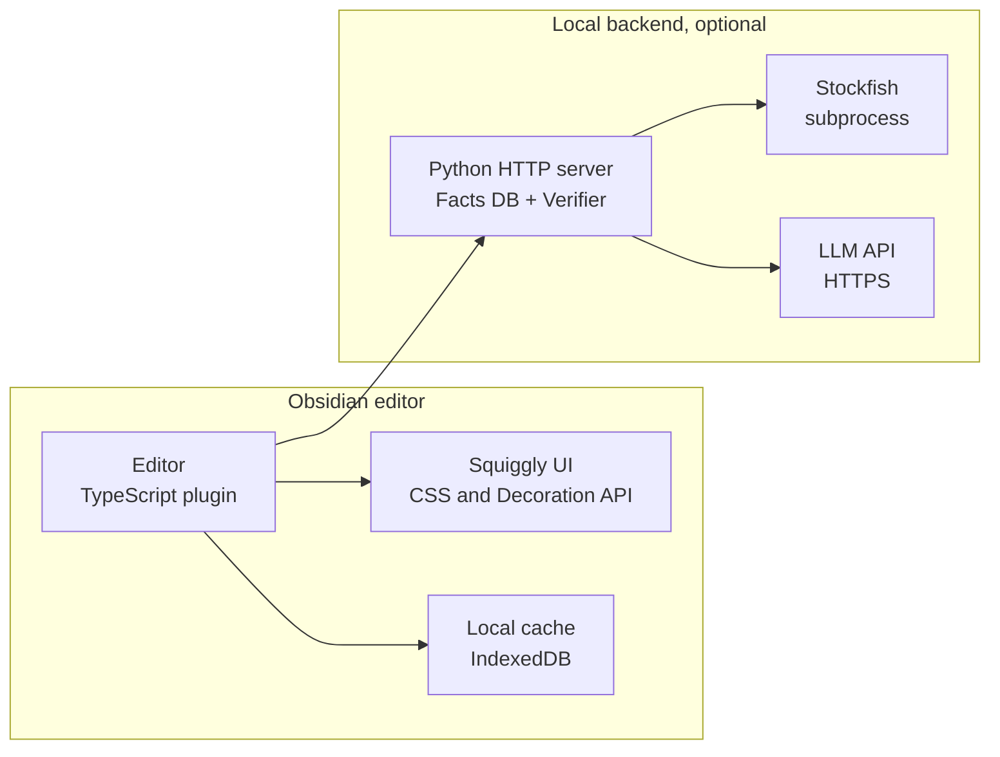
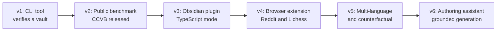

# 4. Long Term Vision

> **The long-term vision in one sentence**: An Obsidian plugin that behaves like a spell-checker for chess — as the author writes, the system extracts claims in the background, verifies them against the board, and flags inconsistencies inline with squiggly underlines and hover tooltips.

This note describes the vision, the path to it, and the features it enables.

---

## 4.1 The Vision

Imagine an Obsidian author writing chess notes. They type:

```text
The king captures the pawn...
```

Within seconds, a red squiggly underline appears under "king captures". Hovering over it shows:

```text
Warning: The PGN indicates that the rook captured the pawn, not the king.

Suggested correction: "The rook captures the pawn."

Confidence: 98%

Evidence: ply 14 is Rxe5, a rook capturing a pawn on e5. No king capture occurred.
```

Or:

```text
Unsupported claim: "White wins material."

Stockfish reports material remains equal (eval = +0.2).

Confidence: 95%
```

This is the spell-checker-for-chess experience. It is the long-term vision.



---

## 4.2 The Plugin Architecture



The plugin has two modes:

### 4.2.1 Pure TypeScript mode

The entire pipeline (PGN parsing, claim extraction via LLM API, verification, attack maps) runs in JavaScript / TypeScript within Obsidian. No Python backend required.

Pros: simple installation, no external dependencies.
Cons: requires porting python-chess to JavaScript (chess.js covers most of it). Stockfish runs via WebAssembly (slower than native). LLM API calls expose the API key in the browser.

### 4.2.2 Hybrid mode

The plugin calls a local Python backend (HTTP server) that runs the verifier. Stockfish runs natively. LLM API calls happen server-side.

Pros: full power of Python ecosystem, native Stockfish, API keys stay server-side.
Cons: requires the user to install Python and run a local server. More setup friction.

For v1 of the plugin, pure TypeScript mode is the right choice (lower friction). For power users, hybrid mode is a v2 option.

---

## 4.3 Plugin Features

### 4.3.1 Inline squiggly underlines

Each verdict gets a color:
- Green: Verified (no underline, or subtle gray "verified" marker).
- Red: Contradicted or Possible hallucination.
- Yellow: Supported (soft) or Ambiguous.
- Gray: Cannot verify automatically.

### 4.3.2 Hover tooltips

Hovering over a flagged sentence shows:
- The verdict label.
- The one-sentence explanation.
- The expected vs. actual board fact.
- A suggested correction (if applicable).
- The confidence score (for soft verdicts).

### 4.3.3 Sidebar panel

A sidebar panel shows:
- The current note's claim count and verdict breakdown.
- A list of all flagged claims, clickable to jump to the source line.
- A "re-verify" button to force re-processing.

### 4.3.4 Settings

- LLM provider (OpenAI, Anthropic, ZhipuAI, local Llama).
- LLM model (e.g., gpt-4o-mini).
- Stockfish path and depth.
- Cache location.
- Verdict filter (show only red, show red + yellow, show all).
- Language (English only in v1).

### 4.3.5 Command palette

- "Verify this note": runs the pipeline on the current note.
- "Verify entire vault": runs the pipeline on all notes.
- "Clear cache": clears the local cache.
- "Export report": exports the verification report as a Markdown file.

### 4.3.6 Background processing

The plugin processes notes in the background, marking each note with a verification status:
- Unverified (gray).
- Verifying (yellow spinner).
- Verified (green check).
- Has errors (red x).

The author can see at a glance which notes need attention.

---

## 4.4 Beyond Obsidian

The Obsidian plugin is the primary long-term target, but the architecture generalizes to other platforms:

### 4.4.1 VS Code extension

The same TypeScript code could be packaged as a VS Code extension. VS Code is widely used by developers who write chess notes in Markdown.

### 4.4.2 Browser extension

A browser extension could verify chess commentary on:
- Reddit (r/chess posts).
- Chess.com forums.
- Lichess studies.
- Personal blogs.

The extension reads the page's content, identifies PGN blocks and prose, and runs the verifier inline.

### 4.4.3 GitHub Action

A GitHub Action that runs the verifier on every push to a chess-notes repository. Fails the build if any claim is `Possible hallucination` or `Contradicted`.

### 4.4.4 LMS integration

For online chess courses (Coursera, Udemy, etc.), an LMS plugin that verifies instructor commentary before publication.

---

## 4.5 Research Extensions

Beyond the engineering vision, several research extensions are possible:

### 4.5.1 Multi-language support

Extend the claim extractor to handle non-English commentary (Spanish, Russian, Chinese). This requires multilingual LLMs and language-specific annotators for the benchmark.

### 4.5.2 Counterfactual analysis

Support comparison claims ("instead of Nf3, Bxc3 was stronger") by running Stockfish on the alternative move. This requires extending the facts database with alternative-move analysis.

### 4.5.3 Style transfer

If a claim is `Contradicted`, suggest a corrected sentence that preserves the author's style but is factually correct. This requires an LLM that can rewrite while preserving style.

### 4.5.4 Document-level consistency

Flag jointly inconsistent claims (e.g., "White wins a pawn" at line 24 and "Material is equal" at line 42). This requires a consistency checker that operates across claims.

### 4.5.5 Tactical correctness verification

Extend beyond commentary verification to verify tactical correctness: "White mates in 3" can be checked by Stockfish's mate detection.

### 4.5.6 Authoring assistance

Move from verification to authoring assistance: suggest commentary that is guaranteed to be grounded in the board. This is the inverse of verification and is closer to the existing generation literature.

---

## 4.6 The Path to the Vision



Each version builds on the previous. The path is:
1. **v1 (3-6 months)**: CLI tool that verifies a vault. Proves the concept.
2. **v2 (6-9 months)**: Public benchmark. Enables research community.
3. **v3 (9-15 months)**: Obsidian plugin. Reaches the target user.
4. **v4 (15-18 months)**: Browser extension. Reaches broader audience.
5. **v5 (18-24 months)**: Multi-language and counterfactual. Research extensions.
6. **v6 (24+ months)**: Authoring assistant. Closes the loop with generation.

This is a 2-3 year roadmap. It is ambitious but achievable with consistent effort.

---

## 4.7 Sustainability

A long-term project needs sustainability:

### 4.7.1 Open source community

Build a community of contributors. Accept pull requests. Respond to issues. Publish a roadmap. A healthy open source project outlives any single contributor.

### 4.7.2 Funding

Possible funding sources:
- Research grants (NSF, EU, etc.) for the academic side.
- Donations (Open Collective, GitHub Sponsors) for the open source side.
- Commercial licensing for proprietary integrations (Chessable, etc.).

### 4.7.3 Maintenance

Maintain the benchmark, the verifier, and the plugin. Periodically refresh the benchmark. Update for new LLM versions. Fix bugs. Without maintenance, the project becomes stale.

### 4.7.4 Documentation

Maintain high-quality documentation (this vault is a start). New users should be able to get up to speed in a weekend.

---

## 4.8 Key Reminders

- Long-term vision: an Obsidian plugin that behaves like a spell-checker for chess.
- Two plugin modes: pure TypeScript (lower friction) and hybrid with Python backend (more powerful).
- Plugin features: squiggly underlines, hover tooltips, sidebar panel, settings, command palette, background processing.
- Beyond Obsidian: VS Code extension, browser extension, GitHub Action, LMS integration.
- Research extensions: multi-language, counterfactual, style transfer, document-level consistency, tactical correctness, authoring assistance.
- 2-3 year roadmap: v1 CLI → v2 benchmark → v3 plugin → v4 browser → v5 multi-language → v6 authoring.
- Sustainability: open source community, funding, maintenance, documentation.
- The vision is what justifies the engineering. Keep it in mind when making short-term decisions.
