# Chess Knowledge Verification System — Obsidian Vault

> A complete, self-contained study vault for the project that fact-checks AI-generated (or human-written) chess commentary against the actual chess position it references.

This vault is a **long-form, exhaustive study companion** for the chess knowledge verification project. It is structured like a course: every chapter breaks the project into smaller concepts, and every concept note explains the idea in depth, with examples, edge cases, common mistakes, and Mermaid diagrams where a picture is worth a thousand words.

---

## How to Use This Vault

1. Start with the **[[00. Map of Content]]** to see the full structure at a glance.
2. Read chapters in order if you are learning the project from scratch.
3. If you already know the basics, jump straight to **Chapter 4. Claim Types and Verification** and **Chapter 9. Worked Examples and Exercises** — these are where most of the subtlety lives.
4. Every note ends with a **Key Reminders** section that lists the points people most often forget. Use these as a quick refresher before doing real implementation work.

---

## Vault Structure

```mermaid
graph TD
    Root[Chess Knowledge Verification Vault]
    Root --> C1[Chapter 1. Project Overview]
    Root --> C2[Chapter 2. System Architecture]
    Root --> C3[Chapter 3. Core Components]
    Root --> C4[Chapter 4. Claim Types and Verification]
    Root --> C5[Chapter 5. Research Landscape]
    Root --> C6[Chapter 6. Existing Tools and Software]
    Root --> C7[Chapter 7. Novelty and Research Value]
    Root --> C8[Chapter 8. Implementation Roadmap]
    Root --> C9[Chapter 9. Worked Examples and Exercises]
    Root --> C10[Chapter 10. Appendix]

    C1 --> C1a[What is the System]
    C1 --> C1b[The Core Problem]
    C1 --> C1c[The Goal]
    C1 --> C1d[Why This Project Matters]

    C2 --> C2a[High-Level Pipeline]
    C2 --> C2b[Separation of Concerns]
    C2 --> C2c[Inputs and Outputs]
    C2 --> C2d[The Facts Database]

    C3 --> C3a[python-chess]
    C3 --> C3b[Stockfish]
    C3 --> C3c[LLM for Claim Extraction]
    C3 --> C3d[Symbolic Verifier]

    C4 --> C4a[Move Descriptions]
    C4 --> C4b[Captures]
    C4 --> C4c[Tactical Claims]
    C4 --> C4d[Strategic Claims]
    C4 --> C4e[Material Claims]
    C4 --> C4f[Positional Claims]

    C5 --> C5a[Commentary Generation]
    C5 --> C5b[Hybrid Symbolic plus LLM]
    C5 --> C5c[Neural Commentators]
    C5 --> C5d[Datasets]
    C5 --> C5e[NLP in Chess]
    C5 --> C5f[Open Problems]

    C6 --> C6a[Open Source Tools]
    C6 --> C6b[Commercial Software]
    C6 --> C6c[Why Tools Fall Short]

    C7 --> C7a[What Is Novel]
    C7 --> C7b[What Is Not Novel]
    C7 --> C7c[Publishing as Research]
    C7 --> C7d[Defining the Benchmark]

    C8 --> C8a[Step by Step Build Plan]
    C8 --> C8b[Architecture Decisions]
    C8 --> C8c[Evaluation Strategy]
    C8 --> C8d[Long Term Vision]

    C9 --> C9a[Example Sicilian Middlegame]
    C9 --> C9b[Exercise Move Verification]
    C9 --> C9c[Exercise Capture Verification]
    C9 --> C9d[Exercise Tactical Verification]
    C9 --> C9e[Exercise Material Verification]

    C10 --> C10a[Glossary]
    C10 --> C10b[Key Papers and References]
    C10 --> C10c[Common Mistakes]
    C10 --> C10d[Tips and Tricks]
```

---

## Conventions Used Across the Vault

- **Numbering**: every file and section title uses the format `1. Title` — number, period, space, then the title. No underscores anywhere.
- **Diagrams**: only Mermaid is used. No raw ASCII diagrams appear in this vault.
- **Cross-references**: links use Obsidian wikilink syntax `[[Note Name]]`.
- **Callouts**: `> [!note]`, `> [!warning]`, `> [!tip]`, and `> [!info]` blocks mark important context.
- **Length**: notes are intentionally long. They are meant to be re-read in pieces, not skimmed.

---

## Quick Navigation

- [[00. Map of Content]]
- [[Chapter 1. Project Overview/1. What is the System|1. What is the System]]
- [[Chapter 2. System Architecture/1. High-Level Pipeline|1. High-Level Pipeline]]
- [[Chapter 3. Core Components/1. python-chess|1. python-chess]]
- [[Chapter 4. Claim Types and Verification/1. Move Descriptions|1. Move Descriptions]]
- [[Chapter 5. Research Landscape/1. Chess Commentary Generation|1. Chess Commentary Generation]]
- [[Chapter 9. Worked Examples and Exercises/1. Example Sicilian Middlegame|1. Example Sicilian Middlegame]]
- [[Chapter 10. Appendix/1. Glossary|1. Glossary]]
