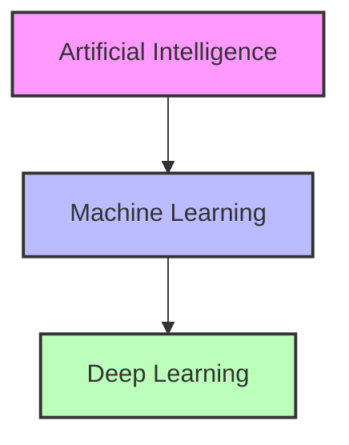
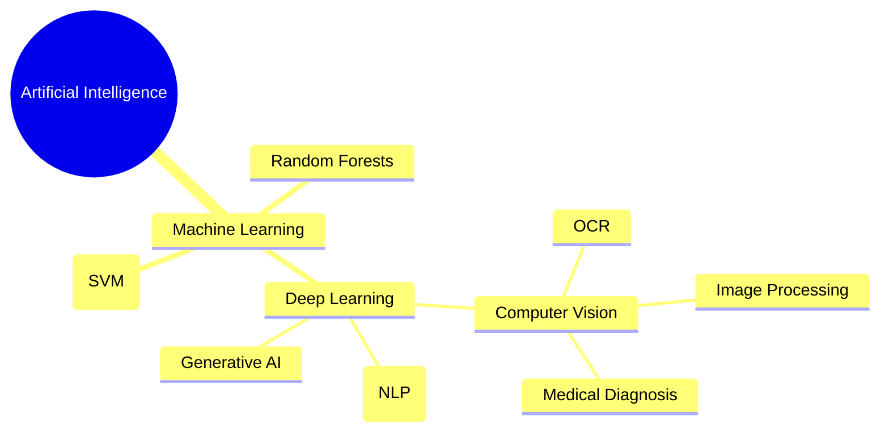

# 1. Deep Learning Definition and Context

**Deep Learning (Apprentissage profond)** is a specialized sub-domain of Machine Learning, which itself is a sub-domain of Artificial Intelligence (AI). The defining characteristic of Deep Learning is its use of Artificial Neural Networks (ANNs) that possess multiple hidden layers—referred to as "deep" architectures. These deep architectures enable the model to learn highly complex, hierarchical representations directly from raw, unstructured data.

## The AI Hierarchy

Deep Learning is not an isolated concept; it is a highly specialized subset within the broader field of computer science. To understand where Deep Learning fits, it is crucial to visualize the containment hierarchy of AI:

**Artificial Intelligence:** The broadest concept. It encompasses any technique that enables computers to mimic human intelligence, using logic, if-then rules, decision trees, and machine learning. Any technique that enables computers to mimic human intelligence falls under this umbrella.

**Machine Learning:** A subset of AI that includes statistical algorithms (like Support Vector Machines, Random Forests, Linear Regression) that allow computers to learn from data without being explicitly programmed for every scenario. It uses statistical methods to enable machines to improve with experience. Includes algorithms like Random Forests and SVMs.

**Deep Learning:** A subset of Machine Learning that exclusively uses deep neural networks. A subset of ML composed of Artificial Neural Networks (ANNs) with multiple "deep" layers. It learns complex representations directly from **raw data** (pixels, audio waves) without human intervention. The "deep" does not refer to a profound understanding, but rather to the number of successive layers of representation. The model learns through these layers, progressively extracting higher-level features from the raw input.

### Key Distinctions at a Glance

| Concept | Scope | Key Characteristic | Examples |
| :--- | :--- | :--- | :--- |
| **AI** | Broadest | Any technique mimicking human intelligence | Logic rules, decision trees, expert systems |
| **ML** | Subset of AI | Statistical learning from data | SVMs, Random Forests, Linear Regression |
| **DL** | Subset of ML | Deep neural networks learning from raw data | CNNs, RNNs, Transformers |

## How Deep Learning Learns Representations

In traditional Machine Learning, humans must manually engineer features (e.g., extracting edges from an image to detect a face). In Deep Learning, the network performs **Representation Learning** — it automatically discovers the representations needed for feature detection or classification from raw data.

The power of deep learning comes from its layered architecture, where each layer transforms the representation of the data into something slightly more abstract and composite:

- **Layer 1** might learn to detect raw edges (simple gradients, lines).
- **Layer 2** might combine edges to detect shapes (like eyes, noses, or corners).
- **Layer 3** might combine shapes to detect whole objects (like faces, cars, or animals).

This automated, hierarchical feature extraction is what makes Deep Learning so powerful for unstructured data like images, audio, and text. Instead of relying on a human domain expert to manually define which features matter, the network discovers the optimal feature hierarchy on its own through the training process.

> **Important Reminder:** Deep Learning is not a completely new paradigm separate from Machine Learning; it is a specific technique *within* Machine Learning. All Deep Learning is Machine Learning, but not all Machine Learning is Deep Learning. This distinction is critical: the mathematical foundations (gradient descent, loss functions, optimization) are shared across both, but Deep Learning's architectural depth enables it to tackle problems that are intractable for traditional ML methods.
