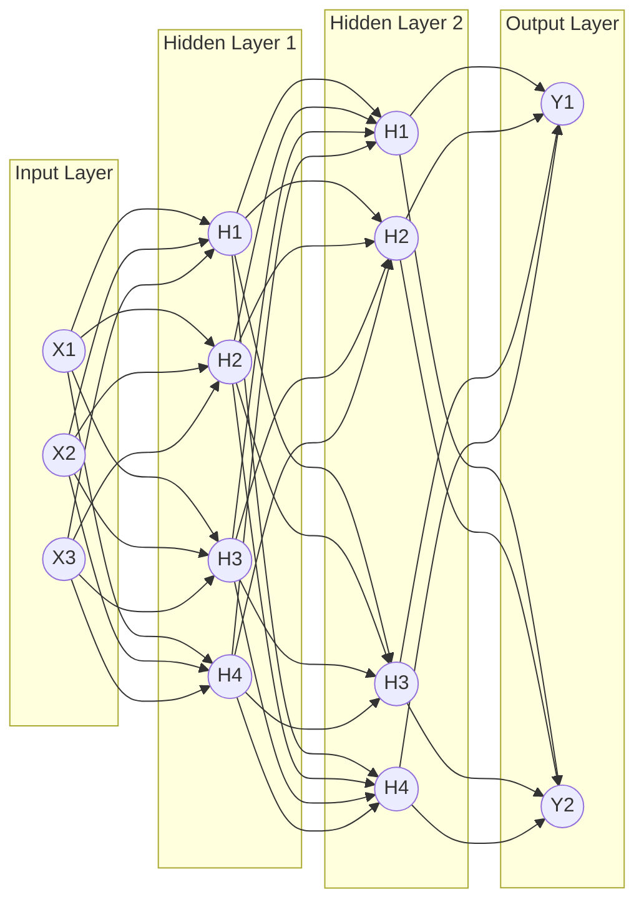

# 11. Multi-Layer Perceptron and Backpropagation

A Multi-Layer Perceptron (MLP), also known as an Artificial Neural Network (ANN), is a feedforward neural network capable of solving non-linearly separable problems by utilizing multiple layers of neurons via dense connections. The MLP overcomes the fundamental limitation of the single Perceptron — while a single Perceptron can only separate linearly separable data (like AND/OR), an MLP with at least one hidden layer can approximate any continuous function, including non-linear ones like XOR.

## Architecture of an MLP

1.  **Input Layer:** Receives the raw data (flattened into a 1D array). No math happens here; it just passes the values forward. No computation happens here — the input layer is simply a 1D array representing features.
2.  **Hidden Layers:** The "brain" of the network. Each neuron connects to all neurons in the previous layer (Dense/Fully Connected). They apply weights, biases, and non-linear activation functions to learn complex patterns. Each neuron applies $W^T X + b$ followed by an activation function. The number of layers and neurons are **Hyperparameters** (settings you choose before training) — they are not learned from data but must be chosen by the practitioner.
3.  **Output Layer:** Produces the final prediction. Its shape depends on your problem (1 neuron for binary, $N$ neurons for multi-class). Size depends on the task (1 for binary, $N$ for multi-class). Returns the prediction.

**Dense/Fully Connected:** Every neuron in one layer connects to every neuron in the next layer. This means if Layer 1 has 100 neurons and Layer 2 has 50 neurons, there are $100 \times 50 = 5,000$ weight connections (plus 50 bias terms) between just these two layers. This dense connectivity allows the network to learn any combination of features from the previous layer.

## The 4 Steps of Training: Backpropagation

Training a neural network is an iterative process governed by an algorithm called **Backpropagation**. The term "backpropagation" specifically refers to the efficient computation of gradients using the chain rule, not the entire training loop. _This process is repeated for thousands of **Epochs** until the loss is minimized._

1.  **Forward Pass:** Data flows from input to output. The network makes a prediction based on its current, random weights. Data flows through the network to generate a prediction (Actual Outputs vs Desired Outputs). Each layer computes its output and passes it to the next layer.

2.  **Calculate Loss:** We compare the prediction to the true target using a Loss Function (e.g., Cross-Entropy, MSE, BCE, CCE). This single number quantifies how wrong the entire network is on the current batch of data.

3.  **Backward Pass (Backpropagation):** The core algorithm of Deep Learning. The network calculates the **Gradient** (the derivative of the loss) for every single weight and bias in the network, starting from the output and moving backward to the input using the _Chain Rule of Calculus_. It utilizes the **Chain Rule of Calculus** to calculate the gradient (partial derivative) of the Loss Function with respect to _every single weight and bias_ in the network. This is the computationally brilliant part — instead of computing each gradient independently, backpropagation reuses intermediate results, making the entire gradient computation roughly the same cost as the forward pass.

4.  **Update Weights:** The optimizer (like SGD or Adam) uses the gradients to adjust the weights slightly to reduce the error. Using SGD or Adam on mini-batches, the weights are shifted slightly to decrease the error. The direction and magnitude of each update are determined by the gradient and the learning rate.

## MLP Notation (Advanced)

When dealing with a Multi-Layer Perceptron (MLP), the notation becomes more complex because we are tracking hundreds of weights across multiple layers. Having a consistent notation system is essential for understanding and implementing backpropagation correctly.

### Understanding the Notation

The slides provide a specific visual representation of an ANN with specific mathematical annotations:

- **Inputs:** $x_1, x_2$
- **Hidden Layer Activations:** $a_1^{(h)}, a_2^{(h)}, a_3^{(h)}$
  - The superscript $(h)$ denotes this belongs to the **H**idden layer.
  - The subscript denotes which neuron in that layer (neuron 1, 2, or 3).
- **Output Layer Activations:** $a_1^{(out)}, a_2^{(out)}$
  - The superscript $(out)$ denotes this belongs to the **Out**put layer.
- **Weights:** $w_{1,2}^{(h)}$
  - This is the weight connecting input $x_2$ to hidden neuron $a_1^{(h)}$.
  - Format: $w_{\text{destination\_neuron}, \text{source\_input}}^{(\text{layer})}$.
  - The first subscript is the destination (which neuron receives this signal).
  - The second subscript is the source (which neuron or input sends this signal).

This notation allows us to precisely identify every single connection in the network, which is essential for computing gradients during backpropagation.

### Backpropagating Through Multiple Layers

The Chain Rule applies exactly as it did in the Perceptron, but now it extends backward across multiple layers. This is where backpropagation gets its name — the errors "propagate backward" from the output through each hidden layer to the input.

If we want to update the weight connecting the first hidden neuron to the first output neuron ($w_{1,1}^{(out)}$), we calculate:

$$ \frac{\partial \mathcal{L}}{\partial w_{1,1}^{(out)}} = \frac{\partial \mathcal{L}}{\partial a_1^{(out)}} \times \frac{\partial a_1^{(out)}}{\partial w_{1,1}^{(out)}} $$

This is relatively simple — only two factors because the output layer is directly connected to the loss.

However, if we want to update a weight deep inside the network (e.g., in the very first hidden layer), the chain rule must multiply backward through the _entire_ network, accumulating gradients from every path that weight influenced. For a weight $w$ in the first hidden layer, the gradient depends on:
1. The loss gradient with respect to the output.
2. The output gradient with respect to the last hidden layer.
3. The last hidden layer gradient with respect to the second-to-last hidden layer.
4. ... and so on back to the first hidden layer.
5. The first hidden layer gradient with respect to the weight $w$.

Each layer in between contributes a multiplication factor to the chain.

### The Vanishing Gradient in Deep Networks

This is where the **Vanishing Gradient** problem occurs. If we use the Sigmoid activation function, every time we multiply backward through a layer, we multiply by a number smaller than $0.25$ (the maximum derivative of the sigmoid). By the time the gradient reaches the first layer of a deep network, it is effectively zero, and the first layer never learns. This is why **ReLU** was invented — its gradient is either 0 or 1 for positive inputs, so the gradient doesn't shrink as it passes through layers.

**Concrete example:** Consider a 10-layer network using Sigmoid activation. The gradient for a weight in Layer 1 would be multiplied by at most $0.25^{10} \approx 0.00000095$ as it propagates through the 10 layers. This means Layer 1 receives a gradient that is less than one-millionth of the original signal — far too small to produce meaningful weight updates. The network effectively stops learning in its early layers.
