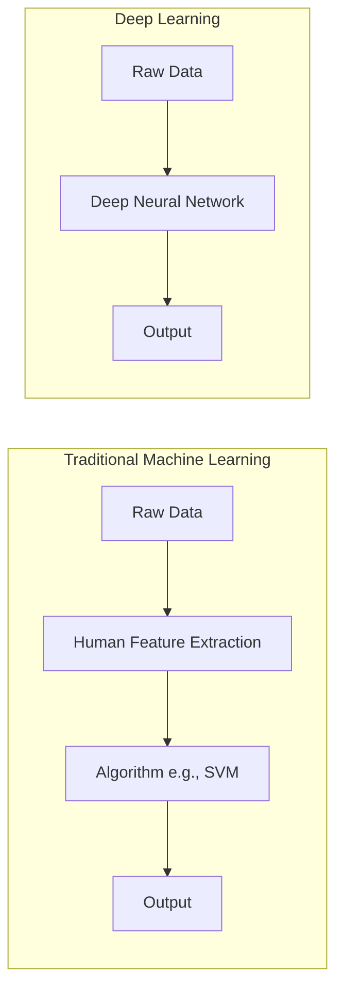
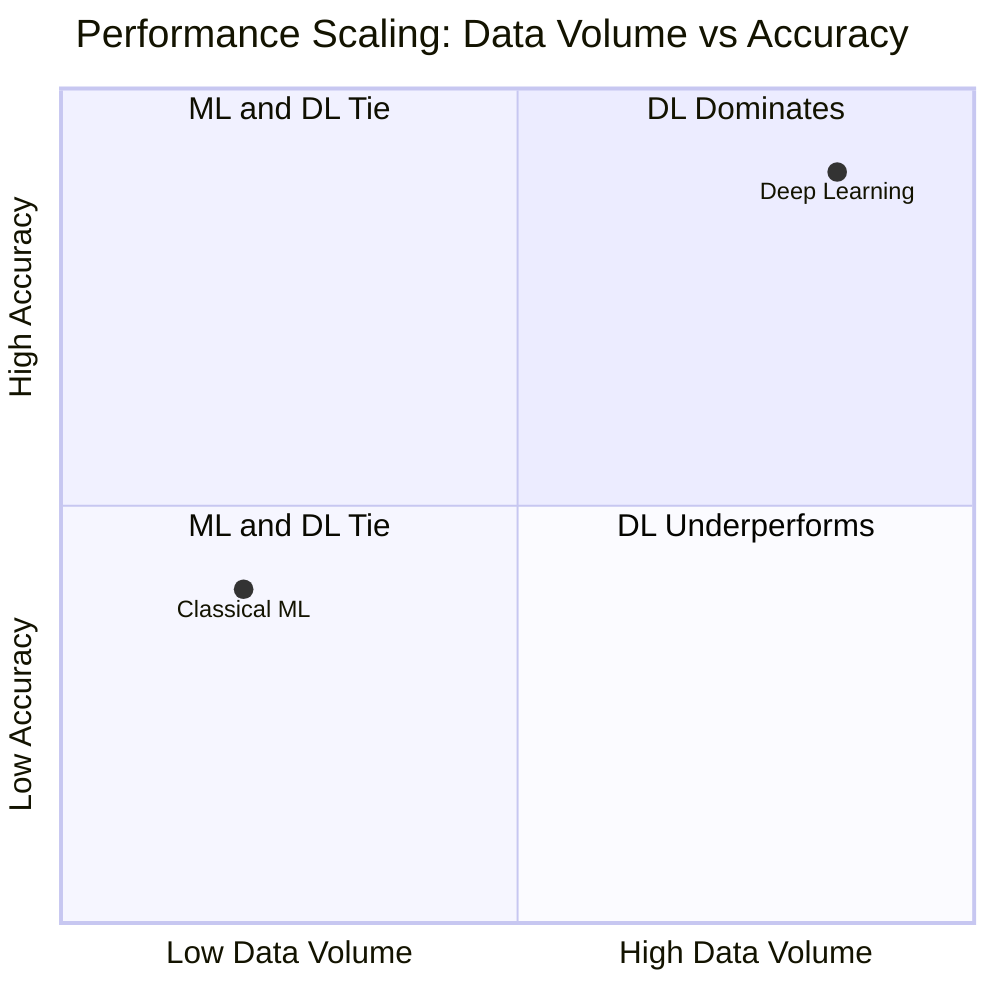

# 2. Machine Learning vs Deep Learning

Understanding when to use standard Machine Learning versus Deep Learning is a critical skill for any Data Scientist or AI Engineer. Understanding the differences between classical Machine Learning (ML) and Deep Learning (DL) is critical for choosing the right tool for a given problem. The differences span data requirements, human intervention, hardware, and performance scaling.

## Feature Engineering: The Core Difference

The most fundamental difference lies in **Feature Extraction**.

- **Machine Learning (Traditional):** Requires **Feature Engineering**. A human expert must manually extract relevant features from the raw data. A human expert must manually identify and extract features from raw data to feed into the model. _Example: For a self-driving car, a human writes code to find edges, circles (wheels), and colors. For a spam detector, a human might manually create features like "contains the word 'FREE'" or "number of exclamation marks."_
- **Deep Learning:** Features are learned automatically. The network is fed raw data (pixels) and learns on its own what features (edges, shapes, objects) are important to make the final decision. The neural network figures out which combinations of pixels form edges, which edges form shapes, and which shapes form objects. No human intervention is needed for feature design — the model performs **end-to-end learning** directly from raw input to final output.

## Data Volume and Performance Scaling

The performance of ML and DL scales differently with the amount of data. This is one of the most important practical distinctions:

- **ML:** Performance plateaus early. After a certain amount of data, traditional algorithms (like SVMs or Random Forests) stop improving significantly. No matter how much more data you feed them, their accuracy stays roughly the same.
- **DL:** Performance continues to scale with more data. Given massive datasets (Big Data), Deep Learning models will continuously improve, eventually far surpassing classical ML models. This is why the era of Big Data has been so beneficial to Deep Learning — the more data, the better the model.

What this means in practice: if you have a small dataset (hundreds or a few thousand examples), classical ML may match or even outperform DL. But as your dataset grows into the millions, DL will pull ahead dramatically.

## Hardware and Computational Complexity

- **ML:** Can often be trained efficiently on standard CPUs (Central Processing Units). Training times range from seconds to hours. The computational demands are modest because the models have relatively few parameters and the mathematical operations are straightforward.
- **DL:** Involves millions or billions of matrix multiplications. Training on a CPU would take months or years. DL requires GPUs (Graphics Processing Units) or TPUs (Tensor Processing Units) to parallelize these calculations. A GPU can perform thousands of matrix operations simultaneously, which is exactly what neural network training demands. While training is extremely slow and computationally expensive, **inference** (making predictions on new data) is very fast — a trained neural network can classify an image in milliseconds.

## Detailed Comparison Table

Understanding the exact logistical differences is crucial for project planning. Below is a comprehensive comparison covering all major dimensions:

| Characteristic              | Machine Learning (Traditional)                    | Deep Learning                                   |
| :-------------------------- | :------------------------------------------------ | :---------------------------------------------- |
| **Type of Learning**        | Supervised or Unsupervised                        | Supervised, Semi-supervised, Reinforcement      |
| **Human Intervention**      | **High to Medium** (Feature Engineering required) | **Low** (Features learned automatically)        |
| **Input Data Type**         | Structured or Unstructured (Tabular)              | **Strictly Unstructured** (Pixels, Audio, Text) |
| **Output Data Type**        | Numerical Values                                  | Numerical, Text, Image, Voice, Video            |
| **Data Volume Needed**      | Low to Medium (Thousands)                         | **Extremely High** (Millions/Billions)          |
| **Data Quality Importance** | **Very High** (Garbage in = Garbage out)          | High                                            |
| **Training Duration**       | Short (Minutes/Hours)                             | **Long** (Days/Weeks/Months)                    |
| **Compute Power**           | Low to Medium (**CPUs**)                          | Strong (**GPUs/TPUs**)                          |
| **Interpretability**        | High (White-box, e.g., Decision Trees)            | Low (Black-box, hard to explain decisions)      |
| **Best Use Case**           | Structured/Tabular data                           | Unstructured data (Image, Text, Audio)          |

### Important Nuances in the Comparison

- **Learning Type:** DL uniquely benefits from **Semi-supervised learning** (using a small amount of labeled data with a large amount of unlabeled data) and **Reinforcement learning** (learning through rewards and penalties), which are far less common in traditional ML.
- **Input Data Type:** While ML can technically handle unstructured data, it requires extensive human preprocessing first. DL excels precisely because it processes raw, unstructured data directly — pixels, audio waveforms, or raw text characters — without any manual feature extraction step.
- **Data Quality Importance:** ML is extremely sensitive to data quality because the features are human-defined — if the features are poorly chosen, the model will fail regardless of algorithm choice ("Garbage in, Garbage out"). DL is somewhat more tolerant because it learns its own features, but it still requires clean, representative training data.
- **Interpretability:** This is a major concern. A Decision Tree in ML can tell you exactly *why* it made a decision (you can trace the path through the tree). A deep neural network with 100 million parameters is essentially a "black box" — it gives you the right answer, but explaining *why* is extremely difficult. This matters in domains like medicine or finance where explainability is legally required.

> [!WARNING] Common Pitfall
> Students often think Deep Learning is always better. It is **not**. If you have tabular data (like an Excel sheet with house prices), algorithms like Random Forest or XGBoost will often beat Deep Learning, train much faster, and be much easier to explain. Save Deep Learning for Images, Text, and Audio. DL shines when data is raw, unstructured, and massive.

## Framework Dominance

To build these applications, we rely on two dominant software frameworks:

- **PyTorch (Facebook/Meta):** Currently dominates academic research. It is highly flexible, dynamic, and Pythonic. The paper implementations graph shows PyTorch holding ~60% of code repositories. It is the undisputed standard in **Research** and academia.
- **TensorFlow (Google):** Highly robust, with comprehensive deployment tools. Historically the standard in **Production/Industry**, though its research share has dropped to ~2%. PyTorch is rapidly catching up in the production space as well.
