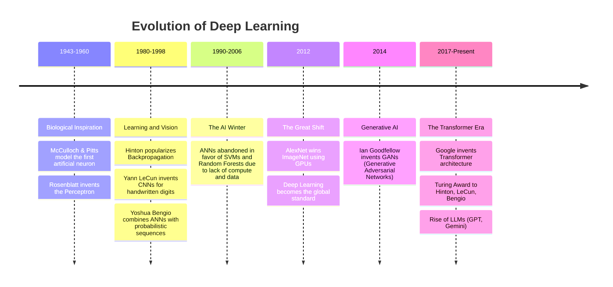

# 3. Evolution and History of Deep Learning

Deep Learning seems like an overnight success, but its evolution spans over 80 years, marked by "AI Winters" and explosive revivals. Understanding this history is important because it explains why certain techniques exist and why the field developed the way it did.

## The Timeline of Neural Networks

## Key Historical Milestones Explained

### 1. The Origins (1943-1960): Biological Inspiration

The initial goal was to mimic the human brain. Warren McCulloch and Walter Pitts created the first mathematical model of a neuron — a simplified computational unit that could perform logical operations. This was purely theoretical, but it proved that simple computational units could be combined to perform complex reasoning.

Frank Rosenblatt later invented the **Perceptron** (1958), the first algorithmic neural network that could actually learn weights from data. The Perceptron was a breakthrough: it was a machine that could improve its own performance through experience, adapting its internal parameters based on the data it saw.

### 2. The First AI Winter (1970s): The XOR Problem

Researchers realized the Perceptron could only solve **linearly separable** problems (like AND/OR functions) but failed on non-linear ones (like the XOR problem). Marvin Minsky and Seymour Papert published a book in 1969 proving that a single-layer Perceptron was fundamentally incapable of solving XOR. This mathematical proof caused funding and interest to collapse entirely. The field entered its first "AI Winter" — a period of stagnation, reduced funding, and skepticism about neural networks.

The irony is that multi-layer networks (which we now call MLPs) _could_ solve XOR, but at the time there was no efficient algorithm to train them. The technology simply wasn't ready.

### 3. The Backpropagation Revival (1986): Learning Returns

Geoffrey Hinton and colleagues popularized the **Backpropagation** algorithm in 1986, allowing multi-layered networks (MLPs) to learn by propagating errors backward through the network's layers. This was a monumental breakthrough — it provided the missing training algorithm that made deep networks feasible.

Yann LeCun later used backpropagation to build **Convolutional Neural Networks (CNNs)** for reading handwritten zip codes at the US Postal Service. This was one of the first real-world, commercial applications of neural networks. Yoshua Bengio advanced sequence models and attention mechanisms, laying groundwork for the NLP revolution that would come decades later.

### 4. The Second AI Winter (1990s-2006): Compute Wasn't Ready

Despite backpropagation being theoretically sound, computers were too slow and datasets too small for deep networks to show their potential. Training a network with more than 2-3 layers could take weeks on the hardware of the era, and the results were often no better than simpler methods.

Simpler, mathematically grounded algorithms like Support Vector Machines (SVMs) and Random Forests dominated because they were faster to train, more reliable on small data, and had strong theoretical guarantees. Neural networks were largely abandoned by the mainstream AI community during this period.

### 5. The ImageNet Revolution (2012): The Turning Point

The ILSVRC (ImageNet Large Scale Visual Recognition Challenge) required classifying 1.4 million images into 1000 categories. This was an enormous, unprecedented dataset that traditional methods struggled with.

Alex Krizhevsky, Ilya Sutskever, and Geoffrey Hinton created **AlexNet**, a deep CNN that crushed the competition, reducing the error rate by nearly half compared to the previous year's winner. This was the watershed moment that convinced the entire AI community that deep learning was the future.

**The Secret Weapons:**
1. **Big Data:** The massive ImageNet dataset provided enough examples for deep networks to learn meaningful representations. Without sufficient data, deep networks simply overfit.
2. **GPUs:** Hinton's brilliant idea to use graphics cards (originally designed for rendering video games) to parallelize the massive matrix multiplications required by neural networks. A single GPU could perform thousands of operations simultaneously, reducing training time from months to days.

### 6. The Generative Era (2014-Present): From Recognition to Creation

- **2014:** Ian Goodfellow creates GANs (Generative Adversarial Networks), allowing AI to generate realistic images for the first time. GANs pit two networks against each other — a generator that creates fake data and a discriminator that tries to detect it — resulting in increasingly convincing synthetic outputs.
- **2017:** Google publishes "Attention is All You Need", introducing the **Transformer** architecture, which eschews recurrence for attention mechanisms. This architecture would revolutionize NLP and eventually become the foundation for all modern language models.
- **2018:** Hinton, LeCun, and Bengio win the Turing Award (the "Nobel of Computing") for their foundational contributions to deep learning.
- **2020+:** The era of Large Language Models (LLMs) like GPT-3, ChatGPT, and Gemini, bringing deep learning into everyday life and demonstrating that scaled-up Transformer models can achieve remarkable general-purpose intelligence.

> **Key Takeaway:** Deep Learning did not emerge from a vacuum. It required three simultaneous breakthroughs: **Big Data** (the internet created massive datasets), **Compute** (GPUs provided the necessary processing power), and **Algorithms** (backpropagation, ReLU, and later Transformers provided the mathematical framework). Missing any one of these three pillars, deep learning would not exist as we know it today.
