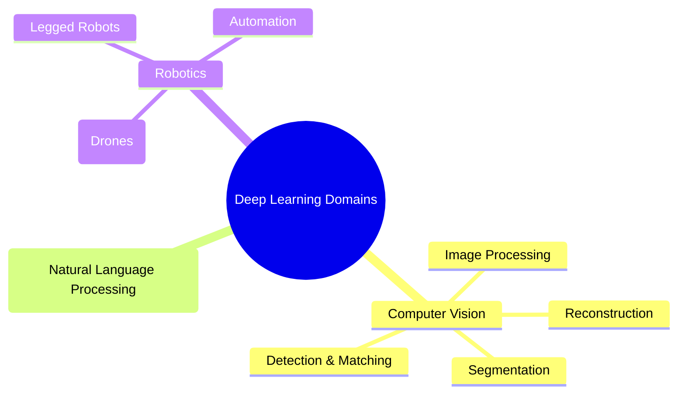

# 4. Applications of Deep Learning

Deep Learning has achieved superhuman performance in domains where data is unstructured and highly complex. Deep learning is preferred because it demonstrates unparalleled performance in image recognition, speech recognition, and natural language processing. It has transformed entire industries by enabling machines to perceive, understand, and generate content in ways that were previously impossible.

## Computer Vision (Image / Video)

This is the domain where DL first proved its dominance (via AlexNet in 2012). While "Computer Vision" is a broad umbrella term, Deep Learning breaks it down into highly specific, distinct tasks. A model built for one task usually cannot perform the other without architectural changes. Understanding these distinct tasks is essential because each requires a different network architecture and training approach.

### The 4 Pillars of Image Analysis

#### 1. Classification
- **Goal:** Assign a single label to an entire image.
- **How it works:** The network processes the entire image and outputs a single category label. It answers the question "What is in this image?" with one answer.
- **Example:** Looking at an image and outputting "Grille" (Grill), "Mushroom", or "Madagascar Cat". This was the primary focus of the 2012 ImageNet challenge, where AlexNet classified images into 1000 categories.
- **Architecture:** Typically uses CNNs with a final fully-connected layer outputting a probability distribution over all classes via Softmax.

#### 2. Retrieval (Content Association)
- **Goal:** Given a reference image, search a massive database to find visually or semantically similar images.
- **How it works:** The network encodes images into compact feature vectors (embeddings). Similar images will have similar embeddings, allowing fast similarity search across millions of images.
- **Example:** Uploading a picture of a specific flower and having the system return 10 images of the exact same flower species from different angles.
- **Applications:** Reverse image search (Google Images), product recommendation (find similar products from a photo).

#### 3. Detection (Object Detection)
- **Goal:** Locate specific objects within an image and draw a **Bounding Box** around them. This goes beyond classification — it not only identifies *what* objects are present but *where* they are.
- **How it works:** The network outputs both a class label and a set of coordinates (x, y, width, height) for each detected object. Multiple objects can be detected in a single image.
- **Example:** Identifying a person, a horse, and a dog in the same image, drawing a colored rectangle around each, and labeling them (e.g., using the _Faster R-CNN_ architecture). Used heavily in **Autonomous Vehicles** to detect pedestrians, roads, and other cars simultaneously.
- **Architecture:** Uses specialized detection architectures like YOLO (You Only Look Once), SSD, or Faster R-CNN that combine region proposal with classification.

#### 4. Segmentation (Semantic Segmentation)
- **Goal:** The most complex task. It classifies _every single pixel_ in the image, creating a precise, color-coded mask of the objects. Instead of a box around an object, you get the exact pixel-level outline.
- **How it works:** The network outputs a class prediction for every pixel in the input image, producing a dense prediction map rather than a single label or bounding box.
- **Example:** Instead of a box around a car, the exact outline of the car, the road, the sky, and pedestrians are highlighted pixel-by-pixel (e.g., _Farabet et al._). Used in **Medical Imaging** to precisely outline tumors or pneumothorax in X-rays.
- **Architecture:** Uses encoder-decoder architectures like U-Net, DeepLab, or FCN (Fully Convolutional Networks).

Additional CV applications include **Facial Recognition** for security, authentication, and social media tagging.

_Note: As shown in the slide's Venn diagram, Computer Vision often intersects heavily with Robotics (for navigation) and NLP (for generating image captions). A self-driving car, for instance, uses CV to perceive the world, NLP to understand voice commands, and Robotics to control the vehicle._

## Natural Language Processing (Text / Audio)

- **Machine Translation:** Translating languages contextually (Google Translate). Modern translation systems use Transformer architectures that can understand the full context of a sentence, not just translate word-by-word.
- **Sentiment Analysis:** Determining if a review is positive or negative (Marketing). This has enormous commercial value for brands monitoring social media and customer feedback.
- **Chatbots & LLMs:** ChatGPT, Gemini, summarizing documents, generating code. These models can engage in multi-turn conversations, answer questions, write essays, and even write functional software code.
- **Speech Recognition & Synthesis:** Converting voice to text (Siri, Alexa) and text to realistic speech. Modern systems can handle multiple languages, accents, and even emotional intonation.

## Industry-Specific Applications

### 1. Transport
- **Autonomous Vehicles:** DL identifies elements in the physical environment with precision (roads, sidewalks, pedestrians, other cars). This is perhaps the most demanding CV application because it requires real-time processing with extremely high reliability — a missed pedestrian can be fatal.
- **Sensor Fusion:** Navigation relies on fusing multi-source data: camera images, GPS, and LiDAR point clouds to ensure safety and civil liability. No single sensor type is sufficient; the power comes from combining them intelligently.

### 2. Agri-Food (Agroalimentaire)
- **Quality Control:** Visual recognition technologies identify potential debris or contaminants in food during production. The high accuracy of deep networks provides reliability that QA professionals depend on. This replaces slow, error-prone manual inspection on fast-moving production lines.

### 3. Security
- **Surveillance:** Object recognition is widely used to secure public spaces (airports, subways, concert halls). Modern systems can track multiple individuals across multiple camera feeds simultaneously.
- **Risk Detection:** Cameras detect risky situations such as stampedes, fights, crowd movements, or the presence of dangerous objects (weapons). These systems can alert security personnel in real-time before situations escalate.

### 4. Marketing and Commerce
- **Contextualization:** Social networks use DL to identify objects, locations, people, logos, and the context of shared images. This allows platforms to understand what content users are posting and consuming.
- **Targeting:** This visual analysis allows networks to contextualize users to optimize targeted advertising. If a user frequently posts images of hiking gear, the system can infer their interests and serve relevant ads.

### 5. Banking and Finance
- **Document Processing:** Automating document handling (e.g., automated check deposits via mobile apps or ATMs). This eliminates the need for manual data entry and reduces processing time from days to seconds.
- **OCR (Optical Character Recognition):** DL reads handwritten text on checks, extracting the content to determine deposit parameters without human operator intervention. Handwriting recognition is a particularly challenging CV task because handwriting varies enormously between individuals.
- **Fraud Detection & Algorithmic Trading:** Automated pattern recognition in financial data can detect anomalous transactions that may indicate fraud, and high-frequency trading algorithms use deep learning to predict short-term price movements.

### 6. Manufacturing Industry
- **Robotics & Logistics:** Autonomous navigation of robots in warehouses significantly accelerates the supply chain and production volume. Amazon warehouses use thousands of DL-powered robots to move inventory.
- **Quality Assurance:** Automated visual inspection of manufactured parts. DL models can detect microscopic defects that human inspectors would miss, operating 24/7 without fatigue.

### 7. Medicine
- **Non-Invasive Diagnostics:** Automated analysis of medical images (X-rays, MRIs, regular photos) to diagnose pathologies like skin diseases without invasive procedures. In some studies, DL models have matched or exceeded the diagnostic accuracy of specialist physicians, particularly in dermatology and radiology.
