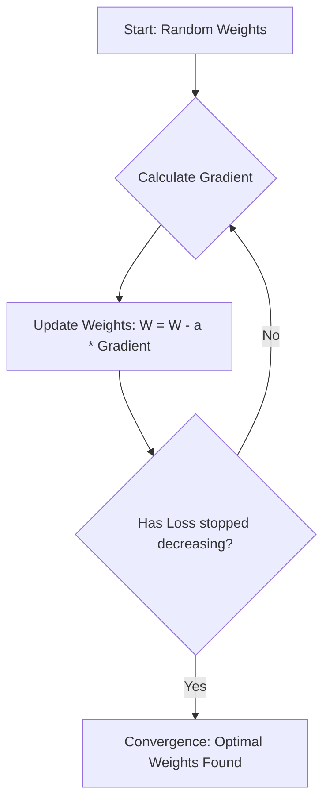
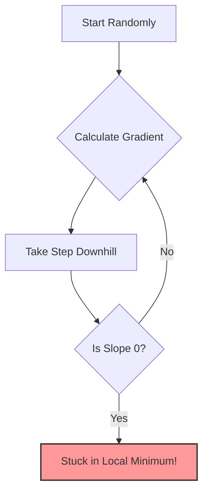
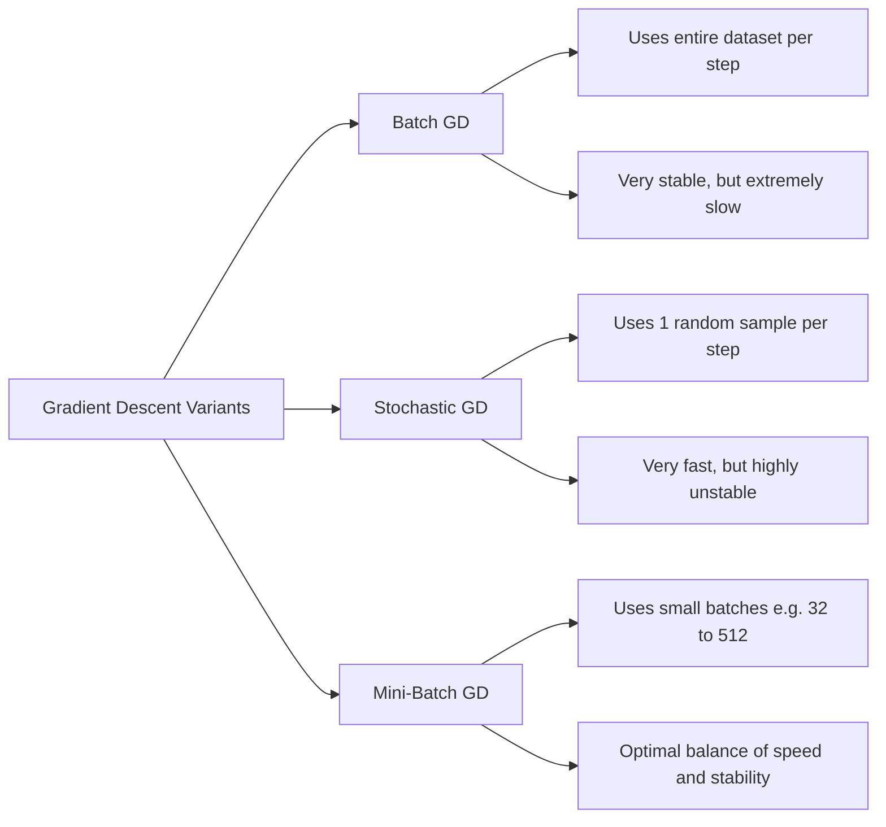

# 5. Gradient Descent Optimization

Gradient Descent (Descente de Gradient) is the absolute backbone of Deep Learning. It is an iterative optimization algorithm used to find the minimum of a differentiable function—specifically, the Loss Function (Cost Function). Every neural network, from the simplest Perceptron to the largest Transformer, relies on gradient descent (or a variant of it) to learn.

## Essential Background Knowledge

In machine learning, we want our model to make accurate predictions. To achieve this, we define a **Loss Function** $J(\theta)$, which measures how "wrong" our model is. The goal of training is to find the parameters (weights and biases) that minimize this loss function. Gradient descent is the mechanism by which we systematically search for those optimal parameters.

## The Concept of Optimization

Optimization is the process of minimizing a **differentiable and convex** function. In DL, this function is the **Loss Function** (how wrong our model is).

Imagine a blindfolded person trying to walk down to the bottom of a valley. They feel the slope of the ground under their feet and take a step in the direction where the slope goes downward the steepest. The slope is the **Gradient**, and the size of the step is the **Learning Rate**.

### The Mathematical Problem: Why We Can't Just Solve It Directly

Imagine we want to minimize a simple function $f(x) = x^2 - x + 1$.

- **Analytical Solution:** We calculate the derivative, set it to 0 ($f'(x) = 0$), and ensure the second derivative is positive ($f''(x) > 0$).
  - $f'(x) = 2x - 1 = 0 \Rightarrow x^* = 1/2$.
  - $f''(x) = 2 > 0$, so this is indeed a minimum.
  - This gives us the exact answer in one step.

- **The DL Reality:** In Deep Learning, our function has millions of parameters ($x$). An analytical solution is impossible because:
  1. Setting the gradient to zero gives us a system of millions of equations with millions of unknowns.
  2. The equations are highly non-linear (due to activation functions and nested compositions).
  3. The computation is too expensive to solve directly even if it were possible.
  
  We must use an **iterative approximation**: Gradient Descent.

## What is Gradient Descent?

### The Algorithm

1.  **Initialize** parameters randomly (e.g., $x_0$). The starting point is arbitrary — we simply begin somewhere and move toward better values.
2.  **Calculate the Gradient:** Find the derivative of the function at the current point, $f'(x_t)$. The gradient points in the direction of the steepest ascent. This tells us which direction makes the function increase the fastest.
3.  **Update Parameters:** Move in the **opposite** direction of the gradient. Since the gradient points uphill, going the opposite direction takes us downhill — toward the minimum.
4.  **Repeat** until convergence (when the gradient is zero or very close to zero). At the minimum, the slope is flat, so there's no direction to move.

**The Update Rule:**
$$ x_{t+1} = x_t - \alpha \nabla f(x_t) $$

- $x_0$: The starting point (initialized randomly).
- $x$: The parameter we are trying to optimize.
- $\alpha$ (Alpha / Learning Rate, formerly called $\eta$ 'eta'): The step size. It is a hyperparameter that modulates the size of the correction.
- $\nabla f(x_t)$: The gradient (slope/derivative) evaluated at the current point.

> [!TIP] Understanding the Learning Rate ($\alpha$)
>
> The learning rate is arguably the most important hyperparameter in deep learning. Choosing it correctly is critical:
> - **Too small:** The algorithm will take tiny steps. It will eventually find the minimum, but it will take an eternity. The convergence is agonizingly slow and may get stuck in local minima because the steps are too small to escape them.
> - **Too large:** The algorithm will take giant steps, overshooting the minimum entirely. It might bounce back and forth across the valley and even diverge (the loss increases to infinity). The loss will bounce wildly or even diverge to infinity.

**Stopping Criterion:** We stop when we reach convergence. This happens when the number of iterations reaches a fixed limit, or when the difference between successive values $|| \nabla f(x_t) ||$ or $|f(x_i) - f(x_{i+1})|$ is infinitesimally small. In practice, we often set a maximum number of epochs and monitor the loss curve for plateau behavior.

## Convexity vs. Non-Convexity

The behavior of gradient descent depends fundamentally on the shape of the loss landscape.

### Convex Functions

- **Convex Function:** Looks like a single, smooth bowl (a U-shape). It has only one global minimum. Linear regression loss (MSE) is convex.
- A function $f$ is convex on an interval $I$ if its derivative $f'$ is **strictly increasing** on $I$.
- _Reminder:_ A function itself is increasing when its derivative is positive.
- On a convex landscape, gradient descent is guaranteed to find the global minimum regardless of the starting point. It will roll straight to the bottom of the bowl.

### Non-Convex Functions

- **Non-Convex Function:** Looks like a mountain range with multiple valleys. It has **Local Minima** (a small valley) and a **Global Minimum** (the deepest valley). Neural Network loss functions are highly non-convex.
- **Concave Function:** A function $f$ is concave on an interval $I$ if its derivative $f'$ is **strictly decreasing** on $I$.

> [!WARNING] The Danger of Non-Convexity
> If you use MSE (a convex function) on a Linear model, you get a convex landscape. If you use MSE on a Logistic (Sigmoid) model, the resulting landscape is non-convex.
> 
> A non-convex function has multiple "valleys." The algorithm will follow the slope down into the _nearest_ valley (Minimum local) and stop, completely missing the true lowest point (Minimum global). In non-convex landscapes, Gradient Descent can get stuck in a **Local Minimum**—a valley that is low, but not the lowest possible valley. It converges prematurely.
> 
> This is why the choice of loss function matters so much: using MSE for classification results in a non-convex landscape with many local minima, making training nearly impossible. Using Cross-Entropy instead restores convexity.





## High-Dimensional Optimization: The Saddle Point Reality

In 1D or 2D calculus, a point where the gradient is zero is usually a minimum or a maximum. However, the course notes a critical phenomenon in Deep Learning: **"The local minima in one dimension is not shared with the other dimensions."**

Because Neural Networks have millions of dimensions (parameters):
- A point might be a local minimum in Dimension A.
- But in Dimension B, it is still a downward slope.
- This creates a **Saddle Point** (Point de selle) — a point that is a minimum in some directions but a maximum in others.

A local minimum in 1 dimension is rarely a local minimum in a 1,000-dimension space; it is usually a **Saddle Point**. This mathematical reality explains why Neural Networks actually work on highly complex problems: true, inescapable local minima are mathematically exceedingly rare in multi-million dimensional spaces. There is almost always a path downwards in _some_ dimension. This is why neural networks can actually succeed in complex problems—there is almost always a path downwards in _some_ dimension.

## Variations of Gradient Descent

Because calculating the gradient across an entire massive dataset (millions of images) is impossible due to RAM limits, we use variations of the algorithm:



### 1. Batch Gradient Descent (Standard)

Uses the _entire dataset_ for one update. It calculates the true gradient by averaging over all training examples, then takes one step.

- **Advantage:** The gradient is exact and stable. The path to the minimum is smooth and direct.
- **Disadvantage:** Extremely slow and memory-heavy. Computing the gradient over millions of images at once is impossible for GPU VRAM. One single update can take hours.

### 2. Stochastic Gradient Descent (SGD)

Uses a _single data point_ for one update. It picks one random training example, computes the gradient based on that single example, and updates immediately.

- **Advantage:** Very fast — weights are updated after every single example. The model starts learning immediately.
- **Disadvantage:** Highly chaotic and erratic. The gradient based on one example is very noisy — the loss curve will look like a seismograph reading, bouncing wildly, even though the overall trend is downward.

### 3. Mini-Batch Gradient Descent

The gold standard. Uses a small chunk of data (e.g., 32, 64, or 512 samples) for each update. It perfectly balances speed, memory usage, and stability.

| Characteristic         | Batch GD (Standard) | Stochastic GD (SGD) | Mini-batch GD                    |
| :--------------------- | :------------------ | :------------------ | :------------------------------- |
| **Data per Iteration** | All data            | A single sample     | A small group (e.g., 32 to 512)  |
| **Speed**              | Slow                | Very Fast           | Fast                             |
| **Stability**          | Very Stable         | Noisy / Chaotic     | Medium (Stable enough)           |
| **Memory (RAM) Usage** | Very High           | Low                 | Medium                           |
| **Primary Usage**      | Small datasets      | Massive datasets    | **The Industry Standard for DL** |

### The Magic of Mini-Batches

Mini-batches introduce a slight "noise" or "stochasticity" to the gradient. This noise is actually a good thing in deep learning! It acts like a slight earthquake that can shake the algorithm out of a shallow **local minimum** so it can continue rolling down into the true **global minimum**.

> [!NOTE] The 3 Hidden Benefits of Mini-Batches
>
> 1.  **Stagnation Prevention (Escape from Local Minima):** Because it uses a subset of data, it introduces _stochastic noise_. This noise causes slight oscillations that help the algorithm "jump" out of shallow local minima or saddle points. Pure Batch GD would get permanently stuck in these shallow valleys.
> 2.  **RAM Management (Memory Efficiency):** Calculating gradients on millions of images simultaneously is impossible for GPU VRAM. Mini-batches allow processing massive datasets on standard hardware by only loading a small chunk at a time. Cannot fit millions of images in RAM/GPU memory at once — mini-batches fit nicely in VRAM.
> 3.  **Update Latency (Faster Convergence):** In Batch GD, weights are updated only _once_ per epoch (after seeing all data). Mini-batches allow weights to be updated thousands of times per epoch, drastically accelerating global convergence. The model starts learning immediately rather than waiting to process the whole dataset.

## Solutions to the Learning Rate Problem

Because picking the perfect $\alpha$ is incredibly difficult, we use:

1.  **Learning Rate Schedulers:** Start with a high rate to encourage exploration and escape local minima, then gradually reduce it to fine-tune convergence. This mimics the behavior of a ball that bounces around at first but gradually settles to the bottom of the valley as it loses energy.
2.  **Adaptive Optimizers:** Instead of a fixed learning rate $\alpha$, modern Deep Learning uses algorithms like **Adam, RMSProp, or Adagrad** that automatically adjust the learning rate independently for _every single parameter_, navigating complex landscapes effortlessly. These algorithms track historical gradient information for each parameter and use it to determine appropriate step sizes — parameters with large, consistent gradients get smaller steps, while parameters with small or infrequent gradients get larger steps.

## Python Implementation of Gradient Descent (2D Example)

The slides provide a concrete mathematical example that demonstrates gradient descent in action: Minimize $f(x,y) = (x-2)^2 + 2(y-3)^2$.

This is a convex quadratic function with its minimum at the point (2, 3). Let's work through the complete implementation step by step.

**1. Calculate the Gradients (Derivatives):**

We need the partial derivatives with respect to each variable:
- $\frac{\partial f}{\partial x} = 2(x-2) = 2x - 4$
- $\frac{\partial f}{\partial y} = 2 \cdot 2(y-3) = 4y - 12$

The gradient vector combines these:
- Gradient Vector $\nabla f(X) = \begin{bmatrix} 2x - 4 \\ 4y - 12 \end{bmatrix}$

**2. The Python Code (Vectorized):**

```python
import numpy as np

# 1. Define the gradient function
def gradient(X):
    return np.array([2*X[0]-4, 4*X[1]-12])

# 2. Starting Point (x_0 = 30, y_0 = 20)
# We start far from the minimum to demonstrate convergence
X = np.array([30, 20])

# 3. Step size (Learning Rate)
# 0.05 is small enough for stable convergence
alpha = 0.05

# 4. Iterative Gradient Descent Loop
for x in range(0, 200):
    X = X - alpha * gradient(X)

print("Result:", X)
# Expected output converges exactly to [2.0, 3.0]
```

_Visual Proof:_ The contour maps provided in the slides show the algorithm taking curved, gradually shrinking steps perpendicular to the contour lines, spiraling directly into the exact center (2, 3). The path is not a straight line — it curves because the function is steeper in the y-direction (coefficient 2) than in the x-direction (coefficient 1), creating an elongated elliptical contour pattern. This is exactly why feature scaling matters in practice: unscaled features create these elongated bowls that make gradient descent inefficient.

---

## Extension to Multiple Parameters: Partial Derivatives and the Gradient Vector

In practice, machine learning models never have just one parameter. Consider minimizing a function $f(w, b)$ with two parameters (e.g., weight and bias). We cannot use a simple derivative; we must use **Partial Derivatives**.

- The partial derivative with respect to $w$, denoted $\frac{\partial f}{\partial w}$, measures the steepness in the $w$-direction (keeping $b$ constant). It tells us how much the function changes when we nudge $w$ slightly while holding $b$ fixed.
- The partial derivative with respect to $b$, denoted $\frac{\partial f}{\partial b}$, measures the steepness in the $b$-direction (keeping $w$ constant). It tells us how much the function changes when we nudge $b$ slightly while holding $w$ fixed.

The **Gradient** $\nabla f$ is the vector of these partial derivatives: $\nabla f = \left[ \frac{\partial f}{\partial w}, \frac{\partial f}{\partial b} \right]^T$. The gradient always points in the direction of steepest ascent. By moving in the opposite direction, we descend toward the minimum.

The update rules become:
$$w_{i+1} = w_i - \alpha \cdot \frac{\partial f}{\partial w}$$
$$b_{i+1} = b_i - \alpha \cdot \frac{\partial f}{\partial b}$$

**Why subtract?** 
1. If $f'(x_i) > 0$, the function is increasing at $x_i$. To find the minimum, we must move left (decrease $x$). 
2. Subtracting a positive number decreases $x$. 
3. If $f'(x_i) < 0$, the function is decreasing. We must move right (increase $x$).
4. Subtracting a negative number increases $x$.
5. This elegant mathematical rule ensures we always move downhill regardless of which side of the minimum we are on.

### Detailed Stopping Criteria

How does the algorithm know when to stop? We do not run it forever. We stop when one of the following conditions is met:

1. **The gradient is near zero:** $|f'(x_i)| < \epsilon$ where $\epsilon$ is a small threshold (e.g., $10^{-6}$). At the bottom of the valley, the slope is flat, so the gradient is essentially zero. This means we have reached a stationary point — either a minimum, maximum, or saddle point.
2. **The step size is infinitesimal:** $|f(x_i) - f(x_{i+1})| < \epsilon$. If moving further does not significantly change the loss, the algorithm has converged and further iterations would be wasted computation.
3. **Maximum iterations reached:** A practical safeguard. We set a maximum number of iterations (e.g., 10,000) to prevent infinite loops, even if convergence has not been achieved.

The choice of $\epsilon$ matters: too large and we stop prematurely (before reaching the minimum), too small and we waste computation on negligible improvements.

## The Shift in Notation: Alpha ($\alpha$) to Eta ($\eta$)

In classical optimization, the step size is denoted $\alpha$ (alpha). In the context of Neural Networks and Deep Learning, this parameter is referred to as the **Learning Rate** and is denoted by $\eta$ (eta). It is the most critical **hyperparameter** in Deep Learning. This shift in notation reflects the conceptual difference: in optimization, $\alpha$ is simply a step size, but in deep learning, $\eta$ controls the entire dynamics of learning — too fast and the model becomes unstable, too slow and it never converges.

## The Deep Mechanics of Mini-Batch Gradient Descent

When training neural networks on millions of images, standard Batch Gradient Descent (using the entire dataset) is impossible. Mini-Batch GD (using subsets of 32 to 512 samples) is the default. Here is the exhaustive breakdown of the deep mechanics behind why mini-batch gradient descent works so well:

### 1. Escaping Local Minima via Stochastic Noise

Batch GD calculates the exact, true gradient of the entire dataset. The path is smooth and deterministic. If it enters a shallow local minimum, the gradient is exactly zero, and it gets stuck forever — there is no force to push it out.

Mini-Batch GD calculates an *approximation* of the true gradient using only a small subset of data. This introduces **stochastic noise** (variance) into the gradient estimate. The trajectory is bumpy and irregular. This bumpiness is a feature, not a bug: the oscillations allow the algorithm to "jump" over the walls of shallow local minima or escape saddle points, continuing the search for the global minimum. The noise acts as an implicit regularizer that prevents the algorithm from settling into suboptimal solutions.

### 2. RAM and VRAM Constraints

To compute the gradient over 1 million images, the computation graph and activations for all 1 million images must be held in memory simultaneously. This vastly exceeds the RAM of any CPU or the VRAM of any GPU. Even with 128GB of RAM, the memory requirements for large models and datasets can be prohibitive.

Mini-batches (e.g., 64 images) easily fit into GPU VRAM, allowing for massive parallelization via matrix multiplication. A single GPU with 24GB of VRAM can comfortably process a batch of 64 images through a ResNet-50 model. This is why mini-batches are not just a theoretical optimization — they are a practical necessity imposed by hardware constraints.

### 3. Latency and Update Frequency

In Batch GD, you must process all 1,000,000 samples before making a *single* update to the weights. That is a long wait before the model learns anything. If each epoch takes 1 hour, the model only gets one weight update per hour.

In Mini-Batch GD with batch size 64, the model updates its weights after every 64 samples. It makes roughly 15,625 updates in the same time Batch GD makes 1. Learning begins instantly, leading to much faster empirical convergence. The model starts improving from the very first mini-batch rather than waiting to see the entire dataset.

## The Critical Batch Size Trade-off

The choice of batch size has profound implications for both training speed and model quality:

- **Small Batch Sizes (e.g., 16-32):** More noise, better generalization (prevents overfitting), excellent at escaping local minima. The stochastic noise acts as an implicit regularizer, preventing the model from converging to sharp minima that don't generalize well to unseen data. However, they cannot fully utilize GPU parallel architecture, making the computation per epoch slower because the GPU is often idle waiting for the next batch.

- **Large Batch Sizes (e.g., 512-2048):** Less noise, very stable gradient estimates, highly efficient GPU utilization (faster computation per epoch). However, they tend to converge to "sharp" minima that generalize poorly to unseen test data, and they are more likely to get stuck in local minima because the gradient estimates are too smooth to escape them. The stable gradient means less exploration of the loss landscape.

> [!WARNING] Student Pitfall: Bigger Batch Size ≠ Better Model
> Students often think a larger batch size is always better because it uses the GPU fully and reduces epoch time. While epoch time decreases, the model often converges to a worse minimum that generalizes poorly. The "noise" of small batches acts as an implicit regularizer that helps the model find flatter, more robust minima. In practice, batch sizes of 32-128 tend to produce the best generalization performance, even though larger batches are computationally faster per epoch.
