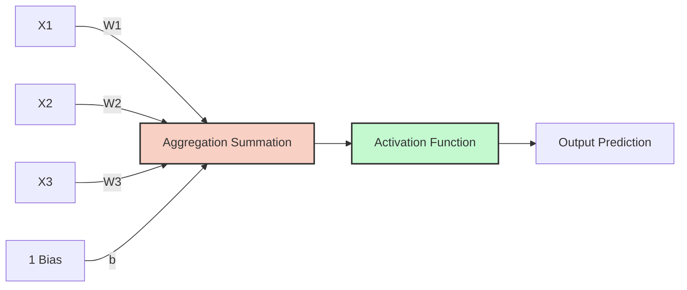

# 9. The Perceptron and the Chain Rule

The Perceptron is the most simplistic Neural Network: a single layer with a single neuron. It forms the foundational building block of Deep Learning. It separates linearly separable data. Understanding the Perceptron in depth is non-negotiable — every deep neural network, no matter how complex, is ultimately a stack of Perceptron-like units connected together.

## Architecture of the Perceptron

The perceptron is a mathematical model inspired by a biological neuron. It takes multiple inputs, multiplies them by weights, adds a bias, and passes the result through an activation function to get a prediction. The biological analogy is powerful: just as a biological neuron receives signals through dendrites, processes them in the cell body, and fires an output through the axon, the artificial perceptron receives inputs, computes a weighted sum, and produces an output through an activation function.



```mermaid
flowchart LR
    X1((X1)) -- w1 --> Sum((Z = Wx + b))
    X2((X2)) -- w2 --> Sum
    X3((X3)) -- w3 --> Sum
    Bias((Bias b)) --> Sum
    Sum --> Act[Activation Function f(z)]
    Act --> Out((Output y))
```

### The Two Steps of a Neuron

**1. Aggregation (Linear Step):**

The neuron receives multiple inputs $x_j$ (features). Each connection has a weight $w_j$ representing its importance. The neuron calculates the weighted sum, plus a bias $b$. This equation defines a linear decision boundary.

$$ z = \sum_{j=1}^{m} w_j x_j + b = W^T X + b $$

- $x$: Inputs (features). These are the raw data values fed into the neuron.
- $w$: Weights (importance of each feature). These are the learnable parameters that determine how much each input influences the output. A large positive weight means the corresponding input strongly pushes the output toward class 1; a large negative weight pushes toward class 0.
- $b$: Bias (shifts the activation threshold, allows the boundary to shift away from the origin). Without the bias, the decision boundary would always pass through the origin, severely limiting what the model can represent.

**2. Activation (Non-Linear Step):**

The raw sum $z$ is just a number. We need to convert this into a classification decision. The activation function $a(z)$ applies a threshold. The aggregated sum $z$ is passed through an activation function $f()$ to produce the final output $a$.

$$ a = f(z) $$

For the basic Perceptron, this is a Step Function (e.g., if $z \ge 0$, output 1; if $z < 0$, output 0). In modern neural networks, we use smoother activation functions (Sigmoid, ReLU, etc.) that are differentiable, enabling gradient-based training.

## The Crucial Role of Non-Linearity

Without activation functions, stacking 100 hidden layers is mathematically identical to having 1 hidden layer. The network would only be capable of linear transformations. If we only used linear aggregation ($Wx + b$) and stacked 100 layers on top of each other, mathematically, it would collapse down to a single linear equation. The network could only ever learn straight lines.

**Proof:** If each layer performs a linear transformation $z = Wx + b$, then composing two layers gives $z_2 = W_2(W_1 x + b_1) + b_2 = (W_2 W_1)x + (W_2 b_1 + b_2)$. This is still a linear transformation — it can be rewritten as $z = W'x + b'$ where $W' = W_2 W_1$ and $b' = W_2 b_1 + b_2$. No matter how many linear layers you stack, the result is always equivalent to a single linear layer. The network could only ever learn straight-line decision boundaries.

**Activation functions introduce Non-Linearity.** Non-linear activation functions multiply the geometric complexity of the model, allowing it to warp a flat plane into a highly complex sculpted surface capable of separating intricate data patterns. This allows the neural network to warp, bend, and sculpt decision boundaries into incredibly complex shapes, enabling it to learn anything (images, languages, audio). The Universal Approximation Theorem states that a neural network with a single hidden layer and a non-linear activation function can approximate any continuous function to arbitrary precision — but only if the activation function is non-linear.

---

## The Chain Rule: Mathematical Derivation of the Perceptron

This is the most critical mathematical concept in the course. To train a Perceptron using Gradient Descent, we must find the derivative of the Loss function ($\mathcal{L}$) with respect to the weights ($W$). Because the Loss function relies on the Activation ($a$), and the Activation relies on the Summation ($z$), we must use the **Chain Rule of Calculus** to decompose this derivative into manageable pieces.

Understanding this derivation is essential because the exact same chain rule mechanism is what powers backpropagation through deep neural networks with hundreds of layers. If you understand this single-neuron case, you understand the core mechanism of all deep learning.

### 1. The Core Equations

The Perceptron computes its output through three sequential steps, each depending on the previous:

1.  **Aggregation:** $z = W X + b$ — the weighted sum of inputs.
2.  **Activation (Sigmoid):** $a = \frac{1}{1 + e^{-z}}$ — the non-linear transformation.
3.  **Loss (Log Loss):** $\mathcal{L} = -\frac{1}{n} \sum [y \log(a) + (1 - y) \log(1 - a)]$ — the error measurement.

### 2. Applying the Chain Rule

To find how much a change in a weight ($w_1$) affects the final loss ($\mathcal{L}$), we multiply the partial derivatives backward through the network. This is the chain rule: the derivative of a composition of functions equals the product of the derivatives of each function.

$$ \frac{\partial \mathcal{L}}{\partial w_1} = \frac{\partial \mathcal{L}}{\partial a} \times \frac{\partial a}{\partial z} \times \frac{\partial z}{\partial w_1} $$

Let's break down the three parts in detail:

**Part A: Derivative of Loss with respect to Activation**

We need to differentiate $\mathcal{L} = -[y \log(a) + (1 - y) \log(1 - a)]$ with respect to $a$:

$$ \frac{\partial \mathcal{L}}{\partial a} = -\frac{y}{a} + \frac{1 - y}{1 - a} = \frac{-(y)(1-a) + (1-y)(a)}{a(1-a)} = \frac{-y + ya + a - ya}{a(1-a)} = \frac{a - y}{a(1 - a)} $$

This result makes intuitive sense: the gradient of the loss with respect to the activation is proportional to the error $(a - y)$ — how far the prediction is from the truth. The denominator $a(1-a)$ is a scaling factor that adjusts the gradient based on the confidence of the prediction.

**Part B: Derivative of Activation (Sigmoid) with respect to Z**

The derivative of the Sigmoid function has a beautiful, well-known property:

$$ \frac{\partial a}{\partial z} = a(1 - a) $$

This can be derived by differentiating $a = \frac{1}{1+e^{-z}}$:
- $\frac{da}{dz} = \frac{e^{-z}}{(1+e^{-z})^2} = \frac{1}{1+e^{-z}} \cdot \frac{e^{-z}}{1+e^{-z}} = a \cdot (1-a)$

This elegant result means the sigmoid derivative can be computed directly from the sigmoid output itself — no need to recalculate the exponential.

**Part C: Derivative of Z with respect to Weight**

Since $z = w_1 x_1 + w_2 x_2 + b$, the derivative with respect to $w_1$ simply leaves the constant attached to it:

$$ \frac{\partial z}{\partial w_1} = x_1 $$

This is the most straightforward part: increasing $w_1$ by a small amount increases $z$ by $x_1$ times that amount.

### 3. The Magical Cancellation

Now, we multiply the three parts together:

$$ \frac{\partial \mathcal{L}}{\partial w_1} = \left[ \frac{a - y}{a(1 - a)} \right] \times \left[ a(1 - a) \right] \times [x_1] $$

Notice how the complex denominator $a(1-a)$ perfectly cancels out the sigmoid derivative $a(1-a)$! This is not a coincidence — it's the reason why cross-entropy loss is paired with sigmoid activation. The two are mathematically designed to simplify each other.

We are left with the final, elegant gradient formula for a single weight:

$$ \frac{\partial \mathcal{L}}{\partial w_1} = (a - y)x_1 $$

This is remarkably simple: the gradient for a weight is just the prediction error $(a - y)$ multiplied by the corresponding input $x_1$. When summed over all $n$ samples in the dataset:

$$ \frac{\partial \mathcal{L}}{\partial w_1} = \frac{1}{n} \sum_{i=1}^{n} (a_i - y_i)x_{i1} $$

### 4. The Ultimate Vectorized Jacobian Form

Writing out loops to calculate this for every weight is inefficient. The course provides the ultimate vectorized form of this system using the **Jacobian** matrix ($\nabla \mathcal{L}$).

Let $A$ be the vector of all predictions, $Y$ be the true labels, and $X$ be the matrix of inputs.

$$ \nabla \mathcal{L} = \frac{1}{n} X^T \cdot (A - Y) $$
$$ W_{new} = W_{old} - \alpha \cdot \nabla \mathcal{L} $$

This single matrix operation computes the gradient for **all** weights simultaneously — no loops required. This is the computational foundation that makes neural network training feasible on modern hardware.

> [!TIP] Why this matters
> This mathematical proof demonstrates exactly why neural networks are computationally feasible. Despite the complexity of logarithms and exponentials in the loss and activation functions, the final gradient calculation boils down to a simple subtraction ($A-Y$) and a matrix multiplication ($X^T$). Without this cancellation, training deep networks would require computing and propagating enormously complex expressions through millions of parameters — an intractable problem. The chain rule + cross-entropy + sigmoid combination ensures that gradient computation remains simple and efficient regardless of network depth.

---

## Gradient Descent on the Perceptron: Specific Update Rules

Having derived the gradient using the chain rule, we can now write the explicit update rules for training the Perceptron. If using the Log Loss (BCE) and Sigmoid activation, the partial derivatives simplify to:

$$ \frac{\partial \text{Loss}}{\partial w_j} = (\hat{y} - y) x_j $$
$$ \frac{\partial \text{Loss}}{\partial b} = (\hat{y} - y) $$

The derivative with respect to the bias $b$ is just the error $(\hat{y} - y)$ without the input multiplier, because $\frac{\partial z}{\partial b} = 1$ (the bias has a constant coefficient of 1 in the aggregation step).

The update rules at iteration $h$ are:
$$ w_j^{(h+1)} = w_j^{(h)} - \alpha (\hat{y} - y) x_j $$
$$ b^{(h+1)} = b^{(h)} - \alpha (\hat{y} - y) $$

**Intuitive interpretation:**
- If $\hat{y} = y$ (the prediction is correct), the error is 0, and the weights are not updated. The neuron has already learned the correct response for this input.
- If $\hat{y} > y$ (the prediction is too high), the error is positive, and the weights are decreased. This pulls the prediction down toward the correct value.
- If $\hat{y} < y$ (the prediction is too low), the error is negative, and subtracting a negative number increases the weights. This pushes the prediction up toward the correct value.
- The magnitude of the update is proportional to the input $x_j$: features with larger values cause larger weight adjustments, which is appropriate because they have more influence on the output.

> [!TIP] Why is the derivative so simple?
> The mathematical beauty of combining the Sigmoid activation with the Log Loss derivative cancels out all complex terms, leaving just the error term $(\hat{y} - y)$. The sigmoid derivative $a(1-a)$ perfectly cancels the denominator from the log loss derivative $\frac{a-y}{a(1-a)}$. This is why Cross-Entropy is the natural pairing for Sigmoid outputs — they are mathematically designed to simplify each other. Without this cancellation, the gradient would involve complex logarithmic and exponential terms that would make training significantly more computationally expensive.

## Vectorization of the Aggregation Step: From Loops to Matrix Operations

In Python, calculating $z = \sum_{j=1}^{m} w_j x_j + b$ with a `for` loop over $m$ features is computationally tragic. A Python `for` loop executes roughly 100 times slower than the equivalent C code because of Python's dynamic typing and interpretation overhead. In deep learning, where we must compute millions of such operations per training step, this performance difference is the difference between training in minutes versus training in days.

We use **Vectorization** via NumPy (which runs in optimized C/Fortran code under the hood). We define $W$ as a column vector of shape $(m, 1)$ and $X$ as a column vector of shape $(m, 1)$:

$$ z = W^T X + b $$

Where $W^T X$ is the dot product (a single matrix operation that replaces $m$ multiplications and $m-1$ additions). For a batch of $n$ samples, $X$ becomes a matrix of shape $(n, m)$, and:

$$ Z = XW + b $$

computes all $n$ aggregations simultaneously in microseconds. This is the fundamental operation that makes deep learning computationally feasible — instead of processing one sample at a time through a Python loop, we process an entire batch at once through a single optimized matrix multiplication.

**Performance comparison (approximate):**
- Python `for` loop over 1 million samples: ~10 seconds
- Vectorized NumPy operation: ~0.01 seconds (1,000x faster)
- GPU-accelerated operation (PyTorch on CUDA): ~0.0001 seconds (100,000x faster)

This is why vectorization is not optional in deep learning — it is the difference between a model that trains in hours and one that would take years.
