# 1. Foundations and Core Architecture of Convolutional Neural Networks

This note establishes the mathematical, biological, and structural foundations of Convolutional Neural Networks (CNNs). It explores the evolution of neural networks from biological visual systems, explains why traditional Multi-Layer Perceptrons (MLPs) fail when applied to grid-structured spatial data like images, and details the modular, two-part architecture of modern CNNs.

---

## 1.1. What Are Neural Networks? A Complete Foundation

Before exploring convolutional architectures, we must first build a rigorous, first-principles understanding of what neural networks are. At its core, a neural network is a parameterized, non-linear function approximator. Given an input vector $\mathbf{x} \in \mathbb{R}^{d_{in}}$ and a target output $\mathbf{y}$, a neural network defines a mapping:

$$\hat{\mathbf{y}} = F(\mathbf{x}; \Theta)$$

where $\Theta$ represents the complete set of learnable parameters (weights and biases) of the network. The objective of training a neural network is to optimize these parameters $\Theta$ so that the predicted output $\hat{\mathbf{y}}$ matches the true target $\mathbf{y}$ as closely as possible across a dataset, according to a specific loss function.

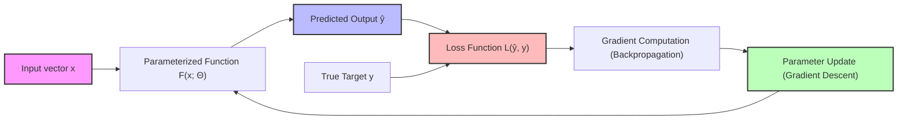

### 1.1.1. The Artificial Neuron: The Atomic Unit

The fundamental computational unit of a neural network is the artificial neuron. An artificial neuron maps an input vector $\mathbf{x} = [x_1, x_2, \dots, x_n]^\top$ to a scalar output $y$. This process consists of two successive mathematical operations:

1. **Affine Transformation**: The neuron computes a weighted sum of its inputs and adds a scalar bias term $b$. This is expressed mathematically as:
   
   $$z = \sum_{i=1}^{n} w_i x_i + b = \mathbf{w}^\top \mathbf{x} + b$$
   
   where $\mathbf{w} = [w_1, w_2, \dots, w_n]^\top \in \mathbb{R}^n$ is the weight vector.

2. **Non-linear Activation**: The scalar pre-activation value $z$ is passed through a non-linear activation function $f(\cdot)$ to yield the final activation (output) $y$:
   
   $$y = f(z) = f(\mathbf{w}^\top \mathbf{x} + b)$$

#### Role of the Parameters

* **Weights ($\mathbf{w}$)**: These represent the connection strengths of the inputs. Each weight $w_i$ determines the sensitivity of the pre-activation $z$ to changes in the corresponding input $x_i$. A positive weight excites the neuron; a negative weight inhibits it. The magnitude $|w_i|$ determines the relative importance of feature $x_i$.
* **Bias ($b$)**: The bias represents the neuron's activation threshold. It shifts the activation function along the input axis. Without a bias term, the decision boundary of the neuron would be constrained to pass through the origin of the input space. For example, if $\mathbf{x} = \mathbf{0}$, then $z$ would always equal $0$, forcing the output to be $f(0)$, regardless of the weights. The bias resolves this constraint, allowing the decision boundary to shift freely:
  
  $$\mathbf{w}^\top \mathbf{x} + b = 0 \implies \mathbf{w}^\top \mathbf{x} = -b$$

* **Activation Function ($f$)**: The activation function maps the real-valued pre-activation $z$ to a bounded or structured range. Crucially, $f$ must be non-linear. Popular choices include:
  * **Rectified Linear Unit (ReLU)**: $f(z) = \max(0, z)$. It is computationally efficient, introduces sparsity (outputs exact zeros for negative inputs), and helps mitigate the vanishing gradient problem.
  * **Sigmoid**: $f(z) = \frac{1}{1 + e^{-z}}$. It maps the input to the interval $(0, 1)$, which is useful for modeling probabilities.
  * **Hyperbolic Tangent (Tanh)**: $f(z) = \tanh(z) = \frac{e^z - e^{-z}}{e^z + e^{-z}}$. It maps the input to $(-1, 1)$ and is zero-centered, which often aids optimization.

```python
# A single artificial neuron implemented from scratch
import numpy as np

# Define inputs, weights, and bias
inputs = np.array([0.5, -0.3, 0.8])   # Input feature vector (x1, x2, x3)
weights = np.array([0.4, 0.7, -0.2])  # Weight vector (w1, w2, w3)
bias = 0.1                             # Scalar bias (b)

# Step 1: Compute the weighted sum (affine transformation)
# z = w1*x1 + w2*x2 + w3*x3 + b
weighted_sum = np.dot(weights, inputs) 
z = weighted_sum + bias

print(f"Pre-activation z: {z:.4f}")
# Calculation: (0.4 * 0.5) + (0.7 * -0.3) + (-0.2 * 0.8) + 0.1
#              = 0.20 - 0.21 - 0.16 + 0.1 = -0.07

# Step 2: Apply the activation function (ReLU: max(0, z))
output = np.maximum(0, z)
print(f"Activated output y: {output:.4f}")  # Outputs 0.0000 because z < 0
```

### 1.1.2. Layers: Organizing Neurons into Groups

To build deep architectures, artificial neurons are grouped into functional structures called **layers**. The outputs of one layer serve as the inputs to the next.

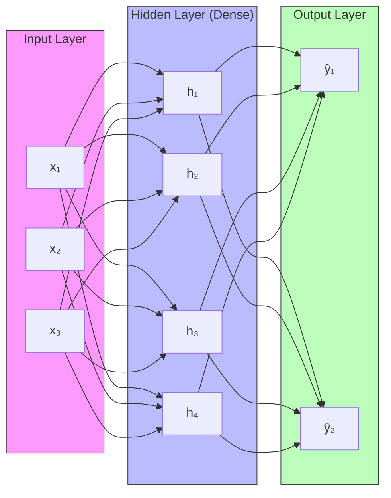

1. **Input Layer**: This layer does not perform any computation. It simply passes the raw features of the input sample $\mathbf{x}$ to the first hidden layer.
2. **Hidden Layers**: These intermediate layers extract representations of the data. They are called "hidden" because their outputs are internal states not directly observed in the training targets. In a **fully connected (dense) layer**, every neuron receives inputs from all neurons in the preceding layer.
3. **Output Layer**: This final layer produces the network's predictions $\hat{\mathbf{y}}$, shaped according to the target task (e.g., a single continuous scalar for regression, a probability distribution for classification).

### 1.1.3. The Forward Pass

The forward pass is the sequence of matrix-vector calculations that propagates an input vector $\mathbf{x}$ through the network's sequential layers to compute the prediction $\hat{\mathbf{y}}$.

For a neural network with $L$ hidden layers, we define:
* $\mathbf{a}^{(0)} = \mathbf{x}$ as the input vector.
* $\mathbf{W}^{(l)}$ as the weight matrix for layer $l \in \{1, 2, \dots, L\}$. If layer $l-1$ has $n_{l-1}$ units and layer $l$ has $n_l$ units, then $\mathbf{W}^{(l)} \in \mathbb{R}^{n_l \times n_{l-1}}$.
* $\mathbf{b}^{(l)} \in \mathbb{R}^{n_l}$ as the bias vector for layer $l$.
* $f^{(l)}(\cdot)$ as the element-wise activation function applied at layer $l$.

The feedforward equations for layer $l$ are:

$$\mathbf{z}^{(l)} = \mathbf{W}^{(l)} \mathbf{a}^{(l-1)} + \mathbf{b}^{(l)}$$

$$\mathbf{a}^{(l)} = f^{(l)}\left(\mathbf{z}^{(l)}\right)$$

The final network output is $\hat{\mathbf{y}} = \mathbf{a}^{(L)}$.

### 1.1.4. Learning via Backpropagation

To update the parameters of the network, we must define a scalar loss function $\mathcal{L}(\hat{\mathbf{y}}, \mathbf{y})$ that measures the discrepancy between the network's prediction $\hat{\mathbf{y}}$ and the true target $\mathbf{y}$. Optimization is performed using gradient descent, which iteratively updates every parameter $\theta \in \Theta$ in the direction of steepest descent of the loss:

$$\theta \leftarrow \theta - \eta \frac{\partial \mathcal{L}}{\partial \theta}$$

where $\eta > 0$ is the learning rate.

The systematic computation of these partial derivatives $\frac{\partial \mathcal{L}}{\partial \theta}$ is achieved via **backpropagation**. Backpropagation is an application of the multivariate calculus **chain rule**. It operates in reverse, starting from the output loss and computing gradients of the loss with respect to intermediate activations and parameters from the final layer back to the input layer.

For a parameter $w_{ji}^{(l)}$ connecting neuron $i$ in layer $l-1$ to neuron $j$ in layer $l$, the gradient is computed as:

$$\frac{\partial \mathcal{L}}{\partial w_{ji}^{(l)}} = \frac{\partial \mathcal{L}}{\partial z_j^{(l)}} \cdot \frac{\partial z_j^{(l)}}{\partial w_{ji}^{(l)}} = \delta_j^{(l)} a_i^{(l-1)}$$

where the error term $\delta_j^{(l)} = \frac{\partial \mathcal{L}}{\partial z_j^{(l)}}$ is propagated backward from layer $l+1$:

$$\delta_j^{(l)} = \left( \sum_{k=1}^{n_{l+1}} \delta_k^{(l+1)} w_{kj}^{(l+1)} \right) \cdot f'^{(l)}\left(z_j^{(l)}\right)$$

This recursive formulation avoids redundant calculations, making backpropagation computationally efficient.

---

## 1.2. Structured Grid Data and the Nature of Images

The structural architecture of a neural network should ideally reflect the spatial or temporal properties of the input data it processes.

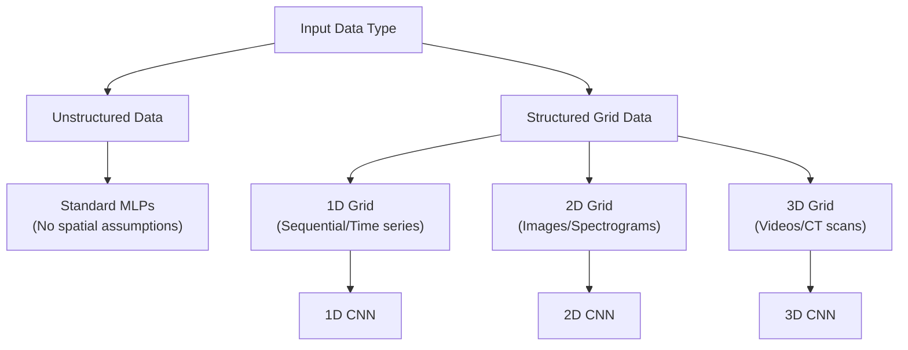

### 1.2.1. Spatial Structure and the Locality Principle

**Structured grid data** refers to multi-dimensional arrays where the relative positions of elements carry structural meaning. In a standard tabular dataset (e.g., housing features such as price, area, and bedrooms), columns can be shuffled without losing information, provided the column labels are updated. However, in grid data, the absolute and relative coordinates of elements are critical.

This data is governed by the **locality principle**: nearby elements are highly correlated and contain local patterns, whereas distant elements are less directly related. 

### 1.2.2. Images as Multi-Dimensional Grids

A digital image is a primary example of structured grid data. Mathematically, a color image is represented as a 3D tensor of shape $H \times W \times C$:
* **Height ($H$)**: The number of pixel rows along the vertical axis.
* **Width ($W$)**: The number of pixel columns along the horizontal axis.
* **Channels ($C$)**: The spectral bands. For a standard color image, $C = 3$, representing the Red, Green, and Blue (RGB) color spaces.

A grayscale image has $C = 1$. Each element in this tensor is a numerical value (typically scaled to $[0, 1]$ or $[-1, 1]$) representing the light intensity at that specific spatial coordinate. 

The locality principle holds strongly for natural images: a single pixel contains little semantic meaning on its own, but a localized neighborhood of pixels defines edges, textures, contours, and eventually objects.

---

## 1.3. Historical Context: Biological Origins of Spatial Processing

The architectural design of Convolutional Neural Networks was inspired by neuroscience, specifically research on the mammalian visual cortex.

### 1.3.1. The Hubel & Wiesel Experiment (1959)

In 1959, David Hubel and Torsten Wiesel performed experiments recording the electrical activity of individual neurons in the primary visual cortex (area V1) of anesthetized cats. They projected various light patterns onto a screen and observed how neurons in V1 responded.

They made several key discoveries:
* **Selective Orientation**: Cortical neurons did not respond to uniform illumination or random spots of light. Instead, they fired rapidly when presented with straight line segments (edges) at specific orientations (e.g., a vertical bar or a bar tilted at exactly 45 degrees).
* **Localized Receptive Fields**: Each neuron responded only to visual stimuli presented within a restricted subregion of the entire visual field. This subregion is called the neuron's **receptive field**.

### 1.3.2. Simple Cells vs. Complex Cells

Hubel and Wiesel classified V1 neurons into two main functional classes:

* **Simple Cells**:
  * These cells have distinct, spatially separated excitatory and inhibitory zones within their receptive field.
  * They fire maximally only when an edge of a specific orientation is presented at a precise position within their receptive field.
  * Shifting the bar slightly out of this position causes the firing rate to drop to zero.
  * **Mathematical Analogy**: A simple cell acts like a static, localized template matcher or filter (similar to a convolutional kernel).

* **Complex Cells**:
  * These cells also respond selectively to oriented edges, but they are less sensitive to the exact position of the edge within their receptive field.
  * A complex cell fires continuously as long as the preferred oriented edge is present anywhere within its receptive field, even if the edge is moving.
  * This property provides local **translation tolerance** (invariance to small shifts in position).
  * **Mathematical Analogy**: A complex cell behaves like a max-pooling operation over a set of spatially shifted simple-cell outputs.

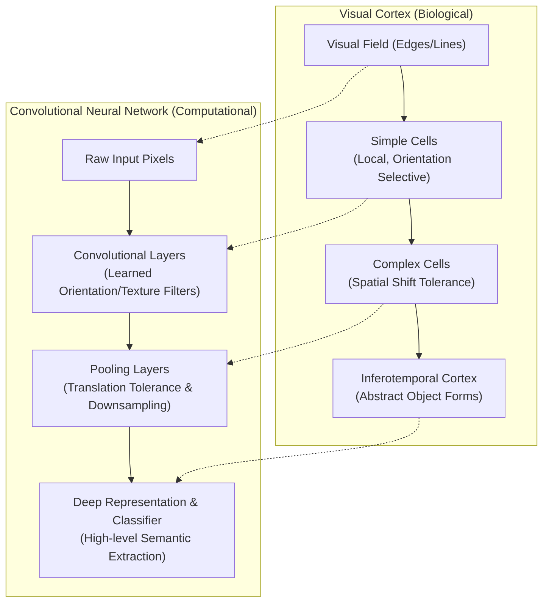

### 1.3.3. Receptive Fields and Hierarchical Processing

Hubel and Wiesel proposed that the visual system is organized as a feedforward processing hierarchy:
1. Retinal photoreceptors capture raw light intensity (pixels).
2. Neurons in the Lateral Geniculate Nucleus (LGN) form simple center-surround receptive fields.
3. Multiple LGN cells converge onto a single **simple cell** in V1 to construct sensitivity to oriented lines.
4. Multiple simple cells converge onto a single **complex cell** to build translation tolerance.
5. This hierarchy continues into higher visual areas (V2, V4, and the inferotemporal cortex), where receptive fields grow larger, and neurons respond to increasingly complex shapes (textures, hands, faces).

---

## 1.4. The Failure of Multi-Layer Perceptrons (MLPs) for Images

Before the widespread adoption of CNNs, researchers attempted to process digital images using standard Multi-Layer Perceptrons. This approach has three primary limitations when scaling to natural image sizes.

### 1.4.1. The Spatial Hierarchy Problem

An MLP expects a flat 1D vector as input. To pass an image of shape $H \times W \times C$ to an MLP, the 3D tensor must be flattened into a 1D vector of length $D = H \cdot W \cdot C$. This transformation discards the spatial coordinates of the pixels. 

Once flattened, the physical distance between pixels is no longer preserved in the coordinate space. For example, in a 28x28 grayscale image, pixel $(0, 27)$ (the top-right corner) and pixel $(1, 0)$ (the start of the second row) are spatially adjacent in the 2D grid, but in the flattened 1D vector, they are separated by multiple indices. The MLP is forced to learn these 2D spatial relationships from scratch, which is highly inefficient.

### 1.4.2. The Local Correlation Problem

In an MLP, every input feature is connected to every neuron in the hidden layer. This is called **global connectivity**. This structure treats all input variables as equally related, regardless of their original spatial distance. 

For image classification, this means a neuron in the first hidden layer computes a weighted sum over the entire image, pairing a pixel in the top-left corner with a pixel in the bottom-right corner. This ignores the locality principle, which states that visual features are local. By ignoring this spatial prior, MLPs must use substantial capacity to suppress irrelevant, long-range correlations.

### 1.4.3. The Parameter Explosion Problem

To illustrate this mathematically, consider a standard input image size used in modern vision models: $224 \times 224$ pixels with $3$ color channels (RGB).

$$\text{Input Dimension } D = 224 \times 224 \times 3 = 150{,}528 \text{ features}$$

Suppose we construct a single fully connected hidden layer with $1{,}000$ hidden units (neurons). The weight matrix $\mathbf{W}^{(1)}$ for this single layer has dimensions:

$$\mathbf{W}^{(1)} \in \mathbb{R}^{1{,}000 \times 150{,}528}$$

The number of learnable weight parameters in just this first layer is:

$$\text{Parameters} = 150{,}528 \times 1{,}000 = 150{,}528{,}000 \quad (150.5 \text{ Million Weights})$$

If we add the bias vector $\mathbf{b}^{(1)} \in \mathbb{R}^{1{,}000}$, the total is $150{,}529{,}000$ parameters.

#### Consequences of the Parameter Explosion

1. **Memory Footprint**: Storing $150.5$ million weights using standard 32-bit floating-point precision (single precision, 4 bytes per parameter) requires:
   
   $$\text{Memory} = 150{,}528{,}000 \times 4 \text{ bytes} \approx 602.11 \text{ Megabytes (MB)}$$
   
   This is for a single layer. A deep MLP with multiple such layers would quickly exceed the memory capacity of standard hardware.

2. **Computational Latency**: Every forward pass requires computing $150.5$ million floating-point multiplications and additions (FLOPs). Backpropagation requires computing and storing an equivalent number of gradients, which slows training.

3. **Overfitting**: The capacity of a model is directly proportional to its number of free parameters. With $150$ million parameters and limited training data, an MLP can easily memorize the noise and specific configurations of the training set rather than learning generalizable features.

#### Contrast: MLP vs. Convolutional Layer

Consider a convolutional layer operating on the same $224 \times 224 \times 3$ input. Suppose the layer uses $64$ filters, each of spatial size $3 \times 3$. Because each filter must span all input channels, the actual shape of each filter kernel is $3 \times 3 \times 3$.

The total parameters for this convolutional layer are calculated as:

$$\text{Parameters} = \left( \text{Kernel Height} \times \text{Kernel Width} \times \text{Input Channels} + 1 \text{ Bias} \right) \times \text{Number of Filters}$$

$$\text{Parameters} = \left( 3 \times 3 \times 3 + 1 \right) \times 64 = (27 + 1) \times 64 = 1{,}792 \text{ parameters}$$

| Property | Multi-Layer Perceptron (Dense Layer) | Convolutional Layer | Ratio / Reduction |
| :--- | :--- | :--- | :--- |
| **Input Shape** | Flattened vector ($150{,}528$) | 3D Tensor ($224 \times 224 \times 3$) | N/A |
| **Layer Units** | $1{,}000$ hidden neurons | $64$ filter channels | N/A |
| **Parameters** | **$150{,}529{,}000$** | **$1{,}792$** | **$\approx 83{,}999 \times$ fewer parameters** |
| **Memory (FP32)** | $\approx 602.11$ MB | $\approx 7.17$ KB | **$\approx 83{,}999 \times$ smaller footprint** |

This parameter reduction is achieved through **local connectivity** and **weight sharing**, which are explored in detail in subsequent sections.

---

## 1.5. The End-to-End Learning Paradigm

CNNs have helped drive a shift in machine learning and computer vision from hand-crafted feature pipelines to representation learning.

### 1.5.1. Definition and Philosophy

**End-to-end learning** is a design paradigm where a single unified model takes raw inputs (e.g., image pixels) and maps them directly to the final target outputs (e.g., class labels), with all internal representations learned simultaneously.

Instead of chain-linking independent, step-by-step algorithms, the entire network is trained to optimize a single global loss function using gradient descent.

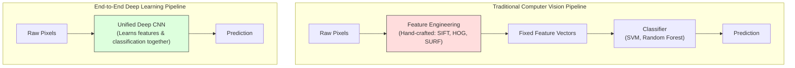

### 1.5.2. What It Replaces: Hand-Crafted Feature Engineering

Prior to deep learning, computer vision systems relied on **feature engineering**—manually designing mathematical descriptors to extract invariant features from images. These descriptors were designed by human experts to handle variations in scale, rotation, and illumination.

#### Notable Hand-Crafted Descriptors

* **SIFT (Scale-Invariant Feature Transform)**:
  * Designed by David Lowe (1999/2004), SIFT extracts scale and rotation-invariant keypoints from images.
  * It construct a scale space by applying successive Gaussian blurs and computing the Difference of Gaussians (DoG).
  * Local extrema in this scale space are selected as keypoints.
  * For each keypoint, a 128-dimensional descriptor vector is computed based on gradient orientation histograms in its spatial neighborhood.

* **HOG (Histogram of Oriented Gradients)**:
  * Introduced by Dalal and Triggs (2005), HOG is widely used for pedestrian detection.
  * It tile-segments an image into small, connected spatial regions called "cells."
  * For each cell, it compiles a 1D histogram of gradient directions for the pixels within it.
  * To improve illumination robustness, these histograms are normalized across larger, overlapping spatial blocks.
  * The concatenated normalized histograms form the final feature vector.

* **SURF (Speeded Up Robust Features)**:
  * Developed by Bay et al. (2006), SURF serves as a faster approximation of SIFT.
  * It utilizes Haar wavelet responses and leverages integral images to compute box-filter approximations of Hessian matrix determinants at low computational cost.

After extracting these hand-crafted features, a separate machine learning model (such as a Support Vector Machine or Random Forest) was trained to perform classification or detection on the static feature vectors.

### 1.5.3. The Shift to Learned Representations

The primary limitation of hand-crafted features is that they are **sub-optimal** and **inflexible**:
* The features are designed based on human intuition, which may not capture the most discriminative patterns in complex datasets.
* The feature extractor is fixed and does not adapt during training. If the engineered features fail to capture critical visual cues, the downstream classifier cannot compensate.
* Designing these algorithms requires significant domain expertise and engineering effort.

End-to-end deep learning replaces this with **learned representations**. In a CNN, the feature extraction filters are parameterized weights. During training, backpropagation adjusts these filters to optimize the final classification performance. 

This ensures that the extracted features are directly tailored to the target task. If the classification loss indicates that diagonal edge detection is critical for distinguishing two classes, the network automatically adapts its filters to detect those diagonal edges.

---

## 1.6. The Dimensionalities of Convolutional Networks

The convolution operation can be generalized across different dimensionalities depending on the structure of the input data.

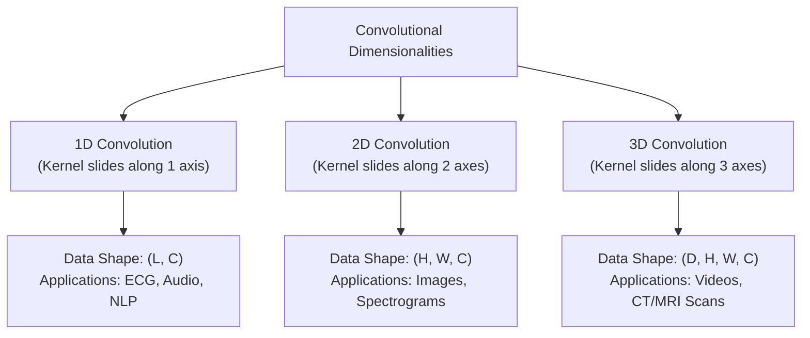

### 1.6.1. 1D Convolutions

In a 1D convolution, the kernel slides along a single spatial or temporal axis. 

* **Data Structure**: The input is typically a 2D tensor of shape $L \times C_{in}$, where $L$ is the sequence length (time steps) and $C_{in}$ is the number of channels (features per time step).
* **Mathematical Operation**:
  
  $$y_j = \sum_{i=1}^{K} w_i \cdot x_{j+i-1} + b$$
  
  where $K$ is the kernel size along the temporal axis.

* **Applications**:
  * **Natural Language Processing (NLP)**: Sequences of word embeddings.
  * **Time-Series Analysis**: Processing sensor data, stock prices, or seismic signals.
  * **Electrocardiogram (ECG) Analysis**: A 1D CNN with a small kernel size can slide along the time axis of an ECG recording to detect the QRS complex waveform of a heartbeat, identifying anomalies regardless of when they occur in the signal.

### 1.6.2. 2D Convolutions

In a 2D convolution, the kernel slides along two perpendicular spatial axes.

* **Data Structure**: The input is a 3D tensor of shape $H \times W \times C_{in}$.
* **Mathematical Operation**:
  
  $$Y[r, c] = \sum_{k=1}^{C_{in}} \sum_{i=1}^{K_h} \sum_{j=1}^{K_w} W[k, i, j] \cdot X[k, r+i-1, c+j-1] + b$$
  
  where $K_h$ and $K_w$ are the height and width of the kernel.

* **Applications**:
  * **Image Processing**: Object classification, detection, and segmentation.
  * **Audio Processing**: Spectrograms (where time is plotted on the horizontal axis and frequency on the vertical axis) are processed as 2D images to perform speech and audio recognition.

### 1.6.3. 3D Convolutions

In a 3D convolution, the kernel slides along three spatial, temporal, or volumetric axes.

* **Data Structure**: The input is a 4D tensor of shape $D \times H \times W \times C_{in}$, where $D$ represents the depth or temporal dimension.
* **Mathematical Operation**: The kernel operates across three axes simultaneously ($x, y, z$).
* **Applications**:
  * **Medical Volumetric Imaging**: CT and MRI scans are processed as 3D grids. A 3D kernel slides across the width, height, and depth slices to detect volumetric anomalies like tumors or blood vessels, preserving anatomical continuity across slices.
  * **Video Recognition**: A video is a sequence of 2D frames over time. A 3D convolution slides across the horizontal, vertical, and temporal axes, capturing both spatial structures and temporal motion cues simultaneously.

---

## 1.7. The Two-Part Architecture: Front-End vs. Back-End

Every standard Convolutional Neural Network can be partitioned into two distinct functional segments: the **Front-End (Feature Extractor)** and the **Back-End (Classifier)**.

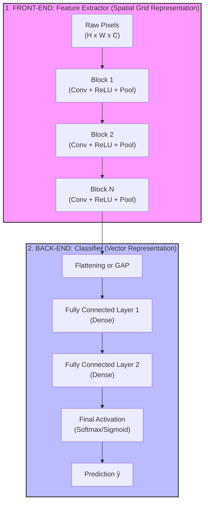

### 1.7.1. Architectural Philosophy: Separation of Concerns

This partition reflects a separation of concerns:
1. **The Front-End** handles the spatial and geometric processing. It maps high-dimensional, raw pixel inputs into a compact, semantically rich representation space. This step preserves local relationships, filters out noise, and establishes translation tolerance.
2. **The Back-End** handles decision-making. It operates on the extracted feature representations, learning how to combine these high-level features to make a final prediction.

---

## 1.8. The Front-End: Feature Extractor

The Front-End consists of repeated blocks of **convolution**, **activation (ReLU)**, and **pooling** operations. 

### 1.8.1. The Hierarchy of Features

As information flows through the front-end, the network automatically builds a hierarchy of visual features, progressing from local, low-level details to abstract, global concepts.

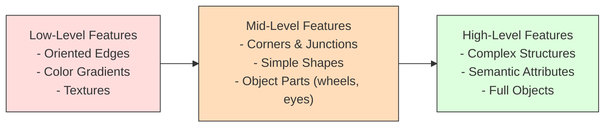

#### Low-Level Features (Early Layers)
* Neurons in the initial layers have small receptive fields and process highly localized regions.
* The learned filters behave like edge detectors, Gabor filters, or color-opponent filters. They respond to simple transitions from light to dark or specific color boundaries.
* These features are highly generic and universal across different computer vision tasks.

#### Mid-Level Features (Middle Layers)
* As spatial resolution is reduced and receptive fields expand, neurons combine low-level edge features.
* These layers learn to detect corners, intersections, surface textures (e.g., repeating stripes or mesh), and simple geometric shapes (e.g., circles, polygons).
* They also begin to capture localized object parts, such as animal ears or wheel contours.

#### High-Level Features (Deep Layers)
* In the deepest convolutional layers, receptive fields cover a large portion of the input image.
* Neurons respond to complex, semantic concepts: entire faces, vehicles, text signs, or abstract category attributes (e.g., "furry" or "metallic").
* These features are highly task-specific and reflect the classes present in the training set.

### 1.8.2. The Synergy of Convolution, ReLU, and Pooling

These three operations serve complementary roles:

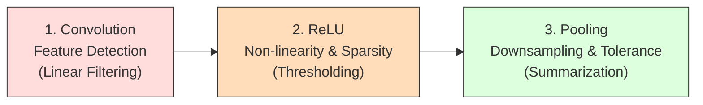

1. **Convolution (Feature Detection)**: Slides learned linear filters across the input grid to detect local structures (such as edges or textures), producing a set of pre-activation feature maps.
2. **ReLU (Activation)**: Applies the element-wise non-linear thresholding function $f(x) = \max(0, x)$. This introduces non-linearity, allowing the network to approximate complex mappings. It also introduces **sparsity** by mapping negative pre-activations to exactly zero, which makes the representations robust to noise and computationally efficient.
3. **Pooling (Downsampling & Translation Tolerance)**: Aggregates localized spatial patches (typically using a max or average operation). This reduces the spatial dimensions of the feature maps, which helps reduce downstream computational cost, increases the effective receptive field size of subsequent layers, and provides local translation tolerance.

---

## 1.9. The Back-End: Classifier

Once the front-end has mapped the raw pixels into high-level features, the back-end takes this structural representation to perform classification or regression.

### 1.9.1. Fully Connected Layers

The back-end is constructed using one or more **fully connected (dense) layers**. In these layers, every input feature is connected to every output neuron, allowing the network to learn global combinations of features. 

For example, to classify an image as a "car," the classifier does not need to know the exact coordinates of the wheels or the windshield. Instead, it needs to verify the simultaneous presence of these high-level features anywhere in the image.

### 1.9.2. The Flattening Operation in Depth

Before feeding the 3D tensor output from the front-end feature extractor into a fully connected layer, it must be converted into a 1D vector. This process is called **flattening**.

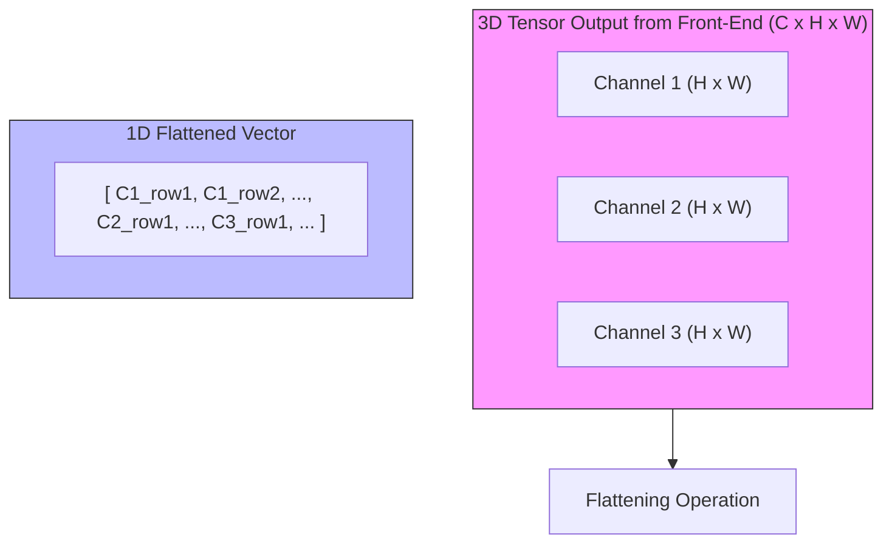

#### Mathematical Formulation

Let the output of the final layer of the front-end be a 3D tensor $\mathbf{T} \in \mathbb{R}^{C \times H \times W}$, where:
* $C$ is the number of channels (feature maps).
* $H$ is the spatial height.
* $W$ is the spatial width.

The flattening operation maps this tensor to a 1D vector $\mathbf{v} \in \mathbb{R}^{D}$, where $D = C \cdot H \cdot W$.

To perform this mapping, deep learning frameworks define an index ordering convention. In a channel-first layout (the default convention in PyTorch), the indexing formula mapping an element $\mathbf{T}[c, h, w]$ to its corresponding 1D index in $\mathbf{v}$ is:

$$\text{Index}(c, h, w) = c \cdot (H \cdot W) + h \cdot W + w$$

where:
* $c \in [0, C-1]$ is the channel index.
* $h \in [0, H-1]$ is the row index.
* $w \in [0, W-1]$ is the column index.

This formulation preserves all numerical values from the tensor but discards the explicit spatial grid coordinates.

#### Worked Numerical Example of Flattening

Consider a 3D tensor $\mathbf{T}$ of shape $C \times H \times W = 3 \times 2 \times 2$:

**Channel 0 ($c=0$):**
$$\mathbf{T}[0, :, :] = \begin{pmatrix} 1 & 2 \\ 3 & 4 \end{pmatrix}$$

**Channel 1 ($c=1$):**
$$\mathbf{T}[1, :, :] = \begin{pmatrix} 5 & 6 \\ 7 & 8 \end{pmatrix}$$

**Channel 2 ($c=2$):**
$$\mathbf{T}[2, :, :] = \begin{pmatrix} 9 & 10 \\ 11 & 12 \end{pmatrix}$$

Using the channel-first indexing formula:

$$\text{Index}(c, h, w) = c \cdot (2 \times 2) + h \cdot 2 + w = 4c + 2h + w$$

* For element $\mathbf{T}[0, 0, 0] = 1 \implies \text{Index} = 4(0) + 2(0) + 0 = 0$
* For element $\mathbf{T}[0, 0, 1] = 2 \implies \text{Index} = 4(0) + 2(0) + 1 = 1$
* For element $\mathbf{T}[0, 1, 0] = 3 \implies \text{Index} = 4(0) + 2(1) + 0 = 2$
* For element $\mathbf{T}[0, 1, 1] = 4 \implies \text{Index} = 4(0) + 2(1) + 1 = 3$
* For element $\mathbf{T}[1, 0, 0] = 5 \implies \text{Index} = 4(1) + 2(0) + 0 = 4$
* For element $\mathbf{T}[2, 1, 1] = 12 \implies \text{Index} = 4(2) + 2(1) + 1 = 11$

The flattened vector is:

$$\mathbf{v} = [1, 2, 3, 4, 5, 6, 7, 8, 9, 10, 11, 12]^\top$$

#### NumPy Implementation

The following code illustrates this reshaping operation:

```python
import numpy as np

# Create a 3D tensor of shape (C, H, W) = (3, 2, 2)
# Channel 0: [[1, 2], [3, 4]]
# Channel 1: [[5, 6], [7, 8]]
# Channel 2: [[9, 10], [11, 12]]
tensor_3d = np.array([
    [[1, 2], [3, 4]],
    [[5, 6], [7, 8]],
    [[9, 10], [11, 12]]
])

print("Original Tensor Shape:", tensor_3d.shape)

# Flatten using standard C-style row-major layout (matches the PyTorch convention)
vector_1d = tensor_3d.flatten()

print("Flattened Vector Shape:", vector_1d.shape)
print("Flattened Values:", vector_1d)
# Output: [ 1  2  3  4  5  6  7  8  9 10 11 12]
```

### 1.9.3. Global Average Pooling (GAP) as a Modern Alternative

Instead of flattening, many modern neural architectures (such as ResNet and MobileNet) use **Global Average Pooling (GAP)** to bridge the front-end and the back-end.

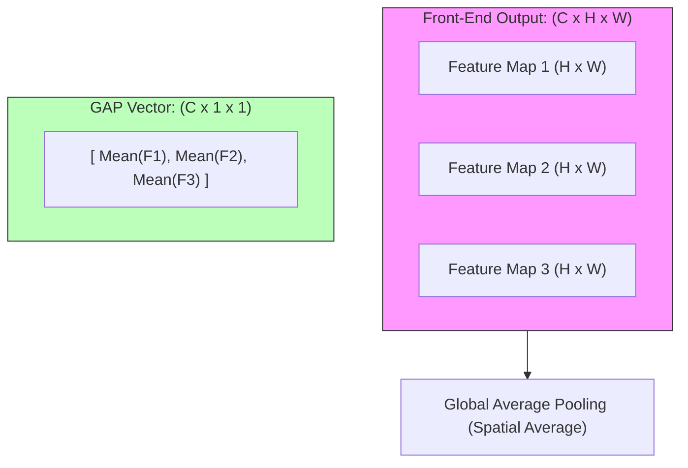

#### Mathematical Operation

For a tensor $\mathbf{T} \in \mathbb{R}^{C \times H \times W}$, GAP computes the spatial average of each feature map. This produces a vector $\mathbf{v} \in \mathbb{R}^C$:

$$v_c = \frac{1}{H \cdot W} \sum_{h=1}^{H} \sum_{w=1}^{W} \mathbf{T}[c, h, w]$$

#### Advantages of GAP over Flattening

* **Parameter Reduction**: Suppose a feature map has dimensions $512 \times 7 \times 7$. 
  * Flattening yields a $25{,}088$-dimensional vector. Connecting this to a dense layer with $1{,}024$ units requires $25{,}088 \times 1{,}024 \approx 25.6$ million parameters.
  * GAP reduces this to a $512$-dimensional vector. Connecting this to the same dense layer requires $512 \times 1{,}024 \approx 524{,}288$ parameters. This represents a **$98\%$ parameter reduction**, which helps prevent overfitting.
* **Spatial Invariance**: By averaging over spatial dimensions, GAP is robust to spatial translations and varying input image sizes.
* **Interpretability**: GAP establishes a direct link between feature maps and output categories. This allows visualization techniques like Class Activation Mapping (CAM) to locate the regions in the input image that influenced the classification decision.

### 1.9.4. The Role of Final Activation Functions

The final layer of the back-end uses a specialized activation function determined by the learning task:

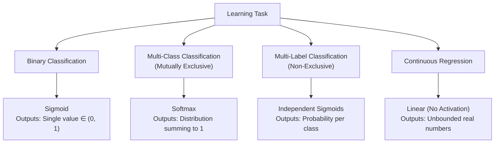

#### 1. Binary Classification
Used when classifying inputs into two mutually exclusive categories. The output layer contains a single neuron with a **Sigmoid** activation:

$$\hat{y} = \sigma(z) = \frac{1}{1 + e^{-z}}$$

The output $\hat{y} \in (0, 1)$ represents the posterior probability of the positive class $P(y=1|\mathbf{x})$.

#### 2. Multi-Class Classification (Mutually Exclusive)
Used when classifying inputs into one of $K$ mutually exclusive categories. The output layer contains $K$ neurons, and their activations are normalized using the **Softmax** function:

$$\hat{y}_i = \text{softmax}(\mathbf{z})_i = \frac{e^{z_i}}{\sum_{j=1}^{K} e^{z_j}} \quad \text{for } i \in \{1, 2, \dots, K\}$$

This projects the raw pre-activations (logits) $\mathbf{z}$ to a probability distribution where:

$$\hat{y}_i \in (0, 1) \quad \text{and} \quad \sum_{i=1}^{K} \hat{y}_i = 1$$

#### 3. Multi-Label Classification (Non-Exclusive)
Used when an input can belong to multiple categories simultaneously (e.g., detecting both "dog" and "outdoor" in an image). The output layer contains $K$ independent neurons, each using a **Sigmoid** activation. Each neuron output $\hat{y}_i = \sigma(z_i)$ represents the probability that the input belongs to category $i$, independent of other classes.

#### 4. Regression
Used when predicting continuous numerical targets (e.g., coordinates for bounding boxes). The output layer uses a **Linear** activation function (i.e., identity function):

$$\hat{\mathbf{y}} = \mathbf{z}$$

This allows the network to output unbounded real values.

---

## 1.10. Complete Characterization: Advantages and Limitations of CNNs

### 1.10.1. Core Advantages of CNNs

| Advantage | Mechanism | Practical Impact |
| :--- | :--- | :--- |
| **Translation Equivariance** | If an input feature shifts, its activation in the output feature map shifts by the same amount: $F(T_g(x)) = T_g(F(x))$. | This allows the network to recognize patterns (such as edges or objects) regardless of where they appear in the image grid, reducing the need for spatially redundant training examples. |
| **Parameter Efficiency** | Achieved through local connectivity and weight sharing. The same filter parameters are swept across the input space. | This significantly reduces the model's memory footprint and helps prevent overfitting, enabling the training of deeper architectures. |
| **Inductive Bias of Locality** | The architecture assumes that nearby elements are highly correlated, restricting receptive fields to small spatial patches in early layers. | This speeds up learning and improves generalization on grid-structured datasets like images or spectrograms. |
| **Hierarchical Representation** | Stacking multiple convolutional and pooling layers allows the model to build complex features from simpler ones. | This allows the network to automatically learn a hierarchy of features, from low-level edges to semantic object structures. |
| **Feature Transferability** | Early and mid-layer filters capture universal geometric structures (edges, corners, textures). | This forms the basis of **Transfer Learning**, enabling models pre-trained on large datasets (like ImageNet) to generalize to small, domain-specific datasets. |

### 1.10.2. Core Limitations of CNNs

| Limitation | Mechanism | Practical Impact |
| :--- | :--- | :--- |
| **Loss of Spatial Precision** | Strided convolutions and pooling layers reduce spatial dimensions to achieve translation invariance. | This discards exact spatial coordinate information, making tasks that require precise localization (such as semantic segmentation or keypoint detection) more difficult. |
| **The Spatial Context Problem** | Standard CNNs lack an explicit mechanism to enforce relative spatial arrangements between features. | A CNN can struggle to distinguish between a valid object configuration and a jumbled version containing the same components. |
| **Scale and Rotation Sensitivity** | Standard CNN kernels are equivariant to translations but are not naturally invariant to rotations or large changes in scale. | To handle these variations, models rely on data augmentation or specialized components like Spatial Transformer Networks. |
| **Fixed Receptive Fields** | The size of the receptive field is statically determined by the network's architecture (kernel size, depth, stride). | The network cannot dynamically adjust its focus based on input content. This can make capturing long-range contextual relationships less efficient compared to self-attention mechanisms. |

---

## 1.11. The Spatial Context Problem and Modern Solutions

### 1.11.1. Understanding the Spatial Context Problem

Standard CNNs are effective at detecting the presence of features, but they do not explicitly model the **spatial relationships** (pose, rotation, and relative distance) between those features. 

Consider a facial recognition model: a face is defined by two eyes, a nose, and a mouth arranged in a specific spatial configuration.

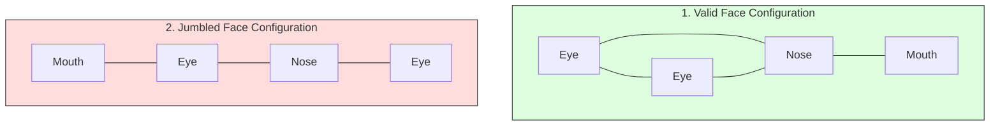

Because pooling operations discard precise spatial coordinates to achieve translation invariance, a standard CNN may activate strongly for both configurations. If all key facial features are present, the network may classify the image as a face, even if they are in an incorrect spatial arrangement (the "jumbled face" problem).

To address this limitation, three primary solutions are used in modern deep learning:

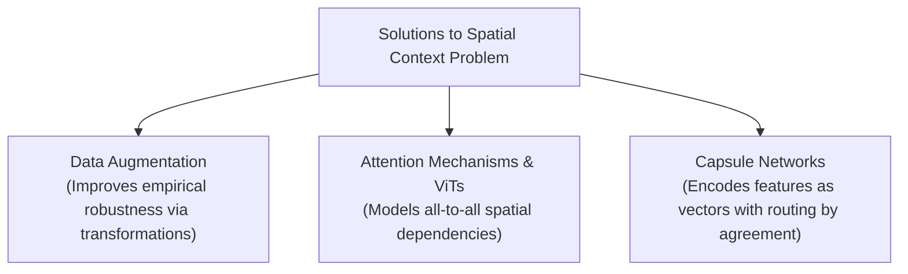

### 1.11.2. Solution 1: Data Augmentation
* **Mechanism**: Artificially expands the training dataset by applying random geometric and photometric transformations to the images (e.g., random cropping, rotation, scaling, flipping, and elastic warping).
* **Impact**: While it does not change the network's underlying architecture, it forces the model to learn weights that are robust to variations in spatial arrangement and pose.

### 1.11.3. Solution 2: Attention Mechanisms and Vision Transformers (ViT)
* **Mechanism**: Vision Transformers (ViT) divide an image into a grid of non-overlapping patches (e.g., $16 \times 16$ pixels), project these patches into 1D embeddings, add positional encodings, and pass them to a standard Transformer encoder.
* **Impact**: Using **self-attention**, every patch can attend to every other patch regardless of their spatial distance. This allows the model to explicitly calculate the relationships between distant parts of an image. If the eyes and the mouth are in an invalid relative position, self-attention can capture this discrepancy, resolving the spatial context problem. 

### 1.11.4. Solution 3: Capsule Networks (CapsNets)
* **Mechanism**: Introduced by Geoffrey Hinton et al., Capsule Networks replace scalar-valued neurons with vector-valued groups of neurons called **capsules**. 
  * The length of a capsule's vector represents the probability that a feature exists.
  * The orientation (direction) of the vector encodes the feature's physical properties (e.g., scale, rotation, shear, and translation).
* **Routing by Agreement**: Active low-level capsules output predictions for the properties of high-level capsules. If multiple low-level capsules (e.g., left eye, right eye, nose) agree on the physical properties of the high-level capsule (e.g., face), that high-level capsule is activated. If their predicted properties disagree (as in a jumbled face), the high-level capsule remains inactive.

---

## 1.12. The Modularity Principle: Chopping and Changing Classifiers

The separation of a CNN into a front-end feature extractor and a back-end classifier provides architectural modularity.

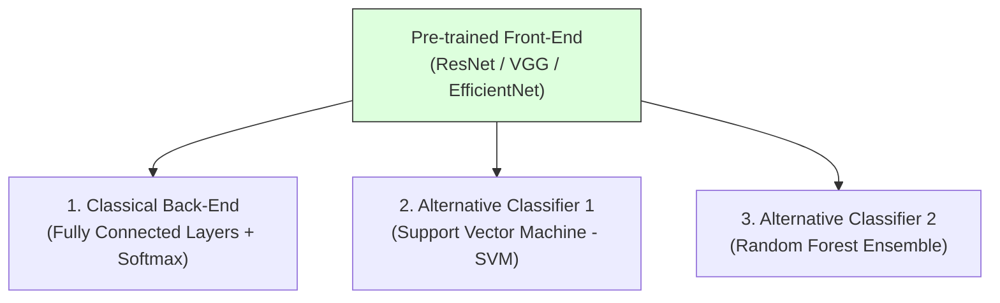

Because the front-end maps images into a structured, low-dimensional feature space, we can remove the default back-end classifier and replace it with alternative classification algorithms.

### 1.12.1. Support Vector Machines (SVM) on CNN Features
* **Mechanism**: We pass our dataset through the pre-trained front-end of a CNN, extract the flattened feature vectors, and treat them as static input features. We then train a Support Vector Machine (typically with a Radial Basis Function kernel) on these vectors.
* **Why**: SVMs can find optimal decision margins in high-dimensional spaces, which is useful when working with small datasets where a standard neural network classifier might overfit.

### 1.12.2. Random Forests on CNN Features
* **Mechanism**: Similar to the SVM pipeline, we extract feature vectors from the CNN front-end and use them to train a Random Forest classifier.
* **Why**: Random Forests can handle non-linear decision boundaries and provide feature importance metrics, which can help analyze which CNN feature maps are most relevant for classification.

### 1.12.3. PyTorch and Scikit-Learn Implementation

The following complete Python script demonstrates how to extract feature maps using a pre-trained ResNet-18 model, flatten them, and train both an SVM and a Random Forest classifier on those features.

```python
import torch
import torch.nn as nn
import torchvision.models as models
from torchvision.models import ResNet18_Weights
import numpy as np
from sklearn.svm import SVC
from sklearn.ensemble import RandomForestClassifier
from sklearn.metrics import accuracy_score

# ==========================================
# Step 1: Initialize Pre-trained Feature Extractor
# ==========================================

# Load ResNet-18 with pre-trained ImageNet weights
resnet = models.resnet18(weights=ResNet18_Weights.DEFAULT)

# To isolate the front-end feature extractor, we remove the final FC layer.
# In PyTorch's ResNet, this is 'resnet.fc'. We replace it with an Identity layer,
# which passes the output of the global average pooling layer directly.
resnet.fc = nn.Identity()

# Set model to evaluation mode (freezes BatchNorm running statistics)
resnet.eval()

# Check output feature dimension (ResNet-18 output after pooling is 512)
feature_dim = 512
print(f"ResNet-18 Feature Extractor initialized. Output Vector Dimension: {feature_dim}")

# ==========================================
# Step 2: Generate Dummy Dataset
# ==========================================
# Generate 100 dummy images of size (3, 224, 224) and split into Train/Test sets
np.random.seed(42)
num_samples = 100
dummy_images = np.random.randn(num_samples, 3, 224, 224).astype(np.float32)
# Binary labels (0: Class A, 1: Class B)
dummy_labels = np.random.randint(0, 2, size=(num_samples,))

# Split into 80% Train, 20% Test
X_train_raw, X_test_raw = dummy_images[:80], dummy_images[80:]
y_train, y_test = dummy_labels[:80], dummy_labels[80:]

# ==========================================
# Step 3: Extract Features
# ==========================================
def extract_cnn_features(raw_images, model):
    features_list = []
    # Disable gradient tracking for inference to save memory
    with torch.no_grad():
        for img in raw_images:
            # Convert NumPy array to PyTorch Tensor and add batch dimension (1, C, H, W)
            img_tensor = torch.from_numpy(img).unsqueeze(0)
            
            # Forward pass through the front-end feature extractor
            feat = model(img_tensor)  # Output shape: (1, 512)
            
            # Flatten to 1D and convert back to NumPy
            feat_flat = feat.squeeze(0).numpy()
            features_list.append(feat_flat)
            
    return np.array(features_list)

print("\nExtracting features from training set...")
X_train_features = extract_cnn_features(X_train_raw, resnet)
print("Extracting features from testing set...")
X_test_features = extract_cnn_features(X_test_raw, resnet)

print(f"Extracted Training Features Shape: {X_train_features.shape}")  # (80, 512)
print(f"Extracted Testing Features Shape: {X_test_features.shape}")    # (20, 512)

# ==========================================
# Step 4: Train Alternative Classifiers
# ==========================================

# 1. Train a Support Vector Machine
svm_clf = SVC(kernel='rbf', C=1.0, gamma='scale')
svm_clf.fit(X_train_features, y_train)
svm_preds = svm_clf.predict(X_test_features)
svm_accuracy = accuracy_score(y_test, svm_preds)

# 2. Train a Random Forest Classifier
rf_clf = RandomForestClassifier(n_estimators=100, random_state=42)
rf_clf.fit(X_train_features, y_train)
rf_preds = rf_clf.predict(X_test_features)
rf_accuracy = accuracy_score(y_test, rf_preds)

# ==========================================
# Step 5: Report Results
# ==========================================
print("\n--- Classification Performance on Extracted CNN Features ---")
print(f"Support Vector Machine (SVM) Test Accuracy: {svm_accuracy * 100:.2f}%")
print(f"Random Forest Classifier Test Accuracy:     {rf_accuracy * 100:.2f}%")
```

---

## 1.13. Deep Dive into Transfer Learning

Transfer learning is a machine learning paradigm where a model pre-trained on a large source dataset (e.g., ImageNet) is adapted to a different target task. This approach is highly effective because early-stage visual representations are generic across many vision tasks.

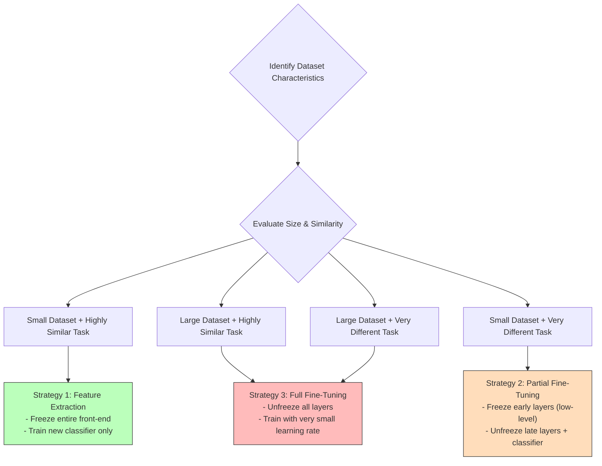

### 1.13.1. Why Pre-trained Features Transfer

In deep CNNs, layers behave as feature extractors at varying levels of abstraction:
* **Early Layers**: Learn basic features like edges, corners, and color transitions. These features are common to almost all visual datasets, meaning a model trained on ImageNet already knows how to detect edges for satellite images or medical scans.
* **Mid Layers**: Group basic features into textures and simple shapes. These representations remain highly transferable within related visual domains.
* **Late Layers**: Combine mid-level features into complex semantic objects (such as dog breeds or vehicle parts). These representations are highly specific to the pre-training classes.

Transfer learning leverages this hierarchy, preserving the pre-trained early representations to avoid training them from scratch.

### 1.13.2. Three Structured Strategies

The optimal transfer learning strategy depends on two factors: the **size of the target dataset** and its **similarity to the source dataset** (e.g., ImageNet).

#### Strategy 1: Feature Extraction (Freeze Front-End, Train New Classifier)
* **Mechanism**: 
  * All parameters in the pre-trained front-end are frozen (`requires_grad = False`).
  * The pre-trained classifier back-end is replaced with a new classifier initialized with random weights.
  * Only the parameters of this new classifier are updated during training.
* **When to Use**: 
  * **Small Target Dataset**: When training a large model from scratch would lead to overfitting.
  * **High Similarity**: When the target images are visually similar to the source dataset (e.g., standard natural objects), meaning the pre-trained feature extractor is already highly relevant.

#### Strategy 2: Partial Fine-Tuning (Freeze Early Layers, Unfreeze Late Layers)
* **Mechanism**:
  * Early convolutional layers (detecting low-level features) are frozen.
  * Late convolutional layers (detecting high-level features) are unfrozen alongside the new classifier.
  * The unfrozen layers are trained using a very small learning rate (typically $\eta_{fine} \approx 10^{-5}$ to $10^{-4}$) to prevent degrading the pre-trained representations.
* **When to Use**:
  * **Small-to-Medium Target Dataset**: To adapt the model without overfitting.
  * **Low Similarity**: When the target images differ significantly from the source dataset (e.g., medical ultrasound scans vs. ImageNet pictures). The low-level edge detectors remain useful, but the high-level semantic features must be adapted to the new domain.

#### Strategy 3: Full Fine-Tuning (Unfreeze All Layers)
* **Mechanism**:
  * All layers in the network are unfrozen and trained.
  * The pre-trained weights are used as the initialization for the optimization process, rather than starting from scratch.
  * A small, uniform learning rate is used to avoid disrupting the pre-trained weight configurations too quickly.
* **When to Use**:
  * **Large Target Dataset**: When there is enough data to train millions of parameters without a high risk of overfitting.
  * **Regardless of Similarity**: Pre-trained weights serve as a strong initialization, typically leading to faster convergence and better generalization compared to random weight initialization.