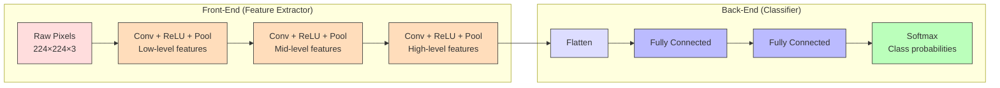
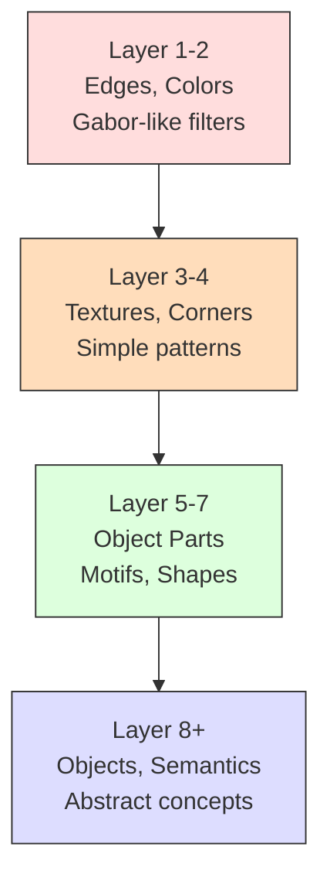
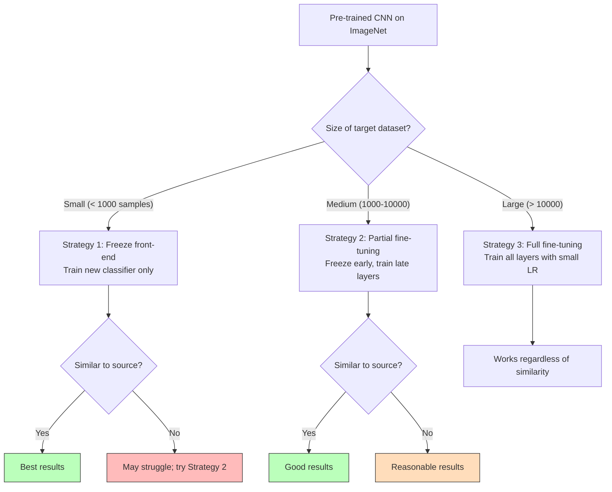

# 2. Core Architecture and Philosophy

## The Two-Part Architecture: Front-End and Back-End

Every Convolutional Neural Network, regardless of its specific design details, is organized into two fundamentally distinct functional parts: the **Front-End** (also called the Feature Extractor or the convolutional base) and the **Back-End** (also called the Classifier or the head). This two-part design is not merely a convention — it reflects a deep architectural principle that has profound implications for how CNNs are designed, trained, and deployed. Understanding this dichotomy is essential for everything that follows, including transfer learning, model fine-tuning, and architecture design.

The fundamental insight behind this two-part design is that visual recognition can be decomposed into two sub-problems: (1) transforming raw pixels into a representation that makes the classification task easy, and (2) performing the actual classification in that learned representation space. The front-end solves problem (1) by progressively transforming the pixel-level input into increasingly abstract and semantically meaningful features. The back-end solves problem (2) by taking these high-level features and mapping them to the desired output categories. This separation of concerns is analogous to how humans process visual information: our visual cortex extracts features (edges, shapes, textures), and our higher cognitive centers use those features to recognize objects and make decisions.



---

## The Front-End: Feature Extractor

The front-end of a CNN is composed of repeated blocks of three operations: **convolution**, **activation** (typically ReLU), and **pooling**. These blocks are stacked one after another, forming a deep hierarchy that progressively transforms the raw pixel input into increasingly abstract feature representations. Each block takes the output of the previous block as its input, applies convolution to extract features, applies ReLU to introduce non-linearity, and applies pooling to reduce spatial dimensions. The result is a progressive transformation from low-level features to mid-level features to high-level features.

### The Hierarchy of Features

One of the most beautiful and well-documented properties of CNNs is that the features they learn form a natural hierarchy across layers. This hierarchy was not designed by hand — it emerges automatically from the training process and the architectural constraints imposed by convolution, ReLU, and pooling. The hierarchical nature of learned features has been demonstrated through visualization techniques (such as deconvolutional networks and gradient-based saliency maps) and through systematic studies of what different layers encode.

**Low-level features (early layers)**: The first convolutional layers of a CNN learn to detect simple, local features that are analogous to the simple cells discovered by Hubel and Wiesel. These include oriented edges (vertical, horizontal, diagonal), color gradients, and simple textures. These features are highly generic — they are useful for virtually any visual task — and they are very local, meaning each neuron's receptive field covers only a small portion of the input image. Typical low-level features include:
- Gabor-like filters at various orientations (detecting edges)
- Color-opponent filters (detecting transitions from red to green, or blue to yellow)
- Simple texture patterns (detecting periodic intensity variations)

These features are so universal that they are nearly identical across CNNs trained on completely different datasets, and they closely resemble the filters learned by sparse coding algorithms applied to natural image statistics. This universality is a key reason why transfer learning works so well: the low-level features learned on ImageNet are just as useful for medical imaging or satellite imagery.

**Mid-level features (middle layers)**: As we move deeper into the network, the features become more complex and specialized. Mid-level features combine low-level edges and textures into larger patterns that represent object parts, simple shapes, and more complex textures. Typical mid-level features include:
- Corners and junctions (where multiple edges meet)
- Simple shapes (circles, rectangles, triangles)
- Motifs and patterns (repeated texture elements, such as brick patterns, fabric weaves, or fur textures)
- Object parts (wheels, eyes, leaves, windows)

Mid-level features are less universal than low-level features — a model trained on natural images might learn different mid-level features than one trained on medical images — but they still share significant commonality across related domains.

**High-level features (late layers)**: The deepest convolutional layers learn features that are highly abstract and semantically meaningful. These features combine mid-level patterns into representations that encode entire object parts, object categories, and even semantic attributes. Typical high-level features include:
- Complex object parts (a dog's snout, a car's wheel assembly, a person's torso)
- Whole objects in a localized region (a face, a car silhouette)
- Semantic attributes (furry, metallic, outdoor, indoor)

High-level features are the most task-specific — they are heavily influenced by the training dataset and the specific classes the model was trained to recognize. A model trained on ImageNet (1000 object categories) will learn very different high-level features than one trained on a medical imaging dataset.



### How Convolution, ReLU, and Pooling Work Together

Each block in the front-end consists of three operations that serve complementary roles:

1. **Convolution** extracts local patterns from the input feature maps. It is the primary feature detection mechanism — it scans the input with learned filters and produces feature maps that indicate where each pattern was detected. Convolution preserves spatial information (the feature map is still a 2D grid) and introduces weight sharing (the same filter is applied at every location).

2. **ReLU** (Rectified Linear Unit) applies the function $f(x) = \max(0, x)$ element-wise to the feature map. This has two critical effects. First, it introduces non-linearity, which is necessary for the network to learn complex, non-linear mappings (without ReLU, stacking convolutions would be equivalent to a single linear convolution). Second, it sparsifies the feature map by setting all negative values to zero, which means that only the features that are actually detected (positive activations) are passed forward. This sparsity is both computationally efficient and helps prevent the network from learning redundant, overlapping features.

3. **Pooling** reduces the spatial dimensions of the feature map by summarizing local regions (typically taking the maximum value in each 2×2 region). This serves three purposes: it reduces the computational cost for subsequent layers, it provides a degree of translation invariance (a feature detected in slightly different positions will produce the same pooled output), and it increases the effective receptive field of subsequent layers (by reducing the spatial resolution, each neuron in the next layer "sees" a larger portion of the original input).

The interplay between these three operations is crucial. Convolution detects features at precise locations; ReLU ensures only meaningful detections are kept; pooling provides robustness to small spatial shifts and reduces resolution so that deeper layers can "see" larger contexts. This cycle of detect → activate → summarize is repeated many times, each time building a more abstract representation from the previous one.

> [!tip] Why This Particular Order?
> The order Conv → ReLU → Pool is nearly universal, and for good reason. Applying ReLU before pooling ensures that the pooling operation (especially max pooling) selects from non-negative activations, which are meaningful feature detections. Applying convolution before ReLU ensures that we have a linear feature detection step followed by a non-linear activation, which is the standard neuron model. Applying pooling last in the block ensures that we reduce spatial resolution only after feature detection is complete, preserving the maximum amount of spatial information for the convolution operation.

---

## The Back-End: Classifier

After the front-end has extracted high-level features from the input image, the back-end takes these features and maps them to the final output categories. The back-end is essentially a standard Multi-Layer Perceptron (MLP) composed of one or more fully connected (dense) layers, terminated by an appropriate output activation function.

### Why Fully Connected Layers?

Fully connected layers are used in the classifier because, at this stage of the network, we no longer need to preserve spatial structure. The front-end has already reduced the spatial dimensions through repeated pooling and increased the semantic level of the features. By the time we reach the end of the front-end, the feature maps encode high-level information about what is present in the image, and we simply need to combine this information to make a final decision.

A fully connected layer connects every feature value from the previous layer to every neuron in the current layer, allowing the network to learn arbitrary combinations of all the high-level features. This is appropriate for the classification task, where the decision might depend on the presence or absence of any combination of high-level features — for example, "is there a wheel AND a windshield AND a door?" to classify a car. Unlike the feature extraction stage, where we want to preserve spatial locality, the classification stage needs to integrate information from across the entire feature representation.

### What Flattening Does Mathematically

The output of the front-end is a 3D tensor of shape $(H', W', C')$, where $H'$ and $W'$ are the reduced spatial dimensions (after all the pooling operations) and $C'$ is the number of channels (feature maps) produced by the final convolutional layer. Before we can feed this tensor into a fully connected layer, we must convert it into a 1D vector. This operation is called **flattening**, and it works exactly as the name suggests: it takes the 3D tensor and rearranges all its elements into a single 1D vector of length $H' \times W' \times C'$.

Mathematically, flattening takes a tensor $\mathbf{T} \in \mathbb{R}^{H' \times W' \times C'}$ and produces a vector $\mathbf{v} \in \mathbb{R}^{H' \cdot W' \cdot C'}$. The ordering of elements in the flattened vector follows a consistent convention — typically row-major (C-style) order, meaning we iterate over the spatial dimensions first (height, then width) for each channel, and then move to the next channel. For a tensor element $\mathbf{T}[h, w, c]$, its position in the flattened vector is:

$$\text{index} = c \cdot (H' \cdot W') + h \cdot W' + w$$

This flattening operation discards the explicit spatial structure of the feature maps (the 2D arrangement is lost), but all the information is preserved — the same values are present, just in a different arrangement. The fully connected layers that follow will learn to use whichever features are relevant for classification, regardless of their original spatial position.

#### Worked Numerical Example of Flattening

Consider a simple 3D tensor output from the front-end with shape $(2, 2, 3)$ — that is, 2 rows, 2 columns, and 3 channels. Let the tensor be:

**Channel 0:**
$$\mathbf{T}[:,:,0] = \begin{pmatrix} 1 & 2 \\ 3 & 4 \end{pmatrix}$$

**Channel 1:**
$$\mathbf{T}[:,:,1] = \begin{pmatrix} 5 & 6 \\ 7 & 8 \end{pmatrix}$$

**Channel 2:**
$$\mathbf{T}[:,:,2] = \begin{pmatrix} 9 & 10 \\ 11 & 12 \end{pmatrix}$$

Flattening this in row-major order (iterating over channels last) gives:

$$\mathbf{v} = [1, 2, 3, 4, 5, 6, 7, 8, 9, 10, 11, 12]$$

The total length is $2 \times 2 \times 3 = 12$, and every element from the 3D tensor is present exactly once in the 1D vector. In practice, different deep learning frameworks may use different ordering conventions (PyTorch typically uses channel-first ordering and flattens channels, height, then width), but the principle is the same.

```python
import numpy as np

# Create a 3D tensor of shape (2, 2, 3) — (H, W, C)
tensor_3d = np.array([
    [[1, 5, 9],   [2, 6, 10]],   # Row 0
    [[3, 7, 11],  [4, 8, 12]]    # Row 1
])  # Shape: (2, 2, 3)

print(f"Original shape: {tensor_3d.shape}")  # Prints: (2, 2, 3)

# Flatten the 3D tensor into a 1D vector
# reshape(-1) tells NumPy to infer the length of the flattened dimension
vector_1d = tensor_3d.reshape(-1)

print(f"Flattened shape: {vector_1d.shape}")  # Prints: (12,)
print(f"Flattened values: {vector_1d}")        # Prints: [ 1  5  9  2  6 10  3  7 11  4  8 12]
# Note: NumPy's default reshape order is C-style (row-major), which iterates
# over the last axis fastest. So for shape (H, W, C), it iterates C first,
# then W, then H.
```

### The Role of the Final Activation Function

The last layer of the back-end uses a specialized activation function that produces the network's final output in a form appropriate for the task:

- **Binary classification**: A single neuron with a **sigmoid** activation, which outputs a value between 0 and 1 representing the probability of the positive class. The sigmoid function is $\sigma(z) = \frac{1}{1 + e^{-z}}$, and its output can be interpreted as $P(\text{class} = 1 | \mathbf{x})$.

- **Multi-class classification** (mutually exclusive classes): $K$ neurons with a **softmax** activation, which converts the $K$ raw output values (called logits) into a probability distribution over $K$ classes. The softmax function is:

$$\text{softmax}(z_i) = \frac{e^{z_i}}{\sum_{j=1}^{K} e^{z_j}}$$

This ensures that all outputs are non-negative and sum to 1, making them valid probabilities.

- **Multi-label classification** (non-exclusive classes): $K$ neurons, each with its own **sigmoid** activation. Each output independently represents the probability of the corresponding class being present, and they need not sum to 1.

- **Regression**: A single neuron with **no activation function** (linear output), allowing the network to predict any real-valued number.

The choice of final activation function is tightly coupled with the choice of loss function: sigmoid with binary cross-entropy loss, softmax with categorical cross-entropy loss, and linear output with mean squared error loss. This pairing ensures that the gradient of the loss with respect to the network's parameters provides a well-conditioned learning signal.

---

## The Flattening Operation in Complete Detail

Let us revisit the flattening operation with an even more detailed treatment, because it is a common source of confusion for students and its mechanics have important implications for the classifier that follows.

### From 3D Tensor to 1D Vector: The Full Picture

After the last convolutional (or pooling) layer in the front-end, the network produces a 3D output tensor. Let us say this tensor has dimensions $H' \times W' \times C'$, where $H'$ is the height (number of rows), $W'$ is the width (number of columns), and $C'$ is the depth (number of channels/feature maps). For a typical CNN processing 224×224 images with several pooling layers that halve the resolution each time, the output of the front-end might be $7 \times 7 \times 512$ — meaning 512 feature maps, each of size 7×7.

Flattening converts this $7 \times 7 \times 512 = 25{,}088$-element tensor into a single vector of length 25,088. This vector is then fed into the first fully connected layer. If that layer has 4,096 neurons (a common choice in architectures like VGG and AlexNet), the weight matrix for this layer has dimensions $25{,}088 \times 4{,}096$, containing approximately 102.7 million parameters. This is why the first fully connected layer is typically the most parameter-heavy layer in a CNN — it connects every element of the flattened feature vector to every neuron in the dense layer.

### The Information Content: What Is Preserved and What Is Lost

Flattening preserves all the numerical values from the 3D tensor — no information is discarded. However, the explicit spatial arrangement (which feature map a value came from, and where within that feature map it was located) is lost in the sense that the fully connected layer does not "know" the original 3D structure. It treats every element of the flattened vector as an independent input. The fully connected layer must learn, through its weights, which combinations of features (and which spatial positions within feature maps) are relevant for the classification task. In practice, this works well because the front-end has already reduced spatial resolution significantly and learned semantically meaningful features, so the classifier's job is primarily to learn the right combinations.

> [!warning] A Note on Global Average Pooling as an Alternative
> Modern architectures (starting with Network-in-Network and popularized by ResNet) often replace the flatten + fully connected approach with **Global Average Pooling (GAP)**. Instead of flattening the $7 \times 7 \times 512$ tensor into a 25,088-element vector, GAP computes the average of each $7 \times 7$ feature map, producing a 512-element vector (one value per channel). This dramatically reduces the number of parameters and acts as a regularizer. We will discuss GAP in detail in Section 5.

---

## The Modularity Principle

One of the most powerful consequences of the two-part architecture is the **modularity principle**: the front-end and back-end can be separated, modified, and recombined independently. This modularity is what makes transfer learning possible and is the foundation of many practical applications of CNNs.

### Chopping Off the Classifier

Because the front-end produces general-purpose visual features and the back-end is simply a classifier that operates on those features, we can remove the back-end and replace it with an entirely different classifier. The front-end's output — the flattened (or pooled) feature vector — serves as a powerful, learned feature representation that can be fed into any standard machine learning algorithm.

**Example 1: SVM on CNN Features**
A Support Vector Machine is a classical machine learning algorithm that finds the optimal hyperplane separating classes in feature space. We can train a CNN on a large dataset (like ImageNet), remove the classifier, use the front-end to extract features from our target dataset, and then train an SVM on these extracted features. This approach often outperforms training an SVM on hand-crafted features, because the CNN features are more semantically meaningful. The procedure is:

1. Pre-train a CNN on ImageNet (or use a pre-trained model).
2. Remove the fully connected layers (the back-end).
3. Pass all images from your target dataset through the front-end, saving the feature vectors.
4. Train an SVM on these feature vectors with the target dataset's labels.
5. At test time, extract features using the front-end, then classify using the trained SVM.

**Example 2: Random Forest on CNN Features**
Similarly, we can use a Random Forest — an ensemble of decision trees — as the classifier on top of CNN features. Random Forests are particularly effective when the feature space is high-dimensional and the decision boundaries are non-linear. They also provide feature importance scores, which can give insight into which CNN features are most discriminative for the target task. The procedure is identical to the SVM case, except step 4 uses a Random Forest instead of an SVM.

```python
# Example: Using a pre-trained CNN front-end with an SVM classifier
from sklearn.svm import SVC               # Import Support Vector Classifier
from sklearn.ensemble import RandomForestClassifier  # Import Random Forest
import torch
import torchvision.models as models
import numpy as np

# Step 1: Load a pre-trained CNN (ResNet-18 trained on ImageNet)
model = models.resnet18(pretrained=True)  # Load the model with pre-trained weights

# Step 2: Remove the classifier (the final fully connected layer)
# In ResNet-18, the classifier is the 'fc' layer
# We replace it with an identity function to get the feature vector
feature_extractor = torch.nn.Sequential(*list(model.children())[:-1])
# This removes the last layer, leaving the convolutional base
# The output will be a 512-dimensional feature vector (for ResNet-18)

# Set the model to evaluation mode (disables dropout, batch norm uses running stats)
feature_extractor.eval()

# Step 3: Extract features from your dataset
# (Assuming 'dataloader' yields batches of images)
features_list = []   # Will store the feature vectors
labels_list = []     # Will store the corresponding labels

with torch.no_grad():  # Disable gradient computation (saves memory, faster)
    for images, labels in dataloader:
        # Pass images through the feature extractor
        feats = feature_extractor(images)    # Shape: (batch_size, 512, 1, 1)
        feats = feats.view(feats.size(0), -1)  # Flatten to (batch_size, 512)
        features_list.append(feats.numpy())   # Convert to NumPy array and store
        labels_list.append(labels.numpy())    # Store labels

# Concatenate all batches into single arrays
X_features = np.concatenate(features_list, axis=0)  # Shape: (N, 512)
y_labels = np.concatenate(labels_list, axis=0)       # Shape: (N,)

# Step 4: Train an SVM (or Random Forest) on the extracted features
svm_classifier = SVC(kernel='rbf', C=1.0)        # Create an SVM with RBF kernel
svm_classifier.fit(X_features, y_labels)          # Train the SVM on CNN features

# Alternatively, train a Random Forest
rf_classifier = RandomForestClassifier(n_estimators=100)  # 100 trees
rf_classifier.fit(X_features, y_labels)          # Train on CNN features

# Step 5: At test time, extract features and classify
# test_feats = feature_extractor(test_images)
# predictions = svm_classifier.predict(test_feats)
```

---

## Why This Two-Part Design Is Fundamental to Transfer Learning

Transfer learning is the practice of applying knowledge learned from one task (the source task) to a different but related task (the target task). In the context of CNNs, transfer learning typically involves taking a model that was pre-trained on a large dataset (like ImageNet, with 1.2 million images and 1000 categories) and adapting it to a new, typically smaller dataset. The two-part architecture makes this remarkably straightforward.

### The Key Insight: Features Are Transferable, Classifiers Are Not

The reason transfer learning works so well for CNNs is directly tied to the two-part architecture. Recall that the front-end learns a hierarchy of features: low-level features (edges, colors) are universal across virtually all visual tasks, mid-level features (textures, shapes) transfer well within related domains, and only the highest-level features are truly task-specific. This means that the front-end of a CNN trained on ImageNet contains useful knowledge for almost any visual recognition task.

The back-end (classifier), however, is specific to the exact set of classes the model was trained on. A classifier with 1000 output neurons trained to distinguish 1000 ImageNet categories is useless if your task has only 5 categories. But the features that feed into that classifier — the output of the front-end — are highly valuable.

### The Standard Transfer Learning Recipe

1. **Take a pre-trained model**: Start with a CNN trained on ImageNet (or another large dataset).
2. **Remove the back-end**: Chop off the fully connected classifier layers.
3. **Freeze the front-end** (optional): Set `requires_grad = False` for all parameters in the front-end so they are not updated during training. This prevents the pre-trained features from being destroyed by large gradient updates on the small target dataset.
4. **Add a new back-end**: Attach a new fully connected classifier with the appropriate number of output neurons for the target task (e.g., 5 neurons for 5 classes).
5. **Train on the target dataset**: Train only the new classifier (with the front-end frozen) or fine-tune the entire network with a small learning rate.

### Three Transfer Learning Strategies

**Strategy 1: Feature Extraction (Front-end frozen, new classifier)**
- Freeze all front-end parameters.
- Train only the new classifier.
- Best when: the target dataset is small and similar to the source dataset.
- Risk: None — the pre-trained features are preserved perfectly.

**Strategy 2: Fine-tuning (Front-end partially unfrozen)**
- Freeze the early layers (which contain universal low-level features).
- Unfreeze the later layers (which can be adapted to the target domain).
- Train with a small learning rate (typically 1/10th of the default).
- Best when: the target dataset is medium-sized and somewhat different from the source dataset.

**Strategy 3: Full Fine-tuning (All layers unfrozen)**
- Unfreeze all parameters.
- Train the entire network with a small learning rate.
- Best when: the target dataset is large and significantly different from the source dataset.
- Risk: Catastrophic forgetting — if the learning rate is too large, the pre-trained features can be destroyed before the network has a chance to adapt them.



> [!info] The Practical Impact
> Transfer learning has democratized deep learning. Without it, training a CNN from scratch would require millions of labeled images and weeks of GPU time — resources available only to the largest tech companies. With transfer learning, you can achieve state-of-the-art results on a new task with just a few hundred labeled images and a few hours of training on a single GPU. The two-part architecture is what makes this possible: because the front-end produces transferable features, you only need to train the lightweight classifier, which requires far less data and computation.
