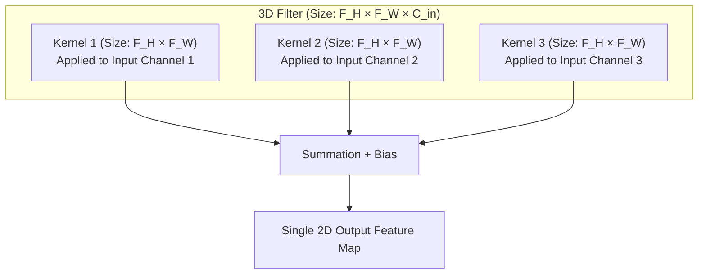
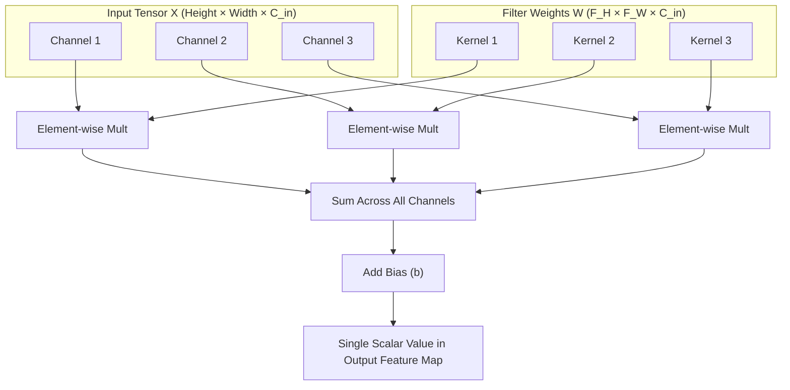
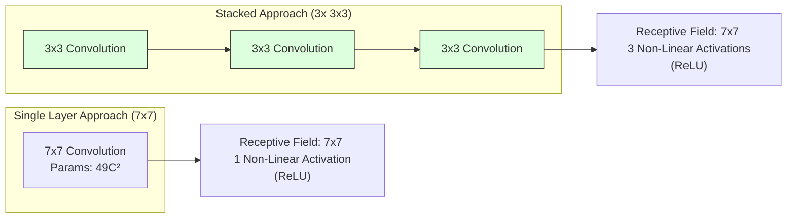
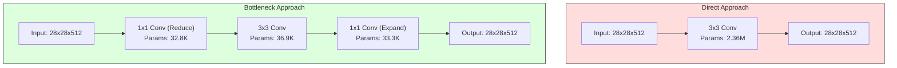
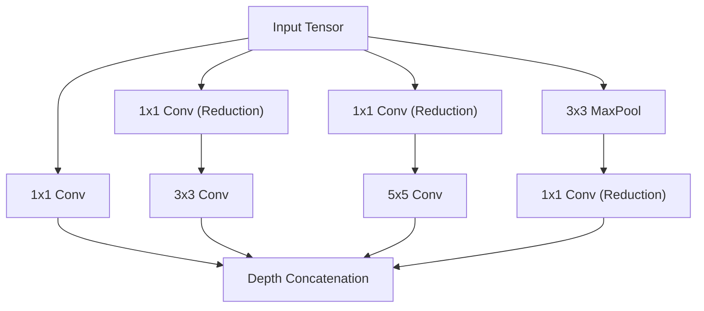
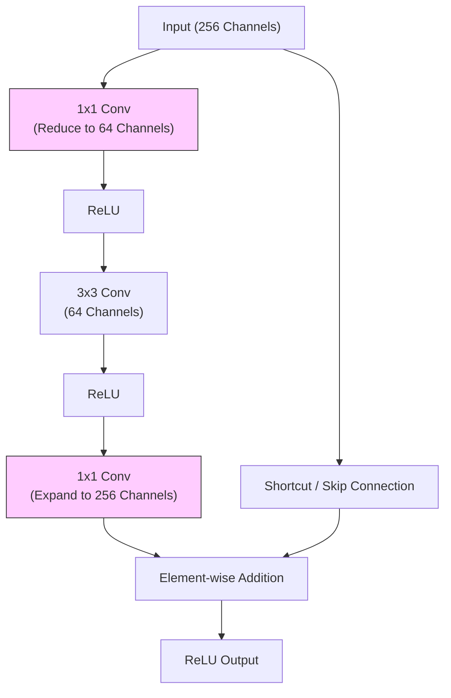
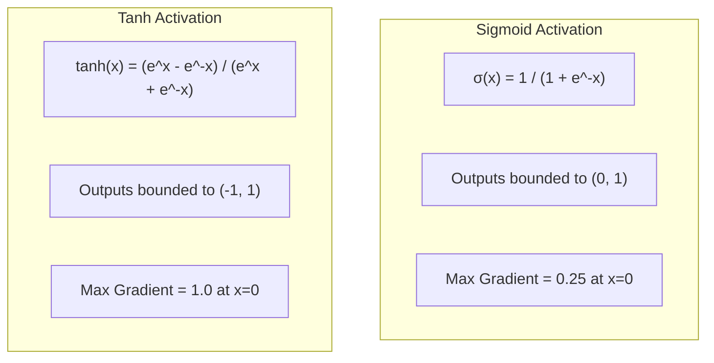
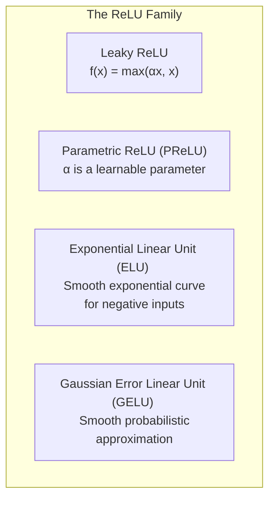
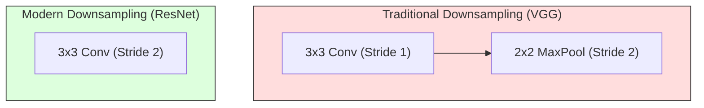
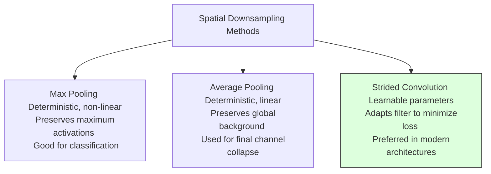

# 1. The Mathematics and Mechanics of CNN Operations

## 1.1 Terminology and Structural Definitions

Before analyzing the mathematical formulations of Convolutional Neural Networks (CNNs), we must establish definitions for the structural components of these networks. Discrepancies in terminology across academic literature and deep learning frameworks often cause confusion. Here, we define the core components: filters, kernels, and feature maps.

### Filter vs. Kernel: The Dimensional Distinction

In classical signal processing, the terms **filter** and **kernel** have distinct meanings, whereas in deep learning literature they are frequently used interchangeably. To maintain mathematical precision, we establish the following distinction:

*   **Kernel**: A kernel is a two-dimensional (2D) matrix of learnable weights that operates on a single channel of an input tensor. Its spatial dimensions are defined as $F_H \times F_W$ (height $\times$ width), typically square (e.g., $3\times3$, $5\times5$, or $7\times7$).
*   **Filter**: A filter is a three-dimensional (3D) tensor of learnable weights that operates on the entire depth of an input tensor. A filter is composed of multiple kernels—exactly one kernel for each input channel. Its dimensions are $F_H \times F_W \times C_{\text{in}}$, where $C_{\text{in}}$ is the number of channels in the input tensor.



During a forward pass, the 3D filter slides across the 3D input tensor. At each spatial position, it computes a 3D element-wise product and sums the results across both the spatial and channel dimensions. This produces a single scalar value. Therefore, **one 3D filter applied to a multi-channel input produces exactly one 2D output feature map**.

### Feature Map (Activation Map)

A **feature map** (or **activation map**) is the 2D spatial grid of activations produced by applying a single 3D filter across the entire input tensor. Each element $(i, j)$ in a feature map represents the response of the corresponding filter at that specific spatial location in the input.

When a convolutional layer contains $K$ distinct filters, each filter processes the input tensor independently to generate its own 2D feature map. These $K$ individual 2D feature maps are then stacked along the depth dimension to form a 3D output tensor of size $H_{\text{out}} \times W_{\text{out}} \times K$. This output tensor then serves as the input to the subsequent layer.

> [!note] Physical Interpretation
> A feature map can be interpreted as a spatial "heat map" indicating the presence and strength of a specific visual feature (e.g., horizontal edges, textures, or complex object parts) across the input space. High positive values indicate a strong match between the filter's learned weights and the local input patch.

---

## 1.2 The Mathematical Definition of Convolution

In the mathematical fields of functional analysis and signal processing, the continuous convolution of two functions $f$ and $g$ is defined as:

$$(f * g)(t) = \int_{-\infty}^{\infty} f(\tau)g(t - \tau) d\tau$$

For discrete 2D spatial signals (such as digital images), true mathematical convolution is defined as:

$$(I * K)[i, j] = \sum_{m=-\infty}^{\infty} \sum_{n=-\infty}^{\infty} I[i - m, j - n] \cdot K[m, n]$$

Notice the subtraction of indices ($i - m$, $j - n$). This subtraction requires **flipping** the kernel both horizontally and vertically before computing the sum of element-wise products. This flipping operation ensures that convolution satisfies important mathematical properties, such as **commutativity**:

$$I * K = K * I$$

### Cross-Correlation: The Deep Learning Implementation

In deep learning, the operation implemented under the name "convolution" is actually **cross-correlation**. The mathematical definition of discrete 2D cross-correlation is:

$$(I \star K)[i, j] = \sum_{m} \sum_{n} I[i + m, j + n] \cdot K[m, n]$$

Here, the indices are added ($i + m$, $j + n$). The kernel is slid directly over the input without any spatial flipping.


### Why the Distinction Does Not Matter in Practice

Although deep learning frameworks use cross-correlation, it is universally referred to as "convolution." This terminology is acceptable in practice for the following reasons:

1.  **Learned Parameters**: In a neural network, the values of the kernel $K$ are not handcrafted; they are learned parameters updated via backpropagation. If the optimal pattern detector requires a flipped representation, the optimization algorithm (SGD, Adam) will simply learn the weights in that flipped configuration.
2.  **Equivalent Expressive Power**: The family of functions that can be represented by a network using cross-correlation is identical to the family of functions that can be represented using true convolution.
3.  **Computational Efficiency**: Omitting the kernel-flipping step simplifies implementation and saves clock cycles during both forward and backward passes.

---

## 1.3 Exhaustive Numerical Walkthrough of 2D Convolution

To ensure absolute clarity, we perform a complete, manual calculation of a single-channel 2D convolution (cross-correlation) without omitting any steps.

### Setup

Let our Input ($\mathbf{I}$) be a $5 \times 5$ matrix:

$$\mathbf{I} = \begin{pmatrix} 1 & 2 & 0 & 1 & 3 \\ 0 & 1 & 2 & 3 & 1 \\ 1 & 3 & 1 & 0 & 2 \\ 2 & 0 & 2 & 1 & 0 \\ 1 & 2 & 3 & 1 & 1 \end{pmatrix}$$

Let our Kernel ($\mathbf{K}$) be a $3 \times 3$ matrix (representing a vertical edge detector):

$$\mathbf{K} = \begin{pmatrix} 1 & 0 & -1 \\ 1 & 0 & -1 \\ 1 & 0 & -1 \end{pmatrix}$$

We configure the spatial parameters to:
*   Stride ($S$) = 1
*   Padding ($P$) = 0

The output spatial dimensions are determined by:
$$O = (W - F) + 1 = (5 - 3) + 1 = 3$$

Thus, our output feature map $\mathbf{O}$ will be a $3 \times 3$ matrix.

---

### Step-by-Step Calculations

We calculate each of the 9 elements of the output matrix $\mathbf{O}[i, j]$ (where $i, j \in \{0, 1, 2\}$):

#### 1. Position $(0,0)$
The sliding window aligns with the top-left $3 \times 3$ patch of the input:

$$\mathbf{I}_{0,0} = \begin{pmatrix} 1 & 2 & 0 \\ 0 & 1 & 2 \\ 1 & 3 & 1 \end{pmatrix}$$

We compute the sum of the element-wise products:

$$\mathbf{O}[0,0] = (1 \times 1) + (2 \times 0) + (0 \times -1) + (0 \times 1) + (1 \times 0) + (2 \times -1) + (1 \times 1) + (3 \times 0) + (1 \times -1)$$
$$\mathbf{O}[0,0] = 1 + 0 + 0 + 0 + 0 - 2 + 1 + 0 - 1 = -1$$

#### 2. Position $(0,1)$
We slide the window one column to the right:

$$\mathbf{I}_{0,1} = \begin{pmatrix} 2 & 0 & 1 \\ 1 & 2 & 3 \\ 3 & 1 & 0 \end{pmatrix}$$

$$\mathbf{O}[0,1] = (2 \times 1) + (0 \times 0) + (1 \times -1) + (1 \times 1) + (2 \times 0) + (3 \times -1) + (3 \times 1) + (1 \times 0) + (0 \times -1)$$
$$\mathbf{O}[0,1] = 2 + 0 - 1 + 1 + 0 - 3 + 3 + 0 + 0 = 2$$

#### 3. Position $(0,2)$
We slide the window one more column to the right:

$$\mathbf{I}_{0,2} = \begin{pmatrix} 0 & 1 & 3 \\ 2 & 3 & 1 \\ 1 & 0 & 2 \end{pmatrix}$$

$$\mathbf{O}[0,2] = (0 \times 1) + (1 \times 0) + (3 \times -1) + (2 \times 1) + (3 \times 0) + (1 \times -1) + (1 \times 1) + (0 \times 0) + (2 \times -1)$$
$$\mathbf{O}[0,2] = 0 + 0 - 3 + 2 + 0 - 1 + 1 + 0 - 2 = -3$$

#### 4. Position $(1,0)$
We return to the left side and slide the window down one row:

$$\mathbf{I}_{1,0} = \begin{pmatrix} 0 & 1 & 2 \\ 1 & 3 & 1 \\ 2 & 0 & 2 \end{pmatrix}$$

$$\mathbf{O}[1,0] = (0 \times 1) + (1 \times 0) + (2 \times -1) + (1 \times 1) + (3 \times 0) + (1 \times -1) + (2 \times 1) + (0 \times 0) + (2 \times -1)$$
$$\mathbf{O}[1,0] = 0 + 0 - 2 + 1 + 0 - 1 + 2 + 0 - 2 = -2$$

#### 5. Position $(1,1)$
We slide the window one column to the right:

$$\mathbf{I}_{1,1} = \begin{pmatrix} 1 & 2 & 3 \\ 3 & 1 & 0 \\ 0 & 2 & 1 \end{pmatrix}$$

$$\mathbf{O}[1,1] = (1 \times 1) + (2 \times 0) + (3 \times -1) + (3 \times 1) + (1 \times 0) + (0 \times -1) + (0 \times 1) + (2 \times 0) + (1 \times -1)$$
$$\mathbf{O}[1,1] = 1 + 0 - 3 + 3 + 0 + 0 + 0 + 0 - 1 = 0$$

#### 6. Position $(1,2)$
We slide the window one column to the right:

$$\mathbf{I}_{1,2} = \begin{pmatrix} 2 & 3 & 1 \\ 1 & 0 & 2 \\ 2 & 1 & 0 \end{pmatrix}$$

$$\mathbf{O}[1,2] = (2 \times 1) + (3 \times 0) + (1 \times -1) + (1 \times 1) + (0 \times 0) + (2 \times -1) + (2 \times 1) + (1 \times 0) + (0 \times -1)$$
$$\mathbf{O}[1,2] = 2 + 0 - 1 + 1 + 0 - 2 + 2 + 0 + 0 = 2$$

#### 7. Position $(2,0)$
We slide the window down to the bottom-left patch:

$$\mathbf{I}_{2,0} = \begin{pmatrix} 1 & 3 & 1 \\ 2 & 0 & 2 \\ 1 & 2 & 3 \end{pmatrix}$$

$$\mathbf{O}[2,0] = (1 \times 1) + (3 \times 0) + (1 \times -1) + (2 \times 1) + (0 \times 0) + (2 \times -1) + (1 \times 1) + (2 \times 0) + (3 \times -1)$$
$$\mathbf{O}[2,0] = 1 + 0 - 1 + 2 + 0 - 2 + 1 + 0 - 3 = -3$$

#### 8. Position $(2,1)$
We slide the window one column to the right:

$$\mathbf{I}_{2,1} = \begin{pmatrix} 3 & 1 & 0 \\ 0 & 2 & 1 \\ 2 & 3 & 1 \end{pmatrix}$$

$$\mathbf{O}[2,1] = (3 \times 1) + (1 \times 0) + (0 \times -1) + (0 \times 1) + (2 \times 0) + (1 \times -1) + (2 \times 1) + (3 \times 0) + (1 \times -1)$$
$$\mathbf{O}[2,1] = 3 + 0 + 0 + 0 + 0 - 1 + 2 + 0 - 1 = 4$$

#### 9. Position $(2,2)$
We slide the window to the bottom-right patch:

$$\mathbf{I}_{2,2} = \begin{pmatrix} 1 & 0 & 2 \\ 2 & 1 & 0 \\ 3 & 1 & 1 \end{pmatrix}$$

$$\mathbf{O}[2,2] = (1 \times 1) + (0 \times 0) + (2 \times -1) + (2 \times 1) + (1 \times 0) + (0 \times -1) + (3 \times 1) + (1 \times 0) + (1 \times -1)$$
$$\mathbf{O}[2,2] = 1 + 0 - 2 + 2 + 0 + 0 + 3 + 0 - 1 = 3$$

---

### Final Output Tensor

Assembling these values gives our output feature map $\mathbf{O}$:

$$\mathbf{O} = \begin{pmatrix} -1 & 2 & -3 \\ -2 & 0 & 2 \\ -3 & 4 & 3 \end{pmatrix}$$

The strong positive response of **4** at $\mathbf{O}[2,1]$ indicates that the vertical edge filter detected a matching local pattern (a transition from higher values on the left to lower values on the right) centered in that input patch.

---

### Complete Python Implementation from Scratch

The following NumPy implementation matches the manual calculation:

```python
import numpy as np

def correlate_2d(input_matrix, kernel, stride=1):
    """
    Computes 2D cross-correlation (deep learning convolution) without padding.
    """
    # Ensure inputs are float arrays
    I = np.array(input_matrix, dtype=np.float32)
    K = np.array(kernel, dtype=np.float32)
    
    input_h, input_w = I.shape
    kernel_h, kernel_w = K.shape
    
    # Compute output dimensions
    output_h = (input_h - kernel_h) // stride + 1
    output_w = (input_w - kernel_w) // stride + 1
    
    # Initialize output array
    output = np.zeros((output_h, output_w), dtype=np.float32)
    
    # Slide the kernel across the input matrix
    for i in range(output_h):
        for j in range(output_w):
            r_start = i * stride
            r_end = r_start + kernel_h
            c_start = j * stride
            c_end = c_start + kernel_w
            
            # Extract current local patch
            patch = I[r_start:r_end, c_start:c_end]
            
            # Element-wise product and sum
            output[i, j] = np.sum(patch * K)
            
    return output

# Define matrices from the numerical example
I = [
    [1, 2, 0, 1, 3],
    [0, 1, 2, 3, 1],
    [1, 3, 1, 0, 2],
    [2, 0, 2, 1, 0],
    [1, 2, 3, 1, 1]
]

K = [
    [1,  0, -1],
    [1,  0, -1],
    [1,  0, -1]
]

result = correlate_2d(I, K, stride=1)
print("Computed Output Feature Map:\n", result)
# Output matches the manual calculation:
# [[-1.  2. -3.]
#  [-2.  0.  2.]
#  [-3.  4.  3.]]
```

---

## 1.4 Multi-Channel Convolution and the Bias Term

In practical applications, CNNs process multi-channel inputs (e.g., RGB images with 3 channels, or intermediate layer outputs with dozens or hundreds of channels).

### Mechanics of Multi-Channel Filters

When the input has depth $C_{\text{in}}$, the convolutional layer applies a filter of depth $C_{\text{in}}$. Let us denote the input tensor as $\mathbf{X} \in \mathbb{R}^{H \times W \times C_{\text{in}}}$ and the $k$-th filter as $\mathbf{W}^{(k)} \in \mathbb{R}^{F_H \times F_W \times C_{\text{in}}}$.

The convolution operation for a single spatial position $(i, j)$ on the $k$-th output channel is computed as:

$$\mathbf{O}[i, j, k] = \sum_{c=1}^{C_{\text{in}}} \sum_{m=0}^{F_H-1} \sum_{n=0}^{F_W-1} \mathbf{X}[i+m, j+n, c] \cdot \mathbf{W}^{(k)}[m, n, c] + b_k$$

Where:
*   $\mathbf{W}^{(k)}[m, n, c]$ represents the weight of the $k$-th filter, at spatial position $(m, n)$, applied to input channel $c$.
*   $b_k$ is the scalar bias term corresponding to the $k$-th filter.



At each spatial position $(i, j)$, the element-wise multiplications are summed across all channels $C_{\text{in}}$. This channel-summing operation mixes information across different input maps, allowing the network to capture complex, multi-modal relationships (e.g., combining red and green color variations to detect yellow boundaries).

---

### The Role of the Bias Term

The scalar bias $b_k$ is added to every single spatial position of the $k$-th output feature map. Although the feature map has spatial dimensions $H_{\text{out}} \times W_{\text{out}}$, there is only **one** bias parameter per filter. This bias parameter is shared across all spatial coordinates of that filter's output.

The primary function of the bias is to shift the activation values up or down. This shift allows the network to control the threshold at which subsequent non-linear activation functions (such as ReLU) activate, independent of the values of the filter weights.

> [!warning] Omission of Bias in Modern Architectures
> If a convolutional layer is immediately followed by a **Batch Normalization (BatchNorm)** layer, the bias term $b_k$ becomes completely redundant. BatchNorm normalizes the channel activations by subtracting their mean, which cancels out any constant bias added in the preceding convolution.
>
> Mathematically, if $\mathbf{Z} = \mathbf{O} + b$, then:
> $$\text{BatchNorm}(\mathbf{Z}) = \gamma \left( \frac{(\mathbf{O} + b) - \mu_{\mathbf{O} + b}}{\sigma_{\mathbf{O} + b}} \right) + \beta = \gamma \left( \frac{\mathbf{O} - \mu_{\mathbf{O}}}{\sigma_{\mathbf{O}}} \right) + \beta$$
> Thus, the bias $b$ is mathematically eliminated. In modern implementations, you should specify `bias=False` in your convolutional layers when utilizing BatchNorm to avoid wasting parameters and computational operations.

```python
import torch
import torch.nn as nn

# Verifying the parameter count reduction with bias=False
conv_with_bias = nn.Conv2d(in_channels=64, out_channels=128, kernel_size=3, padding=1, bias=True)
conv_without_bias = nn.Conv2d(in_channels=64, out_channels=128, kernel_size=3, padding=1, bias=False)

params_with = sum(p.numel() for p in conv_with_bias.parameters())
params_without = sum(p.numel() for p in conv_without_bias.parameters())

print(f"Parameters with bias:    {params_with}")    # 128 * (3 * 3 * 64 + 1) = 73,984
print(f"Parameters without bias: {params_without}") # 128 * (3 * 3 * 64) = 73,856
print(f"Parameter difference:    {params_with - params_without} (Exactly 1 bias per output channel)")
```

---

### Complete PyTorch Demonstration

The following script verifies input, filter, and output shapes during multi-channel processing in PyTorch:

```python
import torch
import torch.nn as nn

# Initialize input tensor: Batch size = 1, Channels = 3 (RGB), Height = 224, Width = 224
input_tensor = torch.randn(1, 3, 224, 224)

# Instantiate a Conv2D layer:
# - Input Channels = 3
# - Output Channels (Number of Filters) = 64
# - Spatial Kernel Size = 3x3
# - Stride = 1, Padding = 1 (to preserve spatial dimensions)
conv_layer = nn.Conv2d(in_channels=3, out_channels=64, kernel_size=3, stride=1, padding=1, bias=True)

# Run forward pass
output_tensor = conv_layer(input_tensor)

print("Input Shape: ", input_tensor.shape)   # [1, 3, 224, 224]
print("Weight Shape:", conv_layer.weight.shape) # [64, 3, 3, 3] -> [K, C_in, F_H, F_W]
print("Bias Shape:  ", conv_layer.bias.shape)   # [64] -> One bias scalar per filter
print("Output Shape:", output_tensor.shape)  # [1, 64, 224, 224] -> [Batch, K, H_out, W_out]
```

---

## 1.5 Spatial Constraints: Stride, Padding, and Output Dimension Derivation

Spatial parameters determine how the sliding window is mapped to the output grid. We analyze these constraints and their mathematical relations below.

### Stride ($S$)

The **stride** is the step size (in pixels) by which the filter shifts between successive operations.
*   **Stride = 1**: The filter moves one pixel at a time, maximizing the overlap between adjacent local patches and preserving fine-grained spatial relationships.
*   **Stride = 2**: The filter moves two pixels at a time, skipping alternate spatial locations. This downsamples the feature map and reduces both spatial dimensions by approximately half.

```
Stride = 1: [Window 0] -> Shifts by 1 pixel -> [Window 1] -> Shifts by 1 pixel -> [Window 2]
Stride = 2: [Window 0] ----------> Shifts by 2 pixels ----------> [Window 2]
```

---

### Padding ($P$)

Padding is the process of appending boundary values (typically zeros) around the perimeter of the input matrix before applying the convolution.

#### Why Padding is Critical
1.  **Preventing Spatial Shrinkage**: Without padding, a convolutional layer with kernel size $F$ reduces the output size to $W - F + 1$. In deep networks with dozens of layers, this spatial shrinkage would rapidly reduce the feature map down to $1 \times 1$, limiting network depth.
2.  **Mitigating Boundary Information Loss**: Pixels located at the edges and corners of the input are processed fewer times than center pixels. For example, a corner pixel is covered by a $3\times3$ kernel exactly once (at the start of the sweep), whereas a central pixel is covered up to nine times. Padding provides extra boundary cells, allowing edge pixels to be positioned in the interior of the sliding sweep. This ensures edge information is processed with the same frequency as interior information.

```
Without Padding (3x3 Kernel on 5x5 Input):
X X X . .
X X X . .
X X X . .
(Corner pixel is processed in only 1 window configuration)

With 1-Pixel Zero Padding (3x3 Kernel on 7x7 Padded Input):
0  0  0  0  . .
0 [X  X] X  . .
0 [X  X] X  . .
(Corner pixel 'X' is now processed in multiple window configurations)
```

---

### "Same" Padding Formula

**"Same" padding** is defined as the padding size $P$ required to ensure that the spatial dimensions of the output tensor match those of the input tensor when the stride $S = 1$.

We derive this formula using the 1D spatial dimension equation, setting the output size $O$ equal to the input size $W$:

$$O = W$$
$$W = W - F + 2P + 1$$
$$2P = F - 1$$
$$P = \frac{F - 1}{2}$$

> [!warning] Filter Odd-Size Constraint
> The formula $P = \frac{F-1}{2}$ produces an integer result only when the kernel size $F$ is an **odd number**. This is why square filters in deep learning almost always use odd spatial dimensions ($1\times1, 3\times3, 5\times5, 7\times7$).
>
> If an even kernel size (e.g., $4\times4$) were used, symmetric padding would require a fractional pixel value. Implementing this requires **asymmetric padding** (e.g., padding 2 pixels on the left/top, and 1 pixel on the right/bottom), which complicates implementations and can introduce spatial translation biases into the learned representations.

---

### The Golden Formula for Output Dimensions

For any input dimension $W$, filter size $F$, padding $P$, and stride $S$, the output dimension $O$ is given by:

$$\boxed{O = \left\lfloor \frac{W - F + 2P}{S} \right\rfloor + 1}$$

Where $\lfloor \cdot \rfloor$ represents the floor function.

#### Mathematical Derivation of the Golden Formula

Consider a 1D input of width $W$. After applying padding $P$ to both sides, the effective width of the input is:

$$W_{\text{eff}} = W + 2P$$

Our filter of size $F$ starts at the leftmost position (index 0). The total remaining space for the filter to slide over is $W_{\text{eff}} - F$ pixels.

Since the filter shifts by $S$ pixels at each step, the maximum number of steps the filter can take before its right edge exceeds the padded boundary is:

$$\text{Steps} = \left\lfloor \frac{W_{\text{eff}} - F}{S} \right\rfloor$$

Because we must count the initial starting position of the filter (step 0), the total number of output elements $O$ is:

$$O = \text{Steps} + 1 = \left\lfloor \frac{W + 2P - F}{S} \right\rfloor + 1$$

The floor function handles cases where the stride does not divide the remaining spatial width evenly, discarding any incomplete steps at the right/bottom boundaries.

---

### Worked Numerical Examples

#### Example A: Standard Conv Layer
*   Input size: $W = 32$
*   Kernel size: $F = 5$
*   Padding: $P = 0$
*   Stride: $S = 1$

$$O = \left\lfloor \frac{32 - 5 + 2(0)}{1} \right\rfloor + 1 = 27 + 1 = 28$$

#### Example B: ResNet Downsampling Layer
*   Input size: $W = 112$
*   Kernel size: $F = 3$
*   Padding: $P = 1$
*   Stride: $S = 2$

$$O = \left\lfloor \frac{112 - 3 + 2(1)}{2} \right\rfloor + 1 = \left\lfloor \frac{111}{2} \right\rfloor + 1 = 55 + 1 = 56$$

#### Example C: Fractional Non-divisible Edge Case
*   Input size: $W = 7$
*   Kernel size: $F = 3$
*   Padding: $P = 0$
*   Stride: $S = 2$

$$O = \left\lfloor \frac{7 - 3 + 0}{2} \right\rfloor + 1 = \left\lfloor \frac{4}{2} \right\rfloor + 1 = 2 + 1 = 3$$

Here, the filter evaluates spatial patches starting at index 0, 2, and 4. The remaining portion of the input at index 6 is too small to cover the kernel, so it is discarded.

---

### Output Size Calculation in Python

```python
def get_conv_output_dim(W, F, P, S):
    """
    Computes output spatial dimension using the golden formula.
    """
    val = (W - F + 2 * P) / S
    return int(val) + 1  # Standard int cast in Python performs floor truncation

# Verify worked examples
print("Example A Output: ", get_conv_output_dim(W=32,  F=5, P=0, S=1)) # Expected: 28
print("Example B Output: ", get_conv_output_dim(W=112, F=3, P=1, S=2)) # Expected: 56
print("Example C Output: ", get_conv_output_dim(W=7,   F=3, P=0, S=2)) # Expected: 3
```

---

## 1.6 Translation Equivariance and Parameter Efficiency

CNNs are designed with structural assumptions (inductive biases) that make them well-suited for processing 2D grid data like images.

### Weight Sharing

In a fully connected (FC) layer, every input neuron is connected to every output neuron via a unique weight parameter. In contrast, a convolutional layer uses **weight sharing**: the same set of weights (the filter) is applied to every spatial region of the input.

```
Fully Connected (No Sharing):
Input_0 --(W_0)--> Output_0
Input_1 --(W_1)--> Output_0
Input_2 --(W_2)--> Output_1

Convolutional (Weight Sharing):
Input_Patch_A --(Shared Kernel K)--> FeatureMap_A
Input_Patch_B --(Shared Kernel K)--> FeatureMap_B
```

Weight sharing is based on the assumption that visual features are spatially stationary. If an edge detector is useful for identifying a pattern in the top-left corner of an image, it is equally useful for identifying that same pattern in the bottom-right corner.

---

### Translation Equivariance

An operation $f$ is **equivariant** to a transformation $g$ if applying the transformation to the input and then running the operation yields the same result as running the operation first and then transforming the output.

$$\boxed{f(g(x)) = g(f(x))}$$

Let $T_{\Delta}$ represent a 2D spatial translation operator that shifts an image by $\Delta$ pixels, and let $\ast \mathbf{K}$ represent the 2D convolution operation with kernel $\mathbf{K}$.

#### Mathematical Proof of Equivariance

For a 1D discrete signal (simplifying the notation without loss of generality):
Let output $O = I * K$, which means:
$$O[i] = \sum_{m} I[i + m] \cdot K[m]$$

Now, translate the input signal by $d$ steps: $I_{\text{trans}}[i] = T_d(I)[i] = I[i - d]$.
Convolving this translated input with the kernel yields:
$$O_{\text{new}}[i] = (I_{\text{trans}} * K)[i] = \sum_{m} I_{\text{trans}}[i + m] \cdot K[m]$$
Substitute $I_{\text{trans}}$ with its definition:
$$O_{\text{new}}[i] = \sum_{m} I[i + m - d] \cdot K[m]$$

Since $O[i - d] = \sum_{m} I[(i - d) + m] \cdot K[m]$, we can write:
$$O_{\text{new}}[i] = O[i - d] = T_d(O)[i]$$

Thus:
$$(T_d(I)) * K = T_d(I * K)$$

This proves that **convolution is mathematically equivariant to spatial translation**.

> [!important] Equivariance vs. Invariance
> *   **Translation Equivariance**: If an object shifts in the input image, its corresponding representation shifts by the exact same distance in the output feature map.
> *   **Translation Invariance**: The output representation remains completely unchanged regardless of spatial shifts in the input.
>
> Convolutional layers provide translation *equivariance*, not invariance. Translation *invariance* is achieved later in the network, typically through spatial pooling operations or global aggregation layers.

---

### Parameter Savings: Conv Layer vs. Fully Connected Layer

To illustrate how weight sharing reduces the number of parameters, we compare a convolutional layer and a fully connected layer processing the same input tensor.

*   **Input**: RGB Image of size $224 \times 224 \times 3$ (150,528 values).
*   **Target Output Depth**: 64 channels.

#### Configuration A: Fully Connected Layer
To generate a 64-channel output where each output channel is a spatial feature map of size $222 \times 222$ (matching the output dimensions of a $3\times3$ unpadded convolution):
*   Total input features: $224 \times 224 \times 3 = 150,528$
*   Total output features: $222 \times 222 \times 64 = 3,154,176$
*   Total Weight Parameters:
    $$\text{Weights} = \text{Input} \times \text{Output} = 150,528 \times 3,154,176 \approx \mathbf{4.75 \times 10^{11} \text{ weights}}$$

#### Configuration B: Convolutional Layer
We use 64 filters of size $3 \times 3 \times 3$ with stride 1 and no padding:
*   Weights per filter: $3 \times 3 \times 3 = 27$
*   Biases per filter: 1
*   Total Filters: 64
*   Total Parameters:
    $$\text{Parameters} = 64 \times (27 + 1) = \mathbf{1,792 \text{ parameters}}$$

#### Computational Comparison

| Layer Type | Parameters | Compression Factor |
| :--- | :--- | :--- |
| **Fully Connected** | $4.75 \times 10^{11}$ | $1\times$ (Baseline) |
| **Convolutional** | $1,792$ | $\approx \mathbf{265,000,000\times \text{ reduction}}$ |

This reduction in parameters makes deep neural networks computationally practical. It also acts as a strong regularizer, preventing the network from overfitting to the spatial positions of features in the training data.

---

## 1.7 Receptive Field Mathematics

The **receptive field (RF)** of a neuron at layer $L$ is the spatial region of the original input image (at layer 0) that contributes to the computation of that neuron's activation.

```
Layer 0 (Input): [ X X X X X X X ] (Receptive Field at Layer 0 = 7x7)
                       \       /
Layer 1 (Conv):    [ X X X X X ]   (Receptive Field at Layer 1 = 5x5)
                       \   /
Layer 2 (Conv):      [ X X X ]     (Receptive Field at Layer 2 = 3x3)
                       \ /
Layer 3 (Conv):        [ X ]       (Single Neuron Activation)
```

---

### The Iterative Receptive Field Equations

Calculating the receptive field requires tracking how spatial steps propagate through the network. We define two variables for each layer $L$:
1.  $j_L$ (the **Jump** or **effective stride**): This represents the distance in the original input image between two adjacent pixels in the feature map at layer $L$.
2.  $R_L$ (the **Receptive Field Size**): This is the spatial width of the input region that influences a single neuron at layer $L$.

#### Base Case (Input Layer, $L=0$):
*   $R_0 = 1$ (Each pixel in the input image has a receptive field of exactly 1 pixel)
*   $j_0 = 1$ (The distance between adjacent pixels in the input is exactly 1 pixel)

#### Recurrence Relations for Layer $L \ge 1$:

The jump accumulates multiplicatively based on the stride $S_L$ of the current layer:

$$\boxed{j_L = j_{L-1} \times S_L}$$

The receptive field size grows based on the kernel size $K_L$ of the current layer and the jump of the preceding layer:

$$\boxed{R_L = R_{L-1} + (K_L - 1) \times j_{L-1}}$$

#### Intuitive Derivation of the Growth Equation
A neuron at layer $L$ covers a spatial window of $K_L$ activations in the feature map of layer $L-1$.
*   The first of these activations has a receptive field of size $R_{L-1}$ in the input.
*   The subsequent $K_L - 1$ adjacent activations are each shifted by one spatial step in layer $L-1$.
*   In terms of input pixels, each step in layer $L-1$ corresponds to a distance of $j_{L-1}$ pixels.
*   Therefore, the total input span of the $K_L$ activations is the span of the first activation ($R_{L-1}$) plus the remaining $K_L-1$ steps, with each step covering a distance of $j_{L-1}$. This yields: $R_{L-1} + (K_L - 1) \times j_{L-1}$.

---

### Complete 5-Layer Walkthrough

Let us calculate the receptive field and jump layer-by-layer for the following network configuration:

| Layer ($L$) | Type | Kernel Size ($K_L$) | Stride ($S_L$) |
| :--- | :--- | :--- | :--- |
| **0** | Input | — | — |
| **1** | Conv | 3 | 1 |
| **2** | Conv | 3 | 1 |
| **3** | MaxPool | 3 | 2 |
| **4** | Conv | 3 | 1 |
| **5** | Conv | 3 | 1 |

#### Calculations:

*   **Layer 0 (Input)**:
    *   $R_0 = 1$
    *   $j_0 = 1$

*   **Layer 1**:
    *   $j_1 = j_0 \times S_1 = 1 \times 1 = 1$
    *   $R_1 = R_0 + (K_1 - 1) \times j_0 = 1 + (3 - 1) \times 1 = 3$

*   **Layer 2**:
    *   $j_2 = j_1 \times S_2 = 1 \times 1 = 1$
    *   $R_2 = R_1 + (K_2 - 1) \times j_1 = 3 + (3 - 1) \times 1 = 5$

*   **Layer 3**:
    *   $j_3 = j_2 \times S_3 = 1 \times 2 = 2$
    *   $R_3 = R_2 + (K_3 - 1) \times j_2 = 5 + (3 - 1) \times 1 = 7$

*   **Layer 4**:
    *   $j_4 = j_3 \times S_4 = 2 \times 1 = 2$
    *   $R_4 = R_3 + (K_4 - 1) \times j_3 = 7 + (3 - 1) \times 2 = 11$

*   **Layer 5**:
    *   $j_5 = j_4 \times S_5 = 2 \times 1 = 2$
    *   $R_5 = R_4 + (K_5 - 1) \times j_4 = 11 + (3 - 1) \times 2 = 15$

#### Summary Table:

| Layer | Kernel ($K$) | Stride ($S$) | Jump ($j$) | Receptive Field ($R \times R$) |
| :--- | :--- | :--- | :--- | :--- |
| **0 (Input)**| — | — | 1 | $1 \times 1$ |
| **1** | 3 | 1 | 1 | $3 \times 3$ |
| **2** | 3 | 1 | 1 | $5 \times 5$ |
| **3** | 3 | 2 | 2 | $7 \times 7$ |
| **4** | 3 | 1 | 2 | $11 \times 11$ |
| **5** | 3 | 1 | 2 | $\mathbf{15 \times 15}$ |

---

### Python Verification Script

```python
def compute_network_rf(layer_configs):
    """
    Computes Receptive Field and Jump iteratively.
    layer_configs: List of dicts, each containing 'K' (Kernel) and 'S' (Stride).
    """
    r = 1.0
    j = 1.0
    
    print(f"Layer 0 (Input) -> RF: {int(r):2d}x{int(r):2d}, Jump: {int(j)}")
    
    for idx, config in enumerate(layer_configs):
        K = config['K']
        S = config['S']
        
        # Grow RF before updating the jump
        r = r + (K - 1) * j
        j = j * S
        
        print(f"Layer {idx+1}        -> RF: {int(r):2d}x{int(r):2d}, Jump: {int(j)}")

# Network configurations from the 5-layer example
configs = [
    {'K': 3, 'S': 1}, # Layer 1
    {'K': 3, 'S': 1}, # Layer 2
    {'K': 3, 'S': 2}, # Layer 3
    {'K': 3, 'S': 1}, # Layer 4
    {'K': 3, 'S': 1}  # Layer 5
]

compute_network_rf(configs)
```

---

## 1.8 The Efficiency of Stacking Small Filters

A foundational concept in deep learning, popularized by VGGNet, is that **stacking multiple convolutional layers with small filters is more efficient than using a single convolutional layer with a larger filter**.

We demonstrate this by comparing two architectural choices designed to achieve the same receptive field size.

### Scenario 1: Two Stacks of $3\times3$ vs. One $5\times5$

We want to achieve an effective receptive field of $5 \times 5$ over an input with $C$ channels, producing an output with $C$ channels.

#### Configuration A: One single $5\times5$ layer
*   Receptive Field: $R = 1 + (5 - 1) \times 1 = \mathbf{5}$
*   Parameters:
    $$\text{Params}_A = C \times (5 \times 5 \times C + 1) = \mathbf{25C^2 + C}$$

#### Configuration B: Two stacked $3\times3$ layers
*   Layer 1 RF: $R_1 = 1 + (3-1) \times 1 = 3$
*   Layer 2 RF: $R_2 = 3 + (3-1) \times 1 = \mathbf{5}$ (The receptive fields are identical)
*   Parameters:
    $$\text{Params}_B = \underbrace{C \times (3 \times 3 \times C + 1)}_{\text{Layer 1}} + \underbrace{C \times (3 \times 3 \times C + 1)}_{\text{Layer 2}} = \mathbf{18C^2 + 2C}$$

#### Parameter Savings Ratio
Let us assume a channel depth of $C = 256$ (ignoring the minor bias term for simplicity):
*   Single $5\times5$: $25 \times (256)^2 = 1,638,400$ parameters
*   Double $3\times3$: $18 \times (256)^2 = 1,179,648$ parameters
*   **Savings**: $\approx \mathbf{28\% \text{ reduction in parameters}}$

---

### Scenario 2: Three Stacks of $3\times3$ vs. One $7\times7$

We want to achieve an effective receptive field of $7 \times 7$.

#### Configuration A: One single $7\times7$ layer
*   Parameters:
    $$\text{Params}_A = C \times (7 \times 7 \times C) = \mathbf{49C^2}$$

#### Configuration B: Three stacked $3\times3$ layers
*   Effective Receptive Field:
    *   $R_1 = 3$
    *   $R_2 = 3 + (3-1) = 5$
    *   $R_3 = 5 + (3-1) = \mathbf{7}$
*   Parameters:
    $$\text{Params}_B = 3 \times (C \times 3 \times 3 \times C) = \mathbf{27C^2}$$

#### Parameter Savings Ratio
Assuming $C = 256$:
*   Single $7\times7$: $49 \times (256)^2 = 3,211,264$ parameters
*   Triple $3\times3$: $27 \times (256)^2 = 1,769,472$ parameters
*   **Savings**: $\approx \mathbf{45\% \text{ reduction in parameters}}$



---

### The Representational Advantage of Depth

Beyond parameter efficiency, stacking smaller filters has another major advantage: **increased non-linear capacity**.

*   A single $7\times7$ layer applies only one non-linear activation function (such as ReLU) to the computed features.
*   A stack of three $3\times3$ layers applies three consecutive non-linear activation functions (one after each convolution).

Each non-linear activation allows the network to learn more complex, highly non-linear decision boundaries. It enables the model to form a hierarchical feature representation, combining simple features (e.g., lines) into moderately complex features (e.g., corners, textures) and then into highly complex features (e.g., object parts) within a more parameter-efficient structure.

### The Golden Rule of Depth

The mathematical properties discussed above lead to the **Golden Rule of Depth**:

> Prefer deeper architectures with smaller convolutional kernels ($3\times3$) over shallower architectures with larger convolutional kernels ($5\times5$ or $7\times7$).

---

## 1.9 $1\times1$ Convolutions and Modern Block Architectures

Initially, a $1\times1$ convolution may seem mathematically redundant. It slides a $1\times1$ window across the input, which is equivalent to multiplying every individual pixel value by a single scalar weight. This operation does not aggregate any spatial context, as it evaluates only one pixel at a time.

However, when applied to multi-channel inputs, $1\times1$ convolutions perform a critical function: **they compute a linear combination of features across the channel dimension, mixing information across channels while preserving the spatial resolution**.

```
Input Channels (C_in)          1x1 Kernels (C_out)          Output Channels (C_out)
   [Pixel (i,j)]                 [Weights]                    [Pixel (i,j)]
   |  Ch 1: V_1  |   ------>   |  W_1,k  |   ------>   |  Ch k: Sum(V_c * W_c,k) |
   |  Ch 2: V_2  |   ------>   |  W_2,k  |
   |  Ch 3: V_3  |   ------>   |  W_3,k  |
```

---

### Dimensionality Reduction: The Bottleneck Mechanism

A primary application of $1\times1$ convolutions is **channel reduction** (or projection). This is used to compress high-dimensional feature maps along the channel axis, significantly reducing the parameter count and computational cost of subsequent spatial convolutions.

#### Direct Approach vs. Bottleneck Approach

Suppose we have an input feature map of size $28 \times 28 \times 512$. We want to apply a $3\times3$ convolution that preserves the spatial dimensions and outputs 512 channels.



---

### Exhaustive Computational Walkthrough

We calculate the exact parameter count and Multiply-Accumulate (MAC) operations for both approaches.

#### 1. Direct Approach ($3\times3$ Conv, $512 \rightarrow 512$ with Same Padding $P=1$, Stride $S=1$)
*   **Parameters**:
    $$\text{Weights} = F_H \times F_W \times C_{\text{in}} \times C_{\text{out}}$$
    $$\text{Weights} = 3 \times 3 \times 512 \times 512 = 2,359,296$$
    $$\text{Biases} = C_{\text{out}} = 512$$
    $$\text{Total Parameters} = 2,359,296 + 512 = \mathbf{2,359,808}$$
*   **Computational Cost (MAC Operations)**:
    For an output feature map of size $28 \times 28$:
    $$\text{MACs} = H_{\text{out}} \times W_{\text{out}} \times C_{\text{out}} \times (F_H \times F_W \times C_{\text{in}})$$
    $$\text{MACs} = 28 \times 28 \times 512 \times (3 \times 3 \times 512) = \mathbf{1,849,688,064 \text{ MACs}}$$

---

#### 2. Bottleneck Approach (Three-Step Cascade)
Instead of applying the $3\times3$ convolution directly, we use a bottleneck block:
1.  Apply a $1\times1$ convolution to compress the input from 512 channels down to 64 channels.
2.  Apply a $3\times3$ convolution on this compressed 64-channel feature map.
3.  Apply another $1\times1$ convolution to project the 64 channels back up to 512 channels.

##### Step 2.1: $1\times1$ Conv (Channel Reduction: $512 \rightarrow 64$)
*   **Parameters**:
    $$\text{Weights} = 1 \times 1 \times 512 \times 64 = 32,768$$
    $$\text{Biases} = 64$$
    $$\text{Params}_{1} = 32,832$$
*   **MACs**:
    $$\text{MACs}_{1} = 28 \times 28 \times 64 \times (1 \times 1 \times 512) = \mathbf{25,690,112 \text{ MACs}}$$

##### Step 2.2: $3\times3$ Conv (Spatial Extraction: $64 \rightarrow 64$)
*   **Parameters**:
    $$\text{Weights} = 3 \times 3 \times 64 \times 64 = 36,864$$
    $$\text{Biases} = 64$$
    $$\text{Params}_{2} = 36,928$$
*   **MACs**:
    $$\text{MACs}_{2} = 28 \times 28 \times 64 \times (3 \times 3 \times 64) = \mathbf{28,901,376 \text{ MACs}}$$

##### Step 2.3: $1\times1$ Conv (Channel Expansion: $64 \rightarrow 512$)
*   **Parameters**:
    $$\text{Weights} = 1 \times 1 \times 64 \times 512 = 32,768$$
    $$\text{Biases} = 512$$
    $$\text{Params}_{3} = 33,280$$
*   **MACs**:
    $$\text{MACs}_{3} = 28 \times 28 \times 512 \times (1 \times 1 \times 64) = \mathbf{25,690,112 \text{ MACs}}$$

##### Total Bottleneck Sums
*   **Total Parameters**:
    $$\text{Params}_{\text{total}} = 32,832 + 36,928 + 33,280 = \mathbf{103,040 \text{ parameters}}$$
*   **Total MAC Operations**:
    $$\text{MACs}_{\text{total}} = 25,690,112 + 28,901,376 + 25,690,112 = \mathbf{80,281,600 \text{ MACs}}$$

---

### Comparative Evaluation

We evaluate the structural and computational differences between the direct and bottleneck configurations:

| Metric | Direct Approach ($3\times3$) | Bottleneck Approach ($1\times1 \rightarrow 3\times3 \rightarrow 1\times1$) | Savings Factor |
| :--- | :--- | :--- | :--- |
| **Total Parameters** | $2,359,808$ | $103,040$ | $\approx \mathbf{22.9\times \text{ fewer parameters}}$ |
| **MAC Operations** | $1,849,688,064$ | $80,281,600$ | $\approx \mathbf{23.0\times \text{ fewer computations}}$ |

This comparison highlights why modern deep networks (such as ResNet-50 and deeper, DenseNet, and MobileNet) use bottleneck blocks. By compressing the channel dimensions before applying expensive spatial convolutions, these networks can achieve a significant reduction in parameters and computational cost. This efficiency allows designers to build deeper models within the same hardware constraints.

---

### Network-in-Network (NiN) and Global Average Pooling

The $1\times1$ convolution was introduced in the **Network-in-Network (NiN)** architecture (Lin et al., 2013). This work proposed replacing the simple linear filter of a standard convolutional layer with a micro-network (a multi-layer perceptron) that computes more complex, non-linear representations across channels for each local patch.

This MLP-style convolution is implemented in practice as a standard spatial convolution followed by a sequence of $1\times1$ convolutions.

```python
import torch
import torch.nn as nn

class NiNBlock(nn.Module):
    """
    Implements a Network-in-Network block:
    Standard spatial convolution followed by two 1x1 MLP-equivalent channel mixes.
    """
    def __init__(self, in_channels, out_channels, kernel_size, stride=1, padding=0):
        super(NiNBlock, self).__init__()
        self.block = nn.Sequential(
            nn.Conv2d(in_channels, out_channels, kernel_size, stride, padding),
            nn.ReLU(inplace=True),
            nn.Conv2d(out_channels, out_channels, kernel_size=1),
            nn.ReLU(inplace=True),
            nn.Conv2d(out_channels, out_channels, kernel_size=1),
            nn.ReLU(inplace=True)
        )
        
    def forward(self, x):
        return self.block(x)
```

#### Global Average Pooling (GAP)
Historically, CNNs (like AlexNet) used convolutional layers for feature extraction, followed by flattening and several large Fully Connected (FC) layers for classification. This design has two major drawbacks:
1.  **Overwhelming Parameter Concentration**: The transition from the final convolutional layer to the first FC layer often accounts for over 80% of the entire network's parameters.
2.  **Strict Spatial Input Constraints**: Flattening requires a fixed input spatial resolution, as any change in the input size alters the number of features, making it incompatible with the fixed weight matrix of the subsequent FC layer.

NiN addressed this by introducing **Global Average Pooling (GAP)**. Instead of flattening the final feature map and feeding it into an FC layer, GAP computes the spatial average of each channel across the entire feature map.

```
Feature Map (Size: H x W x C):
[Channel 0 (H x W)] ---> Average over all spatial pixels ---> [Scalar Value 0]
[Channel 1 (H x W)] ---> Average over all spatial pixels ---> [Scalar Value 1]
...
Output: Vector of length C (fed directly to Softmax)
```

This design has several benefits:
*   It is highly parameter-efficient, as it contains zero learnable parameters.
*   It makes the network robust to variations in the input spatial dimensions, as the spatial averaging operation always reduces an $H \times W \times C$ tensor to a $1 \times 1 \times C$ vector, regardless of the initial height $H$ or width $W$.
*   It serves as a strong structural regularizer, enforcing spatial consistency and helping prevent overfitting.

---

### Role in Inception and ResNet

#### 1. Inception Modules (GoogLeNet)
The Inception block processes input tensors through multiple spatial branches ($1\times1$, $3\times3$, $5\times5$, and MaxPooling) in parallel, concatenating their outputs along the channel dimension.

To prevent the channel depth from expanding too rapidly at each layer, Inception blocks place $1\times1$ convolutions before the $3\times3$ and $5\times5$ filters to compress the input channel dimensions.



#### 2. ResNet Bottleneck Block
In deeper ResNet variants (such as ResNet-50 and deeper), the standard residual block is replaced by a bottleneck block to maintain computational efficiency.



Here, the shortcut connection adds the input tensor directly to the output of the bottleneck path. If the input and output channel dimensions do not match, a $1\times1$ convolution is applied along the shortcut path to project the input channels to the required output dimension.

---

## 1.10 Non-Linearity and Activation Functions

The choice of activation functions in a CNN directly impacts gradient propagation, training speed, and representational capacity.

### Mathematical Proof of Linear Layer Collapse

To demonstrate why non-linear activation functions are essential, we prove that any network composed entirely of linear layers collapses into a single linear transformation, regardless of its depth.

Let a neural network consist of $L$ consecutive layers without any non-linear activation functions. The output of the $l$-th layer is defined recursively as:

$$\mathbf{a}^{(l)} = \mathbf{W}^{(l)} \mathbf{a}^{(l-1)} + \mathbf{b}^{(l)}$$

Where:
*   $\mathbf{a}^{(0)} = \mathbf{x}$ is the input vector.
*   $\mathbf{W}^{(l)}$ is the weight matrix of the $l$-th layer.
*   $\mathbf{b}^{(l)}$ is the bias vector of the $l$-th layer.

We evaluate this recurrence relation step-by-step:

*   For $L=1$:
    $$\mathbf{a}^{(1)} = \mathbf{W}^{(1)} \mathbf{x} + \mathbf{b}^{(1)}$$
*   For $L=2$:
    $$\mathbf{a}^{(2)} = \mathbf{W}^{(2)} \mathbf{a}^{(1)} + \mathbf{b}^{(2)}$$
    Substitute the expression for $\mathbf{a}^{(1)}$:
    $$\mathbf{a}^{(2)} = \mathbf{W}^{(2)} \left( \mathbf{W}^{(1)} \mathbf{x} + \mathbf{b}^{(1)} \right) + \mathbf{b}^{(2)}$$
    $$\mathbf{a}^{(2)} = \left( \mathbf{W}^{(2)} \mathbf{W}^{(1)} \right) \mathbf{x} + \left( \mathbf{W}^{(2)} \mathbf{b}^{(1)} + \mathbf{b}^{(2)} \right)$$

This expression can be rewritten as a single linear layer:
$$\mathbf{a}^{(2)} = \mathbf{W}_{\text{eff}}^{(2)} \mathbf{x} + \mathbf{b}_{\text{eff}}^{(2)}$$
Where:
*   $\mathbf{W}_{\text{eff}}^{(2)} = \mathbf{W}^{(2)} \mathbf{W}^{(1)}$
*   $\mathbf{b}_{\text{eff}}^{(2)} = \mathbf{W}^{(2)} \mathbf{b}^{(1)} + \mathbf{b}^{(2)}$

By induction, we can generalize this to any depth $L$:

$$\mathbf{a}^{(L)} = \left( \prod_{l=1}^{L} \mathbf{W}^{(l)} \right) \mathbf{x} + \left( \sum_{l=1}^{L} \left( \prod_{k=l+1}^{L} \mathbf{W}^{(k)} \right) \mathbf{b}^{(l)} \right)$$

Since the product of multiple matrices is simply another matrix, we can define:
$$\mathbf{W}_{\text{eff}} = \prod_{l=1}^{L} \mathbf{W}^{(l)}$$
$$\mathbf{b}_{\text{eff}} = \sum_{l=1}^{L} \left( \prod_{k=l+1}^{L} \mathbf{W}^{(k)} \right) \mathbf{b}^{(l)}$$

Thus, the entire multi-layer network collapses to:

$$\mathbf{a}^{(L)} = \mathbf{W}_{\text{eff}} \mathbf{x} + \mathbf{b}_{\text{eff}}$$

This proves that **a network composed entirely of linear layers can only represent linear relationships**. Such a network cannot learn non-linear patterns, regardless of its depth. Non-linear activation functions are required to break this collapse and allow the network to approximate complex, non-linear functions.

---

### Python Verification of Linear Collapse

```python
import torch

# Define random inputs
x = torch.randn(1, 10)

# Instantiate three linear layers
L1 = torch.nn.Linear(10, 20, bias=True)
L2 = torch.nn.Linear(20, 30, bias=True)
L3 = torch.nn.Linear(30, 5,  bias=True)

# Run standard sequential forward pass (no non-linearities)
out_sequential = L3(L2(L1(x)))

# Mathematically collapse the weights and biases
W1, b1 = L1.weight, L1.bias
W2, b2 = L2.weight, L2.bias
W3, b3 = L3.weight, L3.bias

W_eff = W3 @ W2 @ W1
b_eff = W3 @ W2 @ b1 + W3 @ b2 + b3

# Run forward pass using the collapsed, single linear transformation
out_collapsed = x @ W_eff.t() + b_eff

# Check mathematical equivalence
print("Sequential Output: ", out_sequential)
print("Collapsed Output:  ", out_collapsed)
print("Mathematically Identical? ", torch.allclose(out_sequential, out_collapsed, atol=1e-5))
```

---

### Classical Activations: Sigmoid and Tanh

Before the widespread adoption of ReLU, the sigmoid and hyperbolic tangent (tanh) functions were the primary activation functions used in neural networks.



#### 1. Sigmoid Function
The sigmoid activation function is defined as:

$$\sigma(x) = \frac{1}{1 + e^{-x}}$$

Its first derivative with respect to $x$ is:

$$\frac{d}{dx}\sigma(x) = \sigma(x) (1 - \sigma(x))$$

The maximum value of this derivative is exactly $0.25$ (at $x=0$). As the input $x$ moves away from 0 in either direction, the derivative rapidly approaches 0.

#### 2. Hyperbolic Tangent (Tanh) Function
The tanh activation function is a scaled and shifted version of the sigmoid:

$$\tanh(x) = \frac{e^x - e^{-x}}{e^x + e^{-x}} = 2\sigma(2x) - 1$$

Its derivative is:

$$\frac{d}{dx}\tanh(x) = 1 - \tanh^2(x)$$

The maximum value of this derivative is $1.0$ (at $x=0$). Like the sigmoid, it saturates for large positive or negative inputs, causing the derivative to approach 0.

---

### Mathematical Analysis of the Vanishing Gradient Problem

The saturation behavior of sigmoid and tanh functions is the primary cause of the **vanishing gradient problem** in deep networks.

Consider backpropagating a loss gradient through a deep network. By the chain rule, the gradient of the loss $\mathcal{L}$ with respect to the pre-activation vector $\mathbf{z}^{(1)}$ at the first layer is:

$$\frac{\partial \mathcal{L}}{\partial \mathbf{z}^{(1)}} = \frac{\partial \mathcal{L}}{\partial \mathbf{z}^{(L)}} \cdot \prod_{l=1}^{L-1} \left( \mathbf{W}^{(l+1)} \cdot \operatorname{diag}\left( f'(\mathbf{z}^{(l)}) \right) \right)$$

Where $f'(\mathbf{z}^{(l)})$ is the derivative of the activation function at layer $l$.

If we use the sigmoid activation function, every term in the product is scaled by $f'(z) \le 0.25$.
Even if we assume the weight matrices $\mathbf{W}$ are initialized such that their spectral radius is approximately $1.0$, the gradient is scaled by a factor of at most $0.25$ at each layer.

For a 10-layer network, this compounding scaling factor reduces the gradient by:

$$\text{Scaling Factor} \le (0.25)^9 \approx 3.8 \times 10^{-6}$$

In a 30-layer network, the gradient is reduced by:

$$\text{Scaling Factor} \le (0.25)^{29} \approx 3.4 \times 10^{-18}$$

This exponential decay causes the gradient signal to vanish before it can reach the early layers of the network. As a result, the weights in the early layers update extremely slowly or stop updating entirely, preventing the network from learning basic, low-level features.

---

### The ReLU Revolution

The **Rectified Linear Unit (ReLU)** solved the vanishing gradient problem for positive activations. It is defined as:

$$\text{ReLU}(x) = \max(0, x)$$

Its derivative is:

$$\frac{d}{dx}\text{ReLU}(x) = \begin{cases} 1 & \text{if } x > 0 \\ 0 & \text{if } x < 0 \end{cases}$$

```
    Sigmoid / Tanh Saturation:             ReLU Non-Saturation:
       Gradient -> 0                          Gradient = 1.0 (Constant)
    <--[Saturates]  (0)  [Saturates]-->       (0) -------------------------->
```

#### Why ReLU Prevents Vanishing Gradients
For any positive activation ($x > 0$), the derivative of the ReLU function is exactly $1.0$. This constant gradient does not saturate, allowing the gradient signal to propagate backward through an arbitrary number of layers without decaying.

#### Additional Benefits of ReLU
*   **Computational Simplicity**: Unlike sigmoid and tanh, which require evaluating expensive exponential operations, ReLU can be computed using a simple thresholding operation at the hardware level.
*   **Representational Sparsity**: ReLU outputs exactly zero for all negative inputs. This results in sparse representations, where only a subset of neurons activate for any given input. Sparsity can improve the interpretability of features and make representations more robust to noise.

---

### ReLU Variants and Their Derivatives

While ReLU is highly effective, it has a notable vulnerability: the **Dying ReLU problem**. If a large gradient update pushes a neuron's weights to a state where the pre-activation is negative across the entire training dataset, the neuron will output exactly zero and yield a gradient of zero during backpropagation.

Once a neuron enters this state, it can never recover because it receives no gradient signal to update its weights. It becomes permanently inactive (or "dead").

Several activation functions have been designed to address this issue by introducing a small, non-zero gradient for negative inputs.



---

#### 1. Leaky ReLU
Leaky ReLU introduces a small, fixed scalar slope $\alpha$ (typically $0.01$) for negative inputs:

$$\text{LeakyReLU}(x) = \max(\alpha x, x) = \begin{cases} x & \text{if } x > 0 \\ \alpha x & \text{if } x \le 0 \end{cases}$$

Its derivative is:

$$\frac{d}{dx}\text{LeakyReLU}(x) = \begin{cases} 1 & \text{if } x > 0 \\ \alpha & \text{if } x < 0 \end{cases}$$

By maintaining a small, non-zero slope ($\alpha$), Leaky ReLU ensures that even inactive neurons receive a gradient signal, preventing them from dying.

---

#### 2. Parametric ReLU (PReLU)
PReLU generalizes Leaky ReLU by treating the negative slope as a learnable parameter rather than a fixed hyperparameter:

$$\text{PReLU}(x) = \max(\alpha_i x, x)$$

Where $\alpha_i$ is a learnable parameter associated with the $i$-th channel. During training, $\alpha_i$ is updated via backpropagation alongside the weights and biases. This allows different channels to learn different activation behaviors depending on their functional role.

---

#### 3. Exponential Linear Unit (ELU)
ELU uses an exponential curve for negative values to ensure a smoother transition around $x=0$:

$$\text{ELU}(x) = \begin{cases} x & \text{if } x > 0 \\ \alpha(e^x - 1) & \text{if } x \le 0 \end{cases}$$

Its derivative is:

$$\frac{d}{dx}\text{ELU}(x) = \begin{cases} 1 & \text{if } x > 0 \\ \text{ELU}(x) + \alpha & \text{if } x < 0 \end{cases}$$

##### Why ELU is Beneficial
ELU provides a smooth transition at $x=0$, which can improve optimization stability. Additionally, ELU allows negative activations that average out close to zero. Reducing the mean activation of a layer toward zero helps mitigate the **internal covariate shift**, which can accelerate convergence during training.

---

#### 4. Gaussian Error Linear Unit (GELU)
GELU is a smooth, probabilistic activation function used in many modern vision models (such as Vision Transformers) and natural language processing models. It scales the input by its cumulative probability under the standard normal distribution:

$$\text{GELU}(x) = x \cdot \Phi(x) = x \cdot P(X \le x), \quad \text{where } X \sim \mathcal{N}(0, 1)$$

$$\text{GELU}(x) = 0.5x \left( 1 + \operatorname{erf}\left(\frac{x}{\sqrt{2}}\right) \right)$$

##### Visual Comparison of GELU and ReLU
While ReLU performs a deterministic thresholding operation at zero, GELU can be interpreted as weighting the input by its probability of being active.

For large positive values, GELU closely tracks the identity function ($f(x) \approx x$). For negative values, it curves smoothly toward zero, acting as a non-deterministic, probabilistic gate.

---

### Comparative Evaluation of Activation Functions

| Activation Function | Formula | Derivative (Negative Domain) | Primary Advantage | Primary Disadvantage |
| :--- | :--- | :--- | :--- | :--- |
| **Sigmoid** | $\frac{1}{1 + e^{-x}}$ | $\sigma(x)(1 - \sigma(x))$ | Intuitive probability output (0 to 1) | Severe vanishing gradient saturation |
| **Tanh** | $\frac{e^x - e^{-x}}{e^x + e^{-x}}$ | $1 - \tanh^2(x)$ | Zero-centered outputs | Vanishing gradient saturation |
| **ReLU** | $\max(0, x)$ | $0.0$ | High parameter efficiency, non-saturating gradient | Vulnerable to the Dying ReLU problem |
| **Leaky ReLU** | $\max(\alpha x, x)$ | $\alpha$ (typically $0.01$) | Eliminates the Dying ReLU problem | Requires tuning the hyperparameter $\alpha$ |
| **PReLU** | $\max(\alpha_i x, x)$ | $\alpha_i$ (learnable) | Adaptively learns the optimal negative slope | Increases parameter count slightly |
| **ELU** | $x$ if $x>0$ else $\alpha(e^x - 1)$ | $f(x) + \alpha$ | Zero-centered mean, smooth optimization transitions | More computationally expensive due to the exponential function |
| **GELU** | $x \cdot \Phi(x)$ | Non-zero smooth curve | Smooth, probabilistic behavior | High computational complexity |

---

## 1.11 Pooling Operations and Stride-As-Downsampling

Downsampling is a fundamental operation in CNNs, used to reduce the spatial dimensions of feature maps as they propagate deeper into the network. This reduction decreases the computational requirements of subsequent layers and increases the receptive field of downstream neurons.

Historically, spatial downsampling was performed primarily using **Pooling layers**.

---

### Max Pooling: Mathematical Definition and Mechanics

Max pooling is a deterministic downsampling operation that partitions a 2D feature map into a grid of rectangular regions and outputs the maximum value from each region.

Formally, for a pooling window of size $P_H \times P_W$ and stride $S$, the output feature map $\mathbf{O}$ is computed as:

$$\mathbf{O}[i, j, c] = \max_{m \in [0, P_H-1], n \in [0, P_W-1]} \mathbf{X}[i \cdot S + m, j \cdot S + n, c]$$

Because max pooling is applied to each channel $c$ independently, **it never alters the channel depth of the input tensor**.

#### Numerical Example
Let our Input ($\mathbf{X}$) be a $4 \times 4$ single-channel matrix:

$$\mathbf{X} = \begin{pmatrix} 1 & 3 & 2 & 4 \\ 5 & 6 & 8 & 7 \\ 9 & 2 & 1 & 3 \\ 4 & 7 & 5 & 6 \end{pmatrix}$$

We configure the pooling operation to:
*   Pooling Window size: $2 \times 2$
*   Stride ($S$) = 2 (non-overlapping pooling)

Applying the max pooling operation yields:

*   **Top-Left Window** (covering values $\{1, 3, 5, 6\}$):
    $$\max(1, 3, 5, 6) = 6$$
*   **Top-Right Window** (covering values $\{2, 4, 8, 7\}$):
    $$\max(2, 4, 8, 7) = 8$$
*   **Bottom-Left Window** (covering values $\{9, 2, 4, 7\}$):
    $$\max(9, 2, 4, 7) = 9$$
*   **Bottom-Right Window** (covering values $\{1, 3, 5, 6\}$):
    $$\max(1, 3, 5, 6) = 6$$

This yields the output matrix $\mathbf{O}$:

$$\mathbf{O} = \begin{pmatrix} 6 & 8 \\ 9 & 6 \end{pmatrix}$$

---

### Three Core Goals of Max Pooling

#### 1. Spatial Dimensionality Reduction
Max pooling reduces the spatial dimensions of feature maps, which reduces the memory footprint and computational requirements of subsequent layers. For example, a $2\times2$ max pooling operation with stride 2 discards 75% of the spatial values in a feature map.

#### 2. Encouraging Invariance to Local Translations
By outputting only the maximum activation within each pooling window, max pooling is robust to small spatial shifts of features.

```
Input Feature Map Shifted by 1 Pixel:
[ 1  9  2  3 ]  --2x2 MaxPool--> [ 9  3 ]
[ 4  5  1  0 ]

Shifted Input:
[ 9  1  2  3 ]  --2x2 MaxPool--> [ 9  3 ]
[ 5  4  1  0 ]
(The output remains identical despite the translation)
```

If a feature (e.g., an eye detector) shifts by a few pixels but remains within the pooling window, it will still produce the same maximum activation value. This provides the network with a degree of translation invariance, making predictions more robust to variations in object position.

#### 3. Increasing the Receptive Field Rate
By reducing the spatial resolution of the feature maps, pooling layers scale up the effective receptive field of subsequent convolutional layers, allowing deeper neurons to aggregate context over a larger portion of the input image.

---

### The Downside of Pooling: Localization Information Loss

While translation invariance is highly beneficial for classification tasks, it can be problematic for tasks that require precise spatial localization, such as:
*   **Semantic Segmentation**: Classifying every individual pixel in an image (e.g., U-Net).
*   **Object Detection**: Predicting precise bounding boxes around objects (e.g., YOLO).
*   **Keypoint Estimation**: Locating precise joint coordinates on a body.

In these tasks, the spatial compression of pooling layers can discard critical high-resolution structural details. To mitigate this information loss, localization-sensitive architectures use skip connections (e.g., U-Net's encoder-to-decoder shortcuts) to route high-frequency spatial features around the downsampling layers, allowing the network to recover fine details during upsampling.

---

### Average Pooling

Average pooling is similar to max pooling, but instead of taking the maximum value, it computes the mean of all values within the pooling window:

$$\mathbf{O}[i, j, c] = \frac{1}{P_H \times P_W} \sum_{m=0}^{P_H-1} \sum_{n=0}^{P_W-1} \mathbf{X}[i \cdot S + m, j \cdot S + n, c]$$

#### Numerical Example (Same $4\times4$ Matrix)
Using the same input matrix $\mathbf{X}$ as the max pooling example, with a $2\times2$ window and stride 2:

$$\mathbf{X} = \begin{pmatrix} 1 & 3 & 2 & 4 \\ 5 & 6 & 8 & 7 \\ 9 & 2 & 1 & 3 \\ 4 & 7 & 5 & 6 \end{pmatrix}$$

Applying average pooling yields:

*   **Top-Left Average**:
    $$\frac{1 + 3 + 5 + 6}{4} = 3.75$$
*   **Top-Right Average**:
    $$\frac{2 + 4 + 8 + 7}{4} = 5.25$$
*   **Bottom-Left Average**:
    $$\frac{9 + 2 + 4 + 7}{4} = 5.50$$
*   **Bottom-Right Average**:
    $$\frac{1 + 3 + 5 + 6}{4} = 3.75$$

This yields the output matrix $\mathbf{O}$:

$$\mathbf{O} = \begin{pmatrix} 3.75 & 5.25 \\ 5.50 & 3.75 \end{pmatrix}$$

---

### Max Pooling vs. Average Pooling

| Feature | Max Pooling | Average Pooling |
| :--- | :--- | :--- |
| **Mathematical Operation** | Maximum value | Arithmetic Mean |
| **Feature Preference** | Preserves the strongest, most dominant activation | Preserves the background context and global intensity |
| **Sparsity** | Preserves sparse activations | Smoothes activations, reducing sparsity |
| **Primary Placement** | Intermediate feature extraction layers | Global Average Pooling at the end of the network |

---

### Stride-as-Downsampling: The Modern Alternative

In early CNN architectures, downsampling was performed almost exclusively by inserting explicit pooling layers (e.g., MaxPool) after convolutional layers.

However, modern architectures (such as ResNet, RegNet, and ConvNeXt) frequently omit pooling layers entirely, performing downsampling instead by configuring **convolutional layers with a stride of 2**.



#### Why Strided Convolutions are Often Preferred

1.  **Learned Downsampling**: Pooling is a fixed, deterministic operation that does not adapt during training. A strided convolution, in contrast, uses learnable parameters. This allows the network to learn how to filter and downsample features to preserve the most relevant information for the task.
2.  **Architectural Simplification**: Combining feature extraction and downsampling into a single layer reduces the total number of layers in the network, simplifying the model architecture.
3.  **Optimization Benefits**: A fully convolutional network constructed entirely of strided convolutions maintains end-to-end differentiability with less reliance on non-continuous operations (like max selection), which can improve optimization stability.

---

### Comparative Summary of Downsampling Methods

