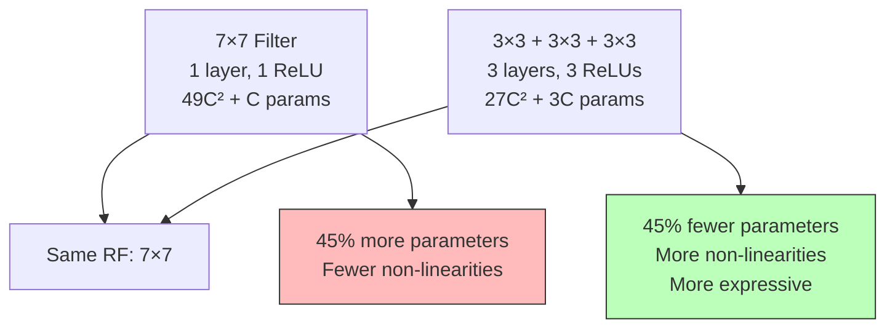
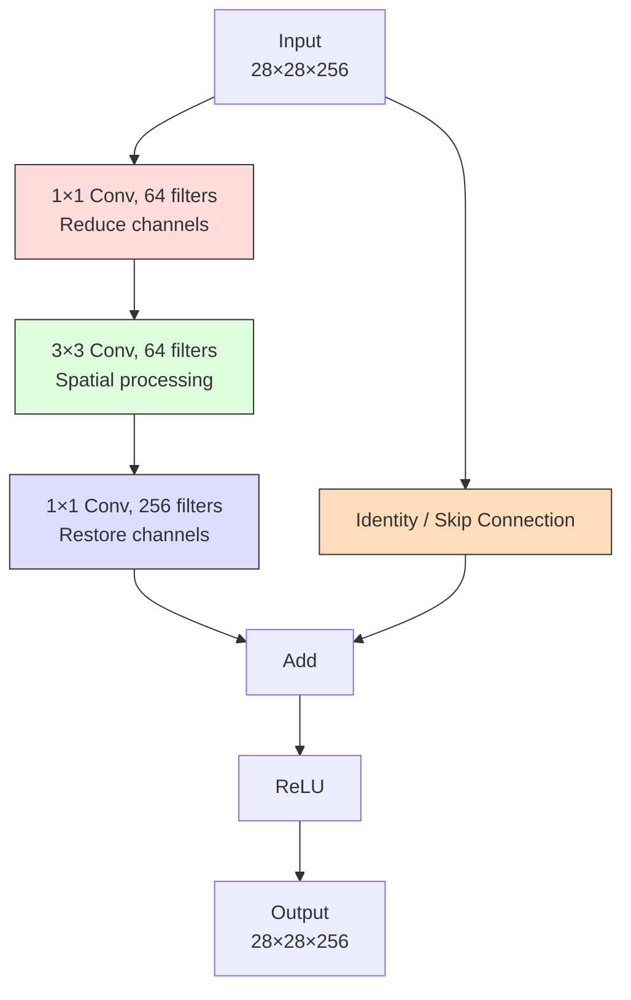

# 4. The Mathematics of Receptive Fields and 1×1 Convolutions

## Receptive Field: Definition and Intuitive Explanation

The **receptive field** of a neuron in a CNN is the region of the original input image that influences the output of that neuron. In other words, it is the set of input pixels that, if changed, would cause the neuron's output to change. Understanding receptive fields is crucial because it determines how much context each neuron "sees" — a neuron with a small receptive field captures fine-grained, local details, while a neuron with a large receptive field captures coarse-grained, global patterns.

To build intuition, consider a single neuron in the first convolutional layer of a CNN that uses 3×3 filters. This neuron's output is computed from a 3×3 patch of the input image, so its receptive field is exactly 3×3 — it "sees" only a 3×3 region of the input. If the image contains a cat, this neuron might see just a few pixels of the cat's fur — it has no idea that the pixels belong to a cat; it can only detect a local pattern (like an edge or a color gradient) in that small patch.

Now consider a neuron in the second convolutional layer, also using 3×3 filters. Its input is the feature map produced by the first layer. Each 3×3 patch of this feature map corresponds to a 5×5 region of the original input (because each element in the first layer's feature map has a 3×3 receptive field, and the 3×3 patch in the second layer covers three such elements in each dimension). So the second-layer neuron's receptive field is 5×5. It "sees" a larger portion of the input and can detect more complex patterns that span a larger area.

As we go deeper into the network, the receptive field grows: each additional layer increases the size of the region of the input that influences each output neuron. This progressive growth is what enables deep CNNs to detect increasingly complex and large-scale features — early layers detect edges (small receptive field), middle layers detect textures and patterns (medium receptive field), and later layers detect objects and scenes (large receptive field).

> [!tip] The Window Analogy
> Think of the receptive field as a window through which a neuron looks at the input image. Neurons in early layers look through small windows (3×3) and see only local details. Neurons in later layers look through progressively larger windows and can see the "big picture." The challenge of CNN design is to ensure that neurons at the appropriate depth have a receptive field large enough to capture the features they need to detect.

---

## The Iterative Formula for Receptive Field Calculation

Computing the receptive field layer by layer requires a systematic approach. The receptive field of a neuron at layer $L$ depends on the receptive fields and strides of all the layers below it. We can compute it iteratively using two formulas.

### The Jump (Effective Stride)

The **jump** $j_L$ (also called the effective stride or the feature stride) at layer $L$ represents the distance in the original input image between two adjacent pixels in the feature map at layer $L$. For the first layer, the jump equals the stride of that layer. For subsequent layers, the jump accumulates multiplicatively:

$$j_L = j_{L-1} \times S_L$$

where $S_L$ is the stride of layer $L$. The base case is $j_0 = 1$ (the distance between adjacent pixels in the original image is 1 pixel).

### The Receptive Field Size

The **receptive field** $R_L$ at layer $L$ is computed as:

$$R_L = R_{L-1} + (K_L - 1) \times j_{L-1}$$

where $K_L$ is the kernel size at layer $L$ and $j_{L-1}$ is the jump at layer $L-1$. The base case is $R_0 = 1$ (a single pixel in the input has a receptive field of size 1).

### Intuition Behind the Formula

The formula $R_L = R_{L-1} + (K_L - 1) \times j_{L-1}$ can be understood as follows. A neuron at layer $L$ computes its output from a $K_L \times K_L$ patch of the feature map at layer $L-1$. Each element of this patch has a receptive field of size $R_{L-1}$ in the original input. The key insight is that adjacent elements in the layer $L-1$ feature map are separated by $j_{L-1}$ pixels in the original input. So when we extend from the receptive field of one element to the receptive field of a $K_L \times K_L$ patch, we add $(K_L - 1)$ intervals of size $j_{L-1}$ in each dimension. Starting from the $R_{L-1}$-sized receptive field of the first element, we extend by $(K_L - 1) \times j_{L-1}$ pixels to cover the full patch.

---

## Complete 5-Layer Worked Example

Let us work through a complete example with 5 layers, computing the receptive field and jump at each layer. We will use the following architecture:

| Layer | Kernel Size ($K_L$) | Stride ($S_L$) | Padding |
|-------|---------------------|----------------|---------|
| 1     | 3                   | 1              | 1       |
| 2     | 3                   | 1              | 1       |
| 3     | 3                   | 2              | 1       |
| 4     | 3                   | 1              | 1       |
| 5     | 3                   | 1              | 1       |

**Initialization:**
- $R_0 = 1$ (the receptive field of a single input pixel is 1)
- $j_0 = 1$ (adjacent input pixels are 1 pixel apart)

**Layer 1:**
$$j_1 = j_0 \times S_1 = 1 \times 1 = 1$$
$$R_1 = R_0 + (K_1 - 1) \times j_0 = 1 + (3 - 1) \times 1 = 1 + 2 = 3$$

A neuron in layer 1 has a receptive field of 3×3 — it sees a 3×3 patch of the original image.

**Layer 2:**
$$j_2 = j_1 \times S_2 = 1 \times 1 = 1$$
$$R_2 = R_1 + (K_2 - 1) \times j_1 = 3 + (3 - 1) \times 1 = 3 + 2 = 5$$

A neuron in layer 2 has a receptive field of 5×5. The 3×3 filter at layer 2 spans three elements in the layer 1 feature map, and since each of those elements sees a 3×3 patch of the input (with overlap of 2 pixels between adjacent elements), the total input region covered is 5×5.

**Layer 3 (stride = 2):**
$$j_3 = j_2 \times S_3 = 1 \times 2 = 2$$
$$R_3 = R_2 + (K_3 - 1) \times j_2 = 5 + (3 - 1) \times 1 = 5 + 2 = 7$$

A neuron in layer 3 has a receptive field of 7×7. Notice that the jump doubled (from 1 to 2) because of the stride-2 convolution. This means that adjacent neurons in the layer 3 feature map are "looking at" input regions that are 2 pixels apart, rather than 1 pixel apart.

**Layer 4:**
$$j_4 = j_3 \times S_4 = 2 \times 1 = 2$$
$$R_4 = R_3 + (K_4 - 1) \times j_3 = 7 + (3 - 1) \times 2 = 7 + 4 = 11$$

A neuron in layer 4 has a receptive field of 11×11. Notice that the receptive field grew by 4 (instead of 2) because the jump at layer 3 is 2. Each additional 3×3 filter at this level extends the receptive field by 2 intervals of 2 pixels each.

**Layer 5:**
$$j_5 = j_4 \times S_5 = 2 \times 1 = 2$$
$$R_5 = R_4 + (K_5 - 1) \times j_4 = 11 + (3 - 1) \times 2 = 11 + 4 = 15$$

A neuron in layer 5 has a receptive field of 15×15. Through just 5 layers of 3×3 convolutions (with one stride-2 layer), a single neuron can "see" a 15×15 region of the original input.

| Layer | $K_L$ | $S_L$ | $j_L$ | $R_L$ |
|-------|--------|--------|--------|--------|
| 0 (Input) | — | — | 1 | 1 |
| 1 | 3 | 1 | 1 | 3 |
| 2 | 3 | 1 | 1 | 5 |
| 3 | 3 | 2 | 2 | 7 |
| 4 | 3 | 1 | 2 | 11 |
| 5 | 3 | 1 | 2 | 15 |

```python
def compute_receptive_field(layers):
    """
    Compute receptive field and jump for each layer.
    
    Parameters:
        layers: list of tuples (kernel_size, stride) for each layer
    
    Returns:
        list of dicts with layer info including RF and jump
    """
    results = []
    r = 1   # Receptive field starts at 1 (single pixel)
    j = 1   # Jump starts at 1 (adjacent pixels are 1 apart)
    
    for i, (k, s) in enumerate(layers, 1):
        r = r + (k - 1) * j   # Update receptive field
        j = j * s              # Update jump (effective stride)
        results.append({
            'layer': i,
            'kernel_size': k,
            'stride': s,
            'jump': j,
            'receptive_field': r
        })
    
    return results

# Our 5-layer example
layers = [(3, 1), (3, 1), (3, 2), (3, 1), (3, 1)]
results = compute_receptive_field(layers)

for r in results:
    print(f"Layer {r['layer']}: K={r['kernel_size']}, S={r['stride']}, "
          f"Jump={r['jump']}, RF={r['receptive_field']}")
# Output:
# Layer 1: K=3, S=1, Jump=1, RF=3
# Layer 2: K=3, S=1, Jump=1, RF=5
# Layer 3: K=3, S=2, Jump=2, RF=7
# Layer 4: K=3, S=1, Jump=2, RF=11
# Layer 5: K=3, S=1, Jump=2, RF=15
```

---

## Why Stacking 3×3 Filters Increases Receptive Field: Mathematical Proof

One of the most important architectural insights in CNN design is that **stacking multiple small filters is more efficient than using a single large filter**. Specifically, two consecutive 3×3 convolutional layers have the same receptive field as a single 5×5 layer, but with fewer parameters and more non-linearity. Let us prove this with the receptive field formula.

### Two 3×3 Layers vs. One 5×5 Layer

**Two 3×3 layers (both stride 1):**
- Layer 1: $R_1 = 1 + (3-1) \times 1 = 3$, $j_1 = 1$
- Layer 2: $R_2 = 3 + (3-1) \times 1 = 5$, $j_2 = 1$

Receptive field after two layers: **5×5**

**One 5×5 layer (stride 1):**
- Layer 1: $R_1 = 1 + (5-1) \times 1 = 5$, $j_1 = 1$

Receptive field after one layer: **5×5**

Both configurations produce the same 5×5 receptive field. Now let us compare their parameter counts, assuming $C$ input channels and $C$ output channels:

**Two 3×3 layers:**
- Layer 1: $C \times (3 \times 3 \times C + 1) = 9C^2 + C$ parameters
- Layer 2: $C \times (3 \times 3 \times C + 1) = 9C^2 + C$ parameters
- Total: $18C^2 + 2C$ parameters

**One 5×5 layer:**
- Layer 1: $C \times (5 \times 5 \times C + 1) = 25C^2 + C$ parameters

For $C = 64$: Two 3×3 layers use $18 \times 4096 + 128 = 73{,}856$ parameters, while one 5×5 layer uses $25 \times 4096 + 64 = 102{,}464$ parameters. The two 3×3 layers use **28% fewer parameters** while providing the same receptive field.

### Three 3×3 Layers vs. One 7×7 Layer

**Three 3×3 layers (all stride 1):**
- Layer 1: $R_1 = 3$, Layer 2: $R_2 = 5$, Layer 3: $R_3 = 7$

Receptive field: **7×7**

**One 7×7 layer (stride 1):**

Receptive field: **7×7**

Parameter comparison for $C$ channels:

**Three 3×3 layers:** $3 \times (9C^2 + C) = 27C^2 + 3C$

**One 7×7 layer:** $49C^2 + C$

For $C = 64$: Three 3×3 layers use $27 \times 4096 + 192 = 110{,}784$ parameters, while one 7×7 layer uses $49 \times 4096 + 64 = 200{,}768$ parameters. The three 3×3 layers use **45% fewer parameters**.

### The Additional Benefit of More Non-Linearity

Beyond parameter savings, stacking small filters provides more non-linear transformations. Each 3×3 convolutional layer is followed by a ReLU activation, so two 3×3 layers introduce two ReLU operations, while a single 5×5 layer introduces only one. More non-linear activations mean the network can learn more complex decision boundaries and more expressive feature representations. This is a significant advantage: the extra ReLU between the two 3×3 layers allows the network to compose features in a non-linear way, which increases the representational power of the model without adding any parameters (ReLU is parameter-free).

> [!info] The VGG Insight
> This analysis was the key insight behind the VGG architecture (Simonyan & Zisserman, 2014). VGG demonstrated that by replacing large filters (7×7, 5×5) with stacks of 3×3 filters, you can build deeper networks that are more parameter-efficient and more expressive. This principle — use only 3×3 filters and go deeper — has become the dominant design philosophy in modern CNN architecture.

---

## The Golden Rule of Depth

The **Golden Rule of Depth** states: *for a given receptive field requirement, prefer a deeper stack of small filters over a shallower stack of large filters*. This rule follows directly from our analysis above: stacking small filters provides the same receptive field with fewer parameters and more non-linearity. The trade-off is that deeper networks are potentially harder to train (due to vanishing gradients), but modern techniques like residual connections (ResNet), batch normalization, and careful initialization have largely addressed this challenge.

The practical implications of this rule are profound:
1. **3×3 is the standard**: Almost all modern CNNs use exclusively 3×3 filters in their convolutional layers (except occasionally a 7×7 filter in the very first layer, as in ResNet).
2. **Depth is preferred over width**: Instead of widening a layer (using more channels), modern architectures prefer to add more layers, increasing the depth and thus the receptive field and representational capacity.
3. **Receptive field grows linearly with depth**: Each additional 3×3 layer (with stride 1) increases the receptive field by 2 in each dimension. So a 10-layer network of 3×3 convolutions has a receptive field of $1 + 10 \times 2 = 21$, while a 20-layer network has a receptive field of 41.



---

## 1×1 Convolutions: Why They Seem Useless and What They Actually Do

At first glance, a 1×1 convolution seems pointless. A 1×1 filter looks at only one spatial position — it does not capture any spatial context from neighboring pixels. If convolution is about detecting local patterns, what pattern can you detect in a single pixel? This was a common misconception before the introduction of the Network-in-Network (NiN) architecture in 2013, which demonstrated the remarkable power of 1×1 convolutions.

The key insight is that while a 1×1 convolution does not combine spatial information (it looks at one pixel at a time), it **combines channel information**. At each spatial position, the input is a vector of $C_{\text{in}}$ values (one per channel), and the 1×1 convolution computes a linear combination of these values, weighted by the filter's parameters, to produce $C_{\text{out}}$ output values. This is equivalent to applying a fully connected layer independently at every spatial position.

### Cross-Channel Mixing

The primary function of a 1×1 convolution is to mix information across channels at each spatial position. For example, consider a feature map with 256 channels where channel 17 detects horizontal edges and channel 89 detects red color. A 1×1 convolution can learn to combine these two channels (and potentially all 256 channels) to produce a new feature that specifically represents "red horizontal edges" — a feature that was not explicitly present in any single input channel but emerges from their combination.

Mathematically, a 1×1 convolution with $C_{\text{out}}$ filters and $C_{\text{in}}$ input channels has a weight tensor of size $1 \times 1 \times C_{\text{in}} \times C_{\text{out}}$. At each spatial position $(i, j)$, the output is:

$$\text{Output}[i, j, k] = \sum_{c=1}^{C_{\text{in}}} \text{Input}[i, j, c] \cdot \text{Weight}[0, 0, c, k] + \text{Bias}[k]$$

This is exactly a matrix multiplication applied independently at each spatial position: for each $(i, j)$, the $C_{\text{in}}$-dimensional input vector is multiplied by a $C_{\text{in}} \times C_{\text{out}}$ weight matrix to produce a $C_{\text{out}}$-dimensional output vector.

### Dimensionality Reduction (The Bottleneck Mechanism)

One of the most important applications of 1×1 convolutions is **channel reduction** — reducing the number of channels (and thus the computational cost) before applying a more expensive spatial convolution. This technique is called a **bottleneck** because it narrows the channel dimension before widening it again, creating a "bottleneck" shape in the channel counts.

#### Complete Worked Example: The Bottleneck

Consider an input feature map of size $28 \times 28 \times 512$ (28×28 spatial, 512 channels). We want to apply a 3×3 convolution with 512 output channels. Let us compare the direct approach with the bottleneck approach.

**Direct approach: 3×3 convolution, 512 → 512**

Parameters: $512 \times (3 \times 3 \times 512 + 1) = 512 \times 4{,}609 = 2{,}359{,}808$

FLOPs per spatial position: $3 \times 3 \times 512 = 4{,}608$ multiply-adds
Total FLOPs: $4{,}608 \times 512 \times 28 \times 28 = 1{,}851{,}398{,}144$ (approximately 1.85 billion)

**Bottleneck approach: 1×1 conv (512→64) → 3×3 conv (64→64) → 1×1 conv (64→512)**

- 1×1 conv (512 → 64): Parameters = $64 \times (1 \times 1 \times 512 + 1) = 32{,}832$
  - FLOPs: $512 \times 64 \times 28 \times 28 = 25{,}690{,}112$
- 3×3 conv (64 → 64): Parameters = $64 \times (3 \times 3 \times 64 + 1) = 36{,}928$
  - FLOPs: $3 \times 3 \times 64 \times 64 \times 28 \times 28 = 28{,}901{,}376$
- 1×1 conv (64 → 512): Parameters = $512 \times (1 \times 1 \times 64 + 1) = 33{,}280$
  - FLOPs: $64 \times 512 \times 28 \times 28 = 25{,}690{,}112$

Total parameters: $32{,}832 + 36{,}928 + 33{,}280 = 103{,}040$
Total FLOPs: $25{,}690{,}112 + 28{,}901{,}376 + 25{,}690{,}112 = 80{,}281{,}600$

**Comparison:**

| Approach | Parameters | FLOPs |
|----------|-----------|-------|
| Direct (3×3, 512→512) | 2,359,808 | 1,851,398,144 |
| Bottleneck (1×1→3×3→1×1) | 103,040 | 80,281,600 |
| **Ratio** | **22.9× fewer** | **23.1× fewer** |

The bottleneck approach uses approximately **23 times fewer parameters and FLOPs** than the direct approach, while producing an output with the same spatial size (28×28) and the same number of channels (512). This dramatic reduction is possible because the expensive 3×3 convolution operates on only 64 channels instead of 512, and the 1×1 convolutions handle the channel transformations before and after.

> [!warning] Is There a Cost to the Bottleneck?
> The bottleneck does reduce the representational capacity compared to the direct 3×3 convolution, because the intermediate representation has only 64 channels instead of 512. This means that some information may be lost in the compression step. In practice, however, the bottleneck approach works extremely well — the saved computational resources can be used to build deeper or wider networks, more than compensating for the slight per-layer capacity reduction. The ResNet paper (He et al., 2015) showed that bottleneck residual blocks achieve comparable or better accuracy than non-bottleneck blocks while being significantly more efficient.

---

## How 1×1 Convolutions Add Non-Linearity Without Changing Spatial Dimensions

Another important property of 1×1 convolutions is that they can add a non-linear transformation without altering the spatial dimensions of the feature map. Since a 1×1 filter does not change the spatial resolution (the output is the same height and width as the input, assuming stride 1 and no padding), and if we set $C_{\text{out}} = C_{\text{in}}$, the output has exactly the same dimensions as the input. The only change is that the values at each position have been transformed by a learned linear combination followed by a non-linear activation function.

This is particularly useful when you want to increase the depth of a network without changing the spatial resolution. For example, in the Network-in-Network architecture, 1×1 convolutions are stacked after 3×3 convolutions to add additional non-linear transformations at each spatial position, increasing the model's representational capacity without reducing the spatial resolution.

Consider a feature map of size $H \times W \times C$. Applying a 1×1 convolution with $C$ filters and a ReLU activation transforms each $C$-dimensional feature vector at position $(i, j)$ through the operation $\text{ReLU}(\mathbf{W}\mathbf{x} + \mathbf{b})$, where $\mathbf{W} \in \mathbb{R}^{C \times C}$ and $\mathbf{b} \in \mathbb{R}^{C}$. This is a learned, non-linear transformation applied independently at every spatial position — effectively a tiny fully connected network with one hidden layer, applied pixel by pixel.

---

## Network-in-Network Concept

The **Network-in-Network (NiN)** architecture, proposed by Lin et al. in 2013, was the first to systematically use 1×1 convolutions as a core architectural element. The key idea was to build "micro-networks" within each convolutional layer by stacking a 3×3 convolution followed by one or more 1×1 convolutions. This micro-network acts like a small fully connected network applied at each spatial position, allowing the model to learn more complex per-pixel feature transformations than a single convolutional layer could provide.

The NiN architecture consisted of multiple **mlpconv layers**, each of which was a stack of: 3×3 conv → ReLU → 1×1 conv → ReLU → 1×1 conv → ReLU. This structure was revolutionary because it demonstrated that 1×1 convolutions could dramatically increase the representational power of a convolutional layer without increasing the spatial receptive field. The 1×1 convolutions refine the features extracted by the 3×3 convolution, combining channels in learned ways that are more expressive than a single linear transformation.

NiN also introduced the use of **Global Average Pooling (GAP)** at the end of the network instead of fully connected layers. GAP computes the average of each feature map across all spatial positions, producing one value per feature map. This eliminates the need for flattening and reduces the number of parameters dramatically, while also acting as a structural regularizer. The combination of 1×1 convolutions and GAP became a template for many subsequent architectures.

```python
import torch
import torch.nn as nn

# Network-in-Network (NiN) mlpconv block
class MLPConvBlock(nn.Module):
    """A single mlpconv block from the NiN architecture."""
    def __init__(self, in_channels, out_channels):
        super().__init__()
        self.block = nn.Sequential(
            # 3x3 convolution: extracts spatial features
            nn.Conv2d(in_channels, out_channels, kernel_size=3, padding=1),
            nn.ReLU(inplace=True),
            # 1x1 convolution: cross-channel mixing (adds non-linearity)
            nn.Conv2d(out_channels, out_channels, kernel_size=1),
            nn.ReLU(inplace=True),
            # Another 1x1 convolution: further cross-channel mixing
            nn.Conv2d(out_channels, out_channels, kernel_size=1),
            nn.ReLU(inplace=True),
        )
    
    def forward(self, x):
        return self.block(x)  # Pass input through the mlpconv block

# The complete NiN architecture (simplified)
class NiN(nn.Module):
    def __init__(self, num_classes=10):
        super().__init__()
        self.features = nn.Sequential(
            MLPConvBlock(3, 192),       # First mlpconv block: 3→192 channels
            nn.MaxPool2d(3, stride=2, padding=1),  # Downsample: 32→16 (for CIFAR)
            MLPConvBlock(192, 160),     # Second mlpconv block: 192→160
            nn.MaxPool2d(3, stride=2, padding=1),  # Downsample: 16→8
            MLPConvBlock(160, 96),      # Third mlpconv block: 160→96
            nn.MaxPool2d(3, stride=2, padding=1),  # Downsample: 8→4
        )
        self.classifier = nn.Sequential(
            # Final 1x1 convolution instead of FC layer: produces num_classes channels
            nn.Conv2d(96, num_classes, kernel_size=1),
            nn.ReLU(inplace=True),
            # Global Average Pooling: averages each channel over all spatial positions
            nn.AdaptiveAvgPool2d(1),    # Output shape: (batch, num_classes, 1, 1)
            nn.Flatten(),                # Flatten to (batch, num_classes)
        )
    
    def forward(self, x):
        x = self.features(x)    # Extract features through mlpconv blocks
        x = self.classifier(x)  # Classify using 1x1 conv + GAP
        return x
```

---

## The Role of 1×1 Convolutions in Inception and ResNet (Preview)

### Inception Module

The Inception architecture (GoogLeNet, Szegedy et al. 2014) uses 1×1 convolutions extensively as dimensionality reduction tools within its multi-branch modules. An Inception module applies multiple different filter sizes (1×1, 3×3, 5×5) in parallel and concatenates their outputs. Without 1×1 convolutions for dimensionality reduction, the concatenation of many feature maps would lead to a channel explosion. The 1×1 convolutions are placed *before* the 3×3 and 5×5 convolutions to reduce the number of input channels, keeping the computational cost manageable. This use of 1×1 convolutions as "channel compressors" before expensive spatial convolutions is exactly the bottleneck mechanism we analyzed above.

### ResNet Bottleneck Block

ResNet (He et al. 2015) adopted the bottleneck design for its deeper variants (ResNet-50, ResNet-101, ResNet-152). The bottleneck residual block consists of three layers: a 1×1 convolution that reduces channels (from 256 to 64), a 3×3 convolution that processes spatial features at the reduced channel count, and a 1×1 convolution that restores the channel count (from 64 to 256). The residual (skip) connection bypasses this bottleneck, allowing the gradient to flow directly through the block. This design enables training of very deep networks (152 layers) that would be computationally infeasible without the parameter and FLOP savings provided by the bottleneck.



> [!tip] Summary of 1×1 Convolution Roles
> 1. **Cross-channel mixing**: Combine information across channels at each spatial position.
> 2. **Dimensionality reduction (bottleneck)**: Reduce channel count before expensive spatial convolutions.
> 3. **Non-linearity injection**: Add learned non-linear transformations without changing spatial dimensions.
> 4. **Channel projection**: Change the number of channels to match architectural requirements (e.g., for skip connections).
> 5. **Classification via GAP**: Replace fully connected layers with 1×1 conv + global average pooling.
