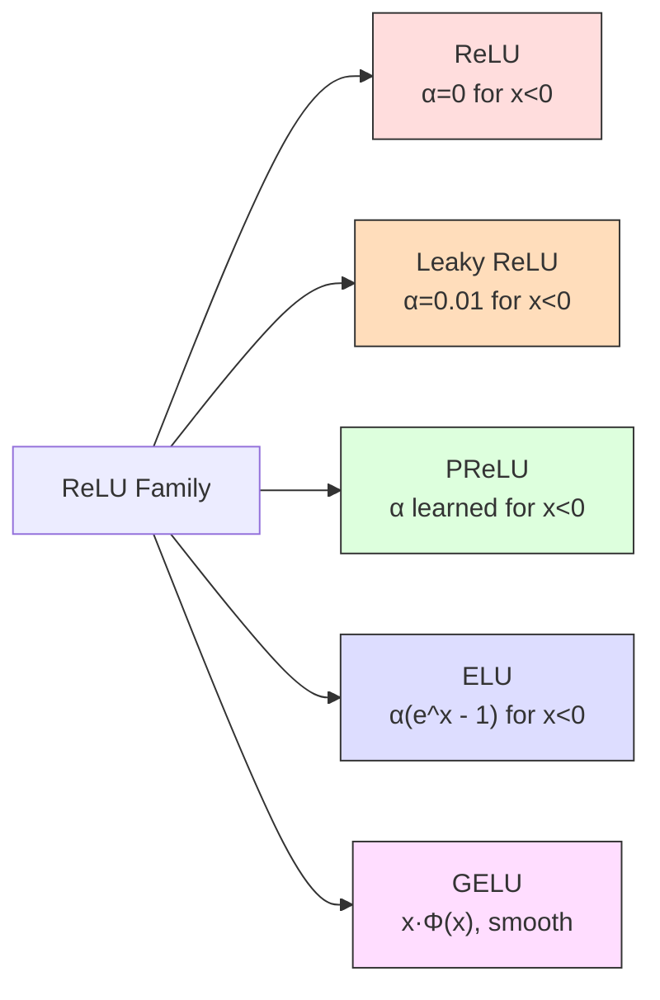
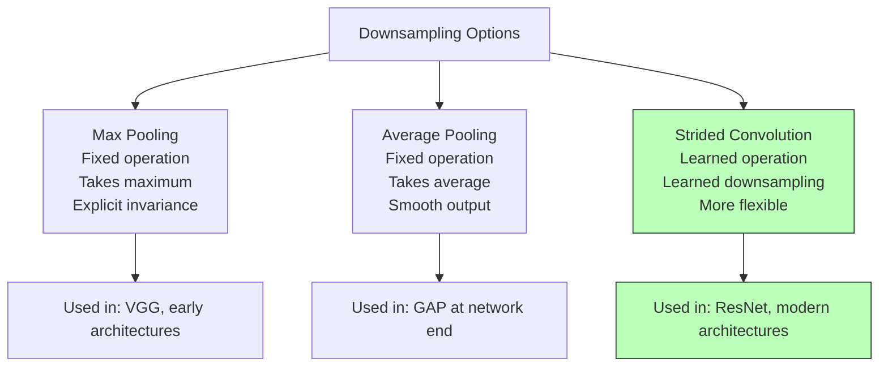

# 5. Activation and Pooling Layers

## Why Non-Linearity Is Essential

Before diving into specific activation functions and pooling operations, we must establish the most fundamental mathematical principle underlying neural networks: **non-linearity is essential**. Without non-linear activation functions, no matter how many layers a neural network has, it can only represent linear transformations. This is a mathematical fact with a clean proof, and understanding it deeply will motivate everything that follows.

### Proof: Stacking Linear Layers Is Equivalent to a Single Linear Layer

Consider a network with $L$ layers, where each layer computes a purely linear transformation (no activation function, or equivalently, the identity activation function $f(x) = x$). Let the $l$-th layer compute:

$$\mathbf{z}^{(l)} = \mathbf{W}^{(l)} \mathbf{a}^{(l-1)} + \mathbf{b}^{(l)}$$

where $\mathbf{W}^{(l)}$ is the weight matrix and $\mathbf{b}^{(l)}$ is the bias vector. We will show by induction that the entire network is equivalent to a single linear transformation.

**Base case ($L = 1$):** A single layer is already linear: $\mathbf{z}^{(1)} = \mathbf{W}^{(1)} \mathbf{x} + \mathbf{b}^{(1)}$.

**Inductive step:** Assume that $L-1$ linear layers are equivalent to a single linear transformation: $\mathbf{a}^{(L-1)} = \mathbf{W}' \mathbf{x} + \mathbf{b}'$ for some weight matrix $\mathbf{W}'$ and bias $\mathbf{b}'$. Then the $L$-th layer computes:

$$\mathbf{z}^{(L)} = \mathbf{W}^{(L)} \mathbf{a}^{(L-1)} + \mathbf{b}^{(L)} = \mathbf{W}^{(L)} (\mathbf{W}' \mathbf{x} + \mathbf{b}') + \mathbf{b}^{(L)}$$
$$= \underbrace{\mathbf{W}^{(L)} \mathbf{W}'}_{\text{new weight matrix}} \mathbf{x} + \underbrace{\mathbf{W}^{(L)} \mathbf{b}' + \mathbf{b}^{(L)}}_{\text{new bias vector}}$$

This is a single linear transformation with weight matrix $\mathbf{W}^{(L)} \mathbf{W}'$ and bias $\mathbf{W}^{(L)} \mathbf{b}' + \mathbf{b}^{(L)}$. Therefore, by induction, **any number of linear layers collapses to a single linear layer**.

This means that a network without non-linear activations cannot learn any function that is not linearly separable, regardless of its depth. It cannot learn XOR, it cannot learn circular decision boundaries, and it certainly cannot learn the complex hierarchical features needed for image recognition. Non-linear activation functions break this collapse by introducing non-linearity at each layer, ensuring that the composition of layers is more expressive than any single linear transformation.

```python
import numpy as np
import matplotlib.pyplot as plt

# Demonstration: Linear layers collapse, non-linear layers do not
np.random.seed(42)

# Create a 2D classification problem (XOR) that is NOT linearly separable
X = np.array([[0, 0], [0, 1], [1, 0], [1, 1]], dtype=float)
y = np.array([0, 1, 1, 0])  # XOR labels

# Try a 10-layer linear network (should fail to learn XOR)
W1 = np.random.randn(2, 10)  # First layer weights
b1 = np.random.randn(10)     # First layer biases
W2 = np.random.randn(10, 1)  # Second layer weights
b2 = np.random.randn(1)      # Second layer biases

# Forward pass through 2 linear layers (no activation)
z1 = X @ W1 + b1             # Shape: (4, 10) — linear transformation
z2 = z1 @ W2 + b2            # Shape: (4, 1) — another linear transformation

# The composition z2 is equivalent to a single linear transformation:
W_combined = W1 @ W2          # Combined weight matrix: (2, 1)
b_combined = b1 @ W2 + b2    # Combined bias: (1,)
z_combined = X @ W_combined + b_combined  # Same result as z2

print("Two-layer linear output:", z2.flatten())
print("Combined linear output:", z_combined.flatten())
print("Are they equal?", np.allclose(z2, z_combined))  # True — collapsed!
print("Can a linear model separate XOR? No — XOR is not linearly separable.")
```

---

## ReLU: The Rectified Linear Unit

### Definition and Graph Description

The **Rectified Linear Unit (ReLU)** is defined as:

$$\text{ReLU}(x) = \max(0, x) = \begin{cases} x & \text{if } x > 0 \\ 0 & \text{if } x \leq 0 \end{cases}$$

Graphically, ReLU looks like a hockey stick: it is zero for all negative inputs (the flat part along the x-axis) and then rises with a slope of 1 for all positive inputs (the diagonal line going up to the right). The function is continuous everywhere and differentiable everywhere except at $x = 0$, where the left derivative is 0 and the right derivative is 1. In practice, this non-differentiability at a single point is never a problem — the probability of any input being exactly zero is negligible, and even if it occurs, we simply define the derivative at zero to be either 0 or 1 (convention varies, but the choice makes no practical difference).

### What ReLU Does to Feature Maps

When ReLU is applied to a feature map, it sets all negative values to zero while preserving all positive values unchanged. This has several important effects:

1. **Sparsification**: A typical feature map after convolution contains both positive and negative values. Positive values indicate the presence of a feature, while negative values indicate the absence of the feature or the presence of an opposite feature. By zeroing out the negative values, ReLU ensures that only "detected" features propagate forward, creating a sparse representation. Sparsity is beneficial because it makes the representation more efficient (most values are zero) and more interpretable (each active neuron clearly indicates a feature detection).

2. **Feature selection**: ReLU acts as a simple feature selector — if a convolutional filter does not detect its target pattern at a given location (producing a negative or zero response), that information is discarded. Only detections that exceed the implicit threshold of zero are passed to the next layer.

3. **No saturation for positive inputs**: Unlike sigmoid and tanh, which saturate (approach a constant value) for large inputs, ReLU has a constant gradient of 1 for all positive inputs. This means that large positive activations are preserved faithfully, without being compressed into a narrow range.

### Computational Cost

One of ReLU's major advantages is its computational simplicity. The forward pass requires only a comparison with zero ($\max(0, x)$), and the backward pass (gradient computation) requires only checking the sign of the input:

$$\frac{d}{dx} \text{ReLU}(x) = \begin{cases} 1 & \text{if } x > 0 \\ 0 & \text{if } x \leq 0 \end{cases}$$

This is orders of magnitude cheaper than computing the exponential function required for sigmoid ($\sigma(x) = \frac{1}{1+e^{-x}}$) or tanh ($\tanh(x) = \frac{e^x - e^{-x}}{e^x + e^{-x}}$). In a large network with millions of activations, this computational savings is significant.

### Why ReLU Helps with Vanishing Gradients

The **vanishing gradient problem** occurs when the gradient of the loss function with respect to the parameters of early layers becomes extremely small, making learning prohibitively slow. This problem is particularly severe with sigmoid and tanh activations, whose gradients are at most 0.25 and 1.0 respectively, and decrease rapidly as the input moves away from zero.

With ReLU, the gradient for positive inputs is exactly 1.0 — it does not diminish, no matter how large the input is. When backpropagating through many layers, the gradient is multiplied by the activation derivative at each layer. With sigmoid, each multiplication reduces the gradient by a factor of at most 0.25, so after just 10 layers, the gradient can be reduced by a factor of $0.25^{10} \approx 10^{-6}$. With ReLU, the gradient passes through unchanged for all positive activations, so even very deep networks can maintain a strong gradient signal in their early layers. This property was instrumental in enabling the training of very deep networks (AlexNet had 8 layers; modern networks have hundreds).

> [!warning] The Dying ReLU Problem
> While ReLU solves the vanishing gradient problem for positive inputs, it introduces a new problem: the "dying ReLU" problem. If a neuron's weights are updated such that its pre-activation value $\mathbf{w}^\top \mathbf{x} + b$ is negative for all training examples, then the neuron outputs zero for all inputs, and its gradient is also zero for all inputs. This means the neuron will never receive a gradient signal and will never recover — it is permanently "dead." This can happen when a large gradient update pushes the weights too far in the negative direction. The probability of a neuron dying increases with the learning rate and with the depth of the network. Leaky ReLU and its variants were designed specifically to address this problem.

---

## ReLU Variants

### Leaky ReLU

**Leaky ReLU** introduces a small, positive slope for negative inputs, preventing the gradient from being exactly zero:

$$\text{LeakyReLU}(x) = \begin{cases} x & \text{if } x > 0 \\ \alpha x & \text{if } x \leq 0 \end{cases}$$

where $\alpha$ is a small constant, typically 0.01. The derivative is:

$$\frac{d}{dx} \text{LeakyReLU}(x) = \begin{cases} 1 & \text{if } x > 0 \\ \alpha & \text{if } x \leq 0 \end{cases}$$

The key advantage of Leaky ReLU over standard ReLU is that it solves the dying ReLU problem. Even when a neuron's pre-activation is consistently negative, it still receives a gradient of $\alpha$ (instead of 0), which allows the weights to be updated and the neuron to potentially recover. The small slope $\alpha$ for negative values ensures that the neuron's output is not exactly zero, providing a "leak" of information that keeps the gradient flowing.

The trade-off is that Leaky ReLU introduces a hyperparameter ($\alpha$) that must be chosen. The value 0.01 is a common default, but the optimal value may vary across tasks and architectures. In practice, the performance difference between ReLU and Leaky ReLU is usually small, but Leaky ReLU is more robust to the dying neuron problem.

### PReLU (Parametric ReLU)

**PReLU** generalizes Leaky ReLU by making the negative slope $\alpha$ a learnable parameter rather than a fixed hyperparameter:

$$\text{PReLU}(x) = \begin{cases} x & \text{if } x > 0 \\ \alpha_i x & \text{if } x \leq 0 \end{cases}$$

where $\alpha_i$ is learned through backpropagation, just like the weights and biases. The subscript $i$ indicates that a different $\alpha$ can be learned for each channel (or even each neuron). This allows the network to adaptively determine the optimal slope for negative inputs on a per-channel basis.

PReLU was introduced by He et al. (2015) in the same paper that introduced ResNet. The authors found that PReLU slightly outperformed ReLU on large-scale image classification tasks, as the learned slopes were typically very small (between 0.01 and 0.25), suggesting that a small but non-zero slope for negative values is indeed beneficial. The additional parameters are negligible (one per channel), so PReLU adds essentially no computational cost or overfitting risk.

### ELU (Exponential Linear Unit)

**ELU** uses an exponential function for negative inputs, which provides a smoother transition and ensures that the mean activation is closer to zero:

$$\text{ELU}(x) = \begin{cases} x & \text{if } x > 0 \\ \alpha (e^x - 1) & \text{if } x \leq 0 \end{cases}$$

where $\alpha$ is a hyperparameter (typically 1.0). The key properties of ELU are:

1. **Smooth transition**: For negative inputs, ELU approaches $-\alpha$ asymptotically, providing a smooth curve rather than the sharp corner of ReLU at $x = 0$. This smoothness can lead to faster convergence during training.
2. **Zero-mean activation**: ReLU activations have a positive mean (since all negative values are set to zero), which can slow down learning by creating a bias shift. ELU pushes the mean activation toward zero by allowing negative values (bounded by $-\alpha$), which reduces the internal covariate shift and speeds up convergence.
3. **No dead neurons**: Like Leaky ReLU, ELU provides a non-zero gradient for negative inputs, preventing the dying ReLU problem.

The disadvantage of ELU is that it requires computing the exponential function for negative inputs, which is more expensive than the simple comparison used by ReLU. However, this cost is usually negligible compared to the cost of convolution operations.

### GELU (Gaussian Error Linear Unit)

**GELU** is a smooth approximation of ReLU that has become the default activation function in many modern architectures, particularly Transformers (BERT, GPT, ViT):

$$\text{GELU}(x) = x \cdot \Phi(x)$$

where $\Phi(x)$ is the cumulative distribution function of the standard normal distribution:

$$\Phi(x) = \frac{1}{2}\left[1 + \text{erf}\left(\frac{x}{\sqrt{2}}\right)\right]$$

and $\text{erf}$ is the error function. GELU can be interpreted as multiplying the input $x$ by the probability that $x$ falls in the positive region of a Gaussian distribution. For large positive $x$, $\Phi(x) \approx 1$, so $\text{GELU}(x) \approx x$ (like ReLU). For large negative $x$, $\Phi(x) \approx 0$, so $\text{GELU}(x) \approx 0$ (like ReLU). Near $x = 0$, GELU provides a smooth, non-linear transition that is not a hard threshold like ReLU.

GELU's smoothness and its probabilistic interpretation (weighting inputs by their "significance" under a Gaussian prior) make it theoretically appealing. Empirically, it has been shown to match or slightly outperform ReLU in many settings, particularly in Transformer-based architectures. The computational cost is higher than ReLU (requiring the error function), but an approximate version $\text{GELU}(x) \approx 0.5x(1 + \tanh[\sqrt{2/\pi}(x + 0.044715x^3)])$ is commonly used for efficiency.

```python
import numpy as np
import matplotlib.pyplot as plt

x = np.linspace(-5, 5, 500)  # Input range from -5 to 5

# Define activation functions
def relu(x):
    """Standard ReLU: max(0, x)"""
    return np.maximum(0, x)

def leaky_relu(x, alpha=0.01):
    """Leaky ReLU: small slope for negative inputs"""
    return np.where(x > 0, x, alpha * x)

def prelu(x, alpha=0.15):
    """PReLU with a learned alpha (here fixed for illustration)"""
    return np.where(x > 0, x, alpha * x)

def elu(x, alpha=1.0):
    """ELU: exponential for negative inputs"""
    return np.where(x > 0, x, alpha * (np.exp(x) - 1))

def gelu(x):
    """GELU: Gaussian Error Linear Unit"""
    return x * 0.5 * (1 + np.math.erf(x / np.sqrt(2)))  # Scalar version
# Vectorized GELU using the tanh approximation
def gelu_approx(x):
    """GELU with tanh approximation (faster)"""
    return 0.5 * x * (1 + np.tanh(np.sqrt(2 / np.pi) * (x + 0.044715 * x**3)))

# Compute outputs
y_relu = relu(x)
y_leaky = leaky_relu(x)
y_elu = elu(x)
y_gelu = gelu_approx(x)

# Note: All ReLU variants are identical for x > 0
# They differ only in how they handle x < 0
```



---

## Sigmoid and Tanh: The Classical Activations

### Sigmoid

The **sigmoid** (also called logistic) function maps any real-valued input to the range $(0, 1)$:

$$\sigma(x) = \frac{1}{1 + e^{-x}}$$

Its derivative is:

$$\sigma'(x) = \sigma(x)(1 - \sigma(x))$$

The maximum value of the derivative occurs at $x = 0$, where $\sigma(0) = 0.5$ and $\sigma'(0) = 0.25$. As $|x|$ increases, the derivative rapidly approaches zero: $\sigma'(\pm 4) \approx 0.018$, $\sigma'(\pm 6) \approx 0.0025$. This means that for inputs that are even moderately far from zero, the gradient is very small — this is the **saturation** problem that causes vanishing gradients.

### Tanh

The **tanh** function maps any real-valued input to the range $(-1, 1)$:

$$\tanh(x) = \frac{e^x - e^{-x}}{e^x + e^{-x}}$$

Its derivative is:

$$\tanh'(x) = 1 - \tanh^2(x)$$

The maximum derivative is 1.0 at $x = 0$, but it decreases rapidly: $\tanh'(\pm 2) \approx 0.07$, $\tanh'(\pm 3) \approx 0.01$. While tanh's gradient is larger than sigmoid's (by a factor of 4 at $x = 0$), it still suffers from the same saturation problem for inputs far from zero.

### Why They Cause Vanishing Gradients: Derivative Analysis

The vanishing gradient problem with sigmoid and tanh can be understood through a simple numerical analysis. Consider backpropagating a gradient through 10 layers, each using a sigmoid activation. At each layer, the gradient is multiplied by the activation derivative. If the pre-activation at each layer is $x = 2$ (not extreme), the derivative is $\sigma'(2) = \sigma(2)(1-\sigma(2)) = 0.88 \times 0.12 \approx 0.105$. After 10 layers:

$$\text{Gradient}_{\text{layer 1}} = \text{Gradient}_{\text{layer 10}} \times (0.105)^{10} \approx \text{Gradient}_{\text{layer 10}} \times 10^{-10}$$

The gradient has been reduced by a factor of 10 billion! This makes learning in the early layers extremely slow or impossible. The same analysis with tanh gives:

$$\tanh'(2) = 1 - \tanh^2(2) = 1 - 0.964^2 \approx 0.07$$

After 10 layers: $(0.07)^{10} \approx 2.8 \times 10^{-12}$ — even worse than sigmoid in this case.

Now compare with ReLU, where the gradient for positive inputs is exactly 1.0:

$$(1.0)^{10} = 1.0$$

The gradient is preserved perfectly through all 10 layers. This is why ReLU enables training of very deep networks while sigmoid and tanh do not.

### When Sigmoid and Tanh Are Still Used

Despite their problems as hidden layer activations, sigmoid and tanh still have important roles in modern deep learning:

1. **Sigmoid for binary classification output**: The sigmoid function naturally outputs a value between 0 and 1, which can be interpreted as a probability. It is the standard activation for the output layer of binary classifiers, paired with binary cross-entropy loss. In this context, saturation is not a problem because the output layer is only one layer deep — there is no vanishing gradient issue.

2. **Sigmoid for gates in LSTMs and GRUs**: Recurrent neural networks use sigmoid activations in their gating mechanisms (input gate, forget gate, output gate). The gates need to output values between 0 and 1 to represent "how much" information to let through, and sigmoid is the natural choice. The saturation property is actually desirable here — a fully open or fully closed gate should have a near-zero gradient, preventing the gate from oscillating.

3. **Tanh for centering**: Tanh outputs are zero-centered (mean ≈ 0), which is beneficial for gradient-based optimization. In some architectures, tanh is used in specific layers where zero-centering is important, such as in the state representation of LSTMs.

4. **Softmax (generalized sigmoid)**: For multi-class classification, the softmax function generalizes sigmoid to produce a probability distribution over multiple classes. Like sigmoid, it is used exclusively in the output layer.

> [!info] Historical Note
> Sigmoid and tanh were the dominant activation functions in neural networks from the 1980s through the early 2010s. The shift to ReLU, triggered by AlexNet's success in 2012, was one of the most consequential changes in deep learning practice. The simple substitution of ReLU for sigmoid enabled training of much deeper networks, which in turn led to dramatic improvements in performance across virtually all computer vision tasks.

---

## Max Pooling: Complete Mechanics

### Definition and Mechanics

Max pooling is a downsampleing operation that reduces the spatial dimensions of a feature map by dividing it into non-overlapping (or overlapping) rectangular regions and keeping only the maximum value in each region. The most common configuration is **2×2 max pooling with stride 2**, which divides the feature map into 2×2 non-overlapping blocks and outputs the maximum value from each block, reducing both height and width by a factor of 2.

### Worked Numerical Example

Consider a 4×4 feature map:

$$\mathbf{F} = \begin{pmatrix} 1 & 3 & 2 & 4 \\ 5 & 6 & 8 & 7 \\ 9 & 2 & 1 & 3 \\ 4 & 7 & 5 & 6 \end{pmatrix}$$

Applying 2×2 max pooling with stride 2:

**Top-left block** (rows 0–1, cols 0–1): $\max(1, 3, 5, 6) = 6$
**Top-right block** (rows 0–1, cols 2–3): $\max(2, 4, 8, 7) = 8$
**Bottom-left block** (rows 2–3, cols 0–1): $\max(9, 2, 4, 7) = 9$
**Bottom-right block** (rows 2–3, cols 2–3): $\max(1, 3, 5, 6) = 6$

$$\text{Output} = \begin{pmatrix} 6 & 8 \\ 9 & 6 \end{pmatrix}$$

The output is 2×2, exactly half the spatial dimensions of the 4×4 input. The maximum value in each 2×2 block represents the strongest feature detection within that local region.

```python
import torch
import torch.nn as nn

# Create a 4x4 feature map
feature_map = torch.tensor([[
    [1, 3, 2, 4],
    [5, 6, 8, 7],
    [9, 2, 1, 3],
    [4, 7, 5, 6]
]], dtype=torch.float32)  # Shape: (1, 1, 4, 4) — batch=1, channels=1

# Apply 2x2 max pooling with stride 2
maxpool = nn.MaxPool2d(kernel_size=2, stride=2)
output = maxpool(feature_map)

print("Input shape:", feature_map.shape)   # torch.Size([1, 1, 4, 4])
print("Output shape:", output.shape)       # torch.Size([1, 1, 2, 2])
print("Output values:", output.squeeze())  # tensor([[6., 8.],
                                          #         [9., 6.]])
```

### The Three Goals of Max Pooling

**1. Dimensionality Reduction**

Max pooling reduces the spatial dimensions of the feature map, which has several cascading benefits:
- **Reduced memory**: A 224×224 feature map with 64 channels occupies $224 \times 224 \times 64 \times 4 \approx 12.9$ MB (at 32-bit precision). After one 2×2 max pooling, the 112×112×64 feature map occupies only 3.2 MB — a 4× reduction.
- **Reduced computation**: All subsequent convolutional layers operate on a smaller feature map, reducing the number of FLOPs. The number of operations in a convolution is proportional to the input spatial size, so halving the spatial dimensions reduces computation by approximately 4×.
- **Deeper effective receptive field**: By reducing the spatial resolution, each neuron in subsequent layers "sees" a larger portion of the original input, effectively growing the receptive field without increasing the filter size.

With concrete numbers: after three 2×2 max pooling operations on a 224×224 input, the spatial dimensions become 28×28 — a 64× reduction in the number of spatial positions. This means each position in the 28×28 feature map corresponds to an 8×8 region of the original input, providing a much larger context for subsequent processing.

**2. Preventing Overfitting**

Max pooling acts as a regularizer by reducing the total number of parameters in the network. Fewer spatial positions means fewer neurons in subsequent layers, which means fewer weights to learn. This reduces the model's capacity to memorize the training data and encourages it to learn more generalizable features. Additionally, by selecting the maximum value in each region, max pooling provides a form of model averaging — it is robust to small spatial perturbations, which means the network is less likely to overfit to the exact position of features in the training images.

**3. Local Translation Invariance**

Max pooling provides a degree of **local translation invariance**: if a feature shifts by a small amount within the pooling region, the max-pooled output remains the same. For example, if the maximum value in a 2×2 region is 9, and the feature that produced this value shifts by one pixel (within the 2×2 region), the maximum is still 9. This makes the network's predictions more robust to small translations of the input, which is desirable in many visual recognition tasks where the exact position of an object is less important than its presence.

After multiple pooling layers, this local translation invariance compounds to provide invariance to larger translations. A feature that shifts by up to $2^L$ pixels (where $L$ is the number of pooling layers) will produce the same output at the final pooling stage, assuming it does not cross a pooling boundary.

---

## The Trade-Off of Pooling: Loss of Precise Location Information

While the translation invariance provided by max pooling is beneficial for recognition, it comes at a significant cost: **loss of precise spatial information**. When we take the maximum value in a 2×2 region, we know *what* the strongest feature was, but we no longer know *where* exactly within that 2×2 region it was located. After several pooling layers, the spatial resolution has been reduced so much that the network has only a very coarse idea of where features are in the original image.

This loss of spatial precision is problematic for tasks that require accurate localization, such as:
- **Object detection**: Where exactly is the bounding box of the object?
- **Semantic segmentation**: What is the class of each individual pixel?
- **Pose estimation**: Where are the key points of the body?
- **Medical imaging**: Where exactly is the tumor or lesion?

For these tasks, the standard approach of aggressively pooling down to a very small spatial resolution and then classifying is insufficient. Architectures like U-Net (for segmentation) and Feature Pyramid Networks (for detection) address this by combining low-resolution, semantically rich feature maps with high-resolution, semantically weak feature maps from earlier layers, recovering spatial precision while retaining the benefits of deep feature extraction.

> [!warning] Pooling Destroys Information
> It is worth emphasizing that max pooling is a lossy operation — information is irreversibly destroyed. In a 2×2 max pooling operation, 3 out of 4 values are discarded. After $L$ pooling layers, only $1/4^L$ of the original spatial information is retained. For $L = 4$, this is less than 0.4% of the original spatial data. The network must learn to work with this dramatically compressed representation, which is why pooling is both a blessing (efficiency, invariance) and a curse (information loss).

---

## Average Pooling: How It Differs from Max Pooling

**Average pooling** (also called mean pooling) computes the average of all values in each pooling region, rather than the maximum. For a 2×2 average pooling with stride 2:

$$\text{Output}[i, j] = \frac{1}{4} \sum_{m=0}^{1} \sum_{n=0}^{1} \text{Input}[2i+m, 2j+n]$$

### Worked Example

Using the same 4×4 feature map as before:

$$\mathbf{F} = \begin{pmatrix} 1 & 3 & 2 & 4 \\ 5 & 6 & 8 & 7 \\ 9 & 2 & 1 & 3 \\ 4 & 7 & 5 & 6 \end{pmatrix}$$

Applying 2×2 average pooling with stride 2:

**Top-left**: $\frac{1+3+5+6}{4} = 3.75$
**Top-right**: $\frac{2+4+8+7}{4} = 5.25$
**Bottom-left**: $\frac{9+2+4+7}{4} = 5.5$
**Bottom-right**: $\frac{1+3+5+6}{4} = 3.75$

$$\text{Output} = \begin{pmatrix} 3.75 & 5.25 \\ 5.50 & 3.75 \end{pmatrix}$$

Compare this with the max pooling output $\begin{pmatrix} 6 & 8 \\ 9 & 6 \end{pmatrix}$. The average pooling values are smoother and less extreme — they preserve the "average" character of each region rather than highlighting the strongest feature.

### When to Use Max Pooling vs. Average Pooling

| Property | Max Pooling | Average Pooling |
|---|---|---|
| **What it preserves** | Strongest feature in each region | Average feature intensity |
| **Sensitivity to outliers** | High (single dominant value controls output) | Low (outliers are averaged with other values) |
| **Sparsity** | Maintains sparsity (only max is kept) | Reduces sparsity (averaging creates intermediate values) |
| **Typical use** | Hidden layers of classification networks | Global Average Pooling at the end of the network |
| **Intuition** | "Is this feature present somewhere nearby?" | "How strong is this feature on average?" |

**Max pooling** is generally preferred in the hidden layers of classification networks because it provides a stronger signal about feature presence and creates sparser, more discriminative representations. The intuition is that for recognition, what matters most is whether a feature was detected *anywhere* in the local region, not the average strength of the feature.

**Average pooling** is preferred in two scenarios:
1. **Global Average Pooling (GAP)**: Instead of a local pooling region, GAP computes the average over the entire spatial extent of each feature map, producing one value per channel. This is used as a replacement for the flatten + fully connected classifier, dramatically reducing parameters and acting as a regularizer. GAP was introduced in Network-in-Network and is used in most modern architectures (ResNet, MobileNet, EfficientNet).
2. **When smooth feature transitions are important**: In tasks like image generation (e.g., in the decoder of a U-Net or an autoencoder), average pooling can produce smoother, less artifacts-prone downsampling than max pooling, which can create harsh transitions.

```python
import torch
import torch.nn as nn

# Same 4x4 feature map
feature_map = torch.tensor([[
    [1, 3, 2, 4],
    [5, 6, 8, 7],
    [9, 2, 1, 3],
    [4, 7, 5, 6]
]], dtype=torch.float32)

# Max pooling
maxpool = nn.MaxPool2d(kernel_size=2, stride=2)
max_output = maxpool(feature_map)
print("Max pooling output:", max_output.squeeze())
# tensor([[6., 8.],
#         [9., 6.]])

# Average pooling
avgpool = nn.AvgPool2d(kernel_size=2, stride=2)
avg_output = avgpool(feature_map)
print("Average pooling output:", avg_output.squeeze())
# tensor([[3.7500, 5.2500],
#         [5.5000, 3.7500]])

# Global Average Pooling (over entire spatial extent)
gap = nn.AdaptiveAvgPool2d(1)  # Output size: 1×1
gap_output = gap(feature_map)
print("GAP output:", gap_output.squeeze())
# tensor(4.4375) — single value: average of all 16 elements
```

---

## Stride-as-Downsampling: Using Stride > 1 Instead of Pooling

An increasingly popular alternative to pooling is to use **strided convolutions** (stride > 1) to reduce spatial dimensions. Instead of applying a convolution with stride 1 followed by a pooling layer, you can apply a single convolution with stride 2, which both extracts features and reduces spatial resolution in one operation.

### How It Works

A convolution with stride 2 visits every other spatial position, producing an output that is approximately half the size of the input. This achieves the same spatial downsampling as a 2×2 max pooling layer with stride 2, but with a key difference: the downsampling is performed by a **learned** convolution operation rather than a fixed mathematical operation (taking the maximum).

### Pros and Cons

**Advantages of strided convolution over pooling:**
1. **Learned downsampling**: The convolutional filter learns how to best combine information from the pixels it covers, rather than simply selecting the maximum. This can lead to more informative downsampled representations.
2. **Fewer layers**: Combining convolution and downsampling into one operation eliminates a separate pooling layer, simplifying the architecture.
3. **No information loss from a separate pooling step**: In a strided convolution, the downsampling is an integral part of the feature extraction, so there is no separate step where information is discarded.
4. **End-to-end differentiability**: While both pooling and convolution are differentiable, strided convolution is a single, unified operation that the optimizer can tune end-to-end.

**Disadvantages of strided convolution compared to pooling:**
1. **No explicit translation invariance**: Max pooling provides a clear, hard-coded form of translation invariance. Strided convolution must learn to be invariant to small translations, which may require more training data.
2. **Potential for aliasing**: When downsampling by a factor of 2, high-frequency information can alias (create artifacts) if not properly filtered. Max pooling implicitly applies a "max filter" before downsampling, while strided convolution may not learn to do this effectively.
3. **Computational cost**: A strided convolution computes a full convolution at every other position, which involves more arithmetic than max pooling (which simply selects the maximum value). However, the cost of the subsequent convolution is reduced due to the smaller input size.

In practice, modern architectures make different choices: ResNet uses strided convolutions for downsampling (specifically, a 1×1 convolution with stride 2 in the shortcut path), while some other architectures (like VGG) use max pooling. The trend in recent years has been toward strided convolutions, as they provide more flexibility and can be better optimized through end-to-end training.



> [!tip] Practical Recommendation
> For most new architectures, **strided convolutions are preferred for hidden layer downsampling**, while **global average pooling is preferred for the final feature aggregation** before the classifier. Max pooling is still useful in specific cases (e.g., when you need hard translation invariance or when working with very small feature maps where the learned downsampling of strided convolution might not have enough information to work with). The choice between these options should be treated as a hyperparameter and validated empirically on your specific task.
