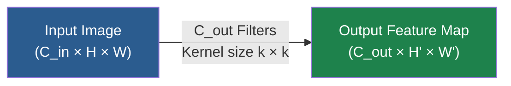
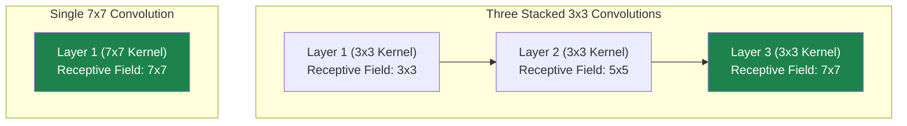
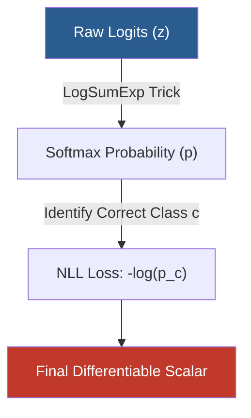
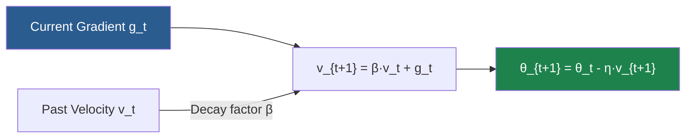
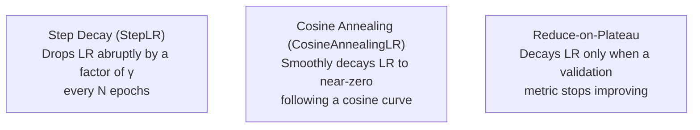
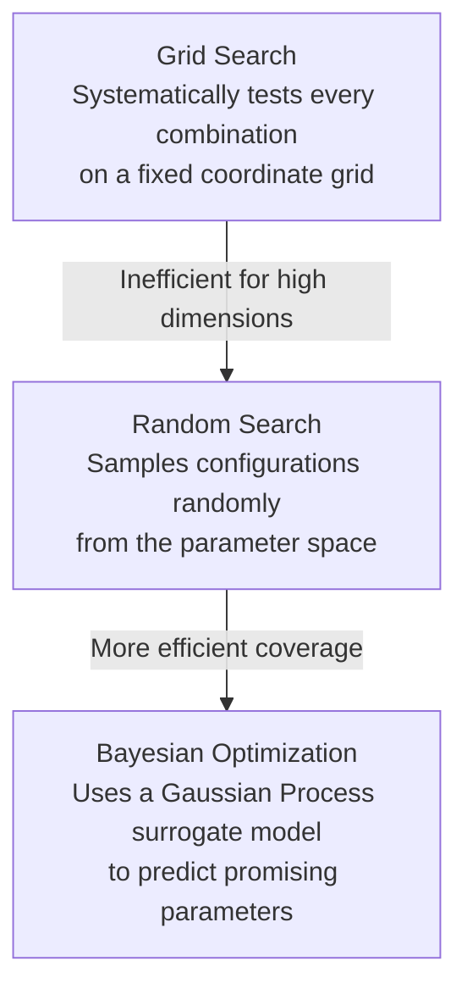
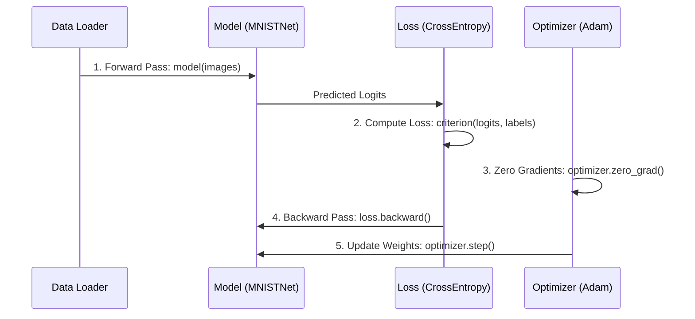

# 7. Hyperparameters, Loss Functions, Optimizers, and PyTorch Implementation

## Introduction

Building and training a deep convolutional neural network (CNN) requires navigating two distinct domains of design choices: the **architecture** (how many layers, what types, and how they connect) and the **training procedure** (how the network learns from data). Both domains are governed by **hyperparameters** — values set by the practitioner before training begins, distinct from the **parameters** (weights and biases) learned dynamically during optimization.

This note provides a rigorous, first-principles exploration of neural network training. We will analyze architectural and training hyperparameters, dissect the mathematics of loss functions and optimizers, explore learning rate schedulers and tuning strategies, and walk through a complete PyTorch implementation.

---

## 1. Network Architecture Hyperparameters

### 1.1 Number of Filters (Channels per Layer)

#### The Fundamental Trade-off

The number of filters (or output channels) in a convolutional layer determines its **representational capacity**. Each filter learns to detect a distinct feature map — such as edges or textures in early layers, and semantic parts or objects in deeper layers. 



Every additional filter introduces $k \times k \times C_{\text{in}} + 1$ parameters (where $k$ is the kernel size and $C_{\text{in}}$ is the number of input channels) and scales both forward and backward pass FLOPs linearly.

*   **Too Few Filters (Underfitting):** If a layer has insufficient filters, it cannot represent enough distinct feature detectors to capture the underlying data distribution. Information missed in early layers cannot be recovered downstream. The symptom is a **high training loss plateau**, showing that the network lacks the capacity to fit the training set.
*   **Too Many Filters (Overfitting and Computational Waste):** If filters exceed the task's complexity, the model can memorize noise in the training set instead of learning generalizable features. Redundant filters may learn near-identical weights, wasting compute and memory. The symptom is a **large generalization gap** (low training loss but high validation loss) and a steep rise in active memory consumption due to storing large intermediate activation maps for backpropagation.

#### Typical Progression: Increasing Filters Across Depth

Modern architectures regularly increase the number of filters as spatial resolution decreases. A standard design pattern scales as follows:

| Block | Spatial Resolution | Typical Filter Count ($C_{\text{out}}$) |
| :--- | :--- | :--- |
| **Block 1** | $112 \times 112$ | 64 |
| **Block 2** | $56 \times 56$ | 128 |
| **Block 3** | $28 \times 28$ | 256 |
| **Block 4** | $14 \times 14$ | 512 |
| **Block 5** | $7 \times 7$ | 512 |

This progression balances the computational load across the network. Spatial downsampling (via pooling or strided convolutions) reduces the spatial area by a factor of 4. Doubling the channel count $C$ increases parameters and FLOPs by a factor of 4 per layer, which helps **preserve the total activation volume** and computational density across the depth of the network.

> [!tip] Practical Guidance
> For complex, high-resolution datasets (such as ImageNet), $64 \to 128 \to 256 \to 512$ is an effective baseline. For simpler, low-resolution datasets (such as CIFAR-10), start with $32 \to 64 \to 128$. If you observe underfitting, scale the filter depth globally. If the model overfits, apply regularization (such as dropout or weight decay) before shrinking the width of your network.

---

### 1.2 Filter Size: Why 3×3 Dominates

#### The Receptive Field Argument

The **receptive field** ($r$) of a neuron is the spatial region in the input image that can influence that neuron's activation. For a single convolutional layer with a kernel of size $k$, the receptive field is exactly $k \times k$. However, stacking multiple convolutional layers sequentially increases the effective receptive field.

Consider a stack of $n$ convolutional layers, each with kernel size $k$ and stride $s$. The receptive field $r_n$ after $n$ layers satisfies the recurrence relation:

$$r_n = r_{n-1} + (k_n - 1) \cdot \prod_{i=1}^{n-1} s_i$$

For a series of stride-1 convolutions ($s_i = 1$), this simplifies to:

$$r_n = r_{n-1} + (k - 1) = 1 + n(k - 1)$$

Let us compare stacking multiple $3 \times 3$ convolutional layers against using single, larger receptive field convolutions:

*   **Two stacked 3×3 convolutions:**
    $$r_2 = 1 + 2 \cdot (3 - 1) = 5$$
    *(Equivalent to one $5 \times 5$ convolution)*
*   **Three stacked 3×3 convolutions:**
    $$r_3 = 1 + 3 \cdot (3 - 1) = 7$$
    *(Equivalent to one $7 \times 7$ convolution)*



#### The Parameter Efficiency Argument

Let us calculate the parameter count for a network layer transforming $C$ input channels to $C$ output channels:

*   **One 7×7 convolution layer:**
    $$\text{Params} = 7 \times 7 \times C \times C = 49C^2$$
*   **Three stacked 3×3 convolution layers:**
    $$\text{Params} = 3 \times (3 \times 3 \times C \times C) = 27C^2$$

This design choice achieves the same $7 \times 7$ receptive field while using only:

$$\frac{27C^2}{49C^2} \approx 55.1\% \text{ of the parameters}$$

Additionally, each of the three $3 \times 3$ convolutions is followed by an activation function (e.g., ReLU), introducing three non-linear decision boundaries instead of one. This allows the network to learn more complex feature representations with fewer parameters.

| Configuration | Receptive Field | Parameters ($C \to C$) | Non-linearities |
| :--- | :--- | :--- | :--- |
| **1 × 7×7 conv** | $7 \times 7$ | $49C^2$ | 1 ReLU |
| **3 × 3×3 conv** | $7 \times 7$ | $27C^2$ | 3 ReLUs |
| **1 × 5×5 conv** | $5 \times 5$ | $25C^2$ | 1 ReLU |
| **2 × 3×3 conv** | $5 \times 5$ | $18C^2$ | 2 ReLUs |

> [!info] When Larger Filters Are Justified
> Large filters (such as $7 \times 7$ or $11 \times 11$) are typically used in the **first convolutional layer** of a network. For a 3-channel input (RGB), a $7 \times 7$ convolution with 64 filters requires only $7 \times 7 \times 3 \times 64 = 9{,}408$ parameters. This allows the network to capture broad spatial patterns (such as edges and gradients) across a larger window at full image resolution, while saving deep layers for fine-grained $3 \times 3$ feature extraction.

---

### 1.3 Stride and Padding

#### Stride

The **stride** ($s$) determines how many pixels the filter shifts across the input feature map. A stride of 1 processes the input at every pixel position. A stride of 2 skips every other pixel, downsampling the spatial dimension of the output by approximately half:

$$W_{\text{out}} = \left\lfloor \frac{W_{\text{in}} - k + 2p}{s} \right\rfloor + 1$$

where $W_{\text{in}}$ is the input width, $k$ is the kernel size, $p$ is the padding, and $s$ is the stride.

Using **stride-2 convolutions** is often preferred over max pooling layers for spatial downsampling in modern networks. This design:
1.  Allows the network to learn its own downsampling weights, rather than applying a fixed mathematical function (like maximum or average).
2.  Reduces the number of separate layers in the network, simplifying the computational graph.

#### Padding

**Padding** ($p$) adds extra values (typically zero, known as "zero padding") around the border of the input tensor before convolution. This serves two main purposes:

1.  **Preserving Spatial Dimensions:** Convolving a $W \times H$ input with a $k \times k$ filter reduces the output size by $k-1$ pixels. Without padding, deep networks would rapidly shrink the spatial dimensions to $1 \times 1$. Setting padding to $p = \lfloor k / 2 \rfloor$ preserves the input spatial dimensions for stride-1 convolutions. This is known as **"same" padding**.
2.  **Retaining Edge Information:** Pixels near the borders of an image are processed less frequently than central pixels during a convolution pass. Padding allows the filter to slide over the edge pixels, ensuring boundary features are captured.

```
Without Padding (Valid):         With Zero Padding (p=1, Same):
  Input: 4x4, Kernel: 3x3          Input: 4x4 -> Padded to 6x6, Kernel: 3x3
  Output: 2x2                      Output: 4x4
  
  X X X X                          0 0 0 0 0 0
  X X X X                          0 X X X X 0
  X X X X                          0 X X X X 0
  X X X X                          0 X X X X 0
                                   0 X X X X 0
                                   0 0 0 0 0 0
```

> [!warning] The "Valid" vs. "Same" Confusion
> TensorFlow allows you to specify `padding="same"` or `padding="valid"`. PyTorch's core `nn.Conv2d` expects manual padding sizes (though modern versions support `padding="same"` as a string for stride 1). For odd kernel sizes, manually compute the same padding as:
> `padding = (kernel_size - 1) // 2`
> Keep this distinction in mind when porting models between frameworks.

---

## 2. Loss Functions Deep Dive

### 2.1 The Loss Function: Measuring Performance

The loss function (or cost/objective function) computes a single scalar value measuring the difference between the model's predictions and the true targets. This scalar drives training by producing the gradients $\frac{\partial \mathcal{L}}{\partial w_i}$ that dictate how each parameter should adjust.

While **evaluation metrics** (such as accuracy or F1-score) are used to evaluate real-world performance, they are often non-differentiable (possessing gradients of zero almost everywhere). The **loss function** serves as a differentiable proxy that correlates closely with these target metrics.

---

### 2.2 Cross-Entropy Loss: Multi-Class Classification

For multi-class classification where classes are mutually exclusive, Cross-Entropy Loss is the standard choice.

#### Mathematical Foundation

PyTorch's `nn.CrossEntropyLoss` combines two operations into a single, numerically stable function: the **Softmax** activation and the **Negative Log-Likelihood Loss (NLLLoss)**.

The **Softmax** function maps raw model output logits $\mathbf{z} = [z_1, z_2, \ldots, z_C]^T$ to a probability distribution over $C$ classes:

$$p_i = \text{Softmax}(z_i) = \frac{e^{z_i}}{\sum_{j=1}^{C} e^{z_j}}$$

This operation ensures that:
*   $p_i \in (0, 1)$ for all $i$.
*   $\sum_{i=1}^{C} p_i = 1$.
*   The relative ranking of logits is preserved ($z_i > z_j \implies p_i > p_j$).

Given the predicted probabilities $\mathbf{p}$ and a ground-truth class label index $c$, the **Negative Log-Likelihood (NLL)** is defined as:

$$\mathcal{L}_{\text{NLL}}(\mathbf{p}, c) = -\log(p_c)$$

Combining these two steps yields the complete Cross-Entropy Loss formula for a single sample:

$$\mathcal{L}_{\text{CE}}(\mathbf{z}, c) = -\log\left(\frac{e^{z_c}}{\sum_{j=1}^{C} e^{z_j}}\right) = -z_c + \log\left(\sum_{j=1}^{C} e^{z_j}\right)$$

#### The LogSumExp Trick for Numerical Stability

In practice, computing $e^{z_i}$ directly for large logits (e.g., $z_i = 1000$) causes numerical overflow, while very small logits (e.g., $z_i = -1000$) can lead to underflow. To prevent this, PyTorch uses the **LogSumExp** identity:

$$\log\left(\sum_{j=1}^{C} e^{z_j}\right) = z_{\max} + \log\left(\sum_{j=1}^{C} e^{z_j - z_{\max}}\right)$$

where $z_{\max} = \max_j (z_j)$. By subtracting $z_{\max}$, the exponent arguments are shifted to be $\leq 0$. At least one term becomes $e^0 = 1$, preventing underflow and keeping the sum stable.

#### Mathematical Behavior

*   **Confident and Correct ($p_c \to 1$):** Loss approaches $-\log(1) = 0$.
*   **Confident and Wrong ($p_c \to 0$):** Loss approaches $-\log(0) \to \infty$, producing large gradients to correct the error.
*   **Uniform Uncertainty ($p_c = 1/C$):** Loss is exactly $-\log(1/C) = \log(C)$. For a 10-class problem, this initial random baseline loss is $\log(10) \approx 2.30$.



> [!danger] The Silent Double Softmax Bug
> PyTorch's `nn.CrossEntropyLoss` is designed to receive raw, unnormalized **logits** directly. If you manually apply a `nn.Softmax` layer at the end of your model and pass those probabilities to `nn.CrossEntropyLoss`, the loss function will apply Softmax a second time:
> $$\mathcal{L} = -\log\left(\text{Softmax}(\text{Softmax}(\mathbf{z}))\right)$$
> This flattens your probability distribution, reduces gradient flow, and slows down or stalls convergence. **Raw logits must be fed directly into `nn.CrossEntropyLoss`.**

---

### 2.3 Binary Cross-Entropy Loss: Two-Class Problems

For binary classification tasks where the output is a single value predicting the probability of the positive class ($y \in \{0, 1\}$), we use Binary Cross-Entropy (BCE).

#### Mathematical Formulation

Given a predicted probability $p = \sigma(z)$ (where $\sigma$ is the Sigmoid function) and a binary label $y \in \{0, 1\}$:

$$\mathcal{L}_{\text{BCE}}(p, y) = -\left[ y \log(p) + (1 - y) \log(1 - p) \right]$$

The Sigmoid activation is defined as:

$$\sigma(z) = \frac{1}{1 + e^{-z}}$$

#### BCELoss vs. BCEWithLogitsLoss

*   `nn.BCELoss` expects predicted probabilities (the output of a Sigmoid layer) as input.
*   `nn.BCEWithLogitsLoss` takes raw unnormalized logits directly, combining the Sigmoid and BCE calculations into a single, numerically stable step. It reformulates the loss calculation to avoid computing $e^{-z}$ for large positive or negative values, preventing precision issues.

```python
import torch
import torch.nn as nn

# Ground truth binary targets (must be floats for BCE loss in PyTorch)
targets = torch.tensor([1.0, 0.0, 1.0])
logits = torch.tensor([2.5, -3.0, 0.5])

# Approach 1: BCELoss (requires explicit Sigmoid)
sigmoid_layer = nn.Sigmoid()
probs = sigmoid_layer(logits)
bce_loss_fn = nn.BCELoss()
loss_1 = bce_loss_fn(probs, targets)

# Approach 2: BCEWithLogitsLoss (Directly uses logits - preferred)
bce_logits_loss_fn = nn.BCEWithLogitsLoss()
loss_2 = bce_logits_loss_fn(logits, targets)

# loss_1 and loss_2 are mathematically identical, but loss_2 is more stable
print(f"BCELoss: {loss_1.item():.6f} | BCEWithLogitsLoss: {loss_2.item():.6f}")
```

---

### 2.4 Regression and Specialized Losses

#### Mean Squared Error (MSE) Loss

For regression tasks predicting continuous values:

$$\mathcal{L}_{\text{MSE}}(\mathbf{\hat{y}}, \mathbf{y}) = \frac{1}{N} \sum_{i=1}^{N} (\hat{y}_i - y_i)^2$$

Because the errors are squared, MSE penalizes large outliers more heavily than small errors.

#### Focal Loss

Introduced to handle extreme class imbalances (such as in object detection, where background examples outnumber objects), Focal Loss modifies standard Cross-Entropy by adding a modulating factor:

$$\mathcal{L}_{\text{Focal}}(p_t) = -\alpha_t (1 - p_t)^\gamma \log(p_t)$$

where:
*   $p_t$ is the model's estimated probability for the correct class.
*   $\gamma \geq 0$ is the focusing parameter.
*   $\alpha_t$ is an optional balancing factor.

When $\gamma > 0$, the loss contribution from well-classified examples ($p_t > 0.5$) is down-weighted, allowing the model to focus training updates on harder, misclassified examples.

---

## 3. Optimization Algorithms and Mathematical Mechanics

### 3.1 The Optimization Problem

Optimization is the process of updating model weights $\theta$ to minimize a loss function $\mathcal{L}(\theta)$. The parameter update is driven by the gradients of the loss with respect to the weights:

$$\theta_{t+1} = \theta_t - \eta \cdot \nabla_\theta \mathcal{L}(\theta_t)$$

where $\eta$ is the learning rate.

---

### 3.2 Stochastic Gradient Descent (SGD)

Vanilla Stochastic Gradient Descent estimates the true gradient of the loss surface using a small subset (mini-batch) of training data:

$$g_t = \frac{1}{B} \sum_{i=1}^{B} \nabla_\theta \mathcal{L}_i(\theta_t)$$

$$\theta_{t+1} = \theta_t - \eta \cdot g_t$$

#### Limitations of Vanilla SGD

1.  **Oscillations in Ravines:** A ravine is a region of the loss surface that curves much more steeply in one direction than another. In these regions, SGD oscillates across the steep walls rather than moving along the floor toward the local minimum.
2.  **Saddle Points and Local Minima:** In high-dimensional spaces, local minima are rare; saddle points (where the gradient is zero but the surface rises in some directions and falls in others) are much more common. Vanilla SGD can stall at these points because its gradients approach zero.

---

### 3.3 SGD with Momentum

To address these limitations, Momentum adds a fraction of the update vector from the previous step to the current update, mimicking physical inertia:

$$v_{t+1} = \beta \cdot v_t + g_t$$

$$\theta_{t+1} = \theta_t - \eta \cdot v_{t+1}$$

where $v_t$ is the velocity vector and $\beta \in [0, 1)$ is the momentum decay coefficient (typically set to 0.9).



#### Why Momentum Resolves SGD's Limitations

*   **Dampens Oscillations:** In a ravine, the gradients along the steep, oscillating directions change sign frequently. Averaging these across time steps cancels out the oscillations. The gradient along the floor is smaller but points consistently in the same direction, allowing the accumulated velocity to accelerate the model along the valley floor.
*   **Escapes Flat Regions:** The accumulated momentum helps carry the parameters through saddle points and flat areas where the immediate gradient $g_t$ is close to zero.

---

### 3.4 Adam (Adaptive Moment Estimation)

Adam computes adaptive learning rates for each parameter by maintaining running estimates of both the gradient's mean (first moment) and variance (uncentered second moment).

#### The Mathematical Engine

For each parameter, Adam maintains:

1.  **First Moment (Mean of Gradients):**
    $$m_t = \beta_1 m_{t-1} + (1 - \beta_1) g_t$$
2.  **Second Moment (Variance of Gradients):**
    $$v_t = \beta_2 v_{t-1} + (1 - \beta_2) g_t^2$$

where $g_t^2$ represents the element-wise square of the gradient. The decay constants are typically set to $\beta_1 = 0.9$ and $\beta_2 = 0.999$.

#### Bias Correction Derivation

Since $m_0$ and $v_0$ are initialized as zero vectors, they are biased toward zero, especially in early training steps or when the decay rates are close to 1. To correct this, we use bias-corrected estimates:

$$\hat{m}_t = \frac{m_t}{1 - \beta_1^t}, \quad \hat{v}_t = \frac{v_t}{1 - \beta_2^t}$$

To see why this correction is necessary, we can expand the recursive equation for $m_t$ (assuming $m_0 = 0$):

$$m_t = (1 - \beta_1) \sum_{i=1}^{t} \beta_1^{t-i} g_i$$

Taking the expectation on both sides:

$$\mathbb{E}[m_t] = \mathbb{E}\left[ (1 - \beta_1) \sum_{i=1}^{t} \beta_1^{t-i} g_i \right]$$

Assuming that the true gradients $g_i$ come from a stationary distribution (meaning $\mathbb{E}[g_i] = \mathbb{E}[g_t]$ for all $i$):

$$\mathbb{E}[m_t] = \mathbb{E}[g_t] \cdot (1 - \beta_1) \sum_{i=1}^{t} \beta_1^{t-i}$$

Using the formula for the sum of a finite geometric series:

$$\sum_{i=1}^{t} \beta_1^{t-i} = \frac{1 - \beta_1^t}{1 - \beta_1}$$

Substituting this back into the expectation:

$$\mathbb{E}[m_t] = \mathbb{E}[g_t] \cdot (1 - \beta_1) \cdot \frac{1 - \beta_1^t}{1 - \beta_1} = \mathbb{E}[g_t] \cdot (1 - \beta_1^t)$$

Therefore, dividing $m_t$ by $1 - \beta_1^t$ yields an unbiased estimate of the first moment:

$$\mathbb{E}[\hat{m}_t] = \mathbb{E}\left[ \frac{m_t}{1 - \beta_1^t} \right] = \mathbb{E}[g_t]$$

The same derivation applies to the second moment estimate $v_t$.

#### The Adam Parameter Update

$$\theta_{t+1} = \theta_t - \frac{\eta}{\sqrt{\hat{v}_t} + \epsilon} \cdot \hat{m}_t$$

where $\epsilon$ (typically $10^{-8}$) is added to prevent division by zero.

This update scales the step size based on the historical variance of the gradient:
*   **Infrequent or Small Gradients:** If a weight's gradients are consistently small, $\hat{v}_t$ is small, which increases the effective step size $\frac{\eta}{\sqrt{\hat{v}_t} + \epsilon}$.
*   **Large or Noisy Gradients:** If a weight's gradients are large or highly variable, $\hat{v}_t$ is large, which decreases the effective step size to prevent unstable updates.

---

### 3.5 SGD vs. Adam: Comparison

| Property | SGD + Momentum | Adam |
| :--- | :--- | :--- |
| **Learning Rate Scaling** | Global rate $\eta$ for all parameters | Adaptive, per-parameter learning rate |
| **Generalization** | Often slightly better final test accuracy on standard vision tasks | Can occasionally converge to sharper, less generalizable minima |
| **Hyperparameter Sensitivity**| High: Requires careful tuning of learning rates and schedules | Low: Default values ($\beta_1=0.9, \beta_2=0.999$) are highly robust |
| **Convergence Speed** | Slower, especially in early training | Significantly faster in early phases |
| **Memory Overhead** | Requires 1 additional buffer per parameter ($v_t$) | Requires 2 additional buffers per parameter ($m_t, v_t$) |
| **Sparse Gradients** | Performs poorly when features are rarely updated | Handles sparse gradients well |

> [!info] The SGD vs. Adam Generalization Debate
> Studies (such as Wilson et al., 2017) suggest that while Adam converges faster, SGD with Momentum can find broader, flatter minima that generalize slightly better on some image classification benchmarks. However, Adam remains a highly effective choice for prototyping, complex architectures, and sparse tasks.

---

## 4. Training Dynamics and Convergence Hyperparameters

### 4.1 Learning Rate: The Most Critical Hyperparameter

The learning rate ($\eta$) controls the step size taken toward a local minimum during optimization:

$$\theta_{t+1} = \theta_t - \eta \cdot \nabla_\theta \mathcal{L}(\theta_t)$$

#### Impact of Poor Choices

*   **Learning Rate Too High (Divergence):** If the step size is too large, the optimizer overshoots the minimum and climbs up the opposite side of the loss valley. This causes the loss to fluctuate widely or grow exponentially, often leading to `NaN` values.
*   **Learning Rate Too Low (Stagnation):** If the step size is too small, updates make negligible progress. The model may stall in flat regions of the loss surface or get trapped in shallow local minima.

```
Loss Landscape Exploration:
      Too High (Overshooting):             Too Low (Stagnating):             Optimal:
            \          /                         \          /              \          /
             \  o-->  /                           \        /                \        /
              \      /                             \  o   /                  \  o   /
               \o<--/                               \ |  /                    \  \ /
                \  /                                 \o /                      \  o
```

#### The Learning Rate Range Test

To find a good starting learning rate, perform a **learning rate range test** (Smith, 2017):
1.  Train the model for a single epoch.
2.  Increase the learning rate exponentially after each mini-batch (e.g., from $10^{-7}$ to $10^{1}$).
3.  Plot the loss against the learning rate.
4.  Select a starting learning rate from the middle of the region where the loss is decreasing most rapidly.

---

### 4.2 Batch Size: Small vs. Large Batch Trade-offs

The **batch size** ($B$) is the number of training examples used to compute a single gradient update.

#### Small Batch Sizes ($B \in [16, 64]$)

*   **Implicit Regularization:** Smaller batches introduce stochastic noise into the gradient estimates because each batch is only a small sample of the full dataset. This noise helps the optimizer escape sharp, poor local minima and guides the parameters toward broader, more robust minima (Keskar et al., 2016).
*   **Memory Efficiency:** Smaller batch sizes require less GPU memory to store active intermediate representations during the forward pass.
*   **Computational Bottleneck:** Small batches do not fully leverage the parallel processing capabilities of modern GPUs, leading to longer epoch wall-clock times.

#### Large Batch Sizes ($B \ge 256$)

*   **Stable Gradients:** Larger batches provide more accurate, lower-variance gradient estimates of the entire dataset.
*   **High GPU Utilization:** Maximizes parallel thread operations on modern hardware, speeding up processing times.
*   **The Generalization Gap:** Using very large batch sizes without adjusting other hyperparameters can lead to overfitting, as the lack of gradient noise makes the model more likely to settle in the nearest local minimum.

#### The Linear Scaling Rule

When scaling the batch size by a factor of $k$, the linear scaling rule (Goyal et al., 2017) suggests scaling the learning rate by $k$ as well to maintain a consistent gradient noise ratio:

$$\eta_{\text{new}} = k \cdot \eta_{\text{old}}$$

This rule works well for SGD, but is less applicable to adaptive optimizers like Adam, which scale gradient updates dynamically.

---

### 4.3 Warmup: Stabilizing Early Training

In early training epochs, the network's weights are randomly initialized. Using a high learning rate immediately can cause large, unstable gradient updates that disrupt the initial learning process.

#### Linear Warmup

A **warmup phase** gradually scales the learning rate from near-zero to its target value $\eta_{\text{target}}$ over a set number of steps $T_{\text{warmup}}$ (typically 5–10 epochs):

$$\eta_t = \eta_{\text{target}} \cdot \frac{t}{T_{\text{warmup}}}$$

This allows the model to find a stable path in the loss landscape before full learning rate updates are applied.

---

### 4.4 Learning Rate Schedulers

A learning rate scheduler adjusts the learning rate as training progresses, allowing for larger exploration steps early on and finer parameter tuning in later epochs.



#### Step Decay (`StepLR`)

Drops the learning rate by a multiplicative factor $\gamma$ (e.g., 0.1) at fixed intervals:

$$\eta_{\text{epoch}} = \eta_0 \cdot \gamma^{\lfloor \text{epoch} / S \rfloor}$$

where $S$ is the step size interval.

#### Cosine Annealing (`CosineAnnealingLR`)

Smoothly decays the learning rate following a cosine curve:

$$\eta_t = \eta_{\min} + \frac{1}{2}(\eta_{\max} - \eta_{\min})\left(1 + \cos\left(\frac{t}{T_{\max}} \pi\right)\right)$$

where $T_{\max}$ is the maximum number of iterations.

#### Adaptive Decay (`ReduceLROnPlateau`)

Monitors a validation metric (typically validation loss) and decreases the learning rate by a factor of $\gamma$ if the metric does not improve for a set number of epochs (known as `patience`).

---

### 4.5 Epochs and Early Stopping

An **epoch** is one complete pass through the entire training dataset.

**Early stopping** is a regularization technique that stops training when the validation loss stops improving. This prevents the model from overfitting to the training set as it continues to run.

```
Loss
 ^
 |    \                     /  Validation Loss (Starts Overfitting)
 |     \       _..---.._   /
 |      \  _.-"         "-v (Stop Training Here)
 |       v                 \
 |        \                 \  Training Loss (Continues Decreasing)
 |         \_________________\
 +-----------------------------------------> Epochs
```

*   **Patience:** The number of epochs to wait for an improvement in validation loss before stopping.
*   **Min Delta:** The minimum change in the validation metric to count as a genuine improvement.

---

## 5. Practical Tuning Strategies

### 5.1 Hyperparameter Exploration Techniques



#### Grid Search

Evaluates every combination of a predefined set of hyperparameters. This approach is simple to set up but becomes computationally expensive as the number of hyperparameters increases.

#### Random Search

Samples hyperparameter combinations randomly from a defined search space. Random search is often more efficient than grid search because it avoids repeating similar values for less important hyperparameters (Bergstra & Bengio, 2012).

#### Bayesian Optimization

Uses a probabilistic surrogate model (such as a Gaussian Process) to predict how well different hyperparameter combinations will perform. This allows the search to balance **exploration** (trying new, uncertain areas of the parameter space) and **exploitation** (focusing on areas known to yield good results).

---

### 5.2 Hyperparameter Priority Hierarchy

When resources are limited, prioritize hyperparameter tuning in the following order:

| Tuning Priority | Hyperparameter | Impact | Recommended Action |
| :---: | :--- | :--- | :--- |
| **1** | Learning Rate ($\eta$) | Critical | Tune first using a range test. |
| **2** | LR Scheduler & Warmup | High | Use Cosine Annealing or ReduceLROnPlateau. |
| **3** | Batch Size ($B$) | Medium | Set based on GPU memory limits ($32 \to 128$). |
| **4** | Weight Decay ($\lambda$) | Medium | Adjust to control overfitting ($10^{-4} \to 10^{-2}$). |
| **5** | Number of Filters | Medium | Use standard scaling ($64 \to 128 \to 256 \to 512$). |
| **6** | Momentum ($\beta$ or $\beta_1$) | Low | Keep default values (0.9) in most cases. |

---

## 6. PyTorch Implementation Basics & Walkthrough

Here we discuss how to build a complete image classification pipeline in PyTorch, using the MNIST dataset of handwritten digits as an example.

---

### 6.1 Module Imports Explained

To build our pipeline, we will import PyTorch's core components:

```python
import torch                        # Core PyTorch tensor library
import torch.nn as nn               # Neural network layer modules and loss functions
import torch.optim as optim         # Optimization algorithms (SGD, Adam, etc.)
from torch.utils.data import DataLoader  # Batching, shuffling, and loading utility
from torchvision import datasets    # Access to standard vision datasets
from torchvision import transforms  # Common image transformation pipelines
```

---

### 6.2 Dataset and DataLoader Mechanics

#### The ToTensor Transform

Images must be preprocessed before being fed into a neural network. The `transforms.ToTensor()` pipeline performs three operations:
1.  **Type Conversion:** Converts a PIL Image or NumPy array into a PyTorch tensor of type `torch.float32`.
2.  **Dimension Reordering:** Converts the input from Height × Width × Channels (HWC) to Channels × Height × Width (CHW) format, which is the standard input format for PyTorch convolutional layers.
3.  **Intensity Normalization:** Scales pixel values from the integer range $[0, 255]$ to the floating-point range $[0.0, 1.0]$.

```python
# Transform pipeline: Convert to tensor and apply standard normalization
transform_pipeline = transforms.Compose([
    transforms.ToTensor(),
    transforms.Normalize(mean=(0.1307,), std=(0.3081,))  # MNIST global mean and std
])

# Download and load training and test datasets
train_dataset = datasets.MNIST(root='./data', train=True, download=True, transform=transform_pipeline)
test_dataset = datasets.MNIST(root='./data', train=False, download=True, transform=transform_pipeline)
```

The `DataLoader` wraps our datasets to handle batching, shuffling, and multi-threaded data loading:

```python
train_loader = DataLoader(
    dataset=train_dataset,
    batch_size=64,
    shuffle=True,        # Shuffle training data to prevent the model from learning ordering bias
    num_workers=2,       # Use 2 subprocesses to load data in parallel
    pin_memory=True      # Pin memory to speed up CPU-to-GPU tensor transfers
)

test_loader = DataLoader(
    dataset=test_dataset,
    batch_size=64,
    shuffle=False,       # Shuffling is unnecessary for evaluation
    num_workers=2,
    pin_memory=True
)
```

---

### 6.3 Subclassing nn.Module

All custom neural network architectures in PyTorch subclass `nn.Module`. This base class automatically tracks weights and biases, handles device transfers, and manages training and evaluation states.

```python
class ConvolutionalNetwork(nn.Module):
    def __init__(self):
        super(ConvolutionalNetwork, self).__init__()
        
        # Define the feature extraction blocks
        self.features = nn.Sequential(
            # First Conv Block: Input 1x28x28 -> Output 32x28x28
            nn.Conv2d(in_channels=1, out_channels=32, kernel_size=3, stride=1, padding=1),
            nn.BatchNorm2d(32),
            nn.ReLU(),
            nn.MaxPool2d(kernel_size=2, stride=2),  # Output: 32x14x14
            
            # Second Conv Block: Input 32x14x14 -> Output 64x14x14
            nn.Conv2d(in_channels=32, out_channels=64, kernel_size=3, stride=1, padding=1),
            nn.BatchNorm2d(64),
            nn.ReLU(),
            nn.MaxPool2d(kernel_size=2, stride=2)   # Output: 64x7x7
        )
        
        # Define the classification blocks
        self.classifier = nn.Sequential(
            nn.Flatten(),                           # Output: 64 * 7 * 7 = 3136
            nn.Linear(64 * 7 * 7, 128),
            nn.ReLU(),
            nn.Dropout(p=0.5),                      # Regularization to prevent overfitting
            nn.Linear(128, 10)                      # Output 10 raw logits (one per class)
        )

    def forward(self, x):
        # Defines the forward pass through the network
        x = self.features(x)
        x = self.classifier(x)
        return x
```

---

### 6.4 Convolutional and Pooling Layer Details

#### nn.Conv2d Parameters

*   `in_channels`: The number of channels in the input image or feature map (e.g., 1 for grayscale, 3 for RGB).
*   `out_channels`: The number of filters to apply, which determines the depth of the output feature map.
*   `kernel_size`: The width and height of the convolution window (e.g., 3 for a $3 \times 3$ kernel).
*   `stride`: The spatial step size taken by the filter as it slides over the input (defaults to 1).
*   `padding`: The amount of zero-padding applied to the boundaries of the input (defaults to 0).

#### nn.MaxPool2d Parameters

*   `kernel_size`: The size of the window to take the maximum value over (e.g., 2 for a $2 \times 2$ window).
*   `stride`: The step size of the sliding window. Setting `stride=2` downsamples both spatial dimensions by half.

---

### 6.5 Flattening Tensors

To transition from convolutional feature maps to fully connected layers, the multi-dimensional tensor must be flattened into a 1D feature vector.

In our network, the output of the final pooling layer has the shape `(batch_size, 64, 7, 7)`. Flattening converts this into a 2D tensor of shape `(batch_size, 64 * 7 * 7) = (batch_size, 3136)`, which can then be processed by the linear layers.

```python
# Flattening using nn.Flatten() inside nn.Sequential is equivalent to using view():
x = x.view(x.size(0), -1)  # x.size(0) keeps the batch dimension, while -1 flattens the remaining dimensions.
```

---

### 6.6 The 5-Step Training Loop Cycle

For each mini-batch in the training loop, the network performs a 5-step cycle:



1.  **Forward Pass:** Feed the input images through the network to compute the predicted logits.
2.  **Loss Calculation:** Compute the error using our loss function (`nn.CrossEntropyLoss`).
3.  **Zero Gradients:** Clear gradients from the previous step using `optimizer.zero_grad()`. This is necessary because PyTorch accumulates gradients on backward passes by default.
4.  **Backward Pass:** Compute the gradients of the loss with respect to all model parameters using `loss.backward()`.
5.  **Optimizer Step:** Update the model's weights using the computed gradients by calling `optimizer.step()`.

---

### 6.7 Evaluation Loop Mechanics

During evaluation, we measure the model's performance on unseen data. This process differs from training in two ways:

1.  **Set to Evaluation Mode:** Call `model.eval()`. This deactivates regularization layers (like Dropout) and configures Batch Normalization to use running global statistics rather than batch statistics.
2.  **Disable Gradient Tracking:** Wrap the evaluation loop in `with torch.no_grad():`. This disables gradient tracking, which reduces memory consumption and speeds up computation during inference.

---

## 7. Integrated Complete PyTorch Code Example

Below is a complete, well-documented training pipeline using a Custom Warmup + Cosine Scheduler and Early Stopping on the MNIST dataset.

```python
import torch
import torch.nn as nn
import torch.optim as optim
from torch.utils.data import DataLoader
from torchvision import datasets, transforms
import math

# =====================================================================
# 1. SETUP AND CONFIGURATION
# =====================================================================

# Select GPU if available, otherwise fall back to CPU
device = torch.device('cuda' if torch.cuda.is_available() else 'cpu')
print(f"Using device: {device}")

# Global Configuration Parameters
CONFIG = {
    'batch_size': 64,
    'learning_rate': 0.001,
    'weight_decay': 1e-4,
    'epochs': 15,
    'warmup_epochs': 3,
    'patience': 3
}

# =====================================================================
# 2. DATA PREPARATION
# =====================================================================

transform = transforms.Compose([
    transforms.ToTensor(),
    transforms.Normalize((0.1307,), (0.3081,))
])

train_dataset = datasets.MNIST(root='./data', train=True, download=True, transform=transform)
test_dataset = datasets.MNIST(root='./data', train=False, download=True, transform=transform)

train_loader = DataLoader(train_dataset, batch_size=CONFIG['batch_size'], shuffle=True, num_workers=2, pin_memory=True)
test_loader = DataLoader(test_dataset, batch_size=CONFIG['batch_size'], shuffle=False, num_workers=2, pin_memory=True)

# =====================================================================
# 3. MODEL ARCHITECTURE
# =====================================================================

class MNISTNet(nn.Module):
    def __init__(self):
        super(MNISTNet, self).__init__()
        
        # Feature extractor
        self.features = nn.Sequential(
            nn.Conv2d(1, 32, kernel_size=3, padding=1),  # Input: 1x28x28 -> 32x28x28
            nn.BatchNorm2d(32),
            nn.ReLU(),
            nn.MaxPool2d(2, 2),                          # Output: 32x14x14
            
            nn.Conv2d(32, 64, kernel_size=3, padding=1), # Output: 64x14x14
            nn.BatchNorm2d(64),
            nn.ReLU(),
            nn.MaxPool2d(2, 2)                           # Output: 64x7x7
        )
        
        # Classifier
        self.classifier = nn.Sequential(
            nn.Flatten(),
            nn.Linear(64 * 7 * 7, 128),
            nn.ReLU(),
            nn.Dropout(p=0.4),
            nn.Linear(128, 10)                           # Output 10 raw logits
        )

    def forward(self, x):
        x = self.features(x)
        x = self.classifier(x)
        return x

# Instantiate the model and move it to the configured device
model = MNISTNet().to(device)

# =====================================================================
# 4. OPTIMIZER, SCHEDULER, AND LOSS FUNCTION
# =====================================================================

criterion = nn.CrossEntropyLoss()

optimizer = optim.Adam(
    model.parameters(),
    lr=CONFIG['learning_rate'],
    weight_decay=CONFIG['weight_decay']
)

# Custom Warmup and Cosine Annealing Scheduler
def lr_lambda(epoch):
    if epoch < CONFIG['warmup_epochs']:
        # Linear Warmup phase
        return float(epoch + 1) / float(CONFIG['warmup_epochs'])
    else:
        # Cosine Annealing decay phase
        progress = float(epoch - CONFIG['warmup_epochs']) / float(CONFIG['epochs'] - CONFIG['warmup_epochs'])
        return 0.5 * (1.0 + math.cos(progress * math.pi))

scheduler = optim.lr_scheduler.LambdaLR(optimizer, lr_lambda=lr_lambda)

# =====================================================================
# 5. EARLY STOPPING CLASS
# =====================================================================

class EarlyStopping:
    def __init__(self, patience=3, min_delta=0.0):
        self.patience = patience
        self.min_delta = min_delta
        self.counter = 0
        self.best_loss = float('inf')
        self.should_stop = False

    def __call__(self, val_loss, model):
        if val_loss < self.best_loss - self.min_delta:
            # We found an improvement in validation loss
            self.best_loss = val_loss
            self.counter = 0
            # Save a checkpoint of the best performing model
            torch.save(model.state_dict(), 'best_model.pth')
            print(" ==> Validation loss decreased. Saving checkpoint.")
        else:
            # No improvement
            self.counter += 1
            print(f" ==> No improvement. Early Stopping Counter: {self.counter}/{self.patience}")
            if self.counter >= self.patience:
                self.should_stop = True

early_stopping = EarlyStopping(patience=CONFIG['patience'])

# =====================================================================
# 6. TRAINING AND VALIDATION PIPELINE
# =====================================================================

for epoch in range(CONFIG['epochs']):
    # --- Training Phase ---
    model.train()
    running_loss = 0.0
    correct_train = 0
    total_train = 0
    
    current_lr = optimizer.param_groups[0]['lr']
    print(f"\n--- Epoch {epoch + 1}/{CONFIG['epochs']} | LR: {current_lr:.6f} ---")
    
    for batch_idx, (images, labels) in enumerate(train_loader):
        images, labels = images.to(device), labels.to(device)
        
        # Step 1 & 2: Forward pass and loss calculation
        outputs = model(images)
        loss = criterion(outputs, labels)
        
        # Step 3: Zero gradients
        optimizer.zero_grad()
        
        # Step 4: Backward pass
        loss.backward()
        
        # Step 5: Update weights
        optimizer.step()
        
        # Track training statistics
        running_loss += loss.item()
        _, predicted = torch.max(outputs, 1)
        total_train += labels.size(0)
        correct_train += (predicted == labels).sum().item()
        
        if (batch_idx + 1) % 300 == 0:
            print(f"Batch [{batch_idx + 1}/{len(train_loader)}] | Loss: {loss.item():.4f}")
            
    train_loss = running_loss / len(train_loader)
    train_acc = 100 * correct_train / total_train
    
    # --- Validation Phase ---
    model.eval()
    val_loss = 0.0
    correct_val = 0
    total_val = 0
    
    with torch.no_grad():
        for images, labels in test_loader:
            images, labels = images.to(device), labels.to(device)
            outputs = model(images)
            loss = criterion(outputs, labels)
            
            val_loss += loss.item()
            _, predicted = torch.max(outputs, 1)
            total_val += labels.size(0)
            correct_val += (predicted == labels).sum().item()
            
    val_loss = val_loss / len(test_loader)
    val_acc = 100 * correct_val / total_val
    
    print(f"Epoch Summary: Train Loss: {train_loss:.4f} | Train Acc: {train_acc:.2f}% "
          f"| Val Loss: {val_loss:.4f} | Val Acc: {val_acc:.2f}%")
    
    # Update Learning Rate Scheduler
    scheduler.step()
    
    # Check Early Stopping
    early_stopping(val_loss, model)
    if early_stopping.should_stop:
        print("Early stopping triggered. Training ended.")
        break

# =====================================================================
# 7. EVALUATION ON THE BEST CHECKPOINT
# =====================================================================

# Load the best model weights
model.load_state_dict(torch.load('best_model.pth'))
model.eval()

correct = 0
total = 0

with torch.no_grad():
    for images, labels in test_loader:
        images, labels = images.to(device), labels.to(device)
        outputs = model(images)
        _, predicted = torch.max(outputs.data, 1)
        total += labels.size(0)
        correct += (predicted == labels).sum().item()

print(f"\nFinal Test Accuracy of Best Model: {100 * correct / total:.2f}%")
```

---

## 8. Summary of Core Concepts

*   **Filter Scale Trade-offs:** Stacking $3 \times 3$ convolutions is more parameter-efficient than using larger filters (like $5 \times 5$ or $7 \times 7$), while providing more opportunities to introduce non-linearities.
*   **Loss Functions:** Use `nn.CrossEntropyLoss` for multi-class classification (requires raw logits) and `nn.BCEWithLogitsLoss` for binary tasks.
*   **Optimizers:** SGD with Momentum offers high final generalization performance when tuned, while Adam is robust and converges quickly.
*   **The 5-Step Cycle:** Training loops must perform the following steps in order: `forward` $\to$ `loss` $\to$ `zero_grad` $\to$ `backward` $\to$ `step`.
*   **Scheduling and Schedulers:** Schedulers dynamically adjust learning rates, helping models explore broad landscapes early on and settle into stable minima as training wraps up.

---

**Related Sections:** [[6. Advanced Pooling Mechanisms and Global Average Pooling]] | [[8. Evolution of CNN Architectures]] | [[16. Batch Normalization]] | [[17. Dropout and Regularization]]