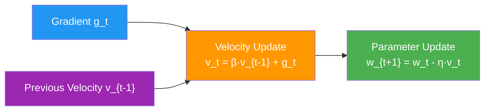
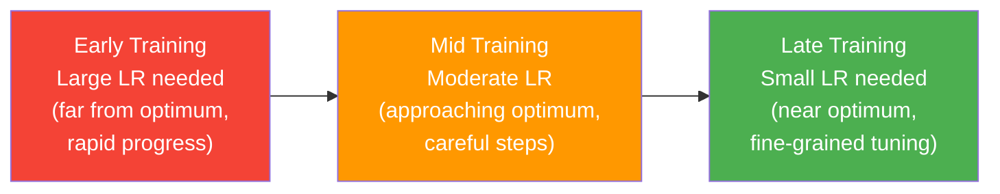

# 20. Loss Functions and Optimizers Deep Dive

## The Loss Function: Measuring How Wrong Predictions Are

At the heart of every machine learning model lies a loss function (also called a cost function or objective function). The loss function takes the model's predictions and the true labels, and it produces a single scalar value that quantifies how wrong the predictions are. Training a neural network is, at its core, the process of iteratively adjusting the model's parameters to minimize this loss value. If the loss function is poorly chosen, the model will optimize for the wrong objective and produce useless predictions, no matter how sophisticated the architecture or how abundant the data. Understanding loss functions deeply is therefore not optional—it is foundational.

The loss function serves several critical roles in the training process. First, it provides the gradient signal that drives parameter updates: the partial derivatives $\frac{\partial L}{\partial w_i}$ tell each weight $w_i$ which direction and how much to change. Second, it defines what "good" means for your specific problem—classification accuracy, regression precision, ranking quality, or any other objective. Third, it provides a monitoring signal during training: a decreasing training loss indicates that the model is fitting the data, while a diverging loss indicates a problem with the learning rate, data, or architecture.

> [!note] Loss vs. Metric: They Are Not the Same Thing
> The loss function is different from the evaluation metric. The loss function must be differentiable (so that gradients can be computed) and is used to drive training. The evaluation metric (e.g., accuracy, F1 score) measures real-world performance but may not be differentiable. For example, accuracy is not differentiable because a small change in a weight may not change any prediction, making the gradient zero everywhere except at decision boundaries. We train using a surrogate loss (like cross-entropy) that is differentiable and correlates well with our true metric (like accuracy), but we evaluate using the metric that actually matters for our application.

---

## Cross-Entropy Loss: The Standard for Classification

Cross-Entropy Loss is by far the most commonly used loss function for multi-class classification problems. It is the default choice whenever your task involves assigning an input to one of $C$ mutually exclusive classes. Understanding what it computes internally, why it works, and how to use it correctly is essential for any practitioner.

### What Cross-Entropy Loss Computes Internally

PyTorch's `nn.CrossEntropyLoss` combines two operations into a single, numerically stable function:

1. **Softmax**: Converts the raw logits (unnormalized scores) output by the model into a probability distribution over the $C$ classes. For a vector of logits $\mathbf{z} = [z_1, z_2, \ldots, z_C]$, the Softmax function computes:

$$\text{Softmax}(z_i) = \frac{e^{z_i}}{\sum_{j=1}^{C} e^{z_j}} = p_i$$

The key properties of Softmax are: (a) every output $p_i$ is in the range $(0, 1)$, (b) the outputs sum to 1 ($\sum_{i=1}^{C} p_i = 1$), and (c) the outputs are monotonic in the logits—if $z_i > z_j$, then $p_i > p_j$. These properties make the Softmax output a valid probability distribution that preserves the ranking of the logits.

2. **Negative Log-Likelihood (NLLLoss)**: Given the predicted probabilities $\mathbf{p}$ and the true class $c$, NLLLoss computes:

$$\text{NLLLoss}(\mathbf{p}, c) = -\log(p_c)$$

where $p_c$ is the predicted probability for the correct class $c$. This is the negative log of the probability assigned to the true label. The negative sign ensures that the loss is positive (since $p_c \in (0, 1)$ means $\log(p_c) < 0$), and minimizing the loss is equivalent to maximizing the probability assigned to the correct class.

### The Combined Formula

When we combine Softmax and NLLLoss into a single expression, we get the Cross-Entropy Loss formula. For a single sample with logits $\mathbf{z}$ and true class $c$:

$$L_{\text{CE}} = -\log\left(\frac{e^{z_c}}{\sum_{j=1}^{C} e^{z_j}}\right)$$

This can be expanded and simplified using the logarithm:

$$L_{\text{CE}} = -z_c + \log\left(\sum_{j=1}^{C} e^{z_j}\right)$$

The second form is computationally more stable because it avoids explicitly computing the exponential ratio, which can lead to numerical overflow or underflow for extreme logit values. PyTorch's implementation uses the LogSumExp trick to compute $\log\left(\sum_{j=1}^{C} e^{z_j}\right)$ in a numerically stable way by subtracting the maximum logit before exponentiating:

$$\log\left(\sum_{j=1}^{C} e^{z_j}\right) = z_{\max} + \log\left(\sum_{j=1}^{C} e^{z_j - z_{\max}}\right)$$

This ensures that the exponentials $e^{z_j - z_{\max}}$ are all $\leq 1$, preventing overflow, and since at least one term equals $e^0 = 1$, the sum is at least 1, preventing underflow in the logarithm.

### Intuition: How Cross-Entropy Behaves

The behavior of Cross-Entropy Loss is best understood by considering what happens at the extremes:

- **When the model is confident and correct** ($p_c \approx 1$): The loss approaches $-\log(1) = 0$. The model is assigning nearly all probability mass to the correct class, so the loss is near zero. This is the desired outcome.
- **When the model is confident and wrong** ($p_c \approx 0$): The loss approaches $-\log(0) = +\infty$. The model is assigning nearly zero probability to the correct class, so the loss is extremely high. This provides a strong gradient signal to correct the error.
- **When the model is uncertain** ($p_c = 1/C$ for all classes): The loss is $-\log(1/C) = \log(C)$. For 10 classes, this is $\log(10) \approx 2.30$. This is the baseline loss for a model that has not learned anything useful.


### CRITICAL WARNING: The Double Softmax Bug

This is one of the most common and most damaging mistakes in deep learning with PyTorch. Because `nn.CrossEntropyLoss` internally applies Softmax before computing the loss, you must NOT apply Softmax to your model's output before passing it to the loss function. If you apply Softmax twice (once manually, once inside the loss), the resulting probabilities will be distorted and the gradients will be incorrect.

**Why it fails**: If you apply Softmax to logits $\mathbf{z}$ to get probabilities $\mathbf{p}$, and then pass $\mathbf{p}$ to `CrossEntropyLoss` (which applies Softmax again), you are computing:

$$L = -\log\left(\frac{e^{p_c}}{\sum_{j} e^{p_j}}\right)$$

Since the probabilities $p_j$ are already in $(0, 1)$ and sum to 1, applying Softmax again compresses the distribution further toward uniform. For example, if the original probabilities are $[0.7, 0.2, 0.1]$, applying Softmax again might produce $[0.42, 0.32, 0.26]$—the confident prediction has been turned into an uncertain one. The gradients computed from this distorted loss will push the model in the wrong direction, leading to slower convergence, lower final accuracy, or even divergence.

```python
# =============================================================================
# CORRECT vs. WRONG: Cross-Entropy Loss Usage
# =============================================================================

import torch                                    # Core PyTorch library
import torch.nn as nn                           # Neural network module

# Simulate a model's output: 3 samples, 5 classes
logits = torch.randn(3, 5)                      # Raw unnormalized scores from the model's final linear layer
                                                # Shape: (batch_size=3, num_classes=5)
                                                # These can be any real number (positive, negative, large, small)
labels = torch.tensor([0, 2, 4])                # True class indices for each sample in the batch
                                                # Must be integer class indices (NOT one-hot encoded)

# --- CORRECT: Pass logits directly to CrossEntropyLoss ---
criterion = nn.CrossEntropyLoss()               # This combines Softmax + NLLLoss internally
loss_correct = criterion(logits, labels)        # Pass raw logits directly — the loss function handles Softmax
print(f"Correct loss: {loss_correct.item():.4f}")  # This produces the correct loss value and correct gradients

# --- WRONG: Apply Softmax manually before CrossEntropyLoss ---
softmax = nn.Softmax(dim=1)                     # Softmax along the class dimension
probs_wrong = softmax(logits)                   # Apply Softmax to convert logits to probabilities
loss_wrong = criterion(probs_wrong, labels)     # BUG: CrossEntropyLoss applies Softmax AGAIN internally
print(f"Wrong loss:   {loss_wrong.item():.4f}")  # This produces an INCORRECT loss value and WRONG gradients
                                                # The model will learn slower or not at all

# --- CORRECT (alternative): Use LogSoftmax + NLLLoss separately ---
log_softmax = nn.LogSoftmax(dim=1)              # Compute log-softmax: log(Softmax(z)) in a numerically stable way
log_probs = log_softmax(logits)                 # Apply log-softmax to get log-probabilities
nll_loss = nn.NLLLoss()                         # Negative log-likelihood loss (expects log-probabilities as input)
loss_alt = nll_loss(log_probs, labels)          # This is mathematically identical to CrossEntropyLoss(logits, labels)
print(f"Alternative loss: {loss_alt.item():.4f}")  # Should match loss_correct exactly
```

> [!warning] The Double Softmax Bug Is Silent
> The double Softmax bug does NOT raise an error or a warning. PyTorch will happily compute the loss and gradients—they will just be wrong. The model may still appear to learn (because the gradients have the right sign), but convergence will be slower and the final accuracy will be lower. This makes the bug particularly insidious, because you might not notice it unless you compare with a correct implementation. Always remember: **raw logits go into `CrossEntropyLoss`, probabilities go into `NLLLoss` after `LogSoftmax`**.

---

## Binary Cross-Entropy Loss: For Two-Class Problems

When your classification problem has exactly two classes (e.g., spam vs. not spam, malignant vs. benign, defective vs. normal), you have two options: use `CrossEntropyLoss` with 2 output units, or use `BinaryCrossEntropyLoss` with a single output unit. The binary version is often preferred because it is simpler, uses fewer parameters, and is numerically more efficient.

### BCEWithLogitsLoss: The Safe Choice

Just as `CrossEntropyLoss` combines Softmax + NLLLoss for multi-class problems, `BCEWithLogitsLoss` combines **Sigmoid** + **Binary Cross-Entropy** for binary problems. The Sigmoid function converts a single logit into a probability:

$$\sigma(z) = \frac{1}{1 + e^{-z}} = p$$

The Binary Cross-Entropy loss for a single sample is:

$$L_{\text{BCE}} = -\left[y \cdot \log(p) + (1 - y) \cdot \log(1 - p)\right]$$

where $y \in \{0, 1\}$ is the true label and $p = \sigma(z)$ is the predicted probability for the positive class. When $y = 1$, the first term is active and the loss reduces to $-\log(p)$ (we want $p$ to be close to 1). When $y = 0$, the second term is active and the loss reduces to $-\log(1 - p)$ (we want $p$ to be close to 0).

```python
# =============================================================================
# BINARY CROSS-ENTROPY LOSS: COMPLETE CODE
# =============================================================================

import torch                                    # Core PyTorch library
import torch.nn as nn                           # Neural network module

# Simulate model output for a binary classification task
logits = torch.randn(8)                         # Raw logits from a model with 1 output unit
                                                # Shape: (batch_size=8,) — one logit per sample
                                                # Can be any real number
labels = torch.tensor([1., 0., 1., 0., 1., 1., 0., 0.])  # True labels: 1.0 for positive, 0.0 for negative
                                                # Must be float type (not long/int) for BCEWithLogitsLoss

# --- CORRECT: Use BCEWithLogitsLoss (combines Sigmoid + BCE) ---
criterion = nn.BCEWithLogitsLoss()              # Combines Sigmoid and BCE internally (numerically stable)
loss = criterion(logits, labels)                # Pass raw logits and float labels — Sigmoid is applied internally
print(f"BCEWithLogitsLoss: {loss.item():.4f}")  # Correct loss value and gradients

# --- WRONG: Apply Sigmoid manually before BCEWithLogitsLoss ---
sigmoid = nn.Sigmoid()                          # Sigmoid activation function
probs_wrong = sigmoid(logits)                   # Apply Sigmoid to get probabilities
loss_wrong = criterion(probs_wrong, labels)     # BUG: Sigmoid is applied TWICE (once manually, once internally)
print(f"Wrong (double sigmoid): {loss_wrong.item():.4f}")  # Incorrect loss and gradients

# --- CORRECT (alternative): Use Sigmoid + BCELoss separately ---
bce_loss = nn.BCELoss()                         # Binary cross-entropy loss (expects probabilities, NOT logits)
probs_correct = sigmoid(logits)                 # Apply Sigmoid to convert logits to probabilities
loss_alt = bce_loss(probs_correct, labels)      # Pass probabilities to BCELoss
print(f"BCELoss (with manual Sigmoid): {loss_alt.item():.4f}")  # Same as BCEWithLogitsLoss (but less numerically stable)

# --- Building a binary classifier model ---
class BinaryClassifier(nn.Module):              # Define a binary classifier module
    def __init__(self, input_dim):              # Constructor: takes the input feature dimension
        super().__init__()                      # Call the parent class constructor
        self.network = nn.Sequential(           # Define the network as a sequence of layers
            nn.Linear(input_dim, 64),           # First FC layer: input_dim → 64 hidden units
            nn.ReLU(),                          # ReLU activation (introduces non-linearity)
            nn.Dropout(0.3),                    # Dropout with p=0.3 (regularization, prevents overfitting)
            nn.Linear(64, 1),                   # Output layer: 64 → 1 (single logit for binary classification)
        )
    
    def forward(self, x):                       # Forward pass: define how input flows through the network
        return self.network(x)                  # Return raw logit (do NOT apply Sigmoid here!)
                                                # BCEWithLogitsLoss handles the Sigmoid internally

model = BinaryClassifier(input_dim=20)          # Instantiate the model with 20-dimensional input
criterion = nn.BCEWithLogitsLoss()              # Use BCEWithLogitsLoss (always preferred over Sigmoid+BCELoss)
optimizer = torch.optim.Adam(model.parameters(), lr=0.001)  # Adam optimizer with standard learning rate

# Training step
x_batch = torch.randn(16, 20)                   # Simulated input batch: 16 samples, 20 features each
y_batch = torch.randint(0, 2, (16,)).float()    # Simulated binary labels: 0 or 1, converted to float

optimizer.zero_grad()                           # Clear previous gradients
logits = model(x_batch)                         # Forward pass: get raw logits (shape: (16, 1))
logits = logits.squeeze(-1)                     # Remove the last dimension: (16, 1) → (16,)
                                                # BCEWithLogitsLoss expects matching shapes
loss = criterion(logits, y_batch)               # Compute loss (Sigmoid applied internally)
loss.backward()                                 # Backward pass: compute gradients
optimizer.step()                                # Update model parameters

# Getting predictions at inference time
with torch.no_grad():                           # Disable gradient computation for inference
    test_logits = model(x_batch)                # Forward pass on test data
    test_probs = torch.sigmoid(test_logits)     # Apply Sigmoid to get probabilities (only at inference!)
    predictions = (test_probs > 0.5).float()    # Threshold at 0.5: probability > 0.5 → class 1, else class 0
```

> [!tip] Why BCEWithLogitsLoss Is Preferred Over Sigmoid + BCELoss
> `BCEWithLogitsLoss` is numerically more stable than applying `nn.Sigmoid()` followed by `nn.BCELoss()`. The reason is that the combined implementation can use the LogSumExp trick to avoid computing $\log(\sigma(z))$ and $\log(1 - \sigma(z))$ explicitly, which can lead to numerical instability for extreme logit values. When $z$ is very large and positive, $\sigma(z) \approx 1$ and $\log(\sigma(z)) \approx 0$, but computing it naively as $\log(1/(1 + e^{-z}))$ can cause overflow in $e^{-z}$. The combined implementation avoids this by reformulating the computation algebraically. Always use `BCEWithLogitsLoss` for binary classification.

---

## Other Loss Functions (Brief Overview)

While Cross-Entropy and Binary Cross-Entropy cover the vast majority of classification tasks, other loss functions are important for specific scenarios. Here we provide brief overviews of three commonly encountered alternatives.

### Mean Squared Error (MSE) Loss for Regression

When the target is a continuous value rather than a discrete class (e.g., predicting house prices, temperature, or age), MSE is the standard loss function. For a batch of $N$ samples with predictions $\hat{y}_i$ and targets $y_i$:

$$L_{\text{MSE}} = \frac{1}{N}\sum_{i=1}^{N}(\hat{y}_i - y_i)^2$$

MSE penalizes larger errors more heavily than smaller ones due to the squaring operation, which makes it sensitive to outliers. If robustness to outliers is needed, Mean Absolute Error (MAE) or Huber Loss may be preferred. In PyTorch, use `nn.MSELoss()`.

### Focal Loss for Extreme Class Imbalance

Focal Loss was introduced by Lin et al. (2017) in the RetinaNet paper to address extreme class imbalance in object detection, where background (negative) examples vastly outnumber foreground (positive) examples. It modifies the standard Cross-Entropy Loss by adding a modulating factor $(1 - p_t)^\gamma$ that down-weights well-classified examples:

$$L_{\text{Focal}} = -(1 - p_t)^\gamma \cdot \log(p_t)$$

where $p_t$ is the predicted probability for the correct class, and $\gamma \geq 0$ is the focusing parameter. When $\gamma = 0$, Focal Loss reduces to standard Cross-Entropy. When $\gamma > 0$, the modulating factor reduces the loss contribution from easy examples (where $p_t \approx 1$) while preserving the loss from hard examples (where $p_t$ is small). This allows the model to focus its learning capacity on the difficult, rare examples rather than being overwhelmed by the easy, abundant ones. Typical values are $\gamma = 2$ (used in the original paper) and $\gamma = 0.5$ for less extreme imbalance.

> [!info] When to Consider Focal Loss
> Consider Focal Loss when the class imbalance ratio exceeds 10:1 and standard techniques (oversampling, class weighting in Cross-Entropy) are insufficient. For most image classification tasks with moderate imbalance (up to ~10:1), using class-weighted Cross-Entropy (`nn.CrossEntropyLoss(weight=class_weights)`) is simpler and often equally effective.

---

## Optimizers: The Mechanics of Learning

While the loss function defines the objective (what to minimize), the optimizer defines the method (how to minimize it). The optimizer takes the gradients computed by backpropagation and uses them to update the model's parameters. The choice of optimizer, its hyperparameters, and its interaction with the learning rate schedule can have a dramatic impact on training speed, stability, and final model performance.

### Gradient Descent Foundation

All optimizers are built on the foundation of Gradient Descent. The core update rule is:

$$w_{\text{new}} = w_{\text{old}} - \eta \cdot \frac{\partial L}{\partial w}$$

where $w$ is a model parameter, $\eta$ is the learning rate (step size), and $\frac{\partial L}{\partial w}$ is the gradient of the loss with respect to the parameter. The gradient points in the direction of steepest ascent, so subtracting it moves the parameter in the direction of steepest descent—toward a lower loss. The learning rate $\eta$ controls the step size: too large and the updates overshoot minima (causing oscillation or divergence), too small and convergence is unacceptably slow.

### SGD (Stochastic Gradient Descent)

SGD applies the basic gradient descent update rule after computing the gradient on a mini-batch of training data (rather than the full dataset). The update rule is identical to vanilla Gradient Descent:

$$w_{t+1} = w_t - \eta \cdot g_t$$

where $g_t = \frac{\partial L}{\partial w}\bigg|_{w=w_t}$ is the gradient computed on the current mini-batch. The term "stochastic" refers to the noise introduced by using a mini-batch approximation rather than the exact full-dataset gradient.

**Problems with vanilla SGD**:

1. **Same learning rate for all parameters**: Every parameter is updated with the same step size $\eta$, regardless of whether the gradient is consistently large (indicating a steep direction that might benefit from smaller steps) or consistently small (indicating a flat direction that might benefit from larger steps). This is particularly problematic for deep networks where different layers can have gradient magnitudes that differ by orders of magnitude (the "vanishing/exploding gradient" problem).

2. **No memory of past gradients**: Each update depends only on the current mini-batch gradient, which is noisy. The optimizer cannot distinguish between a consistent gradient direction (indicating a reliable slope) and a noisy fluctuation (indicating a flat region with measurement noise). This leads to slow convergence in ravines (narrow valleys in the loss landscape where the gradient oscillates across the valley while making slow progress along it).

### SGD with Momentum

Momentum addresses SGD's lack of gradient memory by introducing a velocity term that accumulates past gradients. The update rules are:

$$v_t = \beta \cdot v_{t-1} + g_t$$

$$w_{t+1} = w_t - \eta \cdot v_t$$

where $v_t$ is the velocity (accumulated gradient), $\beta$ is the momentum coefficient (typically $\beta = 0.9$), and $g_t$ is the current gradient. The velocity is an exponential moving average of past gradients, giving the optimizer "inertia" that helps it in two important ways.

**How Momentum helps**:

1. **Smooths oscillations**: In a ravine (a region where the loss surface curves much more steeply in one direction than another), the gradient oscillates back and forth across the narrow dimension. With momentum, these oscillating gradients partially cancel out in the velocity, reducing the oscillation amplitude. The standard hyperparameter $\beta = 0.9$ means that the velocity retains approximately the last 10 gradients' worth of information, which is usually sufficient to smooth out mini-batch noise and ravine oscillations.

2. **Accelerates through flat regions**: In a flat region where gradients are consistently small and in the same direction, the velocity accumulates over multiple steps, effectively increasing the step size. This allows the optimizer to make faster progress through flat regions of the loss landscape where vanilla SGD would crawl.



> [!note] Standard Momentum Value: β = 0.9
> The value $\beta = 0.9$ is overwhelmingly the standard choice and should be your default. It means that the current gradient contributes 10% of the velocity, while past gradients contribute 90%. This provides strong smoothing without being so heavy that the optimizer cannot respond to changes in gradient direction. Values of $\beta$ in the range [0.8, 0.99] are sometimes used, but values below 0.8 provide too little smoothing and values above 0.99 make the optimizer too sluggish to respond to the current gradient.

### Adam: The Modern Default Optimizer

Adam (Adaptive Moment Estimation), introduced by Kingma and Ba in 2015, combines the best ideas from two earlier optimizers: Momentum (which accumulates past gradients) and RMSProp (which accumulates past squared gradients to adapt the learning rate per-parameter). The result is an optimizer that is adaptive, fast-converging, and robust to the choice of hyperparameters—making it the default choice for most deep learning practitioners.

#### Full Update Rules

Adam maintains two moving averages for each parameter:

1. **First moment (mean of gradients)** — analogous to Momentum:
$$m_t = \beta_1 \cdot m_{t-1} + (1 - \beta_1) \cdot g_t$$

2. **Second moment (mean of squared gradients)** — analogous to RMSProp:
$$v_t = \beta_2 \cdot v_{t-1} + (1 - \beta_2) \cdot g_t^2$$

Both moments are initialized to zero ($m_0 = 0$, $v_0 = 0$), which causes them to be biased toward zero in the early steps of training. Adam applies **bias correction** to compensate:

3. **Bias-corrected first moment**:
$$\hat{m}_t = \frac{m_t}{1 - \beta_1^t}$$

4. **Bias-corrected second moment**:
$$\hat{v}_t = \frac{v_t}{1 - \beta_2^t}$$

where $t$ is the current time step. The bias correction is most significant in the early steps (when $t$ is small) and becomes negligible as $t \to \infty$ (since $\beta^t \to 0$). For example, with $\beta_1 = 0.9$ and $t = 1$, the correction factor is $1/(1 - 0.9) = 10$, which inflates the moment to compensate for the initial zero bias.

5. **Parameter update**:
$$w_{t+1} = w_t - \eta \cdot \frac{\hat{m}_t}{\sqrt{\hat{v}_t} + \epsilon}$$

The update is effectively: learning rate × (direction from first moment) / (scale from second moment). The division by $\sqrt{\hat{v}_t}$ adapts the effective learning rate for each parameter individually. Parameters with large past gradients (large $\hat{v}_t$) get smaller updates, while parameters with small past gradients (small $\hat{v}_t$) get larger updates. This is the key insight behind Adam's adaptive behavior.

#### Why Adam Is Powerful: Adaptive Per-Parameter Learning Rates

Adam's greatest strength is that it automatically adapts the learning rate for each parameter based on the history of gradients for that specific parameter. This has several important practical benefits:

1. **No manual learning rate tuning for different layers**: In a deep network, the gradient magnitude can vary enormously across layers—early layers may have gradients that are 100× or 1000× smaller than later layers (due to vanishing gradients). Adam automatically scales the effective learning rate for each parameter, so you do not need to manually set different learning rates for different layers (unlike SGD).

2. **Robust to sparse gradients**: For parameters that receive infrequent updates (e.g., word embeddings in NLP, or features that are rare in the current batch), Adam accumulates the gradient information in the first moment and uses the second moment to appropriately scale the update. SGD with a fixed learning rate would either make updates that are too small for sparse parameters or too large for dense parameters.

3. **Fast initial convergence**: Adam typically converges much faster than SGD in the early stages of training because the adaptive learning rates allow it to take appropriately sized steps in all directions from the very beginning. This is particularly valuable during prototyping and experimentation, when you want to quickly test whether a model architecture or training setup is working.

#### Default Hyperparameter Values

| Hyperparameter | Symbol | Default Value | Meaning |
|---|---|---|---|
| Learning Rate | $\eta$ | 0.001 | The global step size; controls the overall scale of updates. Unlike SGD, Adam is relatively robust to this value—0.001 works well for most tasks. |
| Beta 1 | $\beta_1$ | 0.9 | Exponential decay rate for the first moment (gradient mean). Controls how much past gradients influence the current direction. |
| Beta 2 | $\beta_2$ | 0.999 | Exponential decay rate for the second moment (squared gradient mean). Controls how much past gradient magnitudes influence the current scale. |
| Epsilon | $\epsilon$ | $10^{-8}$ | Small constant added to the denominator for numerical stability. Prevents division by zero when $\hat{v}_t$ is very small. |

> [!tip] When to Use Adam vs. SGD
> **Use Adam** for: prototyping, NLP tasks, models with sparse gradients, when you want fast convergence, when you do not want to spend time tuning the learning rate. **Use SGD with Momentum** for: production CV models where you need the absolute best generalization, when you have time to carefully tune the learning rate schedule, when training on ImageNet-scale datasets. The research literature consistently shows that SGD with a well-tuned learning rate schedule can achieve slightly better generalization (1–2% higher accuracy) than Adam on large-scale image classification, but the tuning effort is substantial.

---

## SGD vs. Adam: Detailed Comparison

| Property | SGD + Momentum | Adam |
|---|---|---|
| **Learning Rate** | Same $\eta$ for all parameters; must be carefully tuned per-layer | Adaptive per-parameter; $\eta = 0.001$ works well for most tasks |
| **Convergence Speed** | Slower, especially early in training | Faster, especially early in training |
| **Generalization** | Often better final generalization (1–2% higher accuracy) with proper tuning | Sometimes slightly worse generalization; may converge to sharper minima |
| **Hyperparameter Sensitivity** | High: learning rate, momentum, and schedule all need careful tuning | Low: default hyperparameters work well for most tasks |
| **Memory Usage** | 1 extra buffer per parameter (velocity) | 2 extra buffers per parameter (first and second moments) — roughly 2× the memory of SGD |
| **Sparse Gradients** | Poor: sparse parameters get the same learning rate as dense ones | Excellent: adaptive scaling handles sparse parameters naturally |
| **Recommended For** | Large-scale CV (ImageNet), production models where 1% accuracy matters | Prototyping, NLP, small/medium datasets, quick experiments |
| **Learning Rate Schedule** | Essential (step decay or cosine annealing) | Helpful but less critical (reduce-on-plateau is sufficient) |

---

## Learning Rate Schedulers

### Why Learning Rate Scheduling Is Necessary

The optimal learning rate is not constant throughout training—it changes as the model's parameters move through the loss landscape. In the early stages of training, when the parameters are far from a good solution, a large learning rate is beneficial because it allows the optimizer to make rapid progress and escape poor local minima. In the later stages, when the parameters are near a good solution, a small learning rate is essential because large updates would overshoot the minimum and cause oscillation. A learning rate scheduler dynamically adjusts the learning rate during training to account for this changing landscape.



### StepLR: Step Decay

`StepLR` multiplies the learning rate by a factor $\gamma$ every `step_size` epochs. This is the simplest and most commonly used scheduler for SGD-based training.

$$\eta_t = \eta_0 \cdot \gamma^{\lfloor t / \text{step\_size} \rfloor}$$

**Example**: Starting learning rate $\eta_0 = 0.1$, `step_size = 30`, $\gamma = 0.1$:

| Epoch | Learning Rate | Explanation |
|---|---|---|
| 0–29 | 0.1 | Initial learning rate, before first decay |
| 30–59 | 0.01 | After first decay: $0.1 \times 0.1 = 0.01$ |
| 60–89 | 0.001 | After second decay: $0.01 \times 0.1 = 0.001$ |
| 90+ | 0.0001 | After third decay: $0.001 \times 0.1 = 0.0001$ |

```python
# =============================================================================
# StepLR: STEP DECAY SCHEDULER
# =============================================================================

import torch.optim as optim                     # Optimizer module
from torch.optim.lr_scheduler import StepLR     # Step decay scheduler

model = ...                                     # Your model (placeholder)
optimizer = optim.SGD(model.parameters(), lr=0.1, momentum=0.9)  # SGD with lr=0.1 and momentum=0.9
scheduler = StepLR(                             # Create the step decay scheduler
    optimizer,                                  # The optimizer whose learning rate will be adjusted
    step_size=30,                               # Decay the LR every 30 epochs
    gamma=0.1                                   # Multiply LR by 0.1 at each step (i.e., divide by 10)
)

num_epochs = 90                                 # Total number of training epochs
for epoch in range(num_epochs):                 # Loop over epochs
    # ... training loop here ...
    scheduler.step()                            # Update the learning rate according to the schedule
                                                # Must be called AFTER each epoch (not inside the batch loop)
```

### CosineAnnealingLR: Smooth Cosine Decay

`CosineAnnealingLR` follows a smooth cosine curve from the initial learning rate down to a minimum value. This produces a gradual, smooth decay that avoids the abrupt drops of `StepLR`, which can sometimes cause temporary training instability.

$$\eta_t = \eta_{\min} + \frac{1}{2}(\eta_{\max} - \eta_{\min})\left(1 + \cos\left(\frac{t}{T_{\max}} \cdot \pi\right)\right)$$

where $\eta_{\max}$ is the initial learning rate, $\eta_{\min}$ is the minimum learning rate (often set to 0), $t$ is the current epoch, and $T_{\max}$ is the total number of epochs (or the period of the cosine cycle).

**Example**: Starting learning rate $\eta_{\max} = 0.1$, $\eta_{\min} = 0$, $T_{\max} = 100$:

| Epoch | Approximate LR | Explanation |
|---|---|---|
| 0 | 0.1 | Start of cosine curve (maximum) |
| 25 | 0.085 | Gradual decrease |
| 50 | 0.05 | Midpoint of cosine curve |
| 75 | 0.015 | Approaching minimum |
| 100 | 0.0 | End of cosine curve (minimum) |

```python
# =============================================================================
# CosineAnnealingLR: COSINE DECAY SCHEDULER
# =============================================================================

from torch.optim.lr_scheduler import CosineAnnealingLR  # Cosine decay scheduler

model = ...                                     # Your model (placeholder)
optimizer = optim.SGD(model.parameters(), lr=0.1, momentum=0.9)  # SGD optimizer
scheduler = CosineAnnealingLR(                  # Create the cosine annealing scheduler
    optimizer,                                  # The optimizer whose learning rate will be adjusted
    T_max=100,                                  # Period of the cosine curve (number of epochs for full decay)
    eta_min=0                                   # Minimum learning rate (default 0)
)

for epoch in range(100):                        # Loop over 100 epochs
    # ... training loop here ...
    scheduler.step()                            # Update the learning rate after each epoch
```

### ReduceLROnPlateau: The Most Practical Scheduler

`ReduceLROnPlateau` is the most practical and widely used scheduler for real-world projects. Instead of following a fixed schedule, it monitors a validation metric (typically validation loss) and reduces the learning rate only when that metric stops improving. This is adaptive: if training is still making progress, the learning rate stays the same; if progress stalls, the learning rate is reduced to allow finer-grained optimization.

**How it works**:

1. After each epoch, check the monitored metric (e.g., validation loss).
2. If the metric has not improved by at least `threshold` for `patience` consecutive epochs, multiply the learning rate by `factor`.
3. "Improved" means the metric decreased (for loss) or increased (for accuracy) by at least `threshold`.

**Key hyperparameters**:

| Parameter | Default | Meaning |
|---|---|---|
| `mode` | "min" | "min" for loss (lower is better), "max" for accuracy (higher is better) |
| `factor` | 0.1 | Factor by which to multiply the LR when triggered (new_lr = old_lr × factor) |
| `patience` | 10 | Number of epochs with no improvement before reducing LR |
| `threshold` | 0.0001 | Minimum change to qualify as an improvement |
| `min_lr` | 0 | Lower bound on the learning rate |

```python
# =============================================================================
# ReduceLROnPlateau: ADAPTIVE SCHEDULER (MOST PRACTICAL)
# =============================================================================

from torch.optim.lr_scheduler import ReduceLROnPlateau  # Adaptive scheduler

model = ...                                     # Your model (placeholder)
optimizer = optim.Adam(model.parameters(), lr=0.001)  # Adam optimizer with initial lr=0.001
scheduler = ReduceLROnPlateau(                  # Create the adaptive scheduler
    optimizer,                                  # The optimizer whose learning rate will be adjusted
    mode='min',                                 # Monitor validation LOSS (lower is better)
                                                # Use mode='max' if monitoring validation ACCURACY
    factor=0.1,                                 # When triggered, multiply LR by 0.1 (reduce by 10×)
                                                # So lr=0.001 → 0.0001 → 0.00001, etc.
    patience=5,                                 # Wait 5 epochs with no improvement before reducing LR
                                                # A shorter patience (3-5) is better for small datasets
                                                # A longer patience (10-15) is better for large datasets
    threshold=1e-4,                             # Minimum change in the metric to count as "improvement"
                                                # Prevents noise from triggering unnecessary LR reductions
    min_lr=1e-7                                 # Never reduce the LR below this value
)

num_epochs = 50
for epoch in range(num_epochs):
    # --- Training phase ---
    model.train()
    train_loss = 0.0
    for images, labels in train_loader:
        optimizer.zero_grad()                   # Clear gradients
        outputs = model(images)                 # Forward pass
        loss = criterion(outputs, labels)       # Compute loss
        loss.backward()                         # Backward pass
        optimizer.step()                        # Update parameters
        train_loss += loss.item()
    
    # --- Validation phase ---
    model.eval()
    val_loss = 0.0
    with torch.no_grad():                       # Disable gradient computation for validation
        for images, labels in val_loader:
            outputs = model(images)             # Forward pass only
            loss = criterion(outputs, labels)   # Compute validation loss
            val_loss += loss.item()
    
    val_loss /= len(val_loader)                 # Average validation loss for the epoch
    
    # CRITICAL: ReduceLROnPlateau.step() takes the monitored metric as an argument
    # This is DIFFERENT from StepLR and CosineAnnealingLR, which do not take arguments
    scheduler.step(val_loss)                    # Pass the validation loss to the scheduler
                                                # The scheduler will compare this to previous values
                                                # and reduce the LR if there has been no improvement
                                                # for 'patience' epochs
    
    current_lr = optimizer.param_groups[0]['lr']  # Get the current learning rate from the optimizer
    print(f"Epoch {epoch+1}, Val Loss: {val_loss:.4f}, LR: {current_lr:.6f}")
```

> [!info] ReduceLROnPlateau vs. Fixed Schedules
> The key advantage of `ReduceLROnPlateau` over `StepLR` and `CosineAnnealingLR` is that it adapts to the actual training dynamics rather than following a predetermined schedule. If your model converges faster than expected, the LR will be reduced earlier; if it converges slower, the LR will stay high longer. This makes it particularly valuable for Transfer Learning and fine-tuning, where the optimal training duration and LR schedule are difficult to predict in advance.

---

### Warmup: Gradual Learning Rate Ramp-Up

Warmup is a technique where the learning rate is gradually increased from a very small value (often 0) to the target learning rate over the first few epochs of training, before any decay schedule is applied. This technique was popularized by the BERT paper (Devlin et al., 2019) and has since become standard practice for training with large batch sizes and for Transformer-based models.

**Why Warmup is needed**: At the beginning of training, the model's parameters are randomly initialized (or only partially adapted from pre-training). A large learning rate applied to these poorly initialized parameters can cause unstable gradient updates—some parameters may receive very large gradients that push them far from their initial values, leading to a cascading instability that destroys the model's ability to learn. Warmup mitigates this by starting with a very small learning rate that allows the model to "warm up" its parameters gradually, finding a stable region of the loss landscape before taking larger steps.

The warmup schedule is typically linear:

$$\eta_t = \eta_{\text{target}} \cdot \frac{t}{T_{\text{warmup}}}$$

where $t$ is the current training step, $T_{\text{warmup}}$ is the number of warmup steps, and $\eta_{\text{target}}$ is the target learning rate. After the warmup period ($t > T_{\text{warmup}}$), the learning rate is held at $\eta_{\text{target}}$ or begins a decay schedule.

```python
# =============================================================================
# WARMUP: GRADUAL LEARNING RATE RAMP-UP
# =============================================================================

from torch.optim.lr_scheduler import LambdaLR  # Scheduler that uses a custom LR function

def get_warmup_scheduler(optimizer, warmup_steps, target_lr):
    """
    Create a linear warmup scheduler that increases the LR from 0 to target_lr
    over 'warmup_steps' steps, then holds it constant.
    
    Args:
        optimizer: The optimizer whose LR will be adjusted
        warmup_steps: Number of steps (batches, not epochs) for the warmup period
        target_lr: The target learning rate to reach after warmup
    
    Returns:
        A LambdaLR scheduler
    """
    # We need the initial LR to compute the warmup factor
    # LambdaLR multiplies the initial LR by the lambda function's output
    initial_lr = optimizer.param_groups[0]['lr']  # Get the initial LR from the optimizer
    
    def lr_lambda(current_step):                 # Define the LR scaling function
        if current_step < warmup_steps:          # During warmup period
            return float(current_step) / float(max(1, warmup_steps))  # Linear ramp from 0 to 1
                                                # At step 0: factor = 0 (LR = 0)
                                                # At step warmup_steps: factor = 1 (LR = initial_lr)
        return 1.0                              # After warmup: factor = 1 (LR stays at initial_lr)
    
    return LambdaLR(optimizer, lr_lambda)       # Create and return the scheduler

# --- Usage example ---
model = ...                                     # Your model (placeholder)
optimizer = optim.Adam(model.parameters(), lr=0.001)  # Target LR = 0.001
warmup_steps = 500                              # Warm up over the first 500 optimizer steps
                                                # If batch_size=32 and dataset=5000 images, 
                                                # then 1 epoch ≈ 156 steps, so warmup ≈ 3 epochs
scheduler = get_warmup_scheduler(optimizer, warmup_steps, target_lr=0.001)

global_step = 0                                 # Track the total number of optimizer steps (not epochs)
for epoch in range(num_epochs):
    for images, labels in train_loader:
        optimizer.zero_grad()
        outputs = model(images)
        loss = criterion(outputs, labels)
        loss.backward()
        optimizer.step()
        scheduler.step()                        # Update LR after EVERY optimizer step (not every epoch)
                                                # This is important for warmup, which operates on steps
        global_step += 1
```

> [!tip] When to Use Warmup
> Use warmup when: (1) training with large batch sizes (>256), where the effective learning rate (lr × batch_size) is large and early instability is a real risk; (2) fine-tuning pre-trained models, where the classifier head is randomly initialized and the pre-trained base is sensitive to large gradient perturbations; (3) training Transformer models, which are notoriously sensitive to early training dynamics. For small-batch training (batch_size ≤ 64) of CNNs from scratch, warmup is usually not necessary.

---

## Summary

The loss function and optimizer are the two pillars of neural network training. The loss function defines the objective (what the model should optimize), while the optimizer defines the method (how the model's parameters are updated to achieve that objective). Cross-Entropy Loss is the universal standard for classification, and you must never apply Softmax before passing logits to `nn.CrossEntropyLoss` (the double Softmax bug). For binary classification, `BCEWithLogitsLoss` is the correct and numerically stable choice. Among optimizers, Adam is the modern default due to its adaptive per-parameter learning rates and robustness to hyperparameter choices, while SGD with Momentum remains the choice for maximum generalization on large-scale vision tasks when extensive tuning is feasible. Learning rate schedulers—especially `ReduceLROnPlateau`—are essential for achieving good final performance, and warmup is a critical technique for stabilizing early training with large batch sizes or pre-trained models.
