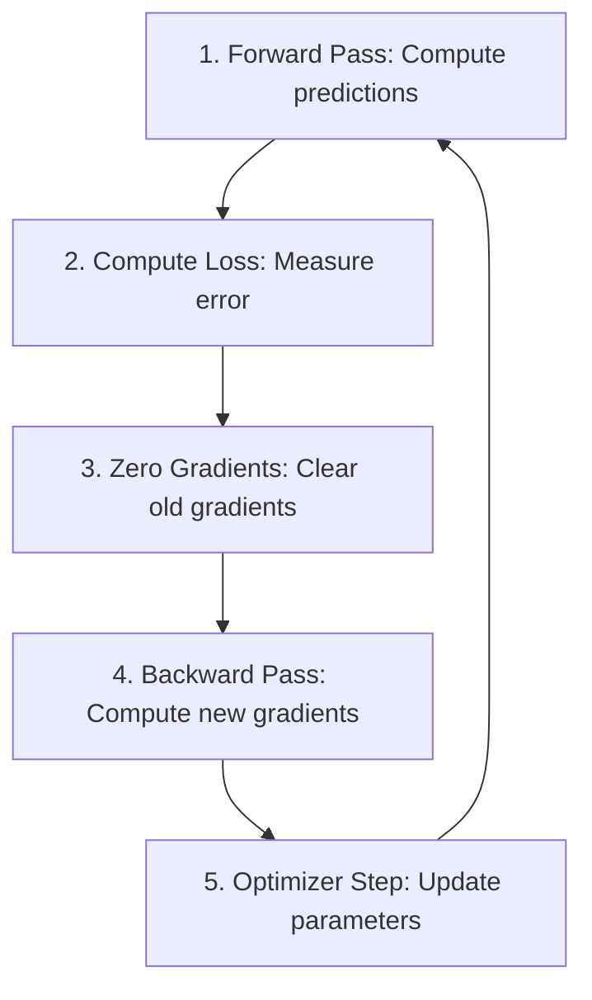

# 22. PyTorch Implementation Basics

> [!note] Prerequisites
> Before reading this section, you should be comfortable with CNN fundamentals (convolutions, pooling, activation functions) and have a basic understanding of PyTorch tensors. If you need a refresher, see [[20. Pooling Layers and Stride]] and [[21. The Complete CNN Architecture]].

This section provides an exhaustive, line-by-line walkthrough of building and training a Convolutional Neural Network for MNIST digit classification using PyTorch. Every single line of code is commented, every import is explained, and every concept is introduced from first principles before being used. By the end, you will understand not just *what* each piece does, but *why* it is structured that way and *how* the pieces fit together into a complete training pipeline.

---

## 1. Understanding the Imports

Before we write any code, we must understand what each imported module provides and why we need it. PyTorch is organized into several sub-modules, each responsible for a different aspect of deep learning.

```python
# ============================================================
# IMPORTS — Every module explained
# ============================================================

import torch                        # The core PyTorch library.
                                    # Provides the fundamental tensor data structure
                                    # (similar to NumPy arrays but with GPU support),
                                    # automatic differentiation via autograd, and
                                    # all basic operations like matrix multiplication,
                                    # reshaping, indexing, and device management.
                                    # Without this import, nothing else works.

import torch.nn as nn               # The neural network sub-module.
                                    # Contains all standard layer types (Conv2d, Linear,
                                    # MaxPool2d, ReLU, Dropout, BatchNorm2d, etc.),
                                    # the base class nn.Module for defining models,
                                    # and loss functions like CrossEntropyLoss, MSELoss.
                                    # The alias "nn" is a universal convention.

import torch.optim as optim         # The optimization sub-module.
                                    # Contains optimizer classes: SGD, Adam, RMSprop, etc.
                                    # Optimizers update model parameters using computed
                                    # gradients. Each optimizer implements a different
                                    # update rule (Adam uses adaptive learning rates,
                                    # SGD uses fixed or momentum-based updates).

from torch.utils.data import DataLoader  # The DataLoader class.
                                         # Wraps a Dataset and provides:
                                         #   - Automatic batching (grouping samples)
                                         #   - Shuffling (randomizing order each epoch)
                                         #   - Parallel loading (multiple workers)
                                         #   - Memory pinning (faster CPU→GPU transfer)
                                         # You almost never iterate over a Dataset directly;
                                         # you always use a DataLoader.

from torchvision import datasets    # Pre-built dataset classes for common benchmarks.
                                    # Includes MNIST, CIFAR-10, CIFAR-100, ImageNet,
                                    # Fashion-MNIST, and many more.
                                    # Each class handles downloading, extracting, and
                                    # reading the data automatically. They return
                                    # (image, label) tuples.

from torchvision import transforms  # Image transformation pipelines.
                                    # Provides composable transforms: ToTensor, Normalize,
                                    # RandomCrop, RandomHorizontalFlip, Resize, etc.
                                    # Transforms are applied to each sample as it is
                                    # loaded, enabling on-the-fly data augmentation.
```

> [!tip] Why do we import `nn` and `optim` separately?
> PyTorch deliberately separates the model definition (`torch.nn`) from the optimization strategy (`torch.optim`). This design choice means you can swap optimizers without changing your model, or swap models without changing your optimizer. It enforces a clean separation of concerns that makes code more modular and easier to experiment with.

---

## 2. Data Loading: The MNIST Dataset

### 2.1 What is MNIST?

MNIST (Modified National Institute of Standards and Technology) is the "Hello World" dataset of deep learning. It consists of 70,000 grayscale images of handwritten digits (0–9), each image being 28×28 pixels. The dataset is split into 60,000 training images and 10,000 test images. Each pixel is an integer value between 0 (white) and 255 (black), representing the ink intensity at that position.

### 2.2 The ToTensor Transform

Before a neural network can process an image, the raw pixel data must be converted into a PyTorch tensor. The `transforms.ToTensor()` transform performs three critical operations in one step:

1. **Type conversion**: It converts the input (typically a PIL Image or NumPy array) into a PyTorch tensor of type `torch.float32`.
2. **Dimension reordering**: It changes the image from HWC format (Height × Width × Channels) to CHW format (Channels × Height × Width). PyTorch convolutional layers expect the channel dimension first.
3. **Scale normalization**: It divides all pixel values by 255.0, mapping them from the integer range [0, 255] to the floating-point range [0.0, 1.0]. This is crucial because neural networks train much more stably with small input values.

```python
# ============================================================
# DATA LOADING — Downloading and preparing MNIST
# ============================================================

# Define the transform pipeline — for now, just ToTensor
transform = transforms.Compose([       # Compose chains multiple transforms together.
                                       # Even though we only have one transform now,
                                       # using Compose from the start makes it easy to
                                       # add more transforms later (normalization, augmentation).
    transforms.ToTensor()              # Converts PIL Image → FloatTensor, scales [0,255]→[0,1],
                                       # and rearranges from HWC to CHW format.
                                       # Output shape for MNIST: (1, 28, 28) where 1 = grayscale channels.
])

# Download and create the TRAINING dataset
train_dataset = datasets.MNIST(        # MNIST is a pre-built Dataset class from torchvision.
    root='./data',                     # Directory where the data will be stored.
                                       # If data doesn't exist here, it will be downloaded.
                                       # If it already exists, it will be loaded from disk.
                                       # The download creates a 'data' folder with raw and
                                       # processed subdirectories.
    train=True,                        # train=True means load the 60,000 training samples.
                                       # train=False would load the 10,000 test samples.
    download=True,                     # download=True means "if the data isn't at root,
                                       # download it from the internet." If it's already
                                       # downloaded, this is a no-op.
    transform=transform                # Apply our transform pipeline to every sample.
                                       # When you access train_dataset[i], the image
                                       # will already be a (1,28,28) FloatTensor in [0,1].
)

# Download and create the TEST dataset
test_dataset = datasets.MNIST(         # Same MNIST class, but now for test data.
    root='./data',                     # Same root directory — shares the downloaded files.
    train=False,                       # train=False loads the 10,000 test samples instead.
    download=True,                     # Same download behavior.
    transform=transform                # Same transform — test data gets the same preprocessing
                                       # (but NOT data augmentation — more on this later).
)
```

> [!warning] ToTensor Only Scales to [0,1]
> `ToTensor` scales pixels to [0, 1], but many pre-trained models (like VGG, ResNet) expect inputs normalized with mean=0 and std=1. For MNIST, [0, 1] scaling is usually sufficient, but for models pre-trained on ImageNet, you must add `transforms.Normalize(mean=[0.485, 0.456, 0.406], std=[0.229, 0.224, 0.225])` after `ToTensor`. We will cover this in detail in [[23. PyTorch Advanced - VGG16 and Pre-trained Models]].

---

## 3. The DataLoader: Batching, Shuffling, and Parallel Loading

The DataLoader is one of the most important utilities in PyTorch. It transforms a Dataset (which provides one sample at a time) into an iterable that provides batches of samples with additional features like shuffling and parallel loading.

### 3.1 What Does the DataLoader Do?

The DataLoader serves four essential functions:

1. **Batching**: Instead of processing one image at a time (which would be extremely slow due to poor GPU utilization), the DataLoader groups samples into mini-batches (typically 32, 64, or 128 samples). This allows the GPU to process multiple samples in parallel using matrix operations, which is far more efficient.

2. **Shuffling**: During training, the order of samples should be randomized each epoch. If the model always sees the data in the same order, it can learn spurious patterns related to the ordering (e.g., if all 0s come first, then all 1s, the model might oscillate between predicting 0 and predicting 1). Shuffling ensures each mini-batch is a representative sample of the full dataset.

3. **Parallel loading**: With `num_workers > 0`, the DataLoader uses separate Python processes to load data in the background while the GPU is processing the current batch. This overlaps data loading with computation, preventing the GPU from waiting for data.

4. **Memory pinning**: With `pin_memory=True`, the DataLoader allocates tensors in pinned (page-locked) memory, which speeds up the transfer from CPU to GPU. This is only relevant when training on a GPU.

```python
# ============================================================
# DATALOADERS — Wrapping datasets for efficient iteration
# ============================================================

train_loader = DataLoader(             # Create a DataLoader for the training set.
    dataset=train_dataset,             # The Dataset to wrap — provides (image, label) pairs.
    batch_size=64,                     # Number of samples per mini-batch.
                                       # 64 is a good default for MNIST.
                                       # Larger batches give more stable gradients but
                                       # require more GPU memory.
                                       # Smaller batches add more noise to gradients
                                       # (which can help escape local minima) but train slower.
    shuffle=True,                      # CRITICAL for training: randomize the order each epoch.
                                       # Without shuffling, the model sees samples in the same
                                       # order every epoch, which can lead to:
                                       #   - The model memorizing the order, not the patterns
                                       #   - Biased gradient estimates if data is sorted by class
                                       #   - Poor generalization
                                       # For training: ALWAYS shuffle.
    num_workers=2,                     # Number of subprocesses for data loading.
                                       # 0 = load in the main process (simple but slow).
                                       # 2-4 = good for most setups.
                                       # Each worker pre-loads batches in the background.
    pin_memory=True                    # Pin memory for faster CPU→GPU transfer.
                                       # Only useful when using a GPU.
                                       # Pinned memory allows faster DMA (Direct Memory Access)
                                       # transfers to the GPU.
)

test_loader = DataLoader(              # Create a DataLoader for the test set.
    dataset=test_dataset,              # The test Dataset.
    batch_size=64,                     # Same batch size — doesn't affect results,
                                       # only affects speed of evaluation.
    shuffle=False,                     # CRITICAL for evaluation: do NOT shuffle.
                                       # Shuffling is unnecessary during evaluation because
                                       # we're not computing gradients or updating weights.
                                       # Also, a consistent order makes results reproducible
                                       # and easier to debug.
    num_workers=2,                     # Same parallel loading for speed.
    pin_memory=True                    # Same memory pinning for GPU transfer.
)
```

> [!info] Why shuffle=True for Training but shuffle=False for Evaluation?
> During training, shuffling prevents the model from learning the order of the data rather than the patterns in the data. It ensures that each mini-batch is a random, representative sample from the dataset, which leads to more stable and unbiased gradient estimates. During evaluation, there is no gradient computation and no weight update, so the order of samples is irrelevant to the final metrics. Keeping `shuffle=False` during evaluation ensures reproducibility and slightly faster iteration.

---

## 4. Model Definition: Subclassing nn.Module

### 4.1 The nn.Module Base Class

Every neural network in PyTorch is defined as a class that inherits from `nn.Module`. This base class provides several critical features:

- **Parameter tracking**: Any `nn.Parameter` or `nn.Module` assigned as an attribute is automatically registered, so the optimizer can find all parameters to update.
- **Device management**: Calling `model.to('cuda')` moves all registered parameters to the GPU.
- **Forward/backward hooks**: You can register functions to run before or after forward or backward passes.
- **State dict**: The model can save and load its parameters via `state_dict()`.

### 4.2 The Two Required Methods

Every custom model must implement two methods:

1. **`__init__(self)`**: Define all layers and components here. This is where you "declare" the architecture. Think of it as a parts list — you're specifying what components exist, but not how they connect.

2. **`forward(self, x)`**: Define the data flow here. This is where you "wire" the layers together by specifying the order in which data passes through them. The `forward` method defines the computation graph dynamically — PyTorch traces through it to build the autograd graph for backpropagation.

```python
# ============================================================
# MODEL DEFINITION — A CNN for MNIST digit classification
# ============================================================

class MNISTNet(nn.Module):             # Inherit from nn.Module to get all the
                                       # parameter tracking, device management,
                                       # and autograd integration for free.

    def __init__(self):                # __init__ defines the layers (the "parts list")
        super(MNISTNet, self).__init__()  # Call the parent class's __init__.
                                       # This is ESSENTIAL — without it, nn.Module's
                                       # internal tracking mechanisms won't be set up,
                                       # and your model won't work properly.

        # ---- Convolutional Block 1 ----
        # Input: (batch, 1, 28, 28) — 1 grayscale channel, 28x28 pixels
        self.conv1 = nn.Conv2d(        # 2D convolution layer.
            in_channels=1,             # Number of channels in the INPUT.
                                       # MNIST images are grayscale → 1 channel.
                                       # RGB images would have in_channels=3.
            out_channels=32,           # Number of filters (kernels) to learn.
                                       # Each filter produces one output channel.
                                       # 32 is a common starting point — not too few
                                       # (would limit expressiveness), not too many
                                       # (would be slow and memory-heavy).
            kernel_size=3,             # Size of each convolution filter: 3×3.
                                       # This is the most common kernel size.
                                       # A 3×3 filter looks at a 3×3 patch of the input.
            stride=1,                  # How many pixels the filter moves each step.
                                       # stride=1 means the filter moves 1 pixel at a time,
                                       # producing an output with nearly the same spatial size
                                       # as the input (adjusted by kernel_size and padding).
            padding=1                  # Zero-padding added to both sides of the input.
                                       # padding=1 with kernel_size=3 and stride=1 gives
                                       # "same" padding: output spatial size = input spatial size.
                                       # Formula: output_size = floor((input_size + 2*padding - kernel_size) / stride) + 1
                                       # = floor((28 + 2*1 - 3) / 1) + 1 = 28
        )
        # After conv1: (batch, 32, 28, 28) — 32 channels, still 28×28

        self.relu1 = nn.ReLU()         # ReLU activation: f(x) = max(0, x).
                                       # Introduces non-linearity so the network can
                                       # learn complex patterns. Without non-linearities,
                                       # stacking convolutions would be equivalent to one
                                       # big linear transformation (losing expressiveness).

        self.pool1 = nn.MaxPool2d(     # Max pooling layer.
            kernel_size=2,             # Size of the pooling window: 2×2.
            stride=2                   # The pooling window moves 2 pixels at a time.
                                       # This means the windows DON'T overlap.
        )
        # After pool1: (batch, 32, 14, 14) — spatial dimensions halved.
        # MaxPool2d with kernel_size=2, stride=2 ALWAYS halves both height and width.

        # ---- Convolutional Block 2 ----
        # Input: (batch, 32, 14, 14)
        self.conv2 = nn.Conv2d(
            in_channels=32,            # Must match out_channels of previous conv layer.
                                       # The output of conv1 had 32 channels, so conv2
                                       # must accept 32 input channels.
            out_channels=64,           # Double the channels — common pattern.
                                       # As spatial dimensions decrease, we increase
                                       # channels to preserve representational capacity.
            kernel_size=3,
            stride=1,
            padding=1
        )
        # After conv2: (batch, 64, 14, 14)

        self.relu2 = nn.ReLU()         # Another ReLU after the second conv.
        self.pool2 = nn.MaxPool2d(kernel_size=2, stride=2)
        # After pool2: (batch, 64, 7, 7) — spatial dimensions halved again.

        # ---- Fully Connected (Linear) Layers ----
        self.flatten = nn.Flatten()    # Reshapes (batch, C, H, W) → (batch, C*H*W).
                                       # After pool2, the shape is (batch, 64, 7, 7).
                                       # Flattened: (batch, 64*7*7) = (batch, 3136).
                                       # We need to flatten before passing to Linear layers
                                       # because Linear layers expect 2D input (batch, features).

        self.fc1 = nn.Linear(          # First fully connected layer.
            in_features=64 * 7 * 7,    # MUST match the flattened size from conv layers.
                                       # 64 channels × 7 height × 7 width = 3136.
                                       # If this number is wrong, you get a runtime error.
                                       # ALWAYS verify by printing x.shape after flattening.
            out_features=128           # Hidden dimension — a hyperparameter.
                                       # 128 is a reasonable choice for MNIST.
                                       # Larger values = more capacity but more overfitting risk.
        )
        self.relu3 = nn.ReLU()         # ReLU after the first FC layer.

        self.fc2 = nn.Linear(          # Output layer.
            in_features=128,           # Must match out_features of fc1.
            out_features=10            # One output per class (digits 0-9).
                                       # These are raw LOGITS, not probabilities.
                                       # CrossEntropyLoss will apply softmax internally.
        )

    def forward(self, x):             # Define the data flow through the network.
                                       # x has shape: (batch_size, 1, 28, 28)

        # ---- Pass through Conv Block 1 ----
        x = self.conv1(x)             # Convolution: (B,1,28,28) → (B,32,28,28)
        x = self.relu1(x)             # ReLU: shape unchanged, negatives → 0
        x = self.pool1(x)             # MaxPool: (B,32,28,28) → (B,32,14,14)

        # ---- Pass through Conv Block 2 ----
        x = self.conv2(x)             # Convolution: (B,32,14,14) → (B,64,14,14)
        x = self.relu2(x)             # ReLU: shape unchanged
        x = self.pool2(x)             # MaxPool: (B,64,14,14) → (B,64,7,7)

        # ---- Flatten and pass through FC layers ----
        x = self.flatten(x)           # Flatten: (B,64,7,7) → (B,3136)
        x = self.fc1(x)               # Linear: (B,3136) → (B,128)
        x = self.relu3(x)             # ReLU: shape unchanged
        x = self.fc2(x)               # Linear: (B,128) → (B,10)

        return x                      # Return raw logits. DO NOT apply softmax here!
                                       # CrossEntropyLoss applies LogSoftmax + NLLLoss internally.
```

### 4.3 Understanding Conv2d Parameters in Detail

The `nn.Conv2d` layer is the most important layer in a CNN. Let's examine each parameter exhaustively:

| Parameter | What It Controls | Typical Values | Effect |
|-----------|-----------------|----------------|--------|
| `in_channels` | Number of channels in the input tensor | 1 (grayscale), 3 (RGB), or previous layer's `out_channels` | Must match exactly or you get a dimension error |
| `out_channels` | Number of filters learned | 32, 64, 128, 256, 512 (doubling pattern) | More channels = more features but more parameters |
| `kernel_size` | Spatial extent of each filter | 3 (most common), 5, 7 (first layer only), 1 (bottleneck) | Larger kernels capture wider context but have more parameters |
| `stride` | Step size when sliding the filter | 1 (default), 2 (for downsampling) | stride=2 halves the spatial dimensions |
| `padding` | Zero-padding added to input borders | 0 (no padding), 1 (same padding for 3×3 kernels) | padding=1 with kernel_size=3 preserves spatial size |

The output spatial dimension formula is:

$$H_{out} = \left\lfloor \frac{H_{in} + 2 \times \text{padding} - \text{kernel\_size}}{\text{stride}} \right\rfloor + 1$$

$$W_{out} = \left\lfloor \frac{W_{in} + 2 \times \text{padding} - \text{kernel\_size}}{\text{stride}} \right\rfloor + 1$$

### 4.4 Understanding MaxPool2d in Detail

`nn.MaxPool2d` performs max pooling, which reduces the spatial dimensions of the feature maps by taking the maximum value in each pooling window. With `kernel_size=2` and `stride=2`, the pooling window covers a 2×2 region and moves 2 pixels at a time (no overlap), effectively halving both the height and width of the feature map.

This serves two purposes: (1) it reduces the computational load for subsequent layers, and (2) it provides a form of translation invariance — the exact position of a feature matters less than its presence in a general region.

### 4.5 The Flatten Operation: Understanding `x.view(x.size(0), -1)`

Instead of using `nn.Flatten()`, you will often see the equivalent operation written as:

```python
x = x.view(x.size(0), -1)            # Reshape the tensor for the FC layer.
                                       # x.size(0) = batch_size (the first dimension).
                                       # -1 means "infer this dimension from the others."
                                       # Total elements must be preserved, so:
                                       # -1 = (total_elements) / batch_size
                                       # For our case: -1 = 64*7*7 = 3136
                                       # Result: (batch_size, 3136)
```

The `-1` is a PyTorch convention that means "figure out this dimension automatically." Since the total number of elements in the tensor must remain constant, PyTorch computes the missing dimension by dividing the total number of elements by the product of the known dimensions. This is particularly useful because the flattened size depends on the spatial dimensions of the feature maps, which depend on the input image size, kernel sizes, strides, and paddings — all of which are error-prone to compute manually.

### 4.6 Linear Layers: Why 3136 Input Features?

The first `nn.Linear` layer's `in_features` must exactly match the number of features after flattening. This is calculated as:

$$\text{in\_features} = C \times H \times W = 64 \times 7 \times 7 = 3136$$

where $C$, $H$, and $W$ are the number of channels, height, and width of the final feature map before flattening. If this number is wrong, PyTorch will throw a `RuntimeError: mat1 and mat2 shapes cannot be multiplied`. This is one of the most common bugs when building CNNs, and we will discuss how to debug it in [[25. Common Mistakes and How to Fix Them]].

---

## 5. Using nn.Sequential for Cleaner Code

### 5.1 What is nn.Sequential?

`nn.Sequential` is a container that chains layers together in order. When you pass input through a `Sequential` module, it automatically flows through each layer in sequence, without you having to write explicit calls. This makes the code more concise and less error-prone when the data flow is purely linear (no branching, no residual connections).

### 5.2 Refactoring with nn.Sequential

```python
class MNISTNetSequential(nn.Module):
    def __init__(self):
        super(MNISTNetSequential, self).__init__()

        # Group the convolutional layers into a Sequential block
        self.features = nn.Sequential(            # 'features' is a conventional name for the
                                                   # convolutional feature extraction part.
            nn.Conv2d(1, 32, kernel_size=3, stride=1, padding=1),   # (B,1,28,28)→(B,32,28,28)
            nn.ReLU(),                                              # Non-linearity
            nn.MaxPool2d(kernel_size=2, stride=2),                  # (B,32,28,28)→(B,32,14,14)
            nn.Conv2d(32, 64, kernel_size=3, stride=1, padding=1),  # (B,32,14,14)→(B,64,14,14)
            nn.ReLU(),                                              # Non-linearity
            nn.MaxPool2d(kernel_size=2, stride=2),                  # (B,64,14,14)→(B,64,7,7)
        )

        # Group the fully connected layers into a Sequential block
        self.classifier = nn.Sequential(          # 'classifier' is a conventional name for the
                                                   # fully connected classification part.
            nn.Flatten(),                         # (B,64,7,7) → (B,3136)
            nn.Linear(64 * 7 * 7, 128),           # (B,3136) → (B,128)
            nn.ReLU(),                            # Non-linearity
            nn.Linear(128, 10),                   # (B,128) → (B,10) — raw logits
        )

    def forward(self, x):
        x = self.features(x)              # Pass through all conv layers at once
        x = self.classifier(x)            # Pass through all FC layers at once
        return x
```

> [!tip] When to Use nn.Sequential vs. Explicit Calls
> Use `nn.Sequential` when the data flow is strictly sequential (no skips, branches, or conditional logic). Use explicit layer-by-layer calls in `forward()` when you need residual connections (adding input to output), concatenation (like in DenseNet), or any non-trivial data flow pattern. For simple CNNs like our MNIST model, `nn.Sequential` is the cleaner choice.

---

## 6. The Training Loop: The 5-Step Cycle

The training loop is the heart of the learning process. For each mini-batch of data, the model performs a 5-step cycle that gradually improves its parameters. Understanding each step deeply is essential for debugging and optimizing your models.



### 6.1 Step-by-Step Explanation

```python
# ============================================================
# TRAINING SETUP — Loss function, optimizer, and device
# ============================================================

device = torch.device('cuda' if torch.cuda.is_available() else 'cpu')
                                       # Select GPU if available, otherwise CPU.
                                       # CUDA is NVIDIA's GPU computing platform.
                                       # torch.cuda.is_available() checks if a
                                       # CUDA-capable GPU is installed and accessible.

model = MNISTNet().to(device)          # Instantiate the model and move it to the device.
                                       # .to(device) moves ALL parameters to the GPU (if available).
                                       # Both the model AND the data must be on the same device.

criterion = nn.CrossEntropyLoss()      # The loss function for multi-class classification.
                                       # IMPORTANT: CrossEntropyLoss expects RAW LOGITS as input
                                       # (NOT softmax outputs) and INTEGER CLASS LABELS as targets
                                       # (NOT one-hot vectors).
                                       # Internally, it computes:
                                       #   loss = -log(softmax(logits)[correct_class])
                                       # This is equivalent to LogSoftmax + NLLLoss combined.

optimizer = optim.Adam(model.parameters(),  # Adam optimizer: Adaptive Moment Estimation.
                                       # Adam maintains per-parameter adaptive learning rates
                                       # using estimates of first and second moments of gradients.
                                       # Default parameters:
                                       #   lr = 0.001        (learning rate)
                                       #   betas = (0.9, 0.999)  (momentum coefficients)
                                       #   eps = 1e-8        (numerical stability)
                                       #   weight_decay = 0  (L2 regularization — off by default)
    lr=0.001                           # Learning rate: controls the step size of parameter updates.
                                       # 0.001 is Adam's default and works well for most tasks.
                                       # Too high → training diverges.
                                       # Too low → training is painfully slow.
)

# ============================================================
# TRAINING LOOP — The 5-step cycle
# ============================================================

num_epochs = 5                         # Number of complete passes through the training data.

for epoch in range(num_epochs):        # Outer loop: iterate over the entire dataset multiple times.
                                       # Each complete pass is called an "epoch."

    model.train()                      # Set the model to training mode.
                                       # This is IMPORTANT because some layers behave
                                       # differently in training vs. evaluation:
                                       #   - Dropout: active in training (randomly zeros elements),
                                       #     inactive in evaluation (keeps all elements)
                                       #   - BatchNorm: uses batch statistics in training,
                                       #     uses running statistics in evaluation
                                       # If you forget this, your model may behave unexpectedly!

    running_loss = 0.0                 # Accumulate the loss over all batches in this epoch.
                                       # We'll divide by the number of batches at the end
                                       # to get the average loss per batch.

    for batch_idx, (images, labels) in enumerate(train_loader):
                                       # Inner loop: iterate over mini-batches.
                                       # train_loader yields (images, labels) tuples.
                                       # images shape: (batch_size, 1, 28, 28)
                                       # labels shape: (batch_size,)
                                       # enumerate gives us batch_idx for progress tracking.

        # ---- Move data to the same device as the model ----
        images = images.to(device)     # Move images to GPU (if available).
                                       # If model is on GPU and data is on CPU (or vice versa),
                                       # you'll get a runtime error.
        labels = labels.to(device)     # Move labels to GPU.

        # ============================================================
        # STEP 1: FORWARD PASS
        # ============================================================
        outputs = model(images)        # Pass the batch of images through the model.
                                       # outputs shape: (batch_size, 10)
                                       # Each row contains 10 raw logits — one per digit class.
                                       # No gradient computation yet — we just need the predictions.

        # ============================================================
        # STEP 2: COMPUTE THE LOSS
        # ============================================================
        loss = criterion(outputs, labels)
                                       # Compute the cross-entropy loss between predictions and labels.
                                       # outputs: (64, 10) — raw logits for each sample.
                                       # labels: (64,) — integer class indices (0-9).
                                       # The loss is a SINGLE scalar that measures how wrong
                                       # the model's predictions are on this batch.
                                       # Lower loss = better predictions.

        # ============================================================
        # STEP 3: ZERO THE GRADIENTS
        # ============================================================
        optimizer.zero_grad()          # Clear the gradients from the previous iteration.
                                       # CRITICAL: PyTorch ACCUMULATES gradients by default.
                                       # If you don't zero them, the new gradients will be
                                       # ADDED to the old ones, leading to incorrect updates.
                                       # This is one of the most common beginner mistakes!
                                       # Always call zero_grad() before backward().

        # ============================================================
        # STEP 4: BACKWARD PASS (Backpropagation)
        # ============================================================
        loss.backward()                # Compute gradients of the loss w.r.t. all parameters.
                                       # This traces back through the computation graph built
                                       # during the forward pass, applying the chain rule at
                                       # each layer to compute ∂loss/∂weight for every parameter.
                                       # After this call, every parameter's .grad attribute
                                       # contains the gradient of the loss with respect to it.

        # ============================================================
        # STEP 5: OPTIMIZER STEP (Update Parameters)
        # ============================================================
        optimizer.step()               # Update all parameters using the computed gradients.
                                       # For Adam, the update rule is:
                                       #   m = β₁*m + (1-β₁)*grad      (1st moment estimate)
                                       #   v = β₂*v + (1-β₂)*grad²     (2nd moment estimate)
                                       #   m_hat = m / (1-β₁ᵗ)         (bias correction)
                                       #   v_hat = v / (1-β₂ᵗ)         (bias correction)
                                       #   param = param - lr * m_hat / (√v_hat + ε)
                                       # Each parameter takes a step in the direction that
                                       # (approximately) reduces the loss.

        # ---- Logging ----
        running_loss += loss.item()    # .item() extracts the scalar value from the tensor.
                                       # IMPORTANT: Use .item() here! If you just do += loss,
                                       # you'll keep a reference to the entire computation graph,
                                       # causing a GPU memory leak (each iteration adds a new
                                       # graph that can't be freed). .item() returns a plain
                                       # Python float, releasing the graph.

        if batch_idx % 100 == 0:       # Print progress every 100 batches.
            print(f'Epoch [{epoch+1}/{num_epochs}], '
                  f'Step [{batch_idx}/{len(train_loader)}], '
                  f'Loss: {loss.item():.4f}')

    # ---- Epoch summary ----
    avg_loss = running_loss / len(train_loader)
    print(f'Epoch [{epoch+1}/{num_epochs}], Average Loss: {avg_loss:.4f}')
```

> [!warning] The Order Matters: zero_grad → forward → loss → backward → step
> The 5 steps must be executed in this exact order. A common mistake is to put `zero_grad()` after `backward()`, which would erase the gradients you just computed. Another common mistake is to forget `zero_grad()` entirely, which causes gradients to accumulate across iterations. The correct sequence is: clear old gradients → compute new predictions → measure error → compute new gradients → update parameters.

---

## 7. CrossEntropyLoss: What It Expects

The `nn.CrossEntropyLoss` function is the standard loss function for multi-class classification problems. It is crucial to understand exactly what format it expects for its inputs and targets, because feeding the wrong format is a very common source of bugs.

### 7.1 Input Format: Raw Logits (NOT Softmax Probabilities)

The first argument to `CrossEntropyLoss` should be **raw logits** — the unnormalized scores output by the final linear layer. The loss function internally applies the softmax operation to convert logits to probabilities, then computes the negative log-likelihood. This is numerically more stable than applying softmax manually and then computing the loss, because it uses the LogSumExp trick to avoid overflow/underflow:

$$\text{CrossEntropy}(x, y) = -\log\left(\frac{\exp(x_y)}{\sum_j \exp(x_j)}\right) = -x_y + \log\left(\sum_j \exp(x_j)\right)$$

where $x$ is the vector of logits and $y$ is the correct class index.

### 7.2 Target Format: Integer Class Indices (NOT One-Hot Vectors)

The second argument should be a 1D tensor of **integer class indices** in the range `[0, num_classes - 1]`. For MNIST with 10 classes, this means integers from 0 to 9. Do NOT pass one-hot encoded labels (e.g., `[0, 0, 1, 0, 0, 0, 0, 0, 0, 0]` for class 2).

```python
# CORRECT usage:
outputs = model(images)                # Shape: (batch_size, 10) — raw logits
loss = criterion(outputs, labels)      # labels: (batch_size,) — integers 0-9

# WRONG usage (common mistakes):
# Mistake 1: Applying softmax before CrossEntropyLoss
probs = torch.softmax(outputs, dim=1)  # DON'T DO THIS
loss = criterion(probs, labels)        # This applies softmax TWICE — wrong!

# Mistake 2: Passing one-hot labels
one_hot = torch.nn.functional.one_hot(labels, num_classes=10).float()
loss = criterion(outputs, one_hot)     # This will give a dimension error or wrong loss
```

> [!danger] Double Softmax Bug
> Applying `softmax()` before `CrossEntropyLoss` is a critical bug. Since `CrossEntropyLoss` already applies softmax internally, adding softmax before it means you're applying it twice: $\text{softmax}(\text{softmax}(\text{logits}))$. This compresses the probability distribution excessively, leading to very slow training or complete failure to learn. Always pass raw logits to `CrossEntropyLoss`.

---

## 8. Adam Optimizer: What It Does

Adam (Adaptive Moment Estimation) is the most popular optimizer for deep learning. It combines the benefits of two other optimizers:

1. **Momentum** (from SGD with momentum): It keeps an exponentially decaying average of past gradients (first moment, $m$), which helps accelerate convergence in the correct direction and dampen oscillations.

2. **RMSprop**: It keeps an exponentially decaying average of past squared gradients (second moment, $v$), which adapts the learning rate for each parameter individually. Parameters with large gradients get smaller effective learning rates, and parameters with small gradients get larger effective learning rates.

The Adam update rules are:

$$m_t = \beta_1 \cdot m_{t-1} + (1 - \beta_1) \cdot g_t$$

$$v_t = \beta_2 \cdot v_{t-1} + (1 - \beta_2) \cdot g_t^2$$

$$\hat{m}_t = \frac{m_t}{1 - \beta_1^t}, \quad \hat{v}_t = \frac{v_t}{1 - \beta_2^t}$$

$$\theta_t = \theta_{t-1} - \alpha \cdot \frac{\hat{m}_t}{\sqrt{\hat{v}_t} + \epsilon}$$

where $g_t$ is the gradient, $\beta_1 = 0.9$, $\beta_2 = 0.999$, $\epsilon = 10^{-8}$, and $\alpha = 0.001$.

> [!info] Why Adam's Default Learning Rate is 0.001
> Adam's effective step size is approximately $\alpha / \sqrt{\hat{v}_t}$, which means the actual parameter updates are typically much smaller than 0.001. This is why Adam's default learning rate is an order of magnitude smaller than SGD's typical default of 0.01. The adaptive scaling means you rarely need to tune Adam's learning rate as carefully as SGD's.

---

## 9. The Evaluation Loop

After training, we need to evaluate the model's performance on the test set. The evaluation loop differs from the training loop in several critical ways:

1. **No gradient computation**: We don't need gradients during evaluation because we're not updating parameters. Using `torch.no_grad()` saves memory and speeds up computation.
2. **model.eval()**: Switches certain layers to their evaluation behavior (no dropout, use running statistics for batch norm).
3. **No optimizer step**: There is no backpropagation or parameter update during evaluation.

```python
# ============================================================
# EVALUATION LOOP — Measuring model performance on test data
# ============================================================

model.eval()                           # Set the model to evaluation mode.
                                       # This changes the behavior of:
                                       #   - Dropout: deactivated (all neurons active)
                                       #   - BatchNorm: uses running mean/var instead of
                                       #     batch mean/var (more stable predictions)
                                       # FORGETTING THIS is a common bug that leads to
                                       # randomly degraded test performance!

correct = 0                           # Count of correctly classified samples.
total = 0                             # Total number of samples evaluated.

with torch.no_grad():                 # Disable gradient computation.
                                       # This has two benefits:
                                       # 1. Memory: gradients aren't stored, so GPU memory
                                       #    usage is much lower (roughly halved).
                                       # 2. Speed: the autograd engine doesn't need to
                                       #    track operations, so forward passes are faster.
                                       # ALWAYS use this during evaluation!

    for images, labels in test_loader:  # Iterate over test batches.
                                       # No need for enumerate — we don't need batch indices.

        images = images.to(device)     # Move data to the same device as the model.
        labels = labels.to(device)     # Must be on same device for comparison.

        outputs = model(images)        # Forward pass: compute predictions.
                                       # outputs shape: (batch_size, 10)

        # ---- Get predicted class ----
        _, predicted = torch.max(outputs, 1)
                                       # torch.max returns (values, indices) along dim=1.
                                       # values: the maximum logit in each row (not needed, hence _).
                                       # predicted: the INDEX of the maximum logit in each row.
                                       # dim=1 means we're finding the max across the 10 classes.
                                       # predicted shape: (batch_size,)

        # ---- Count correct predictions ----
        total += labels.size(0)        # labels.size(0) = batch_size (number of samples in batch).
                                       # Add to running total.

        correct += (predicted == labels).sum().item()
                                       # (predicted == labels) creates a boolean tensor:
                                       #   True where prediction matches label, False otherwise.
                                       # .sum() counts the True values (correct predictions).
                                       # .item() converts the 0-d tensor to a Python integer.

# ---- Compute and print accuracy ----
accuracy = 100 * correct / total       # Accuracy as a percentage.
print(f'Test Accuracy: {accuracy:.2f}%')
                                       # A well-trained MNIST CNN should achieve >98% accuracy.
```

> [!tip] Always Pair model.eval() with torch.no_grad()
> These two calls serve different purposes and both are necessary. `model.eval()` changes layer *behavior* (disabling dropout, switching batch norm statistics), while `torch.no_grad()` disables gradient *computation* (saving memory and time). Using only one without the other either gives noisy metrics or wastes resources.

---

## 10. Complete End-to-End Example

Here is the complete, runnable code from start to finish:

```python
# ============================================================
# COMPLETE MNIST CNN — End-to-end training and evaluation
# ============================================================

# ---- 1. Imports ----
import torch
import torch.nn as nn
import torch.optim as optim
from torch.utils.data import DataLoader
from torchvision import datasets, transforms

# ---- 2. Device configuration ----
device = torch.device('cuda' if torch.cuda.is_available() else 'cpu')
print(f'Using device: {device}')

# ---- 3. Data loading ----
transform = transforms.Compose([transforms.ToTensor()])

train_dataset = datasets.MNIST(root='./data', train=True, download=True, transform=transform)
test_dataset = datasets.MNIST(root='./data', train=False, download=True, transform=transform)

train_loader = DataLoader(train_dataset, batch_size=64, shuffle=True, num_workers=2, pin_memory=True)
test_loader = DataLoader(test_dataset, batch_size=64, shuffle=False, num_workers=2, pin_memory=True)

# ---- 4. Model definition ----
class MNISTNet(nn.Module):
    def __init__(self):
        super(MNISTNet, self).__init__()
        self.features = nn.Sequential(
            nn.Conv2d(1, 32, kernel_size=3, stride=1, padding=1),
            nn.ReLU(),
            nn.MaxPool2d(kernel_size=2, stride=2),
            nn.Conv2d(32, 64, kernel_size=3, stride=1, padding=1),
            nn.ReLU(),
            nn.MaxPool2d(kernel_size=2, stride=2),
        )
        self.classifier = nn.Sequential(
            nn.Flatten(),
            nn.Linear(64 * 7 * 7, 128),
            nn.ReLU(),
            nn.Linear(128, 10),
        )

    def forward(self, x):
        x = self.features(x)
        x = self.classifier(x)
        return x

model = MNISTNet().to(device)

# ---- 5. Loss and optimizer ----
criterion = nn.CrossEntropyLoss()
optimizer = optim.Adam(model.parameters(), lr=0.001)

# ---- 6. Training loop ----
num_epochs = 5
for epoch in range(num_epochs):
    model.train()
    running_loss = 0.0
    for batch_idx, (images, labels) in enumerate(train_loader):
        images = images.to(device)
        labels = labels.to(device)

        outputs = model(images)         # Step 1: Forward pass
        loss = criterion(outputs, labels)  # Step 2: Compute loss
        optimizer.zero_grad()           # Step 3: Zero gradients
        loss.backward()                 # Step 4: Backward pass
        optimizer.step()                # Step 5: Update parameters

        running_loss += loss.item()

    avg_loss = running_loss / len(train_loader)
    print(f'Epoch [{epoch+1}/{num_epochs}], Loss: {avg_loss:.4f}')

# ---- 7. Evaluation ----
model.eval()
correct = 0
total = 0
with torch.no_grad():
    for images, labels in test_loader:
        images = images.to(device)
        labels = labels.to(device)
        outputs = model(images)
        _, predicted = torch.max(outputs, 1)
        total += labels.size(0)
        correct += (predicted == labels).sum().item()

print(f'Test Accuracy: {100 * correct / total:.2f}%')
```

---

## Summary

| Component | Purpose | Key Detail |
|-----------|---------|------------|
| `transforms.ToTensor()` | Convert image to tensor | Scales [0,255]→[0,1], reorders HWC→CHW |
| `DataLoader` | Batch and iterate data | `shuffle=True` for train, `False` for eval |
| `nn.Module` | Base class for models | Must implement `__init__` and `forward` |
| `nn.Conv2d` | 2D convolution | Output size formula with padding, stride |
| `nn.MaxPool2d` | Spatial downsampling | `kernel_size=2, stride=2` halves dimensions |
| `nn.Linear` | Fully connected layer | Input features must match flattened size |
| `nn.CrossEntropyLoss` | Classification loss | Expects raw logits + integer labels |
| `optimizer.zero_grad()` | Clear old gradients | Must call BEFORE `backward()` |
| `loss.backward()` | Compute gradients | Uses autograd chain rule |
| `optimizer.step()` | Update parameters | Uses Adam's adaptive update rule |
| `model.eval()` | Switch to eval mode | Changes Dropout and BatchNorm behavior |
| `torch.no_grad()` | Disable gradients | Saves memory and time during evaluation |

> [!note] Next Steps
> In [[23. PyTorch Advanced - VGG16 and Pre-trained Models]], we will learn how to use pre-trained models and implement the VGG16 architecture from scratch, which is essential for transfer learning on real-world datasets.
