# 8. Evolution and Deep Dive of CNN Architectures

## 1. Historical Evolution of CNN Architectures

### 1.1 Introduction
The history of convolutional neural network (CNN) architectures is a narrative of conceptual breakthroughs, each solving a critical limitation of its predecessor. From LeNet-5's demonstration that learned convolutional features could outperform hand-crafted pipelines, to AlexNet's leverage of GPU acceleration, to ResNet's solution to the degradation problem that enabled hundred-layer networks, each generation introduced ideas that permanently altered computer vision. 

By tracing this evolution, we can develop an intuitive understanding of the engineering decisions behind modern deep networks.

---

### 1.2 LeNet-5 (1998): The Proof of Concept

#### Historical Context
In the late 1980s and 1990s, optical character recognition (OCR) and document analysis relied heavily on hand-crafted feature engineering. Practitioners designed feature extractors (such as Gabor filters, edge detectors, or histogram operators) by hand and fed the extracted features into shallow classifiers like Support Vector Machines (SVMs) or K-Nearest Neighbors (KNN). 

Yann LeCun and his team at AT&T Bell Labs challenged this paradigm by proposing an end-to-end differentiable system. By using backpropagation to train convolutional layers directly from raw pixels, LeNet-5 proved that feature extraction and classification could be optimized jointly.

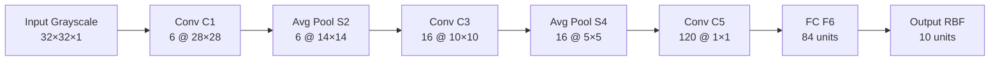

#### Architecture Specification
LeNet-5 consists of 7 learnable layers (5 convolutional/subsampling stages + 2 fully connected layers), designed to process $32 \times 32 \times 1$ grayscale images:

| Layer | Type | Input Shape | Output Shape | Parameter Calculation | Total Parameters |
| :--- | :--- | :--- | :--- | :--- | :--- |
| **C1** | Conv 5×5, stride 1 | $32\times32\times1$ | $28\times28\times6$ | $(5 \times 5 \times 1 + 1) \times 6$ | $156$ |
| **S2** | Avg Pool 2×2, stride 2 | $28\times28\times6$ | $14\times14\times6$ | $(1 \text{ weight} + 1 \text{ bias}) \times 6$ | $12$ |
| **C3** | Conv 5×5 (Custom Connection) | $14\times14\times6$ | $10\times10\times16$ | Non-standard sparse connectivity matrix | $1{,}516$ |
| **S4** | Avg Pool 2×2, stride 2 | $10\times10\times16$ | $5\times5\times16$ | $(1 \text{ weight} + 1 \text{ bias}) \times 16$ | $32$ |
| **C5** | Conv 5×5, stride 1 | $5\times5\times16$ | $1\times1\times120$ | $(5 \times 5 \times 16 + 1) \times 120$ | $48{,}120$ |
| **F6** | Fully Connected | $120$ | $84$ | $120 \times 84 + 84$ | $10{,}164$ |
| **Output**| FC (Euclidean RBF) | $84$ | $10$ | $84 \times 10$ | $840$ |

*Total Parameters*: **~60,000**

#### Key Design Choices and Limitations
*   **Sparse Connections in C3**: To limit parameter explosion and break symmetry, LeCun used a custom sparse connection table between S2 and C3. Not all S2 feature maps connected to every C3 feature map. For instance, some C3 maps took inputs from only 3 S2 maps, others from 4, and one from all 6. This design choice is now obsolete, replaced by uniform dense connections and group convolutions.
*   **Average Pooling with Learnable Coefficients**: The subsampling layers (S2, S4) did not simply compute average values. Instead, they computed the average of a $2 \times 2$ block, multiplied this by a single trainable coefficient (scalar weight), added a trainable bias, and then passed the result through a sigmoid activation function.
*   **Saturating Activations**: LeNet-5 relied on Sigmoid and Hyperbolic Tangent ($\tanh$) activation functions:
    $$\tanh(x) = \frac{e^x - e^{-x}}{e^x + e^{-x}}, \quad \sigma(x) = \frac{1}{1 + e^{-x}}$$
    These functions suffer from the **vanishing gradient problem**. Because their derivatives approach zero when the input is far from the origin ($|x| \gg 0$), backpropagated error signals decay exponentially in deeper networks. This severely restricted LeNet-5 from scaling to greater depths.
*   **Scale Limitations**: Designed for $28 \times 28$ handwritten digits centered in $32 \times 32$ fields, the network lacked the capacity, receptive field sizes, and training stability to process high-resolution color images with complex, cluttered backgrounds.

---

### 1.3 AlexNet (2012): The Breakthrough

#### The ImageNet Moment
By 2011, the computer vision community had reached an performance plateau. The ImageNet Large Scale Visual Recognition Challenge (ILSVRC), containing over 1.2 million high-resolution images across 1000 categories, was dominated by hand-crafted descriptor pipelines (such as SIFT and HOG) paired with shallow classifiers (such as Support Vector Machines with RBF kernels). The winning top-5 error rate hovered around 26%.

In 2012, Alex Krizhevsky, Ilya Sutskever, and Geoffrey Hinton entered **AlexNet**. It achieved a top-5 error rate of **15.3%**, outperforming the second-place entry (which scored 26.2%) by an unprecedented margin of 10.9 percentage points. This moment established deep learning as the dominant approach for visual recognition.

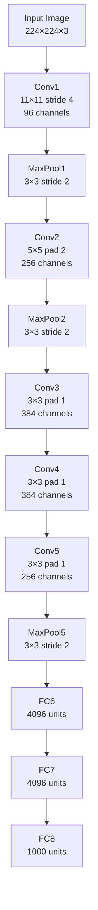

#### Architecture Specification
AlexNet contains 5 convolutional layers followed by 3 fully connected layers, processing $224 \times 224 \times 3$ RGB input images:

| Layer | Type | Input Shape | Output Shape | Parameter Calculation | Total Parameters |
| :--- | :--- | :--- | :--- | :--- | :--- |
| **Conv1** | Conv 11×11, stride 4 | $224\times224\times3$ | $55\times55\times96$ | $(11 \times 11 \times 3 + 1) \times 96$ | $34{,}944$ |
| **Pool1** | MaxPool 3×3, stride 2 | $55\times55\times96$ | $27\times27\times96$ | No parameters | $0$ |
| **Conv2** | Conv 5×5, pad 2, stride 1 | $27\times27\times96$ | $27\times27\times256$| $(5 \times 5 \times 96 + 1) \times 256$ | $614{,}656$ |
| **Pool2** | MaxPool 3×3, stride 2 | $27\times27\times256$| $13\times13\times256$| No parameters | $0$ |
| **Conv3** | Conv 3×3, pad 1, stride 1 | $13\times13\times256$| $13\times13\times384$| $(3 \times 3 \times 256 + 1) \times 384$| $885{,}120$ |
| **Conv4** | Conv 3×3, pad 1, stride 1 | $13\times13\times384$| $13\times13\times384$| $(3 \times 3 \times 384 + 1) \times 384$| $1{,}327{,}488$ |
| **Conv5** | Conv 3×3, pad 1, stride 1 | $13\times13\times384$| $13\times13\times256$| $(3 \times 3 \times 384 + 1) \times 256$| $884{,}992$ |
| **Pool5** | MaxPool 3×3, stride 2 | $13\times13\times256$| $6\times6\times256$  | No parameters | $0$ |
| **FC6** | Fully Connected | $6\times6\times256$ ($9216$)| $4096$ | $9216 \times 4096 + 4096$ | $37{,}752{,}832$ |
| **FC7** | Fully Connected | $4096$ | $4096$ | $4096 \times 4096 + 4096$ | $16{,}781{,}312$ |
| **FC8** | Fully Connected | $4096$ | $1000$ | $4096 \times 1000 + 1000$ | $4{,}097{,}000$ |

*Total Parameters*: **~61,100,352**

#### Key Innovations

##### 1. Rectified Linear Unit (ReLU) Activation
AlexNet replaced saturating non-linearities with the non-saturating Rectified Linear Unit (ReLU) activation:
$$f(x) = \max(0, x)$$
This choice had a profound impact on training dynamics:
*   **Constant Gradient for Positive Inputs**: For any $x > 0$, the derivative $f'(x) = 1$. This prevents gradient decay during backpropagation, helping mitigate the vanishing gradient problem.
*   **Computational Efficiency**: Unlike exponential calculations in sigmoids, ReLU can be implemented via a simple thresholding operation at the hardware level.
*   **Sparse Representations**: For $x < 0$, the neuron outputs zero. On average, this leads to a fraction of active neurons at any given time, producing sparse representations.

```
       Linear / Saturating (Tanh)              Non-Saturating (ReLU)
                f(x)                                    f(x)
                 |   /                                   |   /
            _..-'|'-.._                                  |  / 
          _.-'   |   '-._                                | /  
    -------------+------------- x                 -------+------- x
        -3       |       3                               |
                 |                                       |
```

##### 2. Dropout Regularization
With 61 million parameters and relatively limited data by modern standards, AlexNet faced severe overfitting. To regularize the fully connected layers FC6 and FC7, Krizhevsky et al. adopted **Dropout** with a probability of $p = 0.5$.

```
       Training (Active Dropout)                Inference (Dropout Off)
            In -> [O] [X] [O]                       In -> [O] [O] [O]
                   \   /   /                               \  |  /
                    \ /   /                                 \ | /
                    [O] [O]                                 [O] [O]
```

*   **During Training**: For each training batch, each neuron's activation is set to $0$ with a probability of $0.5$. The remaining active weights are scaled up by a factor of $\frac{1}{1-p} = 2.0$ to preserve the expected sum of activations. This prevents co-adaptation of features, forcing every neuron to learn robust, self-reliant feature representations.
*   **During Inference**: All neurons are kept active ($p = 0.0$). The weights are used as-is, resulting in a deterministic, averaged ensemble of the sub-networks trained during the dropout phase.

##### 3. GPU Parallelization and Grouped Convolutions
The limited onboard memory of the 3GB NVIDIA GTX 580 GPUs of that era required splitting the model across two separate graphics cards. To make this work, AlexNet used **Grouped Convolutions**. 

Channels were divided into two parallel processing streams (e.g., 48 channels on GPU 1 and 48 channels on GPU 2 for Conv1). The GPUs only communicated at specific layer boundaries (such as Conv3 and the FC layers), which reduced inter-GPU bandwidth bottlenecks.

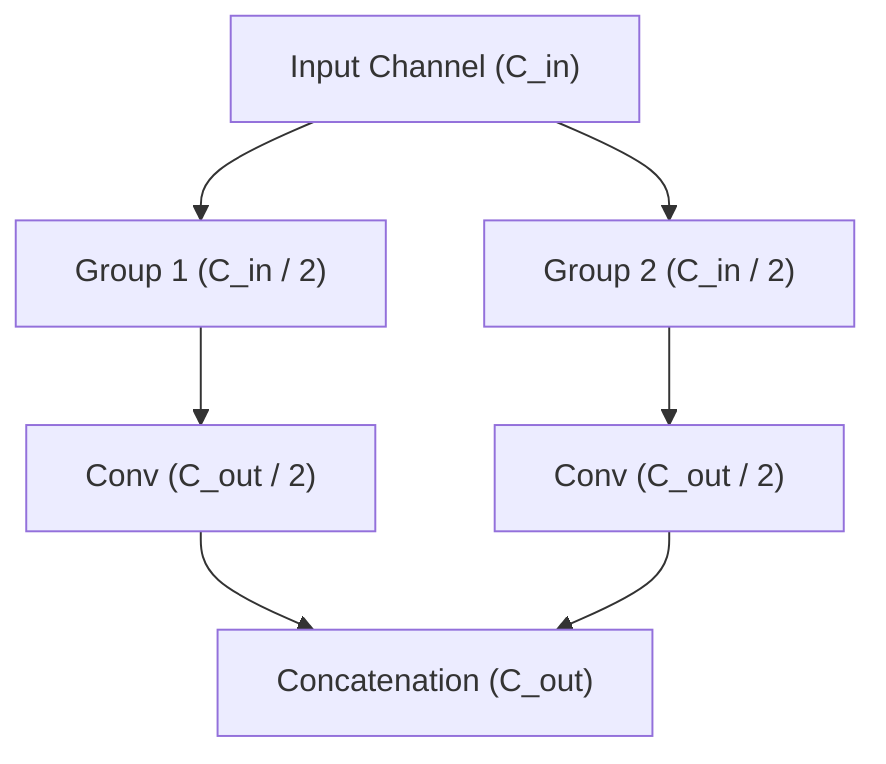

##### 4. Data Augmentation
To further address overfitting, AlexNet introduced two distinct forms of data augmentation:
*   **Translational Cropping and Flips**: Extracting $224 \times 224$ patches (and their horizontal reflections) from $256 \times 256$ source images. This artificial modification expanded the training set size by a factor of $2048$.
*   **Fancy PCA (Color Augmentation)**: Modifying the intensities of the RGB channels in training images using Principal Component Analysis. The team performed PCA on the set of RGB pixel values throughout the training set. To each training image, they added multiples of the found principal components, with magnitudes proportional to the corresponding eigenvalues times a random variable drawn from a Gaussian distribution with mean zero and standard deviation 0.1:
    $$[I_{R}, I_{G}, I_{B}]^T \leftarrow [I_{R}, I_{G}, I_{B}]^T + [p_1, p_2, p_3][\alpha_1 \lambda_1, \alpha_2 \lambda_2, \alpha_3 \lambda_3]^T$$
    where $p_i$ and $\lambda_i$ are the $i$-th eigenvector and eigenvalue of the $3 \times 3$ covariance matrix of RGB pixel values, and $\alpha_i$ is a random variable. This stabilization reduced the top-1 error rate by over 1%.

##### 5. Overlapping Max Pooling
Before AlexNet, pooling operations typically used non-overlapping grids where the pooling window size $P_w$ equaled the stride $S$ (e.g., $P_w=2, S=2$). AlexNet popularized **overlapping pooling** using a window size of $P_w = 3$ and a stride of $S = 2$. This overlap helped make the network slightly more resistant to spatial distortions and translation, reducing top-1 and top-5 error rates by 0.4% and 0.3%, respectively.

##### 6. Local Response Normalization (LRN)
AlexNet used a form of lateral inhibition inspired by neurobiology:
$$b_{x,y}^{i} = \frac{a_{x,y}^{i}}{\left( k + \alpha \sum_{j=\max(0, i-n/2)}^{\min(N-1, i+n/2)} (a_{x,y}^{j})^2 \right)^\beta}$$
where $a_{x,y}^{i}$ is the activity of a neuron computed by applying kernel $i$ at position $(x,y)$, and $b_{x,y}^{i}$ is its normalized response.

> [!warning] LRN is Obsolete
> Local Response Normalization was later found to offer minimal generalization benefits compared to its computational cost. It was rendered obsolete by the introduction of **Batch Normalization** in 2015, which normalizes across the batch dimension, provides smoother gradients, and acts as a much stronger regularizer. Modern architectures do not use LRN.

---

### 1.4 Evolutionary Milestones

The timeline below illustrates the major design transitions in deep learning, moving from serial stacking to parallel branching, residual learning, dense wiring, resource optimization, and modern transformer-hybrid designs:

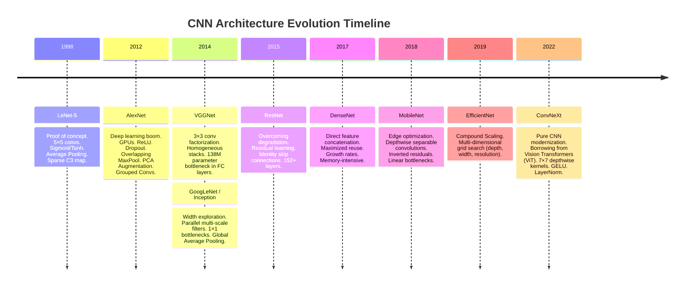

---

### 1.5 Timeline Analysis: The Three Eras of CNNs

#### Era 1: The Push for Depth (2012–2015)
The primary question during this era was: **Can we improve representation capacity by simply stacking more layers?** 
*   AlexNet (8 layers) proved that depth outperformed shallow methods.
*   VGGNet (16–19 layers) standardized on homogeneous $3 \times 3$ filter blocks, demonstrating that systematic, deeper structures yielded superior features.
*   The major bottleneck of this era was **optimization instability** and the **vanishing/exploding gradient problem**, which made plain networks deeper than 20 layers difficult to train.

#### Era 2: Architectural and Computational Efficiency (2015–2019)
As networks scaled up, researchers faced two main challenges: the **optimization limit** (deeper networks failing to train) and **resource constraints** (deploying models to edge and mobile devices).
*   **ResNet** resolved the optimization limit by introducing identity shortcut connections, allowing gradient signals to flow directly through hundreds of layers.
*   **GoogLeNet/Inception** optimized computational efficiency using parallel, multi-scale filter paths and $1 \times 1$ bottleneck convolutions to compress feature channels.
*   **MobileNet** and **ShuffleNet** tailored CNNs for mobile processors by factorizing standard convolutions into highly efficient depthwise separable operations and channel-shuffling groups.
*   **EfficientNet** formalized network scaling by demonstrating that depth, width, and input resolution should be scaled together using a unified, mathematically derived compound ratio.

#### Era 3: The Modern Hybrid Era (2019–Present)
The rise of the **Vision Transformer (ViT)** in 2020 challenged the dominance of traditional CNNs. Transformers utilize self-attention mechanisms to model global dependencies across an image from the very first layer, though they require massive datasets to generalize due to their lack of inductive bias.
*   Modern architectures, such as **ConvNeXt**, redesigned the standard CNN block using design elements from Transformers (e.g., patchified stem setups, larger $7 \times 7$ receptive fields, depthwise convolutions, GeLU activations, and fewer normalization operations).
*   The current landscape has transitioned from pure CNNs or pure Transformers to hybrid designs. These architectures combine the translation invariance and localized feature extraction of convolutions with the global attention and scaling capacity of Transformers.

---

## 2. VGG-16 Deep Dive: Philosophy of Uniformity

### 2.1 Philosophy: "Simple is Beautiful"

#### The Heterogeneity Problem in AlexNet
Before VGG, architectural design was largely empirical and ad-hoc. AlexNet used $11 \times 11$, $5 \times 5$, and $3 \times 3$ filters in its early, middle, and late layers. This variation in kernel sizes made the architecture difficult to systematically scale or modify. There was no theoretical framework to guide the choice of filter size, spatial padding, or channel progression.

#### VGG's Radical Standardization
In 2014, the Visual Geometry Group (VGG) at the University of Oxford proposed a elegant alternative: **standardize on a single, small filter size ($3 \times 3$) and stack them systematically**. This design choice turned out to be incredibly powerful:
*   **Uniform Spatial Preservation**: Because $3 \times 3$ convolutions with a padding of 1 preserve the spatial dimensions of the input ($H_{out} = H_{in}$), spatial downsampling can be handled exclusively by dedicated max-pooling layers.
*   **Predictable Design**: The network's channel depth doubles after every pooling operation (e.g., $64 \rightarrow 128 \rightarrow 256 \rightarrow 512$), creating a balanced trade-off between spatial resolution and representation capacity.
*   **Modular Blocks**: Layers are organized into clean, repeatable blocks (e.g., two convs followed by a pool), simplifying implementation and feature extraction.

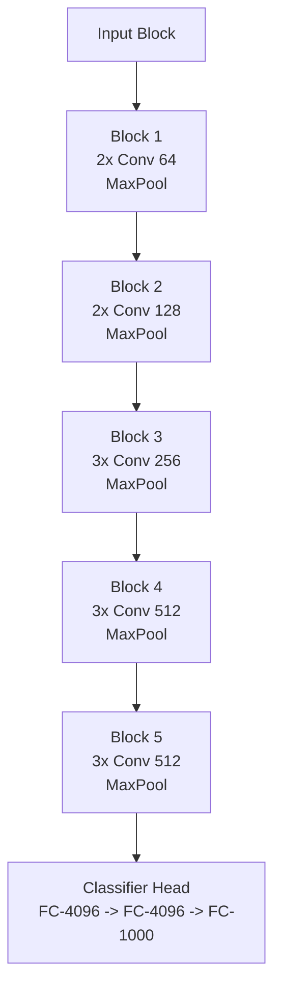

---

### 2.2 The Receptive Field Proof: Mathematical Derivation

#### Receptive Field: Formal Definition
The **receptive field (RF)** of a neuron at layer $l$ is the spatial region in the input layer (layer 0) that can influence its activation. Understanding how receptive fields propagate through layers is key to designing deep networks.

Let $r_l$ denote the receptive field size of a neuron at layer $l$ (measured in pixels of the input image). The receptive field can be computed recursively using the following relation:
$$r_l = r_{l-1} + (k_l - 1) \cdot j_{l-1}$$
where:
*   $k_l$ is the kernel size of layer $l$.
*   $j_{l-1}$ is the cumulative **jump** (or effective stride) of the network up to layer $l-1$.
The jump tracks how much a one-pixel shift in the layer $l-1$ feature map corresponds to in the original input image. The jump propagates as:
$$j_l = j_{l-1} \cdot s_l$$
where $s_l$ is the stride of layer $l$. For the raw input layer, the base cases are $r_0 = 1$ and $j_0 = 1$.

---

#### Proof: Two $3 \times 3$ Convolutions = One $5 \times 5$ Receptive Field
Let us trace the receptive field through a stack of two $3 \times 3$ convolutional layers, each with stride $s = 1$.

**Base Layer (Layer 0 - Input)**:
$$r_0 = 1, \quad j_0 = 1$$

**Layer 1 (First $3 \times 3$ Convolution, $s_1 = 1$)**:
$$r_1 = r_0 + (k_1 - 1) \cdot j_0 = 1 + (3 - 1) \cdot 1 = 3$$
$$j_1 = j_0 \cdot s_1 = 1 \cdot 1 = 1$$

**Layer 2 (Second $3 \times 3$ Convolution, $s_2 = 1$)**:
$$r_2 = r_1 + (k_2 - 1) \cdot j_1 = 3 + (3 - 1) \cdot 1 = 5$$
$$j_2 = j_1 \cdot s_2 = 1 \cdot 1 = 1$$

Thus, a neuron at the output of the second $3 \times 3$ layer has an effective receptive field of $5 \times 5$ in the input image.

```
Input Pixels:       [ ][ ][ ][ ][ ]     (5x5 spatial extent)
                     \  |  /   \  |  /
Layer 1 Neurons:      [   ]     [   ]   (Two 3x3 receptive fields, stride 1)
                        \    |    /
Layer 2 Neuron:           [     ]       (One 3x3 receptive field over Layer 1)
                                        (Effective RF over Input = 5x5)
```

Now, let us compare the parameter counts for these two designs. Assume the layers have $C$ input channels and $C$ output channels:
*   **One $5 \times 5$ Convolutional Layer**:
    $$\text{Params}_{\text{Single}} = (k_h \times k_w \times C_{\text{in}} + 1) \times C_{\text{out}} = (5 \times 5 \times C) \times C = 25C^2 \quad (\text{ignoring bias})$$
*   **Two $3 \times 3$ Convolutional Layers**:
    $$\text{Params}_{\text{Stacked}} = \left[(3 \times 3 \times C) \times C\right] + \left[(3 \times 3 \times C) \times C\right] = 9C^2 + 9C^2 = 18C^2 \quad (\text{ignoring bias})$$

Comparing the two:
$$\frac{\text{Params}_{\text{Stacked}}}{\text{Params}_{\text{Single}}} = \frac{18C^2}{25C^2} = 0.72$$
This shows a **28% reduction in parameters** for the stacked $3 \times 3$ approach while maintaining the exact same receptive field.

---

#### Proof: Three $3 \times 3$ Convolutions = One $7 \times 7$ Receptive Field
Now let us extend this to a stack of three $3 \times 3$ convolutional layers, each with stride $s = 1$.

**Layer 2 Output (from the previous proof)**:
$$r_2 = 5, \quad j_2 = 1$$

**Layer 3 (Third $3 \times 3$ Convolution, $s_3 = 1$)**:
$$r_3 = r_2 + (k_3 - 1) \cdot j_2 = 5 + (3 - 1) \cdot 1 = 7$$
$$j_3 = j_2 \cdot s_3 = 1 \cdot 1 = 1$$

Thus, three stacked $3 \times 3$ convolutions cover a $7 \times 7$ receptive field.

Let us compare the parameters for $C$ input and output channels:
*   **One $7 \times 7$ Convolutional Layer**:
    $$\text{Params}_{\text{Single}} = (7 \times 7 \times C) \times C = 49C^2$$
*   **Three $3 \times 3$ Convolutional Layers**:
    $$\text{Params}_{\text{Stacked}} = 3 \times \left[(3 \times 3 \times C) \times C\right] = 27C^2$$

Comparing the two:
$$\frac{\text{Params}_{\text{Stacked}}}{\text{Params}_{\text{Single}}} = \frac{27C^2}{49C^2} \approx 0.551$$
This yields a **45% parameter reduction**.

#### Summary of Receptive Field Factorization
By factorizing larger convolutions (like $5 \times 5$ or $7 \times 7$) into stacked $3 \times 3$ operations, we get:
1.  **Lower Parameter Counts**: This reduces the risk of overfitting and speeds up training.
2.  **Increased Non-Linearity**: Instead of applying a single ReLU activation, the network applies two or three sequential ReLUs. This allows the network to learn more complex, discriminative features.

---

### 2.3 Layer-by-Layer Architectural Dissection

Below is a detailed walkthrough of VGG-16's layers, showing exactly how tensor dimensions and parameter counts change throughout the network. 

We assume an input size of $224 \times 224 \times 3$ and that all convolutional layers use $3 \times 3$ filters with a stride of 1 and padding of 1.

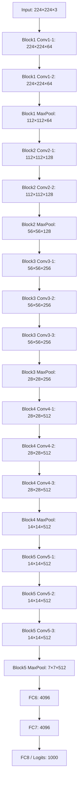

#### Detailed Calculations

##### Block 1
*   **Input**: $224 \times 224 \times 3$
*   **Conv1-1**:
    $$\text{Output Shape}: 224 \times 224 \times 64$$
    $$\text{Params}: (3 \times 3 \times 3 + 1) \times 64 = 1{,}792$$
*   **Conv1-2**:
    $$\text{Output Shape}: 224 \times 224 \times 64$$
    $$\text{Params}: (3 \times 3 \times 64 + 1) \times 64 = 36{,}928$$
*   **MaxPool1** ($2 \times 2$, stride 2):
    $$\text{Output Shape}: 112 \times 112 \times 64$$
    $$\text{Params}: 0$$

##### Block 2
*   **Conv2-1**:
    $$\text{Output Shape}: 112 \times 112 \times 128$$
    $$\text{Params}: (3 \times 3 \times 64 + 1) \times 128 = 73{,}856$$
*   **Conv2-2**:
    $$\text{Output Shape}: 112 \times 112 \times 128$$
    $$\text{Params}: (3 \times 3 \times 128 + 1) \times 128 = 147{,}584$$
*   **MaxPool2** ($2 \times 2$, stride 2):
    $$\text{Output Shape}: 56 \times 56 \times 128$$
    $$\text{Params}: 0$$

##### Block 3
*   **Conv3-1**:
    $$\text{Output Shape}: 56 \times 56 \times 256$$
    $$\text{Params}: (3 \times 3 \times 128 + 1) \times 256 = 295{,}168$$
*   **Conv3-2**:
    $$\text{Output Shape}: 56 \times 56 \times 256$$
    $$\text{Params}: (3 \times 3 \times 256 + 1) \times 256 = 590{,}080$$
*   **Conv3-3**:
    $$\text{Output Shape}: 56 \times 56 \times 256$$
    $$\text{Params}: (3 \times 3 \times 256 + 1) \times 256 = 590{,}080$$
*   **MaxPool3** ($2 \times 2$, stride 2):
    $$\text{Output Shape}: 28 \times 28 \times 256$$
    $$\text{Params}: 0$$

##### Block 4
*   **Conv4-1**:
    $$\text{Output Shape}: 28 \times 28 \times 512$$
    $$\text{Params}: (3 \times 3 \times 256 + 1) \times 512 = 1{,}180{,}160$$
*   **Conv4-2**:
    $$\text{Output Shape}: 28 \times 28 \times 512$$
    $$\text{Params}: (3 \times 3 \times 512 + 1) \times 512 = 2{,}359{,}808$$
*   **Conv4-3**:
    $$\text{Output Shape}: 28 \times 28 \times 512$$
    $$\text{Params}: (3 \times 3 \times 512 + 1) \times 512 = 2{,}359{,}808$$
*   **MaxPool4** ($2 \times 2$, stride 2):
    $$\text{Output Shape}: 14 \times 14 \times 512$$
    $$\text{Params}: 0$$

##### Block 5
*   **Conv5-1**:
    $$\text{Output Shape}: 14 \times 14 \times 512$$
    $$\text{Params}: (3 \times 3 \times 512 + 1) \times 512 = 2{,}359{,}808$$
*   **Conv5-2**:
    $$\text{Output Shape}: 14 \times 14 \times 512$$
    $$\text{Params}: (3 \times 3 \times 512 + 1) \times 512 = 2{,}359{,}808$$
*   **Conv5-3**:
    $$\text{Output Shape}: 14 \times 14 \times 512$$
    $$\text{Params}: (3 \times 3 \times 512 + 1) \times 512 = 2{,}359{,}808$$
*   **MaxPool5** ($2 \times 2$, stride 2):
    $$\text{Output Shape}: 7 \times 7 \times 512$$
    $$\text{Params}: 0$$

##### Classifier Head
*   **Flatten**:
    $$\text{Output Shape}: 25{,}088 \quad (512 \times 7 \times 7)$$
    $$\text{Params}: 0$$
*   **FC6** (Fully Connected + ReLU + Dropout):
    $$\text{Output Shape}: 4096$$
    $$\text{Params}: 25{,}088 \times 4096 + 4096 = 102{,}764{,}544$$
*   **FC7** (Fully Connected + ReLU + Dropout):
    $$\text{Output Shape}: 4096$$
    $$\text{Params}: 4096 \times 4096 + 4096 = 16{,}781{,}312$$
*   **FC8** (Fully Connected classifier - raw logits):
    $$\text{Output Shape}: 1000$$
    $$\text{Params}: 4096 \times 1000 + 1000 = 4{,}097{,}000$$

#### VGG-16 Parameter Summary

*   **Total Convolutions**: $14{,}714{,}688$ parameters ($10.65\%$)
*   **Total Fully Connected**: $123{,}642{,}856$ parameters ($89.35\%$)
*   **Grand Total**: **$138{,}357{,}544$** parameters

---

### 2.4 The Fully Connected Layer Bottleneck and Transition to Global Average Pooling (GAP)

As shown by the calculations above, **89.35% of VGG-16's parameters are concentrated in its fully connected layers**, with the first FC layer (FC6) alone accounting for over 102 million parameters. This concentration of parameters creates several practical challenges:

1.  **Memory Footprint**: The saved model weights for VGG-16 require over 500 MB of storage, with the vast majority allocated to FC layers. This makes the model difficult to deploy on memory-constrained edge devices.
2.  **Overfitting**: The massive parameter count in the classifier head makes VGG-16 highly prone to overfitting, requiring heavy Dropout ($p=0.5$) during training to generalize.
3.  **Fixed-Size Inputs**: Because fully connected layers require a fixed-dimensional input vector, the spatial size of the input image is restricted. For VGG-16, this is $224 \times 224$. If an image of a different size is used, the spatial dimensions of the final feature map ($H \times W$) will not be $7 \times 7$. As a result, flattening it will yield a vector of a different size than 25,088, which is incompatible with FC6. This restriction forces the use of cropping or warping, which can distort or lose visual information.

To address these limitations, modern network designs replace fully connected classifier heads with **Global Average Pooling (GAP)**. 

```
   Flatten + FC Head Method:
   [H x W x C] ---> Flatten ---> [H * W * C] ---> FC-4096 ---> FC-Class (Massive Params)

   Global Average Pooling (GAP) Method:
   [H x W x C] ---> Spatial Average ---> [1 x 1 x C] ---> Linear-Class   (Minimal Params)
```

GAP computes the average value across the entire spatial area ($H \times W$) for each feature channel independently:
$$\text{GAP}(F)_c = \frac{1}{H \cdot W} \sum_{x=1}^{H} \sum_{y=1}^{W} F_{x,y,c}$$
This reduces a feature map of shape $H \times W \times C$ to a $1 \times 1 \times C$ vector. A single linear projection layer can then map this vector directly to the output classes. 

This transition has several key benefits:
*   **Extreme Parameter Savings**: Replacing the $25{,}088 \rightarrow 4096 \rightarrow 4096 \rightarrow 1000$ structure with GAP followed by a single $512 \rightarrow 1000$ linear layer reduces VGG's classifier parameter count from **$123.6$ million to just $513{,}000$**.
*   **Variable Input Sizes**: Because GAP always produces a $1 \times 1 \times C$ vector regardless of the spatial shape ($H \times W$) of the incoming feature map, the network can process images of any size.
*   **Inductive Bias**: GAP enforces a strong structural relationship between feature maps and category classifications. This prevents overfitting, making the classifier head less reliant on heavy Dropout.

---

### 2.5 Batch Normalization: VGG-16 vs. VGG-16-BN

The original VGG-16 did not use Batch Normalization, which made it highly sensitive to weight initialization and required a careful, multi-stage training pipeline (training shallower versions first to initialize deeper ones). Modern variants use **VGG-16-BN**, which inserts a Batch Normalization (BN) layer after each convolution (before the ReLU activation).

#### Mathematical Formulation of Batch Normalization
For a mini-batch $\mathcal{B} = \{x_{1 \dots m}\}$ of activations, BN normalizes the values over the batch:

$$\mu_{\mathcal{B}} = \frac{1}{m} \sum_{i=1}^m x_i, \quad \sigma_{\mathcal{B}}^2 = \frac{1}{m} \sum_{i=1}^m (x_i - \mu_{\mathcal{B}})^2$$
$$\hat{x}_i = \frac{x_i - \mu_{\mathcal{B}}}{\sqrt{\sigma_{\mathcal{B}}^2 + \epsilon}}$$
$$y_i = \gamma \hat{x}_i + \beta$$

where $\gamma$ and $\beta$ are learnable scale and shift parameters, and $\epsilon$ is a small constant for numerical stability.

#### Parameter Implications of BN in VGG-16
For a convolutional layer with $C$ output channels, BN introduces four parameters per channel:
1.  **$\gamma$**: Learnable scale parameter ($C$ parameters)
2.  **$\beta$**: Learnable shift parameter ($C$ parameters)
3.  **$\mu_{\text{running}}$**: Non-learnable running mean buffer ($C$ parameters)
4.  **$\sigma^2_{\text{running}}$**: Non-learnable running variance buffer ($C$ parameters)

Thus, for each BN layer, there are $2C$ learnable parameters and $2C$ non-learnable tracking buffers. Summing this across all 13 convolutional layers of VGG-16:

| Layer | Channels | BN Learnable Params ($\gamma, \beta$) | BN Buffers ($\mu, \sigma^2$) |
| :--- | :--- | :--- | :--- |
| Block 1 Convs | $64, 64$ | $2 \times (64 + 64) = 256$ | $256$ |
| Block 2 Convs | $128, 128$ | $2 \times (128 + 128) = 512$ | $512$ |
| Block 3 Convs | $256, 256, 256$ | $2 \times (256 \times 3) = 1{,}536$ | $1{,}536$ |
| Block 4 Convs | $512, 512, 512$ | $2 \times (512 \times 3) = 3{,}072$ | $3{,}072$ |
| Block 5 Convs | $512, 512, 512$ | $2 \times (512 \times 3) = 3{,}072$ | $3{,}072$ |
| **Totals** | | **$8{,}448$ Parameters** | **$8{,}448$ Buffers** |

This adds a total of **$16{,}896$** variables to the network, which is a negligible fraction of VGG's 138 million parameters. However, the impact on training dynamics is significant:
*   **Faster Convergence**: BN addresses the vanishing gradient problem by keeping activations within a stable distribution, allowing for higher learning rates.
*   **Smoother Loss Landscape**: BN smooths the optimization landscape, making training less sensitive to weight initialization.
*   **Implicit Regularization**: Because the normalization introduces noise from mini-batch statistics, it acts as a weak regularizer, reducing the model's reliance on heavy Dropout.

---

### 2.6 Advanced Applications: Feature Extraction, Style Transfer, and Perceptual Loss

VGG-16's uniform architecture and clean hierarchical representations have made it a popular choice for tasks beyond basic classification.

#### 1. Feature Extraction Hierarchy
As an image passes through VGG-16, its features are extracted in a clear, bottom-up hierarchy:
*   **Early Layers (`Conv1_x`, `Conv2_x`)**: Focus on fine, low-level details like edges, corners, and simple textures.
*   **Middle Layers (`Conv3_x`, `Conv4_x`)**: Assemble these low-level features into intermediate patterns, such as shapes, textures, and object parts.
*   **Late Layers (`Conv5_x`)**: Capture high-level semantic concepts and class-specific representations.

```
   [Low-Level Features]            [Mid-Level Patterns]            [Semantic Concepts]
   Conv1_2 / Conv2_2               Conv3_3 / Conv4_3               Conv5_3
   - Edges                         - Textures                      - Entire Objects
   - Simple Gradients              - Complex Shapes                - Contextual Relationships
```

#### 2. Neural Style Transfer
In their 2015 paper, Gatys et al. showed that VGG-16 could be used to separate and recombine the **content** and **style** of arbitrary images.

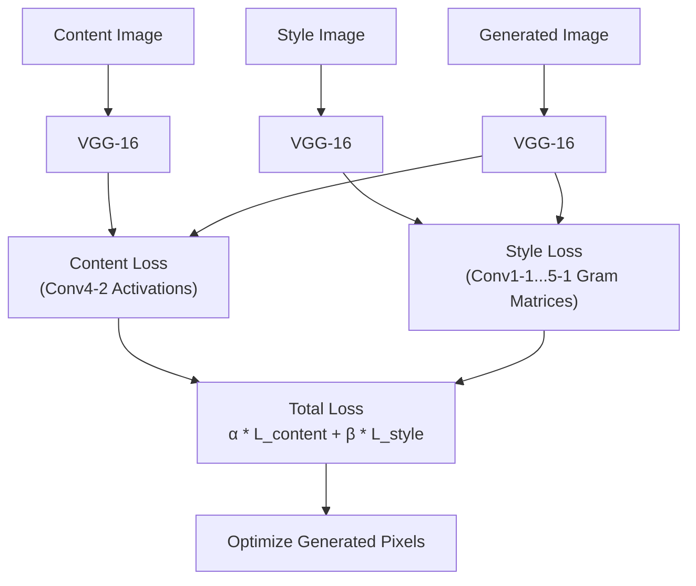

*   **Content Reconstruction**: Content representation is captured by extracting the raw feature activations of a deeper layer (typically `Conv4_2`). The content loss is defined as the mean squared error between the activations of the content image $C$ and the generated image $x$:
    $$\mathcal{L}_{\text{content}}(C, x, l) = \frac{1}{2} \sum_{i,j} (F_{i,j}^l(x) - P_{i,j}^l(C))^2$$
*   **Style Reconstruction**: Style is captured by computing the **Gram Matrix** $G^l \in \mathbb{R}^{C \times C}$ across multiple layers (typically `Conv1_1`, `Conv2_1`, `Conv3_1`, `Conv4_1`, and `Conv5_1`). The Gram matrix represents the correlations between different feature channels:
    $$G_{i,j}^l = \frac{1}{H_l \cdot W_l} \sum_{k=1}^{H_l \cdot W_l} F_{i,k}^l \cdot F_{j,k}^l$$
    By aligning the Gram matrices of the style image and the generated image, the network transfers texture and color patterns without preserving the exact spatial layout of the style source.

#### 3. Perceptual Loss Functions
Traditional image reconstruction tasks (such as super-resolution or image-to-image translation) often rely on pixel-level loss functions like Mean Squared Error (MSE or $L_2$ loss):
$$\mathcal{L}_{\text{pixel}}(x, y) = \frac{1}{H \cdot W \cdot C} \| x - y \|_2^2$$
However, pixel-level losses do not always align well with human visual perception. For example, shifting an image by just one pixel can result in a very high $L_2$ loss, even though the two images look identical to a human observer. Minimizing MSE also tends to produce blurry, averaged outputs that lack fine texture.

To address this, Johnson et al. (2016) introduced **Perceptual Loss**. Instead of comparing raw pixels, the loss measures the distance between feature representations extracted from a pre-trained VGG-16 model:
$$\mathcal{L}_{\text{perceptual}}^{\phi, l}(x, y) = \frac{1}{C_l H_l W_l} \| \phi_l(x) - \phi_l(y) \|_2^2$$
where $\phi_l(x)$ represents the activation map of the $l$-th layer of VGG-16 ($\phi$) for input $x$. By optimizing for feature similarity, generator networks can produce sharper, more realistic details that are visually satisfying.

---

## 3. Inception Architecture Deep Dive: Multi-Scale Processing

### 3.1 Philosophy of Multi-Scale Parallelism

Standard CNN architectures like VGG stack layers sequentially, forcing each layer to use a single, fixed filter size. However, in complex real-world scenes, visual information exists at multiple scales simultaneously. 

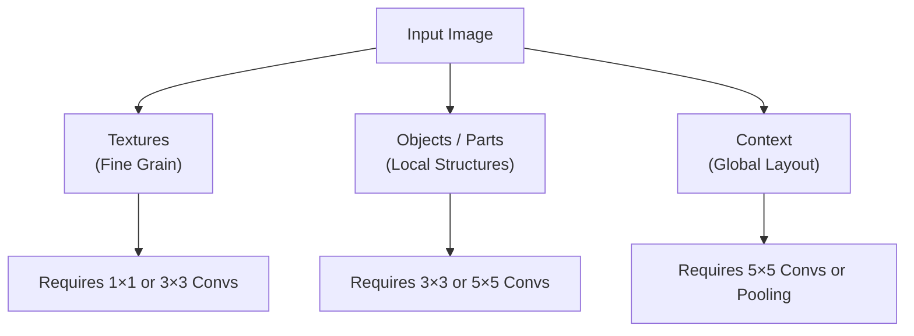

Choosing a single filter size forces a compromise:
*   **Small Kernels ($1 \times 1$, $3 \times 3$)**: Excellent for capturing fine, localized details and textures, but they lack the receptive field to capture broader spatial relationships.
*   **Large Kernels ($5 \times 5$, $7 \times 7$)**: Good for capturing context and larger structures, but they are computationally expensive and can dilute fine-grained details.

The **Inception architecture** (introduced by Szegedy et al. in 2014) addresses this by using **parallel, multi-scale filter processing within the same module**. Instead of choosing one filter size, the network applies $1 \times 1$, $3 \times 3$, and $5 \times 5$ convolutions, along with a $3 \times 3$ max-pooling operation, in parallel. The resulting feature maps are then concatenated along the channel dimension.

---

### 3.2 The Naive Inception Module

The simplest form of parallel processing is the **Naive Inception Module**.

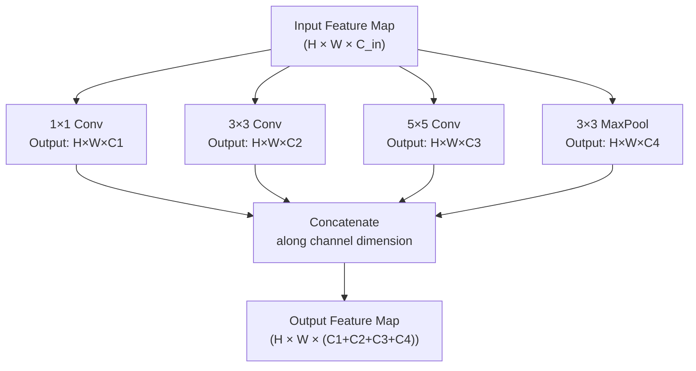

Every parallel branch uses appropriate padding to preserve the spatial dimensions of the input. This ensures that all output feature maps have the same height ($H$) and width ($W$), allowing them to be concatenated along the channel dimension.

---

### 3.3 The Computational Cost Problem

While the naive Inception module is conceptually elegant, it is computationally expensive. As the network grows deeper and channel counts increase, the cost of the larger convolutional branches ($5 \times 5$) quickly becomes prohibitive.

#### Worked Mathematical Example: FLOPs in the $5 \times 5$ Branch
Consider an input feature map of shape $28 \times 28 \times 256$ passing through a naive $5 \times 5$ convolutional branch with $64$ filters (stride 1, padding 2):

```
Input: [28 x 28 x 256] ---> Conv 5x5 (64 filters) ---> Output: [28 x 28 x 64]
```

Let us calculate the parameters and Floating Point Operations (FLOPs) required:
*   **Parameters**:
    $$\text{Params} = (\text{Kernel}_h \times \text{Kernel}_w \times C_{\text{in}}) \times C_{\text{out}} = (5 \times 5 \times 256) \times 64 = 409{,}600 \quad (\text{ignoring bias})$$
*   **FLOPs**:
    At each spatial position in the output, the $5 \times 5 \times 256$ filter performs a dot product. The number of multiply-accumulate operations is $5 \times 5 \times 256 = 6{,}400$.
    Since we have $64$ filters, and the output spatial dimension is $28 \times 28$ ($784$ positions):
    $$\text{FLOPs} = H_{\text{out}} \times W_{\text{out}} \times C_{\text{out}} \times (\text{Kernel}_h \times \text{Kernel}_w \times C_{\text{in}})$$
    $$\text{FLOPs} = 28 \times 28 \times 64 \times (5 \times 5 \times 256) = 784 \times 64 \times 6{,}400 = 321{,}126{,}400 \text{ FLOPs} \approx \mathbf{321.1 \text{ MFLOPs}}$$

This single branch, operating on a relatively small $28 \times 28$ feature map, requires **321 million floating-point operations**. Applying this across multiple layers and including the other branches makes the naive design computationally impractical.

---

### 3.4 The $1 \times 1$ Bottleneck Solution

To address this computational bottleneck, the Inception architecture uses **$1 \times 1$ convolutions as dimensionality reduction layers**. 

```
   Naive Path:
   [H x W x C_in] -----------------------------------> Conv 5x5 ---------------------> [H x W x C_out]
   (Very high FLOPs)

   Bottleneck Path:
   [H x W x C_in] ---> Conv 1x1 (Compress) ---> [H x W x C_mid] ---> Conv 5x5 ------> [H x W x C_out]
   (Dramatically lower FLOPs)
```

A $1 \times 1$ convolution acts as a pixel-wise linear projection across channels. By setting the number of filters in the $1 \times 1$ convolution ($C_{\text{mid}}$) to be much smaller than the input channels ($C_{\text{in}}$), the network compresses the channel depth while preserving spatial dimensions. The more expensive $3 \times 3$ or $5 \times 5$ convolutions then operate on this compressed representation.

---

#### The Modern Inception Module with Bottlenecks
By inserting $1 \times 1$ bottlenecks before the $3 \times 3$ and $5 \times 5$ convolutions, and after the max-pooling layer, we get the standard Inception module:

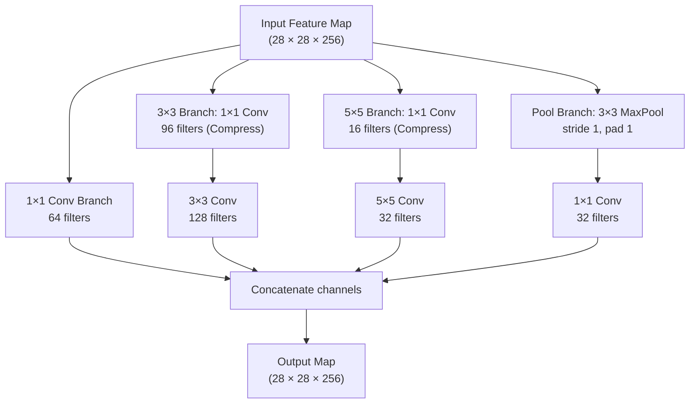

---

#### Mathematical Comparison of Cost: Naive vs. Bottleneck

Let us calculate the parameter savings of the bottleneck design. We will compare a naive $5 \times 5$ branch with a bottlenecked $5 \times 5$ branch, using the same input ($256$ channels) and output ($64$ channels).

##### 1. Naive $5 \times 5$ Branch
$$\text{Params}_{\text{Naive}} = 5 \times 5 \times 256 \times 64 = \mathbf{409{,}600 \text{ parameters}}$$
$$\text{FLOPs}_{\text{Naive}} = 28 \times 28 \times (5 \times 5 \times 256 \times 64) = \mathbf{321{,}126{,}400 \text{ FLOPs}}$$

##### 2. Bottlenecked $5 \times 5$ Branch
Suppose we use a $1 \times 1$ convolution with $16$ filters as the bottleneck, followed by the $5 \times 5$ convolution:
*   **Step 1 ($1 \times 1$ Compression, $256 \rightarrow 16$)**:
    $$\text{Params}_{1\times1} = 1 \times 1 \times 256 \times 16 = 4{,}096 \text{ parameters}$$
    $$\text{FLOPs}_{1\times1} = 28 \times 28 \times (1 \times 1 \times 256 \times 16) = 3{,}211{,}264 \text{ FLOPs}$$
*   **Step 2 ($5 \times 5$ Convolution on compressed input, $16 \rightarrow 64$)**:
    $$\text{Params}_{5\times5} = 5 \times 5 \times 16 \times 64 = 25{,}600 \text{ parameters}$$
    $$\text{FLOPs}_{5\times5} = 28 \times 28 \times (5 \times 5 \times 16 \times 64) = 20{,}070{,}400 \text{ FLOPs}$$
*   **Total Bottleneck Cost**:
    $$\text{Params}_{\text{Total}} = 4{,}096 + 25{,}600 = \mathbf{29{,}696 \text{ parameters}}$$
    $$\text{FLOPs}_{\text{Total}} = 3{,}211{,}264 + 20{,}070{,}400 = \mathbf{23{,}281{,}664 \text{ FLOPs}}$$

##### Summary of Savings

| Metric | Naive Path | Bottlenecked Path | Reduction Ratio | Total Savings |
| :--- | :--- | :--- | :--- | :--- |
| **Parameters** | $409{,}600$ | $29{,}696$ | $\approx 13.8\times$ | **$92.75\%$ Saved** |
| **FLOPs** | $321.13 \text{ M}$ | $23.28 \text{ M}$ | $\approx 13.8\times$ | **$92.75\%$ Saved** |

This comparison highlights the power of $1 \times 1$ bottlenecks. By compressing feature channels, we can build deeper, wider models at a fraction of the computational cost.

---

### 3.5 Auxiliary Classifiers

As networks grow deeper, propagating gradient signals from the final loss back to early layers becomes more difficult. To stabilize gradient flow in GoogLeNet (which is 22 layers deep), the authors introduced **Auxiliary Classifiers** at intermediate layers.

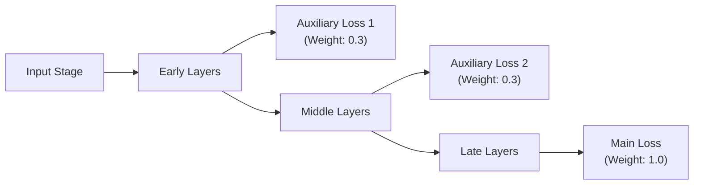

During training, the total loss is computed as a weighted sum of the main classifier and the auxiliary heads:
$$\mathcal{L}_{\text{total}} = \mathcal{L}_{\text{main}} + 0.3 \cdot \mathcal{L}_{\text{aux1}} + 0.3 \cdot \mathcal{L}_{\text{aux2}}$$

These intermediate heads inject gradients directly into the middle of the network, helping stabilize training. 

> [!note] Inference Behavior
> Auxiliary classifiers are only used during training. During inference (test time), these auxiliary branches are completely discarded, meaning they add no computational overhead to deployment.

---

### 3.6 GoogLeNet Global Architecture

GoogLeNet integrates these design elements into a 22-layer network. Its structure can be broken down into three main sections:

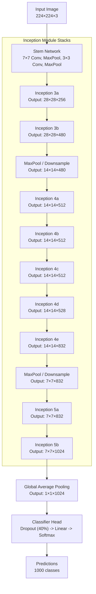

1.  **The Stem**: A standard convolutional setup (e.g., $7 \times 7$ conv, max pooling, $3 \times 3$ conv, max pooling) designed to reduce the spatial resolution of the input before passing it to the Inception modules.
2.  **Inception Stacks**: Nine Inception modules grouped into three main stages (3a-3b, 4a-4e, 5a-5b), separated by downsampling max-pooling layers.
3.  **The Classifier**: Uses Global Average Pooling (GAP) to reduce the $7 \times 7 \times 1024$ feature map to a $1 \times 1 \times 1024$ vector, followed by a Dropout layer ($40\%$) and a single Linear layer. This design keeps the classifier's parameter count extremely low.

---

### 3.7 Inception-V2 and Inception-V3 Advancements

Building on the success of the original Inception-V1 (GoogLeNet), Szegedy et al. (2016) proposed several refinements to improve accuracy and reduce computational complexity.

#### 1. Spatial Factorization of Convolutions
To reduce parameter counts and increase depth, Inception-V2 and V3 factorize larger convolutional filters into smaller, sequential ones:
*   **$5 \times 5 \rightarrow$ Two $3 \times 3$s**: As proven in Section 2.2, a $5 \times 5$ convolution can be replaced by two sequential $3 \times 3$ convolutions. This reduces parameters by $28\%$ while maintaining the same receptive field and adding an extra ReLU activation.
*   **Asymmetric Factorization ($N \times N \rightarrow 1 \times N$ followed by $N \times 1$)**: A $3 \times 3$ convolution can be factorized into a $1 \times 3$ convolution followed by a $3 \times 1$ convolution.

```
   Standard 3x3 Conv:
   [Input] ---> Conv 3x3 ---> [Output] (9C^2 operations)

   Factorized Asymmetric Conv:
   [Input] ---> Conv 1x3 ---> Intermediate ---> Conv 3x1 ---> [Output] (6C^2 operations)
```

Comparing the parameters of standard and asymmetric factorizations for $C$ channels:
$$\text{Ratio} = \frac{1 \times 3 \times C^2 + 3 \times 1 \times C^2}{3 \times 3 \times C^2} = \frac{6C^2}{9C^2} \approx 0.67$$
This factorization yields a **33% parameter and computation savings** for the same receptive field. Inception-V3 leverages these asymmetric stacks in its middle layers.

---

#### 2. Structural Redesign in Inception-V3 Blocks

Inception-V3 organizes its modules into three distinct types, tailored for different depths in the network:

##### Type A: High-Resolution Blocks (Early Stage)
Used in early stages of the network when spatial resolution is high (e.g., $35 \times 35$). These blocks replace $5 \times 5$ convolutions with two stacked $3 \times 3$ convolutions.

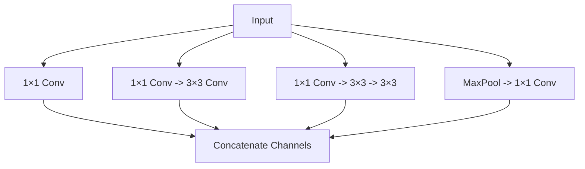

##### Type B: Asymmetric Blocks (Middle Stage)
Used at medium resolutions (e.g., $17 \times 17$). These blocks factorize $7 \times 7$ operations into sequential $1 \times 7$ and $7 \times 1$ convolutions to save computation.

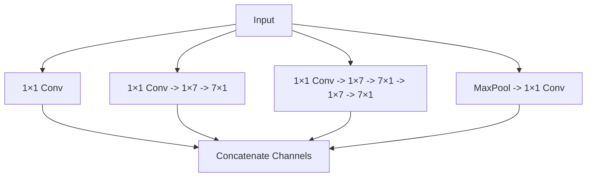

##### Type C: Expanded Branch Blocks (Late Stage)
Used in the late, low-resolution stages (e.g., $8 \times 8$). These blocks use parallel, asymmetric filters to capture diverse, high-dimensional features.

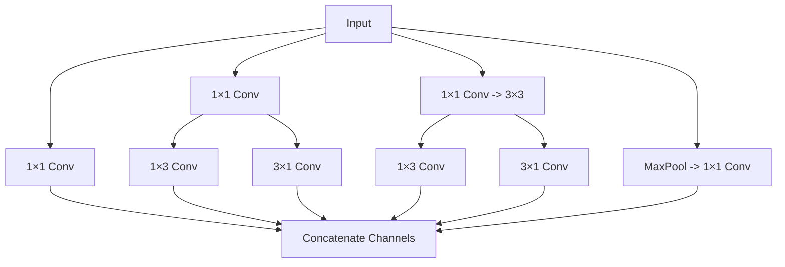

---

#### 3. Label Smoothing Regularization
Inception-V3 introduced **Label Smoothing Regularization (LSR)** to prevent the network from becoming overconfident during training.

For a target class $y$, standard training uses hard, one-hot targets:
$$q(k) = \delta_{k, y} = \begin{cases} 1 & \text{if } k = y \\ 0 & \text{if } k \neq y \end{cases}$$
This forces the final logits to grow infinitely to produce a probability of exactly 1, which can lead to overfitting and reduced generalization.

Label smoothing modifies the target distribution by mixing the hard labels with a uniform distribution over all classes $K$:
$$q'(k) = (1 - \epsilon) \delta_{k, y} + \frac{\epsilon}{K}$$
where $\epsilon$ is a small hyperparameter (typically $0.1$). For $K = 1000$ and $\epsilon = 0.1$:
*   The target probability for the correct class becomes $0.9001$.
*   The target probability for all incorrect classes becomes $0.0001$.
This soft target prevents the network from outputting extremely large logits, encouraging better feature clustering and generalization.

---

## 4. ResNet and Modern Architectural Successors

### 4.1 ResNet (2015): Solving the Degradation Problem

#### The Degradation Problem Explained
As researchers continued to stack layers to improve representation capacity, they encountered a counter-intuitive phenomenon: **deeper networks began to show higher training error than shallower ones**. 

```
   Training Error Plot:
   Error
     |
     |     /--- 56-layer Plain Net (Higher Error)
     |    /
     |   /---- 20-layer Plain Net (Lower Error)
     |  /
     +----------------------- Epochs
```

This phenomenon, known as the **deegradation problem**, is distinct from overfitting (where training error is low but test error is high). Here, both training and test errors degrade, indicating that deeper plain networks are simply difficult for optimization algorithms to train.

In theory, a deeper network should always be able to match the performance of a shallower counterpart. By setting the additional layers to perform an **identity mapping** ($f(x) = x$), the deeper network can replicate the shallower model's predictions. The fact that deeper plain networks perform worse indicates that optimization algorithms struggle to find these identity mappings in high-dimensional parameter spaces.

---

#### The Residual Block and Skip Connections
To address the degradation problem, He et al. (2015) introduced **skip connections** (or residual connections). 

Instead of forcing a stack of layers to learn the target mapping $\mathcal{H}(x)$ directly, they reparameterized the block to learn a **residual mapping** $\mathcal{F}(x) = \mathcal{H}(x) - x$. The original input is then added back via a shortcut connection:

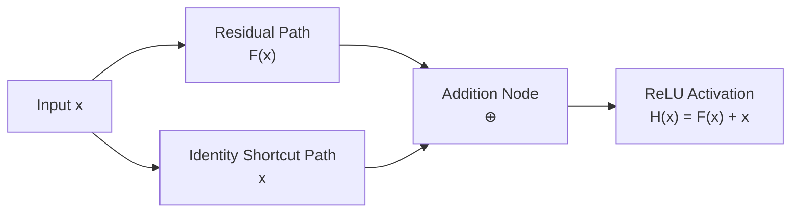

Mathematically, a residual block is defined as:
$$\mathcal{H}(x) = \mathcal{F}(x, \{W_i\}) + x$$
where:
*   $x$ and $\mathcal{H}(x)$ are the input and output vectors.
*   $\mathcal{F}(x, \{W_i\})$ represents the residual mapping learned by the convolutional layers within the block.

This formulation changes the optimization target:
*   **Plain Block**: The layers must learn the identity mapping $\mathcal{H}(x) = x$ from scratch, which is difficult with non-linear activations.
*   **Residual Block**: If an identity mapping is optimal, the network can simply drive the weights in the residual path $\mathcal{F}(x)$ toward zero, which is a much easier optimization target.

#### Why Skip Connections Stabilize Training
1.  **Direct Gradient Highways**: During backpropagation, the derivative of the block's output with respect to its input is:
    $$\frac{\partial \mathcal{H}(x)}{\partial x} = \frac{\partial \mathcal{F}(x)}{\partial x} + 1$$
    Even if the gradients through the residual path $\frac{\partial \mathcal{F}(x)}{\partial x}$ begin to decay or vanish, the constant $+1$ term ensures that the gradient signal can flow back to early layers without decay.
2.  **Implicit Ensembles**: Veit et al. (2016) showed that ResNets behave like an ensemble of shorter networks. Because the skip connections create multiple parallel paths of varying lengths, the network is highly robust to the removal or perturbation of individual layers.

---

### 4.2 DenseNet (2017): Dense Connections and Feature Reuse

DenseNet (Huang et al., 2017) takes the idea of shortcut connections a step further. Instead of combining features via addition, DenseNet **concatenates every layer's output to all subsequent layers** within a dense block.

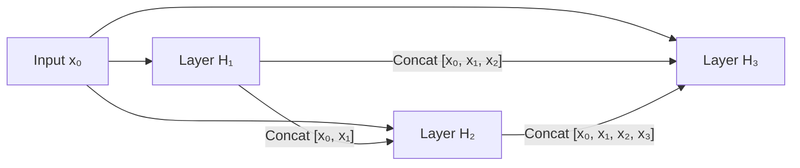

#### Mathematical Formulation
For a dense block, the output of the $l$-th layer takes the feature maps of all preceding layers as input:
$$x_l = H_l([x_0, x_1, \dots, x_{l-1}])$$
where $[x_0, x_1, \dots, x_{l-1}]$ represents the concatenation of all preceding feature maps along the channel dimension.

The rate at which the channel depth increases with each layer is called the **Growth Rate ($k$)**. If a dense block has an input with $C_0$ channels and a growth rate of $k$, the $l$-th layer will have $C_0 + k \times (l-1)$ input channels.

#### Transition Layers
To manage spatial downsampling and prevent the channel dimension from growing too large, DenseNets are split into multiple dense blocks separated by **Transition Layers**.

```
[ Dense Block 1 ] ---> [ Transition Layer (1x1 Conv + AvgPool) ] ---> [ Dense Block 2 ]
```

A transition layer consists of:
1.  **Batch Normalization + ReLU**
2.  **$1 \times 1$ Convolution**: Reduces the channel dimension by a compression factor $\theta \in (0, 1]$ (typically $\theta = 0.5$).
3.  **$2 \times 2$ Average Pooling**: Halves the spatial resolution.

#### Trade-offs of DenseNet
*   **Pros**: Excellent feature reuse, high parameter efficiency, and stable gradient flow.
*   **Cons**: **High GPU memory consumption**. Concatenating feature maps requires storing all intermediate activations in memory, which can lead to out-of-memory issues during training.

---

### 4.3 MobileNet (2018): Depthwise Separable Convolutions

MobileNet (Howard et al., 2017) is designed for high efficiency on resource-constrained mobile and edge devices. It replaces standard convolutions with **Depthwise Separable Convolutions**, which factorize standard operations into two separate, highly efficient steps:

```
Standard Convolution:
Filters process spatial and channel dimensions simultaneously.

Depthwise Separable Convolution:
Step 1: Depthwise Conv (Filters process spatial dimensions independently for each channel).
Step 2: Pointwise Conv  (1x1 filters mix channel representations).
```

#### 1. Depthwise Convolution
Instead of using filters that span all input channels, the network applies a separate, single-channel filter to each input channel independently. For $C_{\text{in}}$ channels, this requires $C_{\text{in}}$ independent $K \times K \times 1$ filters.

#### 2. Pointwise Convolution
To mix the independent channel representations produced by the depthwise step, a standard $1 \times 1$ convolution is applied across all channels.

---

#### Cost Comparison: Standard vs. Depthwise Separable
Consider an input of shape $H \times W \times C_{\text{in}}$, a kernel size of $D_K$, and an output of $C_{\text{out}}$ channels:

##### Standard Convolution Cost
$$\text{Cost}_{\text{Standard}} = H \times W \times C_{\text{in}} \times C_{\text{out}} \times D_K \times D_K$$

##### Depthwise Separable Convolution Cost
*   **Depthwise Step**: $H \times W \times C_{\text{in}} \times D_K \times D_K$
*   **Pointwise Step**: $H \times W \times C_{\text{in}} \times C_{\text{out}} \times 1 \times 1$
$$\text{Cost}_{\text{Separable}} = (H \times W \times C_{\text{in}} \times D_K^2) + (H \times W \times C_{\text{in}} \times C_{\text{out}})$$

##### Computational Reduction Ratio
$$\text{Ratio} = \frac{\text{Cost}_{\text{Separable}}}{\text{Cost}_{\text{Standard}}} = \frac{H \cdot W \cdot C_{\text{in}} \cdot D_K^2 + H \cdot W \cdot C_{\text{in}} \cdot C_{\text{out}}}{H \cdot W \cdot C_{\text{in}} \cdot C_{\text{out}} \cdot D_K^2} = \frac{D_K^2 + C_{\text{out}}}{C_{\text{out}} \cdot D_K^2} = \frac{1}{C_{\text{out}}} + \frac{1}{D_K^2}$$

For a standard $3 \times 3$ convolution ($D_K = 3$) with a typical channel depth ($C_{\text{out}} \gg 9$):
$$\text{Ratio} \approx \frac{1}{3^2} = \mathbf{\frac{1}{9}}$$
This factorization yields an **89% reduction in computational cost and parameters** with only a minor loss in accuracy.

---

### 4.4 EfficientNet (2019): Compound Scaling

Traditionally, networks were scaled up along a single dimension to improve accuracy:
*   **Depth ($d$)**: Making the network deeper (e.g., ResNet-50 to ResNet-152) to capture more complex features. However, very deep networks show diminishing returns.
*   **Width ($w$)**: Increasing the number of channels per layer to capture fine-grained features. However, extremely wide, shallow networks struggle to learn complex representations.
*   **Resolution ($r$)**: Processing higher-resolution input images to capture finer detail. However, this increases computational cost quadratically.

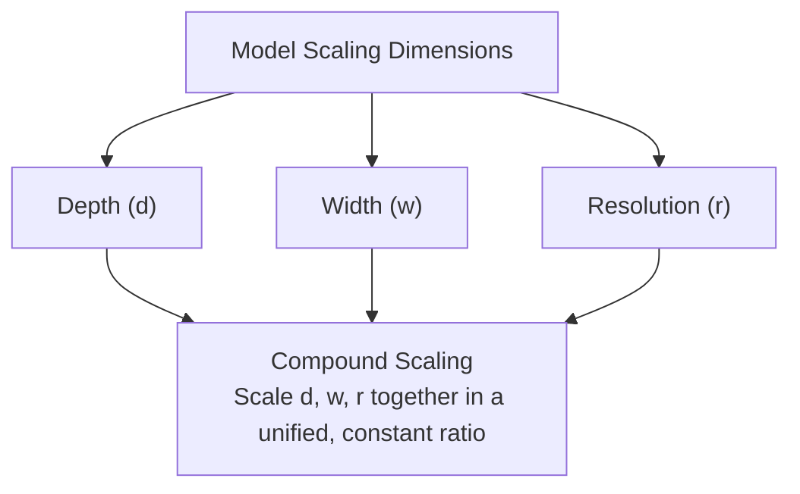

Tan and Le (2019) demonstrated that **scaling these three dimensions together in a constant, unified ratio yields superior accuracy and efficiency**.

#### The Compound Scaling Principle
EfficientNet scales depth, width, and resolution together using a user-defined compound coefficient $\phi$:
$$\text{Depth}: d = \alpha^\phi$$
$$\text{Width}: w = \beta^\phi$$
$$\text{Resolution}: r = \gamma^\phi$$
$$\text{subject to: } \alpha \cdot \beta^2 \cdot \gamma^2 \approx 2 \quad \text{and} \quad \alpha \geq 1, \beta \geq 1, \gamma \geq 1$$

where $\alpha$, $\beta$, and $\gamma$ represent the constant scaling coefficients for depth, width, and resolution, respectively. 

Because scaling a network's depth by 2 doubles its FLOPs, while scaling width or resolution by 2 quadruples its FLOPs, the constraint $\alpha \cdot \beta^2 \cdot \gamma^2 \approx 2$ ensures that scaling the compound coefficient $\phi$ by 1 roughly doubles the total FLOPs.

The baseline model, **EfficientNet-B0**, was found using Multi-Objective Neural Architecture Search. The optimal scaling coefficients were then determined via grid search:
$$\alpha = 1.2, \quad \beta = 1.1, \quad \gamma = 1.15$$
This compound scaling strategy allowed the EfficientNet family to achieve state-of-the-art accuracy on ImageNet while using significantly fewer parameters and FLOPs than previous models.

---

### 4.5 ConvNeXt (2022): Vision-Transformer-Inspired Modernization of CNNs

In 2020, the Vision Transformer (ViT) challenged the dominance of convolutional networks in computer vision. In response, Liu et al. (2022) introduced **ConvNeXt**, a modernized, pure convolutional network that incorporates key design elements from Transformers.

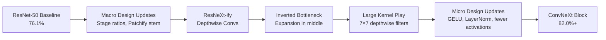

#### Step-by-Step Modernization of a ResNet-50 Block

##### 1. Macro Design
*   **Stage Ratio**: ResNet-50 uses a stage channel-stack ratio of $(3, 4, 6, 3)$. ConvNeXt adjusts this to $(3, 3, 9, 3)$, matching the structural distribution of the Swin Transformer.
*   **"Patchify" Input Stem**: Instead of ResNet's aggressive $7 \times 7$ convolution (stride 2) followed by max pooling, ConvNeXt uses a Swin-style patchified stem: a $4 \times 4$ convolution with a stride of 4 to downsample the image directly.

##### 2. ResNeXt-ify
*   ConvNeXt adopts **grouped convolutions** with a group size equal to the channel count. This is equivalent to **depthwise convolution**, which separates spatial and channel processing.

##### 3. Inverted Bottleneck
*   Standard ResNet bottleneck blocks compress channels before applying spatial convolutions: $256 \rightarrow 64 \rightarrow 256$. 
*   ConvNeXt inverts this structure (similar to MobileNetV2), expanding channels before the spatial convolution: $96 \rightarrow 384 \rightarrow 96$. This design preserves high-frequency details.

```
   ResNet Bottleneck Block:
   [256 Channels] ---> Conv 1x1 (Compress) ---> [64 Channels] ---> Conv 3x3 ---> [64] ---> Conv 1x1 (Expand) ---> [256]

   ConvNeXt Inverted Bottleneck Block:
   [96 Channels] ---> Depthwise Conv 7x7 ---> [96] ---> Conv 1x1 (Expand) ---> [384 Channels] ---> Conv 1x1 (Compress) ---> [96]
```

##### 4. Large Kernel Play
*   Instead of using small $3 \times 3$ filters, ConvNeXt increases the depthwise kernel size to $7 \times 7$. This larger kernel matches the receptive field and global processing of Transformer self-attention blocks.

##### 5. Micro Design Updates
*   **GELU Activation**: Replaces standard ReLU with the Gaussian Error Linear Unit (GELU) used in Transformers.
*   **Fewer Activations**: While standard CNNs apply activations after every convolution, ConvNeXt only applies a single GELU activation within its bottleneck block, similar to the MLP layer in Transformers.
*   **LayerNorm instead of BatchNorm**: Replaces Batch Normalization with Layer Normalization (LN), stabilizing training across varying batch sizes.
*   **Fewer Normalizations**: ConvNeXt reduces the number of normalization layers, applying a single LN layer before the channel expansion.

This modernized, pure convolutional architecture matched the accuracy, scaling, and efficiency of state-of-the-art Vision Transformers, proving that well-designed CNNs remain competitive.

---

## 5. Advanced PyTorch Implementation of VGG-16

Below is a complete, production-ready implementation of the VGG family from scratch in PyTorch. It features a modular configuration-list builder, weight initialization, and efficient feature extraction using forward hooks.

```python
import torch
import torch.nn as nn
from typing import Dict, List, Union, Any

# VGG configurations directly mirroring Table 1 in the original paper (Simonyan & Zisserman, 2014)
# Integers represent convolutional layer output channels (all are 3x3, stride 1, padding 1)
# 'M' represents MaxPool2d (kernel_size=2, stride=2)
VGG_CONFIGS: Dict[str, List[Union[int, str]]] = {
    'VGG11': [64, 'M', 128, 'M', 256, 256, 'M', 512, 512, 'M', 512, 512, 'M'],
    'VGG13': [64, 64, 'M', 128, 128, 'M', 256, 256, 'M', 512, 512, 'M', 512, 512, 'M'],
    'VGG16': [64, 64, 'M', 128, 128, 'M', 256, 256, 256, 'M', 512, 512, 512, 'M', 512, 512, 512, 'M'],
    'VGG19': [64, 64, 'M', 128, 128, 'M', 256, 256, 256, 256, 'M', 512, 512, 512, 512, 'M', 512, 512, 512, 512, 'M'],
}


def make_layers(config: List[Union[int, str]], batch_norm: bool = False) -> nn.Sequential:
    """
    Constructs the convolutional feature extractor of VGG from a configuration list.
    
    Args:
        config: List of convolutional channels and pooling markers
        batch_norm: If True, inserts BatchNorm2d between each Conv2d and ReLU
        
    Returns:
        nn.Sequential module containing the structured layers
    """
    layers: List[nn.Module] = []
    in_channels: int = 3  # RGB image input
    
    for v in config:
        if v == 'M':
            layers.append(nn.MaxPool2d(kernel_size=2, stride=2))
        else:
            conv2d = nn.Conv2d(in_channels, v, kernel_size=3, padding=1, stride=1)
            if batch_norm:
                layers.extend([conv2d, nn.BatchNorm2d(v), nn.ReLU(inplace=True)])
            else:
                layers.extend([conv2d, nn.ReLU(inplace=True)])
            in_channels = v
            
    return nn.Sequential(*layers)


class VGG(nn.Module):
    """
    A highly robust, parameterized VGG model supporting customizable variants,
    optional Batch Normalization, and adaptive pooling classifier heads.
    """
    def __init__(self, variant: str = 'VGG16', num_classes: int = 1000, 
                 batch_norm: bool = False, init_weights: bool = True) -> None:
        super().__init__()
        if variant not in VGG_CONFIGS:
            raise ValueError(f"Invalid VGG variant: {variant}. Supported: {list(VGG_CONFIGS.keys())}")
            
        self.variant = variant
        self.num_classes = num_classes
        
        # 1. Feature Extractor
        self.features = make_layers(VGG_CONFIGS[variant], batch_norm=batch_norm)
        
        # 2. Adaptive Average Pooling (enables variable-sized input images)
        self.avgpool = nn.AdaptiveAvgPool2d((7, 7))
        
        # 3. Classifier Head (Traditional sequential structure)
        self.classifier = nn.Sequential(
            nn.Linear(512 * 7 * 7, 4096),
            nn.ReLU(inplace=True),
            nn.Dropout(p=0.5),
            nn.Linear(4096, 4096),
            nn.ReLU(inplace=True),
            nn.Dropout(p=0.5),
            nn.Linear(4096, num_classes)
        )
        
        if init_weights:
            self._initialize_weights()

    def forward(self, x: torch.Tensor) -> torch.Tensor:
        """
        Forward execution path.
        Input tensor shape: (B, 3, H, W)
        """
        x = self.features(x)
        x = self.avgpool(x)
        x = torch.flatten(x, start_dim=1)  # Keeps batch dimension intact
        x = self.classifier(x)
        return x

    def _initialize_weights(self) -> None:
        """
        Performs He (Kaiming) initialization for ReLU networks on all weight parameters.
        """
        for m in self.modules():
            if isinstance(m, nn.Conv2d):
                # Using fan_out to preserve gradient variance in the backward pass
                nn.init.kaiming_normal_(m.weight, mode='fan_out', nonlinearity='relu')
                if m.bias is not None:
                    nn.init.constant_(m.bias, 0.0)
            elif isinstance(m, nn.BatchNorm2d):
                nn.init.constant_(m.weight, 1.0)
                nn.init.constant_(m.bias, 0.0)
            elif isinstance(m, nn.Linear):
                nn.init.normal_(m.weight, 0, 0.01)
                nn.init.constant_(m.bias, 0.0)
```

---

### 5.1 Multi-Level Feature Extraction using Forward Hooks

In applications like Neural Style Transfer and Perceptual Loss, we need to extract intermediate activations from specific layers in a pre-trained network. 

Re-running the forward pass up to different depths is computationally redundant. Instead, we can use **PyTorch Forward Hooks** to capture intermediate activations in a single forward pass.

```python
class FeatureExtractorHooked(nn.Module):
    """
    Wraps a base model and uses forward hooks to extract intermediate
    feature activations in a single forward pass.
    """
    def __init__(self, base_features: nn.Sequential, target_indices: Dict[str, int]) -> None:
        super().__init__()
        self.features = base_features
        self.target_indices = target_indices
        self._extracted_features: Dict[str, torch.Tensor] = {}
        self._hooks: List[Any] = []
        
        self._register_hooks()

    def _register_hooks(self) -> None:
        # Define the hook function
        def get_activation_hook(name: str):
            def hook(module: nn.Module, input_tensor: tuple, output_tensor: torch.Tensor):
                self._extracted_features[name] = output_tensor
            return hook

        # Register the hook on the targeted indices
        for name, index in self.target_indices.items():
            layer = self.features[index]
            hook_handle = layer.register_forward_hook(get_activation_hook(name))
            self._hooks.append(hook_handle)

    def forward(self, x: torch.Tensor) -> Dict[str, torch.Tensor]:
        """
        Executes a single forward pass, returning a dictionary of the
        captured activations at the target layers.
        """
        self._extracted_features.clear()
        _ = self.features(x)  # The registered hooks will populate self._extracted_features
        return self._extracted_features

    def remove_hooks(self) -> None:
        """Removes registered hooks from the modules to prevent memory leaks."""
        for hook in self._hooks:
            hook.remove()
        self._hooks.clear()


# Demonstration of execution
if __name__ == "__main__":
    # Standard VGG-16-BN instance creation
    vgg16_bn = VGG(variant='VGG16', batch_norm=True, init_weights=True)
    
    # We want to extract features after the final activation of each convolutional block
    # For a BN-enabled sequential block, we target the ReLU layers
    # Within VGG-16-BN, the ReLU layers at the end of each block correspond to:
    targets = {
        'relu1_2': 5,    # Output of Block 1
        'relu2_2': 12,   # Output of Block 2
        'relu3_3': 22,   # Output of Block 3
        'relu4_3': 32,   # Output of Block 4
        'relu5_3': 42    # Output of Block 5
    }
    
    extractor = FeatureExtractorHooked(vgg16_bn.features, targets)
    
    # Test tensor of shape (Batch=1, Channels=3, Height=224, Width=224)
    dummy_input = torch.randn(1, 3, 224, 224)
    activations = extractor(dummy_input)
    
    print("Extracted Activations:")
    for key, val in activations.items():
        print(f"  Layer: {key:<10} | Tensor Shape: {list(val.shape)}")
        
    extractor.remove_hooks()
```

---

## 6. Practical Deep Learning Pipelines & Transfer Learning

### 6.1 Loading Pre-trained Models via Torchvision

The `torchvision.models` module provides pre-trained weights for many standard architectures. These models are typically trained on the ImageNet-1k dataset, which contains over 1.2 million images across 1000 categories.

```python
import torchvision.models as models
from torchvision.models import VGG16_BN_Weights

# Recommended: Load VGG-16 with Batch Normalization using explicit Weight Enums
model = models.vgg16_bn(weights=VGG16_BN_Weights.IMAGENET1K_V1)
```

> [!info] Local Cache Paths
> When downloading pre-trained weights, PyTorch caches the `.pth` files locally to avoid redundant downloads:
> *   **Linux/macOS**: `~/.cache/torch/hub/checkpoints/`
> *   **Windows**: `C:\Users\<Username>\.cache\torch\hub\checkpoints\`
> 
> You can override this default storage path by setting the `TORCH_HOME` environment variable.

---

### 6.2 The Dual Behavior of Layers: `model.eval()` vs. `model.train()`

Several layers in PyTorch behave differently depending on whether the model is in training or evaluation mode. 

```
                          +------------------------+
                          |   model.train() mode   |
                          +------------------------+
                               /              \
                              /                \
        [Dropout: Active (p=0.5)]            [BatchNorm: Uses Batch Stats]
        Randomly drops activations.           Computes mean/var of current batch;
                                              Updates running tracking averages.
                                              
                                               
                          +------------------------+
                          |    model.eval() mode   |
                          +------------------------+
                               /              \
                              /                \
        [Dropout: Inactive (p=0)]            [BatchNorm: Uses Running Stats]
        Passes all activations as-is.         Normalizes using frozen running
                                              averages tracked during training.
```

#### 1. Dropout Layers
*   **During Training (`model.train()`)**: Randomly deactivates neurons with a probability of $p$. The remaining activations are scaled up by a factor of $\frac{1}{1-p}$ to keep the expected sum of activations constant.
*   **During Evaluation (`model.eval()`)**: Dropout is deactivated ($p=0.0$). Activations pass through unchanged, producing deterministic predictions.

#### 2. Batch Normalization Layers
*   **During Training (`model.train()`)**: Normalizes activations using the mean ($\mu_{\mathcal{B}}$) and variance ($\sigma^2_{\mathcal{B}}$) of the *current mini-batch*. It also updates the running trackers using an exponential moving average (EMA) with a default momentum of $0.1$:
    $$\mu_{\text{running}} \leftarrow (1 - \text{momentum}) \cdot \mu_{\text{running}} + \text{momentum} \cdot \mu_{\mathcal{B}}$$
*   **During Evaluation (`model.eval()`)**: Normalizes activations using the frozen running statistics ($\mu_{\text{running}}$, $\sigma^2_{\text{running}}$) accumulated during training. This ensures that predictions on individual test samples are deterministic and independent of the batch composition.

> [!warning] Critical Execution Bug
> Failing to call `model.eval()` during inference is a common bug. If left in training mode, Dropout will continue to randomly zero out activations, and BatchNorm will compute statistics on the test batch. This can significantly degrade model performance, especially if the test batch size is small (e.g., $N=1$).

---

### 6.3 Modifying Classifier Heads Across Architectures

When applying transfer learning to a new dataset, we must replace the pre-trained model's classifier head with a new linear layer matched to our target number of classes.

Because different model families use different naming conventions and structures for their classifier heads, we must modify them accordingly:

```python
import torch.nn as nn
import torchvision.models as models

num_classes = 10  # Our custom dataset has 10 classes

# ------------------------------------------------------------
# 1. VGG Architecture Classifiers (Sequential Stacks)
# ------------------------------------------------------------
vgg = models.vgg16_bn(weights='DEFAULT')
# VGG's classifier is a Sequential block; the final projection layer is at index 6
in_features_vgg = vgg.classifier[6].in_features
vgg.classifier[6] = nn.Linear(in_features_vgg, num_classes)

# ------------------------------------------------------------
# 2. ResNet Architecture Classifiers (Direct Module Attributes)
# ------------------------------------------------------------
resnet = models.resnet50(weights='DEFAULT')
# ResNet uses a single Linear projection layer named 'fc'
in_features_resnet = resnet.fc.in_features
resnet.fc = nn.Linear(in_features_resnet, num_classes)

# ------------------------------------------------------------
# 3. DenseNet Architecture Classifiers (Nested Linear Layers)
# ------------------------------------------------------------
densenet = models.densenet121(weights='DEFAULT')
# DenseNet uses a final Linear layer named 'classifier'
in_features_dense = densenet.classifier.in_features
densenet.classifier = nn.Linear(in_features_dense, num_classes)

# ------------------------------------------------------------
# 4. EfficientNet & MobileNet Classifiers (Sequential with Dropout)
# ------------------------------------------------------------
effnet = models.efficientnet_b0(weights='DEFAULT')
# EfficientNet's classifier contains a Dropout layer followed by a Linear layer at index 1
in_features_eff = effnet.classifier[1].in_features
effnet.classifier[1] = nn.Linear(in_features_eff, num_classes)
```

---

### 6.4 Freezing and Fine-Tuning Strategies

Depending on the size and similarity of our target dataset, we can choose between two main transfer learning strategies:

```
Strategy 1: Feature Extraction (Freeze Conv Backbone)
- Freeze all convolutional backbone parameters.
- Train only the new classifier head.
- Ideal for small target datasets to prevent overfitting.

Strategy 2: Fine-Tuning (Differential Learning Rates)
- Keep backbone unfrozen, but train with a very small learning rate (e.g., 1e-5).
- Train the new classifier head with a larger learning rate (e.g., 1e-3).
- Ideal for larger target datasets to adapt features to the new domain.
```

#### Implementing Parameter Freezing
To use a pre-trained model as a fixed feature extractor, we freeze its backbone parameters by setting `requires_grad = False`. This tells PyTorch's autograd engine to skip gradient computation for these parameters, saving memory and training time:

```python
# Freeze all convolutional backbone parameters in VGG
for param in model.features.parameters():
    param.requires_grad = False
```

#### Implementing Differential Learning Rates
For fine-tuning, we can group the model's parameters and pass them to the optimizer with different learning rates:

```python
import torch.optim as optim

# Define parameter groups with different learning rates
optimizer = optim.Adam([
    {'params': model.features.parameters(), 'lr': 1e-5},      # Pre-trained backbone (low learning rate)
    {'params': model.classifier.parameters(), 'lr': 1e-3}     # Custom classifier head (high learning rate)
])
```

---

### 6.5 Saving and Loading Models: State Dictionaries vs. Full Models

In PyTorch, there are two primary methods for saving and loading models: saving the **state dictionary** or saving the **entire model**.

#### 1. Saving and Loading the State Dictionary (Recommended)
A model's `state_dict` is a standard Python dictionary that maps each parameter layer to its corresponding tensor weights. This is the recommended method because it is highly portable and independent of the exact directory structure of our code:

```python
# --- Saving the state dictionary ---
torch.save(model.state_dict(), 'checkpoint_weights.pth')

# --- Loading the state dictionary ---
# We must first instantiate the model architecture with matching layer shapes
model = models.vgg16_bn(weights=None)
num_features = model.classifier[6].in_features
model.classifier[6] = nn.Linear(num_features, 10)  # Adjust to match the saved classes

model.load_state_dict(torch.load('checkpoint_weights.pth'))
```

#### 2. Saving the Entire Model (Not Recommended)
This method saves the entire Python object using serialization. It is prone to breaking if we refactor our code or move the saved file to another project, as the deserializer relies on the exact class paths and file structures:

```python
# --- Saving the entire model object ---
torch.save(model, 'full_model_object.pth')

# --- Loading the entire model object ---
model = torch.load('full_model_object.pth')
```

---

#### Handling Key Mismatches During Weight Loading
When loading pre-trained weights into a modified architecture (e.g., with a different number of output classes), a direct load will fail due to a shape mismatch in the final linear layer. 

To resolve this, we can load weights with `strict=False` or filter the state dictionary:

```python
# Load pre-trained ImageNet weights, but ignore shape mismatches in the classifier
pretrained_state = models.vgg16_bn(weights='DEFAULT').state_dict()
model_state = model.state_dict()

# Filter out mismatched keys (such as the final linear layer 'classifier.6.weight' and 'classifier.6.bias')
filtered_state = {k: v for k, v in pretrained_state.items() 
                  if k in model_state and v.size() == model_state[k].size()}

# Update and load the filtered weights
model_state.update(filtered_state)
model.load_state_dict(model_state)
```

---

### 6.6 Complete End-to-End Transfer Learning Workflow

Below is a complete, production-ready PyTorch pipeline for transfer learning. It includes data preprocessing with ImageNet normalization, parameter freezing, a training and validation loop, and checkpoint saving.

```python
import os
import torch
import torch.nn as nn
import torch.optim as optim
from torch.utils.data import DataLoader
from torchvision import datasets, transforms, models
from torchvision.models import VGG16_BN_Weights

def main():
    # 1. Device Setup
    device = torch.device('cuda' if torch.cuda.is_available() else 'cpu')
    print(f"Executing pipeline on device: {device}")
    
    # 2. ImageNet-Compliant Preprocessing Pipeline
    # Pre-trained models expect images normalized with these specific ImageNet channel means and stds
    imagenet_mean = [0.485, 0.456, 0.406]
    imagenet_std = [0.229, 0.224, 0.225]
    
    data_transforms = {
        'train': transforms.Compose([
            transforms.Resize(256),
            transforms.RandomResizedCrop(224),  # Standard crop size for VGG
            transforms.RandomHorizontalFlip(),
            transforms.ToTensor(),
            transforms.Normalize(mean=imagenet_mean, std=imagenet_std)
        ]),
        'val': transforms.Compose([
            transforms.Resize(256),
            transforms.CenterCrop(224),         # Deterministic crop for validation
            transforms.ToTensor(),
            transforms.Normalize(mean=imagenet_mean, std=imagenet_std)
        ])
    }
    
    # 3. Create Datasets and DataLoaders
    # Assuming standard PyTorch ImageFolder directory layout:
    #   data_dir/train/class_name/xxx.png
    #   data_dir/val/class_name/xxx.png
    data_dir = './custom_dataset'
    
    # For demonstration, we use dummy data if the folder does not exist
    if not os.path.exists(data_dir):
        print("Dataset directory not found. Please set up data folders.")
        return
        
    image_datasets = {x: datasets.ImageFolder(os.path.join(data_dir, x), data_transforms[x])
                      for x in ['train', 'val']}
                      
    dataloaders = {
        'train': DataLoader(image_datasets['train'], batch_size=32, shuffle=True, num_workers=4, pin_memory=True),
        'val': DataLoader(image_datasets['val'], batch_size=32, shuffle=False, num_workers=4, pin_memory=True)
    }
    
    dataset_sizes = {x: len(image_datasets[x]) for x in ['train', 'val']}
    num_classes = len(image_datasets['train'].classes)
    
    # 4. Initialize Pre-trained Model
    model = models.vgg16_bn(weights=VGG16_BN_Weights.IMAGENET1K_V1)
    
    # 5. Freeze Convolutional Backbone
    for param in model.features.parameters():
        param.requires_grad = False
        
    # 6. Replace Classifier Head
    num_features = model.classifier[6].in_features
    model.classifier[6] = nn.Linear(num_features, num_classes)
    
    model = model.to(device)
    
    # 7. Define Loss and Optimizer
    criterion = nn.CrossEntropyLoss()
    # Only pass parameters that require gradients to the optimizer
    optimizer = optim.Adam(filter(lambda p: p.requires_grad, model.parameters()), lr=1e-3)
    
    # 8. Training and Validation Loop
    num_epochs = 15
    best_acc = 0.0
    
    for epoch in range(num_epochs):
        print(f"\nEpoch {epoch+1}/{num_epochs}")
        print("-" * 30)
        
        # Each epoch has a training and validation phase
        for phase in ['train', 'val']:
            if phase == 'train':
                model.train()  # Set model to training mode
            else:
                model.eval()   # Set model to evaluation mode
                
            running_loss = 0.0
            running_corrects = 0
            
            for inputs, labels in dataloaders[phase]:
                inputs = inputs.to(device, non_blocking=True)
                labels = labels.to(device, non_blocking=True)
                
                optimizer.zero_grad()
                
                # Track gradients only during the training phase
                with torch.set_grad_enabled(phase == 'train'):
                    outputs = model(inputs)
                    _, preds = torch.max(outputs, 1)
                    loss = criterion(outputs, labels)
                    
                    if phase == 'train':
                        loss.backward()
                        optimizer.step()
                        
                running_loss += loss.item() * inputs.size(0)
                running_corrects += torch.sum(preds == labels.data)
                
            epoch_loss = running_loss / dataset_sizes[phase]
            epoch_acc = running_corrects.double() / dataset_sizes[phase]
            
            print(f"{phase.capitalize():<5} Loss: {epoch_loss:.4f} Acc: {epoch_acc:.4f}")
            
            # Save a checkpoint if we achieve a new best validation accuracy
            if phase == 'val' and epoch_acc > best_acc:
                best_acc = epoch_acc
                checkpoint_data = {
                    'epoch': epoch + 1,
                    'model_state_dict': model.state_dict(),
                    'optimizer_state_dict': optimizer.state_dict(),
                    'best_acc': best_acc
                }
                torch.save(checkpoint_data, 'best_transfer_checkpoint.pth')
                print("  --> Saved new best validation checkpoint")
                
    print(f"\nTraining completed. Best Validation Accuracy: {best_acc:.4f}")

if __name__ == "__main__":
    main()
```