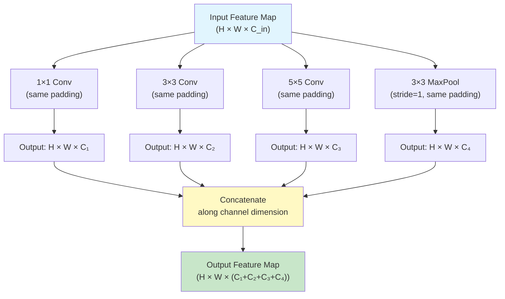
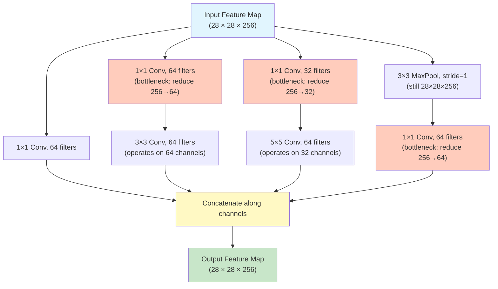
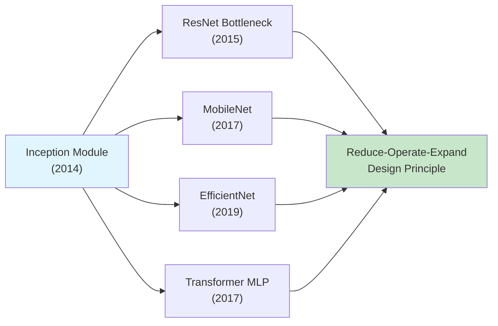

# 10. Inception Architecture Deep Dive

> [!info] Prerequisites
> Before reading this section, you should be comfortable with the fundamentals of convolutional neural networks, including how convolutional filters operate, how padding and stride affect spatial dimensions, and how pooling layers reduce resolution. You should also understand the concept of receptive fields and how deeper layers in a CNN accumulate increasingly large receptive fields from earlier layers.

---

## The Core Design Question: Why Commit to a Single Filter Size?

When we design a convolutional layer, we must choose a filter size—most commonly 3×3, but sometimes 5×5 or even 7×7. This choice implicitly commits the entire layer to looking at the input through a single spatial window. But this commitment creates a fundamental tension, because different types of visual information in an image exist at fundamentally different spatial scales, and no single filter size is optimal for capturing all of them simultaneously.

Consider what a CNN "sees" at intermediate layers of a network trained on ImageNet. At these layers, the network has already learned to detect a variety of features. **Textures**—such as the fine grain of sand, the rippled pattern of water, or the stippled surface of an orange peel—are highly localized patterns that only span a few pixels. A 1×1 or 3×3 filter is ideal for capturing these fine-grained details because the relevant information is concentrated in a tiny spatial neighborhood, and using a larger filter would dilute the signal with irrelevant surrounding pixels while simultaneously wasting computation on regions that contribute nothing to the texture detection. **Object parts and local structures**—such as an eye on a face, a wheel on a car, or a window on a building—span a moderate spatial extent, typically requiring a 3×3 or 5×5 receptive field to capture the full structure of the part in question. A filter that is too small will only see a fragment of the eye or wheel, missing the holistic shape; a filter that is too large will waste computation and introduce noise from surrounding context. **Global context and scene-level information**—such as the overall layout of a room, the horizon line in a landscape, or the spatial relationship between a person and the objects around them—requires a large receptive field, often 5×5 or larger, because the meaningful relationships span a significant portion of the feature map.

> [!tip] Concrete Example
> Imagine an image of a dog sitting on a couch in a living room. A 1×1 convolution can detect the texture of the dog's fur (small-scale pattern). A 3×3 convolution can detect the dog's eye or ear (medium-scale object part). A 5×5 convolution can capture the relationship between the dog and the couch cushion beneath it (large-scale context). Each scale provides complementary information that is valuable for classification, and choosing only one filter size means deliberately discarding the information at other scales.

The Inception module, introduced by Szegedy et al. in their 2014 paper "Going Deeper with Convolutions," asks a radical question: **what if we don't choose at all?** What if, instead of committing to a single filter size, we run multiple filter sizes in parallel and let the network learn which ones to use for each feature? This is the core insight of the Inception architecture: multi-scale parallel processing within a single layer, followed by aggregation of the multi-scale results.

---

## The Naive Inception Module

The simplest realization of the multi-scale parallel processing idea is what the original paper calls the "naive" Inception module. In this design, the input feature map is processed by four independent parallel branches, each looking at the data through a different spatial window, and the results of all four branches are concatenated along the depth (channel) dimension to form the output. This concatenation is critical: it preserves all the information from all scales, and subsequent layers can learn to weight the different-scale features as appropriate for the task at hand.

The four branches of the naive Inception module are as follows:

1. **1×1 Convolution Branch**: This branch uses a single 1×1 filter that looks at one pixel at a time, computing a linear combination of the input channels at each spatial location. This branch is responsible for capturing pixel-level patterns and cross-channel correlations without any spatial context. It essentially acts as a learned pointwise feature transformation, similar to applying a fully connected layer independently at each spatial position.

2. **3×3 Convolution Branch**: This branch uses 3×3 filters that look at a 3×3 neighborhood around each pixel. This branch captures local spatial structures and medium-scale patterns. It is the workhorse of modern CNNs and represents the standard convolutional window size that balances spatial context with computational efficiency.

3. **5×5 Convolution Branch**: This branch uses 5×5 filters that look at a 5×5 neighborhood around each pixel. This branch captures larger-scale spatial structures and broader context. The larger receptive field allows it to detect patterns that span a wider area, such as the relationship between adjacent object parts or extended edge structures.

4. **3×3 Max Pooling Branch**: This branch applies 3×3 max pooling with stride 1 and same padding (so the spatial dimensions are preserved). Max pooling selects the maximum activation within each 3×3 window, which provides a form of local translation invariance and picks out the most salient features in each local region. Including pooling in the module ensures that the multi-scale representation also captures the most activated features, not just linear combinations of them.

All four branches produce output feature maps with the **same spatial dimensions** as the input (achieved through appropriate padding), which is essential because the outputs must be concatenated along the channel dimension. If the spatial dimensions did not match, concatenation would be impossible.

> [!note] Why Concatenation Along Channels?
> Concatenation along the channel dimension is the natural choice because it preserves all spatial information while stacking the different-scale feature maps as separate "slices" of the output tensor. Subsequent convolutional layers can then learn to combine information across channels, effectively learning which scales are most relevant for each spatial location. This is analogous to how the human visual cortex processes information through multiple parallel pathways that are later integrated in higher cortical areas.

---

## The Computational Cost Problem

The naive Inception module looks elegant, but it harbors a devastating computational problem. As we increase the number of filters in each branch to give the network sufficient representational capacity, the computational cost explodes—especially in the 5×5 convolution branch and the 3×3 convolution branch. Let us work through a concrete numerical example to see exactly how bad this problem is.

### Worked Example: Cost of the 5×5 Branch

Suppose the input to an Inception module has spatial dimensions 28×28 and 256 channels (a realistic size for an intermediate layer in a CNN processing ImageNet images). Suppose the 5×5 convolution branch uses 64 filters. We need to compute the total number of multiply-add operations required for this single branch.

A 5×5 convolution filter, applied to an input with 256 channels, has:
- **Filter dimensions**: 5 × 5 × 256 (height × width × input channels)
- **Parameters per filter**: 5 × 5 × 256 = 6,400
- **Number of filters**: 64
- **Total parameters**: 64 × 6,400 = 409,600

But we need to count multiply-add **operations**, not just parameters. Each filter is applied at every spatial position of the output feature map. With same padding, the output spatial dimensions equal the input spatial dimensions (28×28). At each output position, the filter performs 5 × 5 × 256 = 6,400 multiply-adds. With 64 filters and 28 × 28 spatial positions:

$$\text{Total multiply-adds} = \text{output\_H} \times \text{output\_W} \times \text{filters} \times \text{kernel\_H} \times \text{kernel\_W} \times \text{input\_channels}$$

$$= 28 \times 28 \times 64 \times 5 \times 5 \times 256$$

Let us compute this step by step:

1. $28 \times 28 = 784$ (number of spatial positions in the output)
2. $5 \times 5 = 25$ (number of spatial positions in the kernel)
3. $784 \times 25 = 19,600$ (multiply-adds per filter across all spatial positions)
4. $19,600 \times 256 = 5,017,600$ (multiply-adds per filter, accounting for input channels)
5. $5,017,600 \times 64 = 321,126,400$ (multiply-adds across all 64 filters)

So the 5×5 branch alone requires approximately **321 million multiply-add operations**. And this is just one branch of the module! The 3×3 branch (with 128 filters, say) would add another substantial chunk:

$$3\times3\text{ branch}: 28 \times 28 \times 128 \times 3 \times 3 \times 256 = 241,172,480 \text{ multiply-adds}$$

Even the 1×1 branch with 64 filters costs:

$$1\times1\text{ branch}: 28 \times 28 \times 64 \times 1 \times 1 \times 256 = 12,845,056 \text{ multiply-adds}$$

The total for the naive module is enormous, and it gets progressively worse in deeper layers where channel counts are higher. This computational explosion makes the naive Inception module impractical for real-world use, especially on the hardware available in 2014.

> [!warning] The Scaling Problem
> The computational cost of convolutions scales with the product of input channels, output channels, and the square of the kernel size. As networks get deeper and wider, channel counts grow, and the cost grows quadratically with kernel size. A 5×5 convolution costs $(5/3)^2 \approx 2.78\times$ more than a 3×3 convolution with the same channel counts, and a naive Inception module uses both—plus pooling and 1×1 convolutions—creating a multiplicative cost blowup.

---

## The Improved Module with 1×1 Bottleneck Layers

The key insight that makes Inception practical is the use of **1×1 convolutions as dimensionality reduction bottlenecks**. A 1×1 convolution with fewer output channels than input channels acts as a learned projection that compresses the channel dimension while preserving the spatial dimensions. By inserting these bottleneck layers before the expensive 3×3 and 5×5 convolutions (and after the pooling layer), we dramatically reduce the number of input channels that the large kernels must process, which in turn dramatically reduces the total computational cost.

The improved Inception module works as follows:

1. **1×1 Convolution Branch**: Remains unchanged—it already uses 1×1 convolutions, so there is no need for additional dimensionality reduction.

2. **3×3 Convolution Branch**: A 1×1 convolution is applied first to reduce the channel count from (say) 256 to 64. Then the 3×3 convolution operates on the reduced 64-channel feature map, producing 64 output channels. The 1×1 bottleneck reduces the number of input channels that the expensive 3×3 convolution must process from 256 to just 64.

3. **5×5 Convolution Branch**: A 1×1 convolution is applied first to reduce the channel count from 256 to (say) 32. Then the 5×5 convolution operates on the reduced 32-channel feature map, producing 64 output channels. The bottleneck here is even more aggressive because the 5×5 convolution is the most expensive operation in the module.

4. **3×3 Max Pooling Branch**: The pooling layer is applied first (it does not change the channel count). Then a 1×1 convolution reduces the channel count from 256 to 64 for the output. This is necessary because without the 1×1 convolution after pooling, the full 256 channels would be passed to the concatenation, inflating the output channel count and the cost of all subsequent layers.

> [!tip] Why 1×1 Convolutions Work as Bottlenecks
> A 1×1 convolution is essentially a learned linear combination of the input channels at each spatial position. When the number of output channels is smaller than the number of input channels, the 1×1 convolution learns to project the high-dimensional channel space into a lower-dimensional subspace that preserves the most important information. This is analogous to Principal Component Analysis (PCA), but the projection is learned end-to-end through backpropagation rather than computed analytically. The key property is that this projection is cheap (1×1 convolutions have minimal computational cost) yet it can dramatically reduce the input channel count for the expensive convolutions that follow.

---

## Cost Savings Calculation: The Bottleneck in Numbers

Let us now compute the exact parameter count and computational savings achieved by the 1×1 bottleneck layers. We will compare the naive module (no bottlenecks) with the improved module (with bottlenecks) using the same input dimensions and output specifications.

### Without Bottleneck (Naive Module)

Assume the input is 28×28×256. The output channel counts for each branch are: 1×1 branch = 64, 3×3 branch = 128, 5×5 branch = 32, MaxPool branch = 64. Total output channels = 64 + 128 + 32 + 64 = 288.

**Parameter count for each branch:**

1. **1×1 branch**: The 1×1 conv takes 256 input channels and produces 64 output channels.
   $$P_{1\times1} = 1 \times 1 \times 256 \times 64 = 16{,}384$$

2. **3×3 branch**: The 3×3 conv takes 256 input channels and produces 128 output channels.
   $$P_{3\times3} = 3 \times 3 \times 256 \times 128 = 294{,}912$$

3. **5×5 branch**: The 5×5 conv takes 256 input channels and produces 32 output channels.
   $$P_{5\times5} = 5 \times 5 \times 256 \times 32 = 204{,}800$$

4. **MaxPool branch**: No learnable parameters in max pooling itself. However, the pooling output has 256 channels that are passed directly to concatenation. We will count 0 parameters here since we are comparing the conv-only costs.
   $$P_{\text{pool}} = 0$$

**Total parameters (naive):**
$$P_{\text{naive}} = 16{,}384 + 294{,}912 + 204{,}800 + 0 = 516{,}096$$

### With Bottleneck (Improved Module)

Now we insert 1×1 bottleneck layers. The output channel counts remain the same for the final convolutions in each branch, but the expensive convolutions now operate on reduced channel counts.

1. **1×1 branch**: Unchanged.
   $$P_{1\times1} = 1 \times 1 \times 256 \times 64 = 16{,}384$$

2. **3×3 branch**: 1×1 bottleneck (256→64) + 3×3 conv (64→128).
   $$P_{\text{bottleneck\_3\times3}} = (1 \times 1 \times 256 \times 64) + (3 \times 3 \times 64 \times 128) = 16{,}384 + 73{,}728 = 90{,}112$$

3. **5×5 branch**: 1×1 bottleneck (256→24) + 5×5 conv (24→32).
   $$P_{\text{bottleneck\_5\times5}} = (1 \times 1 \times 256 \times 24) + (5 \times 5 \times 24 \times 32) = 6{,}144 + 19{,}200 = 25{,}344$$

4. **MaxPool branch**: 1×1 projection after pooling (256→64).
   $$P_{\text{pool\_proj}} = 1 \times 1 \times 256 \times 64 = 16{,}384$$

**Total parameters (with bottlenecks):**
$$P_{\text{bottleneck}} = 16{,}384 + 90{,}112 + 25{,}344 + 16{,}384 = 148{,}224$$

### The Savings

$$\text{Reduction} = 1 - \frac{P_{\text{bottleneck}}}{P_{\text{naive}}} = 1 - \frac{148{,}224}{516{,}096} \approx 1 - 0.287 \approx 71.3\%$$

The bottleneck design reduces the parameter count by approximately **71%**. In other configurations (with different channel counts), the savings can be even more dramatic—the original paper reports cases with **87% reduction** when the channel counts are higher.

> [!note] The Canonical Inception Cost Comparison
> The most commonly cited comparison uses these specific numbers: without bottleneck, the 5×5 branch alone would need $5 \times 5 \times 256 \times 32 = 204{,}800$ parameters, while with the bottleneck, it needs $(1 \times 1 \times 256 \times 24) + (5 \times 5 \times 24 \times 32) = 6{,}144 + 19{,}200 = 25{,}344$ parameters—a reduction of 87.6% for this branch alone. The savings are most dramatic for the branches with the largest kernels, which is precisely where the cost problem is most severe.

---

## Auxiliary Classifiers: Fighting Vanishing Gradients in Very Deep Networks

GoogLeNet (the practical instantiation of the Inception architecture) is 22 layers deep, which was extraordinarily deep for its time. Such depth creates a serious optimization challenge: the gradient signal from the loss function must propagate backwards through many layers, and with each layer, the gradient can become smaller (the vanishing gradient problem). By the time the gradient reaches the early layers of the network, it may be so small that those layers receive virtually no learning signal, effectively stalling their training.

### The Problem

During backpropagation, the gradient of the loss with respect to the weights in layer $l$ depends on the chain of Jacobians from the output layer back to layer $l$:

$$\frac{\partial \mathcal{L}}{\partial W_l} = \frac{\partial \mathcal{L}}{\partial a_L} \cdot \frac{\partial a_L}{\partial a_{L-1}} \cdot \frac{\partial a_{L-1}}{\partial a_{L-2}} \cdots \frac{\partial a_{l+1}}{\partial a_l} \cdot \frac{\partial a_l}{\partial W_l}$$

If each Jacobian $\frac{\partial a_{k+1}}{\partial a_k}$ has eigenvalues less than 1, then the product of many such Jacobians shrinks exponentially with depth. This means the gradient reaching the early layers can be vanishingly small, providing almost no update signal for those layers' weights.

### The Solution: Auxiliary Classification Heads

The Inception paper introduces **auxiliary classifiers**—additional classification heads attached to intermediate layers of the network. These auxiliary heads take the feature maps from intermediate Inception modules, apply a few processing layers (average pooling, 1×1 convolution, fully connected layers), and produce their own classification predictions with their own cross-entropy losses. The total loss is a weighted combination of the main classifier's loss and the auxiliary classifiers' losses.

During training, the auxiliary classifiers inject fresh gradient signals into the intermediate layers. The gradient from the auxiliary loss only needs to propagate backwards through the layers above the auxiliary head, not through the entire depth of the network. This means that even if the gradient from the main classifier has vanished by the time it reaches an intermediate layer, the gradient from the auxiliary classifier at that layer is still strong and informative, providing a reliable learning signal for the layers below it.

### How Auxiliary Classifiers Work in GoogLeNet

GoogLeNet uses two auxiliary classifiers, attached after the Inception modules at layers 4a and 4d (roughly in the middle of the network). Each auxiliary classifier consists of:

1. **Average pooling**: A 5×5 average pooling layer with stride 3 that reduces the spatial dimensions of the feature map. This serves to condense the spatial information and reduce the computational cost of the subsequent fully connected layers.

2. **1×1 Convolution**: A 1×1 convolution with 128 filters that reduces the channel dimension and adds a learned projection. This serves as a bottleneck to keep the parameter count of the auxiliary head manageable.

3. **Fully connected layer**: A fully connected layer with 1024 units that transforms the pooled, projected features into a rich representation suitable for classification.

4. **ReLU activation**: A ReLU nonlinearity applied after the fully connected layer to introduce the capacity for nonlinear decision boundaries.

5. **Dropout**: A dropout layer with 70% keep probability that prevents the auxiliary head from overfitting to its limited view of the network's features.

6. **Fully connected layer + Softmax**: A final fully connected layer that projects to the 1000 ImageNet classes, followed by softmax to produce a probability distribution.

### The Weighted Loss

During training, the total loss is computed as a weighted sum:

$$\mathcal{L}_{\text{total}} = \mathcal{L}_{\text{main}} + 0.3 \cdot \mathcal{L}_{\text{aux1}} + 0.3 \cdot \mathcal{L}_{\text{aux2}}$$

The main classifier's loss receives full weight (1.0), while each auxiliary classifier's loss receives a weight of 0.3 (30%). The lower weight for auxiliary losses reflects the fact that the auxiliary classifiers are primarily optimization aids rather than independent classifiers—their purpose is to provide gradient signals to intermediate layers, not to make accurate predictions in their own right.

### What Happens at Test Time

At test time (inference), the auxiliary classifiers are **completely discarded**. They serve no purpose during inference because we only need the final prediction from the main classification head. The auxiliary heads were solely a training trick to improve gradient flow and help the intermediate layers learn better features. Removing them at test time also reduces the model's memory footprint and computational cost during deployment.

> [!warning] Common Misconception
> A common misconception is that the auxiliary classifiers improve accuracy by "providing additional predictions" that are ensembled with the main prediction. This is not the case—the auxiliary predictions are discarded at test time. Their sole purpose is to improve the gradient flow during training, which indirectly improves the quality of the features learned by the intermediate layers, which in turn improves the main classifier's accuracy.

---

## GoogLeNet Architecture Overview

GoogLeNet is the specific network architecture presented in the 2014 paper that uses Inception modules as its building blocks. It was named in homage to LeNet, the pioneering CNN architecture by Yann LeCun, while the "Google" prefix reflects its origin at Google Research. GoogLeNet won the ILSVRC 2014 classification competition with a top-5 error rate of 6.67%, a dramatic improvement over the 2013 winner (Clarifai, 11.7%) and the 2012 winner (AlexNet, 15.3%).

### Architecture Summary

The GoogLeNet architecture consists of the following components, listed in order from input to output:

1. **Stem network**: A series of conventional convolutional and pooling layers that reduce the spatial resolution and increase the channel depth of the input image. The stem includes a 7×7 convolution (stride 2), a 3×3 max pool (stride 2), a 1×1 convolution, a 3×3 convolution, and another 3×3 max pool (stride 2). By the end of the stem, the spatial dimensions have been reduced by a factor of 4, and the channel depth is sufficient for the Inception modules to operate on.

2. **9 Inception modules**: The core of the network consists of 9 Inception modules arranged in three groups. The first group (modules 3a, 3b) operates at 28×28 resolution. The second group (modules 4a through 4e) operates at 14×14 resolution, with stride-2 max pooling between the groups to reduce spatial dimensions. The third group (modules 5a, 5b) operates at 7×7 resolution.

3. **Global average pooling**: Instead of the traditional approach of flattening the feature map and passing it through large fully connected layers (as in AlexNet and VGG), GoogLeNet applies global average pooling across the entire 7×7 spatial extent, producing a single vector of 1024 values. This dramatically reduces the parameter count because it eliminates the need for fully connected layers with millions of parameters.

4. **Dropout + Linear classifier**: A dropout layer (40% dropout rate) is applied after global average pooling, followed by a single linear layer that projects the 1024-dimensional feature vector to the 1000 ImageNet classes.

### Parameter Count: GoogLeNet vs. VGG16

One of the most remarkable properties of GoogLeNet is its extreme parameter efficiency:

| Architecture | Parameters | Top-5 Error (ILSVRC) |
|---|---|---|
| AlexNet (2012) | ~60M | 15.3% |
| VGG16 (2014) | ~138M | 7.3% |
| **GoogLeNet (2014)** | **~6.8M** | **6.67%** |

GoogLeNet achieves better accuracy than VGG16 with approximately **20× fewer parameters**. This efficiency is primarily due to two design choices: (1) the 1×1 bottleneck layers that dramatically reduce the cost of the Inception modules, and (2) the global average pooling layer that eliminates the massive fully connected layers that dominate VGG's parameter count (VGG16's three fully connected layers alone account for over 120M parameters).

> [!info] Why Global Average Pooling is So Efficient
> In traditional CNNs like AlexNet and VGG, the final convolutional feature map is flattened into a long vector and passed through fully connected layers. If the final feature map has spatial dimensions 7×7 and 512 channels, the flattened vector has 7×7×512 = 25,088 elements. A fully connected layer mapping 25,088 inputs to 4096 outputs requires 25,088 × 4,096 = 102,760,448 parameters—over 100 million parameters in a single layer! Global average pooling replaces this by simply averaging each channel across the spatial dimensions, producing a 512-dimensional vector (one value per channel). This reduces the input to the final classification layer from 25,088 to 512, saving over 100M parameters in the first fully connected layer alone.

---

## Inception-V2 and V3 Improvements

The original Inception architecture was so successful that it spawned several improved versions. Inception-V2 and V3, described in the 2016 paper "Rethinking the Inception Architecture for Computer Vision," introduced several important refinements that improved both accuracy and efficiency.

### Batch Normalization

Inception-V2 incorporates batch normalization into the architecture. Batch normalization (discussed in detail in a later chapter) normalizes the activations of each layer to have zero mean and unit variance across the training batch, which dramatically stabilizes and accelerates training. In the context of Inception, batch normalization is applied to every convolutional layer (both the 1×1 bottlenecks and the larger spatial convolutions), and the network can be trained without the need for careful learning rate warmup or other training tricks. The addition of batch normalization alone improved GoogLeNet's top-5 error from 6.67% to approximately 4.8%, which is a substantial gain from what is essentially a simple normalization operation.

### Factorization of Convolutions: nxn → 1×n + n×1

One of the most elegant improvements in Inception-V3 is the factorization of large spatial convolutions into pairs of smaller, asymmetric convolutions. The key insight is that a single n×n convolution can be decomposed into two sequential convolutions: a 1×n convolution followed by an n×1 convolution. This factorization is exact when the filters are linear, and it remains a very good approximation even with nonlinear activations (ReLU) inserted between the two factorized convolutions.

For a 5×5 convolution, the factorization is:
$$5\times5 \text{ conv} \rightarrow 1\times5 \text{ conv} + 5\times1 \text{ conv}$$

The computational savings are significant. A 5×5 convolution with $C_{\text{in}}$ input channels and $C_{\text{out}}$ output channels requires:

$$\text{Cost}_{5\times5} = 5 \times 5 \times C_{\text{in}} \times C_{\text{out}} = 25 \cdot C_{\text{in}} \cdot C_{\text{out}}$$

The factorized version requires:

$$\text{Cost}_{\text{factored}} = (1 \times 5 \times C_{\text{in}} \times C_{\text{mid}}) + (5 \times 1 \times C_{\text{mid}} \times C_{\text{out}}) = 5 \cdot C_{\text{in}} \cdot C_{\text{mid}} + 5 \cdot C_{\text{mid}} \cdot C_{\text{out}}$$

When $C_{\text{mid}} = C_{\text{in}} = C_{\text{out}}$:

$$\text{Cost}_{\text{factored}} = 10 \cdot C_{\text{in}}^2 \quad \text{vs.} \quad \text{Cost}_{5\times5} = 25 \cdot C_{\text{in}}^2$$

This is a **60% reduction** in computational cost for the same effective receptive field, with the added benefit that the two smaller convolutions with a ReLU between them provide more representational power than a single 5×5 convolution (because the intermediate nonlinearity allows the factorized version to represent a richer set of functions).

Similarly, 3×3 convolutions can be factored into 1×3 + 3×1 pairs:

$$3\times3 \text{ conv} \rightarrow 1\times3 \text{ conv} + 3\times1 \text{ conv}$$

$$\text{Cost}_{3\times3} = 9 \cdot C_{\text{in}} \cdot C_{\text{out}} \quad \text{vs.} \quad \text{Cost}_{\text{factored}} = 6 \cdot C_{\text{in}} \cdot C_{\text{out}}$$

This is a **33% reduction** in computational cost.

### Additional V3 Improvements

Inception-V3 also introduced several other refinements:

- **RMSProp optimizer** instead of SGD with momentum, which provided more stable training for very deep networks.
- **Label smoothing** regularization, which replaces hard one-hot labels with soft labels (e.g., 0.9 for the correct class and 0.1/999 for all others). This prevents the network from becoming overconfident and improves generalization.
- **Factorized 7×7 stem**: The initial 7×7 convolution in the stem is replaced with three 3×3 convolutions, reducing computational cost while maintaining the same effective receptive field.

The combination of all these improvements brought Inception-V3's top-5 error down to approximately 3.5%, a significant improvement over the original GoogLeNet.

---

## The Legacy: Multi-Scale Processing and Dimensionality Reduction

The Inception architecture introduced two design principles that have had a lasting impact on deep learning architecture design, far beyond the specific Inception family of models.

### Multi-Scale Processing

The idea of processing features at multiple scales in parallel and then aggregating the results is now a standard technique in modern architectures. Feature Pyramid Networks (FPNs) use multi-scale feature maps for object detection. The U-Net architecture for image segmentation connects features at multiple resolutions through skip connections. Transformer architectures use multi-head attention, where each "head" can attend to different patterns at different scales. The common thread across all these architectures is the recognition that no single scale is sufficient for all tasks, and that combining multi-scale information leads to richer, more robust feature representations.

### Dimensionality Reduction via 1×1 Convolutions

The 1×1 bottleneck design has become one of the most widely used techniques in deep learning. It appears in ResNet bottleneck blocks (which we will study next), in MobileNet's depthwise separable convolutions (which use 1×1 pointwise convolutions to combine channel information), in EfficientNet's compound scaling strategy, and in Transformer architectures (where the MLP blocks use expansion and contraction with linear layers that serve the same purpose as 1×1 bottlenecks). The principle is always the same: compress the channel dimension before expensive operations, then expand it afterward, to reduce computational cost without sacrificing representational capacity.

> [!tip] The Design Principle
> **If an expensive operation (large kernel, many channels) must be performed, first reduce the channel dimension with a cheap 1×1 convolution, perform the expensive operation on the reduced-dimension representation, then expand back with another 1×1 convolution.** This "reduce-operate-expand" pattern is one of the most important architectural design principles in modern deep learning.

---

## Summary

The Inception architecture challenged the assumption that a convolutional layer must use a single filter size, proposing instead that multiple filter sizes should operate in parallel and their outputs should be concatenated. The naive version of this idea was computationally infeasible, but the introduction of 1×1 bottleneck layers for dimensionality reduction made it practical, achieving dramatic computational savings (70-87% parameter reduction). GoogLeNet demonstrated the power of this approach by achieving state-of-the-art ImageNet accuracy with only 6.8M parameters—20× fewer than VGG16. The auxiliary classifiers addressed the vanishing gradient problem in very deep networks, and subsequent versions (V2, V3) introduced batch normalization and convolution factorization for further improvements. The two core principles—multi-scale processing and dimensionality reduction via bottlenecks—have become foundational design patterns that appear throughout modern deep learning architectures.