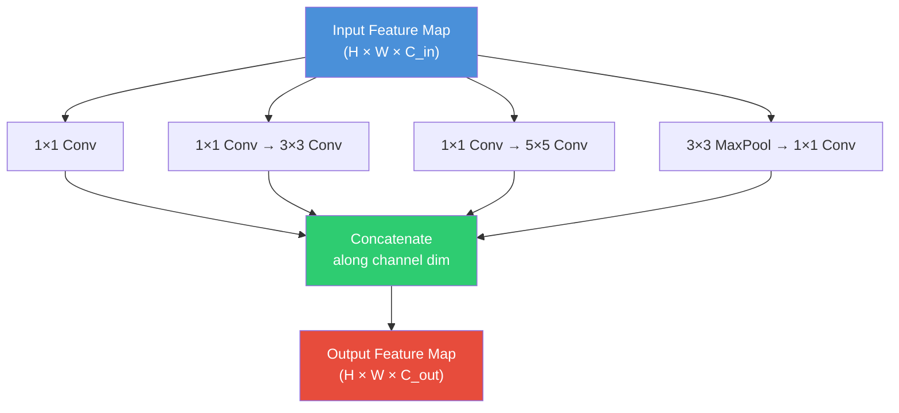
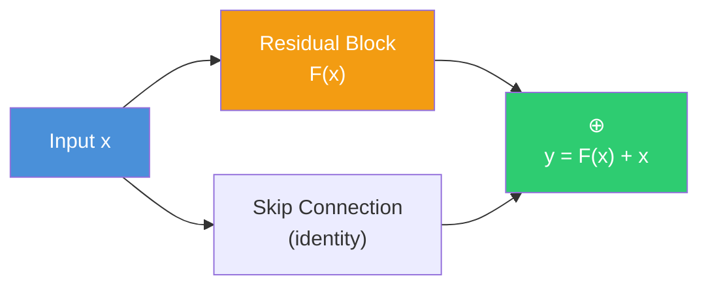
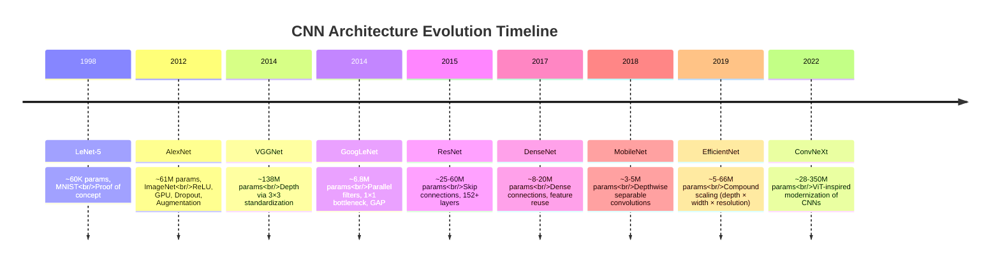

# 8. Evolution of CNN Architectures

## Introduction

The history of convolutional neural network architectures is not merely a chronicle of incrementally better ImageNet scores — it is a narrative of fundamental conceptual breakthroughs, each solving a critical limitation of its predecessor. From LeNet-5's proof that learned convolutional features could outperform hand-crafted pipelines, to AlexNet's dramatic demonstration that deep learning could dominate large-scale visual recognition, to ResNet's elegant solution to the degradation problem that enabled hundred-layer networks, each generation introduced ideas that permanently altered the trajectory of the field. In this section, we will trace this evolution exhaustively, examining each architecture's innovations, its limitations, and how those limitations motivated the next breakthrough. By understanding this lineage, you will develop an intuition for *why* modern architectures look the way they do, and you will be equipped to critically evaluate future architectural proposals.

---

## 1. LeNet-5 (1998): The Proof of Concept

### 1.1 Historical Context

In the late 1980s and 1990s, the dominant approach to optical character recognition and document analysis was **hand-crafted feature engineering**: practitioners designed feature extractors (edge detectors, histogram operators, moment descriptors) by hand and fed the extracted features into simple classifiers like SVMs or nearest-neighbor methods. Yann LeCun, working at AT&T Bell Labs, proposed a radically different approach: **learn the features end-to-end from data using backpropagation through a convolutional neural network**. This idea — that the entire pipeline from raw pixels to classification decision could be learned — was profoundly influential, even though it would take another 14 years and a GPU revolution before it could be fully realized at scale.

### 1.2 Architecture

LeNet-5 consists of 7 learnable layers (5 convolutional + 2 fully connected), processing $32 \times 32 \times 1$ grayscale images:

| Layer | Type | Input Size | Output Size | Parameters |
|-------|------|-----------|-------------|------------|
| C1 | Conv 5×5, 6 filters | 32×32×1 | 28×28×6 | $5\times5\times1\times6 + 6 = 156$ |
| S2 | Avg Pool 2×2, stride 2 | 28×28×6 | 14×14×6 | $6 + 6 = 12$ ( trainable scaling + bias) |
| C3 | Conv 5×5, 16 filters | 14×14×6 | 10×10×16 | $1{,}516$ (non-standard connectivity) |
| S4 | Avg Pool 2×2, stride 2 | 10×10×16 | 5×5×16 | $32$ (scaling + bias) |
| C5 | Conv 5×5, 120 filters | 5×5×16 | 1×1×120 | $5\times5\times16\times120 + 120 = 48{,}120$ |
| F6 | Fully Connected | 120 | 84 | $120\times84 + 84 = 10{,}164$ |
| Output | Fully Connected (RBF) | 84 | 10 | $84\times10 = 840$ |

**Total parameters**: ~60,000

### 1.3 Key Design Choices and Limitations

- **Average pooling** (not max pooling): LeCun used subsampling layers that computed the average of $2 \times 2$ regions, multiplied by a trainable weight and added a trainable bias. This was the standard at the time; max pooling was not yet widely used.
- **Sigmoid/Tanh activations**: ReLU had not yet been proposed. Sigmoid and tanh suffer from the **vanishing gradient problem** — their derivatives saturate at 0 for large positive or negative inputs, making it difficult for gradients to flow through deep networks.
- **Small model**: With only ~60K parameters, LeNet-5 was appropriate for MNIST (10 classes, 28×28 images) but utterly inadequate for complex, high-resolution natural images with thousands of categories.
- **No data augmentation**: Training data was limited to the original dataset, with no augmentation strategies to artificially increase diversity.

> [!info] LeNet-5's Legacy
> Despite its modest scale, LeNet-5 established the fundamental template that all subsequent CNNs follow: alternating convolution and pooling layers, followed by fully connected layers for classification. Every architectural innovation since 1998 has been a modification of this basic template, not a departure from it.

---

## 2. AlexNet (2012): The Breakthrough

### 2.1 The ImageNet Moment

The ILSVRC (ImageNet Large Scale Visual Recognition Challenge) 2012 competition is widely regarded as the moment that launched the deep learning revolution. Before AlexNet, the best approaches used hand-crafted features (SIFT, HOG) combined with shallow classifiers, and the top-5 error rate on ImageNet was approximately 26%. AlexNet, designed by Alex Krizhevsky, Ilya Sutskever, and Geoffrey Hinton, achieved a top-5 error rate of **15.3%** — a margin of **10.8 percentage points** over the runner-up. This was not an incremental improvement; it was a seismic shift that convinced the entire computer vision community that deep learning was the future.

### 2.2 Architecture

AlexNet consists of 5 convolutional layers and 3 fully connected layers, processing $224 \times 224 \times 3$ RGB images:

| Layer | Type | Output Size | Parameters |
|-------|------|-------------|------------|
| Conv1 | 11×11, 96 filters, stride 4 | 55×55×96 | $11\times11\times3\times96 + 96 = 34{,}944$ |
| Pool1 | Max 3×3, stride 2 | 27×27×96 | 0 |
| Conv2 | 5×5, 256 filters, pad 2 | 27×27×256 | $5\times5\times96\times256 + 256 = 614{,}656$ |
| Pool2 | Max 3×3, stride 2 | 13×13×256 | 0 |
| Conv3 | 3×3, 384 filters, pad 1 | 13×13×384 | $3\times3\times256\times384 + 384 = 885{,}120$ |
| Conv4 | 3×3, 384 filters, pad 1 | 13×13×384 | $3\times3\times384\times384 + 384 = 1{,}327{,}488$ |
| Conv5 | 3×3, 256 filters, pad 1 | 13×13×256 | $3\times3\times384\times256 + 256 = 884{,}992$ |
| Pool5 | Max 3×3, stride 2 | 6×6×256 | 0 |
| FC6 | Fully Connected | 4,096 | $6\times6\times256\times4096 + 4096 = 37{,}752{,}832$ |
| FC7 | Fully Connected | 4,096 | $4096\times4096 + 4096 = 16{,}781{,}312$ |
| FC8 | Fully Connected | 1,000 | $4096\times1000 + 1000 = 4{,}097{,}000$ |

**Total parameters**: ~61 million

### 2.3 Innovations

**1. ReLU Activation**: AlexNet replaced sigmoid/tanh with the Rectified Linear Unit (ReLU): $f(x) = \max(0, x)$. ReLU has several decisive advantages: (a) it does not saturate for positive inputs (derivative is always 1), eliminating the vanishing gradient problem for positive activations; (b) it is computationally trivial (a simple comparison); (c) it produces sparse activations (approximately 50% of neurons output zero), which acts as implicit regularization. Krizhevsky et al. showed that a ReLU network trained 6× faster than an equivalent tanh network on CIFAR-10.

**2. Dropout**: To combat the massive overfitting risk of 61M parameters trained on 1.2M images, AlexNet employed dropout (Srivastava et al., 2014) with $p = 0.5$ in the first two FC layers. During training, each neuron is randomly set to zero with probability 0.5, preventing co-adaptation of features and forcing the network to learn redundant representations. At test time, all neurons are active but their outputs are multiplied by 0.5 to maintain expected activation levels.

**3. GPU Training**: AlexNet was the first large-scale CNN trained on GPUs. Krizhevsky used two GTX 580 GPUs (3GB memory each), splitting the network across both devices. This reduced training time from weeks to approximately 5–6 days and demonstrated the practical feasibility of GPU-accelerated deep learning. The parallelization strategy (splitting channels across GPUs) also inspired the "group convolution" concept later formalized in ResNeXt.

**4. Data Augmentation**: To artificially increase the effective size of the training set, AlexNet employed two augmentation strategies: (a) random crops and horizontal flips of the input images (extracting $224 \times 224$ patches from $256 \times 256$ resized images), increasing the effective training set by 2048×; and (b) PCA-based color augmentation, adding small perturbations to the RGB channels proportional to the eigenvalues of the pixel covariance matrix. This latter technique, called "Fancy PCA," proved surprisingly effective at reducing overfitting.

**5. Overlapping Max Pooling**: Unlike LeNet's non-overlapping average pooling, AlexNet used max pooling with $3 \times 3$ windows and stride 2, creating overlapping regions. This slightly reduced the top-1 and top-5 error rates compared to non-overlapping pooling, as overlapping pools capture more spatial information.

**6. Local Response Normalization (LRN)**: AlexNet applied a form of lateral inhibition inspired by neuroscience, where each neuron's activation was normalized by the activations of neighboring channels. This technique was later found to be unnecessary and was abandoned in subsequent architectures, but it reflected an early attempt to understand what normalization strategies might help deep networks.

> [!warning] LRN Is Obsolete
> Local Response Normalization is a historical artifact. Batch Normalization (introduced in 2015) is strictly superior: it normalizes across the batch dimension rather than the channel dimension, provides smoother gradient flow, and acts as a regularizer. No modern architecture uses LRN.

### 2.4 The Deep Learning Boom

AlexNet's victory was the catalyst for the deep learning revolution. Within two years, virtually every top entry in ILSVRC used deep CNNs, and the error rate dropped from 26% (2011) to 3.57% (2015) — surpassing human-level performance on the top-5 metric. This rapid progress attracted massive investment from industry and academia, leading to the development of GPU computing infrastructure (CUDA, cuDNN), deep learning frameworks (TensorFlow, PyTorch), and the vast ecosystem of tools and techniques we use today.

---

## 3. VGG-16 (2014): Deep and Simple

### 3.1 Philosophy

The Visual Geometry Group at Oxford (Simonyan & Zisserman, 2014) pursued a radically simple design philosophy: **use only 3×3 convolutions, stack them deeply, and let depth do the work**. While AlexNet used a mix of 11×11, 5×5, and 3×3 filters, VGG standardized on 3×3 exclusively, motivated by the receptive field argument (two 3×3 convolutions = one 5×5 receptive field with fewer parameters and more non-linearity; see [[9. VGG16 Architecture Deep Dive]] for the full proof).

### 3.2 Architecture and Parameters

VGG-16 contains 13 convolutional layers and 3 fully connected layers, totaling ~138 million parameters. The architecture follows a strict pattern: double the number of channels after each pooling operation, starting from 64 and going up to 512. The first FC layer alone contains approximately 103 million parameters (74% of the total), making the FC layers the dominant cost.

### 3.3 Impact

VGG-16 demonstrated that **depth** was a critical ingredient for good performance. By systematically evaluating configurations with 11, 13, 16, and 19 weight layers, Simonyan & Zisserman showed that deeper networks consistently outperformed shallower ones, provided they used small 3×3 filters. VGG-16 achieved 7.3% top-5 error on ImageNet, compared to AlexNet's 15.3%.

However, VGG's massive parameter count (138M, mostly in FC layers) and computational cost (15.5 billion FLOPs for a single forward pass) motivated the next generation of architectures to focus on **efficiency**.

> [!info] VGG's Enduring Legacy
> Despite being obsolete as a classification architecture, VGG-16 remains one of the most widely used networks for **feature extraction** in tasks like style transfer, perceptual loss, and feature-based image retrieval. Its simple, uniform architecture makes it easy to extract features from any intermediate layer, and the features are surprisingly effective despite the network's age.

---

## 4. GoogLeNet / Inception-V1 (2014): Parallel Filters and Efficiency

### 4.1 The Inception Module

While VGG pursued depth through serial stacking, Christian Szegedy et al. at Google pursued **width** through parallel computation. The central innovation of GoogLeNet is the **Inception module**, which applies multiple filter sizes (1×1, 3×3, 5×5) and a 3×3 max pooling **in parallel** on the same input, then concatenates the results along the channel dimension:

The rationale for parallel filters is that **we don't know in advance what filter size is best** for a given layer. Some features are best captured by 1×1 convolutions (channel mixing), others by 3×3 (local patterns), and still others by 5×5 (larger spatial patterns). By computing all of them in parallel and letting the network learn which to use (via the learned weights), the Inception module avoids committing to a single filter size.

### 4.2 The 1×1 Bottleneck

A naive implementation of the Inception module would be prohibitively expensive. Consider a 5×5 convolution with $C_{\text{in}}$ input channels and $C_{\text{out}}$ output channels: it costs $5 \times 5 \times C_{\text{in}} \times C_{\text{out}}$ FLOPs per spatial position. For $C_{\text{in}} = 512$ and $C_{\text{out}} = 128$, this is $5 \times 5 \times 512 \times 128 = 1{,}638{,}400$ FLOPs per position.

The **1×1 bottleneck** reduces this cost dramatically. Before the 5×5 convolution, we apply a 1×1 convolution that reduces the channel dimension from $C_{\text{in}}$ to $C_{\text{reduce}}$ (e.g., $C_{\text{reduce}} = 32$). The cost then becomes:

$$\underbrace{1 \times 1 \times 512 \times 32}_{\text{1×1 bottleneck}} + \underbrace{5 \times 5 \times 32 \times 128}_{\text{5×5 conv}} = 16{,}384 + 102{,}400 = 118{,}784 \text{ FLOPs/position}$$

This is a **13.8× reduction** compared to the naive version, with only a small loss in representational capacity because the bottleneck forces the network to learn a compressed representation of the input channels.

### 4.3 Auxiliary Classifiers

GoogLeNet is 22 layers deep, and the authors found that the gradient signal from the final loss had difficulty propagating all the way back to the early layers. To address this, they added **two auxiliary classifiers** at intermediate layers (after Inception modules 4a and 4d). Each auxiliary classifier consists of an average pooling layer, a 1×1 convolution, two FC layers, and a softmax. During training, the total loss is:

$$\mathcal{L}_{\text{total}} = \mathcal{L}_{\text{main}} + 0.3 \cdot \mathcal{L}_{\text{aux1}} + 0.3 \cdot \mathcal{L}_{\text{aux2}}$$

The auxiliary losses provide additional gradient signal to the early layers, helping them learn useful features. During inference, the auxiliary classifiers are discarded.

### 4.4 Results and Significance

GoogLeNet achieved **6.7% top-5 error** on ImageNet with only **6.8 million parameters** — a 20× reduction compared to VGG-16's 138M parameters. This demonstrated that clever architectural design could achieve better accuracy with far fewer parameters, challenging the "bigger is better" paradigm. GoogLeNet also used GAP instead of FC layers, eliminating the massive FC parameter overhead.

---

## 5. ResNet (2015): Solving the Degradation Problem

### 5.1 The Degradation Problem

As networks grew deeper, a surprising phenomenon emerged: **deeper networks had higher training error** than their shallower counterparts. This was not caused by overfitting (training error was worse, not just validation error) or by vanishing gradients (BatchNorm and proper initialization had largely solved that). Instead, the problem was that **deeper networks were harder to optimize** — the optimization landscape became more complex, and plain (non-residual) networks struggled to find good solutions.

Kaiming He et al. demonstrated this elegantly: they trained a 56-layer plain network and a 20-layer plain network on CIFAR-10. The 56-layer network had **higher training error** than the 20-layer network, despite having strictly more capacity. If a 56-layer network can represent any function a 20-layer network can (by setting the extra 36 layers to identity mappings), then the deeper network should achieve at least the same training error. The fact that it doesn't means the optimizer is failing to find the identity mapping solution in the high-dimensional parameter space.

### 5.2 Skip Connections: The Solution

ResNet's solution is deceptively simple: add **skip connections** (also called residual connections or shortcut connections) that bypass one or more layers:

$$\mathbf{y} = \mathcal{F}(\mathbf{x}) + \mathbf{x}$$

where $\mathcal{F}(\mathbf{x})$ represents the residual mapping learned by the convolutions, and $\mathbf{x}$ is the input that is added directly to the output. The key insight is that it is much easier to learn a **residual** $\mathcal{F}(\mathbf{x}) = \mathbf{y} - \mathbf{x}$ (the difference between desired output and input) than to learn the full mapping $\mathbf{y}$ directly. If the identity mapping is optimal, the network only needs to learn $\mathcal{F}(\mathbf{x}) = \mathbf{0}$, which is trivially achieved by driving the weights toward zero — a much easier optimization target than learning an explicit identity mapping through multiple non-linear layers.

### 5.3 Depth and Results

ResNet demonstrated that skip connections enabled training of extremely deep networks:

| Model | Depth | Top-5 Error | Parameters |
|-------|-------|-------------|------------|
| ResNet-18 | 18 | 10.6% | 11.7M |
| ResNet-34 | 34 | 8.8% | 21.8M |
| ResNet-50 | 50 | 6.7% | 25.6M |
| ResNet-101 | 101 | 5.8% | 44.5M |
| ResNet-152 | 152 | 5.2% | 60.2M |

ResNet-152 achieved **3.57% top-5 error** on ImageNet (with ensemble), **surpassing human-level performance** on the top-5 metric and winning ILSVRC 2015. This was a landmark result that demonstrated the power of very deep networks when properly designed.

### 5.4 Why ResNet Changed Everything

Skip connections had a profound impact beyond just enabling depth. They also:
1. **Improved gradient flow**: Gradients can bypass any layer via the skip connection, ensuring that even the earliest layers receive strong gradient signals.
2. **Enabled feature reuse**: Each residual block can choose to use the skip connection (ignoring the residual branch) or modify the input via the residual branch, giving the network the flexibility to learn when to transform features and when to pass them through unchanged.
3. **Created an implicit ensemble**: Veit et al. (2016) showed that a ResNet with $n$ residual blocks behaves like an ensemble of $2^n$ paths of varying lengths, which explains its robustness to layer removal.

> [!tip] ResNet Is the Default
> For most practical applications, ResNet-50 is the default starting architecture. It offers an excellent balance of accuracy, training speed, and parameter efficiency. Only move to more specialized architectures when you have a specific reason to do so.

---

## 6. DenseNet (2017): Dense Connections and Feature Reuse

### 6.1 From Skip Connections to Dense Connections

While ResNet connects each block to its immediate predecessor, DenseNet (Huang et al., CVPR 2017) connects **each layer to every preceding layer** within a dense block. For a dense block with $L$ layers, the $l$-th layer receives the concatenated feature maps of all preceding layers:

$$\mathbf{x}_l = H_l([\mathbf{x}_0, \mathbf{x}_1, \ldots, \mathbf{x}_{l-1}])$$

where $[\cdot]$ denotes concatenation along the channel dimension and $H_l$ is a composite function of BN → ReLU → Conv 3×3.

### 6.2 Transition Layers

To prevent the channel count from growing without bound, DenseNet inserts **transition layers** between dense blocks. Each transition layer consists of:
1. BN → ReLU → Conv 1×1 (reduces channels by a compression factor $\theta$, typically $\theta = 0.5$)
2. Average Pooling 2×2 (halves spatial resolution)

### 6.3 Advantages and Trade-offs

**Advantages**:
- **Strong feature reuse**: Each layer has direct access to all features computed by preceding layers, encouraging feature reuse and reducing the need for redundant feature learning.
- **Parameter efficiency**: DenseNet-121 achieves comparable accuracy to ResNet-101 with only 8M parameters (vs. 44.5M), because each layer operates on a small number of new feature channels (the "growth rate" $k$, typically $k = 12$ or $k = 32$).
- **Better gradient flow**: The dense connectivity pattern creates short paths from the loss to every layer, improving gradient flow during training.

**Trade-offs**:
- **Memory intensive**: The concatenation operation requires storing all intermediate feature maps, which consumes significantly more GPU memory than ResNet. DenseNet-161 requires ~2× the memory of ResNet-152 for a forward pass.
- **Slow inference**: The many small concatenation operations are not well-optimized on current hardware, making DenseNet slower than ResNet in practice despite having fewer FLOPs.

> [!warning] DenseNet's Memory Problem
> DenseNet is a classic example of an architecture that is theoretically efficient (few parameters, few FLOPs) but practically problematic due to memory bottleneck. This illustrates a general principle: **FLOPs ≠ speed**. Memory access patterns, kernel launch overhead, and hardware utilization often matter more than raw operation counts.

---

## 7. MobileNet (2018): Depthwise Separable Convolutions

### 7.1 The Mobile Deployment Imperative

As deep learning moved from data centers to mobile phones, embedded systems, and IoT devices, the need for efficient architectures became critical. Mobile devices have strict constraints on computation (limited FLOPs), memory (limited RAM for model weights and activations), and power (battery life). Standard CNNs like VGG and ResNet are far too expensive for these environments.

### 7.2 Depthwise Separable Convolutions

MobileNet (Howard et al., 2017) replaces standard convolutions with **depthwise separable convolutions**, which factorize a standard convolution into two separate operations:

**Standard convolution**: A single $D_K \times D_K \times C_{\text{in}} \times C_{\text{out}}$ filter simultaneously captures spatial patterns and cross-channel correlations. Cost: $D_K^2 \times C_{\text{in}} \times C_{\text{out}} \times D_F^2$ FLOPs (where $D_F$ is the spatial size of the feature map).

**Depthwise separable convolution**:
1. **Depthwise convolution**: Apply a separate $D_K \times D_K \times 1$ filter to each input channel independently. Cost: $D_K^2 \times C_{\text{in}} \times D_F^2$ FLOPs.
2. **Pointwise convolution (1×1)**: Apply a $1 \times 1 \times C_{\text{in}} \times C_{\text{out}}$ convolution to mix channels. Cost: $C_{\text{in}} \times C_{\text{out}} \times D_F^2$ FLOPs.

**Total cost**: $D_K^2 \times C_{\text{in}} \times D_F^2 + C_{\text{in}} \times C_{\text{out}} \times D_F^2$

**Reduction ratio**:

$$\frac{\text{Depthwise Separable}}{\text{Standard}} = \frac{D_K^2 \cdot C_{\text{in}} + C_{\text{in}} \cdot C_{\text{out}}}{D_K^2 \cdot C_{\text{in}} \cdot C_{\text{out}}} = \frac{1}{C_{\text{out}}} + \frac{1}{D_K^2}$$

For $D_K = 3$ and $C_{\text{out}} = 256$: reduction ratio $= \frac{1}{256} + \frac{1}{9} \approx 0.115$, meaning depthwise separable convolutions cost only **11.5%** of a standard convolution — an **8.7× reduction** in computation.

### 7.3 MobileNet Variants

- **MobileNetV1** (2017): Introduced depthwise separable convolutions with width multiplier $\alpha \in (0, 1]$ to trade accuracy for efficiency.
- **MobileNetV2** (2018): Added **inverted residuals** and **linear bottlenecks** — expand → depthwise → project (without ReLU on the output), which preserves information in low-dimensional spaces.
- **MobileNetV3** (2019): Used NAS (Neural Architecture Search) to find optimal block configurations, combined with hardware-aware optimization.

---

## 8. EfficientNet (2019): Compound Scaling

### 8.1 The Scaling Problem

Given a baseline architecture (e.g., a small model that works well), how should we scale it up to achieve better accuracy? There are three dimensions of scaling:

1. **Depth** ($d$): Add more layers
2. **Width** ($w$): Add more channels per layer
3. **Resolution** ($r$): Use higher-resolution input images

Previous approaches scaled these dimensions independently and heuristically (e.g., ResNet goes deeper but keeps width and resolution fixed; WideResNet goes wider but keeps depth fixed). Mingxing Tan and Quoc Le (2019) argued that **all three dimensions should be scaled together** in a principled way.

### 8.2 Compound Scaling

EfficientNet proposes **compound scaling** with a single compound coefficient $\phi$:

$$d = \alpha^\phi, \quad w = \beta^\phi, \quad r = \gamma^\phi$$

subject to the constraint $\alpha \cdot \beta^2 \cdot \gamma^2 \approx 2$ (so that increasing $\phi$ by 1 approximately doubles the total FLOPs, since FLOPs are proportional to depth, width², and resolution²).

The baseline architecture (EfficientNet-B0) was found using Neural Architecture Search (NAS), and the optimal scaling coefficients were found via grid search: $\alpha = 1.2$, $\beta = 1.1$, $\gamma = 1.15$. Scaling from B0 to B7 produces a family of models spanning a wide range of accuracy and efficiency:

| Model | $\phi$ | Top-1 Accuracy | FLOPs | Parameters |
|-------|--------|---------------|-------|------------|
| B0 | 0 | 77.1% | 0.39B | 5.3M |
| B1 | 0.5 | 79.1% | 0.70B | 7.8M |
| B3 | 1.0 | 81.6% | 1.8B | 12M |
| B5 | 2.0 | 83.3% | 9.9B | 30M |
| B7 | 3.5 | 84.3% | 37B | 66M |

### 8.3 Impact

EfficientNet demonstrated that **how you scale matters as much as what you scale**. By scaling all three dimensions together, EfficientNet achieved state-of-the-art accuracy with far fewer FLOPs than previous architectures. EfficientNet-B7 achieved 84.3% top-1 accuracy with 37B FLOPs, while the previous best (GPipe) required 540B FLOPs for similar accuracy — a **14.6× improvement in efficiency**.

---

## 9. ConvNeXt (2022): ViT-Inspired Modernization

### 9.1 The Vision Transformer Challenge

In 2020, Dosovitskiy et al. introduced the Vision Transformer (ViT), which applied the standard Transformer architecture (originally designed for NLP) directly to image patches. ViT and its successors (Swin Transformer, DeiT) achieved remarkable results, leading many to question whether CNNs were fundamentally inferior to Transformers for visual recognition.

### 9.2 ConvNeXt's Response

Zhuang Liu et al. (2022) asked a provocative question: **how much of the Transformer's success is due to the Transformer architecture itself, versus the specific training techniques and design choices that were developed alongside it?** To answer this, they started with a standard ResNet-50 and progressively modified it to incorporate design elements from ViT/Swin Transformer, testing the impact of each change:

| Modification | Description | Impact |
|---|---|---|
| **Stage ratio** | Change from ResNet's (3,4,6,3) to Swin's (3,3,9,3) | +0.3% accuracy |
| **"Patchify" stem** | Replace 7×7 conv stride 2 + maxpool with 4×4 conv stride 4 | +0.1% |
| **ResNeXt-ify** | Use grouped convolution (group size = channel count = depthwise) | +0.5% |
| **Inverted bottleneck** | Wider in the middle, narrower at input/output (like MobileNetV2) | +1.0% |
| **Large kernel (7×7)** | Move large kernel to depthwise conv, increase to 7×7 | +0.3% |
| **Various micro-designs** | Replace ReLU with GELU, fewer norms, LayerNorm instead of BN, etc. | +1.2% |

The final architecture, **ConvNeXt**, achieved **87.8% top-1 accuracy** on ImageNet (with ConvNeXt-XL and extra data), **matching or exceeding** Swin Transformer while being a pure convolutional network. This demonstrated that CNNs were not inherently inferior — they simply needed to adopt the training and design innovations that had been developed for Transformers.

### 9.3 Key Takeaway

ConvNeXt's most important lesson is that **architectural innovation is inseparable from training recipe innovation**. Many of the "Transformer advantages" turned out to be due to better training techniques (longer training, stronger augmentation, AdamW optimizer, stochastic depth) rather than architectural superiority per se. When these techniques were applied to a properly modernized CNN, it matched the Transformer.

---

## 10. Timeline Analysis: The Arc of Progress

### 10.1 The Pattern: Each Generation Solves a Problem of the Previous

| Generation | Problem Solved | Key Innovation | New Problem Created |
|---|---|---|---|
| **LeNet → AlexNet** | Small scale, hand-crafted features | GPU training, ReLU, data augmentation | Massive overfitting, FC parameter bloat |
| **AlexNet → VGG** | Ad-hoc filter sizes, limited depth | 3×3 standardization, systematic depth | Even more parameters (138M), FC bottleneck |
| **VGG → GoogLeNet** | Parameter bloat, fixed filter sizes | Inception module, 1×1 bottleneck, GAP | Training instability in very deep networks |
| **GoogLeNet → ResNet** | Degradation with depth | Skip connections | Diminishing returns beyond ~200 layers |
| **ResNet → DenseNet** | Redundant feature learning | Dense connections, feature reuse | Memory bottleneck from concatenation |
| **ResNet → MobileNet** | Too expensive for mobile | Depthwise separable convolutions | Slight accuracy loss for efficiency |
| **ResNet → EfficientNet** | Ad-hoc scaling | Compound scaling (d × w × r) | NAS is expensive to run |
| **CNNs → ConvNeXt** | Competition from Transformers | Modernized training + architecture | Transformers still dominant in multi-modal |

### 10.2 The Three Eras of CNN Architecture

**Era 1: Deeper (2012–2015)**. The central question was: *can we make networks deeper?* AlexNet showed depth was valuable; VGG showed systematic depth with small filters worked; ResNet showed that with skip connections, depth was practically unlimited.

**Era 2: More Efficient (2015–2019)**. The central question shifted to: *can we achieve the same accuracy with fewer resources?* GoogLeNet's 1×1 bottleneck, MobileNet's depthwise convolutions, and DenseNet's feature reuse all aimed to reduce computation and parameters while maintaining (or improving) accuracy.

**Era 3: Hybrid and Modernized (2019–present)**. The central question became: *how should CNNs respond to the Transformer challenge?* EfficientNet's compound scaling borrowed ideas from NAS; ConvNeXt directly adopted Transformer design elements into a CNN framework. The boundary between "CNN" and "Transformer" has become increasingly blurred.

> [!info] What's Next?
> The current frontier is **multi-modal architectures** that process images, text, audio, and other modalities within a unified framework (CLIP, SigLIP, etc.). These models often use hybrid architectures with convolutional front-ends and Transformer back-ends. The future likely lies not in pure CNNs or pure Transformers, but in architectures that combine the best of both paradigms — the translation invariance and parameter sharing of convolutions with the global attention and flexibility of Transformers.

---

## 11. Summary: The Grand Lessons

> [!tip] Five Enduring Principles from CNN Architecture Evolution
> 1. **Depth matters, but only with the right infrastructure**: Deep networks are more powerful than shallow ones, but only when the training infrastructure (initialization, normalization, skip connections) supports gradient flow through many layers.
> 2. **Efficiency is as important as accuracy**: An architecture that achieves 1% better accuracy but requires 10× more compute is rarely worth it in practice. The most impactful architectures (ResNet, MobileNet, EfficientNet) improve the accuracy-efficiency frontier, not just accuracy.
> 3. **Small, consistent design choices compound**: VGG's 3×3 standardization, GoogLeNet's 1×1 bottleneck, and ResNet's skip connections are all individually simple ideas, but their cumulative effect transformed the field. Don't underestimate the power of a simple, well-motivated design change.
> 4. **The training recipe is part of the architecture**: ConvNeXt showed that much of the perceived advantage of Transformers was due to better training techniques, not architectural superiority. When evaluating an architecture, always ask: is the improvement due to the architecture itself, or the training setup?
> 5. **Architecture and hardware co-evolve**: GPU memory limits drove the shift from FC layers to GAP; mobile deployment constraints drove the development of depthwise separable convolutions; TPU-friendly regular shapes drove the design of EfficientNet. Architectural innovation is always in conversation with hardware capabilities.

> [!warning] Don't Chase SOTA
> It is tempting to always use the newest, highest-scoring architecture. But state-of-the-art results on ImageNet are often achieved with extreme training recipes (hundreds of epochs, massive batch sizes, extensive augmentation, ensemble methods) that may not transfer to your problem. For most practical applications, **ResNet-50** or **EfficientNet-B3** trained with standard recipes will outperform a poorly trained state-of-the-art architecture.

---

**Related Sections**: [[6. Advanced Pooling Mechanisms and Global Average Pooling]] | [[7. Hyperparameters and Network Configuration]] | [[9. VGG16 Architecture Deep Dive]] | [[10. Inception Architecture Deep Dive]] | [[11. The Degradation Problem and Residual Connections]] | [[12. ResNet Bottleneck Blocks and Architectural Variants]]
