# Generalization, Regularization, and Normalization in Deep Neural Networks

## 1. Generalization and Overfitting Principles

### 1.1 The Central Problem of Machine Learning
The primary objective of training a machine learning model is to extract underlying patterns from a finite training dataset so that the model can make accurate predictions on novel, unseen data. This capability is known as **generalization**. 

During optimization, a neural network adjusts its parameters $\Theta$ to minimize an empirical loss function computed over the training set:

$$\mathcal{L}_{\text{train}}(\Theta) = \frac{1}{N} \sum_{i=1}^{N} \ell(f(x_i; \Theta), y_i)$$

However, the ultimate goal is to minimize the expected risk (or generalization error) over the true data-generating distribution $\mathcal{D}$:

$$\mathcal{L}_{\text{gen}}(\Theta) = \mathbb{E}_{(x, y) \sim \mathcal{D}} [\ell(f(x; \Theta), y)]$$

Because we do not have direct access to the entire distribution $\mathcal{D}$, we rely on the training set as a proxy. When a model's capacity is disproportionately large relative to the size and diversity of the training data, it may minimize $\mathcal{L}_{\text{train}}$ not by learning the true underlying function $f$, but by memorizing the noise, outliers, and sample-specific idiosyncrasies of the training set. This failure mode is called **overfitting**.

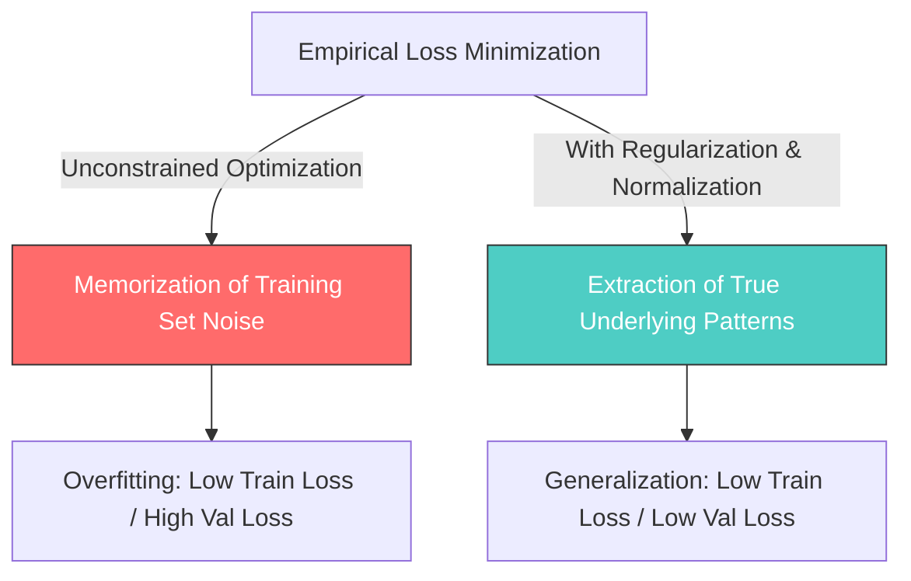

### 1.2 The Exam Memorization Analogy
Consider a student preparing for a mathematics exam. 
* **The Overfitting Student:** Instead of learning algebraic rules and geometric concepts, the student memorizes the exact numerical answers to every question on the practice exams. When the actual exam features identical questions, the student scores 100%. However, when presented with new questions testing the exact same mathematical concepts but with different numbers, the student fails. The student has memorized specific input-output pairs rather than extracting the latent rules.
* **The Generalizing Student:** This student focuses on understanding the underlying theorems, formulas, and problem-solving steps. During practice, their scores might not reach 100% immediately due to occasional arithmetic mistakes, but when presented with novel questions on the real exam, they apply their conceptual knowledge to derive the correct answers. This student has successfully generalized.

### 1.3 How to Detect Overfitting
To identify overfitting, practitioners monitor performance metrics on both the training set and an independent, non-overlapping validation set throughout the training process.

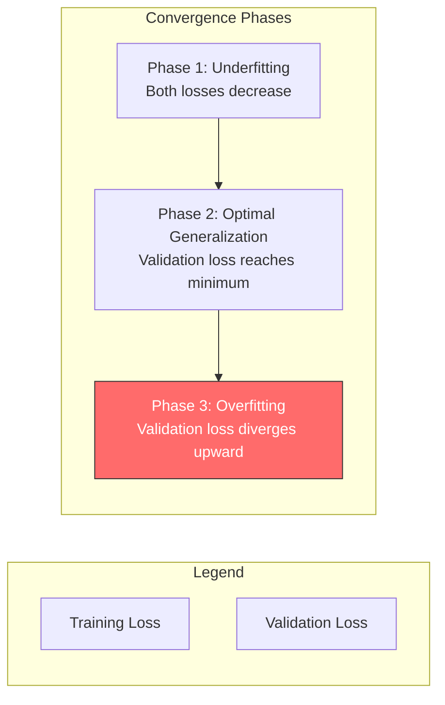

* **Underfitting:** Both training loss and validation loss remain high. The model has insufficient capacity or has not been trained long enough to learn the underlying patterns.
* **Optimal Generalization:** Training and validation losses decrease concurrently. The gap between them remains small.
* **Overfitting (Divergence Point):** The training loss continues to decrease monotonically, approaching zero. Meanwhile, the validation loss reaches a minimum and subsequently begins to rise. This inflection point marks the exact onset of overfitting.

Mathematically, overfitting is characterized by a significant generalization gap:

$$\text{Gap} = \mathcal{L}_{\text{val}}(\Theta) - \mathcal{L}_{\text{train}}(\Theta) \gg 0$$

### 1.4 Primary Causes of Overfitting
1. **Excessive Model Capacity:** Modern deep networks contain millions, sometimes billions, of parameters. According to the Universal Approximation Theorem, a sufficiently large network can represent arbitrary continuous functions. When the model's capacity vastly exceeds the complexity of the data-generating function, the network can easily find a set of parameters that passes exactly through every training point, regardless of the noise present.
2. **Insufficient Training Data:** If the training dataset is small, it cannot adequately represent the true data distribution $\mathcal{D}$. The model is forced to draw conclusions based on a non-representative sample.
3. **Over-training (Excessive Epochs):** As gradient descent continues to update parameters over hundreds of epochs, it progressively refines the decision boundary to accommodate hard, noisy training examples, making the boundary increasingly complex and less representative of the true distribution.

---

## 2. Regularization Techniques: Dropout

### 2.1 The Core Concept of Dropout
Introduced by Nitish Srivastava, Geoffrey Hinton, and colleagues in 2014, **Dropout** is an elegant and powerful explicit regularization technique. During each training forward pass, Dropout randomly deactivates (sets to zero) a fraction $p$ of the output activations of a given layer. 

By randomly disabling neurons, the network is forced to find alternative pathways to propagate information, preventing individual units from co-adapting too closely.

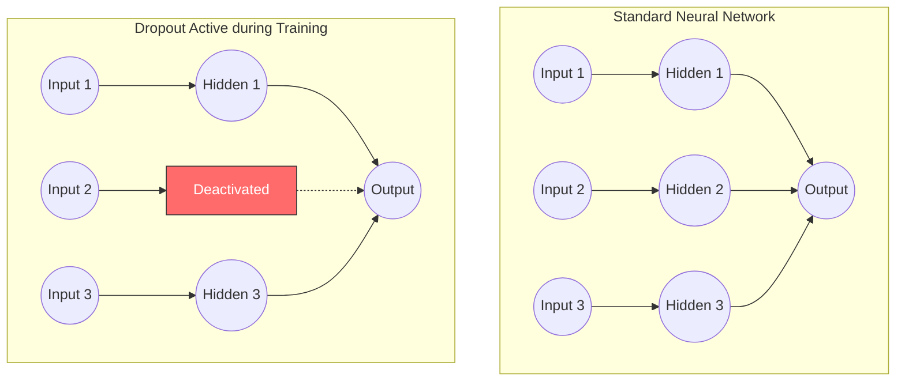

### 2.2 Mathematical Formulation and Inverted Dropout
Let $\mathbf{h} \in \mathbb{R}^d$ be the activation vector of a layer before applying Dropout. Let $p \in [0, 1)$ represent the dropout probability (the probability of deactivating a neuron). 

During training, we generate a random binary mask vector $\mathbf{r} \in \{0, 1\}^d$, where each element $r_i$ is drawn independently from a Bernoulli distribution:

$$r_i \sim \text{Bernoulli}(1 - p)$$

This means:

$$P(r_i = 1) = 1 - p, \quad P(r_i = 0) = p$$

To ensure that the expected value of the activations is preserved between training and evaluation without requiring post-hoc scaling during inference, modern deep learning frameworks implement **Inverted Dropout**. The activated vector $\tilde{\mathbf{h}}$ is formulated as:

$$\tilde{h}_i = \frac{r_i \cdot h_i}{1 - p}$$

#### Proof of Expected Value Conservation
To verify that this modification keeps the magnitude of activations consistent across modes, we compute the expected value of $\tilde{h}_i$ during training:

$$\mathbb{E}[\tilde{h}_i] = \mathbb{E}\left[ \frac{r_i \cdot h_i}{1 - p} \right]$$

Since $h_i$ is a deterministic value during this forward pass step, we can pull it out of the expectation:

$$\mathbb{E}[\tilde{h}_i] = \frac{h_i}{1 - p} \cdot \mathbb{E}[r_i]$$

The expectation of a Bernoulli random variable $r_i$ with parameter $1-p$ is simply $1-p$:

$$\mathbb{E}[r_i] = (1 \cdot P(r_i = 1)) + (0 \cdot P(r_i = 0)) = 1 - p$$

Substituting this back into our expectation formula:

$$\mathbb{E}[\tilde{h}_i] = \frac{h_i}{1 - p} \cdot (1 - p) = h_i$$

Thus, the expected activation of the normalized unit during training is exactly equal to its activation during evaluation, where no neurons are dropped ($\mathbf{r} = \mathbf{1}$). This mathematical property allows us to toggle Dropout off during inference with zero modifications to the downstream layer weights.

### 2.3 Why Dropping Neurons Prevents Overfitting

#### 1. Prevention of Co-adaptation
In an unregularized network, neurons often develop complex, fragile interdependencies during optimization. For instance, a hidden neuron $h_2$ might learn to correct the errors of an adjacent neuron $h_1$, rather than extracting a robust, independent feature. This is known as **co-adaptation**. 

Because Dropout randomly disables units, a neuron cannot rely on the presence of specific neighboring units. Each neuron must learn features that are robust and useful when paired with a wide variety of random sub-networks.

#### 2. The Ensemble Effect
A network with $n$ units can be viewed as containing $2^n$ possible sub-networks, defined by which units are active or inactive. Each training step using Dropout trains a different random sub-network. Because the weights are shared across all configurations, we are training an ensemble of $2^n$ networks simultaneously. 

At test time, when we deactivate Dropout and run the entire network, we are performing an approximate ensemble prediction. Empirically, ensemble predictions average out individual model variances and dramatically increase generalization performance.

#### 3. Stochastic Noise Injection
From a signal processing perspective, Dropout injects multiplicative Bernoulli noise into the layer activations. This noise forces the network to develop redundant representation paths. 

If one pathway detecting a critical feature is dropped, other pathways must carry the signal, forcing the network to learn multiple ways to represent key structures. This has also been formalized as a form of approximate Bayesian inference over model parameters.

### 2.4 Training vs. Evaluation Mode Behavior

> [!warning] Calling model.eval() is Non-Negotiable
> Failing to call `model.eval()` before running inference is an extremely common silent bug. If omitted, Dropout will continue to randomly zero out activations during testing, introducing unwanted stochasticity and degrading predictions. Always toggle modes explicitly.

```python
import torch
import torch.nn as nn

# Define a dropout layer with p=0.4
dropout = nn.Dropout(p=0.4)

# Create mock activations: 1 sample with 5 features
activations = torch.tensor([[1.0, 2.0, 3.0, 4.0, 5.0]])

# --- TRAINING MODE ---
dropout.train()
torch.manual_seed(42)  # For reproducibility
train_out = dropout(activations)
print("Training Output (stochastic, scaled by 1/(1-0.4) ≈ 1.6667):")
print(train_out)
# Output shows some values zeroed, others scaled up to preserve expected value.

# --- EVALUATION MODE ---
dropout.eval()
eval_out = dropout(activations)
print("\nEvaluation Output (deterministic, identical to input):")
print(eval_out)
# Output is identical to the input activations.
```

### 2.5 Spatial Dropout (Dropout2d)
Standard element-wise dropout is often ineffective in convolutional layers. In convolutional feature maps, spatially adjacent pixels are highly correlated due to the overlapping receptive fields of the filters. If you drop individual pixels randomly, the network can easily interpolate the missing values from adjacent, active pixels, defeating the regularization effect.

To resolve this, **Spatial Dropout** (`nn.Dropout2d`) drops entire **channels** (feature maps) rather than individual pixels. 

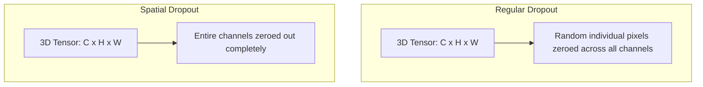

If a channel is dropped, the entire 2D feature map for that filter is zeroed out across the spatial dimensions, forcing other channels to learn complementary features.

```python
# Create a mock batch of convolutional feature maps:
# Shape: (Batch Size = 1, Channels = 3, Height = 4, Width = 4)
features = torch.ones(1, 3, 4, 4)

spatial_dropout = nn.Dropout2d(p=0.5)
spatial_dropout.train()

# Apply spatial dropout
out = spatial_dropout(features)
print("Spatial Dropout Output (Notice complete channels are zeroed):")
print(out)
```

---

## 3. Other Core Regularization Methods

### 3.1 L2 Regularization (Weight Decay)
L2 regularization penalizes the model for having large parameter weights. Large weights indicate that a small change in the input can trigger a massive change in the output, which is a symptom of high-variance, overfitted models.

We append an L2 penalty term to our standard loss function:

$$\mathcal{L}_{\text{total}}(\Theta) = \mathcal{L}_{\text{orig}}(\Theta) + \frac{\lambda}{2} \sum_{j} w_j^2$$

where $\lambda > 0$ is the regularization strength (a hyperparameter), and the sum runs over all connection weights (excluding biases, as bias regularization can lead to underfitting).

#### Mathematical Derivation of Weight Decay
When we perform gradient descent, we calculate the gradient of the total loss with respect to a weight $w_j$:

$$\frac{\partial \mathcal{L}_{\text{total}}}{\partial w_j} = \frac{\partial \mathcal{L}_{\text{orig}}}{\partial w_j} + \lambda w_j$$

The gradient descent update step with learning rate $\eta$ is:

$$w_j \leftarrow w_j - \eta \frac{\partial \mathcal{L}_{\text{total}}}{\partial w_j}$$

Substituting the gradient:

$$w_j \leftarrow w_j - \eta \left( \frac{\partial \mathcal{L}_{\text{orig}}}{\partial w_j} + \lambda w_j \right)$$

$$w_j \leftarrow (1 - \eta \lambda) w_j - \eta \frac{\partial \mathcal{L}_{\text{orig}}}{\partial w_j}$$

At each update step, the weight is multiplied by a factor $(1 - \eta \lambda)$ before receiving the standard gradient update. Because $\eta \lambda > 0$, this factor is strictly less than $1$, causing the weight to continuously decay toward zero in the absence of external gradient forces.

```python
import torch.optim as optim

# Standard formulation: Weight decay is specified within the optimizer
# For SGD, Weight Decay is mathematically equivalent to L2 Regularization
optimizer_sgd = optim.SGD(model.parameters(), lr=0.01, weight_decay=1e-4)

# For adaptive optimizers like Adam, L2 regularization interacts poorly 
# with the moving average of gradients. Thus, AdamW (Decoupled Weight Decay) is used.
optimizer_adamw = optim.AdamW(model.parameters(), lr=0.001, weight_decay=1e-2)
```

### 3.2 L1 Regularization
L1 regularization penalizes the absolute value of the weights:

$$\mathcal{L}_{\text{total}}(\Theta) = \mathcal{L}_{\text{orig}}(\Theta) + \lambda \sum_{j} |w_j|$$

#### Comparison with L2 Regularization
The gradient of the absolute value penalty with respect to a weight $w_j$ is:

$$\frac{\partial}{\partial w_j} \left( \lambda |w_j| \right) = \lambda \cdot \text{sign}(w_j)$$

where:

$$\text{sign}(w_j) = \begin{cases} 1 & \text{if } w_j > 0 \\ -1 & \text{if } w_j < 0 \\ 0 & \text{if } w_j = 0 \end{cases}$$

This means that L1 regularization applies a constant force pushing the weights toward zero, regardless of their magnitude. In contrast, L2's decaying force decreases as the weight gets closer to zero. 

Consequently, L1 regularization drives many weights exactly to zero, producing **sparse models**. This is highly beneficial for feature selection, but can sometimes restrict the distributed representation capacity of deep networks.

```python
# L1 regularization must be manually computed and added to the loss in PyTorch
def compute_l1_loss(model, lambda_l1):
    l1_penalty = 0.0
    for param in model.parameters():
        if param.requires_grad:
            l1_penalty += torch.sum(torch.abs(param))
    return lambda_l1 * l1_penalty
```

### 3.3 Early Stopping
Early stopping is a simple, non-destructive regularization method. It monitors the validation loss throughout training. When the validation loss stops improving and begins to increase for a consecutive number of epochs (defined by the `patience` hyperparameter), training is terminated, and the model weights are reverted to the best-performing checkpoint.

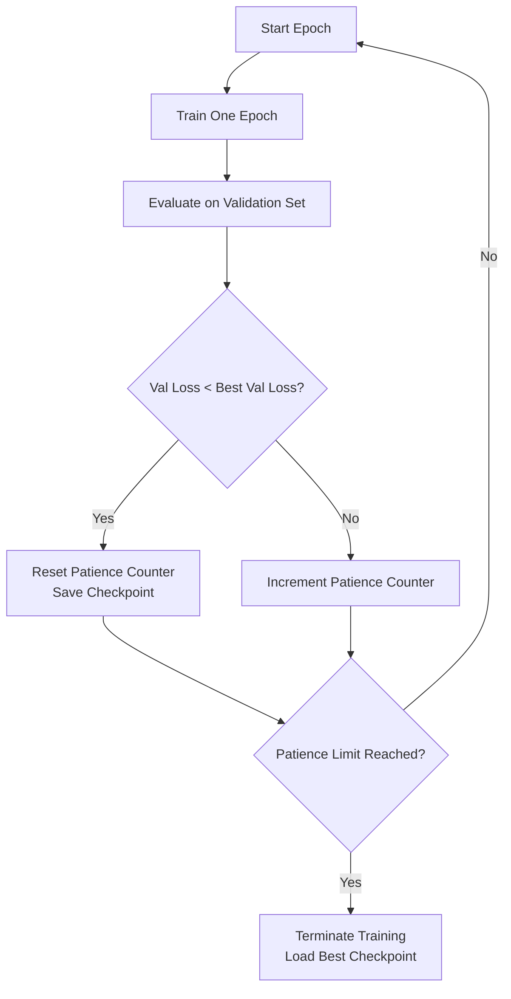

```python
class EarlyStopping:
    def __init__(self, patience=5, min_delta=1e-4):
        self.patience = patience
        self.min_delta = min_delta
        self.counter = 0
        self.best_loss = float('inf')
        self.early_stop = False

    def __call__(self, val_loss, model):
        if val_loss < self.best_loss - self.min_delta:
            self.best_loss = val_loss
            self.counter = 0
            # Save checkpoint
            torch.save(model.state_dict(), 'best_checkpoint.pth')
        else:
            self.counter += 1
            if self.counter >= self.patience:
                self.early_stop = True
```

### 3.4 Label Smoothing
In standard classification tasks, we use one-hot encoded targets, forcing the model to predict a probability of exactly $1.0$ for the true class and $0.0$ for all other classes. This encourages the network to output extremely large logit values, making the model overconfident and susceptible to overfitting.

**Label Smoothing** redistributes a fraction $\alpha$ of the target probability mass uniformly across all $K$ classes:

$$y_i^{\text{smooth}} = (1 - \alpha) \cdot y_i + \frac{\alpha}{K}$$

where $y_i$ is the original one-hot label, and $\alpha$ is a hyperparameter (typically $0.1$).

#### Numerical Demonstration of Label Smoothing
Let $K = 10$ classes, with $\alpha = 0.1$. If the true class is index $2$, the original label is:

$$\mathbf{y} = [0, 0, 1, 0, 0, 0, 0, 0, 0, 0]$$

Applying the smoothing formula:
* For the correct class ($i = 2$):

$$y_2^{\text{smooth}} = (1 - 0.1) \cdot 1 + \frac{0.1}{10} = 0.9 + 0.01 = 0.91$$

* For all incorrect classes ($i \neq 2$):

$$y_i^{\text{smooth}} = (1 - 0.1) \cdot 0 + \frac{0.1}{10} = 0.01$$

The smoothed target vector becomes:

$$\mathbf{y}^{\text{smooth}} = [0.01, 0.01, 0.91, 0.01, 0.01, 0.01, 0.01, 0.01, 0.01, 0.01]$$

This prevents the network's final softmax layer from driving logits to extreme values, smoothing the optimization landscape and improving generalization.

```python
import torch.nn as nn

# PyTorch integrates Label Smoothing directly within CrossEntropyLoss
loss_fn = nn.CrossEntropyLoss(label_smoothing=0.1)
```

---

## 4. Normalization Techniques: Batch Normalization

### 4.1 Internal Covariate Shift: The Core Problem
During training, the parameters of the early layers of a deep neural network are continuously updated. Because the outputs of early layers serve as inputs to subsequent layers, any change in these parameters alters the distribution of inputs to the deeper layers. This phenomenon — where the distribution of a layer’s input activations shifts constantly over training — is called **Internal Covariate Shift (ICS)**.

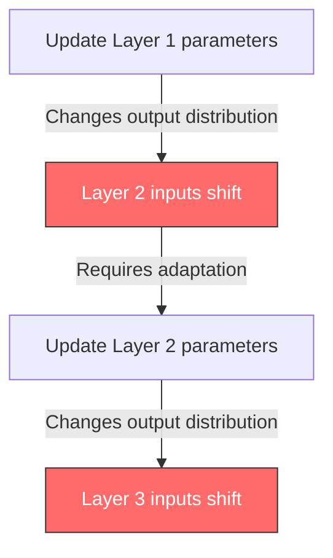

When input distributions change continuously, deeper layers are forced to adapt to a moving target, which slows down optimization. Additionally, unconstrained activation shifts can push values into the saturating regions of non-linear activation functions (such as Sigmoid or Tanh), leading to vanishing gradients.

> [!note] Optimization Landscape Smoothing
> While the original paper framed the benefits of Batch Normalization around reducing Internal Covariate Shift, subsequent research (e.g., Santurkar et al., 2018) indicates that BN's success is largely due to its ability to smooth the optimization landscape, making the loss surface less rugged and allowing for more stable, higher gradient steps.

### 4.2 The 4-Step Batch Normalization Math
Batch Normalization (Ioffe & Szegedy, 2015) addresses this issue by explicitly standardizing the activations of a layer across the current mini-batch. Let $\mathcal{B} = \{x_1, \ldots, x_m\}$ represent the activations of a specific dimension over a mini-batch of size $m$.

#### Step 1: Compute Batch Mean
The empirical mean of the mini-batch is calculated as:

$$\mu_{\mathcal{B}} = \frac{1}{m} \sum_{i=1}^{m} x_i$$

#### Step 2: Compute Batch Variance
The empirical variance of the mini-batch is calculated as:

$$\sigma_{\mathcal{B}}^2 = \frac{1}{m} \sum_{i=1}^{m} (x_i - \mu_{\mathcal{B}})^2$$

Here, we use the biased variance estimator (with a $1/m$ scaling factor) because it provides stable, mathematically clean gradients during backpropagation.

#### Step 3: Normalize
The activation is centered and scaled to achieve zero mean and unit variance:

$$\hat{x}_i = \frac{x_i - \mu_{\mathcal{B}}}{\sqrt{\sigma_{\mathcal{B}}^2 + \epsilon}}$$

The parameter $\epsilon$ is a small positive constant (typically $10^{-5}$) added to the denominator for numerical stability.

> [!tip] The Role of $\epsilon$
> If all activations in a mini-batch are identical, the variance $\sigma_{\mathcal{B}}^2$ becomes exactly $0$. Without $\epsilon$, this would lead to a division-by-zero error, producing `NaN` gradients. Setting $\epsilon = 10^{-5}$ prevents this failure mode while leaving standard computations virtually unaffected.

#### Step 4: Scale and Shift
If we restrict all activations to zero mean and unit variance, we limit the representational power of the layer. For example, if we force the inputs to a Sigmoid function to have zero mean and unit variance, the activations will be constrained to the linear region of the curve, stripping the network of its non-linear modeling capabilities.

To resolve this, BN introduces two learnable parameters for each activation channel: a scale parameter $\gamma$ and a shift parameter $\beta$. The final normalized output $y_i$ is defined as:

$$y_i = \gamma \hat{x}_i + \beta$$

During optimization, the network can learn to scale and shift the normalized distributions to any optimal range. In fact, if the network learns that the original unnormalized activations were optimal, it can simply learn $\gamma = \sqrt{\sigma_{\mathcal{B}}^2 + \epsilon}$ and $\beta = \mu_{\mathcal{B}}$, completely undoing the normalization transform.

### 4.3 Training vs. Evaluation Mode Behavior
The behavior of Batch Normalization changes fundamentally between training and inference.

#### Training Mode
During training, the mean $\mu_{\mathcal{B}}$ and variance $\sigma_{\mathcal{B}}^2$ are calculated directly from the current mini-batch. Simultaneously, BN maintains running estimates of the overall population mean and variance using an **Exponential Moving Average (EMA)**:

$$\mu_{\text{running}} \leftarrow (1 - \text{momentum}) \cdot \mu_{\text{running}} + \text{momentum} \cdot \mu_{\mathcal{B}}$$

$$\sigma^2_{\text{running}} \leftarrow (1 - \text{momentum}) \cdot \sigma^2_{\text{running}} + \text{momentum} \cdot \sigma^2_{\mathcal{B}}$$

The default momentum value in PyTorch is $0.1$.

#### Evaluation Mode
During inference, we may process a single sample (batch size = 1) or a small, non-representative test batch. Computing batch statistics under these conditions is either impossible or highly unstable. 

Thus, during evaluation, the running statistics accumulated during training are frozen and used to normalize the data:

$$y_i = \gamma \cdot \frac{x_i - \mu_{\text{running}}}{\sqrt{\sigma^2_{\text{running}} + \epsilon}} + \beta$$

This ensures that predictions are deterministic and independent of the test batch size.

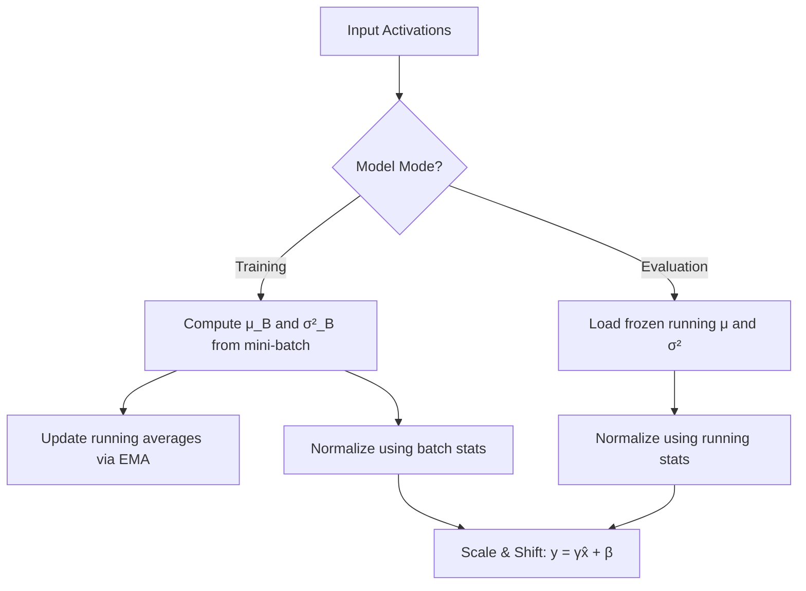

---

## 5. Advanced Normalization Dynamics and Alternatives

### 5.1 Spatial Batch Normalization on 4D Tensors
In convolutional neural networks, feature maps are represented as 4D tensors of shape $(B, C, H, W)$, where:
* $B$ is the Batch Size.
* $C$ is the Number of Channels.
* $H$ is the Height of the feature map.
* $W$ is the Width of the feature map.

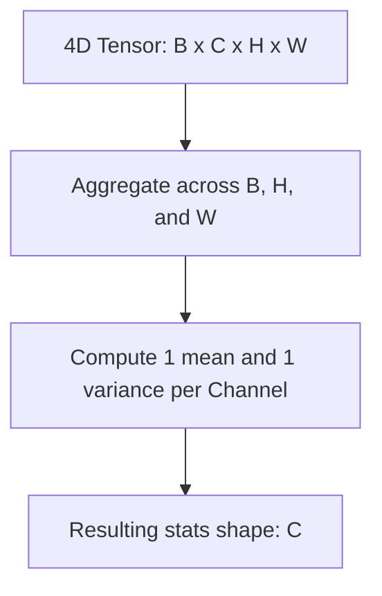

To preserve the spatial translation invariance of convolutional layers, Spatial Batch Normalization (`BatchNorm2d`) computes a single mean and variance for each **channel** $c$ across all batch elements and spatial positions. 

The effective batch size for computing the statistics of channel $c$ is $m = B \times H \times W$:

$$\mu_c = \frac{1}{B \cdot H \cdot W} \sum_{i=1}^{B} \sum_{h=1}^{H} \sum_{w=1}^{W} x_{i,c,h,w}$$

$$\sigma_c^2 = \frac{1}{B \cdot H \cdot W} \sum_{i=1}^{B} \sum_{h=1}^{H} \sum_{w=1}^{W} (x_{i,c,h,w} - \mu_c)^2$$

### 5.2 Why BatchNorm is Broken for Batch Size = 1
If we attempt to train a model with a batch size of $1$ using Batch Normalization, training collapses.

#### Mathematical Proof:
Let $m=1$. For a single sample $x_1$, the batch mean is:

$$\mu_{\mathcal{B}} = \frac{1}{1} \sum_{i=1}^{1} x_i = x_1$$

The biased variance calculation is:

$$\sigma_{\mathcal{B}}^2 = \frac{1}{1} (x_1 - \mu_{\mathcal{B}})^2 = (x_1 - x_1)^2 = 0$$

Substituting these values into the normalization step:

$$\hat{x}_1 = \frac{x_1 - \mu_{\mathcal{B}}}{\sqrt{\sigma_{\mathcal{B}}^2 + \epsilon}} = \frac{x_1 - x_1}{\sqrt{0 + \epsilon}} = 0$$

Applying the scale and shift:

$$y_1 = \gamma \hat{x}_1 + \beta = \gamma \cdot 0 + \beta = \beta$$

For any input value $x_1$, the output is reduced to the constant value $\beta$. The model cannot propagate any information from the input activations, rendering training impossible.

### 5.3 Batch Normalization vs. Dropout Comparison

| Feature | Batch Normalization | Dropout |
| :--- | :--- | :--- |
| **Primary Goal** | Smooths optimization landscape, accelerates training. | Prevents co-adaptation, reduces overfitting. |
| **Operational Step** | Standardizes activations across a mini-batch. | Randomly deactivates activations. |
| **Stochasticity Source** | Fluctuations in mini-batch composition. | Random Bernoulli sampling. |
| **Learnable Parameters** | Yes ($\gamma$, $\beta$). | No. |
| **Inference Behavior** | Uses frozen running statistics. | Completely disabled. |
| **Batch Size Sensitivity**| Extremely high (fails for very small batches). | Completely independent. |

> [!tip] Co-existence Conflict
> When used together in deep convolutional layers, Batch Normalization and Dropout can sometimes conflict. Dropout changes the distribution of activations on each forward pass, which corrupts the running statistics computed by BN. This can lead to a shift in representation between training and evaluation. In modern convolutional architectures, it is standard practice to use Batch Normalization without Dropout, or to use a reduced Dropout rate (e.g., $p=0.1\text{--}0.2$).

### 5.4 Alternative Normalization Methods
When memory constraints force the use of small batch sizes (e.g., in high-resolution image segmentation or video analysis), Batch Normalization can degrade model performance. Under these conditions, several alternative normalization techniques are available.

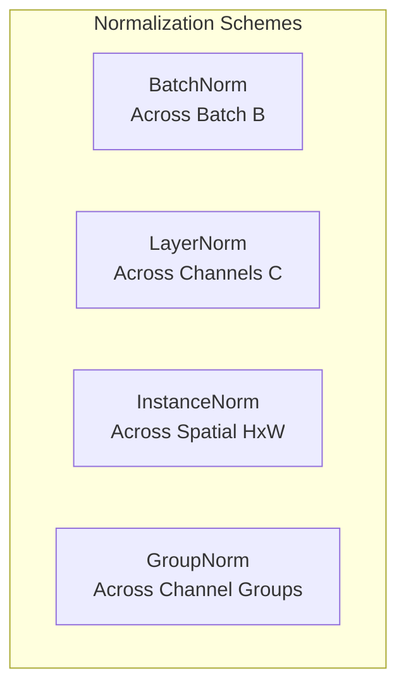

#### Layer Normalization (LN)
Layer Normalization (Ba et al., 2016) computes statistics across all channels for each sample individually, making it completely independent of batch size. It is widely used in natural language processing and Transformer architectures.

$$\mu_i = \frac{1}{C \cdot H \cdot W} \sum_{c=1}^C \sum_{h=1}^H \sum_{w=1}^W x_{i,c,h,w}$$

```python
import torch.nn as nn
# Apply Layer Normalization to a specific spatial activation volume
layer_norm = nn.LayerNorm(normalized_shape=[64, 28, 28])
```

#### Instance Normalization (IN)
Instance Normalization (Ulyanov et al., 2016) normalizes each channel of each sample independently, calculating statistics solely across the spatial dimensions. It is highly effective in style transfer and generative models (such as GANs), where removing style-specific contrast information is desirable.

$$\mu_{i,c} = \frac{1}{H \cdot W} \sum_{h=1}^H \sum_{w=1}^W x_{i,c,h,w}$$

```python
# Apply Instance Normalization to 2D feature maps
instance_norm = nn.InstanceNorm2d(num_features=64)
```

#### Group Normalization (GN)
Group Normalization (Wu & He, 2018) divides the channels of a feature map into $G$ groups, and computes normalization statistics across the channels within each group. This retains the benefits of Layer Normalization while allowing different groups of channels to represent distinct types of features.

$$\mu_{i,g} = \frac{1}{(C/G) \cdot H \cdot W} \sum_{c \in \text{Group}_g} \sum_{h=1}^H \sum_{w=1}^W x_{i,c,h,w}$$

```python
# Apply Group Normalization: 64 channels split into 4 groups (16 channels per group)
group_norm = nn.GroupNorm(num_groups=4, num_channels=64)
```

---

## 6. Data Augmentation: Principles and Geometric Transforms

### 6.1 The Philosophy of Data Augmentation
A deep neural network does not have an innate understanding of physical reality. To a CNN, an image is simply a grid of pixel values. It does not know that an object remains the same regardless of its orientation, position, illumination, or scale. 

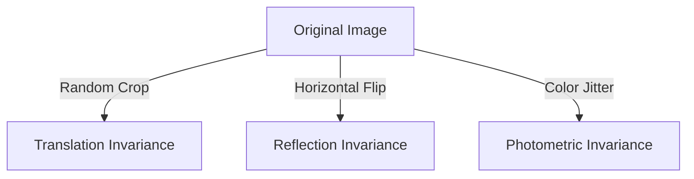

**Data Augmentation** artificial expands the training dataset by applying random, label-preserving transformations to existing training images. This teaches the network specific invariances, preventing it from memorizing the absolute positions or specific lighting conditions of the training set.

### 6.2 Geometric Transformations

#### Horizontal Flip
Horizontal flipping mirrors an image left-to-right. For natural image datasets (such as ImageNet or CIFAR), horizontal reflection preserves the class label (e.g., a horizontally flipped cat is still a cat). This transformation effectively doubles the size of the dataset.

> [!warning] When NOT to Flip Horizontally
> In specific domains, horizontal flipping can alter the meaning of the image and invalidate the target label. For example, in handwritten digit recognition (e.g., MNIST), a flipped "6" can resemble a "2" or a "5", and a flipped "7" is invalid. In text recognition (OCR), flipping renders the characters unreadable. Always check if reflection invariance holds for your specific task.

```python
import torchvision.transforms as T
# Flip horizontally with a 50% probability
horizontal_flip = T.RandomHorizontalFlip(p=0.5)
```

#### Random Crop
Random cropping extracts a smaller, rectangular patch from a randomly selected location within the image. This teaches the network **translation invariance** — the object of interest does not have to be centered in the frame to be recognized.

```python
# Resize the input image to 256x256, then extract a random 224x224 patch
crop_pipeline = T.Compose([
    T.Resize(256),
    T.RandomCrop(224)
])
```

#### Random Resized Crop
The standard pipeline for training deep networks uses `RandomResizedCrop`. This transformation extracts a random crop of the image with a highly variable crop area (scale) and aspect ratio, and then resizes the crop to a fixed target size (e.g., $224 \times 224$). 

This single operation introduces translation, scale, and aspect ratio variations in one step.

```python
# Crops a random region of area between 8% and 100% of the original,
# with an aspect ratio between 3/4 and 4/3, and resizes to 224x224.
random_resized_crop = T.RandomResizedCrop(
    size=224,
    scale=(0.08, 1.0),
    ratio=(0.75, 1.333)
)
```

#### Random Rotation
Random rotation rotates the image by a randomly chosen angle $\theta \in [-\theta_{\text{max}}, \theta_{\text{max}}]$. 

This introduces orientation invariance. Rotating an image by an arbitrary angle requires filling the empty areas outside the rotated boundary (typically filled with zero/black pixels).

```python
# Rotate the image randomly by an angle between -15 and +15 degrees
rotation = T.RandomRotation(degrees=15)
```

---

## 7. Pixel-Level and Advanced Augmentation Techniques

### 7.1 Pixel-Level Transformations

#### Color Jitter
Color Jitter randomly modifies the brightness, contrast, saturation, and hue of an image, teaching the network **photometric invariance**. This prevents the network from relying on specific color schemes or lighting conditions, which can vary significantly in real-world deployment.

```python
# Apply random photometric transformations
color_jitter = T.ColorJitter(
    brightness=0.2,   # Brightness scale range: [0.8, 1.2]
    contrast=0.2,     # Contrast scale range: [0.8, 1.2]
    saturation=0.2,   # Saturation scale range: [0.8, 1.2]
    hue=0.05          # Hue shift range: [-0.05, 0.05] (use conservatively!)
)
```

#### Gaussian Noise
Adding random Gaussian noise to each pixel simulates sensor noise, which is common in low-light photography or medical imaging. This forces the network to rely on coarse structures rather than high-frequency pixel details.

```python
class AddGaussianNoise(object):
    def __init__(self, mean=0.0, std=0.05):
        self.mean = mean
        self.std = std

    def __call__(self, tensor):
        # Noise is added directly to normalized PyTorch Tensors
        noise = torch.randn(tensor.size()) * self.std + self.mean
        return torch.clamp(tensor + noise, 0.0, 1.0)
```

#### Random Erasing (Cutout)
Random Erasing (Zhong et al., 2017) selects a random rectangular region in the image and replaces its pixels with random values or a constant gray value. This simulates **occlusion**, forcing the network to identify objects using multiple, independent features rather than relying on a single critical region (e.g., identifying a dog by its face alone).

```python
# Apply random erasing to 50% of the inputs
random_erasing = T.RandomErasing(p=0.5, scale=(0.02, 0.2), value='random')
```

### 7.2 Advanced Augmentation Strategies

```mermaid
graph TD
    subgraph Mixup Transformation
        A[Image A: Cat] + B[Image B: Dog] -->|Linear Interpolation| C[Mixed Image: 70% Cat, 30% Dog]
    end
    subgraph CutMix Transformation
        D[Image A: Cat] -->|Replace Patch| E[Image B: Dog] --> F[Hybrid Image: Cat with Dog Patch]
    end
```

#### Mixup
Mixup (Zhang et al., 2018) generates synthetic training examples by taking a weighted average of two randomly selected training images and their corresponding one-hot encoded targets:

$$\tilde{x} = \lambda x_A + (1 - \lambda) x_B$$

$$\tilde{y} = \lambda y_A + (1 - \lambda) y_B$$

where $\lambda \sim \text{Beta}(\alpha, \alpha)$ and $\lambda \in [0, 1]$. This forces the network to exhibit smooth linear transitions between classes, reducing overconfidence and improving out-of-distribution robustness.

#### CutMix
CutMix (Yun et al., 2019) replaces a randomly selected rectangular region of image $A$ with a patch from image $B$. The target label is adjusted proportionally to the area of the pasted patch:

$$\tilde{y} = \lambda y_A + (1 - \lambda) y_B$$

where $\lambda$ represents the fraction of the image area retained from image $A$.

---

## 8. Integrated PyTorch Pipelines and Implementation

### 8.1 Custom Transformation Pipeline Mechanics
PyTorch’s `torchvision.transforms.Compose` sequences multiple transformations. 

When constructing a pipeline, the ordering of the operations is critical. Some operations can only run on PIL images, while others must run on PyTorch tensors.

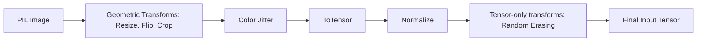

### 8.2 Under the Hood of ToTensor() and Normalize()

#### ToTensor()
When `T.ToTensor()` is applied to a PIL image or NumPy array, it performs three operations:
1. Converts the datatype from 8-bit unsigned integers (`uint8` with range $[0, 255]$) to 32-bit floating-point numbers (`float32`).
2. Scales all pixel values by dividing by $255.0$, transforming the range to $[0.0, 1.0]$.
3. Transposes the dimension ordering from channels-last format ($H \times W \times C$) used by PIL/NumPy to channels-first format ($C \times H \times W$) required by PyTorch.

#### Normalize()
The normalization transform is defined as:

$$\text{Output}[c] = \frac{\text{Input}[c] - \text{Mean}[c]}{\text{Std}[c]}$$

For models pre-trained on the ImageNet dataset, the standard normalization parameters are:

$$\text{Mean} = [0.485, 0.456, 0.406], \quad \text{Std} = [0.229, 0.224, 0.225]$$

These parameters must be used during evaluation on downstream tasks to ensure the input distribution matches the pre-trained weights.

### 8.3 Computing Custom Dataset Statistics
When training a model from scratch on a unique dataset (such as medical images or satellite photos), you should compute custom mean and standard deviation parameters across the entire training set.

```python
import torch
from torch.utils.data import DataLoader

def compute_dataset_mean_std(dataset):
    # Use ToTensor() only to load images in the [0.0, 1.0] range
    loader = DataLoader(dataset, batch_size=64, shuffle=False, num_workers=4)
    
    channels_sum = torch.zeros(3)
    channels_squared_sum = torch.zeros(3)
    num_pixels = 0

    for images, _ in loader:
        # Image shape: [Batch, Channels, Height, Width]
        batch_size, num_channels, height, width = images.shape
        pixels_per_channel = batch_size * height * width
        num_pixels += pixels_per_channel
        
        # Sum pixel values across batch, height, and width dimensions
        channels_sum += torch.sum(images, dim=[0, 2, 3])
        channels_squared_sum += torch.sum(images ** 2, dim=[0, 2, 3])

    mean = channels_sum / num_pixels
    
    # Standard Deviation formula: Std = sqrt( E[X^2] - (E[X])^2 )
    std = torch.sqrt((channels_squared_sum / num_pixels) - (mean ** 2))
    
    return mean.tolist(), std.tolist()
```

### 8.4 Production-Grade Training and Evaluation Script
This script implements a complete training pipeline using a Custom CNN with modern normalization, regularization, and data augmentation methods.

```python
import torch
import torch.nn as nn
import torch.optim as optim
import torchvision.transforms as T
from torch.utils.data import DataLoader
from torchvision.datasets import CIFAR10

# ============================================================
# 1. DEFINE PIPELINES: TRAINING VS. VALIDATION
# ============================================================

# Standard ImageNet normalization stats
IMAGENET_MEAN = [0.485, 0.456, 0.406]
IMAGENET_STD = [0.229, 0.224, 0.225]

train_transform = T.Compose([
    # Geometric Augmentations
    T.RandomResizedCrop(32, scale=(0.8, 1.0), ratio=(0.9, 1.1)),
    T.RandomHorizontalFlip(p=0.5),
    T.RandomRotation(degrees=10),
    # Photometric Augmentations
    T.ColorJitter(brightness=0.1, contrast=0.1, saturation=0.1),
    # Conversion
    T.ToTensor(),
    T.Normalize(mean=IMAGENET_MEAN, std=IMAGENET_STD),
    # Tensor-Only Augmentations
    T.RandomErasing(p=0.2, scale=(0.02, 0.1), value='random')
])

# Validation pipeline must remain strictly deterministic
val_transform = T.Compose([
    T.Resize(32),
    T.ToTensor(),
    T.Normalize(mean=IMAGENET_MEAN, std=IMAGENET_STD)
])

# ============================================================
# 2. DATA LOADERS
# ============================================================

train_dataset = CIFAR10(root='./data', train=True, download=True, transform=train_transform)
val_dataset = CIFAR10(root='./data', train=False, download=True, transform=val_transform)

train_loader = DataLoader(train_dataset, batch_size=128, shuffle=True, num_workers=4, pin_memory=True)
val_loader = DataLoader(val_dataset, batch_size=128, shuffle=False, num_workers=4, pin_memory=True)

# ============================================================
# 3. CUSTOM CNN WITH MODERN BN & DROPOUT
# ============================================================

class ConvBlock(nn.Module):
    def __init__(self, in_channels, out_channels):
        super(ConvBlock, self).__init__()
        # Omit bias in Conv2d when immediately followed by BatchNorm2d
        self.conv = nn.Conv2d(in_channels, out_channels, kernel_size=3, padding=1, bias=False)
        self.bn = nn.BatchNorm2d(out_channels)
        self.relu = nn.ReLU(inplace=True)

    def forward(self, x):
        return self.relu(self.bn(self.conv(x)))

class RegularizedCNN(nn.Module):
    def __init__(self, num_classes=10):
        super(RegularizedCNN, self).__init__()
        self.features = nn.Sequential(
            ConvBlock(3, 32),
            ConvBlock(32, 64),
            nn.MaxPool2d(2, 2), # Output: 16x16
            
            ConvBlock(64, 128),
            ConvBlock(128, 128),
            nn.MaxPool2d(2, 2)  # Output: 8x8
        )
        
        self.classifier = nn.Sequential(
            nn.Linear(128 * 8 * 8, 256),
            nn.ReLU(inplace=True),
            # Classic dropout applied to the fully connected layers
            nn.Dropout(p=0.4),
            nn.Linear(256, num_classes)
        )

    def forward(self, x):
        x = self.features(x)
        x = torch.flatten(x, 1)
        x = self.classifier(x)
        return x

# ============================================================
# 4. INITIALIZATION, OPTIMIZER, AND REGULARIZATION CONFIG
# ============================================================

device = torch.device('cuda' if torch.cuda.is_available() else 'cpu')
model = RegularizedCNN(num_classes=10).to(device)

# CrossEntropyLoss with Label Smoothing
criterion = nn.CrossEntropyLoss(label_smoothing=0.1)

# AdamW with Decoupled Weight Decay
optimizer = optim.AdamW(model.parameters(), lr=0.001, weight_decay=1e-3)

# ============================================================
# 5. INTEGRATED TRAINING LOOP
# ============================================================

num_epochs = 50
patience = 5
best_val_loss = float('inf')
patience_counter = 0

for epoch in range(num_epochs):
    # --- TRAINING ---
    model.train() # Enable Dropout and BN batch tracking
    running_loss = 0.0
    correct = 0
    total = 0
    
    for images, labels in train_loader:
        images, labels = images.to(device), labels.to(device)
        
        optimizer.zero_grad()
        outputs = model(images)
        loss = criterion(outputs, labels)
        loss.backward()
        optimizer.step()
        
        running_loss += loss.item() * images.size(0)
        _, preds = outputs.max(1)
        total += labels.size(0)
        correct += preds.eq(labels).sum().item()
        
    train_loss = running_loss / total
    train_acc = (correct / total) * 100.0

    # --- EVALUATION ---
    model.eval() # Freeze BN running statistics and disable Dropout
    val_running_loss = 0.0
    val_correct = 0
    val_total = 0
    
    with torch.no_grad(): # Disable gradient graph construction
        for images, labels in val_loader:
            images, labels = images.to(device), labels.to(device)
            outputs = model(images)
            loss = criterion(outputs, labels)
            
            val_running_loss += loss.item() * images.size(0)
            _, preds = outputs.max(1)
            val_total += labels.size(0)
            val_correct += preds.eq(labels).sum().item()
            
    val_loss = val_running_loss / val_total
    val_acc = (val_correct / val_total) * 100.0
    
    print(f"Epoch {epoch+1:02d} | Train Loss: {train_loss:.4f} Acc: {train_acc:.2f}% | Val Loss: {val_loss:.4f} Acc: {val_acc:.2f}%")

    # --- EARLY STOPPING CHECK ---
    if val_loss < best_val_loss:
        best_val_loss = val_loss
        patience_counter = 0
        torch.save(model.state_dict(), 'best_model.pth')
    else:
        patience_counter += 1
        if patience_counter >= patience:
            print("Early stopping triggered. Reverting to best validation checkpoint.")
            break
```